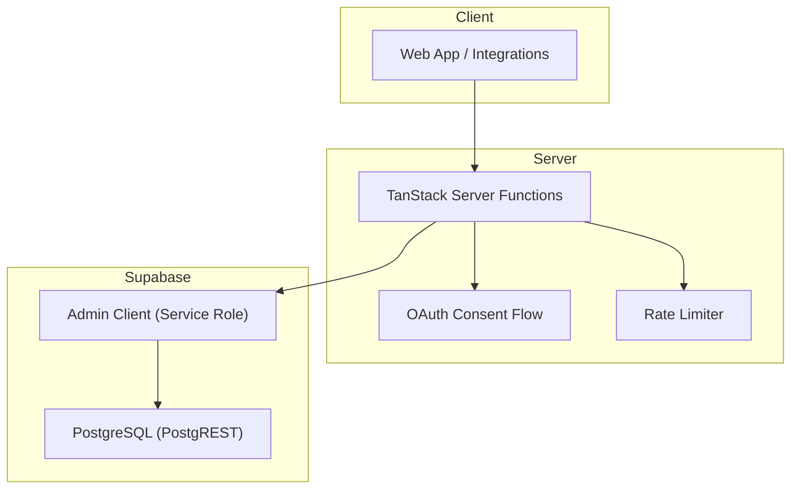
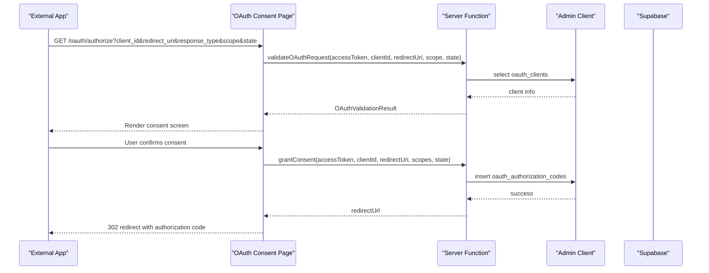
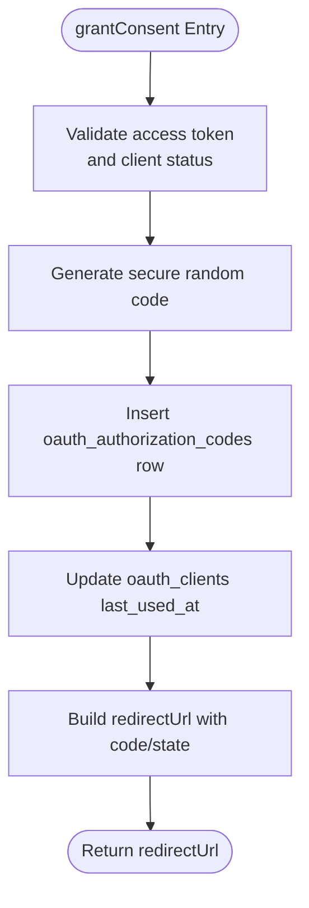
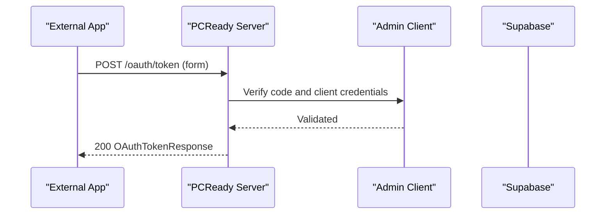
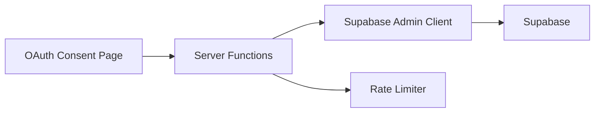

# API Reference

<cite>
**Referenced Files in This Document**
- [openapi.yaml](file://public/openapi/openapi.yaml)
- [client.server.ts](file://src/integrations/supabase/client.server.ts)
- [oauth-consent.ts](file://src/lib/oauth-consent.ts)
- [oauth-scopes.ts](file://src/lib/oauth-scopes.ts)
- [oauth.consent.tsx](file://src/routes/_app/oauth.consent.tsx)
- [rate-limit.ts](file://src/lib/rate-limit.ts)
- [audit-log-actions.ts](file://src/lib/audit-log-actions.ts)
- [wrangler.jsonc](file://wrangler.jsonc)
- [database.types.ts](file://src/types/database.types.ts)
</cite>

## Table of Contents

1. [Introduction](#introduction)
2. [Project Structure](#project-structure)
3. [Core Components](#core-components)
4. [Architecture Overview](#architecture-overview)
5. [Detailed Component Analysis](#detailed-component-analysis)
6. [Dependency Analysis](#dependency-analysis)
7. [Performance Considerations](#performance-considerations)
8. [Troubleshooting Guide](#troubleshooting-guide)
9. [Conclusion](#conclusion)
10. [Appendices](#appendices)

## Introduction

This document describes the PCReady API surface, covering:

- Supabase-backed REST endpoints exposed via PostgREST
- TanStack Server Functions used for server-side logic and OAuth flows
- OAuth 2.0 authorization and token exchange endpoints
- OpenAPI specification and Swagger UI integration
- Authentication, rate limiting, security, and operational guidance

The API targets administrators, developers integrating external applications, and internal tooling.

## Project Structure

High-level API-related components:

- Supabase integration: server-side admin client and typed database access
- TanStack Server Functions: OAuth consent, admin operations, and server-side helpers
- OpenAPI: machine-readable spec and Swagger UI integration
- Routing and UI: OAuth consent page and client-side server function usage

**Diagram sources**

- [client.server.ts:1-42](file://src/integrations/supabase/client.server.ts#L1-L42)
- [oauth-consent.ts:1-520](file://src/lib/oauth-consent.ts#L1-L520)
- [rate-limit.ts:1-104](file://src/lib/rate-limit.ts#L1-L104)
- [openapi.yaml:1-1146](file://public/openapi/openapi.yaml#L1-L1146)

**Section sources**

- [client.server.ts:1-42](file://src/integrations/supabase/client.server.ts#L1-L42)
- [wrangler.jsonc:1-7](file://wrangler.jsonc#L1-L7)
- [database.types.ts:1-1](file://src/types/database.types.ts#L1-L1)

## Core Components

- Supabase REST API: Public PostgREST endpoints for tickets, devices, clients, notifications, checklist templates, versions, app settings, email templates, activity log, and OAuth client lifecycle.
- TanStack Server Functions: Server-side functions for OAuth validation/grant/deny, admin OAuth client management, automation run triggers, and admin user operations.
- OAuth 2.0: Authorization endpoint, consent page, and token exchange endpoint.
- OpenAPI: Full specification with security schemes, parameters, and schemas.
- Rate Limiting: In-process sliding window with optional Redis backend.

**Section sources**

- [openapi.yaml:44-708](file://public/openapi/openapi.yaml#L44-L708)
- [oauth-consent.ts:140-254](file://src/lib/oauth-consent.ts#L140-L254)
- [rate-limit.ts:30-104](file://src/lib/rate-limit.ts#L30-L104)

## Architecture Overview

The API combines:

- Public PostgREST endpoints for data operations (tickets, devices, clients, etc.) protected by RLS policies
- TanStack Server Functions for privileged operations (OAuth admin, automation run, admin user ops) using a service-role client
- OAuth flows handled by server functions with user consent rendered in the UI

**Diagram sources**

- [openapi.yaml:487-574](file://public/openapi/openapi.yaml#L487-L574)
- [oauth-consent.ts:140-254](file://src/lib/oauth-consent.ts#L140-L254)
- [oauth.consent.tsx:35-114](file://src/routes/_app/oauth.consent.tsx#L35-L114)

## Detailed Component Analysis

### Supabase REST API Endpoints

Public endpoints backed by PostgREST. Authentication uses:

- Supabase Bearer JWT in Authorization header
- Supabase anonymous API key via apikey header for specific flows

Common query parameters:

- select: projection filter
- order: sort expression
- limit: row limit
- Prefer: return representation

Responses:

- 200 OK with array or object
- 201 Created on insert
- 200 OK on update
- 204 No Content on delete

Security:

- RLS policies govern access by roles (admin, tech, viewer)

Key endpoints:

- GET/POST/PATCH/DELETE /tickets
- GET/POST/PATCH /devices
- GET/POST/PATCH /clients
- GET/POST /client_contacts
- GET/PATCH /notifications
- GET/POST/PATCH/DELETE /checklist_templates
- GET /entity_versions
- GET/PATCH /app_settings
- GET/POST/PATCH/DELETE /email_templates
- GET /activity_log
- GET /oauth/authorize
- POST /oauth/consent
- POST /oauth/token
- POST /api/automations/run
- POST /api/automations/run-logs
- POST /api/automations/run-stats
- POST /api/admin/users/invite
- POST /api/admin/users/update
- POST /api/admin/users/disable
- POST /api/admin/users/delete

Authentication headers:

- Authorization: Bearer <JWT>
- apikey: <anon-key> (where applicable)

Error responses:

- 400 Bad Request for invalid parameters
- 401 Unauthorized for missing/expired/invalid JWT
- 403 Forbidden for insufficient permissions
- 429 Too Many Requests (rate limiting)
- 500 Internal Server Error for server failures

**Section sources**

- [openapi.yaml:44-708](file://public/openapi/openapi.yaml#L44-L708)

### TanStack Server Functions (OAuth and Admin)

Server functions provide privileged operations and user-facing flows.

- validateOAuthRequest
  - Validates client_id, redirect_uri, scope against stored client
  - Enforces active client status and allowed scopes
  - Returns OAuthValidationResult

- grantConsent
  - Generates authorization code with expiry
  - Updates client last_used_at
  - Returns redirectUrl with code and optional state

- denyConsent
  - Builds redirectUrl with access_denied error

- listOAuthClients, createOAuthClient, setOAuthClientStatus, rotateOAuthClientSecret
  - Admin-only operations using service role client
  - Includes audit logging and rate limiting for creation

- getOAuthClientLifecycle
  - Returns consent history, authorization events, and admin events

- completeTicketServer
  - Server function to complete a ticket with access token and validation

- createTicket
  - Creates a ticket using a user access token and applies rate limits

**Diagram sources**

- [oauth-consent.ts:197-254](file://src/lib/oauth-consent.ts#L197-L254)

**Section sources**

- [oauth-consent.ts:140-254](file://src/lib/oauth-consent.ts#L140-L254)
- [oauth-consent.ts:265-437](file://src/lib/oauth-consent.ts#L265-L437)
- [oauth-consent.ts:443-520](file://src/lib/oauth-consent.ts#L443-L520)
- [oauth-scopes.ts:1-65](file://src/lib/oauth-scopes.ts#L1-L65)
- [oauth.consent.tsx:35-114](file://src/routes/_app/oauth.consent.tsx#L35-L114)

### OAuth 2.0 Endpoints

- Authorization endpoint
  - Method: GET
  - Path: /oauth/authorize
  - Query parameters: client_id, redirect_uri, response_type (code), scope, state
  - Behavior: Delegates to server function for validation and consent rendering

- Consent endpoint
  - Method: POST
  - Path: /oauth/consent
  - Body: client_id, redirect_uri, scope, state
  - Behavior: Denies consent and redirects with error

- Token endpoint
  - Method: POST
  - Path: /oauth/token
  - Form-encoded body: grant_type (authorization_code), code, client_id, client_secret, redirect_uri
  - Response: access_token, token_type, expires_in, refresh_token, scope

**Diagram sources**

- [openapi.yaml:547-574](file://public/openapi/openapi.yaml#L547-L574)
- [oauth-consent.ts:218-239](file://src/lib/oauth-consent.ts#L218-L239)

**Section sources**

- [openapi.yaml:487-574](file://public/openapi/openapi.yaml#L487-L574)
- [oauth-consent.ts:196-254](file://src/lib/oauth-consent.ts#L196-L254)

### Automation and Admin Server Functions

- POST /api/automations/run
  - Body: RunAutomationNowRequest (automationId, isDryRun, triggerPayload)
  - Response: AutomationRunLog

- POST /api/automations/run-logs
  - Body: automationId (UUID)
  - Response: array of AutomationRunLog

- POST /api/automations/run-stats
  - Response: AutomationRunStatsResponse (stats, kpis)

- Admin user operations
  - POST /api/admin/users/invite
  - POST /api/admin/users/update
  - POST /api/admin/users/disable
  - POST /api/admin/users/delete

**Section sources**

- [openapi.yaml:575-708](file://public/openapi/openapi.yaml#L575-L708)
- [oauth-consent.ts:294-400](file://src/lib/oauth-consent.ts#L294-L400)

### OpenAPI Specification and Swagger UI Integration

- OpenAPI 3.0.3 specification defines:
  - Servers: Supabase REST and PCReady Server Functions
  - Security: bearerAuth (JWT) and supabaseAnonKey (apikey)
  - Tags: Tickets, Devices, Clients, Contacts, Automations, OAuth, Notifications, Checklist, Versioning, Admin, EmailTemplates
  - Paths: All endpoints listed above
  - Schemas: Typed request/response models for all resources

Swagger UI integration:

- The spec is served under public/openapi/openapi.yaml
- Configure your deployment to serve this file and mount Swagger UI to render it

**Section sources**

- [openapi.yaml:1-43](file://public/openapi/openapi.yaml#L1-L43)
- [openapi.yaml:44-1146](file://public/openapi/openapi.yaml#L44-L1146)

## Dependency Analysis

- Server-side Supabase client
  - Uses service role key to bypass RLS for privileged operations
  - Environment variables: SUPABASE_URL, SUPABASE_SERVICE_ROLE_KEY
  - Exposed via a singleton proxy to avoid reinitialization

- OAuth consent flow
  - Client-side route validates search params and calls server functions
  - Server functions validate and enforce client status, scopes, and redirect URIs
  - Authorization codes are short-lived and tracked for lifecycle insights

- Rate limiting
  - In-memory sliding window with optional Redis backend via Upstash
  - Dedicated presets for various operations
  - 429 responses include Retry-After and X-RateLimit-\* headers

**Diagram sources**

- [client.server.ts:8-41](file://src/integrations/supabase/client.server.ts#L8-L41)
- [oauth-consent.ts:294-343](file://src/lib/oauth-consent.ts#L294-L343)
- [rate-limit.ts:30-104](file://src/lib/rate-limit.ts#L30-L104)

**Section sources**

- [client.server.ts:1-42](file://src/integrations/supabase/client.server.ts#L1-L42)
- [oauth-consent.ts:1-520](file://src/lib/oauth-consent.ts#L1-L520)
- [rate-limit.ts:1-104](file://src/lib/rate-limit.ts#L1-L104)

## Performance Considerations

- Prefer selective projections (select) and appropriate ordering (order) to reduce payload sizes
- Use limit to cap result sets for paginated lists
- Apply filters (e.g., status, client_id) to minimize scans
- Batch operations where possible; leverage Prefer: return=minimal for updates when not needing returned rows
- For high-frequency operations, enable Redis-backed rate limiting to scale beyond single-process limits

[No sources needed since this section provides general guidance]

## Troubleshooting Guide

Common issues and resolutions:

- 401 Unauthorized
  - Ensure Authorization: Bearer <JWT> is present and valid
  - Verify the JWT belongs to an active user with proper roles

- 403 Forbidden
  - RLS denies access; confirm user role and resource ownership
  - For OAuth admin operations, ensure the user has admin role

- 400 Bad Request (OAuth)
  - Invalid client_id, redirect_uri not registered, or invalid scopes
  - Confirm client registration and allowed scopes

- 429 Too Many Requests
  - Respect Retry-After and back off
  - Consider reducing request frequency or enabling distributed rate limiting

- 500 Internal Server Error
  - Server-side failures during privileged operations
  - Check server logs and environment variables for Supabase configuration

**Section sources**

- [oauth-consent.ts:140-194](file://src/lib/oauth-consent.ts#L140-L194)
- [rate-limit.ts:74-104](file://src/lib/rate-limit.ts#L74-L104)

## Conclusion

PCReady exposes a cohesive API combining Supabase-backed REST endpoints and TanStack Server Functions for privileged operations. The OAuth 2.0 stack provides secure, auditable consent flows with granular scopes. The OpenAPI specification and Swagger UI enable discoverability and testing. Follow the security, rate limiting, and performance recommendations to build reliable integrations.

[No sources needed since this section summarizes without analyzing specific files]

## Appendices

### Authentication Methods

- Supabase Bearer JWT
  - Header: Authorization: Bearer <JWT>
  - Used for user-authenticated PostgREST operations and server functions requiring user context

- Supabase Anonymous API Key
  - Header: apikey: <anon-key>
  - Used for specific public flows where anonymous access is permitted

- OAuth Bearer
  - Used for token endpoint requests and protected server functions

**Section sources**

- [openapi.yaml:18-21](file://public/openapi/openapi.yaml#L18-L21)
- [client.server.ts:8-29](file://src/integrations/supabase/client.server.ts#L8-L29)

### Rate Limiting

- Preset configurations for various operations
- In-memory sliding window with optional Redis backend
- 429 responses include Retry-After and X-RateLimit-\* headers

**Section sources**

- [rate-limit.ts:30-104](file://src/lib/rate-limit.ts#L30-L104)

### Security Considerations

- Use service role client only for server-side privileged operations
- Enforce admin checks for OAuth client lifecycle operations
- Audit sensitive actions (client created/enabled/disabled/revoked, secret rotated)
- Validate redirect URIs and scopes strictly
- Short expiration for authorization codes

**Section sources**

- [client.server.ts:33-41](file://src/integrations/supabase/client.server.ts#L33-L41)
- [oauth-consent.ts:37-48](file://src/lib/oauth-consent.ts#L37-L48)
- [audit-log-actions.ts:14-18](file://src/lib/audit-log-actions.ts#L14-L18)

### API Versioning

- The OpenAPI spec declares version 1.0.0
- Maintain backward compatibility for existing endpoints
- Introduce new endpoints under new paths or versions as needed

**Section sources**

- [openapi.yaml:2-4](file://public/openapi/openapi.yaml#L2-L4)

### Client Implementation Guidelines

- Use Authorization: Bearer for user operations
- Use apikey header where specified by the spec
- Implement robust error handling for 400/401/403/429/500 responses
- Respect rate limiting headers and backoff strategies
- For OAuth, validate redirect_uri and scopes before calling consent endpoints

**Section sources**

- [openapi.yaml:487-574](file://public/openapi/openapi.yaml#L487-L574)
- [rate-limit.ts:74-104](file://src/lib/rate-limit.ts#L74-L104)

### Error Handling Strategies

- Validate inputs early using server function validators
- Throw explicit responses with appropriate status codes
- Log audit events for admin actions
- Return structured error bodies with retry hints when rate-limited

**Section sources**

- [oauth-consent.ts:140-194](file://src/lib/oauth-consent.ts#L140-L194)
- [audit-log-actions.ts:14-18](file://src/lib/audit-log-actions.ts#L14-L18)

### Migration and Backwards Compatibility

- Keep existing endpoint signatures unchanged
- Add new fields as optional in request/response schemas
- Deprecate fields with clear notices and future removal plans
- Maintain OpenAPI versioning and document breaking changes

**Section sources**

- [openapi.yaml:852-853](file://public/openapi/openapi.yaml#L852-L853)

### Debugging and Monitoring

- Enable server logs for OAuth flows and admin operations
- Monitor audit logs for OAuth client lifecycle and admin actions
- Use Swagger UI to test endpoints and inspect schemas
- Track rate limiting metrics and adjust presets as needed

**Section sources**

- [audit-log-actions.ts:14-18](file://src/lib/audit-log-actions.ts#L14-L18)
- [openapi.yaml:1-43](file://public/openapi/openapi.yaml#L1-L43)
