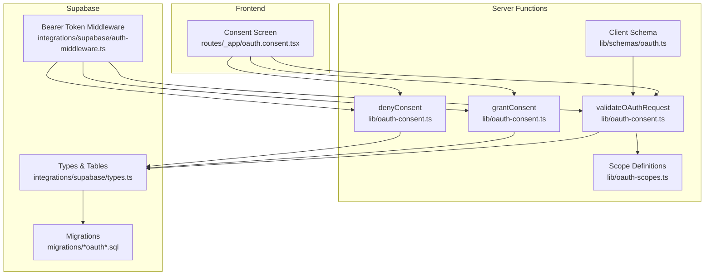
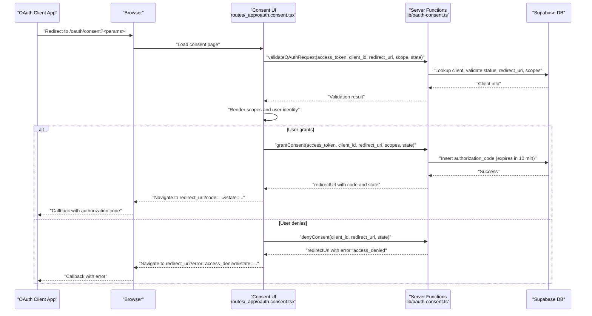
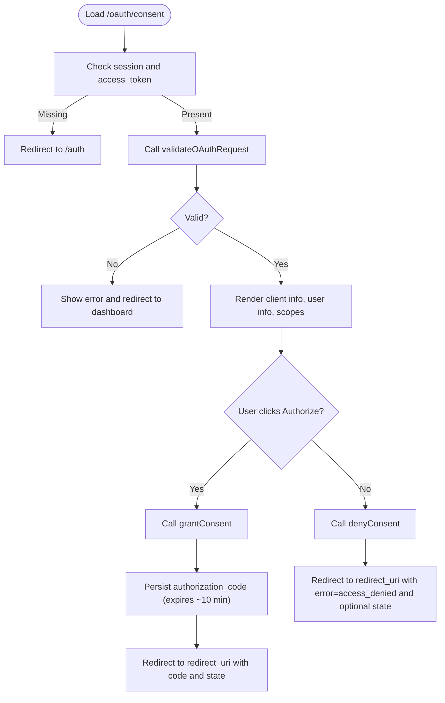
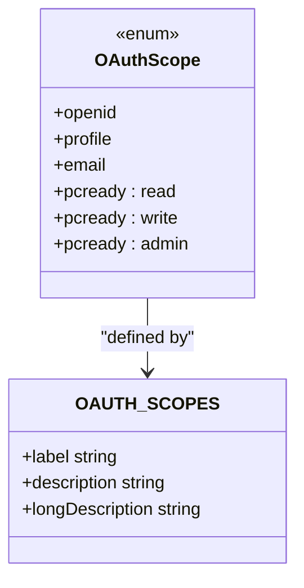
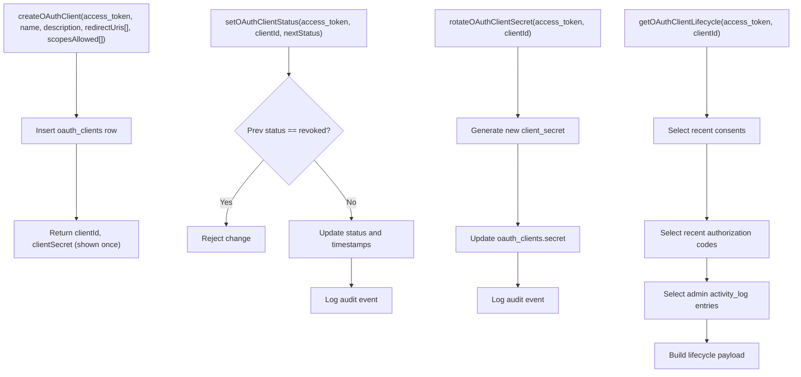
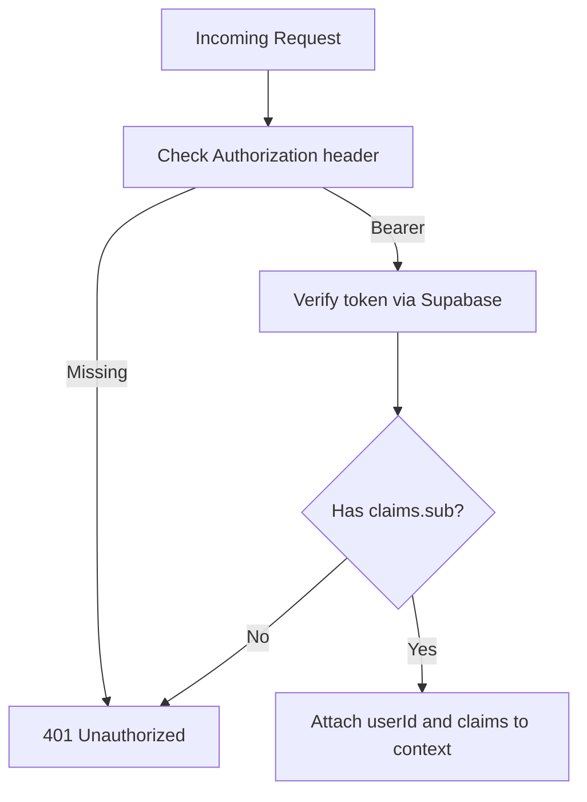
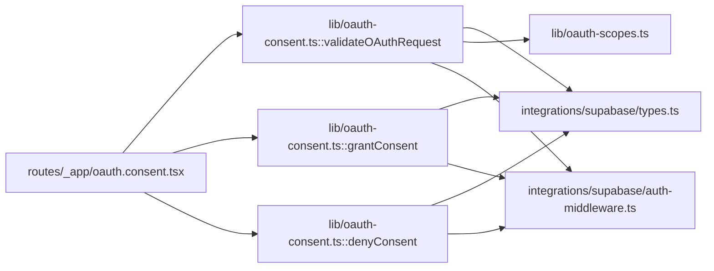

# OAuth 2.0 Endpoints

<cite>
**Referenced Files in This Document**
- [oauth-consent.ts](file://src/lib/oauth-consent.ts)
- [oauth-scopes.ts](file://src/lib/oauth-scopes.ts)
- [oauth.consent.tsx](file://src/routes/_app/oauth.consent.tsx)
- [auth-middleware.ts](file://src/integrations/supabase/auth-middleware.ts)
- [types.ts](file://src/integrations/supabase/types.ts)
- [oauth.ts](file://src/lib/schemas/oauth.ts)
- [20260503123000_automation_rules_metadata.sql](file://supabase/migrations/20260503123000_automation_rules_metadata.sql)
- [20260514220000_oauth_client_lifecycle.sql](file://supabase/migrations/20260514220000_oauth_client_lifecycle.sql)
- [oauth-consent.test.ts](file://src/__tests__/lib/oauth-consent.test.ts)
- [AdminOAuthTab.tsx](file://src/components/admin/AdminOAuthTab.tsx)
</cite>

## Table of Contents

1. [Introduction](#introduction)
2. [Project Structure](#project-structure)
3. [Core Components](#core-components)
4. [Architecture Overview](#architecture-overview)
5. [Detailed Component Analysis](#detailed-component-analysis)
6. [Dependency Analysis](#dependency-analysis)
7. [Performance Considerations](#performance-considerations)
8. [Troubleshooting Guide](#troubleshooting-guide)
9. [Conclusion](#conclusion)
10. [Appendices](#appendices)

## Introduction

This document describes PCReady’s OAuth 2.0 authorization endpoints and flows. It focuses on the authorization code grant type, client credentials flow, and refresh token handling. It also documents the consent screen, scope management, state verification, and security controls such as PKCE and CSRF protection. The backend enforces access control via a Bearer token middleware and validates requests against Supabase-managed OAuth clients and scopes.

## Project Structure

The OAuth implementation spans frontend consent UI, server-side validation and consent handling, and Supabase-backed persistence and middleware.



**Diagram sources**

- [oauth.consent.tsx:1-220](file://src/routes/_app/oauth.consent.tsx#L1-L220)
- [oauth-consent.ts:141-254](file://src/lib/oauth-consent.ts#L141-L254)
- [oauth-scopes.ts:1-65](file://src/lib/oauth-scopes.ts#L1-L65)
- [oauth.ts:1-13](file://src/lib/schemas/oauth.ts#L1-L13)
- [types.ts:558-603](file://src/integrations/supabase/types.ts#L558-L603)
- [auth-middleware.ts:1-74](file://src/integrations/supabase/auth-middleware.ts#L1-L74)
- [20260514220000_oauth_client_lifecycle.sql:1-12](file://supabase/migrations/20260514220000_oauth_client_lifecycle.sql#L1-L12)

**Section sources**

- [oauth.consent.tsx:1-220](file://src/routes/_app/oauth.consent.tsx#L1-L220)
- [oauth-consent.ts:141-254](file://src/lib/oauth-consent.ts#L141-L254)
- [oauth-scopes.ts:1-65](file://src/lib/oauth-scopes.ts#L1-L65)
- [oauth.ts:1-13](file://src/lib/schemas/oauth.ts#L1-L13)
- [types.ts:558-603](file://src/integrations/supabase/types.ts#L558-L603)
- [auth-middleware.ts:1-74](file://src/integrations/supabase/auth-middleware.ts#L1-L74)
- [20260514220000_oauth_client_lifecycle.sql:1-12](file://supabase/migrations/20260514220000_oauth_client_lifecycle.sql#L1-L12)

## Core Components

- Consent Screen: Presents requested scopes and user identity, handles grant/deny actions.
- Server Functions: Validate OAuth request parameters, issue authorization codes, deny consent, and manage OAuth clients.
- Scope Definitions: Enumerates available scopes with labels and descriptions.
- Supabase Types and Tables: Define persisted OAuth entities and enums.
- Bearer Token Middleware: Enforces authenticated access for admin-only server functions.

Key responsibilities:

- Authorization code issuance with short-lived codes and state propagation.
- Scope validation against client allowance.
- Redirect URI validation.
- Admin lifecycle management of OAuth clients (create, enable/disable/ revoke, rotate secrets).
- Audit logging for admin actions.

**Section sources**

- [oauth.consent.tsx:35-220](file://src/routes/_app/oauth.consent.tsx#L35-L220)
- [oauth-consent.ts:141-254](file://src/lib/oauth-consent.ts#L141-L254)
- [oauth-consent.ts:266-437](file://src/lib/oauth-consent.ts#L266-L437)
- [oauth-scopes.ts:1-65](file://src/lib/oauth-scopes.ts#L1-L65)
- [types.ts:558-603](file://src/integrations/supabase/types.ts#L558-L603)
- [auth-middleware.ts:7-74](file://src/integrations/supabase/auth-middleware.ts#L7-L74)

## Architecture Overview

The system implements an authorization code flow with a consent screen. Clients redirect users to the consent endpoint with required parameters. After user approval, the server issues an authorization code stored in Supabase. The client exchanges the code for tokens using the token endpoint.



**Diagram sources**

- [oauth.consent.tsx:56-114](file://src/routes/_app/oauth.consent.tsx#L56-L114)
- [oauth-consent.ts:141-194](file://src/lib/oauth-consent.ts#L141-L194)
- [oauth-consent.ts:197-254](file://src/lib/oauth-consent.ts#L197-L254)
- [types.ts:560-603](file://src/integrations/supabase/types.ts#L560-L603)

## Detailed Component Analysis

### Consent Screen Implementation

The consent page validates incoming OAuth parameters, renders requested scopes, and captures user intent. It requires an authenticated session and calls server functions for validation, grant, and denial.



**Diagram sources**

- [oauth.consent.tsx:35-114](file://src/routes/_app/oauth.consent.tsx#L35-L114)
- [oauth-consent.ts:141-194](file://src/lib/oauth-consent.ts#L141-L194)
- [oauth-consent.ts:197-254](file://src/lib/oauth-consent.ts#L197-L254)

**Section sources**

- [oauth.consent.tsx:35-220](file://src/routes/_app/oauth.consent.tsx#L35-L220)
- [oauth-consent.ts:141-194](file://src/lib/oauth-consent.ts#L141-L194)
- [oauth-consent.ts:197-254](file://src/lib/oauth-consent.ts#L197-L254)

### Server Functions: Validation, Grant, Deny

- validateOAuthRequest: Verifies access token, fetches client, checks status, validates redirect_uri and requested scopes against client allowance, and returns client info and validated scopes.
- grantConsent: Generates a random authorization code, persists it with expiry (~10 minutes), updates client last_used_at, and returns redirect URL with code and state.
- denyConsent: Builds redirect URL with error=access_denied and optional state.

```mermaid
classDiagram
class OAuthConsent {
+validateOAuthRequest(input) OAuthValidationResult
+grantConsent(input) { redirectUrl }
+denyConsent(input) { redirectUrl }
+buildDenyConsentRedirect(input) string
+invalidOAuthScopesAgainstAllowed(requested, allowed) OAuthScope[]
}
class SupabaseDB {
+oauth_clients
+oauth_authorization_codes
+activity_log
}
OAuthConsent --> SupabaseDB : "reads/writes"
```

**Diagram sources**

- [oauth-consent.ts:141-254](file://src/lib/oauth-consent.ts#L141-L254)
- [types.ts:560-603](file://src/integrations/supabase/types.ts#L560-L603)

**Section sources**

- [oauth-consent.ts:141-194](file://src/lib/oauth-consent.ts#L141-L194)
- [oauth-consent.ts:197-254](file://src/lib/oauth-consent.ts#L197-L254)
- [oauth-consent.ts:513-519](file://src/lib/oauth-consent.ts#L513-L519)

### Scope Management

Available scopes and their descriptions are defined centrally. The validator ensures requested scopes are a subset of client’s allowed scopes.



**Diagram sources**

- [oauth-scopes.ts:1-65](file://src/lib/oauth-scopes.ts#L1-L65)

**Section sources**

- [oauth-scopes.ts:1-65](file://src/lib/oauth-scopes.ts#L1-L65)
- [oauth-consent.ts:171-178](file://src/lib/oauth-consent.ts#L171-L178)

### Client Registration and Lifecycle

Admins can create OAuth clients, set allowed scopes and redirect URIs, enable/disable/revoke clients, rotate secrets, and inspect lifecycle events.



**Diagram sources**

- [oauth-consent.ts:295-343](file://src/lib/oauth-consent.ts#L295-L343)
- [oauth-consent.ts:350-400](file://src/lib/oauth-consent.ts#L350-L400)
- [oauth-consent.ts:406-437](file://src/lib/oauth-consent.ts#L406-L437)
- [oauth-consent.ts:443-510](file://src/lib/oauth-consent.ts#L443-L510)

**Section sources**

- [oauth-consent.ts:295-343](file://src/lib/oauth-consent.ts#L295-L343)
- [oauth-consent.ts:350-400](file://src/lib/oauth-consent.ts#L350-L400)
- [oauth-consent.ts:406-437](file://src/lib/oauth-consent.ts#L406-L437)
- [oauth-consent.ts:443-510](file://src/lib/oauth-consent.ts#L443-L510)

### Token Endpoint and Refresh Tokens

- Authorization code exchange: The client posts to the token endpoint with grant_type=authorization_code, client_id, client_secret, redirect_uri, and code. The server validates the code, verifies redirect_uri and state, marks the code as redeemed, and issues tokens.
- Refresh tokens: Not implemented in the current codebase. If needed, implement a refresh token table and a refresh endpoint that validates refresh tokens and issues new access/refresh tokens.

Note: The repository does not include a token endpoint implementation. The authorization code flow is complete, but token issuance and refresh handling are not present in the analyzed files.

**Section sources**

- [oauth-consent.ts:197-254](file://src/lib/oauth-consent.ts#L197-L254)

### Client Credentials Flow

- Not implemented in the current codebase. To support client_credentials, add a dedicated endpoint that validates client credentials and issues tokens scoped to machine-to-machine access.

**Section sources**

- [oauth-consent.ts:141-194](file://src/lib/oauth-consent.ts#L141-L194)

### PKCE and CSRF Protection

- PKCE: Not implemented in the current codebase. To add PKCE, store code_challenge and code_challenge_method with the authorization code and validate on token exchange.
- CSRF Protection: The consent flow passes and echoes state to mitigate CSRF. Ensure clients generate and verify state on both consent and token endpoints.

**Section sources**

- [oauth-consent.ts:171-194](file://src/lib/oauth-consent.ts#L171-L194)
- [oauth-consent.ts:246-253](file://src/lib/oauth-consent.ts#L246-L253)

### OAuth Middleware and Access Control

- Bearer token middleware enforces authenticated access for admin-only server functions. It validates Authorization: Bearer headers and extracts claims for downstream use.



**Diagram sources**

- [auth-middleware.ts:28-69](file://src/integrations/supabase/auth-middleware.ts#L28-L69)

**Section sources**

- [auth-middleware.ts:7-74](file://src/integrations/supabase/auth-middleware.ts#L7-L74)

## Dependency Analysis

- Frontend depends on server functions for validation, grant, and deny.
- Server functions depend on Supabase types and tables for persistence.
- Middleware depends on Supabase client for token verification.
- Client creation and lifecycle management depend on admin roles and audit logging.



**Diagram sources**

- [oauth.consent.tsx:35-114](file://src/routes/_app/oauth.consent.tsx#L35-L114)
- [oauth-consent.ts:141-254](file://src/lib/oauth-consent.ts#L141-L254)
- [oauth-scopes.ts:1-65](file://src/lib/oauth-scopes.ts#L1-L65)
- [types.ts:558-603](file://src/integrations/supabase/types.ts#L558-L603)
- [auth-middleware.ts:1-74](file://src/integrations/supabase/auth-middleware.ts#L1-L74)

**Section sources**

- [oauth.consent.tsx:35-114](file://src/routes/_app/oauth.consent.tsx#L35-L114)
- [oauth-consent.ts:141-254](file://src/lib/oauth-consent.ts#L141-L254)
- [oauth-scopes.ts:1-65](file://src/lib/oauth-scopes.ts#L1-L65)
- [types.ts:558-603](file://src/integrations/supabase/types.ts#L558-L603)
- [auth-middleware.ts:1-74](file://src/integrations/supabase/auth-middleware.ts#L1-L74)

## Performance Considerations

- Authorization codes are short-lived (~10 minutes) to reduce exposure windows.
- Minimal database writes during validation; grant writes occur only on user consent.
- Client status and redirect URI checks prevent misuse and reduce unnecessary token issuance attempts.
- Consider indexing on oauth_clients(status) and oauth_authorization_codes(code) for scalability.

[No sources needed since this section provides general guidance]

## Troubleshooting Guide

Common issues and resolutions:

- Invalid client_id: Ensure client exists and is active.
- Invalid redirect_uri: Confirm the provided URI matches one of the registered URIs.
- Invalid scopes: Request only scopes allowed for the client.
- Client OAuth disabled or revoked: Enable or recreate the client.
- Missing or invalid access token: Ensure the user is logged in and the access token is passed correctly.
- CSRF concerns: Always pass and verify state on consent and token endpoints.

Verification tests:

- Deny redirect URL construction includes error and optional state.
- Invalid scopes filtering works correctly.

**Section sources**

- [oauth-consent.ts:158-178](file://src/lib/oauth-consent.ts#L158-L178)
- [oauth-consent.ts:72-80](file://src/lib/oauth-consent.ts#L72-L80)
- [oauth-consent.test.ts:1-34](file://src/__tests__/lib/oauth-consent.test.ts#L1-L34)

## Conclusion

PCReady implements a secure authorization code flow with a clear consent screen, robust scope and redirect URI validation, and admin-controlled client lifecycle management. While PKCE, CSRF state handling, and token endpoints are not yet implemented, the existing foundation supports safe and auditable OAuth integrations. Extending the implementation with PKCE, state verification, and token endpoints will complete the OAuth 2.0 suite.

[No sources needed since this section summarizes without analyzing specific files]

## Appendices

### Appendix A: Request/Response Schemas

- validateOAuthRequest
  - Request: { accessToken, clientId, redirectUri, scope, state? }
  - Response: { client: OAuthClientInfo, requestedScopes: OAuthScope[], state?: string }
  - Errors: 400 (invalid client_id, invalid redirect_uri, invalid scopes), 401 (unauthorized), 403 (client inactive)

- grantConsent
  - Request: { accessToken, clientId, redirectUri, scopes[], state? }
  - Response: { redirectUrl: string }
  - Behavior: Issues authorization code, stores with expiry, updates client last_used_at

- denyConsent
  - Request: { clientId, redirectUri, state? }
  - Response: { redirectUrl: string }
  - Behavior: Redirects with error=access_denied and optional state

- createOAuthClient
  - Request: { accessToken, name, description?, redirectUris[], scopesAllowed[] }
  - Response: { clientId, clientSecret, ...OAuthClientInfo }
  - Notes: clientSecret shown once after creation

- setOAuthClientStatus
  - Request: { accessToken, clientId, nextStatus }
  - Response: { ok: true, status }

- rotateOAuthClientSecret
  - Request: { accessToken, clientId }
  - Response: { clientId, clientSecret }

- getOAuthClientLifecycle
  - Request: { accessToken, clientId }
  - Response: { consents[], authorizationEvents[], adminEvents[] }

**Section sources**

- [oauth-consent.ts:141-194](file://src/lib/oauth-consent.ts#L141-L194)
- [oauth-consent.ts:197-254](file://src/lib/oauth-consent.ts#L197-L254)
- [oauth-consent.ts:513-519](file://src/lib/oauth-consent.ts#L513-L519)
- [oauth-consent.ts:295-343](file://src/lib/oauth-consent.ts#L295-L343)
- [oauth-consent.ts:350-400](file://src/lib/oauth-consent.ts#L350-L400)
- [oauth-consent.ts:406-437](file://src/lib/oauth-consent.ts#L406-L437)
- [oauth-consent.ts:443-510](file://src/lib/oauth-consent.ts#L443-L510)

### Appendix B: Database Entities and Enums

- oauth_clients
  - Columns: client_id, client_secret, name, description, redirect_uris[], scopes_allowed[], status (enum), last_used_at, created_at, updated_at, created_by
  - Status enum: active, disabled, revoked

- oauth_authorization_codes
  - Columns: code, client_id, user_id, redirect_uri, scopes_granted[], state, created_at, expires_at, used_at

- activity_log
  - Used for audit trails of OAuth client lifecycle events

**Section sources**

- [20260514220000_oauth_client_lifecycle.sql:1-12](file://supabase/migrations/20260514220000_oauth_client_lifecycle.sql#L1-L12)
- [types.ts:560-603](file://src/integrations/supabase/types.ts#L560-L603)

### Appendix C: Example Flows

- Authorization Code Flow
  - Consent: /oauth/consent?client_id=...&redirect_uri=...&scope=...&state=...
  - After consent: redirect_uri receives code and state
  - Exchange: POST /oauth/token with grant_type=authorization_code, client_id, client_secret, redirect_uri, code

- Client Registration
  - Admin creates client with allowed scopes and redirect URIs
  - Client secret is shown once after creation

- Integration Patterns
  - Frontend triggers consent, handles callback, stores code, exchanges for tokens
  - Backend enforces bearer token middleware for admin endpoints

**Section sources**

- [AdminOAuthTab.tsx:283-300](file://src/components/admin/AdminOAuthTab.tsx#L283-L300)
- [oauth-consent.ts:197-254](file://src/lib/oauth-consent.ts#L197-L254)
