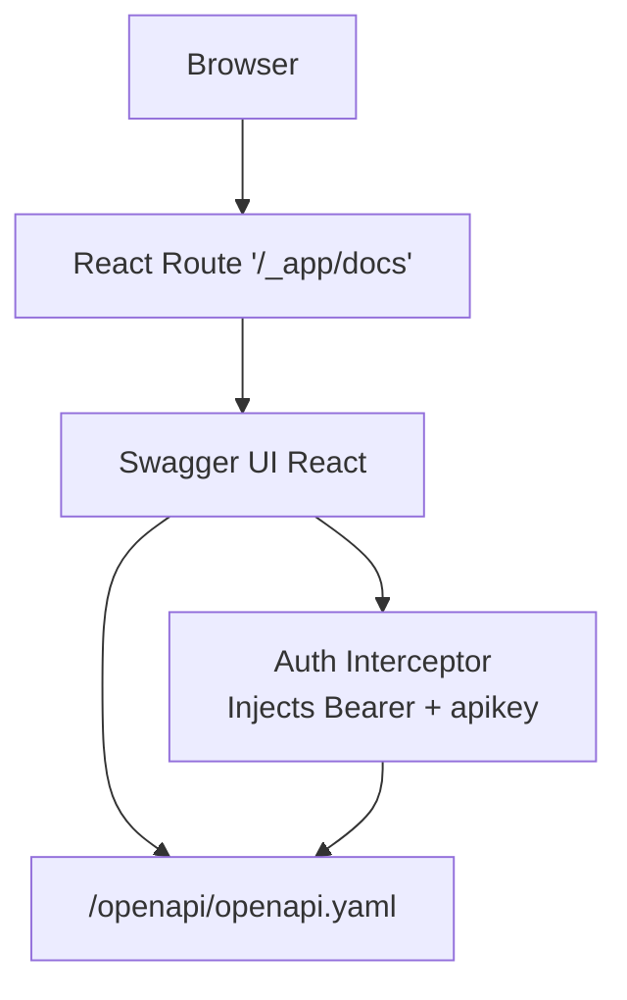
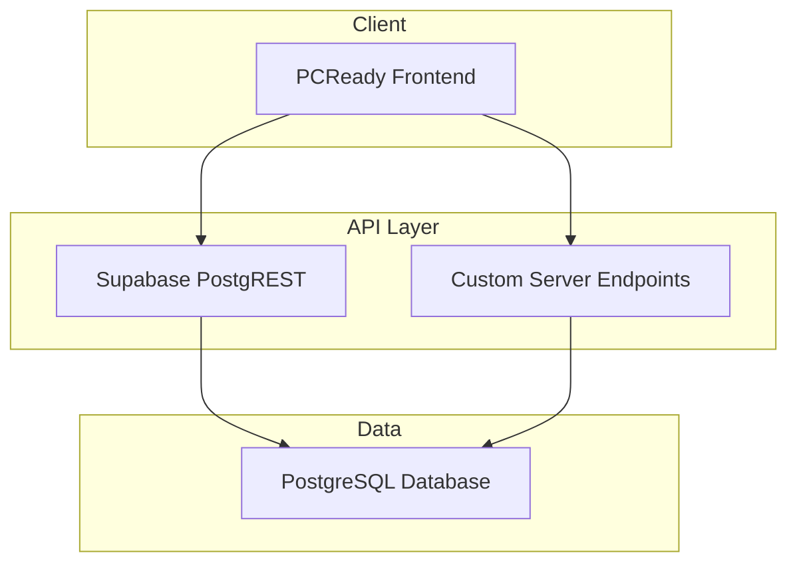
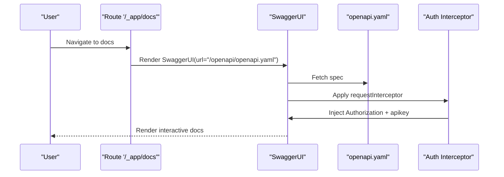
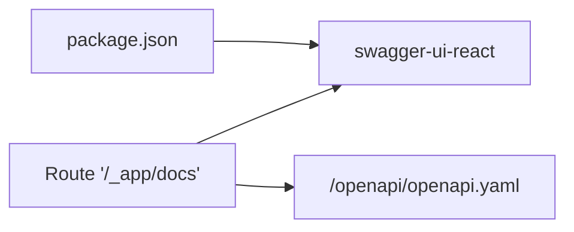

# OpenAPI Specification

<cite>
**Referenced Files in This Document**
- [openapi.yaml](file://public/openapi/openapi.yaml)
- [docs.tsx](file://src/routes/_app/docs.tsx)
- [swagger-ui-react.d.ts](file://src/types/swagger-ui-react.d.ts)
- [package.json](file://package.json)
- [clients.ts](file://lib/schemas/clients.ts)
- [devices.ts](file://lib/schemas/devices.ts)
- [admin.ts](file://lib/schemas/admin.ts)
- [oauth.ts](file://lib/schemas/oauth.ts)
- [utils.ts](file://lib/schemas/utils.ts)
- [versioning.test.ts](file://src/__tests__/versioning.test.ts)
- [20260503120000_entity_versions.sql](file://supabase/migrations/20260503120000_entity_versions.sql)
</cite>

## Table of Contents

1. [Introduction](#introduction)
2. [Project Structure](#project-structure)
3. [Core Components](#core-components)
4. [Architecture Overview](#architecture-overview)
5. [Detailed Component Analysis](#detailed-component-analysis)
6. [Dependency Analysis](#dependency-analysis)
7. [Performance Considerations](#performance-considerations)
8. [Troubleshooting Guide](#troubleshooting-guide)
9. [Conclusion](#conclusion)
10. [Appendices](#appendices)

## Introduction

This document describes PCReady’s OpenAPI 3.0 specification and Swagger UI integration. It covers the API contract, endpoint definitions, request/response schemas, and interactive documentation. It also explains the authorization model, server configuration, and how the frontend renders the OpenAPI spec via Swagger UI. Guidance is included for API versioning, deprecation, evolution, and maintenance.

## Project Structure

PCReady exposes a single static OpenAPI 3.0 YAML file and renders it in the browser using Swagger UI. Authorization is handled by injecting a Bearer JWT and an API key into requests automatically.

**Diagram sources**

- [docs.tsx:60-73](file://src/routes/_app/docs.tsx#L60-L73)
- [openapi.yaml:1-20](file://public/openapi/openapi.yaml#L1-L20)

**Section sources**

- [openapi.yaml:1-20](file://public/openapi/openapi.yaml#L1-L20)
- [docs.tsx:1-78](file://src/routes/_app/docs.tsx#L1-L78)

## Core Components

- OpenAPI specification: Centralized in a single YAML file under the public folder.
- Swagger UI integration: A dedicated route renders the spec and injects credentials.
- Security schemes: Bearer JWT and Supabase API key.
- Shared parameter conventions: Select, order, limit, id filter, and Prefer header.
- Data models: Defined inline under components/schemas, covering core entities and admin/OAuth features.

Key highlights:

- Servers: Two environments are declared: a Supabase PostgREST endpoint and the local server for custom endpoints.
- Tags: Logical grouping of endpoints (Tickets, Devices, Clients, Contacts, Automations, OAuth, Notifications, Checklist, Versioning, Admin, EmailTemplates).
- Security: Global bearerAuth and supabaseAnonKey schemes applied to most paths.

**Section sources**

- [openapi.yaml:1-44](file://public/openapi/openapi.yaml#L1-L44)
- [openapi.yaml:708-754](file://public/openapi/openapi.yaml#L708-L754)
- [openapi.yaml:718-754](file://public/openapi/openapi.yaml#L718-L754)

## Architecture Overview

The API surface combines Supabase-managed PostgREST endpoints for relational tables and custom server endpoints for advanced features (OAuth flows, automation run APIs, admin user management).

**Diagram sources**

- [openapi.yaml:9-17](file://public/openapi/openapi.yaml#L9-L17)
- [openapi.yaml:44-708](file://public/openapi/openapi.yaml#L44-L708)

**Section sources**

- [openapi.yaml:9-17](file://public/openapi/openapi.yaml#L9-L17)
- [openapi.yaml:44-708](file://public/openapi/openapi.yaml#L44-L708)

## Detailed Component Analysis

### OpenAPI YAML Structure

- Top-level info, servers, security, and tags define the global contract.
- Paths enumerate endpoints grouped by tag, with parameters and responses.
- Components define reusable parameters and schemas.

Notable elements:

- Servers: Supabase REST base URL with variable projectRef; local server for custom routes.
- Security: bearerAuth and supabaseAnonKey globally applied.
- Parameters: select, order, limit, idFilter, Prefer header.
- Schemas: Rich set of models for Clients, Devices, Tickets, Notifications, Checklist templates, App Settings, Email Templates, Activity Log, OAuth clients, Automation flows and run logs, Admin user operations, and generic JSON objects.

**Section sources**

- [openapi.yaml:1-44](file://public/openapi/openapi.yaml#L1-L44)
- [openapi.yaml:44-708](file://public/openapi/openapi.yaml#L44-L708)
- [openapi.yaml:708-1146](file://public/openapi/openapi.yaml#L708-L1146)

### Swagger UI Implementation

- Route: A TanStack route renders the Swagger UI shell and applies an interceptor to inject Authorization and apikey headers.
- Interceptor: Automatically sets Bearer token from the current session and adds the Supabase publishable key if missing.
- Styling: Minimal overrides to align Swagger UI with the app theme.

**Diagram sources**

- [docs.tsx:60-73](file://src/routes/_app/docs.tsx#L60-L73)
- [swagger-ui-react.d.ts:9-16](file://src/types/swagger-ui-react.d.ts#L9-L16)

**Section sources**

- [docs.tsx:1-78](file://src/routes/_app/docs.tsx#L1-L78)
- [swagger-ui-react.d.ts:1-21](file://src/types/swagger-ui-react.d.ts#L1-L21)

### Endpoint Catalog (Selected)

- Tickets: List, create, update, delete with PostgREST filters and Prefer header support.
- Devices: List, create, update with status enum and filters.
- Clients: CRUD with insert/update schemas.
- Client Contacts: List, create with contact-specific schema.
- Notifications: List user notifications and mark as read.
- Checklist Templates: CRUD with JSON item arrays.
- Entity Versions: Retrieve version history for entities.
- App Settings: List and update application settings.
- Email Templates: CRUD for transactional email templates.
- Activity Log: Audit log entries.
- OAuth: authorize, consent, token exchange.
- Automations: run now, list run logs, run statistics.
- Admin: invite, update, enable/disable, delete users.

Each endpoint defines:

- Path, method, tags, summary, and parameters.
- Request bodies where applicable.
- Responses with status codes and content types.
- Schema references for request/response bodies.

**Section sources**

- [openapi.yaml:44-708](file://public/openapi/openapi.yaml#L44-L708)

### Data Models Overview

Core models include:

- Client, ClientContact, Device, Ticket, Notification, ChecklistTemplate, AppSettings, EmailTemplate, ActivityLog, OAuthClient, OAuthTokenResponse, AutomationFlow, AutomationRunLog, RunAutomationNowRequest, AutomationRunStatsResponse, AdminUserInviteRequest, AdminUserUpdateRequest, AdminUserDisabledRequest, and JsonObject.

These models are referenced by endpoints and provide strong typing for request/response payloads.

**Section sources**

- [openapi.yaml:754-1146](file://public/openapi/openapi.yaml#L754-L1146)

### Authorization Model

- bearerAuth: HTTP bearer scheme with JWT tokens.
- supabaseAnonKey: API key injected via header for PostgREST access.
- Global security is applied to most paths; OAuth and automation endpoints override with explicit security blocks.

**Section sources**

- [openapi.yaml:18-21](file://public/openapi/openapi.yaml#L18-L21)
- [openapi.yaml:708-718](file://public/openapi/openapi.yaml#L708-L718)

### Parameter Conventions

Standardized PostgREST-style parameters:

- select: Projection string.
- order: Sorting expression.
- limit: Max records.
- id: Filter by UUID.
- Prefer: Controls return behavior.

**Section sources**

- [openapi.yaml:718-754](file://public/openapi/openapi.yaml#L718-L754)

### Swagger UI Props and Type Safety

- SwaggerUIProps include url/spec, docExpansion, defaultModelsExpandDepth, persistAuthorization, and requestInterceptor.
- A declaration file provides TypeScript support for the component.

**Section sources**

- [swagger-ui-react.d.ts:9-16](file://src/types/swagger-ui-react.d.ts#L9-L16)

### Client-Side Validation Schemas (Zod)

While not part of the OpenAPI spec itself, the frontend uses Zod schemas for client-side validation aligned with backend constraints:

- Clients and contacts: Validation for required fields, emails, trimming, and booleans.
- Devices: Validation for model, serial, client_id, OS enum, and notes.
- Admin user invite: Validation for email, role enum.
- OAuth client: Validation for name, redirect URIs, and scopes.

These schemas help ensure API consumers submit valid payloads and mirror the OpenAPI constraints.

**Section sources**

- [clients.ts:1-27](file://lib/schemas/clients.ts#L1-L27)
- [devices.ts:1-15](file://lib/schemas/devices.ts#L1-L15)
- [admin.ts:1-10](file://lib/schemas/admin.ts#L1-L10)
- [oauth.ts:1-16](file://lib/schemas/oauth.ts#L1-L16)
- [utils.ts:1-20](file://lib/schemas/utils.ts#L1-L20)

## Dependency Analysis

- Runtime dependency: swagger-ui-react is included in package.json.
- Build-time dependency: Vite and TanStack Router power the docs route.
- OpenAPI spec is served statically from the public directory.

**Diagram sources**

- [package.json:79](file://package.json#L79)
- [docs.tsx:4-5](file://src/routes/_app/docs.tsx#L4-L5)
- [openapi.yaml:1-4](file://public/openapi/openapi.yaml#L1-L4)

**Section sources**

- [package.json:79](file://package.json#L79)
- [docs.tsx:4-5](file://src/routes/_app/docs.tsx#L4-L5)

## Performance Considerations

- Use the select parameter to limit returned fields and reduce payload sizes.
- Use order and limit to constrain result sets for list endpoints.
- Prefer server-side filtering via query parameters rather than client-side pagination.
- For large datasets, leverage limit and order with appropriate indexing.

[No sources needed since this section provides general guidance]

## Troubleshooting Guide

Common issues and resolutions:

- Missing Authorization or apikey headers:
  - The docs route injects these automatically. Verify session availability and environment variables for the Supabase publishable key.
- 401 Unauthorized:
  - Ensure a valid Bearer token is present and not expired.
- 403 Forbidden:
  - Confirm user role allows access; RLS policies restrict rows.
- CORS or network errors:
  - Verify the projectRef variable matches your Supabase project and that the network allows outbound requests.
- Swagger UI not rendering:
  - Confirm the YAML path is correct and accessible.

**Section sources**

- [docs.tsx:22-37](file://src/routes/_app/docs.tsx#L22-L37)
- [docs.tsx:65-72](file://src/routes/_app/docs.tsx#L65-L72)

## Conclusion

PCReady’s API is documented via a comprehensive OpenAPI 3.0 specification and rendered interactively using Swagger UI. The design leverages Supabase PostgREST for relational data and custom server endpoints for advanced features. Authorization is standardized with Bearer JWT and Supabase API keys. The frontend route ensures secure, convenient access to the docs with automatic credential injection.

[No sources needed since this section summarizes without analyzing specific files]

## Appendices

### API Versioning Strategy

- Current state: The OpenAPI spec declares a version field in the info section. There is no explicit versioned URL strategy in the servers block.
- Recommended approach:
  - Use path-based versioning (e.g., /v1/tickets) to decouple client evolution from server changes.
  - Maintain backward compatibility by keeping older paths operational while adding new ones.
  - Announce deprecations with clear timelines and migration paths.

**Section sources**

- [openapi.yaml:2-4](file://public/openapi/openapi.yaml#L2-L4)

### Deprecation Policies and Backward Compatibility

- Deprecation indicators in schemas:
  - Some fields are marked deprecated in the spec (e.g., ticket model and serial fields).
- Best practices:
  - Keep deprecated fields readable for backward compatibility.
  - Introduce new fields alongside deprecated ones during transitions.
  - Provide migration examples and timelines in release notes.

**Section sources**

- [openapi.yaml:852-853](file://public/openapi/openapi.yaml#L852-L853)

### API Evolution and Migration Strategies

- Schema alignment:
  - Align client-side Zod schemas with OpenAPI constraints to catch mismatches early.
- Testing:
  - Use tests to verify versioning behavior and snapshot diffs.
- Migration:
  - For breaking changes, introduce new endpoints/methods and keep old ones for a deprecation window.

**Section sources**

- [versioning.test.ts:43-72](file://src/__tests__/versioning.test.ts#L43-L72)

### API Documentation Standards and Quality Assurance

- Standards:
  - Use clear tags, summaries, and descriptions for endpoints.
  - Define consistent parameter conventions (select, order, limit, idFilter, Prefer).
  - Provide representative examples for request/response bodies.
- Quality assurance:
  - Validate the OpenAPI YAML against the spec.
  - Ensure Swagger UI renders without errors and credentials are injected.
  - Maintain parity between schema definitions and database constraints.

**Section sources**

- [openapi.yaml:21-44](file://public/openapi/openapi.yaml#L21-L44)
- [docs.tsx:60-73](file://src/routes/_app/docs.tsx#L60-L73)

### Developer Portal Features

- Interactive console: Swagger UI enables testing endpoints directly from the browser.
- Authorization persistence: Credentials can be persisted across sessions.
- Filtering and expansion: Users can expand tags and models for easier navigation.

**Section sources**

- [docs.tsx:60-73](file://src/routes/_app/docs.tsx#L60-L73)

### API Consumption Examples

- Authentication:
  - Set Authorization header to Bearer <JWT>.
  - Ensure apikey header is present for PostgREST endpoints.
- Listing resources:
  - Use select, order, and limit parameters to tailor responses.
- Creating/updating:
  - Send JSON payloads conforming to insert/update schemas.
- OAuth flows:
  - Use authorize, consent, and token endpoints with proper client registration and scopes.

**Section sources**

- [openapi.yaml:487-574](file://public/openapi/openapi.yaml#L487-L574)
- [openapi.yaml:575-636](file://public/openapi/openapi.yaml#L575-L636)
- [openapi.yaml:637-707](file://public/openapi/openapi.yaml#L637-L707)

### Client Generation and Integration Patterns

- Client generation:
  - Use OpenAPI generators to produce SDKs for preferred languages.
- Integration patterns:
  - Centralize auth interception logic similar to the docs route.
  - Use typed forms validated by Zod schemas to match OpenAPI constraints.

**Section sources**

- [swagger-ui-react.d.ts:9-16](file://src/types/swagger-ui-react.d.ts#L9-L16)
- [clients.ts:1-27](file://lib/schemas/clients.ts#L1-L27)
- [devices.ts:1-15](file://lib/schemas/devices.ts#L1-L15)
- [admin.ts:1-10](file://lib/schemas/admin.ts#L1-L10)
- [oauth.ts:1-16](file://lib/schemas/oauth.ts#L1-L16)

### API Discovery and Metadata

- Discovery:
  - Access the spec at the published path in the docs route.
- Metadata:
  - Info section includes title, version, and description.
  - Tags group endpoints by functional area.

**Section sources**

- [openapi.yaml:2-8](file://public/openapi/openapi.yaml#L2-L8)
- [openapi.yaml:21-44](file://public/openapi/openapi.yaml#L21-L44)

### Maintenance Procedures

- Keep the OpenAPI spec synchronized with server implementations.
- Update Swagger UI props and interceptors as needed.
- Monitor RLS policies and ensure they reflect intended access controls.

**Section sources**

- [docs.tsx:60-73](file://src/routes/_app/docs.tsx#L60-L73)
- [20260503120000_entity_versions.sql:1-41](file://supabase/migrations/20260503120000_entity_versions.sql#L1-L41)
