# Administrative Management Endpoints

<cite>
**Referenced Files in This Document**
- [admin-users.ts](file://src/lib/admin-users.ts)
- [admin-users.server.ts](file://src/lib/admin-users.server.ts)
- [admin.ts](file://lib/schemas/admin.ts)
- [AdminUsersTab.tsx](file://src/components/admin/AdminUsersTab.tsx)
- [useAdminUsers.ts](file://src/hooks/useAdminUsers.ts)
- [auth-middleware.ts](file://src/integrations/supabase/auth-middleware.ts)
- [audit-log.ts](file://src/lib/audit-log.ts)
- [audit-log-actions.ts](file://src/lib/audit-log-actions.ts)
- [rate-limit.ts](file://src/lib/rate-limit.ts)
- [rate-limit-config.ts](file://src/lib/rate-limit-config.ts)
- [admin-error-message.ts](file://src/lib/admin/admin-error-message.ts)
- [admin-constants.ts](file://src/lib/admin/admin-constants.ts)
</cite>

## Table of Contents
1. [Introduction](#introduction)
2. [Project Structure](#project-structure)
3. [Core Components](#core-components)
4. [Architecture Overview](#architecture-overview)
5. [Detailed Component Analysis](#detailed-component-analysis)
6. [Dependency Analysis](#dependency-analysis)
7. [Performance Considerations](#performance-considerations)
8. [Troubleshooting Guide](#troubleshooting-guide)
9. [Conclusion](#conclusion)

## Introduction
This document describes the administrative management server functions for user lifecycle operations and role management. It covers user creation (invitation), updates, disabling/enabling, deletion, and role management. It also documents authentication and authorization requirements, access control, input validation and sanitization, database operations, rate limiting, and audit logging integration.

## Project Structure
Administrative user management is implemented as server functions backed by Supabase Auth and Postgres. The frontend integrates with these server functions via React hooks and components.

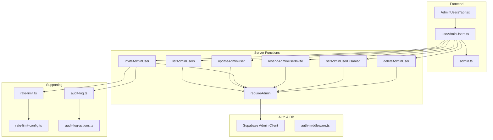

**Diagram sources**
- [AdminUsersTab.tsx:1-497](file://src/components/admin/AdminUsersTab.tsx#L1-L497)
- [useAdminUsers.ts:1-213](file://src/hooks/useAdminUsers.ts#L1-L213)
- [admin.ts:1-10](file://lib/schemas/admin.ts#L1-L10)
- [admin-users.ts:88-279](file://src/lib/admin-users.ts#L88-L279)
- [admin-users.server.ts:1-18](file://src/lib/admin-users.server.ts#L1-L18)
- [auth-middleware.ts:1-74](file://src/integrations/supabase/auth-middleware.ts#L1-L74)
- [rate-limit.ts:1-104](file://src/lib/rate-limit.ts#L1-L104)
- [rate-limit-config.ts:1-31](file://src/lib/rate-limit-config.ts#L1-L31)
- [audit-log.ts:1-183](file://src/lib/audit-log.ts#L1-L183)
- [audit-log-actions.ts:1-28](file://src/lib/audit-log-actions.ts#L1-L28)

**Section sources**
- [AdminUsersTab.tsx:1-497](file://src/components/admin/AdminUsersTab.tsx#L1-L497)
- [useAdminUsers.ts:1-213](file://src/hooks/useAdminUsers.ts#L1-L213)
- [admin-users.ts:1-279](file://src/lib/admin-users.ts#L1-L279)
- [admin-users.server.ts:1-18](file://src/lib/admin-users.server.ts#L1-L18)
- [auth-middleware.ts:1-74](file://src/integrations/supabase/auth-middleware.ts#L1-L74)

## Core Components
- Admin user server functions:
  - List users, update roles/full name, invite users, resend invitations, disable/enable users, delete users.
- Authentication and authorization:
  - Access token validation and admin role check via RPC.
- Input validation and sanitization:
  - Zod schema for invitations; trimming and normalization for names and initials.
- Rate limiting:
  - Dedicated presets and enforcement for admin user invitation.
- Audit logging:
  - Notifications and audit log retrieval/export for admin actions.

**Section sources**
- [admin-users.ts:88-279](file://src/lib/admin-users.ts#L88-L279)
- [admin-users.server.ts:1-18](file://src/lib/admin-users.server.ts#L1-L18)
- [admin.ts:1-10](file://lib/schemas/admin.ts#L1-L10)
- [rate-limit.ts:1-104](file://src/lib/rate-limit.ts#L1-L104)
- [rate-limit-config.ts:1-31](file://src/lib/rate-limit-config.ts#L1-L31)
- [audit-log.ts:1-183](file://src/lib/audit-log.ts#L1-L183)

## Architecture Overview
Administrative actions are executed as server functions invoked from the admin UI. Each function validates the caller’s admin privileges and performs database operations against Supabase. Some operations enforce rate limits and trigger notifications for audit purposes.

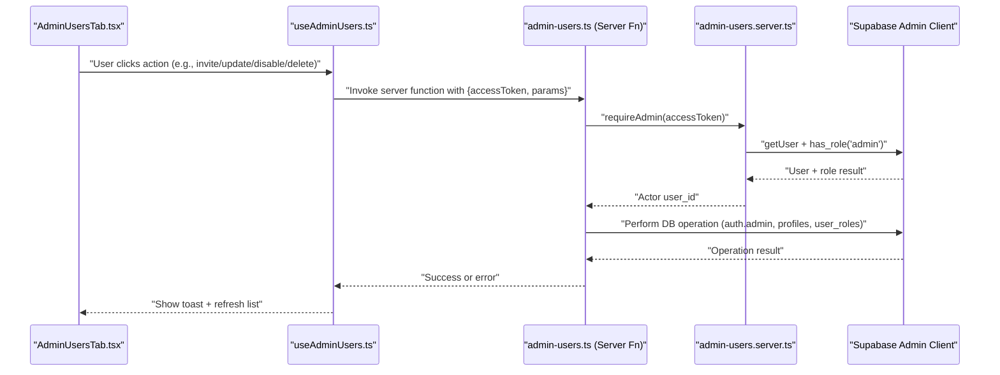

**Diagram sources**
- [AdminUsersTab.tsx:1-497](file://src/components/admin/AdminUsersTab.tsx#L1-L497)
- [useAdminUsers.ts:1-213](file://src/hooks/useAdminUsers.ts#L1-L213)
- [admin-users.ts:88-279](file://src/lib/admin-users.ts#L88-L279)
- [admin-users.server.ts:1-18](file://src/lib/admin-users.server.ts#L1-L18)

## Detailed Component Analysis

### Authentication and Authorization
- Access token validation:
  - Extracts user from access token and verifies admin role via RPC.
  - Returns actor user ID or throws unauthorized/unauthorized messages.
- Frontend middleware:
  - Provides a reusable middleware pattern for bearer token validation and claims extraction.

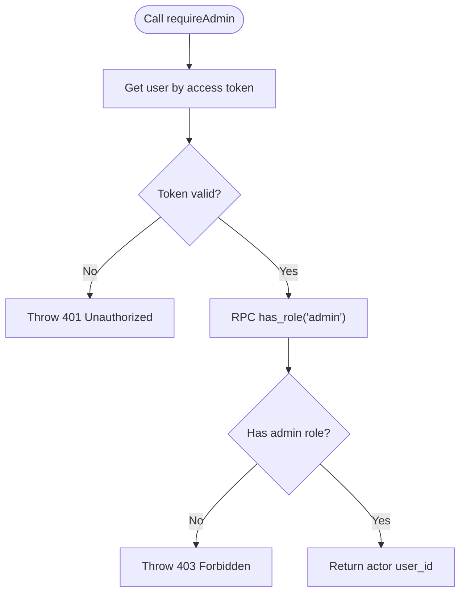

**Diagram sources**
- [admin-users.server.ts:1-18](file://src/lib/admin-users.server.ts#L1-L18)

**Section sources**
- [admin-users.server.ts:1-18](file://src/lib/admin-users.server.ts#L1-L18)
- [auth-middleware.ts:1-74](file://src/integrations/supabase/auth-middleware.ts#L1-L74)

### Admin User Invitation Workflow
- Validates role and enforces rate limit per actor.
- Sanitizes email and full name.
- Invites via Supabase Auth admin API and upserts profile and user profile records.
- Assigns initial role and notifies admins.

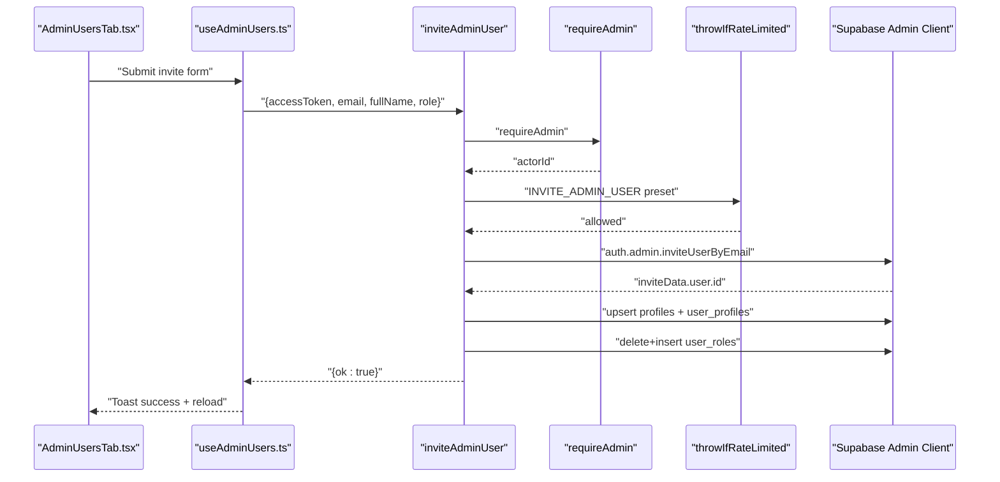

**Diagram sources**
- [admin-users.ts:169-225](file://src/lib/admin-users.ts#L169-L225)
- [rate-limit.ts:92-103](file://src/lib/rate-limit.ts#L92-L103)
- [rate-limit-config.ts:5-15](file://src/lib/rate-limit-config.ts#L5-L15)

**Section sources**
- [admin-users.ts:169-225](file://src/lib/admin-users.ts#L169-L225)
- [rate-limit.ts:92-103](file://src/lib/rate-limit.ts#L92-L103)
- [rate-limit-config.ts:5-15](file://src/lib/rate-limit-config.ts#L5-L15)

### User Listing and Status Computation
- Lists users via Supabase Auth admin API and enriches with profiles and roles.
- Computes status based on email confirmation, bans, and timestamps.

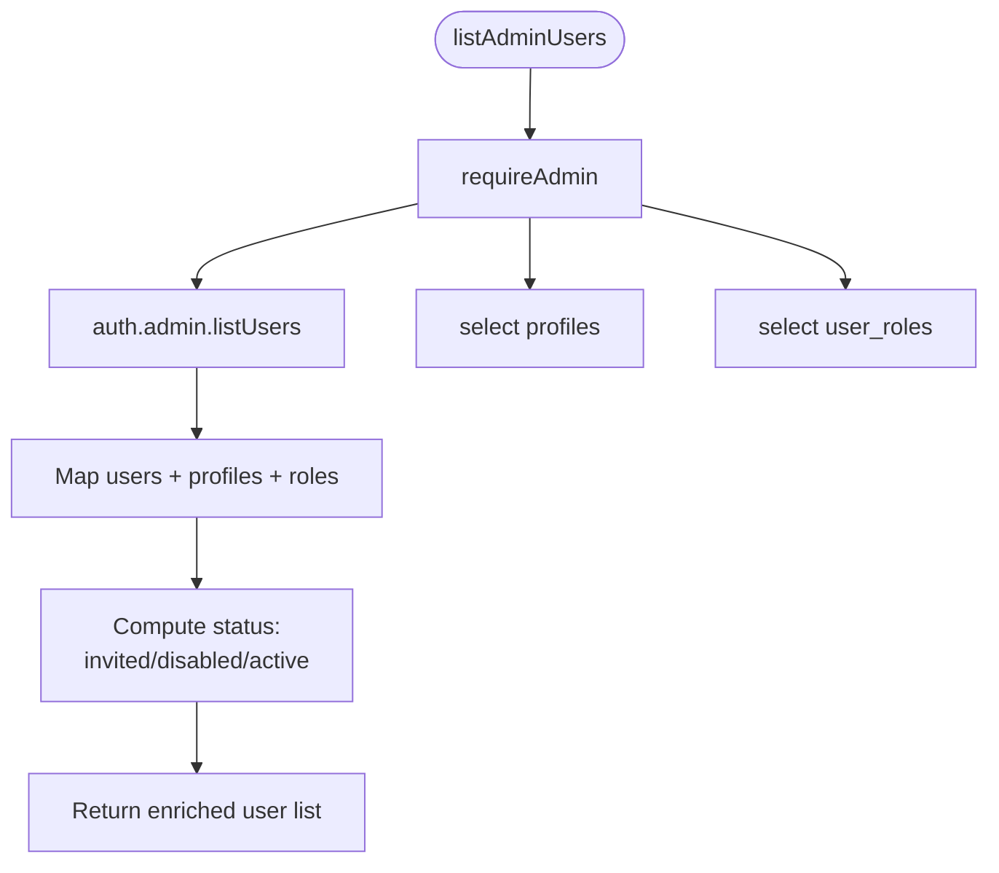

**Diagram sources**
- [admin-users.ts:88-135](file://src/lib/admin-users.ts#L88-L135)

**Section sources**
- [admin-users.ts:88-135](file://src/lib/admin-users.ts#L88-L135)

### Role Updates and Name/Initials Normalization
- Validates role, prevents removal of sole admin, and normalizes initials.
- Updates profile full name and initials, then replaces user roles.

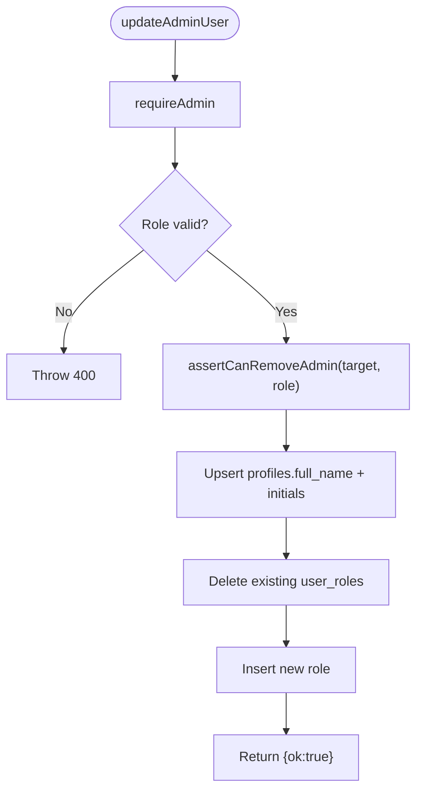

**Diagram sources**
- [admin-users.ts:137-167](file://src/lib/admin-users.ts#L137-L167)
- [admin-users.ts:69-86](file://src/lib/admin-users.ts#L69-L86)

**Section sources**
- [admin-users.ts:137-167](file://src/lib/admin-users.ts#L137-L167)
- [admin-users.ts:55-67](file://src/lib/admin-users.ts#L55-L67)

### Disable/Enable Users and Self-Protection
- Prevents actor from banning themselves.
- Enforces minimum admin count when downgrading roles.
- Uses Supabase auth admin update to ban/unban.

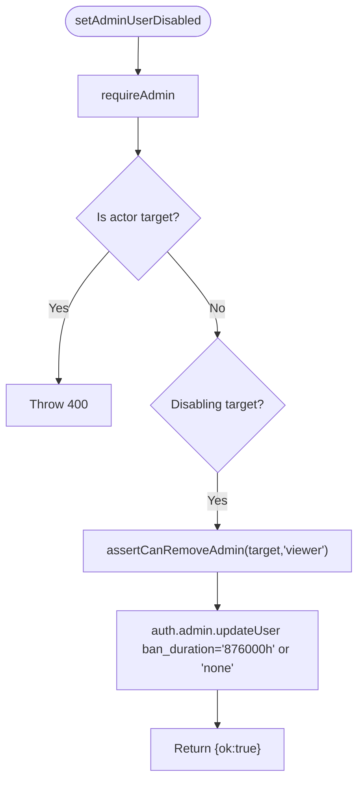

**Diagram sources**
- [admin-users.ts:250-264](file://src/lib/admin-users.ts#L250-L264)
- [admin-users.ts:69-86](file://src/lib/admin-users.ts#L69-L86)

**Section sources**
- [admin-users.ts:250-264](file://src/lib/admin-users.ts#L250-L264)
- [admin-users.ts:69-86](file://src/lib/admin-users.ts#L69-L86)

### User Deletion and Self-Protection
- Prevents actor from deleting themselves.
- Enforces minimum admin count before deletion.

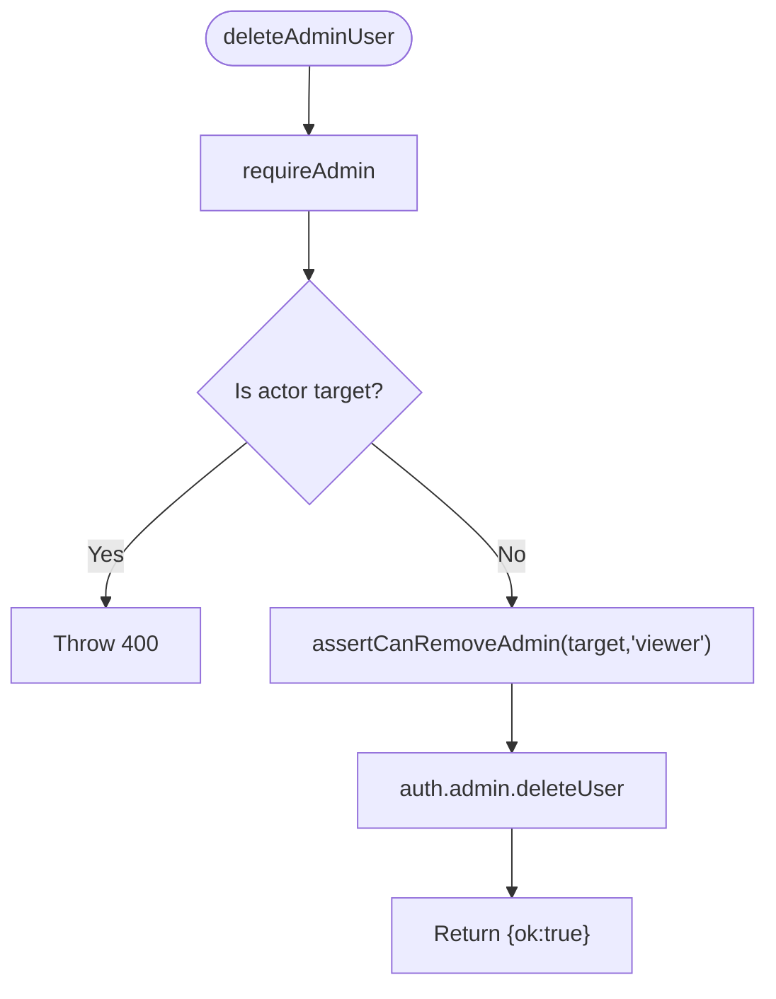

**Diagram sources**
- [admin-users.ts:266-279](file://src/lib/admin-users.ts#L266-L279)
- [admin-users.ts:69-86](file://src/lib/admin-users.ts#L69-L86)

**Section sources**
- [admin-users.ts:266-279](file://src/lib/admin-users.ts#L266-L279)
- [admin-users.ts:69-86](file://src/lib/admin-users.ts#L69-L86)

### Resend Invitation
- Ensures user exists, has no confirmed email, and resends invite with redirect.

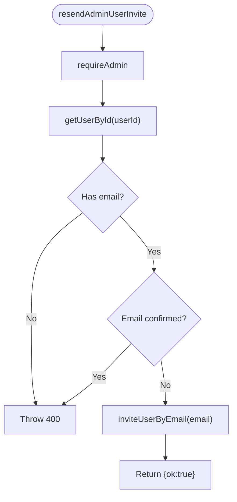

**Diagram sources**
- [admin-users.ts:227-248](file://src/lib/admin-users.ts#L227-L248)

**Section sources**
- [admin-users.ts:227-248](file://src/lib/admin-users.ts#L227-L248)

### Input Validation and Sanitization
- Invitation form schema enforces email format and role enum.
- Full name and initials are trimmed and normalized.
- Email is lowercased and validated before inviting.

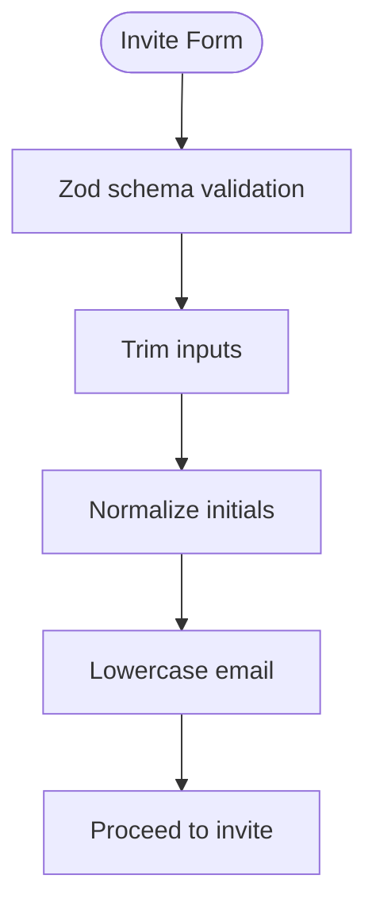

**Diagram sources**
- [admin.ts:1-10](file://lib/schemas/admin.ts#L1-L10)
- [admin-users.ts:169-225](file://src/lib/admin-users.ts#L169-L225)
- [admin-users.ts:55-67](file://src/lib/admin-users.ts#L55-L67)

**Section sources**
- [admin.ts:1-10](file://lib/schemas/admin.ts#L1-L10)
- [admin-users.ts:55-67](file://src/lib/admin-users.ts#L55-L67)
- [admin-users.ts:169-225](file://src/lib/admin-users.ts#L169-L225)

### Rate Limiting for Admin Operations
- Dedicated preset for admin user invitation.
- Enforced per actor user ID to prevent spam.

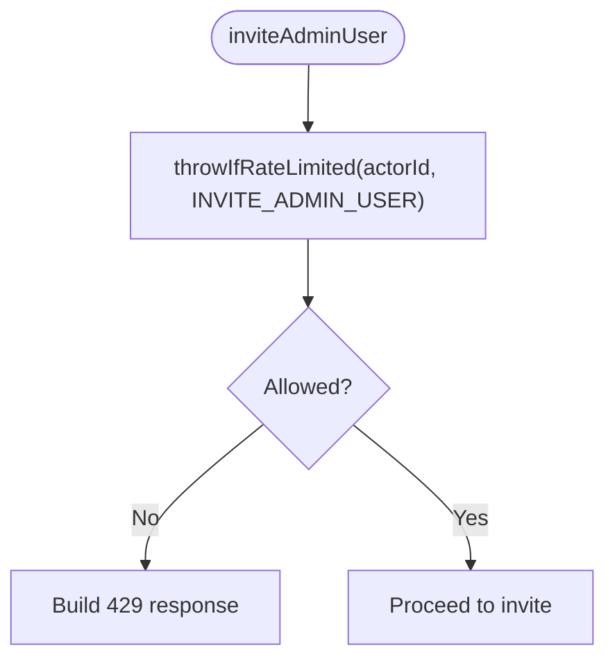

**Diagram sources**
- [admin-users.ts:169-174](file://src/lib/admin-users.ts#L169-L174)
- [rate-limit.ts:92-103](file://src/lib/rate-limit.ts#L92-L103)
- [rate-limit-config.ts:5-15](file://src/lib/rate-limit-config.ts#L5-L15)

**Section sources**
- [admin-users.ts:169-174](file://src/lib/admin-users.ts#L169-L174)
- [rate-limit.ts:92-103](file://src/lib/rate-limit.ts#L92-L103)
- [rate-limit-config.ts:5-15](file://src/lib/rate-limit-config.ts#L5-L15)

### Audit Logging and Notifications
- On successful invite, a notification is sent to admins.
- Audit log retrieval supports filtering and deduplication.
- Audit action constants enumerate logged events.

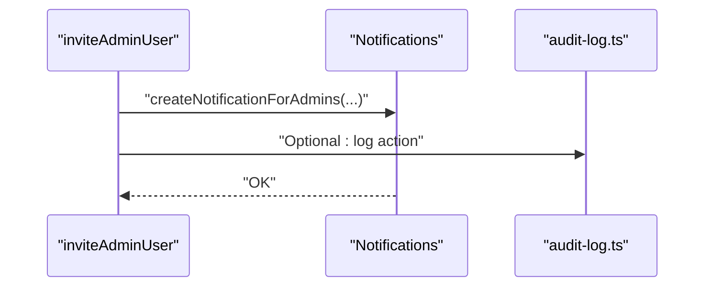

**Diagram sources**
- [admin-users.ts:216-222](file://src/lib/admin-users.ts#L216-L222)
- [audit-log.ts:1-183](file://src/lib/audit-log.ts#L1-L183)
- [audit-log-actions.ts:1-28](file://src/lib/audit-log-actions.ts#L1-L28)

**Section sources**
- [admin-users.ts:216-222](file://src/lib/admin-users.ts#L216-L222)
- [audit-log.ts:1-183](file://src/lib/audit-log.ts#L1-L183)
- [audit-log-actions.ts:1-28](file://src/lib/audit-log-actions.ts#L1-L28)

## Dependency Analysis
- Cohesion:
  - Admin user operations are cohesive within a single module.
- Coupling:
  - Server functions depend on requireAdmin and Supabase admin client.
  - UI depends on server functions via TanStack Start server functions.
- External dependencies:
  - Supabase Auth and Postgres for identity and roles.
  - In-memory rate limiter with optional Redis backend.

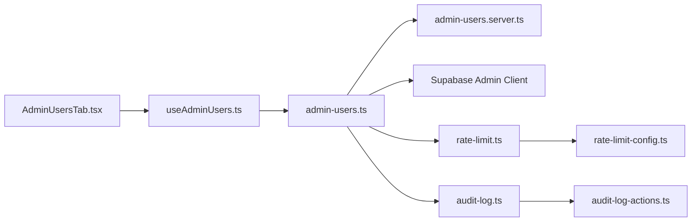

**Diagram sources**
- [admin-users.ts:1-279](file://src/lib/admin-users.ts#L1-L279)
- [admin-users.server.ts:1-18](file://src/lib/admin-users.server.ts#L1-L18)
- [rate-limit.ts:1-104](file://src/lib/rate-limit.ts#L1-L104)
- [rate-limit-config.ts:1-31](file://src/lib/rate-limit-config.ts#L1-L31)
- [audit-log.ts:1-183](file://src/lib/audit-log.ts#L1-L183)
- [audit-log-actions.ts:1-28](file://src/lib/audit-log-actions.ts#L1-L28)
- [AdminUsersTab.tsx:1-497](file://src/components/admin/AdminUsersTab.tsx#L1-L497)
- [useAdminUsers.ts:1-213](file://src/hooks/useAdminUsers.ts#L1-L213)

**Section sources**
- [admin-users.ts:1-279](file://src/lib/admin-users.ts#L1-L279)
- [admin-users.server.ts:1-18](file://src/lib/admin-users.server.ts#L1-L18)
- [rate-limit.ts:1-104](file://src/lib/rate-limit.ts#L1-L104)
- [rate-limit-config.ts:1-31](file://src/lib/rate-limit-config.ts#L1-L31)
- [audit-log.ts:1-183](file://src/lib/audit-log.ts#L1-L183)
- [audit-log-actions.ts:1-28](file://src/lib/audit-log-actions.ts#L1-L28)
- [AdminUsersTab.tsx:1-497](file://src/components/admin/AdminUsersTab.tsx#L1-L497)
- [useAdminUsers.ts:1-213](file://src/hooks/useAdminUsers.ts#L1-L213)

## Performance Considerations
- Batch operations:
  - Bulk role updates and invites are executed concurrently with settled promises to reduce latency.
- Deduplication:
  - Audit log retrieval deduplicates entries by message and second to avoid noisy logs.
- Pagination:
  - Audit log supports server-side pagination after deduplication.
- Rate limiting:
  - Per-user sliding window prevents abuse during mass invitations.

[No sources needed since this section provides general guidance]

## Troubleshooting Guide
- Authentication failures:
  - Missing or invalid bearer token leads to 401; ensure the frontend passes a valid access token.
- Authorization failures:
  - Non-admin users receive 403; verify the actor has the admin role.
- Rate limit exceeded:
  - Exceeding the admin user invitation limit returns 429 with Retry-After and X-RateLimit headers.
- Common validation errors:
  - Invalid role, invalid email, self-disable/self-delete protection, last admin constraint violations.
- Error messaging:
  - UI surfaces friendly messages derived from server errors; inspect toast messages and network responses.

**Section sources**
- [admin-users.server.ts:1-18](file://src/lib/admin-users.server.ts#L1-L18)
- [admin-users.ts:137-167](file://src/lib/admin-users.ts#L137-L167)
- [admin-users.ts:169-225](file://src/lib/admin-users.ts#L169-L225)
- [admin-users.ts:250-279](file://src/lib/admin-users.ts#L250-L279)
- [rate-limit.ts:74-90](file://src/lib/rate-limit.ts#L74-L90)
- [admin-error-message.ts:1-21](file://src/lib/admin/admin-error-message.ts#L1-L21)

## Conclusion
The administrative management endpoints provide a secure, rate-limited, and auditable suite of operations for managing users and roles. They enforce strict authorization, sanitize inputs, and integrate with Supabase for identity and database operations. The UI binds to server functions to deliver a responsive admin experience with robust error handling and notifications.