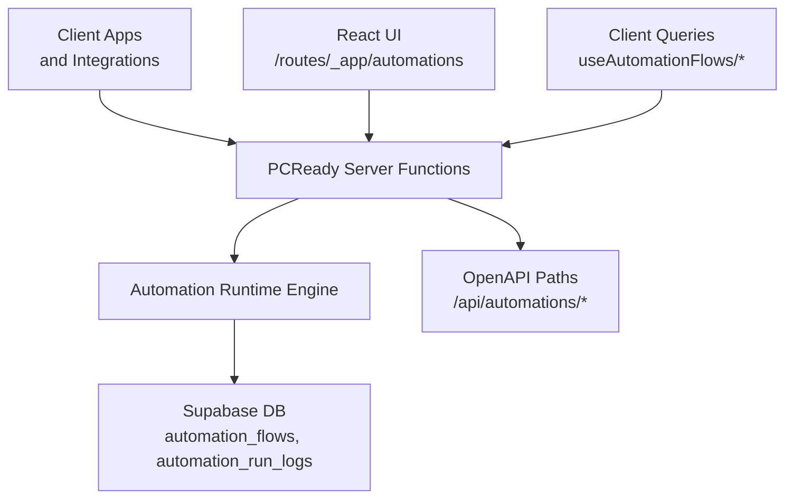
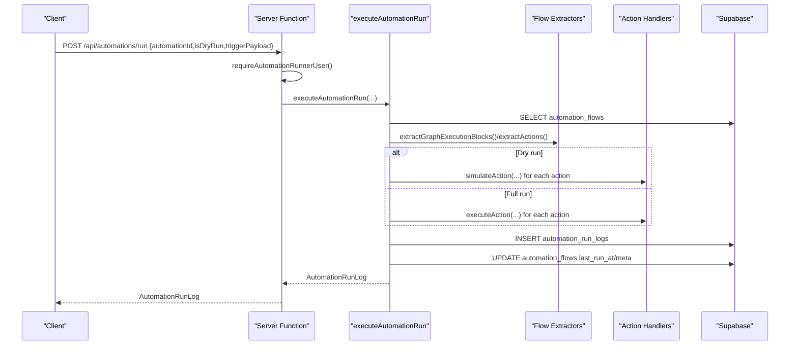
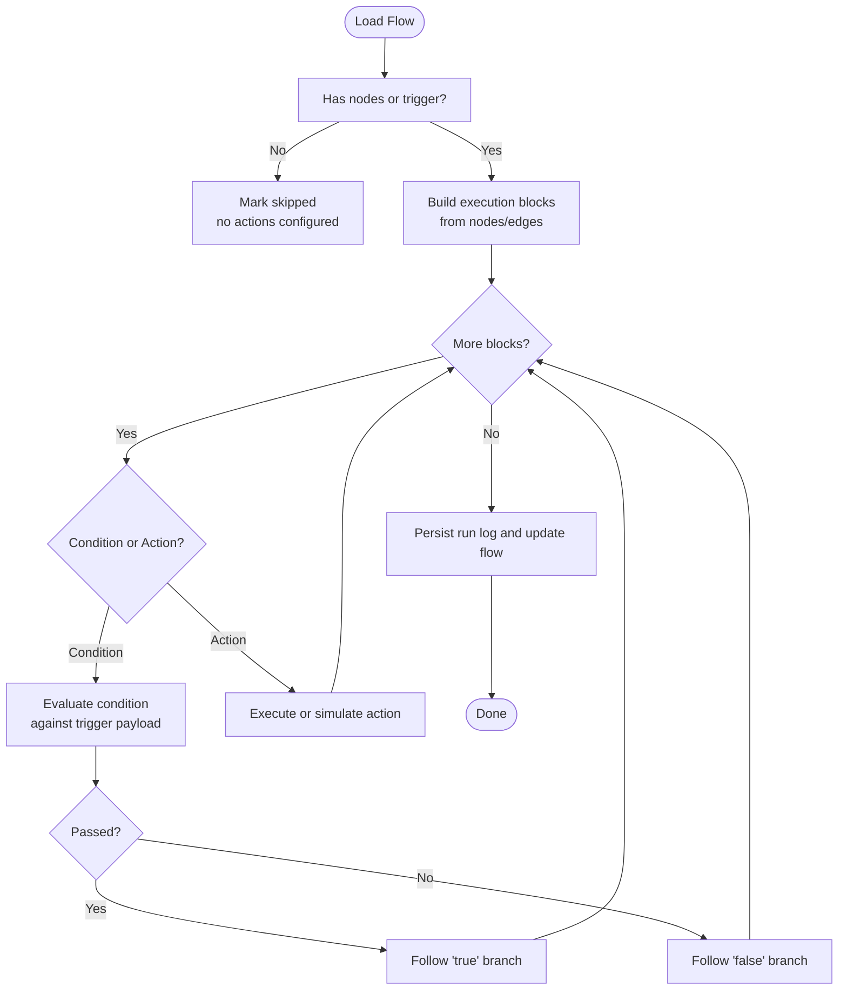
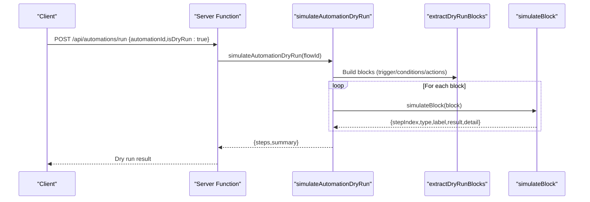
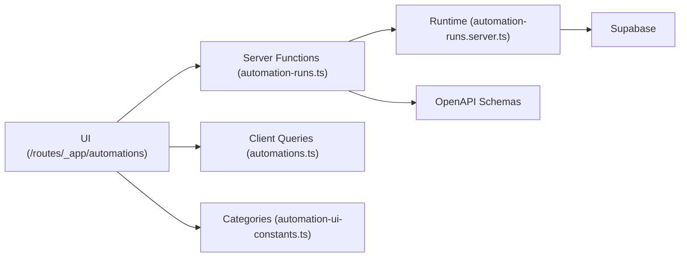

# Automation Management Endpoints

<cite>
**Referenced Files in This Document**
- [openapi.yaml](file://public/openapi/openapi.yaml)
- [automation-runs.ts](file://src/lib/automation-runs.ts)
- [automation-runs.server.ts](file://src/lib/automation-runs.server.ts)
- [automations.ts](file://src/lib/queries/automations.ts)
- [automation.ts](file://src/types/automation.ts)
- [automations.tsx](file://src/routes/_app/automations.tsx)
- [automation-ui-constants.ts](file://src/lib/automations/automation-ui-constants.ts)
</cite>

## Table of Contents
1. [Introduction](#introduction)
2. [Project Structure](#project-structure)
3. [Core Components](#core-components)
4. [Architecture Overview](#architecture-overview)
5. [Detailed Component Analysis](#detailed-component-analysis)
6. [Dependency Analysis](#dependency-analysis)
7. [Performance Considerations](#performance-considerations)
8. [Troubleshooting Guide](#troubleshooting-guide)
9. [Conclusion](#conclusion)
10. [Appendices](#appendices)

## Introduction
This document describes the automation management server functions and their associated API endpoints. It covers rule lifecycle operations (create, update, delete, duplicate, archive, toggle active), manual execution and dry-run, run logging and statistics, and the underlying automation flow engine. It also explains validation, triggers, conditions, and action processing, along with scheduling, logging, and error handling patterns.

## Project Structure
The automation system spans OpenAPI definitions, server-side functions, client-side queries, and UI components:
- OpenAPI defines the REST endpoints for automation execution, logs, and statistics.
- Server functions implement the runtime engine, validation, and persistence.
- Client queries manage rule CRUD and UI state.
- UI components orchestrate the wizard and builder experiences.



**Diagram sources**
- [openapi.yaml:575-636](file://public/openapi/openapi.yaml#L575-L636)
- [automation-runs.ts:94-142](file://src/lib/automation-runs.ts#L94-L142)
- [automation-runs.server.ts:38-207](file://src/lib/automation-runs.server.ts#L38-L207)

**Section sources**
- [openapi.yaml:575-636](file://public/openapi/openapi.yaml#L575-L636)
- [automation-runs.ts:94-142](file://src/lib/automation-runs.ts#L94-L142)
- [automation-runs.server.ts:38-207](file://src/lib/automation-runs.server.ts#L38-L207)

## Core Components
- Execution endpoints
  - Manual run: POST /api/automations/run
  - List run logs: POST /api/automations/run-logs
  - Run statistics: POST /api/automations/run-stats
- Rule lifecycle endpoints (client queries)
  - Create, update, delete, duplicate, archive, toggle active
- Types and schemas
  - AutomationFlow, AutomationRunLog, RunAutomationNowRequest, AutomationRunStatsResponse
  - Zod schemas for actions and validation

**Section sources**
- [openapi.yaml:575-636](file://public/openapi/openapi.yaml#L575-L636)
- [automation-runs.ts:33-63](file://src/lib/automation-runs.ts#L33-L63)
- [automation.ts:23-72](file://src/types/automation.ts#L23-L72)

## Architecture Overview
The automation runtime is composed of:
- Server functions that validate requests, enforce permissions, and execute flows.
- A flow executor that interprets trigger, conditions, and actions.
- Action handlers for supported operations (e.g., email, notifications, status updates).
- Persistence of run logs and periodic updates of flow metadata.



**Diagram sources**
- [openapi.yaml:575-595](file://public/openapi/openapi.yaml#L575-L595)
- [automation-runs.ts:94-108](file://src/lib/automation-runs.ts#L94-L108)
- [automation-runs.server.ts:94-207](file://src/lib/automation-runs.server.ts#L94-L207)

## Detailed Component Analysis

### Execution Endpoints
- POST /api/automations/run
  - Purpose: Manually execute an automation flow immediately.
  - Request: RunAutomationNowRequest (automationId, isDryRun, triggerPayload).
  - Response: AutomationRunLog.
  - Behavior: Validates access token, resolves user, executes flow, persists run log, updates flow metadata, and notifies on failure.
- POST /api/automations/run-logs
  - Purpose: Retrieve recent run logs for a given automationId.
  - Request: { automationId }.
  - Response: Array of AutomationRunLog.
- POST /api/automations/run-stats
  - Purpose: Compute run statistics and KPIs across automations.
  - Response: AutomationRunStatsResponse with stats and KPIs.

**Section sources**
- [openapi.yaml:575-636](file://public/openapi/openapi.yaml#L575-L636)
- [automation-runs.ts:77-92](file://src/lib/automation-runs.ts#L77-L92)
- [automation-runs.ts:144-210](file://src/lib/automation-runs.ts#L144-L210)

### Rule Lifecycle Endpoints (Client Queries)
- Create: insert into automation_flows with name, description, category, active, version, flow_definition.
- Update: update automation_flows by id.
- Delete: delete automation_flows by id.
- Duplicate: clone flow_definition into a new automation_flows row.
- Archive: set active=false and update flow_definition.
- Toggle Active: set active boolean.

These operations are implemented via client-side mutations and invalidate caches to keep UI state consistent.

**Section sources**
- [automations.ts:37-98](file://src/lib/queries/automations.ts#L37-L98)
- [automations.ts:111-165](file://src/lib/queries/automations.ts#L111-L165)

### Automation Flow Validation, Triggers, Conditions, and Actions
- Flow definition storage
  - flow_definition: JSON blob containing nodes, edges, and meta (including wizard and migration info).
  - trigger_definition: optional structured trigger.
  - actions_definition: optional array of action configs.
- Validation and extraction
  - extractGraphExecutionBlocks: builds ordered blocks from nodes/edges, evaluating conditions and traversing branches.
  - extractActions: collects actions from actions_definition, wizard, or nodes.
- Dry run simulation
  - simulateAutomationDryRun: validates trigger/conditions/actions without side effects.
  - simulateBlock/simulateAction: returns pass/skip/error outcomes for each step.



**Diagram sources**
- [automation-runs.server.ts:297-341](file://src/lib/automation-runs.server.ts#L297-L341)
- [automation-runs.server.ts:362-385](file://src/lib/automation-runs.server.ts#L362-L385)
- [automation-runs.server.ts:406-426](file://src/lib/automation-runs.server.ts#L406-L426)

**Section sources**
- [automation-runs.server.ts:279-295](file://src/lib/automation-runs.server.ts#L279-L295)
- [automation-runs.server.ts:297-341](file://src/lib/automation-runs.server.ts#L297-L341)
- [automation-runs.server.ts:406-426](file://src/lib/automation-runs.server.ts#L406-L426)

### Action Processing and Supported Operations
Supported actions and their configuration schemas:
- Send Email
  - Config: subject, body, optional to, is_html.
  - Resolution: resolves recipient from config.to or trigger payload fields.
- Update Ticket Status
  - Config: ticket_id (optional), status enum.
  - Resolution: resolves ticket_id from config or trigger payload.
- Create Notification
  - Config: user_id (optional), type, title, body, link, payload.
  - Resolution: resolves user_id from config or trigger payload.
- Update Device Status
  - Config: device_id (optional), status enum.
  - Resolution: resolves device_id from config or trigger payload.
- Assign Ticket
  - Config: ticket_id (optional), assignee_id.
  - Resolution: resolves ids from config or trigger payload.
- Delay
  - Config: amount (integer), unit (hours/days).
- Send Webhook
  - Config: url, payload.

Validation uses Zod schemas; execution resolves identifiers from trigger payload when not provided directly.

**Section sources**
- [automation-runs.server.ts:522-569](file://src/lib/automation-runs.server.ts#L522-L569)
- [automation-runs.server.ts:629-674](file://src/lib/automation-runs.server.ts#L629-L674)
- [automation-runs.server.ts:676-714](file://src/lib/automation-runs.server.ts#L676-L714)
- [automation-runs.server.ts:716-772](file://src/lib/automation-runs.server.ts#L716-L772)
- [automation-runs.server.ts:774-807](file://src/lib/automation-runs.server.ts#L774-L807)
- [automation-runs.server.ts:584-594](file://src/lib/automation-runs.server.ts#L584-L594)
- [automation-runs.server.ts:596-608](file://src/lib/automation-runs.server.ts#L596-L608)

### Scheduling and Dry Run Functionality
- Scheduling: The runtime supports manual runs and dry runs. Scheduled triggers are modeled as part of the flow definition and evaluated during execution.
- Dry run: simulateAutomationDryRun validates the flow without performing side effects. It simulates conditions and actions, returning a summary and step-by-step results.



**Diagram sources**
- [openapi.yaml:575-595](file://public/openapi/openapi.yaml#L575-L595)
- [automation-runs.ts:110-118](file://src/lib/automation-runs.ts#L110-L118)
- [automation-runs.server.ts:227-267](file://src/lib/automation-runs.server.ts#L227-L267)
- [automation-runs.server.ts:406-426](file://src/lib/automation-runs.server.ts#L406-L426)
- [automation-runs.server.ts:428-474](file://src/lib/automation-runs.server.ts#L428-L474)

**Section sources**
- [automation-runs.ts:110-118](file://src/lib/automation-runs.ts#L110-L118)
- [automation-runs.server.ts:227-267](file://src/lib/automation-runs.server.ts#L227-L267)

### Execution Logging and Health Computation
- Run logs capture:
  - automation_id, triggered_by, status, duration_ms, trigger_payload, actions_executed, error_message, is_dry_run.
- Health computation:
  - computeHealth evaluates recent logs to derive health status (healthy, degraded, failing, never_run).

```mermaid
flowchart TD
LoadLogs["Load recent logs"] --> Count["Count statuses"]
Count --> Compare{"Compare patterns"}
Compare --> |All error (last N)| Failing["failing"]
Compare --> |Some error| Degraded["degraded"]
Compare --> |All success| Healthy["healthy"]
Compare --> |None| Never["never_run"]
```

**Diagram sources**
- [automation-runs.ts:46-54](file://src/lib/automation-runs.ts#L46-L54)
- [automation-runs.ts:269-277](file://src/lib/automation-runs.ts#L269-L277)
- [automation-runs.server.ts:183-196](file://src/lib/automation-runs.server.ts#L183-L196)

**Section sources**
- [automation-runs.ts:269-277](file://src/lib/automation-runs.ts#L269-L277)
- [automation-runs.server.ts:183-196](file://src/lib/automation-runs.server.ts#L183-L196)

### Examples and Payloads
- RunAutomationNowRequest
  - automationId: UUID of the automation flow.
  - isDryRun: boolean flag to enable dry run.
  - triggerPayload: arbitrary JSON object passed to actions and conditions.
- AutomationFlow (stored in automation_flows)
  - id, name, description, category, active, version, flow_definition, trigger_definition, actions_definition, summary, last_run_at, created_at, updated_at.
- AutomationRunLog
  - id, automation_id, triggered_at, triggered_by, status, duration_ms, trigger_payload, actions_executed, error_message, is_dry_run.
- AutomationRunStatsResponse
  - stats: per-automation counts and health.
  - kpis: activeAutomations, runsToday, successToday, errorToday, successRate7d, automationsWithRecentErrors.

Note: Example payloads are defined in the OpenAPI schema and can be viewed in the referenced file.

**Section sources**
- [openapi.yaml:942-974](file://public/openapi/openapi.yaml#L942-L974)
- [automation.ts:23-72](file://src/types/automation.ts#L23-L72)

## Dependency Analysis
- Server functions depend on:
  - Supabase client for authentication and data access.
  - Zod schemas for request/response validation.
  - Action handlers for each supported operation.
- UI depends on:
  - Server functions for execution and stats.
  - Client queries for rule CRUD and caching.
  - Constants for categories.



**Diagram sources**
- [automation-runs.ts:94-142](file://src/lib/automation-runs.ts#L94-L142)
- [automation-runs.server.ts:38-207](file://src/lib/automation-runs.server.ts#L38-L207)
- [automations.tsx:15-63](file://src/routes/_app/automations.tsx#L15-L63)
- [automations.ts:15-178](file://src/lib/queries/automations.ts#L15-L178)
- [automation-ui-constants.ts:1](file://src/lib/automations/automation-ui-constants.ts#L1)

**Section sources**
- [automation-runs.ts:94-142](file://src/lib/automation-runs.ts#L94-L142)
- [automation-runs.server.ts:38-207](file://src/lib/automation-runs.server.ts#L38-L207)
- [automations.tsx:15-63](file://src/routes/_app/automations.tsx#L15-L63)
- [automations.ts:15-178](file://src/lib/queries/automations.ts#L15-L178)
- [automation-ui-constants.ts:1](file://src/lib/automations/automation-ui-constants.ts#L1)

## Performance Considerations
- Minimize payload size: Keep triggerPayload concise to reduce serialization and DB storage overhead.
- Batch operations: Use run-stats to monitor health and avoid frequent high-volume runs.
- Limit log retrieval: The logs endpoint limits returned entries to reduce bandwidth.
- Action efficiency: Prefer direct ID resolution from payload to avoid extra lookups when possible.
- Dry run before production: Use dry run to validate flows and catch errors early.

[No sources needed since this section provides general guidance]

## Troubleshooting Guide
- Authentication failures
  - requireAutomationRunnerUser throws unauthorized if token invalid or user lacks roles (admin, tech).
- Permission denied
  - Non-admin/tech users receive forbidden responses when invoking execution endpoints.
- Flow validation errors
  - Missing trigger or nodes result in skipped execution with explicit reasons.
- Action errors
  - Action handlers return structured ActionResult with error messages; inspect actions_executed in run logs.
- Health monitoring
  - Use run-stats to detect failing or degraded automations.

**Section sources**
- [automation-runs.server.ts:78-92](file://src/lib/automation-runs.server.ts#L78-L92)
- [automation-runs.server.ts:117-169](file://src/lib/automation-runs.server.ts#L117-L169)
- [automation-runs.ts:269-277](file://src/lib/automation-runs.ts#L269-L277)

## Conclusion
The automation management system provides robust server functions for manual execution, dry runs, logging, and statistics, backed by a flexible flow engine supporting triggers, conditions, and actions. The OpenAPI specification and client-side queries enable seamless integration and UI-driven management of automation rules.

[No sources needed since this section summarizes without analyzing specific files]

## Appendices

### API Definitions and Schemas
- Endpoints
  - POST /api/automations/run
  - POST /api/automations/run-logs
  - POST /api/automations/run-stats
- Schemas
  - RunAutomationNowRequest
  - AutomationRunLog
  - AutomationRunStatsResponse
  - AutomationFlow

**Section sources**
- [openapi.yaml:575-636](file://public/openapi/openapi.yaml#L575-L636)
- [openapi.yaml:942-974](file://public/openapi/openapi.yaml#L942-L974)