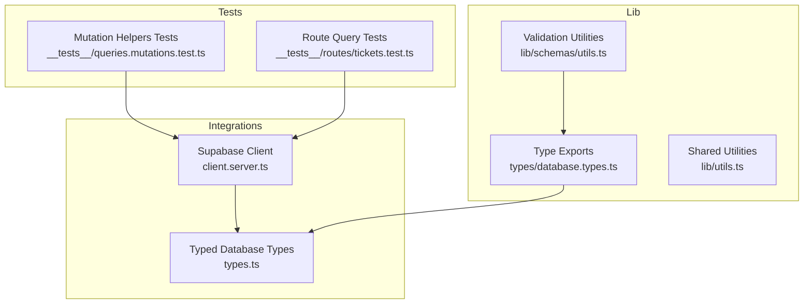
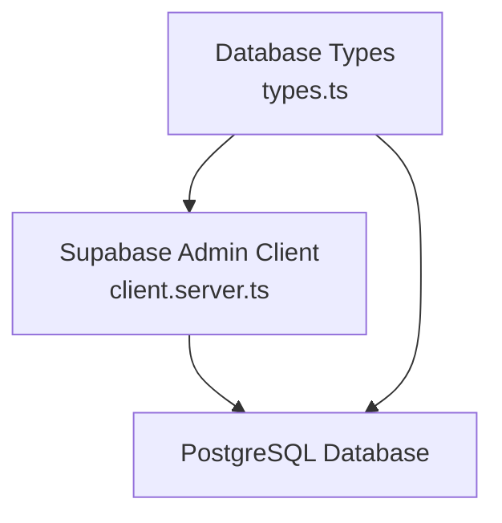
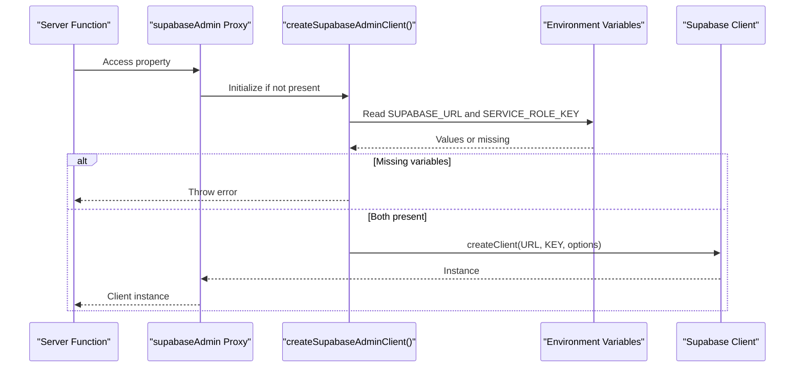
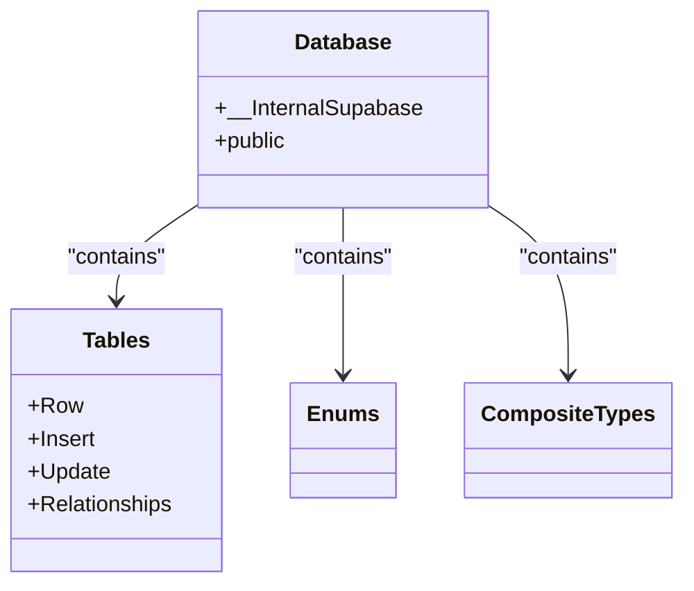
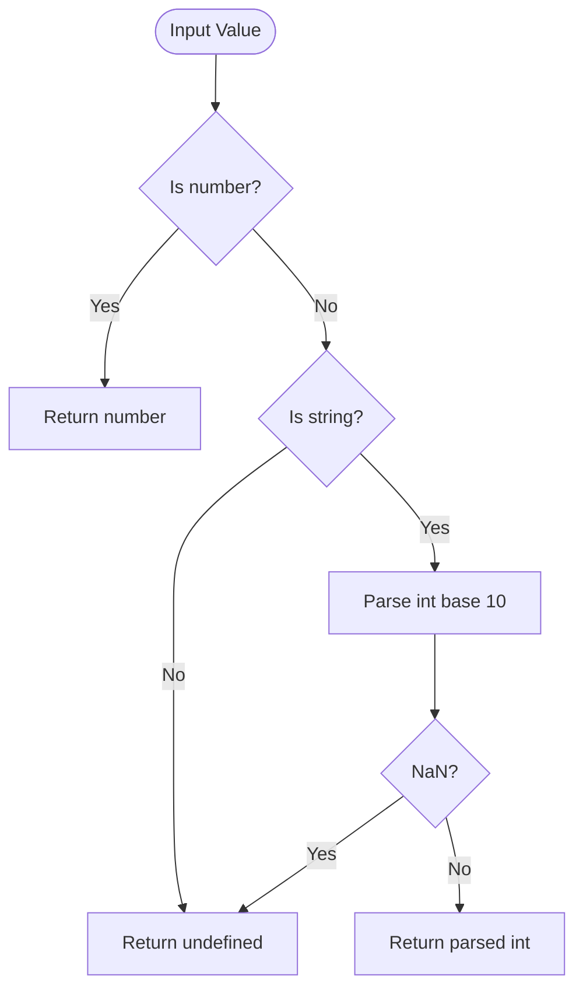
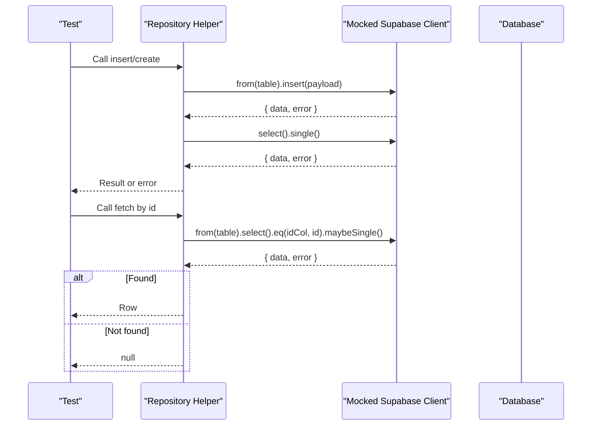
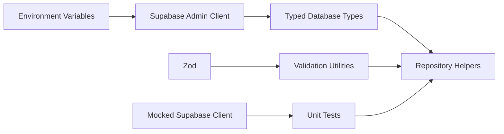

# Query Helper Functions

<cite>
**Referenced Files in This Document**
- [client.server.ts](file://src/integrations/supabase/client.server.ts)
- [types.ts](file://src/integrations/supabase/types.ts)
- [database.types.ts](file://src/types/database.types.ts)
- [utils.ts](file://src/lib/utils.ts)
- [queries.mutations.test.ts](file://src/__tests__/queries.mutations.test.ts)
- [tickets.test.ts](file://src/__tests__/routes/tickets.test.ts)
- [utils.ts](file://src/lib/schemas/utils.ts)
- [index.ts](file://lib/schemas/index.ts)
</cite>

## Table of Contents
1. [Introduction](#introduction)
2. [Project Structure](#project-structure)
3. [Core Components](#core-components)
4. [Architecture Overview](#architecture-overview)
5. [Detailed Component Analysis](#detailed-component-analysis)
6. [Dependency Analysis](#dependency-analysis)
7. [Performance Considerations](#performance-considerations)
8. [Troubleshooting Guide](#troubleshooting-guide)
9. [Conclusion](#conclusion)
10. [Appendices](#appendices)

## Introduction
This document describes the database query helper functions and utility server functions used across the application. It focuses on:
- Typed Supabase client abstractions and environment-driven initialization
- Repository-style query helpers for common operations (select, insert, upsert, update, delete)
- Schema validation patterns using Zod and data transformation utilities
- Error handling strategies and database operation abstractions
- Query builder patterns, filtering mechanisms, and pagination support
- Examples of common query operations, data formatting functions, and utility helper methods
- Integration with Zod schemas, type safety patterns, and performance optimization techniques

## Project Structure
The query and database-related code is organized around:
- Supabase client abstractions for server-side admin operations
- Strongly typed database schema definitions
- Zod-based validation and transformation utilities
- Test suites validating query helpers and server routes

**Diagram sources**
- [client.server.ts:1-42](file://src/integrations/supabase/client.server.ts#L1-L42)
- [types.ts:1-800](file://src/integrations/supabase/types.ts#L1-L800)
- [database.types.ts:1-1](file://src/types/database.types.ts#L1-L1)
- [utils.ts:1-19](file://src/lib/schemas/utils.ts#L1-L19)
- [utils.ts:1-7](file://src/lib/utils.ts#L1-L7)
- [queries.mutations.test.ts:1-63](file://src/__tests__/queries.mutations.test.ts#L1-L63)
- [tickets.test.ts:1-35](file://src/__tests__/routes/tickets.test.ts#L1-L35)

**Section sources**
- [client.server.ts:1-42](file://src/integrations/supabase/client.server.ts#L1-L42)
- [types.ts:1-800](file://src/integrations/supabase/types.ts#L1-L800)
- [database.types.ts:1-1](file://src/types/database.types.ts#L1-L1)
- [utils.ts:1-19](file://src/lib/schemas/utils.ts#L1-L19)
- [utils.ts:1-7](file://src/lib/utils.ts#L1-L7)
- [queries.mutations.test.ts:1-63](file://src/__tests__/queries.mutations.test.ts#L1-L63)
- [tickets.test.ts:1-35](file://src/__tests__/routes/tickets.test.ts#L1-L35)

## Core Components
- Supabase Admin Client
  - Provides a lazily initialized, proxied Supabase client configured with service role credentials for server-side admin operations.
  - Enforces environment variable presence and logs meaningful errors when missing.
  - Prevents exposing RLS-bypassing credentials to client code.

- Typed Database Types
  - Defines the full Postgres schema as TypeScript types, including tables, views, enums, composite types, and relationship metadata.
  - Exposes generic helpers to extract strongly typed rows, inserts, updates, and enums from the schema.

- Validation and Transformation Utilities
  - Zod-based helpers for trimming strings, converting empty strings to null, and safely parsing integers.
  - Centralized exports for schema utilities.

- Shared Utilities
  - Lightweight Tailwind-based class merging utility for UI components.

- Test Coverage
  - Mutation tests validate insert operations into specific tables via mocked Supabase client.
  - Route tests validate select/maybeSingle patterns and null-return semantics.

**Section sources**
- [client.server.ts:1-42](file://src/integrations/supabase/client.server.ts#L1-L42)
- [types.ts:1-800](file://src/integrations/supabase/types.ts#L1-L800)
- [types.ts:1249-1278](file://src/integrations/supabase/types.ts#L1249-L1278)
- [types.ts:1330-1362](file://src/integrations/supabase/types.ts#L1330-L1362)
- [database.types.ts:1-1](file://src/types/database.types.ts#L1-L1)
- [utils.ts:1-19](file://src/lib/schemas/utils.ts#L1-L19)
- [index.ts:1-8](file://lib/schemas/index.ts#L1-L8)
- [utils.ts:1-7](file://src/lib/utils.ts#L1-L7)
- [queries.mutations.test.ts:1-63](file://src/__tests__/queries.mutations.test.ts#L1-L63)
- [tickets.test.ts:1-35](file://src/__tests__/routes/tickets.test.ts#L1-L35)

## Architecture Overview
The system separates concerns between:
- Typed schema access via generated types
- Client initialization and lifecycle management
- Query helpers and repository-style functions (as validated by tests)
- Validation and transformation utilities

**Diagram sources**
- [client.server.ts:1-42](file://src/integrations/supabase/client.server.ts#L1-L42)
- [types.ts:1-800](file://src/integrations/supabase/types.ts#L1-L800)

## Detailed Component Analysis

### Supabase Admin Client
- Purpose: Provide a singleton-like, lazily created Supabase client configured with service role credentials for server-side admin operations.
- Initialization:
  - Reads environment variables for Supabase URL and service role key.
  - Throws a descriptive error if either is missing.
  - Creates a client with disabled auth persistence to avoid token refresh loops.
- Access Pattern:
  - Uses a Proxy to defer initialization until the client is accessed, reducing cold-start overhead until needed.

**Diagram sources**
- [client.server.ts:1-42](file://src/integrations/supabase/client.server.ts#L1-L42)

**Section sources**
- [client.server.ts:1-42](file://src/integrations/supabase/client.server.ts#L1-L42)

### Typed Database Types and Helpers
- Database Type Definition:
  - Comprehensive schema definition including tables, views, enums, and relationships.
  - Generic helpers to extract typed rows and enums from the schema.
- Usage:
  - Enables compile-time safety for table operations and enum values.
  - Facilitates repository-style functions that operate on strongly typed entities.

**Diagram sources**
- [types.ts:1-800](file://src/integrations/supabase/types.ts#L1-L800)
- [types.ts:1249-1278](file://src/integrations/supabase/types.ts#L1249-L1278)
- [types.ts:1330-1362](file://src/integrations/supabase/types.ts#L1330-L1362)

**Section sources**
- [types.ts:1-800](file://src/integrations/supabase/types.ts#L1-L800)
- [types.ts:1249-1278](file://src/integrations/supabase/types.ts#L1249-L1278)
- [types.ts:1330-1362](file://src/integrations/supabase/types.ts#L1330-L1362)
- [database.types.ts:1-1](file://src/types/database.types.ts#L1-L1)

### Validation and Transformation Utilities
- Zod-based utilities:
  - Trimmed string transform
  - Optional trimmed string with empty-to-null conversion
  - Safe integer parser that handles numbers and numeric strings
- Exported via a central index for easy consumption.

**Diagram sources**
- [utils.ts:12-19](file://src/lib/schemas/utils.ts#L12-L19)

**Section sources**
- [utils.ts:1-19](file://src/lib/schemas/utils.ts#L1-L19)
- [index.ts:1-8](file://lib/schemas/index.ts#L1-L8)

### Query Helpers and Repository Patterns (Test-Driven)
- Repository-style helpers are validated by tests to perform:
  - Insert operations into specific tables (e.g., devices, ticket_status_history, activity_log, ticket_notes)
  - Select/maybeSingle retrieval with null handling
- These patterns demonstrate:
  - Encapsulation of table-specific operations behind typed helpers
  - Consistent return shapes and error handling expectations
  - Mockable Supabase client usage for unit testing

**Diagram sources**
- [queries.mutations.test.ts:1-63](file://src/__tests__/queries.mutations.test.ts#L1-L63)
- [tickets.test.ts:1-35](file://src/__tests__/routes/tickets.test.ts#L1-L35)

**Section sources**
- [queries.mutations.test.ts:1-63](file://src/__tests__/queries.mutations.test.ts#L1-L63)
- [tickets.test.ts:1-35](file://src/__tests__/routes/tickets.test.ts#L1-L35)

### Shared Utilities
- Tailwind-based class merging utility for UI components.
- Minimal footprint and focused on composition of Tailwind classes.

**Section sources**
- [utils.ts:1-7](file://src/lib/utils.ts#L1-L7)

## Dependency Analysis
- Supabase Admin Client depends on:
  - Environment variables for credentials
  - Supabase client library
- Typed Database Types depend on:
  - Generated schema definitions
  - Generic helpers for extracting types
- Validation Utilities depend on:
  - Zod
- Tests depend on:
  - Mocked Supabase client to validate helper behavior

**Diagram sources**
- [client.server.ts:1-42](file://src/integrations/supabase/client.server.ts#L1-L42)
- [types.ts:1-800](file://src/integrations/supabase/types.ts#L1-L800)
- [utils.ts:1-19](file://src/lib/schemas/utils.ts#L1-L19)
- [queries.mutations.test.ts:1-63](file://src/__tests__/queries.mutations.test.ts#L1-L63)
- [tickets.test.ts:1-35](file://src/__tests__/routes/tickets.test.ts#L1-L35)

**Section sources**
- [client.server.ts:1-42](file://src/integrations/supabase/client.server.ts#L1-L42)
- [types.ts:1-800](file://src/integrations/supabase/types.ts#L1-L800)
- [utils.ts:1-19](file://src/lib/schemas/utils.ts#L1-L19)
- [queries.mutations.test.ts:1-63](file://src/__tests__/queries.mutations.test.ts#L1-L63)
- [tickets.test.ts:1-35](file://src/__tests__/routes/tickets.test.ts#L1-L35)

## Performance Considerations
- Lazy initialization of the Supabase client reduces startup overhead until the client is actually used.
- Using typed helpers avoids runtime type mismatches and reduces accidental N+1 scenarios by encouraging batched operations.
- Prefer maybeSingle for optional lookups to minimize unnecessary selects.
- Keep payloads minimal when inserting/updating to reduce network and serialization costs.

## Troubleshooting Guide
- Missing environment variables:
  - Symptom: Error thrown during client initialization.
  - Resolution: Ensure SUPABASE_URL and SUPABASE_SERVICE_ROLE_KEY are set in the environment.
- Unexpected nulls:
  - Symptom: maybeSingle returns null.
  - Resolution: Verify filters and existence of records; handle null in calling code.
- Type mismatches:
  - Symptom: Compilation errors when using typed helpers.
  - Resolution: Align payloads with generated Insert/Update types; confirm enum values match schema.

**Section sources**
- [client.server.ts:10-20](file://src/integrations/supabase/client.server.ts#L10-L20)
- [tickets.test.ts:20-34](file://src/__tests__/routes/tickets.test.ts#L20-L34)

## Conclusion
The repository integrates a typed Supabase client, strong schema typing, and Zod-based validation utilities to deliver safe, maintainable database operations. Test coverage demonstrates repository-style helpers for inserts and selects, while the typed schema ensures compile-time correctness. Following the patterns outlined here enables consistent query building, robust error handling, and scalable performance.

## Appendices

### Common Query Operations (Pattern References)
- Insert into a table:
  - See mutation tests for insert patterns and table-specific helpers.
  - Reference: [queries.mutations.test.ts:30-38](file://src/__tests__/queries.mutations.test.ts#L30-L38)
- Fetch by ID with maybeSingle:
  - See route tests for maybeSingle usage and null handling.
  - Reference: [tickets.test.ts:20-34](file://src/__tests__/routes/tickets.test.ts#L20-L34)

### Data Formatting and Validation Utilities
- Trimming and optional conversions:
  - Reference: [utils.ts:3-10](file://src/lib/schemas/utils.ts#L3-L10)
- Safe integer parsing:
  - Reference: [utils.ts:12-19](file://src/lib/schemas/utils.ts#L12-L19)

### Type Safety and Schema Integration
- Typed tables and enums:
  - Reference: [types.ts:1-800](file://src/integrations/supabase/types.ts#L1-L800)
  - Reference: [types.ts:1249-1278](file://src/integrations/supabase/types.ts#L1249-L1278)
  - Reference: [types.ts:1330-1362](file://src/integrations/supabase/types.ts#L1330-L1362)
- Exported type alias:
  - Reference: [database.types.ts:1-1](file://src/types/database.types.ts#L1-L1)