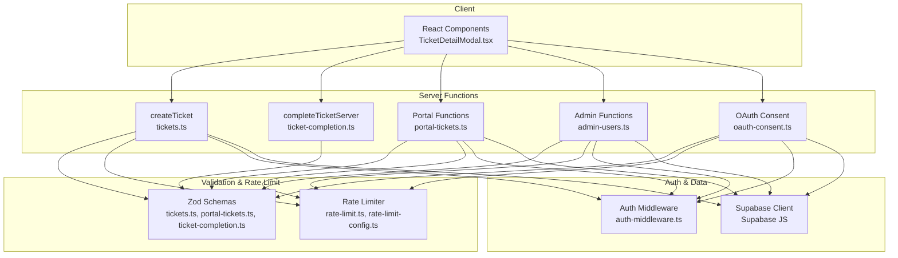
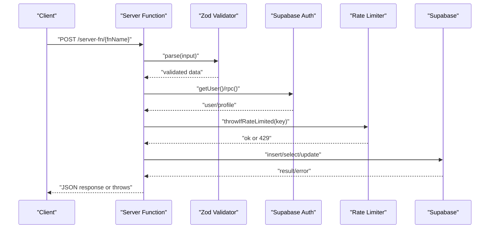
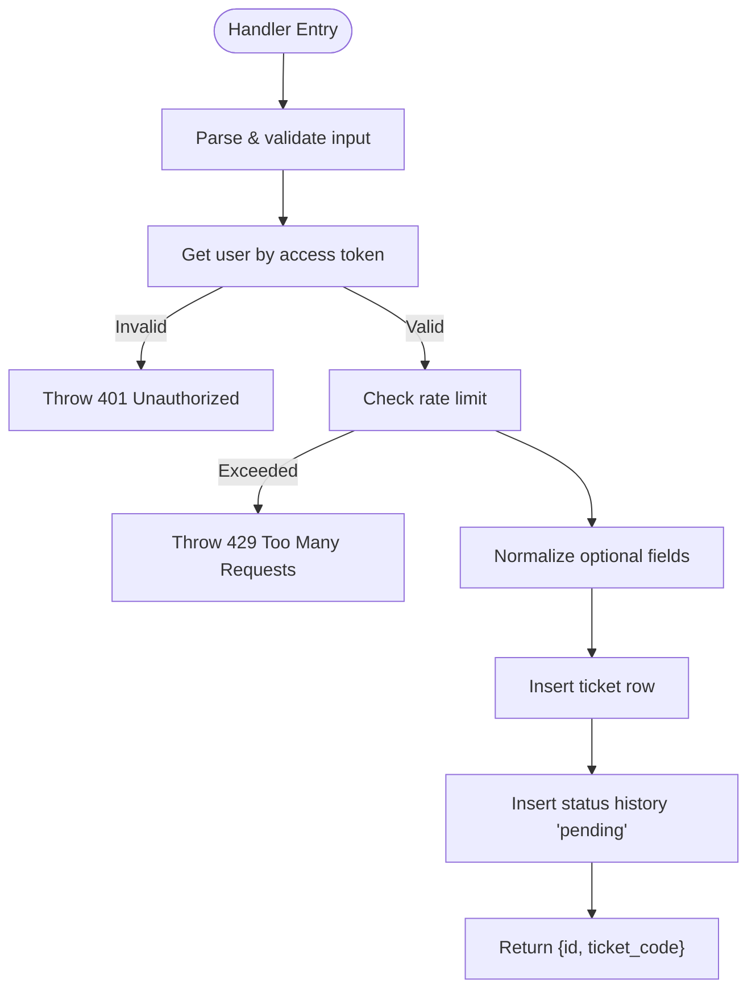
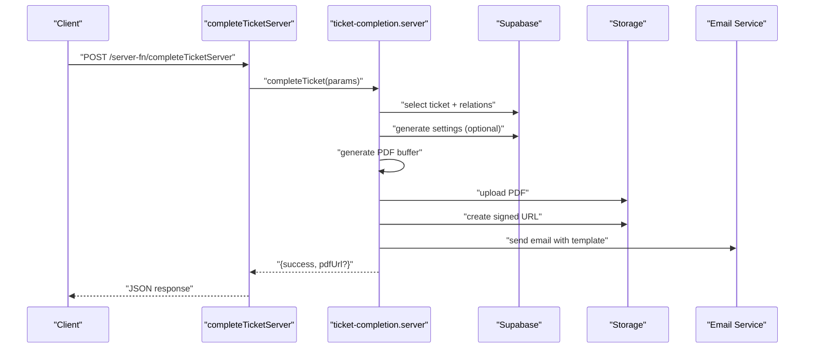
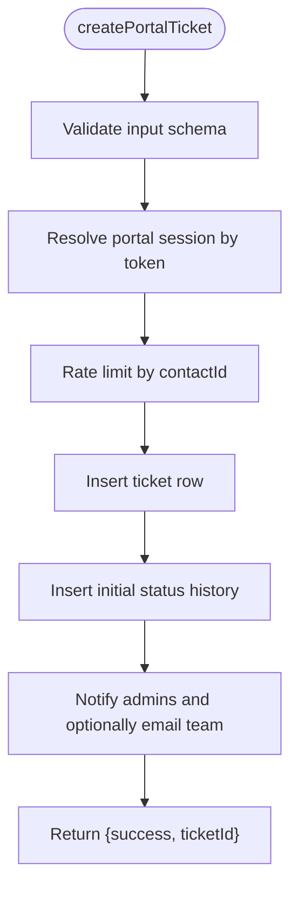
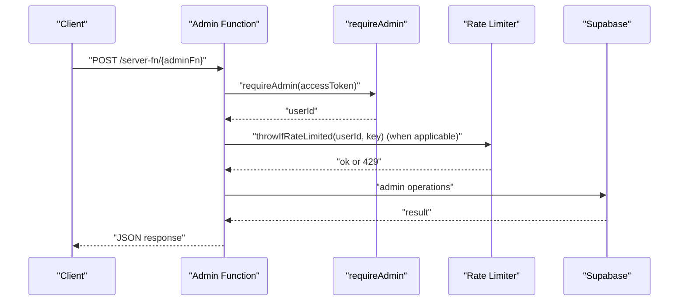
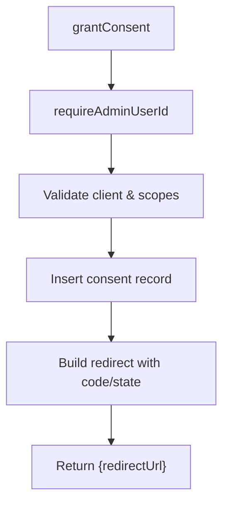
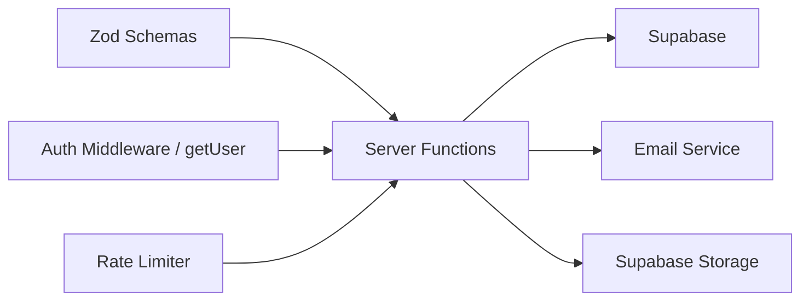

# Server Functions API

<cite>
**Referenced Files in This Document**
- [tickets.ts](file://src/lib/tickets.ts)
- [ticket-completion.ts](file://src/lib/ticket-completion.ts)
- [ticket-completion.server.ts](file://src/lib/ticket-completion.server.ts)
- [portal-tickets.ts](file://src/lib/portal-tickets.ts)
- [portal-tickets.server.ts](file://src/lib/portal-tickets.server.ts)
- [admin-users.ts](file://src/lib/admin-users.ts)
- [admin-users.server.ts](file://src/lib/admin-users.server.ts)
- [oauth-consent.ts](file://src/lib/oauth-consent.ts)
- [rate-limit.ts](file://src/lib/rate-limit.ts)
- [rate-limit-config.ts](file://src/lib/rate-limit-config.ts)
- [auth-middleware.ts](file://src/integrations/supabase/auth-middleware.ts)
- [TicketDetailModal.tsx](file://src/components/pcready/TicketDetailModal.tsx)
- [tickets.test.ts](file://src/__tests__/routes/tickets.test.ts)
- [rate-limit.test.ts](file://src/__tests__/lib/rate-limit.test.ts)
</cite>

## Table of Contents
1. [Introduction](#introduction)
2. [Project Structure](#project-structure)
3. [Core Components](#core-components)
4. [Architecture Overview](#architecture-overview)
5. [Detailed Component Analysis](#detailed-component-analysis)
6. [Dependency Analysis](#dependency-analysis)
7. [Performance Considerations](#performance-considerations)
8. [Troubleshooting Guide](#troubleshooting-guide)
9. [Conclusion](#conclusion)
10. [Appendices](#appendices)

## Introduction
This document describes the TanStack Server Functions API used by PCReady for managing tickets, portal interactions, and administrative operations. It covers endpoint semantics, HTTP methods, URL patterns, request/response schemas, Zod-based validation, authentication, rate limiting, access control, error handling, and testing approaches. It also explains the createServerFn pattern, handler functions, and data transformations between client and server.

## Project Structure
The server functions are implemented as TanStack Server Functions using createServerFn with Zod input validators and handlers. They integrate with Supabase for authentication and data access, enforce rate limits, and trigger downstream actions such as notifications and emails.

**Diagram sources**
- [tickets.ts:50-111](file://src/lib/tickets.ts#L50-L111)
- [ticket-completion.ts:10-15](file://src/lib/ticket-completion.ts#L10-L15)
- [portal-tickets.ts:19-31](file://src/lib/portal-tickets.ts#L19-L31)
- [admin-users.ts:88-279](file://src/lib/admin-users.ts#L88-L279)
- [oauth-consent.ts:141-194](file://src/lib/oauth-consent.ts#L141-L194)
- [rate-limit.ts:30-104](file://src/lib/rate-limit.ts#L30-L104)
- [rate-limit-config.ts:5-31](file://src/lib/rate-limit-config.ts#L5-L31)
- [auth-middleware.ts:7-74](file://src/integrations/supabase/auth-middleware.ts#L7-L74)

**Section sources**
- [tickets.ts:1-111](file://src/lib/tickets.ts#L1-L111)
- [ticket-completion.ts:1-15](file://src/lib/ticket-completion.ts#L1-L15)
- [portal-tickets.ts:1-205](file://src/lib/portal-tickets.ts#L1-L205)
- [admin-users.ts:1-279](file://src/lib/admin-users.ts#L1-L279)
- [oauth-consent.ts:1-200](file://src/lib/oauth-consent.ts#L1-L200)
- [rate-limit.ts:1-104](file://src/lib/rate-limit.ts#L1-L104)
- [rate-limit-config.ts:1-31](file://src/lib/rate-limit-config.ts#L1-L31)
- [auth-middleware.ts:1-74](file://src/integrations/supabase/auth-middleware.ts#L1-L74)

## Core Components
- createTicket: Creates a staff ticket after validating access token, authenticating user, applying rate limits, normalizing optional fields, and inserting into the tickets table with initial status history.
- completeTicketServer: Triggers completion workflow (PDF generation, storage upload, email, admin notification) and returns a success flag with optional PDF URL.
- Portal ticket functions: Dashboard, listing, detail retrieval, and creation with urgency-to-priority mapping and rate limiting keyed by contact ID.
- Admin functions: Listing, updating, inviting, resending invites, disabling/enabling, and deleting admin users; all require admin role and enforce rate limits.
- OAuth consent functions: Validate OAuth requests and grant consent; require admin role and audit actions.
- Rate limiting: Centralized presets and in-memory sliding window enforcement with 429 responses.
- Authentication middleware: Validates Bearer tokens and injects user context.

**Section sources**
- [tickets.ts:50-111](file://src/lib/tickets.ts#L50-L111)
- [ticket-completion.ts:10-15](file://src/lib/ticket-completion.ts#L10-L15)
- [portal-tickets.ts:19-70](file://src/lib/portal-tickets.ts#L19-L70)
- [admin-users.ts:88-279](file://src/lib/admin-users.ts#L88-L279)
- [oauth-consent.ts:141-194](file://src/lib/oauth-consent.ts#L141-L194)
- [rate-limit.ts:30-104](file://src/lib/rate-limit.ts#L30-L104)
- [auth-middleware.ts:7-74](file://src/integrations/supabase/auth-middleware.ts#L7-L74)

## Architecture Overview
The server functions follow a consistent pattern:
- Define Zod schema for input validation.
- Use createServerFn with method declaration.
- Apply inputValidator(schema.parse).
- Handler performs authentication (via access token or middleware), checks rate limits, transforms data, and interacts with Supabase.
- Return structured responses or trigger side effects (emails, notifications, storage uploads).

**Diagram sources**
- [tickets.ts:50-111](file://src/lib/tickets.ts#L50-L111)
- [rate-limit.ts:92-104](file://src/lib/rate-limit.ts#L92-L104)
- [auth-middleware.ts:7-74](file://src/integrations/supabase/auth-middleware.ts#L7-L74)

## Detailed Component Analysis

### createTicket
- Method: POST
- URL pattern: TanStack Server Function endpoint bound to createTicket
- Request schema:
  - accessToken: string (non-empty)
  - ticket: object with fields:
    - client: string (non-empty)
    - client_id: string (UUID)
    - device_id: string (UUID or empty/null)
    - category: string or null
    - requester: string (non-empty)
    - requester_contact_id: string (UUID or empty/null)
    - priority: "low" | "med" | "high"
    - ticket_type: string (non-empty)
    - status: literal "pending"
    - assignee_id: string (UUID or empty/null)
    - software: string or null
    - notes: string or null
    - checklist: record or null
    - checklist_structure: unknown or null
    - source: "internal" | "portal" or null
- Response schema:
  - id: string (UUID)
  - ticket_code: string
- Validation pattern:
  - Zod object schema validates request payload.
  - Access token used to create Supabase client with Authorization header.
  - getUser() ensures authenticated user; throws 401 if missing.
  - Rate limit enforced via throwIfRateLimited with key for staff ticket creation.
  - Optional fields normalized to null when empty string.
  - Insert into tickets table and ticket_status_history with initial "pending".
- Error handling:
  - 401 Unauthorized for missing/invalid token or missing user.
  - 429 Too Many Requests via buildRateLimitResponse.
  - 500/DB errors propagate as thrown exceptions.
- Authentication and access control:
  - Uses access token to authenticate; does not require admin role.
- Rate limiting:
  - Key: CREATE_STAFF_TICKET.
  - Preset: limit=20, window=60s.
- Security considerations:
  - Input sanitized via Zod; optional fields coerced to null.
  - Supabase RLS policies apply to data access.

**Diagram sources**
- [tickets.ts:50-111](file://src/lib/tickets.ts#L50-L111)
- [rate-limit.ts:92-104](file://src/lib/rate-limit.ts#L92-L104)

**Section sources**
- [tickets.ts:27-30](file://src/lib/tickets.ts#L27-L30)
- [tickets.ts:50-111](file://src/lib/tickets.ts#L50-L111)
- [rate-limit-config.ts:20-30](file://src/lib/rate-limit-config.ts#L20-L30)
- [rate-limit.ts:92-104](file://src/lib/rate-limit.ts#L92-L104)

### completeTicketServer
- Method: POST
- URL pattern: TanStack Server Function endpoint bound to completeTicketServer
- Request schema:
  - ticketId: string (UUID)
  - changedBy: string (UUID)
  - accessToken: string (optional)
- Response schema:
  - success: boolean
  - pdfUrl: string (optional)
  - error: string (optional)
- Processing logic:
  - Fetches ticket and related data (client, device, assignee).
  - Optionally resolves organization settings via getAppSettings using accessToken.
  - Generates completion PDF buffer (server-side).
  - Uploads PDF to Supabase Storage under "ticket-documents/completions/".
  - Creates signed URL (default validity configured in code).
  - Sends email to client using stored template variables.
  - Notifies admins via notification service.
- Validation pattern:
  - Zod object schema validates request payload.
  - Handler delegates to server implementation module.
- Error handling:
  - Returns structured {success, pdfUrl?, error?} on failure/success paths.
  - Logs failures for PDF generation/upload/signing URL creation.
- Authentication and access control:
  - Uses access token to resolve settings; optional.
  - No explicit admin requirement in handler.
- Rate limiting:
  - Not enforced in this function.
- Security considerations:
  - Signed URLs are created with controlled expiration.
  - PDF generation guarded by availability checks.

**Diagram sources**
- [ticket-completion.ts:10-15](file://src/lib/ticket-completion.ts#L10-L15)
- [ticket-completion.server.ts:49-181](file://src/lib/ticket-completion.server.ts#L49-L181)

**Section sources**
- [ticket-completion.ts:4-8](file://src/lib/ticket-completion.ts#L4-L8)
- [ticket-completion.ts:10-15](file://src/lib/ticket-completion.ts#L10-L15)
- [ticket-completion.server.ts:49-181](file://src/lib/ticket-completion.server.ts#L49-L181)

### Portal Ticket Functions
- getPortalDashboard
  - Method: POST
  - Schema: { token: string (min length 32) }
  - Response: { session, stats, recentTickets }
  - Behavior: Lists recent tickets for client associated with token; computes counts by status.
  - Rate limiting: Not enforced in this function.
- listPortalTickets
  - Method: POST
  - Schema: { token: string (min length 32) }
  - Response: { session, tickets[] }
  - Behavior: Lists tickets for client associated with token.
  - Rate limiting: Not enforced in this function.
- getPortalTicketDetail
  - Method: POST
  - Schema: { token: string (min length 32), ticketId: string (UUID) }
  - Response: { session, ticket, history[], publicNotes[] }
  - Behavior: Retrieves ticket detail and related status history and public notes for the client.
  - Rate limiting: Not enforced in this function.
- createPortalTicket
  - Method: POST
  - Schema: { token: string (min length 32), title: string (3-160), description: string (5-5000), category: string (1-80), urgency: "low"|"normal"|"high" }
  - Response: { success: boolean, ticketId: string }
  - Behavior: Creates a ticket with urgency mapped to priority; inserts initial status history; notifies admins and optionally emails support team.
  - Rate limiting: Enforced via throwIfRateLimited with key for portal ticket creation, using contactId as identifier.
- getPortalTicketCategories
  - Method: POST
  - Schema: { token: string (min length 32) }
  - Response: { categories: string[] }
  - Behavior: Returns configured ticket categories from app settings.

**Diagram sources**
- [portal-tickets.ts:133-193](file://src/lib/portal-tickets.ts#L133-L193)

**Section sources**
- [portal-tickets.ts:19-31](file://src/lib/portal-tickets.ts#L19-L31)
- [portal-tickets.ts:72-131](file://src/lib/portal-tickets.ts#L72-L131)
- [portal-tickets.ts:133-193](file://src/lib/portal-tickets.ts#L133-L193)
- [portal-tickets.ts:195-204](file://src/lib/portal-tickets.ts#L195-L204)
- [rate-limit.ts:92-104](file://src/lib/rate-limit.ts#L92-L104)
- [rate-limit-config.ts:23-23](file://src/lib/rate-limit-config.ts#L23-L23)

### Admin Functions
- listAdminUsers
  - Method: POST
  - Schema: { accessToken: string }
  - Response: Array of AdminUserRow with id, email, full_name, initials, role, status, timestamps.
  - Behavior: Requires admin role via requireAdmin; aggregates auth users, profiles, and roles.
  - Rate limiting: Not enforced in this function.
- updateAdminUser
  - Method: POST
  - Schema: { accessToken: string, userId: string (UUID), role: AppRole, fullName?: string, initials?: string }
  - Response: { ok: boolean }
  - Behavior: Updates profile initials/full_name and role; enforces minimum admin count constraint.
  - Rate limiting: Not enforced in this function.
- inviteAdminUser
  - Method: POST
  - Schema: { accessToken: string, email: string, fullName?: string, role: AppRole, redirectTo?: string }
  - Response: { ok: boolean }
  - Behavior: Validates email format, invites user, upserts profile and user_profiles, assigns role; rate-limited by INVITE_ADMIN_USER.
  - Rate limiting: Enforced via throwIfRateLimited with key INVITE_ADMIN_USER.
- resendAdminUserInvite
  - Method: POST
  - Schema: { accessToken: string, userId: string (UUID), redirectTo?: string }
  - Response: { ok: boolean }
  - Behavior: Resends invitation if user exists and not confirmed.
  - Rate limiting: Not enforced in this function.
- setAdminUserDisabled
  - Method: POST
  - Schema: { accessToken: string, userId: string (UUID), disabled: boolean }
  - Response: { ok: boolean }
  - Behavior: Bans/unbans user; prevents self-disable; enforces minimum admin count constraint.
  - Rate limiting: Not enforced in this function.
- deleteAdminUser
  - Method: POST
  - Schema: { accessToken: string, userId: string (UUID) }
  - Response: { ok: boolean }
  - Behavior: Prevents self-delete; enforces minimum admin count constraint.
  - Rate limiting: Not enforced in this function.

**Diagram sources**
- [admin-users.ts:88-279](file://src/lib/admin-users.ts#L88-L279)
- [admin-users.server.ts:3-17](file://src/lib/admin-users.server.ts#L3-L17)
- [rate-limit.ts:92-104](file://src/lib/rate-limit.ts#L92-L104)

**Section sources**
- [admin-users.ts:88-279](file://src/lib/admin-users.ts#L88-L279)
- [admin-users.server.ts:3-17](file://src/lib/admin-users.server.ts#L3-L17)
- [rate-limit-config.ts:10-14](file://src/lib/rate-limit-config.ts#L10-L14)
- [rate-limit.ts:92-104](file://src/lib/rate-limit.ts#L92-L104)

### OAuth Consent Functions
- validateOAuthRequest
  - Method: POST
  - Schema: { accessToken: string, clientId: string, redirectUri: string, scope: string, state?: string }
  - Response: { client, requestedScopes, state? }
  - Behavior: Validates client existence, active status, redirect URI inclusion, and allowed scopes; requires admin role via requireAdminUserId.
  - Rate limiting: Not enforced in this function.
- grantConsent
  - Method: POST
  - Schema: { accessToken: string, clientId: string, redirectUri: string, scopes: OAuthScope[], state?: string }
  - Response: { redirectUrl: string }
  - Behavior: Grants consent and builds redirect URL with authorization code; requires admin role.
  - Rate limiting: Not enforced in this function.
- denyConsent
  - Method: POST
  - Schema: { clientId: string, redirectUri: string, state?: string }
  - Response: { redirectUrl: string }
  - Behavior: Builds deny redirect URL with standard OAuth error parameters.
  - Rate limiting: Not enforced in this function.

**Diagram sources**
- [oauth-consent.ts:141-194](file://src/lib/oauth-consent.ts#L141-L194)
- [oauth-consent.ts:37-48](file://src/lib/oauth-consent.ts#L37-L48)

**Section sources**
- [oauth-consent.ts:141-194](file://src/lib/oauth-consent.ts#L141-L194)
- [oauth-consent.ts:37-48](file://src/lib/oauth-consent.ts#L37-L48)

## Dependency Analysis
- Input validation: Zod schemas define strict shapes for all server functions.
- Authentication: Supabase access tokens are validated either via middleware or getUser() calls; admin functions additionally check roles via RPC.
- Rate limiting: Centralized presets and enforcement via throwIfRateLimited; 429 responses include Retry-After and X-RateLimit headers.
- Data access: Supabase client instantiated with Authorization header derived from access token; admin functions use admin client.
- Side effects: Email sending, admin notifications, and storage uploads occur in completion and portal flows.

**Diagram sources**
- [tickets.ts:27-30](file://src/lib/tickets.ts#L27-L30)
- [portal-tickets.ts:133-193](file://src/lib/portal-tickets.ts#L133-L193)
- [ticket-completion.server.ts:104-181](file://src/lib/ticket-completion.server.ts#L104-L181)
- [rate-limit.ts:30-104](file://src/lib/rate-limit.ts#L30-L104)

**Section sources**
- [rate-limit.ts:30-104](file://src/lib/rate-limit.ts#L30-L104)
- [rate-limit-config.ts:5-31](file://src/lib/rate-limit-config.ts#L5-L31)

## Performance Considerations
- In-memory sliding window limiter is efficient for single-process deployments; consider Redis-backed limiter for multi-instance scaling by setting UPSTASH_REDIS environment variables and delegating selected keys.
- PDF generation occurs server-side; ensure adequate memory and CPU resources; consider offloading to a worker or external service if needed.
- Batch operations (e.g., admin user listing) use parallel queries to reduce latency.
- Minimize redundant database reads by selecting only required columns and joining efficiently.

[No sources needed since this section provides general guidance]

## Troubleshooting Guide
- Authentication failures:
  - Missing or invalid Authorization header leads to 401 responses.
  - getUser() failures or missing user cause 401.
- Rate limiting:
  - Exceeded limits return 429 with Retry-After and X-RateLimit headers; parse error bodies to show user-friendly messages.
- Validation errors:
  - Zod parsing errors surface as thrown exceptions; ensure client sends correctly shaped payloads.
- Testing:
  - Unit tests mock Supabase client and verify behavior for missing rows and successful payloads.
  - Rate limit unit tests verify sliding window behavior.

**Section sources**
- [auth-middleware.ts:28-63](file://src/integrations/supabase/auth-middleware.ts#L28-L63)
- [tickets.ts:56-60](file://src/lib/tickets.ts#L56-L60)
- [rate-limit.ts:74-90](file://src/lib/rate-limit.ts#L74-L90)
- [tickets.test.ts:15-35](file://src/__tests__/routes/tickets.test.ts#L15-L35)
- [rate-limit.test.ts:5-20](file://src/__tests__/lib/rate-limit.test.ts#L5-L20)

## Conclusion
PCReady’s TanStack Server Functions provide a robust, validated, and rate-limited API surface for ticketing, portal interactions, and administrative tasks. The architecture emphasizes clear separation of concerns, strong input validation, centralized rate limiting, and secure data access via Supabase. Extending or integrating with these functions follows the established createServerFn pattern with Zod schemas and consistent error handling.

[No sources needed since this section summarizes without analyzing specific files]

## Appendices

### Endpoint Reference Summary
- createTicket
  - Method: POST
  - URL: TanStack Server Function endpoint bound to createTicket
  - Auth: Access token required
  - Rate limit: CREATE_STAFF_TICKET
  - Example request: { accessToken, ticket: { client, client_id, device_id?, category?, requester, requester_contact_id?, priority, ticket_type, status, assignee_id?, software?, notes?, checklist?, checklist_structure?, source? } }
  - Example response: { id, ticket_code }
- completeTicketServer
  - Method: POST
  - URL: TanStack Server Function endpoint bound to completeTicketServer
  - Auth: Access token optional (for settings resolution)
  - Rate limit: None enforced
  - Example request: { ticketId, changedBy, accessToken? }
  - Example response: { success, pdfUrl? } or { success, error }
- getPortalDashboard
  - Method: POST
  - URL: TanStack Server Function endpoint bound to getPortalDashboard
  - Auth: Portal token required
  - Rate limit: None enforced
  - Example request: { token }
  - Example response: { session, stats, recentTickets }
- listPortalTickets
  - Method: POST
  - URL: TanStack Server Function endpoint bound to listPortalTickets
  - Auth: Portal token required
  - Rate limit: None enforced
  - Example request: { token }
  - Example response: { session, tickets[] }
- getPortalTicketDetail
  - Method: POST
  - URL: TanStack Server Function endpoint bound to getPortalTicketDetail
  - Auth: Portal token required
  - Rate limit: None enforced
  - Example request: { token, ticketId }
  - Example response: { session, ticket, history[], publicNotes[] }
- createPortalTicket
  - Method: POST
  - URL: TanStack Server Function endpoint bound to createPortalTicket
  - Auth: Portal token required
  - Rate limit: CREATE_PORTAL_TICKET (contactId)
  - Example request: { token, title, description, category, urgency }
  - Example response: { success, ticketId }
- listAdminUsers
  - Method: POST
  - URL: TanStack Server Function endpoint bound to listAdminUsers
  - Auth: Admin access token required
  - Rate limit: None enforced
  - Example request: { accessToken }
  - Example response: Array of admin user rows
- updateAdminUser
  - Method: POST
  - URL: TanStack Server Function endpoint bound to updateAdminUser
  - Auth: Admin access token required
  - Rate limit: None enforced
  - Example request: { accessToken, userId, role, fullName?, initials? }
  - Example response: { ok }
- inviteAdminUser
  - Method: POST
  - URL: TanStack Server Function endpoint bound to inviteAdminUser
  - Auth: Admin access token required
  - Rate limit: INVITE_ADMIN_USER
  - Example request: { accessToken, email, fullName?, role, redirectTo? }
  - Example response: { ok }
- resendAdminUserInvite
  - Method: POST
  - URL: TanStack Server Function endpoint bound to resendAdminUserInvite
  - Auth: Admin access token required
  - Rate limit: None enforced
  - Example request: { accessToken, userId, redirectTo? }
  - Example response: { ok }
- setAdminUserDisabled
  - Method: POST
  - URL: TanStack Server Function endpoint bound to setAdminUserDisabled
  - Auth: Admin access token required
  - Rate limit: None enforced
  - Example request: { accessToken, userId, disabled }
  - Example response: { ok }
- deleteAdminUser
  - Method: POST
  - URL: TanStack Server Function endpoint bound to deleteAdminUser
  - Auth: Admin access token required
  - Rate limit: None enforced
  - Example request: { accessToken, userId }
  - Example response: { ok }
- validateOAuthRequest
  - Method: POST
  - URL: TanStack Server Function endpoint bound to validateOAuthRequest
  - Auth: Admin access token required
  - Rate limit: None enforced
  - Example request: { accessToken, clientId, redirectUri, scope, state? }
  - Example response: { client, requestedScopes, state? }
- grantConsent
  - Method: POST
  - URL: TanStack Server Function endpoint bound to grantConsent
  - Auth: Admin access token required
  - Rate limit: None enforced
  - Example request: { accessToken, clientId, redirectUri, scopes, state? }
  - Example response: { redirectUrl }

**Section sources**
- [tickets.ts:50-111](file://src/lib/tickets.ts#L50-L111)
- [ticket-completion.ts:10-15](file://src/lib/ticket-completion.ts#L10-L15)
- [portal-tickets.ts:19-70](file://src/lib/portal-tickets.ts#L19-L70)
- [admin-users.ts:88-279](file://src/lib/admin-users.ts#L88-L279)
- [oauth-consent.ts:141-194](file://src/lib/oauth-consent.ts#L141-L194)

### Data Transformation Examples
- createTicket:
  - Normalizes empty strings to null for optional fields.
  - Maps source "portal" to "portal", otherwise "internal".
  - Inserts initial status history with note "Ticket creato".
- completeTicketServer:
  - Generates PDF buffer and uploads to storage; creates signed URL.
  - Sends templated email to client; notifies admins.
- Portal ticket creation:
  - Urgency mapped to priority ("high" -> "high", "low" -> "low", else "med").
  - Inserts initial status history note "Ticket creato dal portale cliente".

**Section sources**
- [tickets.ts:64-89](file://src/lib/tickets.ts#L64-L89)
- [ticket-completion.server.ts:104-181](file://src/lib/ticket-completion.server.ts#L104-L181)
- [portal-tickets.ts:8-12](file://src/lib/portal-tickets.ts#L8-L12)
- [portal-tickets.ts:164-172](file://src/lib/portal-tickets.ts#L164-L172)

### Error Handling Patterns
- 401 Unauthorized: Missing/invalid token or missing user.
- 403 Forbidden: Insufficient permissions (admin role required).
- 429 Too Many Requests: Rate limit exceeded; includes Retry-After and X-RateLimit headers.
- 404 Not Found: Resource not found (e.g., portal ticket detail).
- 500 Internal Server Error: Database or service failures.

**Section sources**
- [tickets.ts:56-60](file://src/lib/tickets.ts#L56-L60)
- [portal-tickets.server.ts:82-83](file://src/lib/portal-tickets.server.ts#L82-L83)
- [rate-limit.ts:74-90](file://src/lib/rate-limit.ts#L74-L90)

### Authentication and Access Control
- Bearer token validation via Supabase client with Authorization header.
- Middleware pattern validates token claims and injects user context.
- Admin-only functions verify admin role via RPC.

**Section sources**
- [auth-middleware.ts:7-74](file://src/integrations/supabase/auth-middleware.ts#L7-L74)
- [admin-users.server.ts:3-17](file://src/lib/admin-users.server.ts#L3-L17)

### Rate Limiting Enforcement
- Centralized presets define limits and windows per key.
- In-memory sliding window with periodic pruning.
- 429 responses include standardized headers and JSON body.

**Section sources**
- [rate-limit-config.ts:5-31](file://src/lib/rate-limit-config.ts#L5-L31)
- [rate-limit.ts:30-104](file://src/lib/rate-limit.ts#L30-L104)

### Testing and Debugging
- Unit tests mock Supabase client to verify data retrieval behavior.
- Rate limit tests verify sliding window behavior and retry-after calculation.
- Client-side integration triggers completion workflow and handles errors gracefully.

**Section sources**
- [tickets.test.ts:15-35](file://src/__tests__/routes/tickets.test.ts#L15-L35)
- [rate-limit.test.ts:5-20](file://src/__tests__/lib/rate-limit.test.ts#L5-L20)
- [TicketDetailModal.tsx:189-198](file://src/components/pcready/TicketDetailModal.tsx#L189-L198)