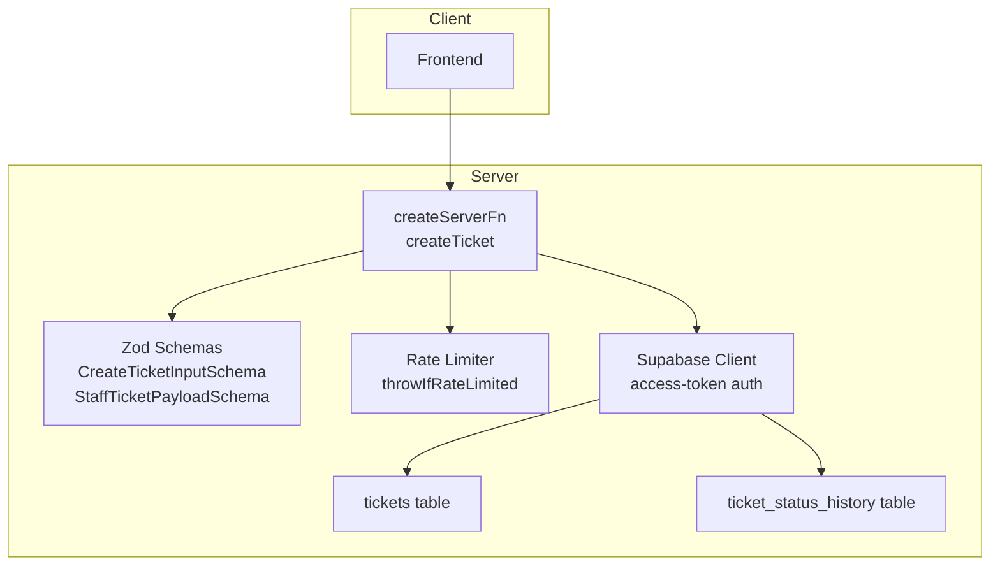
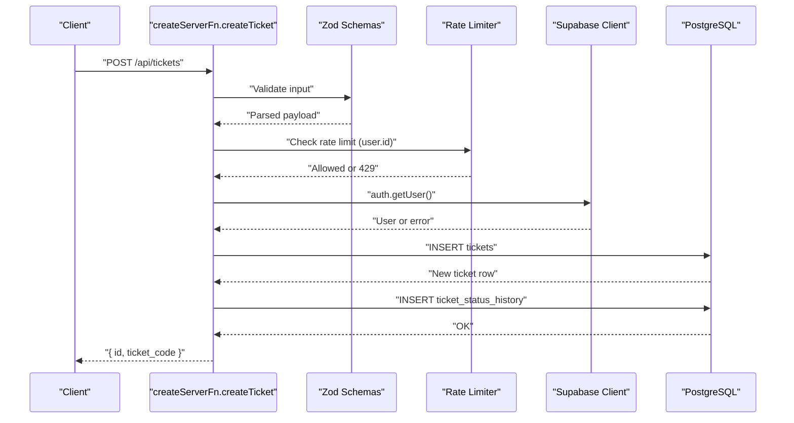
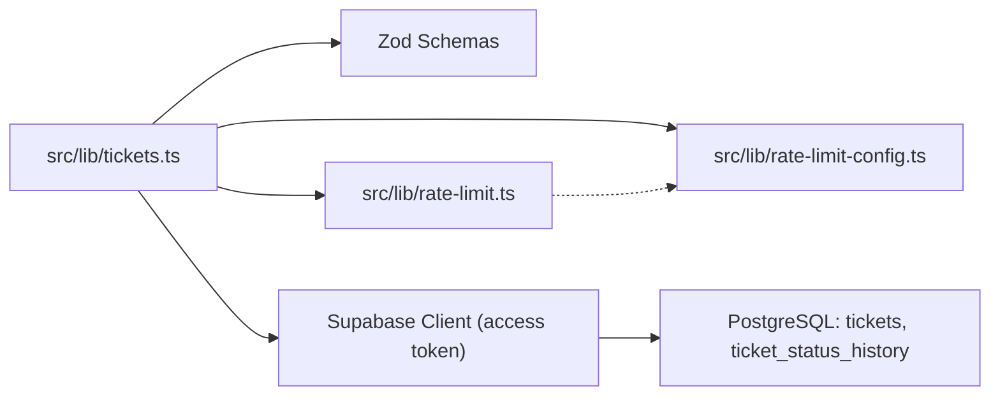

# Ticket Management Endpoints

<cite>
**Referenced Files in This Document**
- [tickets.ts](file://src/lib/tickets.ts)
- [rate-limit.ts](file://src/lib/rate-limit.ts)
- [rate-limit-config.ts](file://src/lib/rate-limit-config.ts)
- [client.server.ts](file://src/integrations/supabase/client.server.ts)
- [tickets.test.ts](file://src/__tests__/routes/tickets.test.ts)
</cite>

## Table of Contents
1. [Introduction](#introduction)
2. [Project Structure](#project-structure)
3. [Core Components](#core-components)
4. [Architecture Overview](#architecture-overview)
5. [Detailed Component Analysis](#detailed-component-analysis)
6. [Dependency Analysis](#dependency-analysis)
7. [Performance Considerations](#performance-considerations)
8. [Troubleshooting Guide](#troubleshooting-guide)
9. [Conclusion](#conclusion)

## Introduction
This document describes the ticket management server functions with a focus on the createTicket endpoint. It explains request payload validation using StaffTicketPayloadSchema and CreateTicketInputSchema, the authentication and rate limiting enforcement, database insertion patterns, ticket status history creation, and the returned value structure. It also covers the createServerFn pattern, Zod schema usage, Supabase client configuration with access tokens, ticket priority validation, device assignment handling, and checklist processing.

## Project Structure
The ticket creation flow is implemented in a dedicated library module and integrates with rate limiting and Supabase utilities:
- Request validation and handler logic: src/lib/tickets.ts
- Rate limiting core and presets: src/lib/rate-limit.ts, src/lib/rate-limit-config.ts
- Supabase client configuration for access tokens: src/lib/tickets.ts (internal helper)
- Admin Supabase client (service role) for privileged operations: src/integrations/supabase/client.server.ts
- Tests for related ticket queries: src/__tests__/routes/tickets.test.ts

**Diagram sources**
- [tickets.ts:50-110](file://src/lib/tickets.ts#L50-L110)
- [rate-limit.ts:92-103](file://src/lib/rate-limit.ts#L92-L103)
- [rate-limit-config.ts:5-30](file://src/lib/rate-limit-config.ts#L5-L30)

**Section sources**
- [tickets.ts:1-111](file://src/lib/tickets.ts#L1-L111)
- [rate-limit.ts:1-104](file://src/lib/rate-limit.ts#L1-L104)
- [rate-limit-config.ts:1-31](file://src/lib/rate-limit-config.ts#L1-L31)
- [client.server.ts:1-42](file://src/integrations/supabase/client.server.ts#L1-L42)

## Core Components
- createTicket server function: Implements the POST endpoint that validates input, authenticates the caller, enforces rate limits, inserts a new ticket, creates a status history record, and returns the new ticket’s identifiers.
- Validation schemas:
  - CreateTicketInputSchema: Wraps accessToken and ticket payload.
  - StaffTicketPayloadSchema: Defines the structure and constraints for staff-created tickets.
- Rate limiting: Enforces per-user limits for ticket creation using throwIfRateLimited and preset keys.
- Supabase client: Configured with an access token header for user-authenticated operations.

Key behaviors:
- Authentication: Uses Supabase auth.getUser with the provided access token; failure yields a 401 response.
- Priority validation: Enforces priority enum ["low", "med", "high"].
- Device assignment: Accepts UUID, empty string, or null; empty/null resolves to null in the database.
- Checklist processing: Accepts a record-like structure; stored as JSON.
- Status history: Creates a pending status entry with metadata.

**Section sources**
- [tickets.ts:8-30](file://src/lib/tickets.ts#L8-L30)
- [tickets.ts:50-110](file://src/lib/tickets.ts#L50-L110)
- [rate-limit.ts:92-103](file://src/lib/rate-limit.ts#L92-L103)
- [rate-limit-config.ts:5-30](file://src/lib/rate-limit-config.ts#L5-L30)

## Architecture Overview
The createTicket endpoint follows a layered pattern:
- Input validation via Zod schemas
- Authentication against Supabase using the access token
- Rate limiting enforcement keyed by user ID
- Database writes to tickets and ticket_status_history
- Response with minimal identifiers

**Diagram sources**
- [tickets.ts:50-110](file://src/lib/tickets.ts#L50-L110)
- [rate-limit.ts:92-103](file://src/lib/rate-limit.ts#L92-L103)

## Detailed Component Analysis

### createTicket Endpoint
- Purpose: Create a new ticket with validated payload, enforce rate limits, and initialize status history.
- Authentication:
  - Uses Supabase client configured with Authorization: Bearer <accessToken>.
  - Calls auth.getUser; missing or invalid token results in 401.
- Rate Limiting:
  - Uses throwIfRateLimited with preset key for staff ticket creation.
  - Returns 429 with Retry-After and X-RateLimit headers when exceeded.
- Database Insertion:
  - Inserts into tickets with computed defaults and nullification for empty values.
  - Inserts a single-row status history entry for the initial "pending" status.
- Return Value:
  - Returns { id, ticket_code } for the newly created ticket.

Validation highlights:
- StaffTicketPayloadSchema enforces:
  - client, requester, ticket_type as required strings.
  - client_id and requester_contact_id as UUID or empty/null.
  - device_id, assignee_id, template_id as UUID or empty/null.
  - priority enum ["low", "med", "high"].
  - status literal "pending".
  - category, software, notes as nullable strings.
  - checklist as record-like JSON, checklist_structure as JSON or null.
  - source enum ["internal", "portal"] with normalization to "portal"/"internal".

Device assignment handling:
- Empty string or null values are normalized to null before insertion.

Checklist processing:
- Checklist is accepted as a record-like structure and stored as JSON.

Status history creation:
- A single row is inserted into ticket_status_history with:
  - ticket_id: new ticket id
  - from_status: null
  - to_status: "pending"
  - changed_by: authenticated user id
  - changed_at: current timestamp
  - note: "Ticket creato"

**Section sources**
- [tickets.ts:8-30](file://src/lib/tickets.ts#L8-L30)
- [tickets.ts:32-48](file://src/lib/tickets.ts#L32-L48)
- [tickets.ts:50-110](file://src/lib/tickets.ts#L50-L110)

### Zod Schema Definitions
- CreateTicketInputSchema:
  - accessToken: non-empty string
  - ticket: StaffTicketPayloadSchema
- StaffTicketPayloadSchema:
  - Required fields: client, requester, ticket_type
  - Optional/nullable fields: category, software, notes, checklist_structure
  - Enumerations: priority ["low","med","high"], status "pending", source ["internal","portal"]
  - Optional IDs: device_id, requester_contact_id, assignee_id, template_id
  - Checklist: record-like structure

Validation behavior:
- Empty strings for IDs are treated as missing; null or omitted are allowed per schema.
- Priority must match the enum exactly.

**Section sources**
- [tickets.ts:8-30](file://src/lib/tickets.ts#L8-L30)

### Rate Limiting Enforcement
- Preset key: ticket:create-staff
- Window: 60 seconds
- Limit: 20 requests per user
- Response: 429 with JSON body and X-RateLimit-* headers when exceeded

**Section sources**
- [rate-limit-config.ts:5-30](file://src/lib/rate-limit-config.ts#L5-L30)
- [rate-limit.ts:92-103](file://src/lib/rate-limit.ts#L92-L103)

### Supabase Client Configuration
- Access-token-based client:
  - Headers include Authorization: Bearer <accessToken>
  - Disables local storage and token persistence
- Admin client (service role):
  - Separate client for privileged operations bypassing RLS
  - Environment variables validated at startup

**Section sources**
- [tickets.ts:32-48](file://src/lib/tickets.ts#L32-L48)
- [client.server.ts:8-41](file://src/integrations/supabase/client.server.ts#L8-L41)

### Database Insertion Patterns
- tickets insert:
  - Normalized fields: device_id, requester_contact_id, assignee_id, template_id
  - Defaults: category, software, notes as null; checklist as {} JSON; checklist_structure as null
  - Source normalized to "portal" or "internal"
  - created_by set to authenticated user id
- ticket_status_history insert:
  - Single row with null from_status, "pending" to_status, and current timestamp

**Section sources**
- [tickets.ts:64-89](file://src/lib/tickets.ts#L64-L89)
- [tickets.ts:99-107](file://src/lib/tickets.ts#L99-L107)

### Return Value Structure
- On success: { id: string, ticket_code: string }
- On error: Throws Response with appropriate status (e.g., 401, 429, 5xx)

**Section sources**
- [tickets.ts:109](file://src/lib/tickets.ts#L109)

## Dependency Analysis

**Diagram sources**
- [tickets.ts:1-6](file://src/lib/tickets.ts#L1-L6)
- [rate-limit.ts:1-2](file://src/lib/rate-limit.ts#L1-L2)
- [rate-limit-config.ts:1-3](file://src/lib/rate-limit-config.ts#L1-L3)

**Section sources**
- [tickets.ts:1-6](file://src/lib/tickets.ts#L1-L6)
- [rate-limit.ts:1-2](file://src/lib/rate-limit.ts#L1-L2)
- [rate-limit-config.ts:1-3](file://src/lib/rate-limit-config.ts#L1-L3)

## Performance Considerations
- In-memory sliding window limiter: Efficient for single-process deployments but not shared across instances. For distributed environments, integrate Redis-backed ratelimiting as indicated in comments.
- Supabase client reuse: The access-token client disables persistence; ensure callers manage lifecycle appropriately.
- Batch operations: Consider batching status history writes if extending functionality.

[No sources needed since this section provides general guidance]

## Troubleshooting Guide
Common error scenarios and handling:
- 401 Unauthorized:
  - Cause: Missing or invalid access token; auth.getUser fails.
  - Resolution: Ensure the client supplies a valid access token.
- 429 Too Many Requests:
  - Cause: Exceeded rate limit for ticket creation.
  - Resolution: Respect Retry-After and X-RateLimit headers; reduce request frequency.
- 500 Internal Server Error:
  - Cause: Missing Supabase configuration or database errors during insert.
  - Resolution: Verify SUPABASE_URL and SUPABASE_PUBLISHABLE_KEY; check database connectivity.
- Validation errors:
  - Cause: Payload does not match CreateTicketInputSchema or StaffTicketPayloadSchema.
  - Resolution: Align fields with schema constraints (e.g., priority enum, UUIDs, required strings).

**Section sources**
- [tickets.ts:32-48](file://src/lib/tickets.ts#L32-L48)
- [rate-limit.ts:74-90](file://src/lib/rate-limit.ts#L74-L90)
- [rate-limit-config.ts:5-30](file://src/lib/rate-limit-config.ts#L5-L30)

## Conclusion
The createTicket endpoint provides a robust, validated, and rate-limited pathway to create tickets. It leverages Zod schemas for input validation, Supabase access-token authentication for user context, and a clear insertion pattern into tickets and ticket_status_history. The design supports flexible device assignment and checklist handling while maintaining strict priority validation and normalized status history initialization.