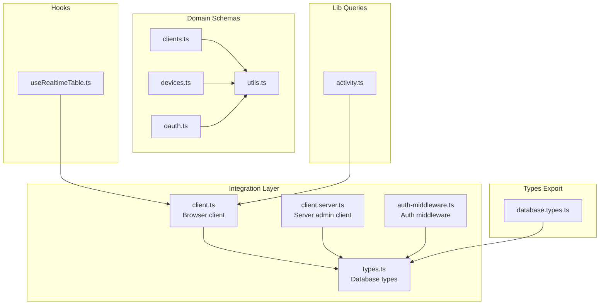
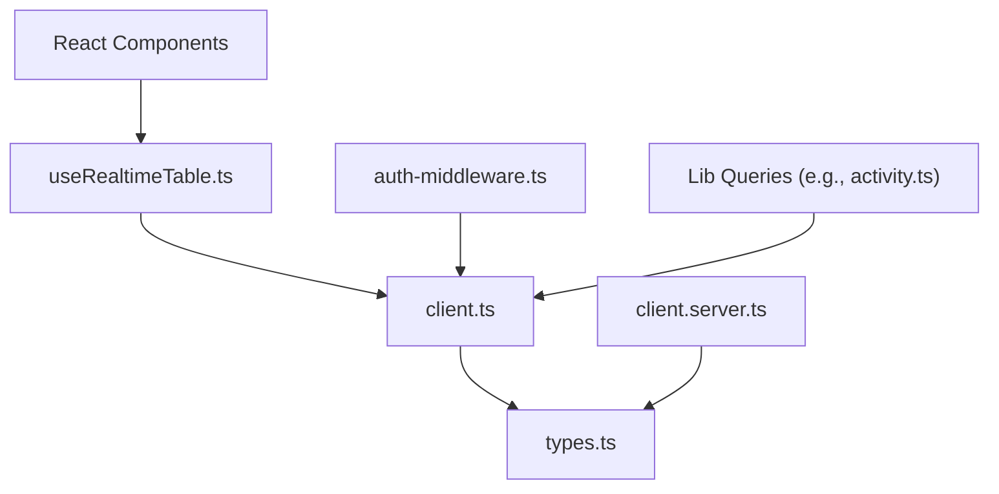
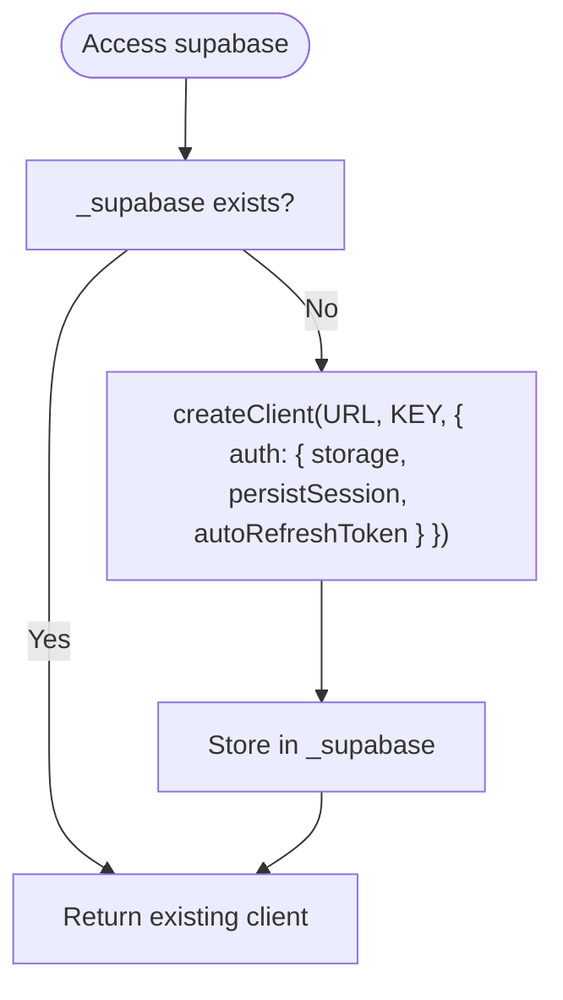
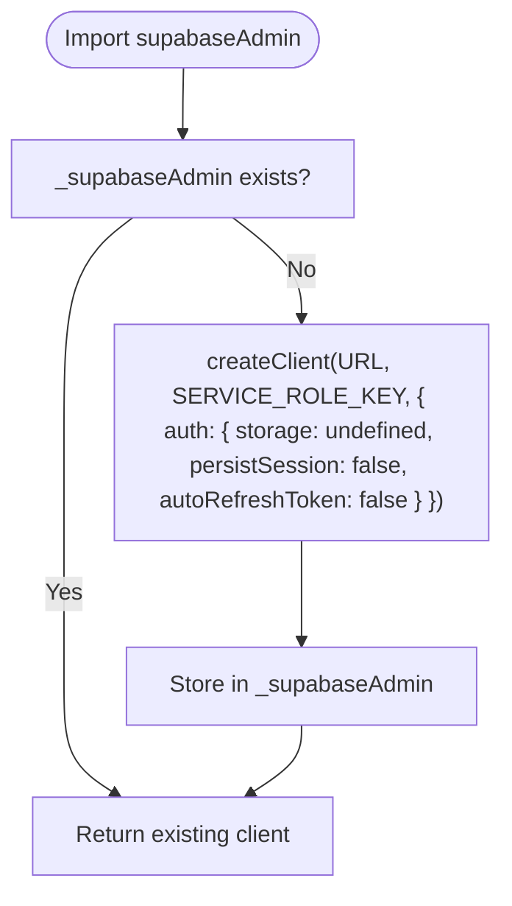
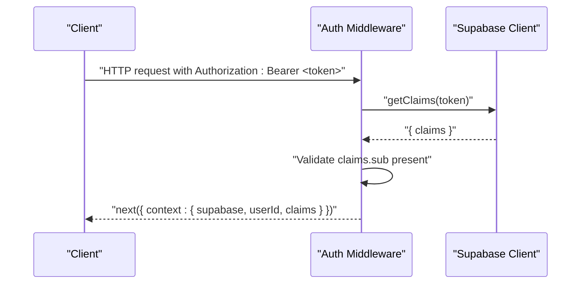
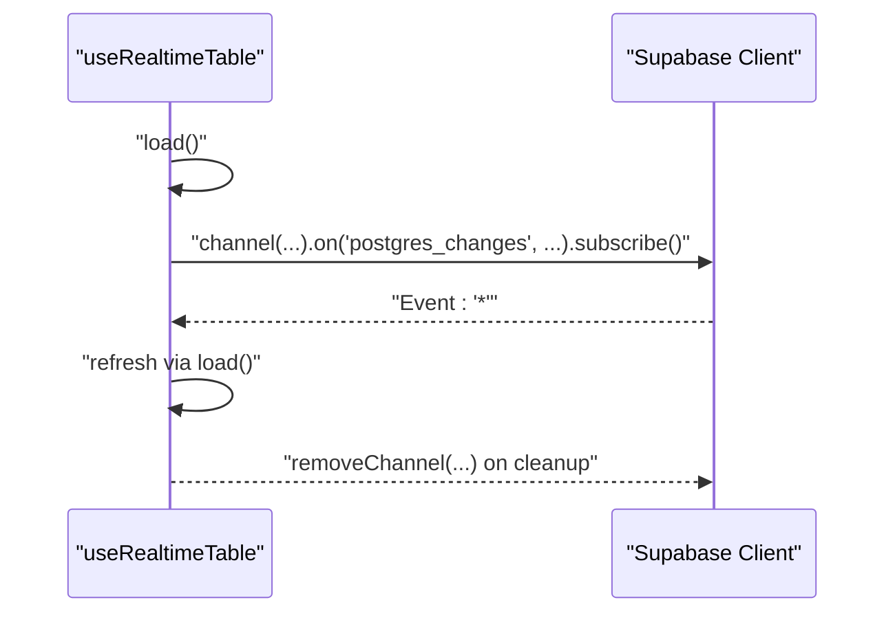
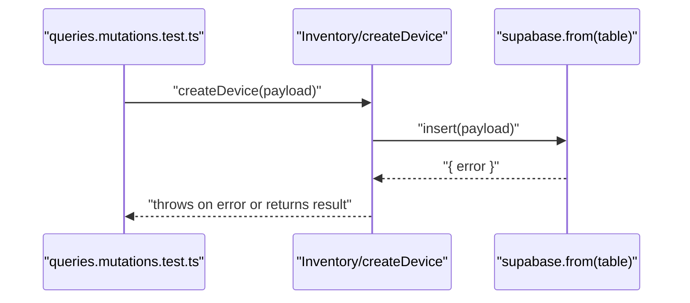
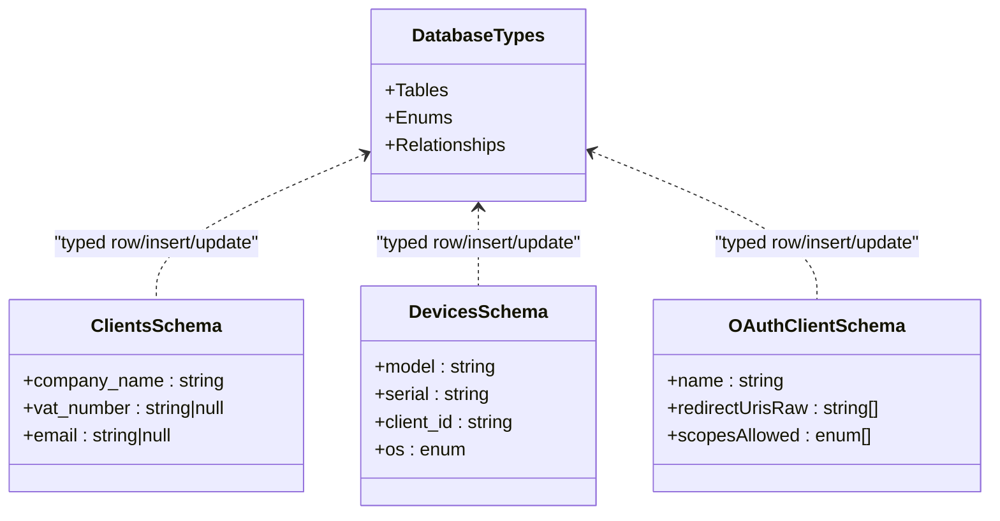
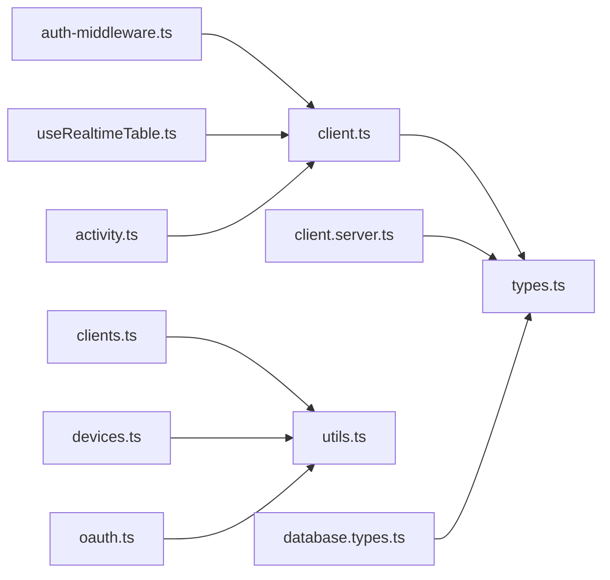

# Supabase REST API

<cite>
**Referenced Files in This Document**
- [client.ts](file://src/integrations/supabase/client.ts)
- [client.server.ts](file://src/integrations/supabase/client.server.ts)
- [types.ts](file://src/integrations/supabase/types.ts)
- [auth-middleware.ts](file://src/integrations/supabase/auth-middleware.ts)
- [useRealtimeTable.ts](file://src/hooks/useRealtimeTable.ts)
- [database.types.ts](file://src/types/database.types.ts)
- [clients.ts](file://lib/schemas/clients.ts)
- [devices.ts](file://lib/schemas/devices.ts)
- [oauth.ts](file://lib/schemas/oauth.ts)
- [utils.ts](file://lib/schemas/utils.ts)
- [activity.ts](file://src/lib/queries/activity.ts)
- [queries.mutations.test.ts](file://src/__tests__/queries.mutations.test.ts)
- [validate-migrations.mjs](file://scripts/validate-migrations.mjs)
</cite>

## Table of Contents
1. [Introduction](#introduction)
2. [Project Structure](#project-structure)
3. [Core Components](#core-components)
4. [Architecture Overview](#architecture-overview)
5. [Detailed Component Analysis](#detailed-component-analysis)
6. [Dependency Analysis](#dependency-analysis)
7. [Performance Considerations](#performance-considerations)
8. [Troubleshooting Guide](#troubleshooting-guide)
9. [Conclusion](#conclusion)
10. [Appendices](#appendices)

## Introduction
This document describes the Supabase REST API integration points used by PCReady. It covers client initialization, authentication headers, session management, database operations, real-time subscriptions, schema types, and practical patterns for CRUD, queries, joins, aggregations, and error handling. It also includes performance tips, caching strategies, debugging tools, monitoring techniques, and database administration tasks grounded in the repository’s implementation.

## Project Structure
PCReady integrates Supabase via a dedicated integration module that exposes a lazily initialized client for browser and server environments, a server-only admin client, and a strongly typed schema definition. Real-time synchronization is implemented via a reusable React hook. Supporting libraries define Zod-based input schemas for validation, and tests demonstrate mutation patterns against the Supabase client.

**Diagram sources**
- [client.ts:1-41](file://src/integrations/supabase/client.ts#L1-L41)
- [client.server.ts:1-42](file://src/integrations/supabase/client.server.ts#L1-L42)
- [types.ts:1-800](file://src/integrations/supabase/types.ts#L1-L800)
- [auth-middleware.ts:1-74](file://src/integrations/supabase/auth-middleware.ts#L1-L74)
- [useRealtimeTable.ts:1-50](file://src/hooks/useRealtimeTable.ts#L1-L50)
- [activity.ts:1-14](file://src/lib/queries/activity.ts#L1-L14)
- [clients.ts:1-27](file://lib/schemas/clients.ts#L1-L27)
- [devices.ts:1-15](file://lib/schemas/devices.ts#L1-L15)
- [oauth.ts:1-16](file://lib/schemas/oauth.ts#L1-L16)
- [utils.ts:1-20](file://lib/schemas/utils.ts#L1-L20)
- [database.types.ts:1-2](file://src/types/database.types.ts#L1-L2)

**Section sources**
- [client.ts:1-41](file://src/integrations/supabase/client.ts#L1-L41)
- [client.server.ts:1-42](file://src/integrations/supabase/client.server.ts#L1-L42)
- [types.ts:1-800](file://src/integrations/supabase/types.ts#L1-L800)
- [auth-middleware.ts:1-74](file://src/integrations/supabase/auth-middleware.ts#L1-L74)
- [useRealtimeTable.ts:1-50](file://src/hooks/useRealtimeTable.ts#L1-L50)
- [activity.ts:1-14](file://src/lib/queries/activity.ts#L1-L14)
- [clients.ts:1-27](file://lib/schemas/clients.ts#L1-L27)
- [devices.ts:1-15](file://lib/schemas/devices.ts#L1-L15)
- [oauth.ts:1-16](file://lib/schemas/oauth.ts#L1-L16)
- [utils.ts:1-20](file://lib/schemas/utils.ts#L1-L20)
- [database.types.ts:1-2](file://src/types/database.types.ts#L1-L2)

## Core Components
- Supabase Browser Client
  - Initializes with URL and publishable key, sets local storage-backed session persistence, and auto-refresh for tokens.
  - Uses a lazy-initialized proxy to avoid repeated instantiation and SSR pitfalls.
  - Reference: [client.ts:5-41](file://src/integrations/supabase/client.ts#L5-L41)

- Supabase Admin Client (Server-only)
  - Initializes with URL and service role key, disables session persistence and token refresh.
  - Intended for privileged server-side operations that bypass Row Level Security (RLS).
  - Reference: [client.server.ts:8-41](file://src/integrations/supabase/client.server.ts#L8-L41)

- Authentication Middleware
  - Extracts Bearer token from incoming requests, validates it via Supabase claims, and injects user context.
  - Reference: [auth-middleware.ts:7-74](file://src/integrations/supabase/auth-middleware.ts#L7-L74)

- Real-time Hook
  - Subscribes to Postgres changes on a given table, loads initial data via a provided query function, and refreshes on events.
  - Reference: [useRealtimeTable.ts:10-50](file://src/hooks/useRealtimeTable.ts#L10-L50)

- Strongly Typed Database Schema
  - Provides TypeScript types for tables, inserts, updates, relationships, enums, and JSON fields.
  - Reference: [types.ts:3-800](file://src/integrations/supabase/types.ts#L3-L800), [database.types.ts:1-2](file://src/types/database.types.ts#L1-L2)

- Domain Validation Schemas
  - Zod schemas for clients, devices, OAuth clients, and shared utilities for trimming and safe parsing.
  - References:
    - [clients.ts:4-27](file://lib/schemas/clients.ts#L4-L27)
    - [devices.ts:5-15](file://lib/schemas/devices.ts#L5-L15)
    - [oauth.ts:4-16](file://lib/schemas/oauth.ts#L4-L16)
    - [utils.ts:1-20](file://lib/schemas/utils.ts#L1-L20)

**Section sources**
- [client.ts:5-41](file://src/integrations/supabase/client.ts#L5-L41)
- [client.server.ts:8-41](file://src/integrations/supabase/client.server.ts#L8-L41)
- [auth-middleware.ts:7-74](file://src/integrations/supabase/auth-middleware.ts#L7-L74)
- [useRealtimeTable.ts:10-50](file://src/hooks/useRealtimeTable.ts#L10-L50)
- [types.ts:3-800](file://src/integrations/supabase/types.ts#L3-L800)
- [database.types.ts:1-2](file://src/types/database.types.ts#L1-L2)
- [clients.ts:4-27](file://lib/schemas/clients.ts#L4-L27)
- [devices.ts:5-15](file://lib/schemas/devices.ts#L5-L15)
- [oauth.ts:4-16](file://lib/schemas/oauth.ts#L4-L16)
- [utils.ts:1-20](file://lib/schemas/utils.ts#L1-L20)

## Architecture Overview
The Supabase integration centers around two clients and a typed schema. The browser client handles user sessions and real-time channels. The server admin client performs privileged operations. Middleware enforces authentication for server routes. The typed schema ensures compile-time safety across database operations.

**Diagram sources**
- [useRealtimeTable.ts:10-50](file://src/hooks/useRealtimeTable.ts#L10-L50)
- [client.ts:5-41](file://src/integrations/supabase/client.ts#L5-L41)
- [client.server.ts:8-41](file://src/integrations/supabase/client.server.ts#L8-L41)
- [types.ts:3-800](file://src/integrations/supabase/types.ts#L3-L800)
- [auth-middleware.ts:7-74](file://src/integrations/supabase/auth-middleware.ts#L7-L74)
- [activity.ts:1-14](file://src/lib/queries/activity.ts#L1-L14)

## Detailed Component Analysis

### Supabase Browser Client Initialization
- Environment variables:
  - Vite runtime env for client-side builds.
  - Fallback to Node process env for SSR contexts.
- Session management:
  - Persists session in local storage.
  - Auto-refreshes tokens.
- Lazy initialization:
  - Uses a Proxy to create the client on first access.

**Diagram sources**
- [client.ts:31-41](file://src/integrations/supabase/client.ts#L31-L41)
- [client.ts:22-28](file://src/integrations/supabase/client.ts#L22-L28)

**Section sources**
- [client.ts:5-41](file://src/integrations/supabase/client.ts#L5-L41)

### Supabase Admin Client (Server-only)
- Uses service role key to bypass RLS.
- Disables session persistence and token refresh.
- Intended for trusted server-side operations.

**Diagram sources**
- [client.server.ts:31-41](file://src/integrations/supabase/client.server.ts#L31-L41)
- [client.server.ts:22-28](file://src/integrations/supabase/client.server.ts#L22-L28)

**Section sources**
- [client.server.ts:8-41](file://src/integrations/supabase/client.server.ts#L8-L41)

### Authentication Headers and Session Management
- Browser client:
  - Local storage-backed sessions.
  - Auto token refresh enabled.
- Server middleware:
  - Extracts Authorization header (Bearer token).
  - Validates token via Supabase claims and injects user ID and claims into context.

**Diagram sources**
- [auth-middleware.ts:28-72](file://src/integrations/supabase/auth-middleware.ts#L28-L72)

**Section sources**
- [client.ts:22-28](file://src/integrations/supabase/client.ts#L22-L28)
- [auth-middleware.ts:28-72](file://src/integrations/supabase/auth-middleware.ts#L28-L72)

### Real-time Subscription and Sync
- The hook subscribes to Postgres changes on a specified table.
- On mount, it executes an initial query and then listens for changes.
- On unmount, it removes the channel.

**Diagram sources**
- [useRealtimeTable.ts:33-46](file://src/hooks/useRealtimeTable.ts#L33-L46)

**Section sources**
- [useRealtimeTable.ts:10-50](file://src/hooks/useRealtimeTable.ts#L10-L50)

### Database Operations and CRUD Patterns
- Insertion pattern:
  - Example: inserting into the activity log table.
  - Tests mock the client to assert table and payload.
- Mutation testing pattern:
  - Mocked client verifies insert calls and returned shape.

**Diagram sources**
- [queries.mutations.test.ts:5-38](file://src/__tests__/queries.mutations.test.ts#L5-L38)
- [activity.ts:4-8](file://src/lib/queries/activity.ts#L4-L8)

**Section sources**
- [activity.ts:4-8](file://src/lib/queries/activity.ts#L4-L8)
- [queries.mutations.test.ts:5-38](file://src/__tests__/queries.mutations.test.ts#L5-L38)

### Schema Access, Types, and Type Safety
- Database types:
  - Strongly typed tables, inserts, updates, enums, and relationships.
  - Exported via a dedicated types file and re-exported for convenience.
- Domain schemas:
  - Zod schemas for input validation with trimming and safe parsing utilities.

**Diagram sources**
- [types.ts:3-800](file://src/integrations/supabase/types.ts#L3-L800)
- [clients.ts:4-27](file://lib/schemas/clients.ts#L4-L27)
- [devices.ts:5-15](file://lib/schemas/devices.ts#L5-L15)
- [oauth.ts:4-16](file://lib/schemas/oauth.ts#L4-L16)
- [database.types.ts:1-2](file://src/types/database.types.ts#L1-L2)

**Section sources**
- [types.ts:3-800](file://src/integrations/supabase/types.ts#L3-L800)
- [clients.ts:4-27](file://lib/schemas/clients.ts#L4-L27)
- [devices.ts:5-15](file://lib/schemas/devices.ts#L5-L15)
- [oauth.ts:4-16](file://lib/schemas/oauth.ts#L4-L16)
- [database.types.ts:1-2](file://src/types/database.types.ts#L1-L2)

### Query Patterns, Joins, and Aggregations
- The typed schema exposes relationships for joins across tables (e.g., foreign keys).
- Aggregation and analytics are supported via RPC functions and views referenced in migrations.
- Practical usage:
  - Use typed table accessors for joins and filters.
  - Combine filters and ordering via the PostgREST interface exposed by the client.

[No sources needed since this section provides general guidance]

### Complex Queries and Relationship Queries
- Leverage typed relationships to construct joins and nested selections.
- Use the typed enums and JSON fields to ensure correctness at compile time.

[No sources needed since this section provides general guidance]

## Dependency Analysis
The integration relies on a small set of cohesive modules. The browser and server clients depend on the typed schema. The middleware depends on the browser client configuration. The real-time hook depends on the browser client and a stable channel suffix. Domain schemas depend on shared utilities.

**Diagram sources**
- [client.ts:1-41](file://src/integrations/supabase/client.ts#L1-L41)
- [client.server.ts:1-42](file://src/integrations/supabase/client.server.ts#L1-L42)
- [types.ts:1-800](file://src/integrations/supabase/types.ts#L1-L800)
- [auth-middleware.ts:1-74](file://src/integrations/supabase/auth-middleware.ts#L1-L74)
- [useRealtimeTable.ts:1-50](file://src/hooks/useRealtimeTable.ts#L1-L50)
- [activity.ts:1-14](file://src/lib/queries/activity.ts#L1-L14)
- [clients.ts:1-27](file://lib/schemas/clients.ts#L1-L27)
- [devices.ts:1-15](file://lib/schemas/devices.ts#L1-L15)
- [oauth.ts:1-16](file://lib/schemas/oauth.ts#L1-L16)
- [utils.ts:1-20](file://lib/schemas/utils.ts#L1-L20)
- [database.types.ts:1-2](file://src/types/database.types.ts#L1-L2)

**Section sources**
- [client.ts:1-41](file://src/integrations/supabase/client.ts#L1-L41)
- [client.server.ts:1-42](file://src/integrations/supabase/client.server.ts#L1-L42)
- [types.ts:1-800](file://src/integrations/supabase/types.ts#L1-L800)
- [auth-middleware.ts:1-74](file://src/integrations/supabase/auth-middleware.ts#L1-L74)
- [useRealtimeTable.ts:1-50](file://src/hooks/useRealtimeTable.ts#L1-L50)
- [activity.ts:1-14](file://src/lib/queries/activity.ts#L1-L14)
- [clients.ts:1-27](file://lib/schemas/clients.ts#L1-L27)
- [devices.ts:1-15](file://lib/schemas/devices.ts#L1-L15)
- [oauth.ts:1-16](file://lib/schemas/oauth.ts#L1-L16)
- [utils.ts:1-20](file://lib/schemas/utils.ts#L1-L20)
- [database.types.ts:1-2](file://src/types/database.types.ts#L1-L2)

## Performance Considerations
- Minimize real-time subscriptions to only the tables and columns you need.
- Use targeted filters and projections to reduce payload sizes.
- Batch writes when possible to reduce round trips.
- Prefer server admin client for bulk operations to bypass RLS checks.
- Cache frequently accessed static data locally and invalidate on real-time events.

[No sources needed since this section provides general guidance]

## Troubleshooting Guide
- Missing environment variables:
  - The browser client throws if URL or publishable key are missing.
  - The server admin client throws if URL or service role key are missing.
  - Reference: [client.ts:12-20](file://src/integrations/supabase/client.ts#L12-L20), [client.server.ts:12-20](file://src/integrations/supabase/client.server.ts#L12-L20)
- Authentication failures:
  - Middleware requires a Bearer token and validates claims.
  - Reference: [auth-middleware.ts:28-72](file://src/integrations/supabase/auth-middleware.ts#L28-L72)
- Real-time subscription cleanup:
  - Ensure channels are removed on component unmount.
  - Reference: [useRealtimeTable.ts:43-46](file://src/hooks/useRealtimeTable.ts#L43-L46)
- Migration validation:
  - A script validates migration filenames, emptiness, merge markers, and dollar-quoted blocks.
  - Reference: [validate-migrations.mjs:1-42](file://scripts/validate-migrations.mjs#L1-L42)

**Section sources**
- [client.ts:12-20](file://src/integrations/supabase/client.ts#L12-L20)
- [client.server.ts:12-20](file://src/integrations/supabase/client.server.ts#L12-L20)
- [auth-middleware.ts:28-72](file://src/integrations/supabase/auth-middleware.ts#L28-L72)
- [useRealtimeTable.ts:43-46](file://src/hooks/useRealtimeTable.ts#L43-L46)
- [validate-migrations.mjs:1-42](file://scripts/validate-migrations.mjs#L1-L42)

## Conclusion
PCReady’s Supabase integration leverages a typed schema, a browser client with session persistence, a server admin client for privileged operations, and a robust real-time hook. Together with Zod-based validation and middleware-driven authentication, this provides a secure, type-safe, and reactive foundation for database operations, real-time synchronization, and scalable development practices.

[No sources needed since this section summarizes without analyzing specific files]

## Appendices

### API Usage Examples (by reference)
- Initialize the browser client:
  - [client.ts:5-41](file://src/integrations/supabase/client.ts#L5-L41)
- Initialize the server admin client:
  - [client.server.ts:8-41](file://src/integrations/supabase/client.server.ts#L8-L41)
- Enforce authentication in server routes:
  - [auth-middleware.ts:7-74](file://src/integrations/supabase/auth-middleware.ts#L7-L74)
- Subscribe to table changes:
  - [useRealtimeTable.ts:33-46](file://src/hooks/useRealtimeTable.ts#L33-L46)
- Insert into a table:
  - [activity.ts:4-8](file://src/lib/queries/activity.ts#L4-L8)
- Validate inputs:
  - [clients.ts:4-27](file://lib/schemas/clients.ts#L4-L27)
  - [devices.ts:5-15](file://lib/schemas/devices.ts#L5-L15)
  - [oauth.ts:4-16](file://lib/schemas/oauth.ts#L4-L16)
  - [utils.ts:1-20](file://lib/schemas/utils.ts#L1-L20)