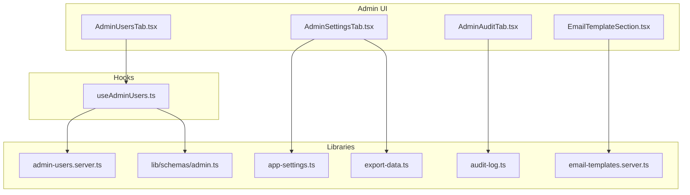
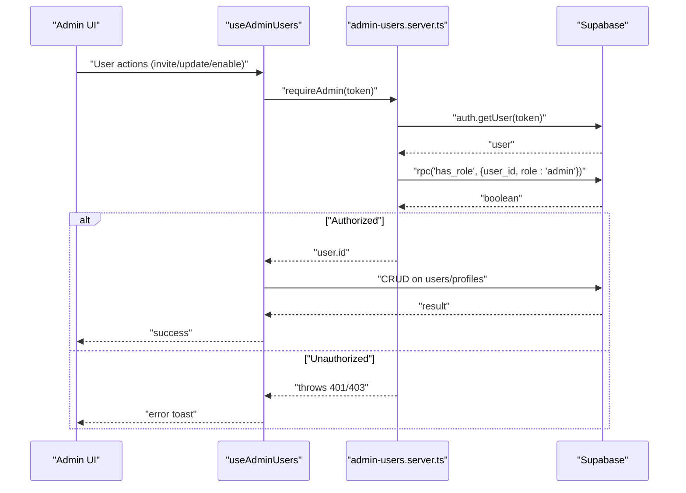
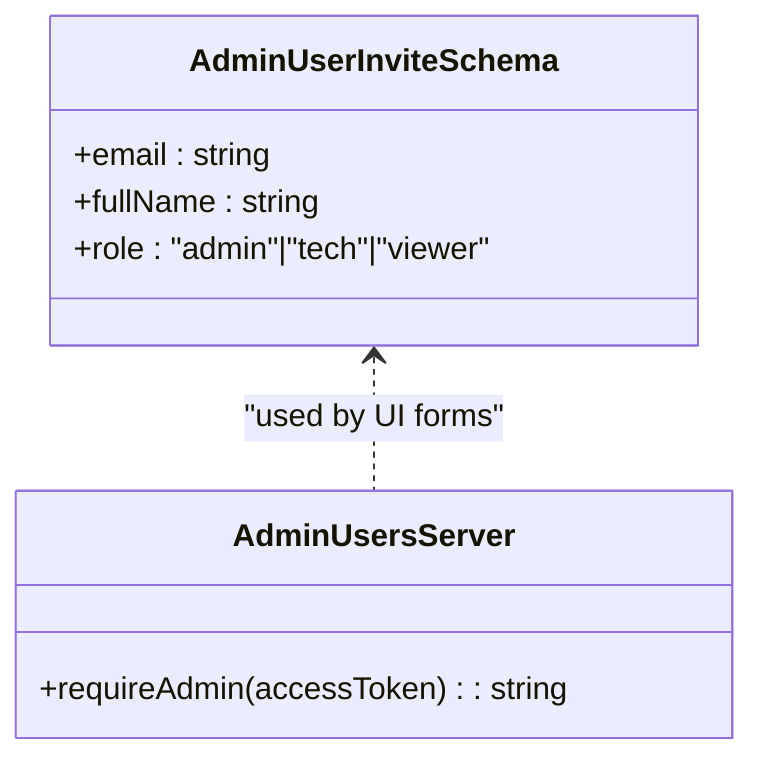
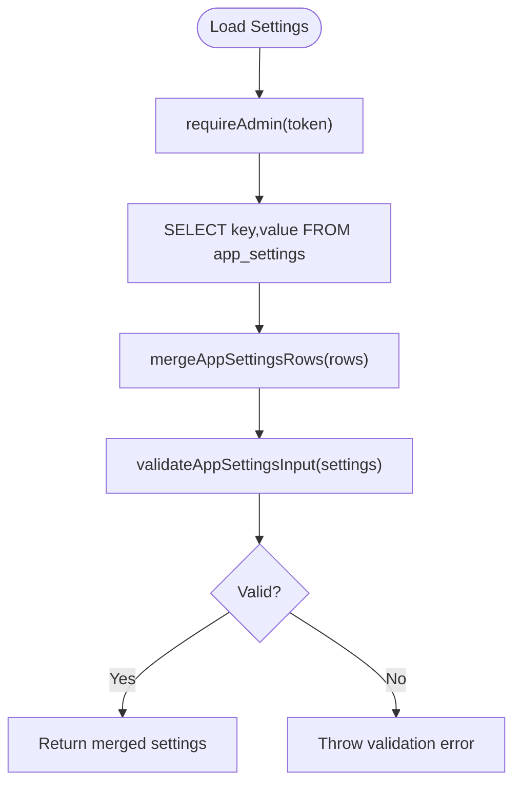
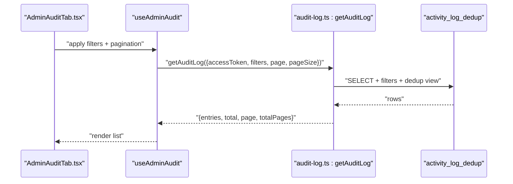
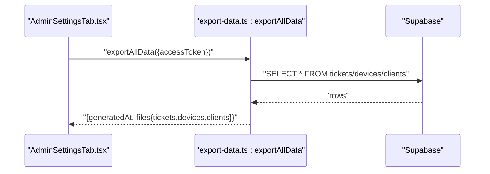
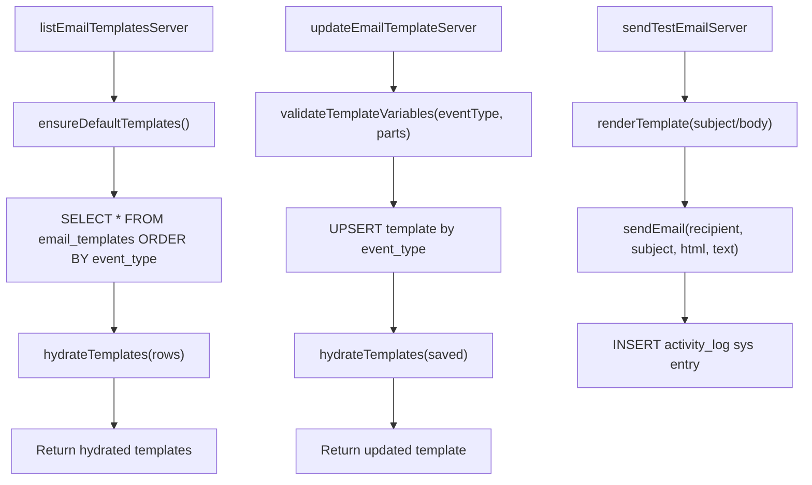
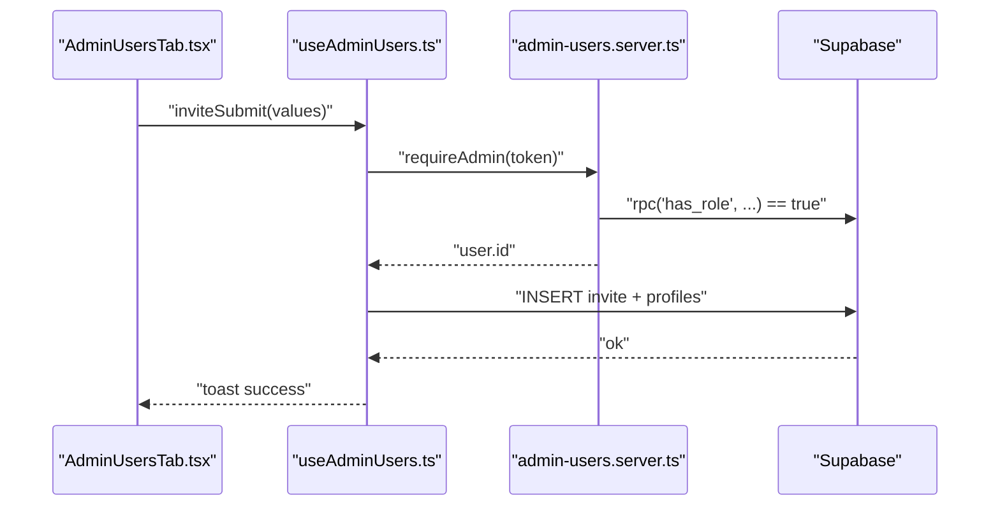
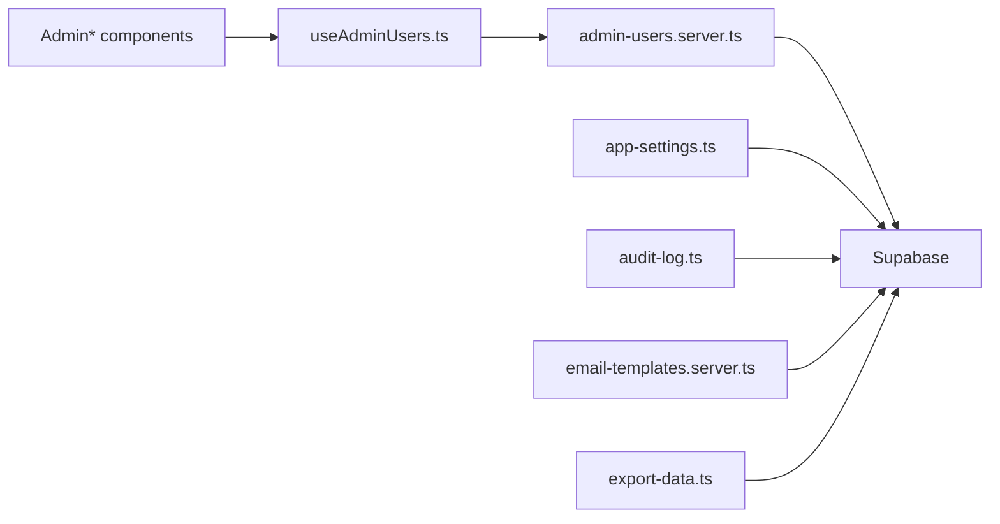

# Administrative Features

<cite>
**Referenced Files in This Document**
- [admin.ts](file://lib/schemas/admin.ts)
- [admin-users.server.ts](file://src/lib/admin-users.server.ts)
- [app-settings.ts](file://src/lib/app-settings.ts)
- [audit-log.ts](file://src/lib/audit-log.ts)
- [email-templates.server.ts](file://src/lib/email-templates.server.ts)
- [export-data.ts](file://src/lib/export-data.ts)
- [AdminUsersTab.tsx](file://src/components/admin/AdminUsersTab.tsx)
- [AdminSettingsTab.tsx](file://src/components/admin/AdminSettingsTab.tsx)
- [AdminAuditTab.tsx](file://src/components/admin/AdminAuditTab.tsx)
- [EmailTemplateSection.tsx](file://src/components/admin/EmailTemplateSection.tsx)
- [useAdminUsers.ts](file://src/hooks/useAdminUsers.ts)
</cite>

## Table of Contents

1. [Introduction](#introduction)
2. [Project Structure](#project-structure)
3. [Core Components](#core-components)
4. [Architecture Overview](#architecture-overview)
5. [Detailed Component Analysis](#detailed-component-analysis)
6. [Dependency Analysis](#dependency-analysis)
7. [Performance Considerations](#performance-considerations)
8. [Troubleshooting Guide](#troubleshooting-guide)
9. [Conclusion](#conclusion)
10. [Appendices](#appendices)

## Introduction

This document explains the administrative features component, focusing on:

- User role management (admin, tech, viewer) and permission enforcement
- Application-wide settings (preferences, workflow, and notification-related parameters)
- Audit logging for user activities, system changes, and automation events
- Backup and recovery mechanisms (manual ZIP exports and Supabase automated backups)
- Email template management for notification customization
- Concrete examples from the codebase showing admin server functions and settings management
- Configuration options for roles, system parameters, and backup policies
- Relationships among admin actions, user permissions, and system state
- Security considerations for admin access and audit trail integrity

## Project Structure

Administrative features span client UI components, React hooks, and server-side libraries that integrate with Supabase. Key areas:

- Role and user administration UI and logic
- Application settings management (including WIP limits, lists, and approval flags)
- Audit log retrieval and export
- Email templates CRUD, validation, rendering, and test delivery
- Manual data export (ZIP of CSVs) and backup policy presentation

**Diagram sources**

- [AdminUsersTab.tsx:1-497](file://src/components/admin/AdminUsersTab.tsx#L1-L497)
- [AdminSettingsTab.tsx:1-330](file://src/components/admin/AdminSettingsTab.tsx#L1-L330)
- [AdminAuditTab.tsx:1-139](file://src/components/admin/AdminAuditTab.tsx#L1-L139)
- [EmailTemplateSection.tsx:1-203](file://src/components/admin/EmailTemplateSection.tsx#L1-L203)
- [useAdminUsers.ts:1-213](file://src/hooks/useAdminUsers.ts#L1-L213)
- [admin-users.server.ts:1-18](file://src/lib/admin-users.server.ts#L1-L18)
- [app-settings.ts:1-263](file://src/lib/app-settings.ts#L1-L263)
- [audit-log.ts:1-183](file://src/lib/audit-log.ts#L1-L183)
- [email-templates.server.ts:1-386](file://src/lib/email-templates.server.ts#L1-L386)
- [export-data.ts:1-62](file://src/lib/export-data.ts#L1-L62)
- [admin.ts:1-10](file://lib/schemas/admin.ts#L1-L10)

**Section sources**

- [AdminUsersTab.tsx:1-497](file://src/components/admin/AdminUsersTab.tsx#L1-L497)
- [AdminSettingsTab.tsx:1-330](file://src/components/admin/AdminSettingsTab.tsx#L1-L330)
- [AdminAuditTab.tsx:1-139](file://src/components/admin/AdminAuditTab.tsx#L1-L139)
- [EmailTemplateSection.tsx:1-203](file://src/components/admin/EmailTemplateSection.tsx#L1-L203)
- [useAdminUsers.ts:1-213](file://src/hooks/useAdminUsers.ts#L1-L213)
- [admin-users.server.ts:1-18](file://src/lib/admin-users.server.ts#L1-L18)
- [app-settings.ts:1-263](file://src/lib/app-settings.ts#L1-L263)
- [audit-log.ts:1-183](file://src/lib/audit-log.ts#L1-L183)
- [email-templates.server.ts:1-386](file://src/lib/email-templates.server.ts#L1-L386)
- [export-data.ts:1-62](file://src/lib/export-data.ts#L1-L62)
- [admin.ts:1-10](file://lib/schemas/admin.ts#L1-L10)

## Core Components

- Role and permission enforcement: Admin-only server middleware validates access and role checks.
- User administration: Invite, update roles, enable/disable, resend invites, bulk operations, and deletion.
- Application settings: Global preferences, WIP limits, lists, and approval flags; validated and persisted via upsert.
- Audit logging: Filterable, deduplicated listing and CSV export; categorized by actor type.
- Email templates: CRUD, variable validation, rendering, test sending, and default seeding.
- Backup and recovery: Manual ZIP export of CSVs; Supabase-managed automated backups documented in UI.

**Section sources**

- [admin-users.server.ts:3-17](file://src/lib/admin-users.server.ts#L3-L17)
- [AdminUsersTab.tsx:62-66](file://src/components/admin/AdminUsersTab.tsx#L62-L66)
- [app-settings.ts:18-44](file://src/lib/app-settings.ts#L18-L44)
- [audit-log.ts:23-107](file://src/lib/audit-log.ts#L23-L107)
- [email-templates.server.ts:113-177](file://src/lib/email-templates.server.ts#L113-L177)
- [AdminSettingsTab.tsx:36-97](file://src/components/admin/AdminSettingsTab.tsx#L36-L97)

## Architecture Overview

Admin features rely on server functions exposed via TanStack Start server functions. UI components delegate to hooks that call server functions. Server functions enforce admin-only access and interact with Supabase tables for persistence.

**Diagram sources**

- [admin-users.server.ts:3-17](file://src/lib/admin-users.server.ts#L3-L17)
- [useAdminUsers.ts:25-30](file://src/hooks/useAdminUsers.ts#L25-L30)

**Section sources**

- [admin-users.server.ts:3-17](file://src/lib/admin-users.server.ts#L3-L17)
- [useAdminUsers.ts:25-30](file://src/hooks/useAdminUsers.ts#L25-L30)

## Detailed Component Analysis

### Role Management and Permission Matrix

- Supported roles: admin, tech, viewer.
- Access control: Admin-only endpoints enforced by a dedicated server function that verifies the access token and checks the admin role via a stored procedure.
- UI integration: Admin users tab provides role editing, enable/disable toggles, and bulk operations.

**Diagram sources**

- [admin.ts:3-7](file://lib/schemas/admin.ts#L3-L7)
- [admin-users.server.ts:3-17](file://src/lib/admin-users.server.ts#L3-L17)

**Section sources**

- [admin.ts:3-7](file://lib/schemas/admin.ts#L3-L7)
- [admin-users.server.ts:3-17](file://src/lib/admin-users.server.ts#L3-L17)
- [AdminUsersTab.tsx:103-109](file://src/components/admin/AdminUsersTab.tsx#L103-L109)
- [useAdminUsers.ts:45-49](file://src/hooks/useAdminUsers.ts#L45-L49)

### Application Settings Configuration

- Settings model includes organization name, timezone, device limits, registration flags, support email, WIP limits per ticket status, configurable lists, and archival policy.
- Validation enforces constraints (min/max ranges, email format, non-empty strings).
- Public settings endpoint exposes a subset for non-admin contexts.
- WIP limits and archival days are validated and returned with defaults when missing.

**Diagram sources**

- [app-settings.ts:59-69](file://src/lib/app-settings.ts#L59-L69)
- [app-settings.ts:214-229](file://src/lib/app-settings.ts#L214-L229)
- [app-settings.ts:231-262](file://src/lib/app-settings.ts#L231-L262)

**Section sources**

- [app-settings.ts:18-44](file://src/lib/app-settings.ts#L18-L44)
- [app-settings.ts:59-100](file://src/lib/app-settings.ts#L59-L100)
- [app-settings.ts:168-190](file://src/lib/app-settings.ts#L168-L190)
- [app-settings.ts:192-212](file://src/lib/app-settings.ts#L192-L212)
- [app-settings.ts:231-262](file://src/lib/app-settings.ts#L231-L262)

### Audit Logging Implementation

- Retrieves deduplicated activity log entries from a prebuilt view and applies filters (user, type, date range).
- Supports CSV export with deduplication and localized formatting.
- Categorization distinguishes system, automatic, and user-generated entries.

**Diagram sources**

- [AdminAuditTab.tsx:10-23](file://src/components/admin/AdminAuditTab.tsx#L10-L23)
- [audit-log.ts:23-107](file://src/lib/audit-log.ts#L23-L107)

**Section sources**

- [audit-log.ts:23-107](file://src/lib/audit-log.ts#L23-L107)
- [audit-log.ts:109-182](file://src/lib/audit-log.ts#L109-L182)
- [AdminAuditTab.tsx:36-132](file://src/components/admin/AdminAuditTab.tsx#L36-L132)

### Backup and Recovery Procedures

- Manual ZIP export: Generates CSVs for tickets, devices, and clients and packages them for download.
- Supabase automated backups: UI presents backup frequency, retention, and recovery guidance; emergency contact is derived from application settings.

**Diagram sources**

- [AdminSettingsTab.tsx:36-97](file://src/components/admin/AdminSettingsTab.tsx#L36-L97)
- [export-data.ts:11-52](file://src/lib/export-data.ts#L11-L52)

**Section sources**

- [export-data.ts:11-52](file://src/lib/export-data.ts#L11-L52)
- [AdminSettingsTab.tsx:36-97](file://src/components/admin/AdminSettingsTab.tsx#L36-L97)

### Email Template Management

- Lists and retrieves templates per event type.
- Validates allowed variables per event type and rejects unknown tokens.
- Renders templates with sample variables and supports test sends via SMTP with rate limiting.
- Creates default templates and seeds missing records.

**Diagram sources**

- [email-templates.server.ts:113-124](file://src/lib/email-templates.server.ts#L113-L124)
- [email-templates.server.ts:147-177](file://src/lib/email-templates.server.ts#L147-L177)
- [email-templates.server.ts:179-213](file://src/lib/email-templates.server.ts#L179-L213)
- [email-templates.server.ts:278-284](file://src/lib/email-templates.server.ts#L278-L284)

**Section sources**

- [email-templates.server.ts:113-177](file://src/lib/email-templates.server.ts#L113-L177)
- [email-templates.server.ts:179-213](file://src/lib/email-templates.server.ts#L179-L213)
- [email-templates.server.ts:278-284](file://src/lib/email-templates.server.ts#L278-L284)
- [EmailTemplateSection.tsx:42-67](file://src/components/admin/EmailTemplateSection.tsx#L42-L67)

### User Administration UI and Workflows

- Invite new users with role selection and optional full name.
- Bulk operations: assign role, enable/disable, resend invites, and CSV export for selected users.
- Real-time filtering by name/email and role.
- Protected actions: admin-only access enforced at the server level.

**Diagram sources**

- [AdminUsersTab.tsx:62-66](file://src/components/admin/AdminUsersTab.tsx#L62-L66)
- [useAdminUsers.ts:153-174](file://src/hooks/useAdminUsers.ts#L153-L174)
- [admin-users.server.ts:3-17](file://src/lib/admin-users.server.ts#L3-L17)

**Section sources**

- [AdminUsersTab.tsx:62-118](file://src/components/admin/AdminUsersTab.tsx#L62-L118)
- [useAdminUsers.ts:153-174](file://src/hooks/useAdminUsers.ts#L153-L174)
- [admin-users.server.ts:3-17](file://src/lib/admin-users.server.ts#L3-L17)

## Dependency Analysis

- Admin-only enforcement: Centralized via a single server function that calls Supabase RPC to check admin role.
- Settings: Shared across UI and server; validated before persisting; public settings subset exposed for non-admin contexts.
- Audit: Uses a deduplicated view for efficient retrieval and export; filters applied server-side.
- Email templates: Variable validation per event type; hydration enriches with author names; test send integrates with SMTP and activity logging.
- Export: Parallel fetches across three tables; CSV generation with deterministic column ordering.

**Diagram sources**

- [admin-users.server.ts:1-18](file://src/lib/admin-users.server.ts#L1-L18)
- [app-settings.ts:1-263](file://src/lib/app-settings.ts#L1-L263)
- [audit-log.ts:1-183](file://src/lib/audit-log.ts#L1-L183)
- [email-templates.server.ts:1-386](file://src/lib/email-templates.server.ts#L1-L386)
- [export-data.ts:1-62](file://src/lib/export-data.ts#L1-L62)
- [useAdminUsers.ts:1-213](file://src/hooks/useAdminUsers.ts#L1-L213)
- [AdminUsersTab.tsx:1-497](file://src/components/admin/AdminUsersTab.tsx#L1-L497)

**Section sources**

- [admin-users.server.ts:1-18](file://src/lib/admin-users.server.ts#L1-L18)
- [app-settings.ts:1-263](file://src/lib/app-settings.ts#L1-L263)
- [audit-log.ts:1-183](file://src/lib/audit-log.ts#L1-L183)
- [email-templates.server.ts:1-386](file://src/lib/email-templates.server.ts#L1-L386)
- [export-data.ts:1-62](file://src/lib/export-data.ts#L1-L62)
- [useAdminUsers.ts:1-213](file://src/hooks/useAdminUsers.ts#L1-L213)
- [AdminUsersTab.tsx:1-497](file://src/components/admin/AdminUsersTab.tsx#L1-L497)

## Performance Considerations

- Deduplication in audit log: Server-side deduplication reduces noise and improves pagination performance.
- Batch operations: Bulk role assignment and invite resends use Promise.allSettled to maximize throughput while preserving UX feedback.
- Rate limiting: Export and test email endpoints enforce rate limits to prevent abuse.
- Parallel reads: Manual export fetches multiple tables concurrently to minimize latency.

[No sources needed since this section provides general guidance]

## Troubleshooting Guide

Common issues and resolutions:

- Permission conflicts
  - Symptom: 401/403 when accessing admin endpoints.
  - Cause: Invalid or missing access token, or user lacks admin role.
  - Resolution: Verify token validity and admin role; ensure RPC function availability.
  - Section sources
    - [admin-users.server.ts:3-17](file://src/lib/admin-users.server.ts#L3-L17)

- Settings validation failures
  - Symptom: Save fails with field-specific errors.
  - Causes: Out-of-range numbers, invalid email format, empty required strings, malformed WIP limits.
  - Resolution: Adjust values to meet constraints; review validation rules.
  - Section sources
    - [app-settings.ts:231-262](file://src/lib/app-settings.ts#L231-L262)

- Backup restoration
  - Symptom: Need to recover from backup.
  - Guidance: Use Supabase-managed daily backups; consult UI for RPO/RTO and emergency contact.
  - Section sources
    - [AdminSettingsTab.tsx:36-97](file://src/components/admin/AdminSettingsTab.tsx#L36-L97)

- Email template variable errors
  - Symptom: Save rejected for unknown variables.
  - Resolution: Use only allowed tokens for the event type; check variable whitelist.
  - Section sources
    - [email-templates.server.ts:312-325](file://src/lib/email-templates.server.ts#L312-L325)

- Audit log pagination anomalies
  - Symptom: Duplicate entries or gaps across pages.
  - Resolution: Results are deduplicated server-side; filters applied before pagination.
  - Section sources
    - [audit-log.ts:31-88](file://src/lib/audit-log.ts#L31-L88)

**Section sources**

- [admin-users.server.ts:3-17](file://src/lib/admin-users.server.ts#L3-L17)
- [app-settings.ts:231-262](file://src/lib/app-settings.ts#L231-L262)
- [AdminSettingsTab.tsx:36-97](file://src/components/admin/AdminSettingsTab.tsx#L36-L97)
- [email-templates.server.ts:312-325](file://src/lib/email-templates.server.ts#L312-L325)
- [audit-log.ts:31-88](file://src/lib/audit-log.ts#L31-L88)

## Conclusion

The administrative features component provides a cohesive, secure, and extensible foundation for managing users, system settings, audit trails, and communications. Admin-only enforcement, robust validation, and clear separation of concerns across UI, hooks, and server libraries ensure reliability and maintainability. Administrators can confidently configure workflows, monitor activities, customize notifications, and manage recovery procedures.

[No sources needed since this section summarizes without analyzing specific files]

## Appendices

### Configuration Options Summary

- User roles: admin, tech, viewer
  - Section sources
    - [admin.ts:6-6](file://lib/schemas/admin.ts#L6-L6)

- Application settings
  - Organization name, default timezone, max devices per technician, self-registration flag, admin approval requirement, support email, WIP limits per status, archive-after-days, OS options, device brands, ticket categories
  - Section sources
    - [app-settings.ts:18-44](file://src/lib/app-settings.ts#L18-L44)
    - [app-settings.ts:48-55](file://src/lib/app-settings.ts#L48-L55)
    - [app-settings.ts:57-57](file://src/lib/app-settings.ts#L57-L57)

- Backup policy
  - Daily automated backups managed by Supabase; retention depends on plan; manual ZIP export available
  - Section sources
    - [AdminSettingsTab.tsx:36-97](file://src/components/admin/AdminSettingsTab.tsx#L36-L97)
    - [export-data.ts:11-52](file://src/lib/export-data.ts#L11-L52)

- Audit log filters
  - User name, action type (sys/auto/user), date range
  - Section sources
    - [audit-log.ts:16-21](file://src/lib/audit-log.ts#L16-L21)
    - [AdminAuditTab.tsx:37-74](file://src/components/admin/AdminAuditTab.tsx#L37-L74)

- Email template variables
  - Event-specific allowed tokens; unknown tokens rejected
  - Section sources
    - [email-templates.server.ts:312-325](file://src/lib/email-templates.server.ts#L312-L325)

### Security Considerations

- Admin access control: Single admin-only gatekeeper enforces token validation and role checks.
- Audit trail integrity: Dedicated activity log with deduplication and categorization; test emails logged as system events.
- Data protection: Supabase-managed backups with provider-defined retention; manual export for offsite storage.
- Operational hygiene: Rate limits on sensitive operations (export, test emails); validation prevents misconfiguration.

[No sources needed since this section provides general guidance]
