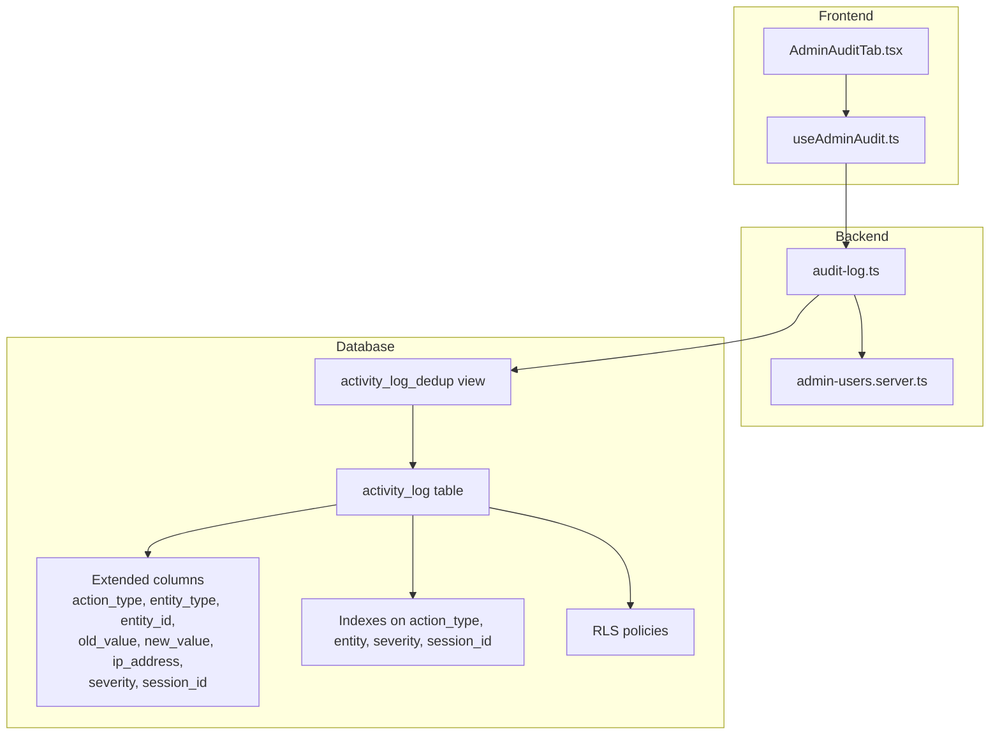
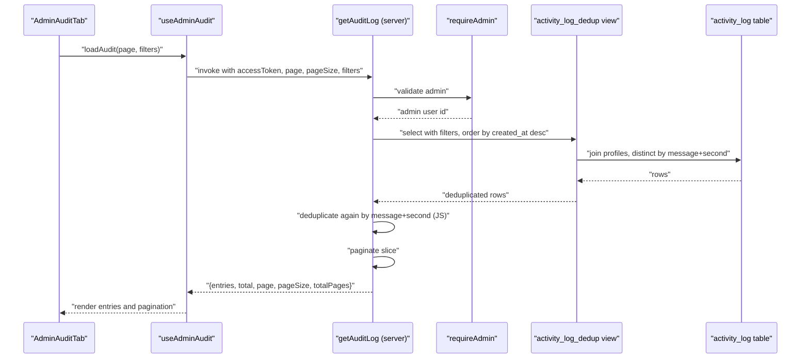
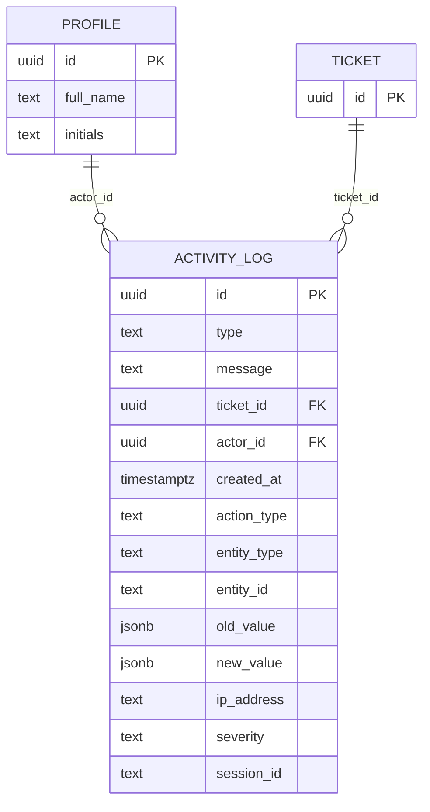
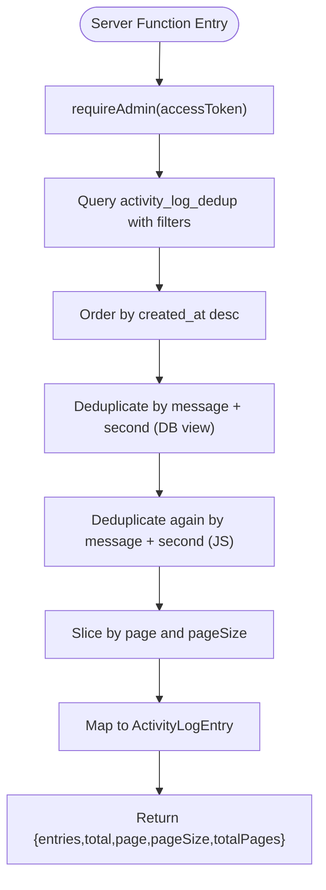
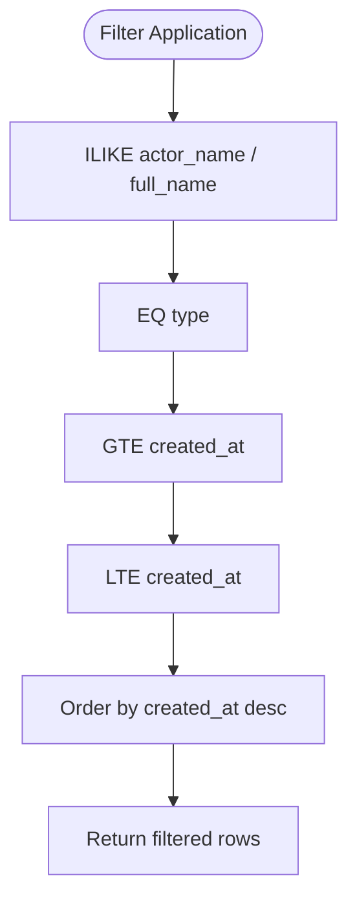
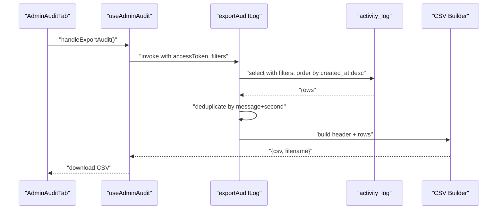
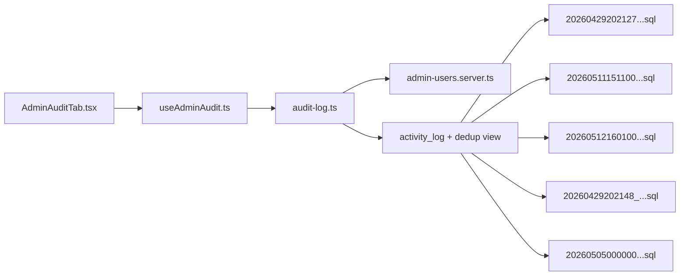

# Audit Logging System

<cite>
**Referenced Files in This Document**
- [audit-log.ts](file://src/lib/audit-log.ts)
- [audit-log-actions.ts](file://src/lib/audit-log-actions.ts)
- [AdminAuditTab.tsx](file://src/components/admin/AdminAuditTab.tsx)
- [useAdminAudit.ts](file://src/hooks/useAdminAudit.ts)
- [admin-users.server.ts](file://src/lib/admin-users.server.ts)
- [20260429202127_cd9e1421-24c9-40f3-9ac6-9e2259cbb2af.sql](file://supabase/migrations/20260429202127_cd9e1421-24c9-40f3-9ac6-9e2259cbb2af.sql)
- [20260511151100_extend_activity_log.sql](file://supabase/migrations/20260511151100_extend_activity_log.sql)
- [20260512160100_create_activity_log_dedup_view.sql](file://supabase/migrations/20260512160100_create_activity_log_dedup_view.sql)
- [20260429202148_94cb6d44-ee0c-44f3-a6fb-d5a0e028031e.sql](file://supabase/migrations/20260429202148_94cb6d44-ee0c-44f3-a6fb-d5a0e028031e.sql)
- [20260505000000_patch_idempotent.sql](file://supabase/migrations/20260505000000_patch_idempotent.sql)
</cite>

## Table of Contents
1. [Introduction](#introduction)
2. [Project Structure](#project-structure)
3. [Core Components](#core-components)
4. [Architecture Overview](#architecture-overview)
5. [Detailed Component Analysis](#detailed-component-analysis)
6. [Dependency Analysis](#dependency-analysis)
7. [Performance Considerations](#performance-considerations)
8. [Troubleshooting Guide](#troubleshooting-guide)
9. [Conclusion](#conclusion)
10. [Appendices](#appendices)

## Introduction
This document describes the audit logging system that tracks administrative and system activities for compliance, monitoring, and security purposes. It covers how audit log entries are created, stored, and retrieved, how actions are categorized, and how the admin interface enables filtering, searching, pagination, and exporting of logs. It also outlines security controls, retention considerations, and operational guidance for large log volumes.

## Project Structure
The audit logging system spans frontend React components and hooks, backend server functions, and database schema and policies. The primary building blocks are:
- Frontend: AdminAuditTab renders the audit UI and integrates with useAdminAudit hook.
- Hooks: useAdminAudit orchestrates fetching, pagination, filtering, and exporting.
- Backend: audit-log.ts defines server functions for retrieving and exporting audit logs.
- Security: admin-users.server.ts enforces admin-only access.
- Database: migrations define the activity_log table, extended columns, indexes, and RLS policies; a deduplication view optimizes retrieval.



**Diagram sources**
- [AdminAuditTab.tsx:1-139](file://src/components/admin/AdminAuditTab.tsx#L1-L139)
- [useAdminAudit.ts:1-82](file://src/hooks/useAdminAudit.ts#L1-L82)
- [audit-log.ts:1-183](file://src/lib/audit-log.ts#L1-L183)
- [admin-users.server.ts:1-18](file://src/lib/admin-users.server.ts#L1-L18)
- [20260429202127_cd9e1421-24c9-40f3-9ac6-9e2259cbb2af.sql:258-283](file://supabase/migrations/20260429202127_cd9e1421-24c9-40f3-9ac6-9e2259cbb2af.sql#L258-L283)
- [20260511151100_extend_activity_log.sql:1-25](file://supabase/migrations/20260511151100_extend_activity_log.sql#L1-L25)
- [20260512160100_create_activity_log_dedup_view.sql:1-17](file://supabase/migrations/20260512160100_create_activity_log_dedup_view.sql#L1-L17)
- [20260429202148_94cb6d44-ee0c-44f3-a6fb-d5a0e028031e.sql:34-38](file://supabase/migrations/20260429202148_94cb6d44-ee0c-44f3-a6fb-d5a0e028031e.sql#L34-L38)
- [20260505000000_patch_idempotent.sql:41-62](file://supabase/migrations/20260505000000_patch_idempotent.sql#L41-L62)

**Section sources**
- [AdminAuditTab.tsx:1-139](file://src/components/admin/AdminAuditTab.tsx#L1-L139)
- [useAdminAudit.ts:1-82](file://src/hooks/useAdminAudit.ts#L1-L82)
- [audit-log.ts:1-183](file://src/lib/audit-log.ts#L1-L183)
- [admin-users.server.ts:1-18](file://src/lib/admin-users.server.ts#L1-L18)
- [20260429202127_cd9e1421-24c9-40f3-9ac6-9e2259cbb2af.sql:258-283](file://supabase/migrations/20260429202127_cd9e1421-24c9-40f3-9ac6-9e2259cbb2af.sql#L258-L283)
- [20260511151100_extend_activity_log.sql:1-25](file://supabase/migrations/20260511151100_extend_activity_log.sql#L1-L25)
- [20260512160100_create_activity_log_dedup_view.sql:1-17](file://supabase/migrations/20260512160100_create_activity_log_dedup_view.sql#L1-L17)
- [20260429202148_94cb6d44-ee0c-44f3-a6fb-d5a0e028031e.sql:34-38](file://supabase/migrations/20260429202148_94cb6d44-ee0c-44f3-a6fb-d5a0e028031e.sql#L34-L38)
- [20260505000000_patch_idempotent.sql:41-62](file://supabase/migrations/20260505000000_patch_idempotent.sql#L41-L62)

## Core Components
- ActivityLogEntry: Defines the shape of a log entry returned to the UI, including identifiers, type classification, message, ticket association, actor metadata, and timestamps.
- AuditLogFilters: Supports filtering by actor name, type, and date range.
- getAuditLog: Server function that validates admin access, queries the deduplicated view, applies filters, deduplicates by message and second, paginates, and returns structured entries with counts.
- exportAuditLog: Server function that exports filtered logs to CSV with localized date/time, actor name, type, message, and ticket ID.
- useAdminAudit: React hook that manages filters, pagination, loading state, and calls the server functions for listing and exporting.
- AdminAuditTab: UI component rendering filters, pagination controls, and the log list with badges for type and ticket associations.
- Action constants: AUDIT_ACTIONS enumerates standardized action identifiers for tickets, devices, clients, users, settings, OAuth clients, automation, and portal links.

**Section sources**
- [audit-log.ts:6-21](file://src/lib/audit-log.ts#L6-L21)
- [audit-log.ts:23-107](file://src/lib/audit-log.ts#L23-L107)
- [audit-log.ts:109-182](file://src/lib/audit-log.ts#L109-L182)
- [useAdminAudit.ts:1-82](file://src/hooks/useAdminAudit.ts#L1-L82)
- [AdminAuditTab.tsx:1-139](file://src/components/admin/AdminAuditTab.tsx#L1-L139)
- [audit-log-actions.ts:1-28](file://src/lib/audit-log-actions.ts#L1-L28)

## Architecture Overview
The audit logging architecture follows a clear separation of concerns:
- Frontend: AdminAuditTab renders the UI and delegates data operations to useAdminAudit.
- Hook: useAdminAudit encapsulates server function calls, state, and pagination logic.
- Server Functions: getAuditLog and exportAuditLog enforce admin-only access via requireAdmin, query the database, and return sanitized results.
- Database: activity_log stores entries with RLS policies; activity_log_dedup view removes near-simultaneous duplicates; extended columns support richer auditing.



**Diagram sources**
- [AdminAuditTab.tsx:10-23](file://src/components/admin/AdminAuditTab.tsx#L10-L23)
- [useAdminAudit.ts:23-47](file://src/hooks/useAdminAudit.ts#L23-L47)
- [audit-log.ts:23-107](file://src/lib/audit-log.ts#L23-L107)
- [admin-users.server.ts:3-17](file://src/lib/admin-users.server.ts#L3-L17)
- [20260512160100_create_activity_log_dedup_view.sql:4-16](file://supabase/migrations/20260512160100_create_activity_log_dedup_view.sql#L4-L16)

## Detailed Component Analysis

### Data Model and Storage
The activity_log table captures:
- Core fields: id, type, message, ticket_id, actor_id, created_at.
- Extended fields (added by migration): action_type, entity_type, entity_id, old_value, new_value, ip_address, severity, session_id.
- Indexes: action_type, (entity_type, entity_id), severity, session_id.
- Row Level Security: authenticated users can read; inserts are permitted with checks; a tight policy restricts inserts to the current user when actor_id is present.



**Diagram sources**
- [20260429202127_cd9e1421-24c9-40f3-9ac6-9e2259cbb2af.sql:258-266](file://supabase/migrations/20260429202127_cd9e1421-24c9-40f3-9ac6-9e2259cbb2af.sql#L258-L266)
- [20260511151100_extend_activity_log.sql:1-9](file://supabase/migrations/20260511151100_extend_activity_log.sql#L1-L9)
- [20260429202148_94cb6d44-ee0c-44f3-a6fb-d5a0e028031e.sql:34-38](file://supabase/migrations/20260429202148_94cb6d44-ee0c-44f3-a6fb-d5a0e028031e.sql#L34-L38)

**Section sources**
- [20260429202127_cd9e1421-24c9-40f3-9ac6-9e2259cbb2af.sql:258-283](file://supabase/migrations/20260429202127_cd9e1421-24c9-40f3-9ac6-9e2259cbb2af.sql#L258-L283)
- [20260511151100_extend_activity_log.sql:1-25](file://supabase/migrations/20260511151100_extend_activity_log.sql#L1-L25)
- [20260429202148_94cb6d44-ee0c-44f3-a6fb-d5a0e028031e.sql:34-38](file://supabase/migrations/20260429202148_94cb6d44-ee0c-44f3-a6fb-d5a0e028031e.sql#L34-L38)
- [20260505000000_patch_idempotent.sql:41-62](file://supabase/migrations/20260505000000_patch_idempotent.sql#L41-L62)

### Log Entry Creation and Retrieval
- Creation: The system writes to activity_log with type, message, optional ticket_id, optional actor_id, and extended attributes when generating audit events. The extended columns enable detailed change tracking and contextual correlation.
- Retrieval: getAuditLog queries the activity_log_dedup view to remove near-simultaneous duplicates, then deduplicates again in JavaScript by message and second precision, ensuring a clean timeline. Pagination is applied after deduplication.



**Diagram sources**
- [audit-log.ts:23-107](file://src/lib/audit-log.ts#L23-L107)
- [20260512160100_create_activity_log_dedup_view.sql:4-16](file://supabase/migrations/20260512160100_create_activity_log_dedup_view.sql#L4-L16)
- [admin-users.server.ts:3-17](file://src/lib/admin-users.server.ts#L3-L17)

**Section sources**
- [audit-log.ts:23-107](file://src/lib/audit-log.ts#L23-L107)
- [20260512160100_create_activity_log_dedup_view.sql:4-16](file://supabase/migrations/20260512160100_create_activity_log_dedup_view.sql#L4-L16)
- [admin-users.server.ts:3-17](file://src/lib/admin-users.server.ts#L3-L17)

### Filtering, Searching, and Pagination
- Filters: user (actor name), actionType (sys/auto/user), dateFrom, dateTo.
- Search: ILIKE on actor_name and full_name via the dedup view and export query respectively.
- Pagination: computed total and totalPages; server-side slice after deduplication.



**Diagram sources**
- [audit-log.ts:52-68](file://src/lib/audit-log.ts#L52-L68)
- [audit-log.ts:129-143](file://src/lib/audit-log.ts#L129-L143)

**Section sources**
- [audit-log.ts:52-68](file://src/lib/audit-log.ts#L52-L68)
- [audit-log.ts:129-143](file://src/lib/audit-log.ts#L129-L143)

### Export Functionality
- Export endpoint generates CSV with localized date/time, actor name, type, message, and ticket ID.
- Deduplication is applied before CSV generation to avoid repeated rows.



**Diagram sources**
- [AdminAuditTab.tsx:70-73](file://src/components/admin/AdminAuditTab.tsx#L70-L73)
- [useAdminAudit.ts:53-68](file://src/hooks/useAdminAudit.ts#L53-L68)
- [audit-log.ts:109-182](file://src/lib/audit-log.ts#L109-L182)

**Section sources**
- [audit-log.ts:109-182](file://src/lib/audit-log.ts#L109-L182)
- [useAdminAudit.ts:53-68](file://src/hooks/useAdminAudit.ts#L53-L68)

### Action Types and Categorization
- Types: sys (system), auto (automation), user (human).
- Standardized actions: tickets, devices, clients, users, settings, OAuth clients, automation, portal links.
- Extended fields: action_type, entity_type/entity_id, old_value/new_value, ip_address, severity, session_id.

```mermaid
classDiagram
class ActivityLogEntry {
+string id
+"sys"|"auto"|"user" type
+string message
+string? ticket_id
+string? actor_id
+string created_at
+string? actor_name
}
class AuditAction {
<<enumeration>>
"ticket.created"
"ticket.status_changed"
"ticket.assigned"
"ticket.deleted"
"device.created"
"device.deleted"
"device.assigned"
"client.created"
"client.deleted"
"user.invited"
"user.disabled"
"settings.updated"
"oauth.client_created"
"oauth.client_disabled"
"oauth.client_enabled"
"oauth.client_revoked"
"oauth.client_secret_rotated"
"automation.triggered"
"automation.failed"
"portal.link_generated"
"portal.link_revoked"
}
```

**Diagram sources**
- [audit-log.ts:6-14](file://src/lib/audit-log.ts#L6-L14)
- [audit-log-actions.ts:1-28](file://src/lib/audit-log-actions.ts#L1-L28)

**Section sources**
- [audit-log.ts:6-14](file://src/lib/audit-log.ts#L6-L14)
- [audit-log-actions.ts:1-28](file://src/lib/audit-log-actions.ts#L1-L28)

### Real-time Updates and Admin Interface Integration
- The UI supports manual refresh and pagination controls.
- The dedup view and indexing improve responsiveness for frequent reads.
- No explicit WebSocket or live subscription is implemented in the referenced code; updates appear upon reload or filter change.

**Section sources**
- [AdminAuditTab.tsx:10-23](file://src/components/admin/AdminAuditTab.tsx#L10-L23)
- [useAdminAudit.ts:23-47](file://src/hooks/useAdminAudit.ts#L23-L47)
- [20260512160100_create_activity_log_dedup_view.sql:4-16](file://supabase/migrations/20260512160100_create_activity_log_dedup_view.sql#L4-L16)
- [20260511151100_extend_activity_log.sql:22-25](file://supabase/migrations/20260511151100_extend_activity_log.sql#L22-L25)

### Log Retention and Data Lifecycle Management
- The repository does not define explicit retention policies for activity_log.
- Consider implementing periodic cleanup jobs (e.g., scheduled tasks) to archive or purge old entries based on organizational policy.
- Indexes on severity and session_id facilitate efficient archival and search.

**Section sources**
- [20260511151100_extend_activity_log.sql:22-25](file://supabase/migrations/20260511151100_extend_activity_log.sql#L22-L25)

### Security Considerations
- Access control: requireAdmin enforces admin-only access to audit operations.
- RLS: activity_log has RLS policies allowing authenticated users to read and inserts with checks; a tight policy restricts inserts to the current user when actor_id is present.
- Integrity: The dedup view and dual deduplication in the server function reduce duplication; consider hashing or immutable storage for tamper resistance in future enhancements.

**Section sources**
- [admin-users.server.ts:3-17](file://src/lib/admin-users.server.ts#L3-L17)
- [20260505000000_patch_idempotent.sql:41-62](file://supabase/migrations/20260505000000_patch_idempotent.sql#L41-L62)
- [20260429202148_94cb6d44-ee0c-44f3-a6fb-d5a0e028031e.sql:34-38](file://supabase/migrations/20260429202148_94cb6d44-ee0c-44f3-a6fb-d5a0e028031e.sql#L34-L38)

## Dependency Analysis
The audit system exhibits low coupling and clear boundaries:
- Frontend depends on hooks and server functions.
- Hooks depend on server functions and UI state.
- Server functions depend on Supabase client and admin validation.
- Database depends on migrations for schema, indexes, and policies.



**Diagram sources**
- [AdminAuditTab.tsx:1-139](file://src/components/admin/AdminAuditTab.tsx#L1-L139)
- [useAdminAudit.ts:1-82](file://src/hooks/useAdminAudit.ts#L1-L82)
- [audit-log.ts:1-183](file://src/lib/audit-log.ts#L1-L183)
- [admin-users.server.ts:1-18](file://src/lib/admin-users.server.ts#L1-L18)
- [20260429202127_cd9e1421-24c9-40f3-9ac6-9e2259cbb2af.sql:258-283](file://supabase/migrations/20260429202127_cd9e1421-24c9-40f3-9ac6-9e2259cbb2af.sql#L258-L283)
- [20260511151100_extend_activity_log.sql:1-25](file://supabase/migrations/20260511151100_extend_activity_log.sql#L1-L25)
- [20260512160100_create_activity_log_dedup_view.sql:1-17](file://supabase/migrations/20260512160100_create_activity_log_dedup_view.sql#L1-L17)
- [20260429202148_94cb6d44-ee0c-44f3-a6fb-d5a0e028031e.sql:34-38](file://supabase/migrations/20260429202148_94cb6d44-ee0c-44f3-a6fb-d5a0e028031e.sql#L34-L38)
- [20260505000000_patch_idempotent.sql:41-62](file://supabase/migrations/20260505000000_patch_idempotent.sql#L41-L62)

**Section sources**
- [AdminAuditTab.tsx:1-139](file://src/components/admin/AdminAuditTab.tsx#L1-L139)
- [useAdminAudit.ts:1-82](file://src/hooks/useAdminAudit.ts#L1-L82)
- [audit-log.ts:1-183](file://src/lib/audit-log.ts#L1-L183)
- [admin-users.server.ts:1-18](file://src/lib/admin-users.server.ts#L1-L18)
- [20260429202127_cd9e1421-24c9-40f3-9ac6-9e2259cbb2af.sql:258-283](file://supabase/migrations/20260429202127_cd9e1421-24c9-40f3-9ac6-9e2259cbb2af.sql#L258-L283)
- [20260511151100_extend_activity_log.sql:1-25](file://supabase/migrations/20260511151100_extend_activity_log.sql#L1-L25)
- [20260512160100_create_activity_log_dedup_view.sql:1-17](file://supabase/migrations/20260512160100_create_activity_log_dedup_view.sql#L1-L17)
- [20260429202148_94cb6d44-ee0c-44f3-a6fb-d5a0e028031e.sql:34-38](file://supabase/migrations/20260429202148_94cb6d44-ee0c-44f3-a6fb-d5a0e028031e.sql#L34-L38)
- [20260505000000_patch_idempotent.sql:41-62](file://supabase/migrations/20260505000000_patch_idempotent.sql#L41-L62)

## Performance Considerations
- Deduplication: The activity_log_dedup view and a secondary JS pass prevent duplicate entries from appearing in the UI.
- Indexing: action_type, (entity_type, entity_id), severity, and session_id indexes improve filtering and search performance.
- Pagination: Applying pagination after deduplication reduces payload sizes and improves responsiveness.
- Recommendations:
  - Add a background job to periodically archive or prune old entries if volume grows large.
  - Consider partitioning by date if historical queries span many years.
  - Monitor slow queries and add targeted indexes for frequently filtered combinations.

**Section sources**
- [20260512160100_create_activity_log_dedup_view.sql:4-16](file://supabase/migrations/20260512160100_create_activity_log_dedup_view.sql#L4-L16)
- [20260511151100_extend_activity_log.sql:22-25](file://supabase/migrations/20260511151100_extend_activity_log.sql#L22-L25)
- [audit-log.ts:73-88](file://src/lib/audit-log.ts#L73-L88)

## Troubleshooting Guide
- Access Denied: If requireAdmin fails, verify the access token validity and admin role via the has_role RPC.
- Empty Results: Confirm filters (user, type, dates) and that the dedup view contains recent entries.
- Export Issues: Ensure filters are applied consistently between listing and export; verify CSV generation and download handling.
- Performance Degradation: Check index usage and consider adding or adjusting indexes based on observed query patterns.

**Section sources**
- [admin-users.server.ts:3-17](file://src/lib/admin-users.server.ts#L3-L17)
- [audit-log.ts:23-107](file://src/lib/audit-log.ts#L23-L107)
- [audit-log.ts:109-182](file://src/lib/audit-log.ts#L109-L182)

## Conclusion
The audit logging system provides a robust foundation for tracking administrative and system activities with strong security controls, flexible filtering, and export capabilities. Its modular design separates UI, hooks, server functions, and database concerns, enabling maintainability and scalability. Future enhancements could include retention policies, live updates, and advanced tamper-prevention measures.

## Appendices

### Example Audit Log Entries
- Type: sys/auto/user
- Message: Human-readable event description
- Actor: Actor name or "System"
- Timestamp: ISO-like string with timezone
- Ticket ID: Optional reference to a ticket
- Severity: info/warning/critical (extended column)
- IP address and Session ID: Extended columns for context

**Section sources**
- [audit-log.ts:6-14](file://src/lib/audit-log.ts#L6-L14)
- [audit-log.ts:90-98](file://src/lib/audit-log.ts#L90-L98)
- [20260511151100_extend_activity_log.sql:1-9](file://supabase/migrations/20260511151100_extend_activity_log.sql#L1-L9)