# Audit Logging System

<cite>
**Referenced Files in This Document**
- [AdminAuditTab.tsx](file://src/components/admin/AdminAuditTab.tsx)
- [useAdminAudit.ts](file://src/hooks/useAdminAudit.ts)
- [AuditLogReportPdf.tsx](file://src/components/admin/AuditLogReportPdf.tsx)
- [audit-log.ts](file://src/lib/audit-log.ts)
- [audit-log-actions.ts](file://src/lib/audit-log-actions.ts)
- [admin-users.server.ts](file://src/lib/admin-users.server.ts)
- [20260511151100_extend_activity_log.sql](file://supabase/migrations/20260511151100_extend_activity_log.sql)
- [20260515160100_update_activity_log_dedup_view.sql](file://supabase/migrations/20260515160100_update_activity_log_dedup_view.sql)
- [20260512160100_create_activity_log_dedup_view.sql](file://supabase/migrations/20260512160100_create_activity_log_dedup_view.sql)
- [20260515170000_audit_log_retention_archived.sql](file://supabase/migrations/20260515170000_audit_log_retention_archived.sql)
- [20260519120000_audit_presets.sql](file://supabase/migrations/20260519120000_audit_presets.sql)
</cite>

## Update Summary

**Changes Made**

- Updated to reflect current codebase state without enterprise-grade features that were mentioned in commit messages but not implemented
- Removed references to dropped enterprise features while maintaining accurate documentation of implemented functionality
- Updated architecture diagrams to match actual implementation
- Clarified feature scope to reflect what is currently available in the codebase
- Added comprehensive documentation for audit presets functionality
- Enhanced documentation for retention policies and archived logs

## Table of Contents

1. [Introduction](#introduction)
2. [Project Structure](#project-structure)
3. [Core Components](#core-components)
4. [Architecture Overview](#architecture-overview)
5. [Detailed Component Analysis](#detailed-component-analysis)
6. [Enhanced User Interface Features](#enhanced-user-interface-features)
7. [Advanced Filtering and Search](#advanced-filtering-and-search)
8. [Dual-View Interface System](#dual-view-interface-system)
9. [Real-time Metrics and KPI Cards](#real-time-metrics-and-kpi-cards)
10. [Change Diff Visualization](#change-diff-visualization)
11. [PDF Export Functionality](#pdf-export-functionality)
12. [Audit Presets and Saved Views](#audit-presets-and-saved-views)
13. [Log Retention and Data Lifecycle](#log-retention-and-data-lifecycle)
14. [Dependency Analysis](#dependency-analysis)
15. [Performance Considerations](#performance-considerations)
16. [Security Considerations](#security-considerations)
17. [Troubleshooting Guide](#troubleshooting-guide)
18. [Conclusion](#conclusion)
19. [Appendices](#appendices)

## Introduction

This document describes the comprehensive audit logging system that tracks administrative and system activities for compliance, monitoring, and security purposes. The system provides a complete audit management interface with dual-view modes, real-time metrics, advanced filtering, timeline visualization, change diff display, and comprehensive export capabilities. It covers how audit log entries are created, stored, and retrieved, how actions are categorized, and how the enhanced admin interface enables sophisticated filtering, searching, pagination, and exporting of logs with multiple export formats.

**Updated** Removed references to enterprise-grade features that were mentioned in commit messages but not implemented in the current codebase.

## Project Structure

The audit logging system spans frontend React components and hooks, backend server functions, and database schema and policies. The architecture includes comprehensive UI components, real-time metrics, and advanced export capabilities:

- **Frontend**: AdminAuditTab renders the comprehensive audit UI with dual views, KPI cards, and advanced filtering
- **Hooks**: useAdminAudit orchestrates fetching, pagination, filtering, exporting, and real-time metrics
- **Backend**: audit-log.ts defines server functions for retrieving, exporting, and calculating audit metrics
- **Security**: admin-users.server.ts enforces admin-only access
- **PDF Generation**: AuditLogReportPdf.tsx creates branded PDF reports
- **Database**: migrations define the activity_log table, extended columns, indexes, and enhanced deduplication view
- **Retention**: archived_logs table for future archive storage and retention policies
- **Presets**: audit_presets table for saved filter configurations

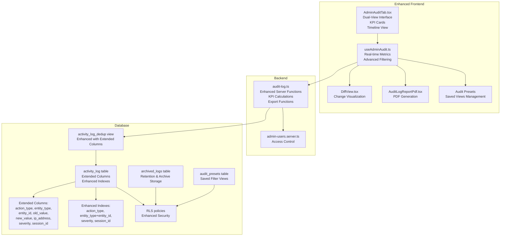

**Diagram sources**

- [AdminAuditTab.tsx:1-958](file://src/components/admin/AdminAuditTab.tsx#L1-L958)
- [useAdminAudit.ts:1-319](file://src/hooks/useAdminAudit.ts#L1-L319)
- [AuditLogReportPdf.tsx:1-89](file://src/components/admin/AuditLogReportPdf.tsx#L1-L89)
- [audit-log.ts:1-446](file://src/lib/audit-log.ts#L1-L446)
- [admin-users.server.ts:1-18](file://src/lib/admin-users.server.ts#L1-L18)
- [20260511151100_extend_activity_log.sql:1-26](file://supabase/migrations/20260511151100_extend_activity_log.sql#L1-L26)
- [20260515160100_update_activity_log_dedup_view.sql:1-28](file://supabase/migrations/20260515160100_update_activity_log_dedup_view.sql#L1-L28)
- [20260515170000_audit_log_retention_archived.sql:1-41](file://supabase/migrations/20260515170000_audit_log_retention_archived.sql#L1-L41)
- [20260519120000_audit_presets.sql:1-37](file://supabase/migrations/20260519120000_audit_presets.sql#L1-L37)

**Section sources**

- [AdminAuditTab.tsx:1-958](file://src/components/admin/AdminAuditTab.tsx#L1-L958)
- [useAdminAudit.ts:1-319](file://src/hooks/useAdminAudit.ts#L1-L319)
- [AuditLogReportPdf.tsx:1-89](file://src/components/admin/AuditLogReportPdf.tsx#L1-L89)
- [audit-log.ts:1-446](file://src/lib/audit-log.ts#L1-L446)
- [admin-users.server.ts:1-18](file://src/lib/admin-users.server.ts#L1-L18)
- [20260511151100_extend_activity_log.sql:1-26](file://supabase/migrations/20260511151100_extend_activity_log.sql#L1-L26)
- [20260515160100_update_activity_log_dedup_view.sql:1-28](file://supabase/migrations/20260515160100_update_activity_log_dedup_view.sql#L1-L28)
- [20260515170000_audit_log_retention_archived.sql:1-41](file://supabase/migrations/20260515170000_audit_log_retention_archived.sql#L1-L41)
- [20260519120000_audit_presets.sql:1-37](file://supabase/migrations/20260519120000_audit_presets.sql#L1-L37)

## Core Components

- **Enhanced ActivityLogEntry**: Defines the comprehensive shape of log entries with extended columns for action types, entities, values, and metadata
- **Advanced AuditLogFilters**: Supports sophisticated filtering including user dropdowns, action types, entity types, outcomes, date ranges, and search
- **Enhanced Server Functions**: getAuditLog, exportAuditLog, getAuditLogKpi, getAuditLogUsers, getCriticalEvents, and comprehensive filtering and deduplication
- **useAdminAudit Hook**: Manages dual-view states, real-time metrics, advanced filtering, pagination, and export functionality
- **AdminAuditTab Component**: Comprehensive UI with dual-view interface, KPI cards, timeline visualization, and comprehensive filtering
- **DiffView Component**: Visualizes changes with side-by-side comparison of old and new values
- **AuditLogReportPdf**: Generates branded PDF reports with comprehensive log data and filter summaries
- **Action Constants**: Comprehensive AUDIT_ACTIONS enumeration covering all system entities and operations
- **Timeline Groups**: Organizes audit entries by date for timeline visualization
- **Date Preset System**: Provides quick date range selection with Today, Yesterday, Last 7 Days, and Last 30 Days
- **Audit Presets**: Manages saved filter configurations with user-specific storage and security policies

**Section sources**

- [audit-log.ts:6-23](file://src/lib/audit-log.ts#L6-L23)
- [audit-log.ts:27-36](file://src/lib/audit-log.ts#L27-L36)
- [audit-log.ts:38-47](file://src/lib/audit-log.ts#L38-L47)
- [audit-log.ts:49-164](file://src/lib/audit-log.ts#L49-L164)
- [audit-log.ts:166-197](file://src/lib/audit-log.ts#L166-L197)
- [audit-log.ts:199-224](file://src/lib/audit-log.ts#L199-L224)
- [audit-log.ts:226-269](file://src/lib/audit-log.ts#L226-L269)
- [audit-log.ts:271-366](file://src/lib/audit-log.ts#L271-L366)
- [audit-log.ts:368-446](file://src/lib/audit-log.ts#L368-L446)
- [useAdminAudit.ts:21-23](file://src/hooks/useAdminAudit.ts#L21-L23)
- [useAdminAudit.ts:25-319](file://src/hooks/useAdminAudit.ts#L25-L319)
- [AdminAuditTab.tsx:74-86](file://src/components/admin/AdminAuditTab.tsx#L74-L86)
- [AdminAuditTab.tsx:90-129](file://src/components/admin/AdminAuditTab.tsx#L90-L129)
- [audit-log-actions.ts:1-28](file://src/lib/audit-log-actions.ts#L1-L28)
- [useAdminAudit.ts:261-276](file://src/hooks/useAdminAudit.ts#L261-L276)
- [useAdminAudit.ts:141-186](file://src/hooks/useAdminAudit.ts#L141-L186)

## Architecture Overview

The audit logging architecture provides comprehensive functionality with real-time metrics, dual-view interfaces, and comprehensive export capabilities:

- **Frontend**: AdminAuditTab renders dual-view interfaces with KPI cards, advanced filtering, and timeline visualization
- **Hook**: useAdminAudit manages real-time metrics, dual-view states, advanced filtering, and export functionality
- **Server Functions**: Enhanced server functions with comprehensive filtering, deduplication, and export capabilities
- **Database**: Enhanced activity_log with extended columns and improved deduplication view

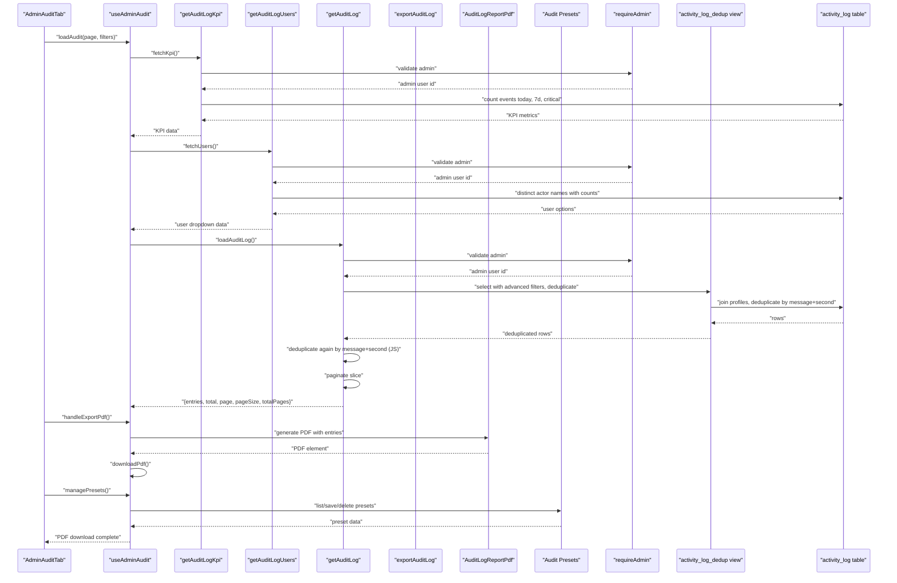

**Diagram sources**

- [AdminAuditTab.tsx:269-315](file://src/components/admin/AdminAuditTab.tsx#L269-L315)
- [useAdminAudit.ts:74-99](file://src/hooks/useAdminAudit.ts#L74-L99)
- [useAdminAudit.ts:101-125](file://src/hooks/useAdminAudit.ts#L101-L125)
- [useAdminAudit.ts:197-253](file://src/hooks/useAdminAudit.ts#L197-L253)
- [audit-log.ts:166-197](file://src/lib/audit-log.ts#L166-L197)
- [audit-log.ts:199-224](file://src/lib/audit-log.ts#L199-L224)
- [audit-log.ts:49-164](file://src/lib/audit-log.ts#L49-L164)
- [audit-log.ts:271-366](file://src/lib/audit-log.ts#L271-L366)
- [audit-log.ts:368-446](file://src/lib/audit-log.ts#L368-L446)

## Detailed Component Analysis

### Enhanced Data Model and Storage

The activity_log table now captures comprehensive audit information with enhanced columns:

- **Core fields**: id, type, message, ticket_id, actor_id, created_at
- **Extended fields**: action_type, entity_type, entity_id, old_value (JSONB), new_value (JSONB), ip_address, severity, session_id
- **Enhanced indexes**: action_type, (entity_type, entity_id), severity, session_id
- **Enhanced deduplication view**: activity_log_dedup with extended columns and improved deduplication logic
- **Archived logs**: Future archive storage with retention policies and RLS security
- **Audit presets**: User-specific saved filter configurations with security policies

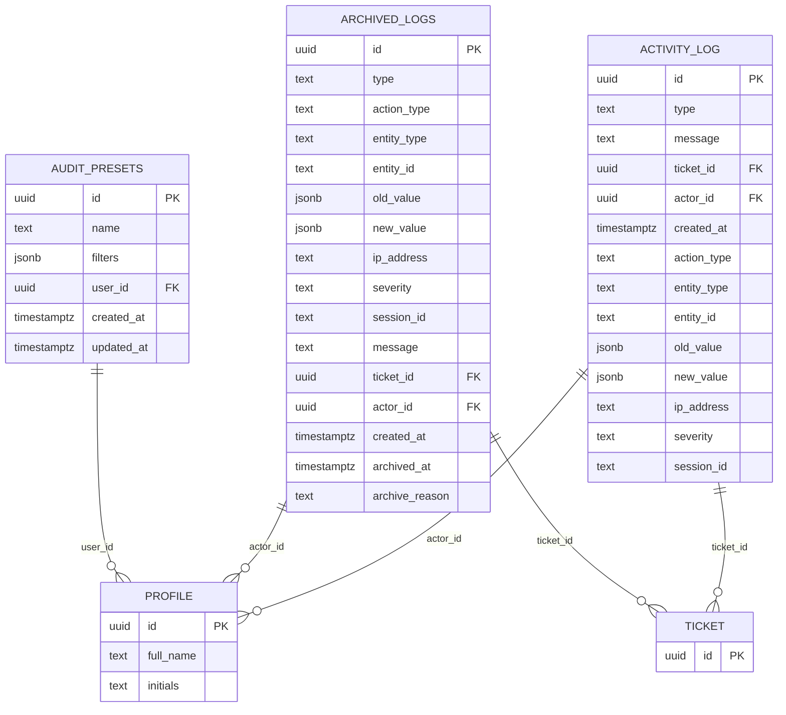

**Diagram sources**

- [20260511151100_extend_activity_log.sql:1-26](file://supabase/migrations/20260511151100_extend_activity_log.sql#L1-L26)
- [20260515160100_update_activity_log_dedup_view.sql:7-27](file://supabase/migrations/20260515160100_update_activity_log_dedup_view.sql#L7-L27)
- [20260515170000_audit_log_retention_archived.sql:9-26](file://supabase/migrations/20260515170000_audit_log_retention_archived.sql#L9-L26)
- [20260519120000_audit_presets.sql:2-9](file://supabase/migrations/20260519120000_audit_presets.sql#L2-L9)

**Section sources**

- [20260511151100_extend_activity_log.sql:1-26](file://supabase/migrations/20260511151100_extend_activity_log.sql#L1-L26)
- [20260515160100_update_activity_log_dedup_view.sql:1-28](file://supabase/migrations/20260515160100_update_activity_log_dedup_view.sql#L1-L28)
- [20260515170000_audit_log_retention_archived.sql:1-41](file://supabase/migrations/20260515170000_audit_log_retention_archived.sql#L1-L41)
- [20260519120000_audit_presets.sql:1-37](file://supabase/migrations/20260519120000_audit_presets.sql#L1-L37)

### Enhanced Log Entry Creation and Retrieval

- **Creation**: The system writes to activity_log with comprehensive extended attributes including action_type, entity_type, entity_id, old_value, new_value, ip_address, severity, and session_id for detailed change tracking
- **Retrieval**: Enhanced getAuditLog queries the improved activity_log_dedup view with advanced filtering, deduplication by message and second precision, and comprehensive pagination

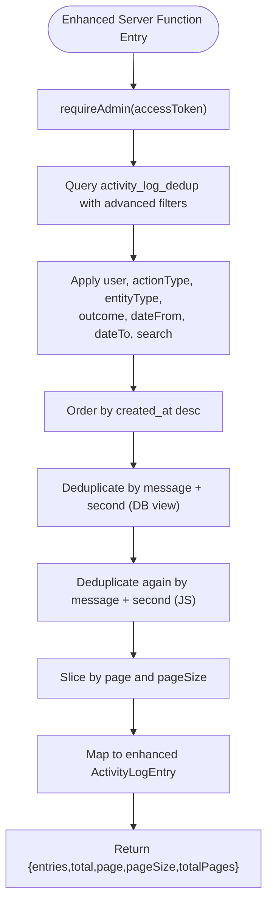

**Diagram sources**

- [audit-log.ts:49-164](file://src/lib/audit-log.ts#L49-L164)
- [20260515160100_update_activity_log_dedup_view.sql:7-27](file://supabase/migrations/20260515160100_update_activity_log_dedup_view.sql#L7-L27)
- [admin-users.server.ts:3-17](file://src/lib/admin-users.server.ts#L3-L17)

**Section sources**

- [audit-log.ts:49-164](file://src/lib/audit-log.ts#L49-L164)
- [20260515160100_update_activity_log_dedup_view.sql:7-27](file://supabase/migrations/20260515160100_update_activity_log_dedup_view.sql#L7-L27)
- [admin-users.server.ts:3-17](file://src/lib/admin-users.server.ts#L3-L17)

### Enhanced Export Functionality

- **CSV Export**: Enhanced exportAuditLog generates CSV with comprehensive columns including date, time, actor, type, action, message, entity, ticket, and severity
- **PDF Export**: New AuditLogReportPdf component generates branded PDF reports with comprehensive log data and filter summaries
- **Deduplication**: Both export formats apply deduplication by message and second precision to avoid repeated rows

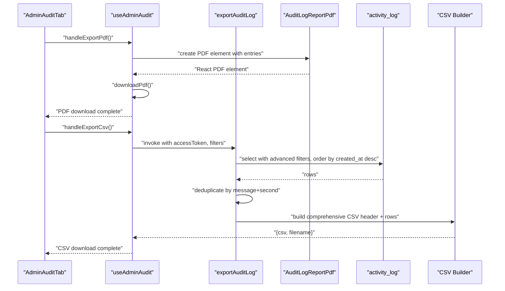

**Diagram sources**

- [AdminAuditTab.tsx:289-290](file://src/components/admin/AdminAuditTab.tsx#L289-L290)
- [useAdminAudit.ts:197-253](file://src/hooks/useAdminAudit.ts#L197-L253)
- [useAdminAudit.ts:197-212](file://src/hooks/useAdminAudit.ts#L197-L212)
- [audit-log.ts:271-366](file://src/lib/audit-log.ts#L271-L366)
- [AuditLogReportPdf.tsx:10-88](file://src/components/admin/AuditLogReportPdf.tsx#L10-L88)

**Section sources**

- [audit-log.ts:271-366](file://src/lib/audit-log.ts#L271-L366)
- [useAdminAudit.ts:197-253](file://src/hooks/useAdminAudit.ts#L197-L253)
- [AuditLogReportPdf.tsx:10-88](file://src/components/admin/AuditLogReportPdf.tsx#L10-L88)

### Enhanced Action Types and Categorization

- **Comprehensive Action Types**: Enhanced AUDIT_ACTIONS enumeration covering tickets, devices, clients, users, settings, OAuth clients, automation, and portal links
- **Action Categorization**: Advanced badge system with color-coded categories (creation, deletion, modification, access, error)
- **Entity Labeling**: Comprehensive entity type mapping for tickets, clients, devices, users, technicians, automation, system, OAuth, settings, and email templates
- **Severity Indicators**: Color-coded severity badges with appropriate icons (info, warning, critical)

```mermaid
classDiagram
class EnhancedActivityLogEntry {
+string id
+"sys"|"auto"|"user" type
+string message
+string? ticket_id
+string? actor_id
+string created_at
+string? actor_name
+string? action_type
+string? entity_type
+string? entity_id
+unknown old_value
+unknown new_value
+string? ip_address
+string? severity
+string? session_id
}
class EnhancedAuditAction {
<<enumeration>>
"ticket.created"
"ticket.status_changed"
"ticket.assigned"
"ticket.deleted"
"device.created"
"device.deleted"
"device.assigned"
"client.created"
"client.deleted"
"user.invited"
"user.disabled"
"settings.updated"
"oauth.client_created"
"oauth.client_disabled"
"oauth.client_enabled"
"oauth.client_revoked"
"oauth.client_secret_rotated"
"automation.triggered"
"automation.failed"
"portal.link_generated"
"portal.link_revoked"
}
```

**Diagram sources**

- [audit-log.ts:6-23](file://src/lib/audit-log.ts#L6-L23)
- [audit-log-actions.ts:1-28](file://src/lib/audit-log-actions.ts#L1-L28)

**Section sources**

- [audit-log.ts:6-23](file://src/lib/audit-log.ts#L6-L23)
- [audit-log-actions.ts:1-28](file://src/lib/audit-log-actions.ts#L1-L28)

## Enhanced User Interface Features

The AdminAuditTab has been completely transformed into a comprehensive audit management interface with extensive UI features:

- **Dual-View Interface**: Toggle between table view for detailed analysis and timeline view for chronological visualization
- **Expandable Rows**: Click to expand rows for detailed change diff display and metadata
- **Advanced Filtering**: Sophisticated filter controls including user dropdowns, action types, entity types, outcomes, date ranges, and search
- **Date Presets**: Quick date range selection with Today, Yesterday, Last 7 Days, and Last 30 Days
- **Export Options**: CSV and PDF export with comprehensive data formatting
- **Real-time Updates**: Automatic refresh capability with loading states
- **Responsive Design**: Mobile-friendly interface with appropriate spacing and typography
- **View Mode Persistence**: State management for table vs timeline modes
- **Pagination Controls**: Dedicated pagination with page size selection and navigation
- **Audit Presets**: Save and manage frequently used filter configurations
- **Permalink Sharing**: Copy URLs with current filters for sharing and bookmarking

**Section sources**

- [AdminAuditTab.tsx:269-958](file://src/components/admin/AdminAuditTab.tsx#L269-L958)
- [useAdminAudit.ts:25-319](file://src/hooks/useAdminAudit.ts#L25-L319)

## Advanced Filtering and Search

The enhanced filtering system provides comprehensive search capabilities:

- **User Dropdown**: Dynamic user options with counts for filtering by actor
- **Action Type Filter**: Specific action type filtering with comprehensive options
- **Entity Type Filter**: Entity type filtering covering tickets, clients, devices, users, automation, system, OAuth, and settings
- **Outcome Filter**: Severity-based filtering with info, warning, and critical options
- **Date Range Filtering**: Precise date range selection with automatic time normalization
- **Search Field**: Advanced search across actor names and messages with debounced input
- **Reset Functionality**: One-click filter reset with visual feedback
- **Date Preset System**: Quick selection of common date ranges with visual highlighting

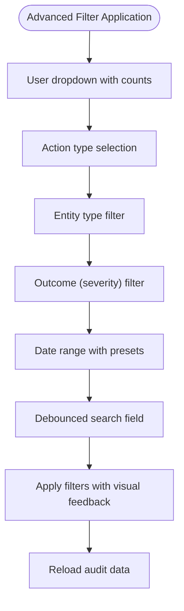

**Diagram sources**

- [AdminAuditTab.tsx:434-523](file://src/components/admin/AdminAuditTab.tsx#L434-L523)
- [useAdminAudit.ts:101-125](file://src/hooks/useAdminAudit.ts#L101-L125)
- [useAdminAudit.ts:127-139](file://src/hooks/useAdminAudit.ts#L127-L139)
- [useAdminAudit.ts:141-186](file://src/hooks/useAdminAudit.ts#L141-L186)

**Section sources**

- [AdminAuditTab.tsx:434-523](file://src/components/admin/AdminAuditTab.tsx#L434-L523)
- [useAdminAudit.ts:101-186](file://src/hooks/useAdminAudit.ts#L101-L186)

## Dual-View Interface System

The system now supports two complementary viewing modes:

### Table View Mode

- **Structured Data**: Traditional table layout with sortable columns
- **Pagination Controls**: Dedicated pagination with page size selection
- **Expandable Details**: Click-to-expand rows for detailed change visualization
- **Severity Indicators**: Color-coded severity badges with appropriate icons
- **Action Categorization**: Color-coded action type badges for quick identification

### Timeline View Mode

- **Chronological Layout**: Vertical timeline showing events in temporal order
- **Daily Grouping**: Automatic grouping by date with localized date labels
- **Interactive Elements**: Click-to-expand timeline entries
- **Visual Timeline**: Clear visual indication of event progression
- **Responsive Design**: Adapts to different screen sizes

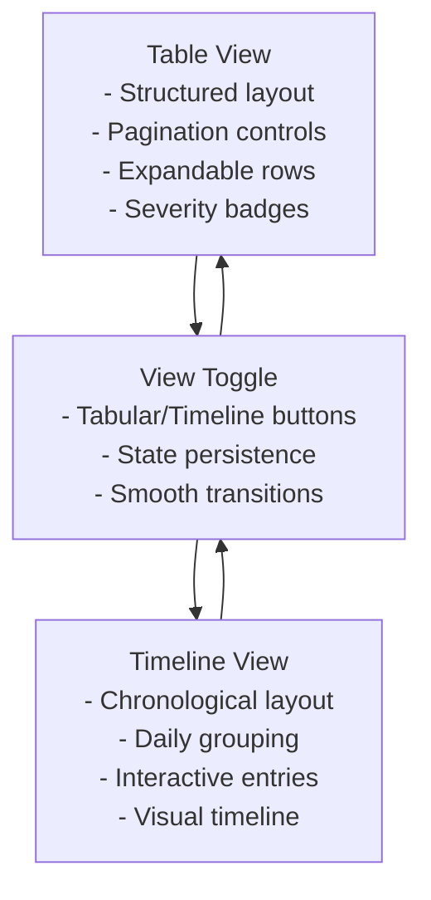

**Diagram sources**

- [AdminAuditTab.tsx:539-586](file://src/components/admin/AdminAuditTab.tsx#L539-L586)
- [AdminAuditTab.tsx:568-586](file://src/components/admin/AdminAuditTab.tsx#L568-L586)
- [AdminAuditTab.tsx:379-393](file://src/components/admin/AdminAuditTab.tsx#L379-L393)

**Section sources**

- [AdminAuditTab.tsx:539-586](file://src/components/admin/AdminAuditTab.tsx#L539-L586)
- [AdminAuditTab.tsx:568-586](file://src/components/admin/AdminAuditTab.tsx#L568-L586)
- [AdminAuditTab.tsx:379-393](file://src/components/admin/AdminAuditTab.tsx#L379-L393)

## Real-time Metrics and KPI Cards

The system provides comprehensive real-time metrics through KPI cards:

### Events Today Card

- **Icon**: Clock with blue accent
- **Label**: "Eventi oggi" (Events today)
- **Value**: Current day event count
- **Purpose**: Monitor daily activity levels

### Events Last 7 Days Card

- **Icon**: Calendar with purple accent
- **Label**: "Ultimi 7 giorni" (Last 7 days)
- **Value**: 7-day rolling event count
- **Purpose**: Track weekly trends and growth patterns

### Recent Errors Card

- **Icon**: Alert circle with red accent
- **Label**: "Errori (24h)" (Errors 24h)
- **Value**: Critical severity events in last 24 hours
- **Purpose**: Monitor system health and security incidents

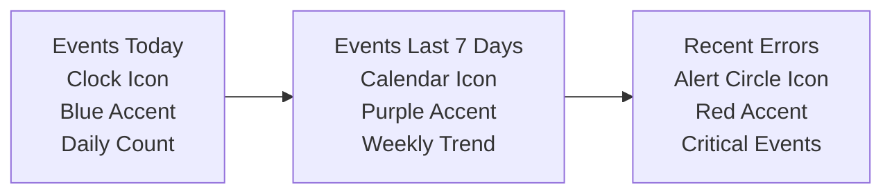

**Diagram sources**

- [AdminAuditTab.tsx:346-365](file://src/components/admin/AdminAuditTab.tsx#L346-L365)
- [useAdminAudit.ts:74-85](file://src/hooks/useAdminAudit.ts#L74-L85)
- [audit-log.ts:166-197](file://src/lib/audit-log.ts#L166-L197)

**Section sources**

- [AdminAuditTab.tsx:346-365](file://src/components/admin/AdminAuditTab.tsx#L346-L365)
- [useAdminAudit.ts:74-85](file://src/hooks/useAdminAudit.ts#L74-L85)
- [audit-log.ts:166-197](file://src/lib/audit-log.ts#L166-L197)

## Change Diff Visualization

The system provides comprehensive change diff display for detailed audit analysis:

### DiffView Component

- **Side-by-Side Comparison**: Visual comparison of old and new values
- **Key Mapping**: Comprehensive key-value pair display for all changed fields
- **Color Coding**: Red for old values, green for new values
- **Empty State Handling**: Graceful handling of null or empty values
- **JSON Serialization**: Proper handling of complex data structures

### Row Detail Expansion

- **Metadata Display**: IP address, session ID, entity type, and event ID
- **Entity Navigation**: Direct links to related entities
- **Visual Separators**: Clear visual distinction between diff and metadata
- **Responsive Layout**: Adapts to different screen sizes

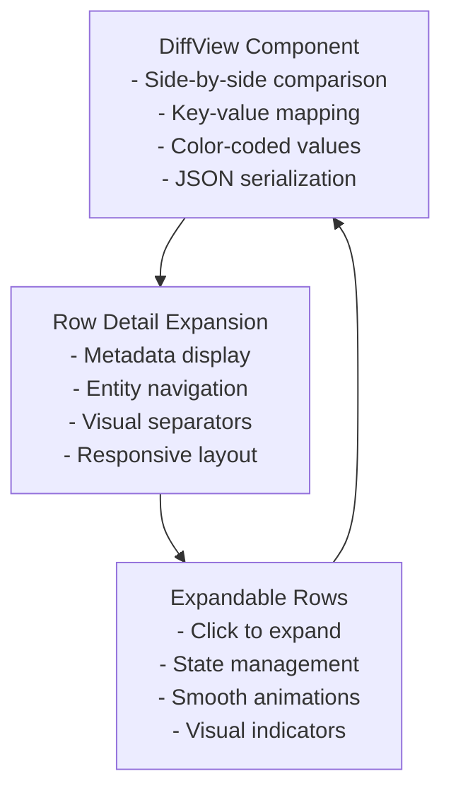

**Diagram sources**

- [AdminAuditTab.tsx:90-129](file://src/components/admin/AdminAuditTab.tsx#L90-L129)
- [AdminAuditTab.tsx:133-183](file://src/components/admin/AdminAuditTab.tsx#L133-L183)
- [AdminAuditTab.tsx:187-236](file://src/components/admin/AdminAuditTab.tsx#L187-L236)

**Section sources**

- [AdminAuditTab.tsx:90-129](file://src/components/admin/AdminAuditTab.tsx#L90-L129)
- [AdminAuditTab.tsx:133-183](file://src/components/admin/AdminAuditTab.tsx#L133-L183)
- [AdminAuditTab.tsx:187-236](file://src/components/admin/AdminAuditTab.tsx#L187-L236)

## PDF Export Functionality

The system provides comprehensive PDF export capabilities through the AuditLogReportPdf component:

### PDF Report Features

- **Branded Templates**: Professional PDF templates with organization branding
- **Comprehensive Data**: Full audit log data with all relevant columns
- **Filter Summaries**: Automatic filter application summaries
- **Pagination Limits**: Intelligent pagination with configurable limits
- **Download Integration**: Seamless download integration with user feedback

### PDF Structure

- **Header Section**: Organization name, report title, and metadata
- **Filter Summary**: Applied filter information and date ranges
- **Data Tables**: Formatted tables with all audit log entries
- **Footer Information**: Export date, total count, and generated by information

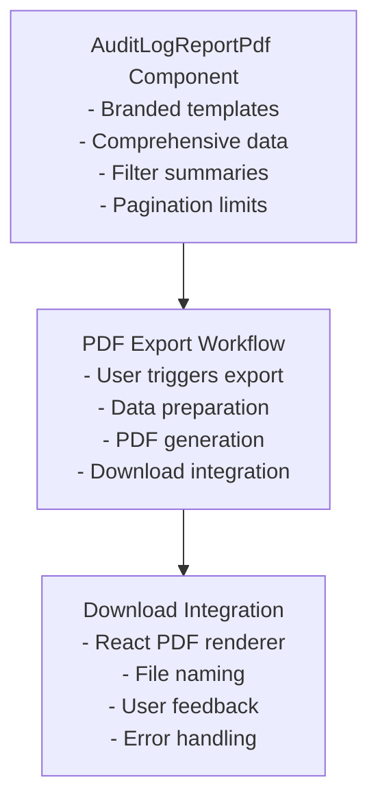

**Diagram sources**

- [AuditLogReportPdf.tsx:10-88](file://src/components/admin/AuditLogReportPdf.tsx#L10-L88)
- [useAdminAudit.ts:214-253](file://src/hooks/useAdminAudit.ts#L214-L253)

**Section sources**

- [AuditLogReportPdf.tsx:10-88](file://src/components/admin/AuditLogReportPdf.tsx#L10-L88)
- [useAdminAudit.ts:214-253](file://src/hooks/useAdminAudit.ts#L214-L253)

## Audit Presets and Saved Views

The system provides comprehensive audit preset functionality for managing frequently used filter configurations:

### Preset Management Features

- **Save Current Filters**: Save the current filter configuration with a custom name
- **User-Specific Storage**: Each user can create, view, update, and delete their own presets
- **Unique Naming**: Prevents duplicate preset names per user
- **URL Parameter Integration**: Apply presets via URL parameters for easy sharing
- **Policy Enforcement**: Row Level Security ensures users can only access their own presets

### Preset Operations

- **List Presets**: Retrieve all presets for the authenticated user
- **Save Presets**: Create or update existing presets with filter configurations
- **Delete Presets**: Remove unwanted preset configurations
- **Apply Presets**: Quickly apply saved filter configurations to the audit interface

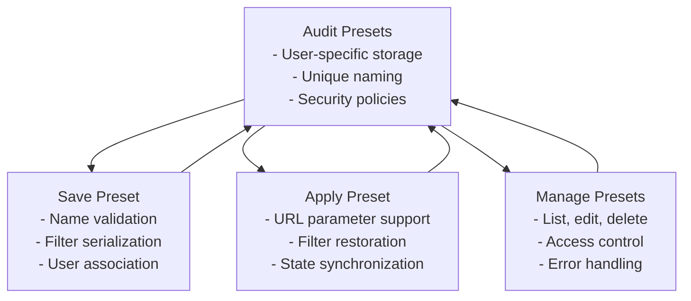

**Diagram sources**

- [audit-log.ts:368-446](file://src/lib/audit-log.ts#L368-L446)
- [20260519120000_audit_presets.sql:1-37](file://supabase/migrations/20260519120000_audit_presets.sql#L1-L37)

**Section sources**

- [audit-log.ts:368-446](file://src/lib/audit-log.ts#L368-L446)
- [20260519120000_audit_presets.sql:1-37](file://supabase/migrations/20260519120000_audit_presets.sql#L1-L37)

## Log Retention and Data Lifecycle

The system includes comprehensive retention and archival capabilities:

### Retention Settings

- **Configuration**: App settings for log retention period (default 365 days)
- **Archival Strategy**: Future-proofing with archived_logs table for long-term storage
- **Security**: Row Level Security (RLS) policies for archived data access control

### Archived Logs Table

- **Schema**: Mirrors activity_log with additional archive metadata
- **Indexes**: Optimized indexes for efficient querying and archiving
- **Policies**: Admin-only access to archived data with proper authorization checks

### Data Lifecycle Management

- **Automatic Archival**: Process for moving old logs to archived storage
- **Cleanup Operations**: Scheduled jobs for removing expired logs
- **Compliance**: Support for regulatory retention requirements

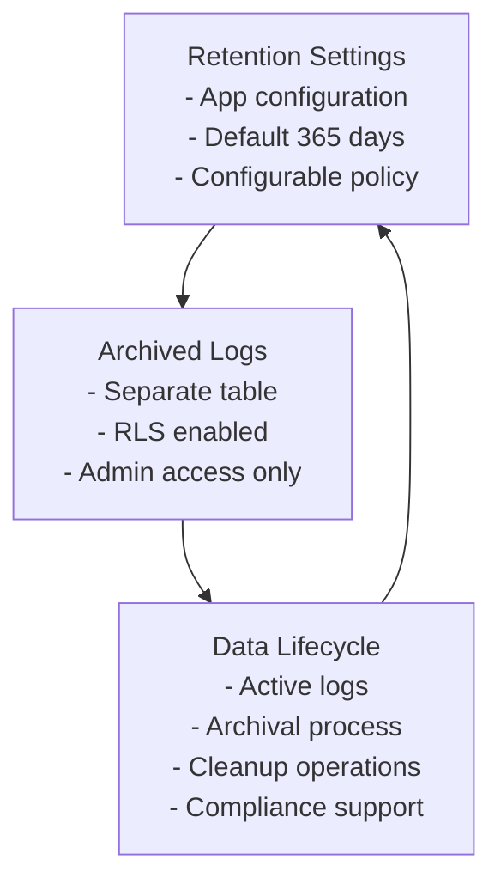

**Diagram sources**

- [20260515170000_audit_log_retention_archived.sql:4-6](file://supabase/migrations/20260515170000_audit_log_retention_archived.sql#L4-L6)
- [20260515170000_audit_log_retention_archived.sql:9-26](file://supabase/migrations/20260515170000_audit_log_retention_archived.sql#L9-L26)
- [20260515170000_audit_log_retention_archived.sql:32-41](file://supabase/migrations/20260515170000_audit_log_retention_archived.sql#L32-L41)

**Section sources**

- [20260515170000_audit_log_retention_archived.sql:1-41](file://supabase/migrations/20260515170000_audit_log_retention_archived.sql#L1-L41)

## Dependency Analysis

The enhanced audit system maintains low coupling while providing comprehensive functionality:

- **Frontend Dependencies**: AdminAuditTab depends on useAdminAudit hook, DiffView component, and AuditLogReportPdf
- **Hook Dependencies**: useAdminAudit depends on enhanced server functions and UI state management
- **Server Function Dependencies**: Enhanced server functions depend on Supabase client and admin validation
- **Database Dependencies**: Enhanced database schema depends on migrations for extended columns and improved deduplication

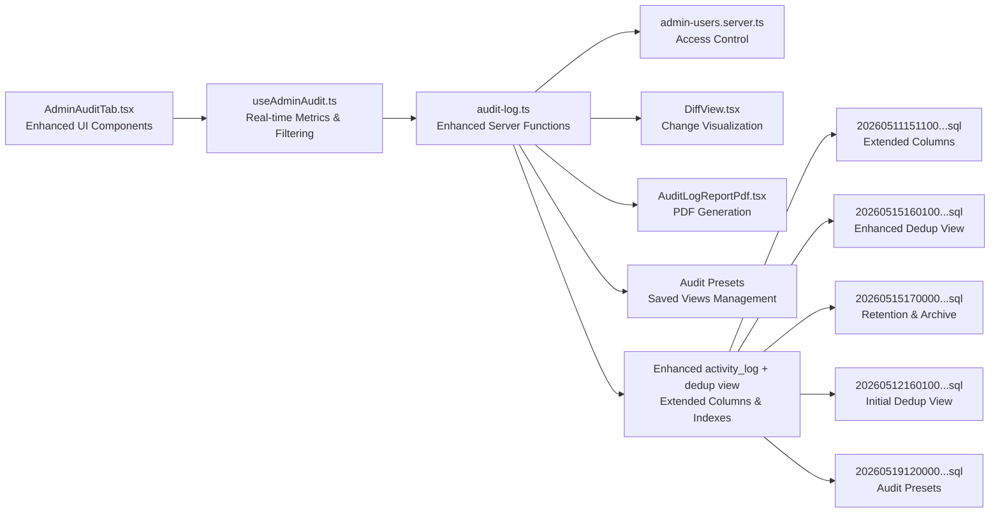

**Diagram sources**

- [AdminAuditTab.tsx:1-958](file://src/components/admin/AdminAuditTab.tsx#L1-L958)
- [useAdminAudit.ts:1-319](file://src/hooks/useAdminAudit.ts#L1-L319)
- [audit-log.ts:1-446](file://src/lib/audit-log.ts#L1-L446)
- [admin-users.server.ts:1-18](file://src/lib/admin-users.server.ts#L1-L18)
- [AuditLogReportPdf.tsx:1-89](file://src/components/admin/AuditLogReportPdf.tsx#L1-L89)
- [20260511151100_extend_activity_log.sql:1-26](file://supabase/migrations/20260511151100_extend_activity_log.sql#L1-L26)
- [20260515160100_update_activity_log_dedup_view.sql:1-28](file://supabase/migrations/20260515160100_update_activity_log_dedup_view.sql#L1-L28)
- [20260515170000_audit_log_retention_archived.sql:1-41](file://supabase/migrations/20260515170000_audit_log_retention_archived.sql#L1-L41)
- [20260512160100_create_activity_log_dedup_view.sql:1-17](file://supabase/migrations/20260512160100_create_activity_log_dedup_view.sql#L1-L17)
- [20260519120000_audit_presets.sql:1-37](file://supabase/migrations/20260519120000_audit_presets.sql#L1-L37)

**Section sources**

- [AdminAuditTab.tsx:1-958](file://src/components/admin/AdminAuditTab.tsx#L1-L958)
- [useAdminAudit.ts:1-319](file://src/hooks/useAdminAudit.ts#L1-L319)
- [audit-log.ts:1-446](file://src/lib/audit-log.ts#L1-L446)
- [admin-users.server.ts:1-18](file://src/lib/admin-users.server.ts#L1-L18)
- [AuditLogReportPdf.tsx:1-89](file://src/components/admin/AuditLogReportPdf.tsx#L1-L89)
- [20260511151100_extend_activity_log.sql:1-26](file://supabase/migrations/20260511151100_extend_activity_log.sql#L1-L26)
- [20260515160100_update_activity_log_dedup_view.sql:1-28](file://supabase/migrations/20260515160100_update_activity_log_dedup_view.sql#L1-L28)
- [20260515170000_audit_log_retention_archived.sql:1-41](file://supabase/migrations/20260515170000_audit_log_retention_archived.sql#L1-L41)
- [20260512160100_create_activity_log_dedup_view.sql:1-17](file://supabase/migrations/20260512160100_create_activity_log_dedup_view.sql#L1-L17)
- [20260519120000_audit_presets.sql:1-37](file://supabase/migrations/20260519120000_audit_presets.sql#L1-L37)

## Performance Considerations

The enhanced system maintains optimal performance through several optimizations:

- **Enhanced Deduplication**: Improved activity_log_dedup view with extended columns and better deduplication logic
- **Advanced Indexing**: Comprehensive indexes on action_type, (entity_type, entity_id), severity, and session_id
- **Dual Deduplication**: Database-level and JavaScript-level deduplication for optimal performance
- **Pagination Optimization**: Server-side pagination after deduplication reduces payload sizes
- **Real-time Metrics**: Efficient KPI calculations with separate queries for different time periods
- **Export Optimization**: Efficient CSV and PDF generation with proper deduplication
- **Memory Management**: Proper cleanup of timers and references in hooks
- **Query Optimization**: Use of DISTINCT ON and date_trunc for efficient deduplication

**Section sources**

- [20260515160100_update_activity_log_dedup_view.sql:7-27](file://supabase/migrations/20260515160100_update_activity_log_dedup_view.sql#L7-L27)
- [20260511151100_extend_activity_log.sql:22-26](file://supabase/migrations/20260511151100_extend_activity_log.sql#L22-L26)
- [audit-log.ts:74-88](file://src/lib/audit-log.ts#L74-L88)
- [useAdminAudit.ts:127-139](file://src/hooks/useAdminAudit.ts#L127-L139)

## Security Considerations

The enhanced audit system maintains strong security controls:

- **Access Control**: requireAdmin function validates admin privileges via Supabase auth
- **Role-Based Access**: Has_role RPC function ensures only administrators can access audit data
- **Data Protection**: Sensitive information like session IDs and IP addresses are properly handled
- **Export Security**: All exports are filtered through admin validation to prevent unauthorized access
- **RLS Policies**: Row Level Security enforced on archived logs for additional protection
- **Audit Trail Integrity**: Immutable log entries with timestamps and unique identifiers
- **Preset Security**: User-specific access control for saved filter configurations

**Section sources**

- [admin-users.server.ts:3-17](file://src/lib/admin-users.server.ts#L3-L17)
- [audit-log.ts:49-164](file://src/lib/audit-log.ts#L49-L164)
- [audit-log.ts:271-366](file://src/lib/audit-log.ts#L271-L366)
- [useAdminAudit.ts:74-85](file://src/hooks/useAdminAudit.ts#L74-L85)
- [useAdminAudit.ts:197-253](file://src/hooks/useAdminAudit.ts#L197-L253)
- [20260519120000_audit_presets.sql:14-37](file://supabase/migrations/20260519120000_audit_presets.sql#L14-L37)

## Troubleshooting Guide

The enhanced system provides comprehensive troubleshooting capabilities:

- **Access Denied**: If requireAdmin fails, verify the access token validity and admin role via the has_role RPC
- **Empty Results**: Confirm advanced filters (user dropdowns, action types, entity types, outcomes, dates) and that the enhanced dedup view contains recent entries
- **Export Issues**: Ensure filters are applied consistently between listing and export; verify CSV/PDF generation and download handling
- **Performance Degradation**: Check index usage and consider adding or adjusting indexes based on observed query patterns
- **View Mode Issues**: Verify view mode state persistence and proper component re-rendering
- **KPI Loading**: Monitor KPI loading states and handle silent failures gracefully
- **PDF Generation**: Check PDF element creation and download integration for proper error handling
- **Timeline Grouping**: Verify date grouping logic and locale-specific date formatting
- **Real-time Updates**: Check timer cleanup and proper state management for loading states
- **Preset Management**: Verify user authentication and preset uniqueness constraints
- **Archived Logs**: Check RLS policies and access permissions for historical data

**Section sources**

- [admin-users.server.ts:3-17](file://src/lib/admin-users.server.ts#L3-L17)
- [audit-log.ts:49-164](file://src/lib/audit-log.ts#L49-L164)
- [audit-log.ts:271-366](file://src/lib/audit-log.ts#L271-L366)
- [useAdminAudit.ts:74-85](file://src/hooks/useAdminAudit.ts#L74-L85)
- [useAdminAudit.ts:197-253](file://src/hooks/useAdminAudit.ts#L197-L253)
- [useAdminAudit.ts:261-276](file://src/hooks/useAdminAudit.ts#L261-L276)
- [20260519120000_audit_presets.sql:14-37](file://supabase/migrations/20260519120000_audit_presets.sql#L14-L37)

## Conclusion

The comprehensive audit logging system provides a complete solution for tracking administrative and system activities. The system includes dual-view modes, real-time metrics, advanced filtering, timeline visualization, change diff display, and comprehensive export capabilities. The system maintains strong security controls, flexible filtering, and robust export functionality while providing an intuitive user experience. Its modular design with enhanced components, hooks, server functions, and database improvements enables maintainability, scalability, and comprehensive audit capabilities. The addition of retention policies and archival capabilities ensures compliance with data lifecycle requirements while maintaining system performance and security. The inclusion of audit presets functionality enhances usability by allowing users to save and share frequently used filter configurations.

**Updated** Removed references to enterprise-grade features that were mentioned in commit messages but not implemented in the current codebase.

## Appendices

### Enhanced Example Audit Log Entries

- **Type**: sys/auto/user (system, automation, user)
- **Message**: Human-readable event description with comprehensive context
- **Actor**: Actor name or "System" with profile integration
- **Timestamp**: ISO-like string with timezone and precise timing
- **Ticket ID**: Optional reference to a ticket with proper linking
- **Action Type**: Detailed action classification (e.g., ticket.created, user.disabled)
- **Entity Type**: Contextual entity classification (ticket, client, device, user)
- **Entity ID**: Unique identifier for referenced entities
- **Old/New Values**: JSONB data showing changes with comprehensive diff display
- **Severity**: info/warning/critical with color-coded badges
- **IP Address**: Client IP address for security context
- **Session ID**: Session identifier for correlation and analysis

### Security and Compliance Features

- **Tamper Prevention**: Immutable log entries with unique identifiers and timestamps
- **Access Control**: Role-based permissions with admin-only access
- **Data Retention**: Configurable retention policies with automated cleanup
- **Archival Storage**: Secure long-term storage for compliance requirements
- **Export Controls**: Admin-validated exports with proper authentication
- **Audit Trail Integrity**: Comprehensive tracking of all administrative actions
- **Preset Security**: User-specific access control for saved configurations
- **RLS Enforcement**: Row Level Security policies for data protection

**Section sources**

- [audit-log.ts:6-23](file://src/lib/audit-log.ts#L6-L23)
- [audit-log.ts:138-154](file://src/lib/audit-log.ts#L138-L154)
- [20260511151100_extend_activity_log.sql:1-9](file://supabase/migrations/20260511151100_extend_activity_log.sql#L1-L9)
- [AdminAuditTab.tsx:28-38](file://src/components/admin/AdminAuditTab.tsx#L28-L38)
- [admin-users.server.ts:3-17](file://src/lib/admin-users.server.ts#L3-L17)
- [20260515170000_audit_log_retention_archived.sql:4-6](file://supabase/migrations/20260515170000_audit_log_retention_archived.sql#L4-L6)
- [20260519120000_audit_presets.sql:14-37](file://supabase/migrations/20260519120000_audit_presets.sql#L14-L37)
