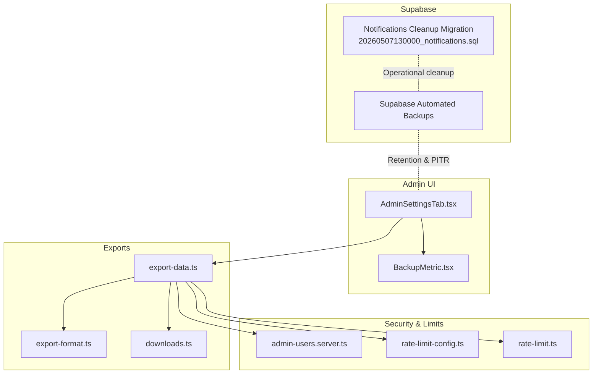
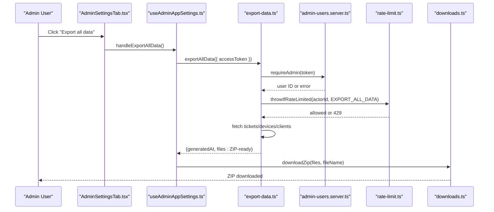
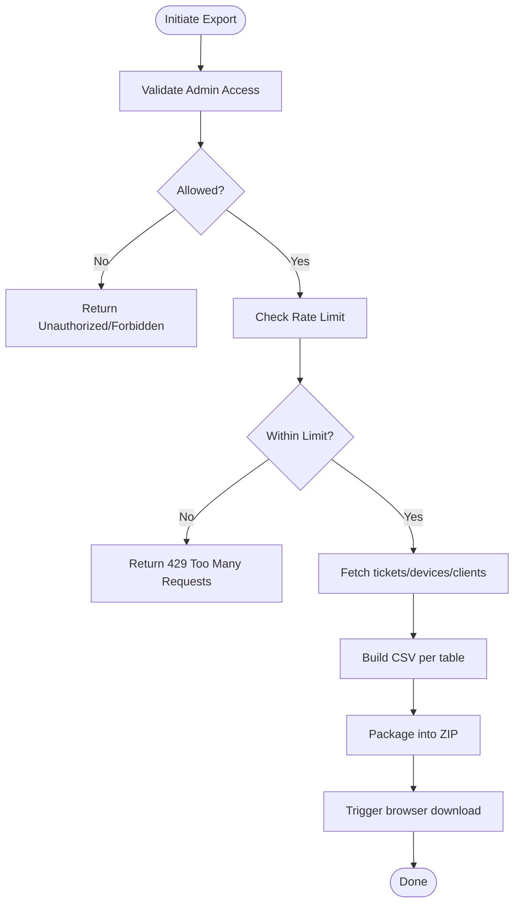
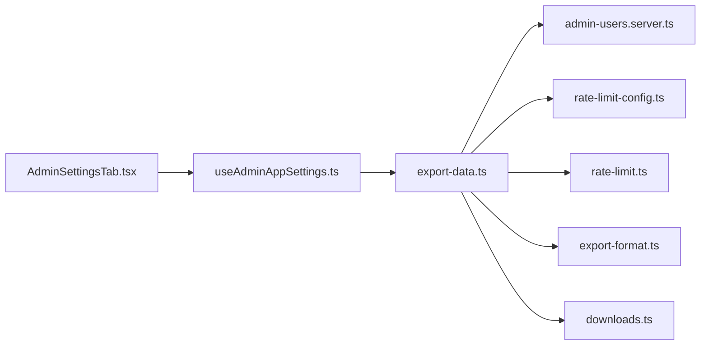

# Backup and Recovery Procedures

<cite>
**Referenced Files in This Document**
- [BACKUP.md](file://docs/BACKUP.md)
- [AdminSettingsTab.tsx](file://src/components/admin/AdminSettingsTab.tsx)
- [BackupMetric.tsx](file://src/components/admin/BackupMetric.tsx)
- [export-data.ts](file://src/lib/export-data.ts)
- [export-format.ts](file://src/lib/export-format.ts)
- [downloads.ts](file://src/lib/downloads.ts)
- [admin-users.server.ts](file://src/lib/admin-users.server.ts)
- [rate-limit-config.ts](file://src/lib/rate-limit-config.ts)
- [rate-limit.ts](file://src/lib/rate-limit.ts)
- [useAdminAppSettings.ts](file://src/hooks/useAdminAppSettings.ts)
- [admin.tsx](file://src/routes/_app/admin.tsx)
- [20260507130000_notifications.sql](file://supabase/migrations/20260507130000_notifications.sql)
</cite>

## Table of Contents

1. [Introduction](#introduction)
2. [Project Structure](#project-structure)
3. [Core Components](#core-components)
4. [Architecture Overview](#architecture-overview)
5. [Detailed Component Analysis](#detailed-component-analysis)
6. [Dependency Analysis](#dependency-analysis)
7. [Performance Considerations](#performance-considerations)
8. [Troubleshooting Guide](#troubleshooting-guide)
9. [Conclusion](#conclusion)
10. [Appendices](#appendices)

## Introduction

This document describes the backup and recovery procedures for the application, focusing on:

- The Supabase-managed automated backup system
- Manual data export capabilities and ZIP archive creation
- Backup scheduling and retention policies
- Recovery workflows, validation, and rollback considerations
- Monitoring and metrics
- Security controls for backup data protection

The content is derived from the repository’s documentation and implementation files.

## Project Structure

The backup and recovery functionality spans UI components, server-side export logic, and Supabase-managed infrastructure. Key areas:

- Admin UI for viewing backup metrics and triggering exports
- Server function for exporting tickets, devices, and clients
- Utilities for CSV formatting and ZIP creation
- Rate limiting and admin authorization
- Supabase-managed backup retention and point-in-time recovery

**Diagram sources**

- [AdminSettingsTab.tsx:36-87](file://src/components/admin/AdminSettingsTab.tsx#L36-L87)
- [BackupMetric.tsx:1-10](file://src/components/admin/BackupMetric.tsx#L1-L10)
- [export-data.ts:11-52](file://src/lib/export-data.ts#L11-L52)
- [export-format.ts:8-26](file://src/lib/export-format.ts#L8-L26)
- [downloads.ts:57-147](file://src/lib/downloads.ts#L57-L147)
- [admin-users.server.ts:3-17](file://src/lib/admin-users.server.ts#L3-L17)
- [rate-limit-config.ts:5-30](file://src/lib/rate-limit-config.ts#L5-L30)
- [rate-limit.ts:30-103](file://src/lib/rate-limit.ts#L30-L103)
- [20260507130000_notifications.sql:55-76](file://supabase/migrations/20260507130000_notifications.sql#L55-L76)

**Section sources**

- [AdminSettingsTab.tsx:36-87](file://src/components/admin/AdminSettingsTab.tsx#L36-L87)
- [export-data.ts:11-52](file://src/lib/export-data.ts#L11-L52)
- [downloads.ts:57-147](file://src/lib/downloads.ts#L57-L147)
- [admin-users.server.ts:3-17](file://src/lib/admin-users.server.ts#L3-L17)
- [rate-limit-config.ts:5-30](file://src/lib/rate-limit-config.ts#L5-L30)
- [rate-limit.ts:30-103](file://src/lib/rate-limit.ts#L30-L103)
- [20260507130000_notifications.sql:55-76](file://supabase/migrations/20260507130000_notifications.sql#L55-L76)

## Core Components

- Supabase-managed automated backups: daily backups, point-in-time recovery (PITR) on higher tiers, WAL-based granularity, and geo-redundant storage.
- Manual export endpoint: retrieves tickets, devices, and clients, formats as CSV, and packages into a ZIP for download.
- Admin UI: displays backup metrics and supports initiating the full export.
- Access control and rate limiting: admin-only access and throttling for export requests.
- Operational cleanup migration: scheduled cleanup of old notifications to keep the system lean.

**Section sources**

- [BACKUP.md:7-26](file://docs/BACKUP.md#L7-L26)
- [export-data.ts:11-52](file://src/lib/export-data.ts#L11-L52)
- [AdminSettingsTab.tsx:36-87](file://src/components/admin/AdminSettingsTab.tsx#L36-L87)
- [admin-users.server.ts:3-17](file://src/lib/admin-users.server.ts#L3-L17)
- [rate-limit-config.ts:5-30](file://src/lib/rate-limit-config.ts#L5-L30)
- [20260507130000_notifications.sql:55-76](file://supabase/migrations/20260507130000_notifications.sql#L55-L76)

## Architecture Overview

The backup system architecture combines:

- Infrastructure-level backups managed by Supabase (daily, retention, PITR)
- Application-level exports for independent, portable archives
- UI-driven controls and validations for administrators

**Diagram sources**

- [AdminSettingsTab.tsx:80-87](file://src/components/admin/AdminSettingsTab.tsx#L80-L87)
- [useAdminAppSettings.ts:135-143](file://src/hooks/useAdminAppSettings.ts#L135-L143)
- [export-data.ts:11-52](file://src/lib/export-data.ts#L11-L52)
- [admin-users.server.ts:3-17](file://src/lib/admin-users.server.ts#L3-L17)
- [rate-limit.ts:92-103](file://src/lib/rate-limit.ts#L92-L103)
- [downloads.ts:57-59](file://src/lib/downloads.ts#L57-L59)

## Detailed Component Analysis

### Supabase Automated Backups

- Frequency: daily automated backups
- Retention: 7 days on Free tier, 30 days on Pro tier
- Recovery objectives:
  - Recovery Point Objective (RPO): less than 24 hours
  - Recovery Time Objective (RTO): less than 4 hours (coordinated with provider and support)
- Visibility: last backup available via Supabase dashboard or Management API

**Section sources**

- [BACKUP.md:16-26](file://docs/BACKUP.md#L16-L26)

### Manual Data Export (ZIP Archive Creation)

- Endpoint: export-all-data server function
- Scope: tickets, devices, clients
- Output: CSV files packaged into a single ZIP archive
- Naming: filenames include a date stamp
- Access control: admin-only; validated via server-side admin check
- Rate limiting: enforced for export requests

**Diagram sources**

- [export-data.ts:11-52](file://src/lib/export-data.ts#L11-L52)
- [admin-users.server.ts:3-17](file://src/lib/admin-users.server.ts#L3-L17)
- [rate-limit.ts:92-103](file://src/lib/rate-limit.ts#L92-L103)
- [export-format.ts:8-26](file://src/lib/export-format.ts#L8-L26)
- [downloads.ts:57-147](file://src/lib/downloads.ts#L57-L147)

**Section sources**

- [export-data.ts:11-52](file://src/lib/export-data.ts#L11-L52)
- [export-format.ts:8-26](file://src/lib/export-format.ts#L8-L26)
- [downloads.ts:57-147](file://src/lib/downloads.ts#L57-L147)
- [admin-users.server.ts:3-17](file://src/lib/admin-users.server.ts#L3-L17)
- [rate-limit-config.ts:13](file://src/lib/rate-limit-config.ts#L13)

### Admin UI Controls and Metrics

- Backup metrics card displays:
  - Frequency: daily automated
  - Retention: tier-dependent
  - Last backup: provider-managed
  - RPO/RTO targets
  - Emergency contact (support email)
- Export trigger button initiates the full export workflow

**Section sources**

- [AdminSettingsTab.tsx:36-87](file://src/components/admin/AdminSettingsTab.tsx#L36-L87)
- [BackupMetric.tsx:1-10](file://src/components/admin/BackupMetric.tsx#L1-L10)

### Access Control and Rate Limiting

- Admin-only access enforced server-side using Supabase auth and role checks
- Rate limiting configured for export-all-data with a sliding window and fixed limit
- In-memory limiter with optional Redis-backed scaling

**Section sources**

- [admin-users.server.ts:3-17](file://src/lib/admin-users.server.ts#L3-L17)
- [rate-limit-config.ts:5-30](file://src/lib/rate-limit-config.ts#L5-L30)
- [rate-limit.ts:30-103](file://src/lib/rate-limit.ts#L30-L103)

### Backup Scheduling Mechanisms

- Supabase-managed: automated daily backups and optional PITR on supported tiers
- Application-level: no recurring export scheduling; exports are initiated on-demand via the Admin UI
- Operational cleanup: a scheduled job removes old notifications after 30 days

**Section sources**

- [BACKUP.md:16-26](file://docs/BACKUP.md#L16-L26)
- [20260507130000_notifications.sql:55-76](file://supabase/migrations/20260507130000_notifications.sql#L55-L76)

### Recovery Process

- Incident identification and containment
- Gather environment, approximate event time, impacted tables/records, and latest manual export availability
- Contact emergency support (configured in Admin settings)
- Verify available restore points near the event time on the Supabase dashboard
- Perform controlled restore in a staging environment
- Validate integrity across tickets, devices, clients, users, and application logs
- Promote restored database or reimport validated data as appropriate
- Document the incident and update preventive procedures

**Section sources**

- [BACKUP.md:42-56](file://docs/BACKUP.md#L42-L56)

### Recovery Scenarios and Rollback

- Supabase outage: use manual exports only for offline inspection; upon service restoration, verify data integrity and finalize pending operations
- Partial data restoration: leverage PITR to a known good time; validate and selectively reapply corrections if needed
- Conflict resolution during imports: align keys and deduplicate records before reimport; ensure referential integrity
- Rollback procedures: coordinate with Supabase support to revert to a previous backup; re-validate application state post-restore

**Section sources**

- [BACKUP.md:58-66](file://docs/BACKUP.md#L58-L66)

### Validation Steps

- Confirm counts and basic attributes for tickets, devices, and clients
- Cross-check user and audit logs for anomalies
- Re-run critical workflows to ensure data consistency
- Compare manual export contents against current system state where applicable

[No sources needed since this section provides general guidance]

### Examples

- Creating a manual export:
  - Navigate to Admin → Settings → General → Backup & Disaster Recovery
  - Click the export button; the system generates a ZIP containing CSV files for tickets, devices, and clients
  - The filename includes a date stamp

- Downloading a manual export:
  - The export triggers a ZIP download; the frontend constructs the archive client-side and initiates the browser download

- Restoration workflow:
  - Identify the incident and gather required details
  - Contact support and review available restore points on the Supabase dashboard
  - Execute restore in a controlled environment, validate, and promote or reimport as needed

**Section sources**

- [AdminSettingsTab.tsx:80-87](file://src/components/admin/AdminSettingsTab.tsx#L80-L87)
- [useAdminAppSettings.ts:135-143](file://src/hooks/useAdminAppSettings.ts#L135-L143)
- [downloads.ts:57-59](file://src/lib/downloads.ts#L57-L59)
- [BACKUP.md:42-56](file://docs/BACKUP.md#L42-L56)

## Dependency Analysis

**Diagram sources**

- [AdminSettingsTab.tsx:36-87](file://src/components/admin/AdminSettingsTab.tsx#L36-L87)
- [useAdminAppSettings.ts:135-143](file://src/hooks/useAdminAppSettings.ts#L135-L143)
- [export-data.ts:11-52](file://src/lib/export-data.ts#L11-L52)
- [admin-users.server.ts:3-17](file://src/lib/admin-users.server.ts#L3-L17)
- [rate-limit-config.ts:5-30](file://src/lib/rate-limit-config.ts#L5-L30)
- [rate-limit.ts:30-103](file://src/lib/rate-limit.ts#L30-L103)
- [export-format.ts:8-26](file://src/lib/export-format.ts#L8-L26)
- [downloads.ts:57-147](file://src/lib/downloads.ts#L57-L147)

**Section sources**

- [AdminSettingsTab.tsx:36-87](file://src/components/admin/AdminSettingsTab.tsx#L36-L87)
- [export-data.ts:11-52](file://src/lib/export-data.ts#L11-L52)
- [downloads.ts:57-147](file://src/lib/downloads.ts#L57-L147)

## Performance Considerations

- Export throughput depends on database query performance and network bandwidth; exports fetch all requested tables concurrently
- ZIP generation is client-side and uses in-memory buffers; very large exports may impact browser performance
- Rate limiting prevents abuse and ensures fair usage across administrators

[No sources needed since this section provides general guidance]

## Troubleshooting Guide

- Backup failures:
  - Verify Supabase dashboard for last successful backup and retention status
  - Check provider status pages and contact support if automated backups are unavailable
- Corruption detection:
  - Use PITR to a known-good timestamp and validate data integrity
  - Compare manual exports against current state for discrepancies
- Recovery validation:
  - After restore, re-run critical queries and confirm UI operations work as expected
  - Audit logs and user feedback help identify missed issues
- Export failures:
  - Authorization failures: ensure the access token belongs to an administrator
  - Rate limit exceeded: wait until the sliding window resets or reduce frequency
  - Large export timeouts: consider exporting smaller subsets or performing the operation during off-peak hours

**Section sources**

- [admin-users.server.ts:3-17](file://src/lib/admin-users.server.ts#L3-L17)
- [rate-limit.ts:92-103](file://src/lib/rate-limit.ts#L92-L103)
- [BACKUP.md:42-56](file://docs/BACKUP.md#L42-L56)

## Conclusion

The system leverages Supabase-managed automated backups for continuous protection with defined RPO/RTO targets and retention policies. Administrators can independently export and download CSV archives for validation and offline preservation. Access control and rate limiting protect the export endpoint, while operational cleanup keeps the system efficient. Recovery follows a structured process coordinated with the provider and internal support, ensuring minimal downtime and data integrity.

[No sources needed since this section summarizes without analyzing specific files]

## Appendices

### Backup Metrics and Monitoring

- Frequency: daily automated backups
- Retention: 7 days (Free), 30 days (Pro)
- RPO: less than 24 hours
- RTO: less than 4 hours (provider and support dependent)
- Last backup: visible in the Supabase dashboard or via Management API

**Section sources**

- [BACKUP.md:16-26](file://docs/BACKUP.md#L16-L26)

### Relationship Between Supabase Backups and Manual Exports

- Supabase backups provide infrastructure-level protection with PITR and geo-redundant storage
- Manual exports offer independent, portable archives useful for audits, offline verification, and compliance
- Manual exports do not replace automated backups but complement them

**Section sources**

- [BACKUP.md:28-40](file://docs/BACKUP.md#L28-L40)

### Security Considerations for Backup Data Protection

- Admin-only access to export endpoint
- Rate limiting to prevent abuse
- Encourage secure storage and access controls for downloaded ZIP archives
- Restrict distribution of sensitive data contained in exports

**Section sources**

- [admin-users.server.ts:3-17](file://src/lib/admin-users.server.ts#L3-L17)
- [rate-limit-config.ts:13](file://src/lib/rate-limit-config.ts#L13)
