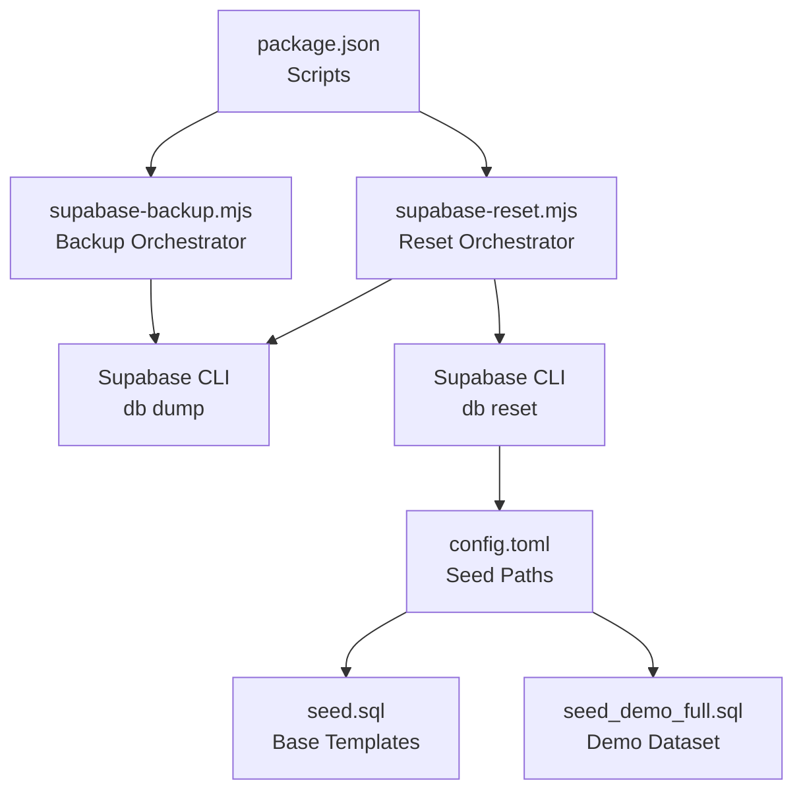
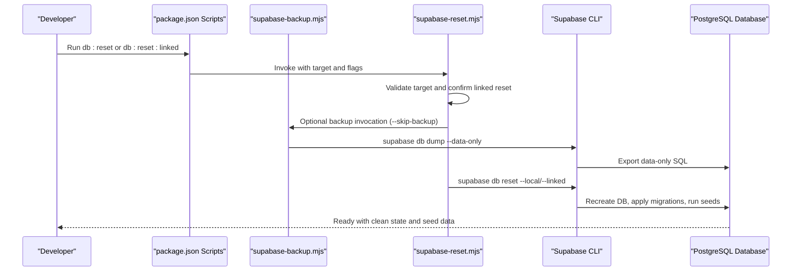
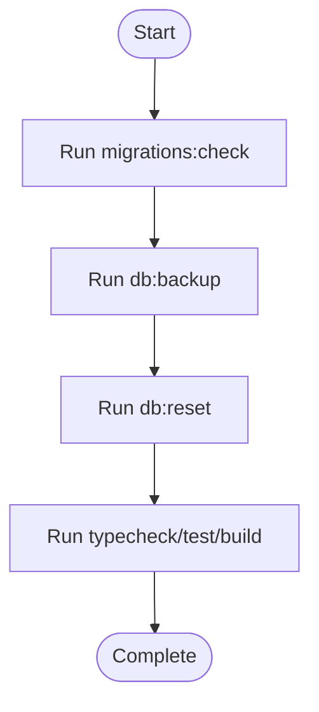
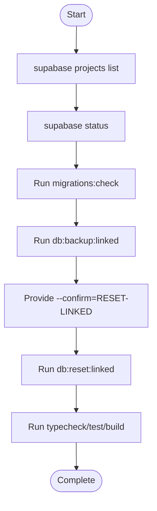
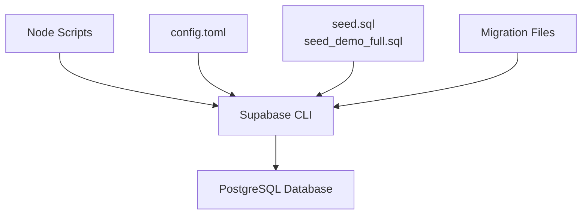

# Database Reset Procedures

<cite>
**Referenced Files in This Document**
- [database-reset.md](file://docs/database-reset.md)
- [supabase-reset.mjs](file://scripts/supabase-reset.mjs)
- [supabase-backup.mjs](file://scripts/supabase-backup.mjs)
- [package.json](file://package.json)
- [config.toml](file://supabase/config.toml)
- [seed.sql](file://supabase/seed.sql)
- [seed_demo_full.sql](file://supabase/seed_demo_full.sql)
- [validate-migrations.mjs](file://scripts/validate-migrations.mjs)
- [20260503120000_entity_versions.sql](file://supabase/migrations/20260503120000_entity_versions.sql)
- [20260504120000_app_settings.sql](file://supabase/migrations/20260504120000_app_settings.sql)
- [20260503123000_automation_rules_metadata.sql](file://supabase/migrations/20260503123000_automation_rules_metadata.sql)
</cite>

## Table of Contents

1. [Introduction](#introduction)
2. [Project Structure](#project-structure)
3. [Core Components](#core-components)
4. [Architecture Overview](#architecture-overview)
5. [Detailed Component Analysis](#detailed-component-analysis)
6. [Dependency Analysis](#dependency-analysis)
7. [Performance Considerations](#performance-considerations)
8. [Troubleshooting Guide](#troubleshooting-guide)
9. [Conclusion](#conclusion)

## Introduction

This document describes the complete database reset procedures for the Supabase-managed PostgreSQL database. It explains the recommended reset workflow, safety precautions, seed data behavior, and operational safeguards. The reset process leverages Supabase CLI commands orchestrated by Node.js scripts, ensuring reproducible environments for local development and controlled resets for linked projects.

## Project Structure

The reset workflow spans several areas of the repository:

- Documentation that defines the reset procedure and tables involved
- Node.js scripts that orchestrate backups and resets via Supabase CLI
- Supabase configuration that controls seed execution
- SQL seed files that populate initial data
- Migration files that define the schema and default settings

**Diagram sources**

- [package.json:26-29](file://package.json#L26-L29)
- [supabase-backup.mjs:50-61](file://scripts/supabase-backup.mjs#L50-L61)
- [supabase-reset.mjs:62-68](file://scripts/supabase-reset.mjs#L62-L68)
- [config.toml:3-6](file://supabase/config.toml#L3-L6)

**Section sources**

- [database-reset.md:1-122](file://docs/database-reset.md#L1-L122)
- [package.json:26-31](file://package.json#L26-L31)

## Core Components

- Backup script: Creates data-only dumps for local or linked targets, timestamped and stored under the backups directory.
- Reset script: Performs pre-checks, optionally triggers a backup, and executes the Supabase CLI reset command against local or linked targets.
- Supabase configuration: Defines seed paths executed automatically after reset.
- Seed files: Provide baseline templates and a comprehensive demo dataset for development/QA environments.
- Migration files: Define schema, default settings, and policies applied during reset.

Key responsibilities:

- Safety: Backup before reset, confirmation for linked targets, and validation of migration hygiene.
- Idempotency: Seed datasets are designed to be deterministic and safe to rerun.
- Compliance: Supabase CLI handles schema and seed application in the correct order.

**Section sources**

- [supabase-backup.mjs:1-62](file://scripts/supabase-backup.mjs#L1-L62)
- [supabase-reset.mjs:1-69](file://scripts/supabase-reset.mjs#L1-L69)
- [config.toml:3-6](file://supabase/config.toml#L3-L6)
- [seed.sql:1-44](file://supabase/seed.sql#L1-L44)
- [seed_demo_full.sql:1-1256](file://supabase/seed_demo_full.sql#L1-L1256)
- [validate-migrations.mjs:1-56](file://scripts/validate-migrations.mjs#L1-L56)

## Architecture Overview

The reset architecture follows a strict sequence to minimize risk and ensure reproducibility:

**Diagram sources**

- [package.json:26-29](file://package.json#L26-L29)
- [supabase-reset.mjs:42-68](file://scripts/supabase-reset.mjs#L42-L68)
- [supabase-backup.mjs:50-61](file://scripts/supabase-backup.mjs#L50-L61)

## Detailed Component Analysis

### Backup Script Analysis

Purpose:

- Generate data-only SQL dumps for local or linked targets.
- Timestamp filenames to avoid collisions.
- Ensure proper exit codes and error reporting.

Behavior highlights:

- Accepts target selection and optional output path.
- Uses Supabase CLI db dump with data-only flag.
- Creates output directory if missing.

Operational notes:

- Backups are stored under the backups directory, which is gitignored.
- The reset script can skip backup with a flag for advanced scenarios.

**Section sources**

- [supabase-backup.mjs:1-62](file://scripts/supabase-backup.mjs#L1-L62)

### Reset Script Analysis

Purpose:

- Safely orchestrate database resets with optional pre-backup and confirmation for linked targets.

Key logic:

- Parse target argument (local or linked).
- Enforce confirmation requirement for linked targets via explicit flag or environment variable.
- Optionally invoke backup script before reset.
- Execute Supabase CLI db reset against selected target.

Safety mechanisms:

- Confirmation gate prevents accidental destructive reset of linked projects.
- Clear error messages guide installation and PATH verification for Supabase CLI.

**Section sources**

- [supabase-reset.mjs:1-69](file://scripts/supabase-reset.mjs#L1-L69)

### Supabase Configuration and Seeds

Configuration:

- config.toml enables seed execution and lists seed files to run after reset.

Seeds:

- seed.sql: Base email templates and minimal configuration.
- seed_demo_full.sql: Comprehensive demo dataset with users, clients, devices, contracts, bundles, tickets, checklists, notes, attachments, calendars, and maintenance entries.

Default settings:

- app_settings migration inserts organization defaults and WIP limits.
- automation_rules metadata columns enhance rule descriptions and categorization.

**Section sources**

- [config.toml:3-6](file://supabase/config.toml#L3-L6)
- [seed.sql:1-44](file://supabase/seed.sql#L1-L44)
- [seed_demo_full.sql:1-1256](file://supabase/seed_demo_full.sql#L1-L1256)
- [20260504120000_app_settings.sql:1-41](file://supabase/migrations/20260504120000_app_settings.sql#L1-L41)
- [20260503123000_automation_rules_metadata.sql:1-6](file://supabase/migrations/20260503123000_automation_rules_metadata.sql#L1-L6)

### Migration Validation Script

Purpose:

- Validate migration hygiene before reset or development work.

Checks performed:

- Filename pattern validation (timestamp prefix).
- Empty file detection.
- Dollar-quoted block balance.
- Duplicate version timestamps.

Outcome:

- Reports errors and exits with failure status if issues are found.

**Section sources**

- [validate-migrations.mjs:1-56](file://scripts/validate-migrations.mjs#L1-L56)

### Reset Procedure Workflows

#### Local Reset Workflow

**Diagram sources**

- [package.json:30](file://package.json#L30)
- [package.json:26](file://package.json#L26)
- [package.json:28](file://package.json#L28)

#### Linked Project Reset Workflow

**Diagram sources**

- [database-reset.md:87-99](file://docs/database-reset.md#L87-L99)
- [supabase-reset.mjs:48-56](file://scripts/supabase-reset.mjs#L48-L56)
- [package.json:27](file://package.json#L27)
- [package.json:29](file://package.json#L29)

## Dependency Analysis

The reset pipeline depends on:

- Supabase CLI availability and correct PATH configuration.
- Node.js runtime for orchestrating scripts.
- Supabase configuration and seed files for post-reset state.
- Migration files for schema definition and default settings.

**Diagram sources**

- [supabase-reset.mjs:62-68](file://scripts/supabase-reset.mjs#L62-L68)
- [supabase-backup.mjs:50-61](file://scripts/supabase-backup.mjs#L50-L61)
- [config.toml:3-6](file://supabase/config.toml#L3-L6)

**Section sources**

- [supabase-reset.mjs:1-69](file://scripts/supabase-reset.mjs#L1-L69)
- [supabase-backup.mjs:1-62](file://scripts/supabase-backup.mjs#L1-L62)
- [config.toml:3-6](file://supabase/config.toml#L3-L6)

## Performance Considerations

- Backup size: Data-only dumps can be substantial depending on environment data volume. Consider storage capacity and backup retention policies.
- Reset speed: Supabase CLI applies migrations sequentially and runs seeds afterward; expect longer times on large datasets.
- Migration hygiene: Running migration checks reduces downtime by catching issues early.

## Troubleshooting Guide

Common issues and resolutions:

- Supabase CLI not found: Ensure Supabase CLI is installed and available in PATH. The scripts print explicit guidance when execution fails.
- Invalid target: Use supported targets (local or linked) and verify project status for linked targets.
- Linked reset blocked: Provide the required confirmation flag or environment variable for destructive linked resets.
- Migration validation failures: Fix filename patterns, remove empty files, resolve merge conflicts, and balance dollar-quoted blocks before resetting.

Verification steps:

- Run migration checks locally before reset.
- Confirm backup creation and location.
- Re-run application tests and builds after reset.

**Section sources**

- [supabase-reset.mjs:25-33](file://scripts/supabase-reset.mjs#L25-L33)
- [supabase-reset.mjs:42-46](file://scripts/supabase-reset.mjs#L42-L46)
- [supabase-reset.mjs:48-56](file://scripts/supabase-reset.mjs#L48-L56)
- [validate-migrations.mjs:10-56](file://scripts/validate-migrations.mjs#L10-L56)

## Conclusion

The repository provides a robust, scripted approach to database resets using Supabase CLI, with strong safety guards for linked environments and comprehensive seed data for development. By following the documented procedures—verifying migrations, backing up data, confirming destructive actions, and re-applying seeds—you can reliably return the database to a clean, reproducible state while preserving schema integrity and configuration defaults.
