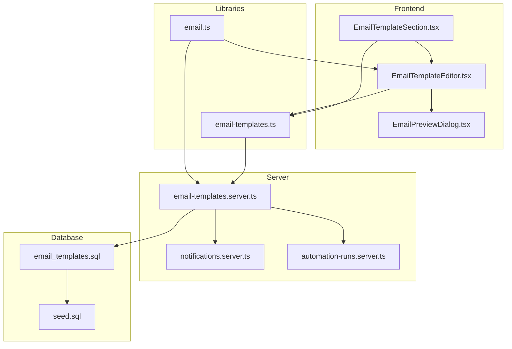
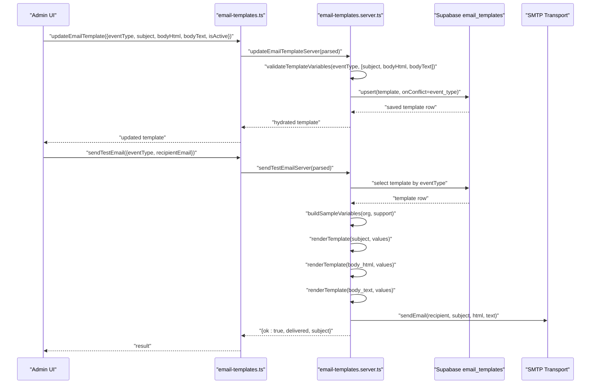
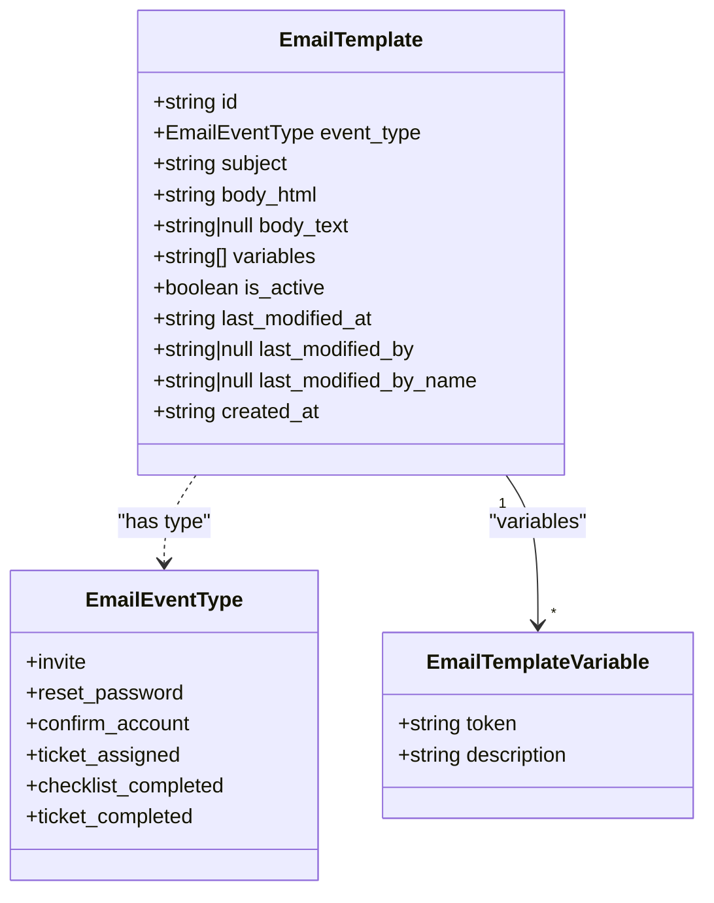
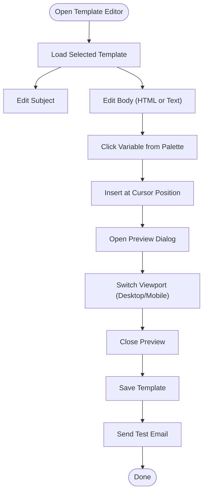
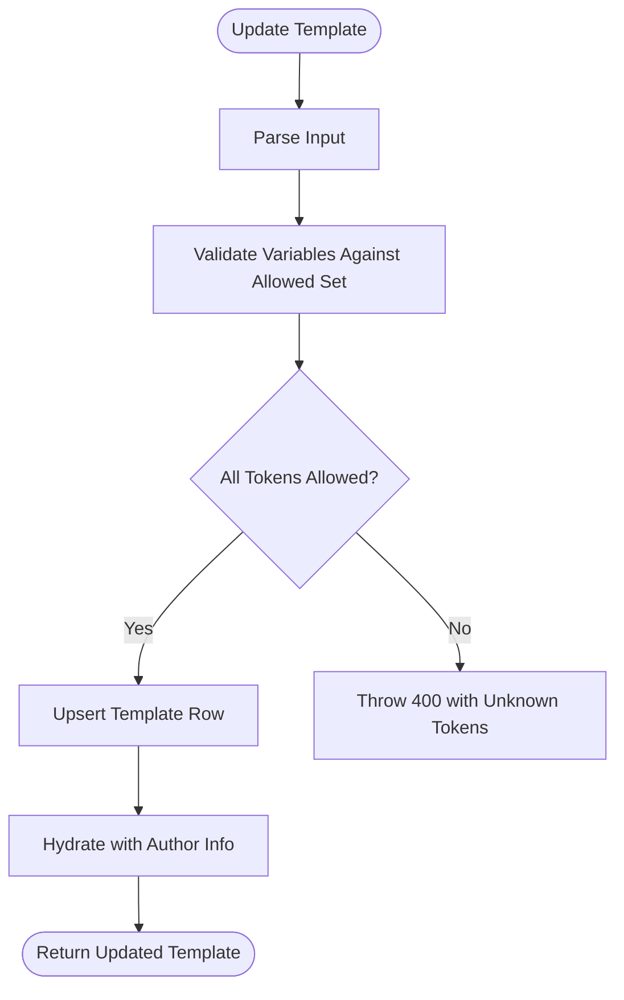
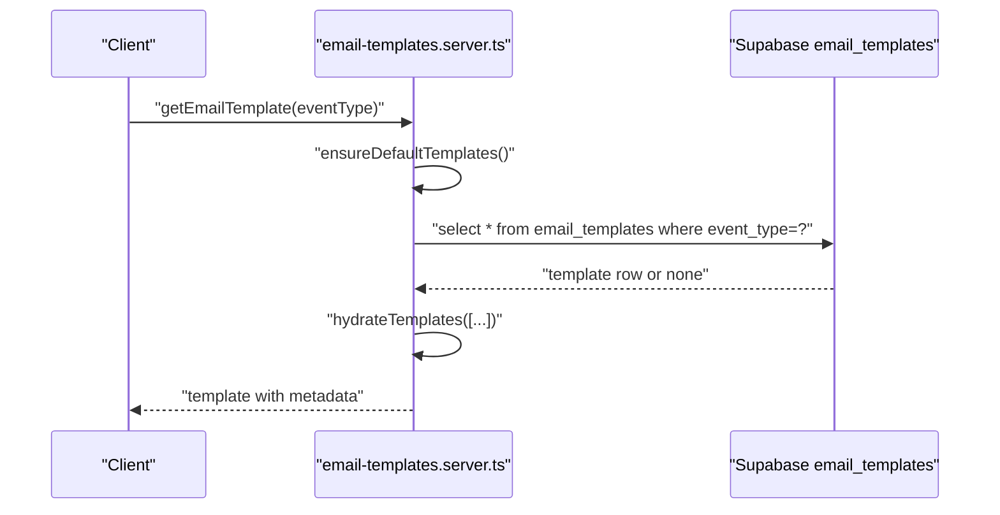
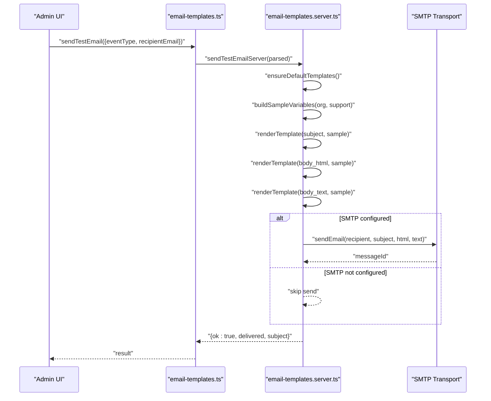
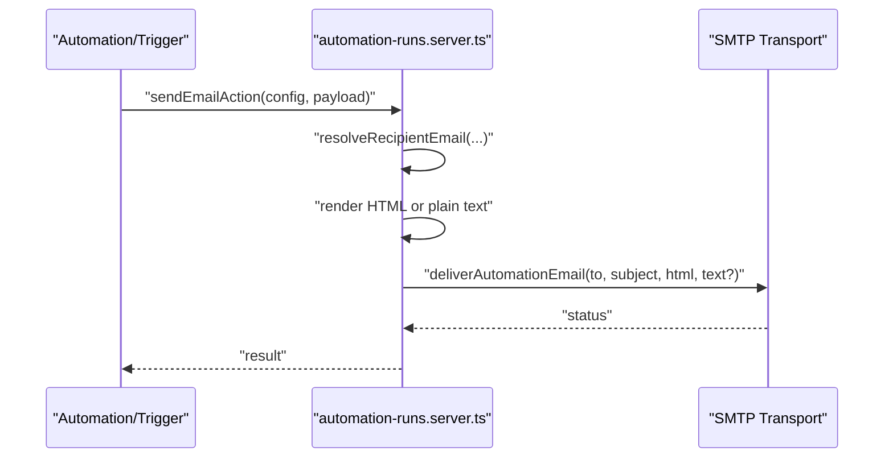
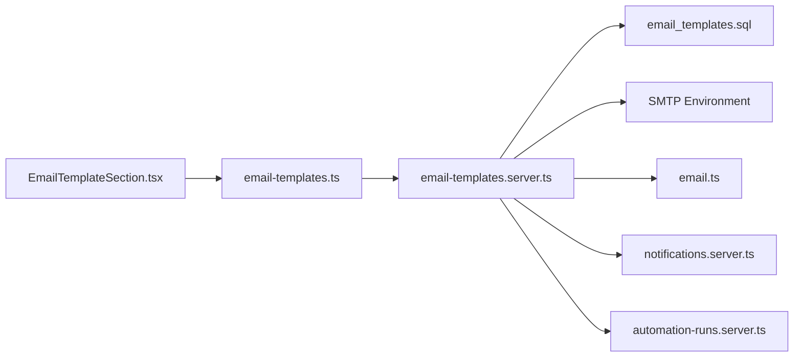

# Email Template Management

<cite>
**Referenced Files in This Document**
- [email-templates.ts](file://src/lib/email-templates.ts)
- [email-templates.server.ts](file://src/lib/email-templates.server.ts)
- [EmailTemplateEditor.tsx](file://src/components/admin/EmailTemplateEditor.tsx)
- [EmailTemplateSection.tsx](file://src/components/admin/EmailTemplateSection.tsx)
- [EmailPreviewDialog.tsx](file://src/components/admin/EmailPreviewDialog.tsx)
- [email.ts](file://src/types/email.ts)
- [email_templates.sql](file://supabase/migrations/20260507150000_email_templates.sql)
- [seed.sql](file://supabase/seed.sql)
- [notifications.ts](file://src/lib/notifications.ts)
- [notifications.server.ts](file://src/lib/notifications.server.ts)
- [automation-runs.server.ts](file://src/lib/automation-runs.server.ts)
</cite>

## Table of Contents

1. [Introduction](#introduction)
2. [Project Structure](#project-structure)
3. [Core Components](#core-components)
4. [Architecture Overview](#architecture-overview)
5. [Detailed Component Analysis](#detailed-component-analysis)
6. [Dependency Analysis](#dependency-analysis)
7. [Performance Considerations](#performance-considerations)
8. [Troubleshooting Guide](#troubleshooting-guide)
9. [Conclusion](#conclusion)
10. [Appendices](#appendices)

## Introduction

This document describes the email template management system used to define, customize, and render transactional emails. It covers template structure, supported variables, the editing interface, preview and validation, inheritance and defaults, overrides, testing, and the relationship to notification triggers. It also includes guidance for branding updates, multilingual considerations, versioning, troubleshooting, and security.

## Project Structure

The email template system spans frontend UI components, typed definitions, server-side logic, and database persistence:

- Types and constants define event types, default templates, and variables.
- Frontend editors provide a WYSIWYG-like HTML/text editor, variable insertion, preview, and test-send capabilities.
- Backend APIs manage listing, retrieval, updates, creation of defaults, resets, and test sends.
- Database stores templates per event type with metadata and variables.
- Notifications and automation integrate with templates to trigger email delivery.

**Diagram sources**

- [EmailTemplateSection.tsx:1-203](file://src/components/admin/EmailTemplateSection.tsx#L1-L203)
- [EmailTemplateEditor.tsx:1-309](file://src/components/admin/EmailTemplateEditor.tsx#L1-L309)
- [EmailPreviewDialog.tsx:1-77](file://src/components/admin/EmailPreviewDialog.tsx#L1-L77)
- [email-templates.ts:1-112](file://src/lib/email-templates.ts#L1-L112)
- [email-templates.server.ts:1-386](file://src/lib/email-templates.server.ts#L1-L386)
- [email.ts:1-130](file://src/types/email.ts#L1-L130)
- [email_templates.sql:1-89](file://supabase/migrations/20260507150000_email_templates.sql#L1-L89)
- [seed.sql:1-44](file://supabase/seed.sql#L1-L44)
- [notifications.server.ts:1-140](file://src/lib/notifications.server.ts#L1-L140)
- [automation-runs.server.ts:610-655](file://src/lib/automation-runs.server.ts#L610-L655)

**Section sources**

- [email-templates.ts:1-112](file://src/lib/email-templates.ts#L1-L112)
- [email-templates.server.ts:1-386](file://src/lib/email-templates.server.ts#L1-L386)
- [EmailTemplateEditor.tsx:1-309](file://src/components/admin/EmailTemplateEditor.tsx#L1-L309)
- [EmailTemplateSection.tsx:1-203](file://src/components/admin/EmailTemplateSection.tsx#L1-L203)
- [EmailPreviewDialog.tsx:1-77](file://src/components/admin/EmailPreviewDialog.tsx#L1-L77)
- [email.ts:1-130](file://src/types/email.ts#L1-L130)
- [email_templates.sql:1-89](file://supabase/migrations/20260507150000_email_templates.sql#L1-L89)
- [seed.sql:1-44](file://supabase/seed.sql#L1-L44)
- [notifications.server.ts:1-140](file://src/lib/notifications.server.ts#L1-L140)
- [automation-runs.server.ts:610-655](file://src/lib/automation-runs.server.ts#L610-L655)

## Core Components

- Event types and variables: Enumerated event types and a mapping of allowed variables per event.
- Default templates: Predefined HTML and text bodies plus subject lines for each event.
- Editor UI: Provides subject/body editing, variable insertion, preview, test send, and reset-to-default.
- Server APIs: Listing, fetching, updating, creating defaults, resetting, and sending test emails.
- Database schema: Stores per-event templates with subject, HTML body, optional text body, allowed variables, activation flag, and audit fields.
- Rendering engine: Variable substitution supporting both legacy and modern templates.

Key responsibilities:

- Define allowed variables and default content per event.
- Enforce variable whitelist during updates.
- Persist and hydrate templates with author metadata.
- Render previews and test emails with sample values.
- Integrate with automation and notifications to trigger email delivery.

**Section sources**

- [email.ts:1-130](file://src/types/email.ts#L1-L130)
- [email-templates.ts:1-112](file://src/lib/email-templates.ts#L1-L112)
- [email-templates.server.ts:113-386](file://src/lib/email-templates.server.ts#L113-L386)
- [email_templates.sql:1-89](file://supabase/migrations/20260507150000_email_templates.sql#L1-L89)

## Architecture Overview

The system follows a layered architecture:

- UI layer: React components for selection, editing, preview, and testing.
- Library layer: Client-side server function wrappers and rendering helpers.
- Server layer: Authentication checks, validation, database upserts, and email transport.
- Persistence layer: Supabase table with RLS policies restricting access to admins.

**Diagram sources**

- [email-templates.ts:59-85](file://src/lib/email-templates.ts#L59-L85)
- [email-templates.server.ts:147-213](file://src/lib/email-templates.server.ts#L147-L213)
- [email_templates.sql:1-89](file://supabase/migrations/20260507150000_email_templates.sql#L1-L89)

## Detailed Component Analysis

### Template Types and Variables

- Event types enumerate supported email triggers.
- Variables are grouped per event and include common tokens (organization, support email, user info) and event-specific tokens (ticket, checklist, links).
- Defaults provide initial HTML and text bodies with embedded variables.

**Diagram sources**

- [email.ts:1-26](file://src/types/email.ts#L1-L26)
- [email.ts:9-12](file://src/types/email.ts#L9-L12)
- [email.ts:94-129](file://src/types/email.ts#L94-L129)

**Section sources**

- [email.ts:1-130](file://src/types/email.ts#L1-L130)

### Template Editing Interface

The editor provides:

- Subject and dual-pane HTML/text editing.
- Active toggle to enable/disable a template.
- Variable palette with click-to-insert behavior.
- Preview dialog with desktop/mobile viewport switching.
- Test-send with configurable recipient and rate-limited execution.
- Reset-to-default with confirmation.

**Diagram sources**

- [EmailTemplateEditor.tsx:175-298](file://src/components/admin/EmailTemplateEditor.tsx#L175-L298)
- [EmailPreviewDialog.tsx:20-77](file://src/components/admin/EmailPreviewDialog.tsx#L20-L77)

**Section sources**

- [EmailTemplateEditor.tsx:1-309](file://src/components/admin/EmailTemplateEditor.tsx#L1-L309)
- [EmailPreviewDialog.tsx:1-77](file://src/components/admin/EmailPreviewDialog.tsx#L1-L77)

### Validation and Variable Whitelisting

- On update, the server validates that all variables in subject/body are allowed for the given event type.
- Unknown tokens cause a 400 response with the offending tokens listed.
- The renderer supports both modern templates and legacy templates with separate signatures.

**Diagram sources**

- [email-templates.server.ts:147-177](file://src/lib/email-templates.server.ts#L147-L177)
- [email-templates.server.ts:312-325](file://src/lib/email-templates.server.ts#L312-L325)

**Section sources**

- [email-templates.server.ts:147-177](file://src/lib/email-templates.server.ts#L147-L177)
- [email-templates.server.ts:312-325](file://src/lib/email-templates.server.ts#L312-L325)
- [email-templates.ts:87-112](file://src/lib/email-templates.ts#L87-L112)

### Template Inheritance, Defaults, and Overrides

- Defaults are seeded into the database per event type and enforced on first access.
- The server ensures defaults exist and returns hydrated templates with author metadata.
- Updates/upserts persist overrides; resets restore defaults; creating defaults inserts current default values.

**Diagram sources**

- [email-templates.server.ts:126-145](file://src/lib/email-templates.server.ts#L126-L145)
- [email-templates.server.ts:278-284](file://src/lib/email-templates.server.ts#L278-L284)
- [email-templates.server.ts:286-310](file://src/lib/email-templates.server.ts#L286-L310)

**Section sources**

- [email-templates.server.ts:126-145](file://src/lib/email-templates.server.ts#L126-L145)
- [email-templates.server.ts:278-284](file://src/lib/email-templates.server.ts#L278-L284)
- [email-templates.server.ts:286-310](file://src/lib/email-templates.server.ts#L286-L310)

### Template Testing and Preview Generation

- Test send builds sample values from organization and support settings, renders subject/body, and attempts SMTP delivery if configured.
- Preview dialog renders subject and HTML body against sample values and displays in an iframe with responsive viewport.

**Diagram sources**

- [email-templates.ts:66-71](file://src/lib/email-templates.ts#L66-L71)
- [email-templates.server.ts:179-213](file://src/lib/email-templates.server.ts#L179-L213)
- [EmailPreviewDialog.tsx:20-77](file://src/components/admin/EmailPreviewDialog.tsx#L20-L77)

**Section sources**

- [email-templates.ts:66-71](file://src/lib/email-templates.ts#L66-L71)
- [email-templates.server.ts:179-213](file://src/lib/email-templates.server.ts#L179-L213)
- [EmailPreviewDialog.tsx:20-77](file://src/components/admin/EmailPreviewDialog.tsx#L20-L77)

### Relationship Between Templates and Notification Triggers

- Notifications are generated by the notifications subsystem and stored in the database.
- Email delivery is handled by automation actions that render templates and send via SMTP.
- The automation runner resolves recipients, renders HTML/text bodies, and delivers via SMTP.

**Diagram sources**

- [automation-runs.server.ts:617-655](file://src/lib/automation-runs.server.ts#L617-L655)

**Section sources**

- [notifications.ts:1-140](file://src/lib/notifications.ts#L1-L140)
- [notifications.server.ts:1-140](file://src/lib/notifications.server.ts#L1-L140)
- [automation-runs.server.ts:617-655](file://src/lib/automation-runs.server.ts#L617-L655)

## Dependency Analysis

- UI depends on typed definitions and server functions.
- Server functions depend on Supabase client, rate limiting, and environment variables for SMTP.
- Database enforces RLS policies and constraints on event types.
- Automation and notifications are decoupled from template storage but rely on template rendering.

**Diagram sources**

- [EmailTemplateSection.tsx:1-203](file://src/components/admin/EmailTemplateSection.tsx#L1-L203)
- [email-templates.ts:1-112](file://src/lib/email-templates.ts#L1-L112)
- [email-templates.server.ts:1-386](file://src/lib/email-templates.server.ts#L1-L386)
- [email.ts:1-130](file://src/types/email.ts#L1-L130)
- [email_templates.sql:1-89](file://supabase/migrations/20260507150000_email_templates.sql#L1-L89)
- [notifications.server.ts:1-140](file://src/lib/notifications.server.ts#L1-L140)
- [automation-runs.server.ts:617-655](file://src/lib/automation-runs.server.ts#L617-L655)

**Section sources**

- [email-templates.ts:1-112](file://src/lib/email-templates.ts#L1-L112)
- [email-templates.server.ts:1-386](file://src/lib/email-templates.server.ts#L1-L386)
- [email.ts:1-130](file://src/types/email.ts#L1-L130)
- [email_templates.sql:1-89](file://supabase/migrations/20260507150000_email_templates.sql#L1-L89)
- [notifications.server.ts:1-140](file://src/lib/notifications.server.ts#L1-L140)
- [automation-runs.server.ts:617-655](file://src/lib/automation-runs.server.ts#L617-L655)

## Performance Considerations

- Variable replacement is linear in template size and number of tokens; keep templates concise.
- Rendering occurs on the server for test sends and on demand for previews; avoid excessive re-renders in the UI.
- Database upserts are keyed by event type; ensure indexes and constraints remain efficient.
- SMTP transport is synchronous; consider queuing for high-volume scenarios.

## Troubleshooting Guide

Common issues and resolutions:

- Unknown variables on save:
  - Cause: Template contains tokens not in the allowed set for the event type.
  - Resolution: Remove or replace tokens with allowed ones; refer to the variable palette.
  - Section sources
    - [email-templates.server.ts:312-325](file://src/lib/email-templates.server.ts#L312-L325)
- Test email not sent:
  - Cause: Missing SMTP configuration environment variables.
  - Resolution: Set SMTP_HOST, SMTP_USER, SMTP_PASS; optionally SMTP_PORT, SMTP_SECURE, SMTP_FROM.
  - Section sources
    - [email-templates.server.ts:70-111](file://src/lib/email-templates.server.ts#L70-L111)
    - [email-templates.server.ts:179-213](file://src/lib/email-templates.server.ts#L179-L213)
- Rate limit exceeded for test sends:
  - Cause: Exceeded configured rate limits.
  - Resolution: Wait until the window elapses or adjust limits.
  - Section sources
    - [email-templates.server.ts:179-182](file://src/lib/email-templates.server.ts#L179-L182)
- Template not found:
  - Cause: No template row for the requested event type.
  - Resolution: Create default template for the event type; defaults are ensured on first access.
  - Section sources
    - [email-templates.server.ts:126-145](file://src/lib/email-templates.server.ts#L126-L145)
    - [email-templates.server.ts:215-248](file://src/lib/email-templates.server.ts#L215-L248)
- Preview shows raw tokens:
  - Cause: Sample values not provided or mismatched tokens.
  - Resolution: Use the editor’s variable palette or ensure tokens match allowed variables.
  - Section sources
    - [EmailPreviewDialog.tsx:20-77](file://src/components/admin/EmailPreviewDialog.tsx#L20-L77)
- Security policy prevents access:
  - Cause: Non-admin user or missing admin role.
  - Resolution: Authenticate with an admin session and retry.
  - Section sources
    - [email_templates.sql:24-44](file://supabase/migrations/20260507150000_email_templates.sql#L24-L44)

## Conclusion

The email template management system provides a robust, extensible framework for defining, editing, validating, and delivering transactional emails. It enforces variable safety, supports previews and tests, and integrates with automation and notifications. Administrators can tailor templates per event while maintaining strong defaults and governance via database policies.

## Appendices

### Template Creation and Override Examples

- Create default template for an event type:
  - Action: Call create default endpoint; inserts current default values if none exist.
  - Section sources
    - [email-templates.server.ts:215-248](file://src/lib/email-templates.server.ts#L215-L248)
- Reset template to default:
  - Action: Call reset endpoint; restores default subject/body and allowed variables.
  - Section sources
    - [email-templates.server.ts:250-276](file://src/lib/email-templates.server.ts#L250-L276)
- Update template:
  - Action: Call update endpoint; validates variables and persists overrides.
  - Section sources
    - [email-templates.server.ts:147-177](file://src/lib/email-templates.server.ts#L147-L177)

### Localization Support

- Current implementation embeds localized strings in default templates and sample values.
- To support multiple languages:
  - Maintain multiple event types per locale or store localized variants alongside a base event type.
  - Adjust sample values and default templates per locale.
  - Ensure variable tokens remain consistent across locales.

### Security Considerations

- Variable whitelisting prevents injection of unauthorized tokens.
- RLS policies restrict template access to authenticated users with admin roles.
- SMTP credentials are loaded from environment variables; restrict access to deployment environments.
- Avoid embedding sensitive data in templates; use tokens and controlled sample values for previews.
