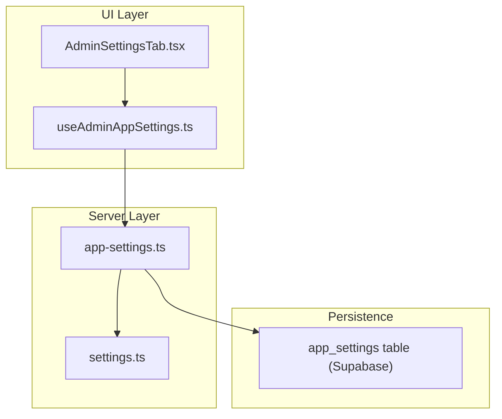
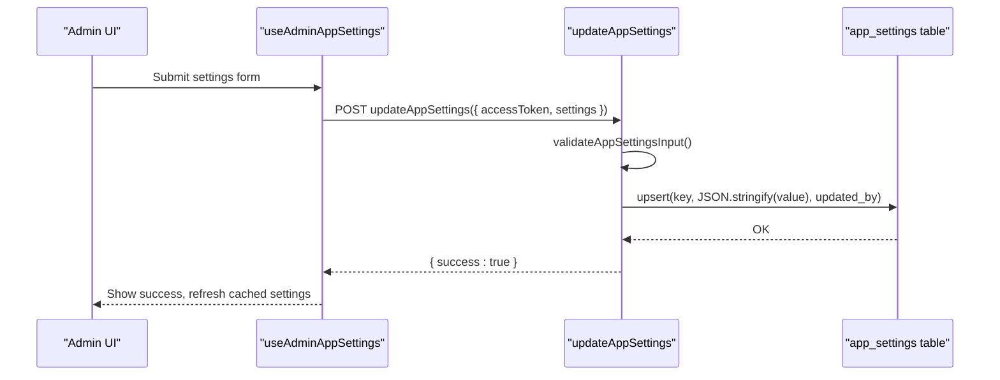
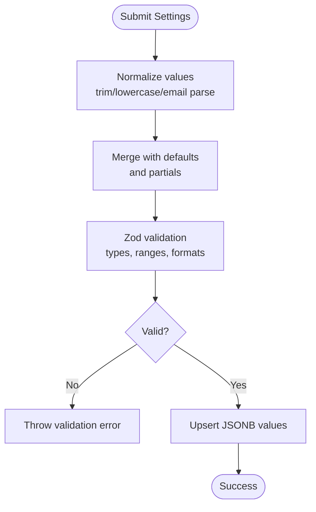
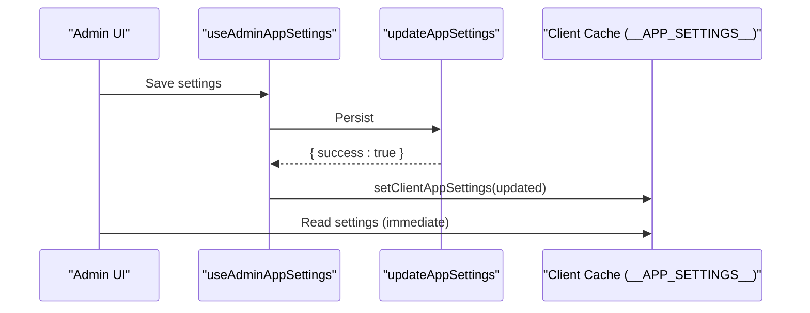
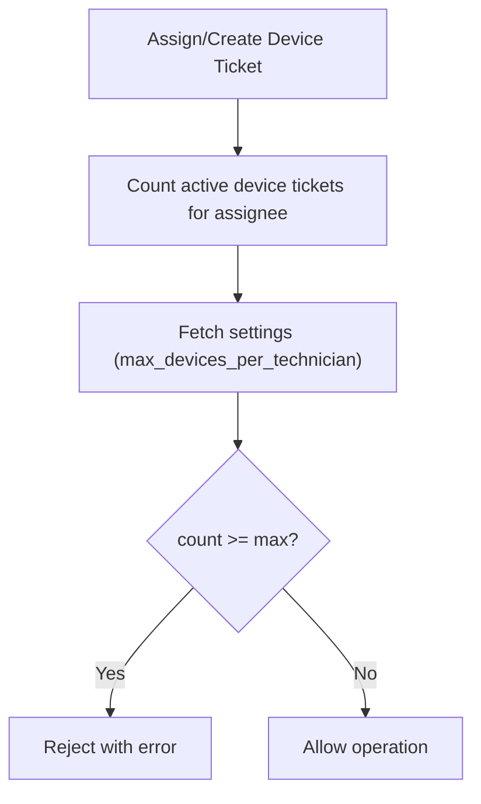
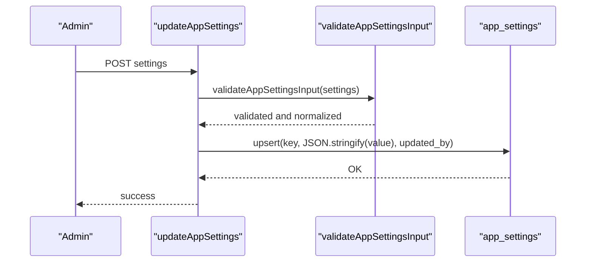
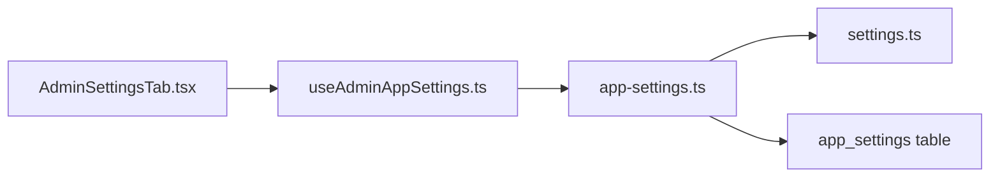

# System Settings Configuration

<cite>
**Referenced Files in This Document**
- [settings.ts](file://lib/schemas/settings.ts)
- [app-settings.ts](file://src/lib/app-settings.ts)
- [AdminSettingsTab.tsx](file://src/components/admin/AdminSettingsTab.tsx)
- [useAdminAppSettings.ts](file://src/hooks/useAdminAppSettings.ts)
- [app-settings.sql](file://supabase/migrations/20260504120000_app_settings.sql)
- [user_profiles_email_notification_preferences.sql](file://supabase/migrations/20260512152600_user_profiles_email_notification_preferences.sql)
- [notifications.ts](file://src/lib/notifications.ts)
- [admin-constants.ts](file://src/lib/admin/admin-constants.ts)
- [app-settings.test.ts](file://src/__tests__/app-settings.test.ts)
- [BACKUP.md](file://docs/BACKUP.md)
</cite>

## Table of Contents
1. [Introduction](#introduction)
2. [Project Structure](#project-structure)
3. [Core Components](#core-components)
4. [Architecture Overview](#architecture-overview)
5. [Detailed Component Analysis](#detailed-component-analysis)
6. [Dependency Analysis](#dependency-analysis)
7. [Performance Considerations](#performance-considerations)
8. [Troubleshooting Guide](#troubleshooting-guide)
9. [Conclusion](#conclusion)
10. [Appendices](#appendices)

## Introduction
This document explains the system settings configuration module that powers global application behavior in PCReady. It covers the settings architecture, categories (workflow preferences, notification-related user preferences, and operational limits), validation rules, persistence, and how settings influence automation and user workflows. It also documents update mechanisms, real-time propagation via client caching, backup and restore procedures, and troubleshooting guidance.

## Project Structure
The settings system spans three layers:
- Schema layer: Zod schemas define validation and normalization for settings inputs.
- Server layer: TanStack server functions fetch, validate, persist, and expose settings with role-based access control.
- UI layer: Admin settings tab renders forms, integrates with server functions, and caches settings client-side.

**Diagram sources**
- [AdminSettingsTab.tsx:15-330](file://src/components/admin/AdminSettingsTab.tsx#L15-L330)
- [useAdminAppSettings.ts:13-156](file://src/hooks/useAdminAppSettings.ts#L13-L156)
- [app-settings.ts:1-263](file://src/lib/app-settings.ts#L1-L263)
- [settings.ts:1-19](file://lib/schemas/settings.ts#L1-L19)
- [app-settings.sql:1-41](file://supabase/migrations/20260504120000_app_settings.sql#L1-L41)

**Section sources**
- [AdminSettingsTab.tsx:15-330](file://src/components/admin/AdminSettingsTab.tsx#L15-L330)
- [useAdminAppSettings.ts:13-156](file://src/hooks/useAdminAppSettings.ts#L13-L156)
- [app-settings.ts:1-263](file://src/lib/app-settings.ts#L1-L263)
- [settings.ts:1-19](file://lib/schemas/settings.ts#L1-L19)
- [app-settings.sql:1-41](file://supabase/migrations/20260504120000_app_settings.sql#L1-L41)

## Core Components
- Settings data model and defaults: The server defines a comprehensive AppSettings type with defaults and merges persisted values from the database.
- Validation and normalization: Zod schemas validate and normalize inputs, including email formatting, numeric ranges, and structured lists.
- Access control: Settings are readable/writable only by administrators via Supabase Row Level Security policies.
- Persistence: Settings are stored as JSONB values keyed by string identifiers in a single table.
- Client caching: Settings are cached in memory on the client for fast reads after initial load.

Key responsibilities:
- Fetch settings for admin editing and for public consumption.
- Validate and normalize updates before persisting.
- Enforce operational limits (e.g., technician device caps) using settings.
- Expose Kanban WIP limits and archival policy to UI.

**Section sources**
- [app-settings.ts:18-44](file://src/lib/app-settings.ts#L18-L44)
- [app-settings.ts:59-100](file://src/lib/app-settings.ts#L59-L100)
- [app-settings.ts:192-212](file://src/lib/app-settings.ts#L192-L212)
- [app-settings.ts:214-229](file://src/lib/app-settings.ts#L214-L229)
- [app-settings.ts:231-262](file://src/lib/app-settings.ts#L231-L262)

## Architecture Overview
The settings architecture follows a layered pattern with explicit separation of concerns:
- UI triggers updates via a server function.
- Server validates inputs against Zod schemas and persists normalized values.
- Client caches settings for immediate reads.
- Operational logic (e.g., device assignment) queries settings at runtime to enforce constraints.

**Diagram sources**
- [useAdminAppSettings.ts:89-122](file://src/hooks/useAdminAppSettings.ts#L89-L122)
- [app-settings.ts:192-212](file://src/lib/app-settings.ts#L192-L212)
- [app-settings.sql:1-41](file://supabase/migrations/20260504120000_app_settings.sql#L1-L41)

## Detailed Component Analysis

### Settings Categories and Fields
The system maintains the following categories and fields:

- General organization settings
  - organization_name: string, required
  - default_timezone: string, required
  - support_email: string, optional, validated as email, normalized to lowercase and trimmed
  - self_registration_enabled: boolean
  - admin_approval_required: boolean

- Operational lists (used in forms and workflows)
  - os_options: array of non-empty trimmed strings
  - device_brands: array of non-empty trimmed strings
  - ticket_categories: array of non-empty trimmed strings

- Workflow preferences
  - max_devices_per_technician: integer, 1–100
  - wip_limits: per-status integer limits (0–999)
  - archive_after_days: integer, 0–365

Defaults are defined centrally and merged with persisted values during retrieval.

**Section sources**
- [app-settings.ts:32-44](file://src/lib/app-settings.ts#L32-L44)
- [app-settings.ts:48-58](file://src/lib/app-settings.ts#L48-L58)
- [app-settings.ts:231-262](file://src/lib/app-settings.ts#L231-L262)
- [settings.ts:4-16](file://lib/schemas/settings.ts#L4-L16)

### Validation Rules and Normalization
Validation occurs in two places:
- Client-side form validation using a schema tailored for admin editing.
- Server-side validation for persistence, ensuring robustness and enforcing stricter constraints.

Normalization includes:
- Email trimming and lowercasing.
- Numeric parsing and bounds checking.
- JSON serialization for persistence.
- Merging partial updates with defaults.

**Diagram sources**
- [useAdminAppSettings.ts:89-122](file://src/hooks/useAdminAppSettings.ts#L89-L122)
- [app-settings.ts:231-262](file://src/lib/app-settings.ts#L231-L262)
- [app-settings.ts:192-212](file://src/lib/app-settings.ts#L192-L212)

**Section sources**
- [settings.ts:4-16](file://lib/schemas/settings.ts#L4-L16)
- [app-settings.ts:231-262](file://src/lib/app-settings.ts#L231-L262)
- [app-settings.test.ts:26-49](file://src/__tests__/app-settings.test.ts#L26-L49)

### Settings Retrieval and Exposure
There are multiple retrieval endpoints:
- Admin-only settings: fetches all keys for editing.
- Public settings: restricted set for non-admin contexts.
- Kanban settings: WIP limits and archival policy for UI rendering.
- Support contact: dedicated endpoint returning normalized support_email.

These functions merge persisted rows with defaults, parse JSON values safely, and apply schema validation where appropriate.

**Section sources**
- [app-settings.ts:59-100](file://src/lib/app-settings.ts#L59-L100)
- [app-settings.ts:168-190](file://src/lib/app-settings.ts#L168-L190)
- [app-settings.ts:102-122](file://src/lib/app-settings.ts#L102-L122)

### Real-time Propagation and Client Caching
After successful updates, the UI layer updates the client-side cache and shows success feedback. Subsequent reads benefit from local cache, reducing latency and database load.

**Diagram sources**
- [useAdminAppSettings.ts:114-116](file://src/hooks/useAdminAppSettings.ts#L114-L116)
- [app-settings.ts:125-135](file://src/lib/app-settings.ts#L125-L135)

**Section sources**
- [app-settings.ts:125-135](file://src/lib/app-settings.ts#L125-L135)
- [useAdminAppSettings.ts:114-116](file://src/hooks/useAdminAppSettings.ts#L114-L116)

### Relationship Between Settings and System Behavior
- Technician device cap enforcement: The server counts active device tickets for an assignee and compares against max_devices_per_technician, preventing over-assignment.
- Kanban WIP limits: Used by Kanban views to constrain work-in-progress per status.
- Archival policy: Controls automatic archival delay after completion.
- Registration workflow: self_registration_enabled and admin_approval_required govern user onboarding behavior.

**Diagram sources**
- [app-settings.ts:141-166](file://src/lib/app-settings.ts#L141-L166)

**Section sources**
- [app-settings.ts:141-166](file://src/lib/app-settings.ts#L141-L166)
- [app-settings.ts:168-190](file://src/lib/app-settings.ts#L168-L190)

### Settings Update Mechanisms
- Endpoint: updateAppSettings accepts an access token and a settings payload.
- Validation: validateAppSettingsInput merges with defaults, normalizes values, and enforces strict constraints.
- Persistence: Upserts settings by key with JSONB serialization and tracks who updated them.

**Diagram sources**
- [app-settings.ts:192-212](file://src/lib/app-settings.ts#L192-L212)
- [app-settings.ts:231-262](file://src/lib/app-settings.ts#L231-L262)

**Section sources**
- [app-settings.ts:192-212](file://src/lib/app-settings.ts#L192-L212)
- [app-settings.ts:231-262](file://src/lib/app-settings.ts#L231-L262)

### Examples of Settings Modifications
- Enabling self-registration: Set self_registration_enabled to true; combined with admin_approval_required to control approval workflow.
- Setting WIP limits: Adjust wip_limits per status (e.g., in-progress, testing) to control queue sizes.
- Customizing lists: Populate os_options, device_brands, and ticket_categories to match organizational taxonomy.
- Device cap: Increase max_devices_per_technician to allow more concurrent device tickets per technician.

Note: These examples describe intended behaviors; refer to the UI and server functions for precise field names and constraints.

**Section sources**
- [AdminSettingsTab.tsx:224-272](file://src/components/admin/AdminSettingsTab.tsx#L224-L272)
- [app-settings.ts:9-16](file://src/lib/app-settings.ts#L9-L16)
- [app-settings.ts:32-44](file://src/lib/app-settings.ts#L32-L44)

### Configuration Persistence
Settings are persisted in a single table with:
- key: text identifier
- value: JSONB value
- updated_at: timestamptz
- updated_by: UUID reference to the updating user

RLS policies restrict reads and writes to administrators.

**Section sources**
- [app-settings.sql:1-41](file://supabase/migrations/20260504120000_app_settings.sql#L1-L41)

### Notification Preferences
While not part of the global AppSettings, user-level notification preferences are stored in user_profiles and influence how users receive alerts. These preferences complement system settings by controlling personal alert behavior.

**Section sources**
- [user_profiles_email_notification_preferences.sql:1-11](file://supabase/migrations/20260512152600_user_profiles_email_notification_preferences.sql#L1-L11)
- [notifications.ts:6-18](file://src/lib/notifications.ts#L6-L18)

## Dependency Analysis
The settings module depends on:
- Zod for validation and normalization.
- Supabase for secure, RLS-enforced persistence.
- TanStack React Start server functions for typed server-client communication.
- UI hooks/forms for admin editing and caching.

**Diagram sources**
- [AdminSettingsTab.tsx:15-330](file://src/components/admin/AdminSettingsTab.tsx#L15-L330)
- [useAdminAppSettings.ts:13-156](file://src/hooks/useAdminAppSettings.ts#L13-L156)
- [app-settings.ts:1-263](file://src/lib/app-settings.ts#L1-L263)
- [settings.ts:1-19](file://lib/schemas/settings.ts#L1-L19)
- [app-settings.sql:1-41](file://supabase/migrations/20260504120000_app_settings.sql#L1-L41)

**Section sources**
- [app-settings.ts:1-263](file://src/lib/app-settings.ts#L1-L263)
- [settings.ts:1-19](file://lib/schemas/settings.ts#L1-L19)
- [app-settings.sql:1-41](file://supabase/migrations/20260504120000_app_settings.sql#L1-L41)

## Performance Considerations
- Client caching reduces repeated network requests for settings.
- Batch upsert minimizes write operations when saving multiple fields.
- Validation happens on the server to prevent malformed data and reduce UI retries.
- Use the public settings endpoint for non-admin UI to avoid unnecessary data transfer.

## Troubleshooting Guide
Common issues and resolutions:
- Validation errors on save
  - Cause: Invalid email format, out-of-range numbers, or empty required fields.
  - Resolution: Correct values according to schema constraints; see tests for expected normalization.
- Device assignment blocked
  - Cause: Active device tickets equal or exceed max_devices_per_technician.
  - Resolution: Reduce current workload or increase the limit.
- Unexpected WIP limits
  - Cause: Partial updates or invalid JSON values.
  - Resolution: Re-save WIP limits using the admin UI; ensure values are integers within allowed ranges.
- Public settings missing
  - Cause: Using public endpoint without proper authentication or keys not included in the restricted list.
  - Resolution: Verify access token and confirm keys are in the allowed set.

**Section sources**
- [app-settings.test.ts:51-74](file://src/__tests__/app-settings.test.ts#L51-L74)
- [app-settings.ts:141-166](file://src/lib/app-settings.ts#L141-L166)
- [app-settings.ts:168-190](file://src/lib/app-settings.ts#L168-L190)
- [app-settings.ts:71-100](file://src/lib/app-settings.ts#L71-L100)

## Conclusion
The settings configuration module provides a robust, validated, and securely persisted mechanism for governing global application behavior. Administrators can tailor workflow preferences, operational limits, and system lists through a guided UI, with immediate client-side propagation and strong validation guarantees. Integration with Kanban, registration workflows, and device assignment ensures settings directly impact day-to-day operations.

## Appendices

### Settings Backup and Restore Procedures
- Automated backups are managed by the Supabase provider with daily snapshots and retention depending on the plan.
- Manual exports are available from the Admin UI under Backup & Disaster Recovery.
- Emergency contact for restoration is taken from support_email in AppSettings.

**Section sources**
- [BACKUP.md:1-73](file://docs/BACKUP.md#L1-L73)
- [app-settings.ts:102-122](file://src/lib/app-settings.ts#L102-L122)

### Settings Categories Reference
- General organization settings: organization_name, default_timezone, support_email, self_registration_enabled, admin_approval_required
- Operational lists: os_options, device_brands, ticket_categories
- Workflow preferences: max_devices_per_technician, wip_limits, archive_after_days

**Section sources**
- [app-settings.ts:18-30](file://src/lib/app-settings.ts#L18-L30)
- [app-settings.ts:32-44](file://src/lib/app-settings.ts#L32-L44)
- [settings.ts:4-16](file://lib/schemas/settings.ts#L4-L16)