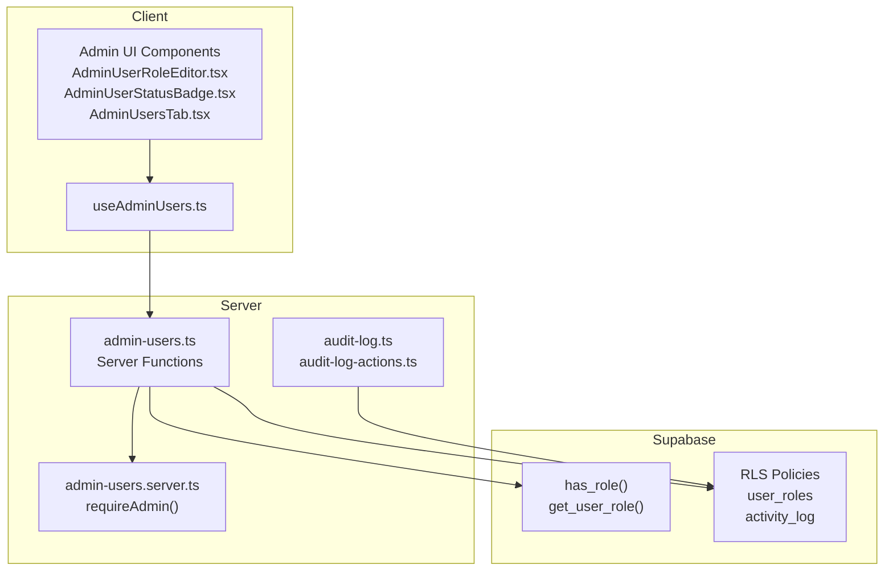
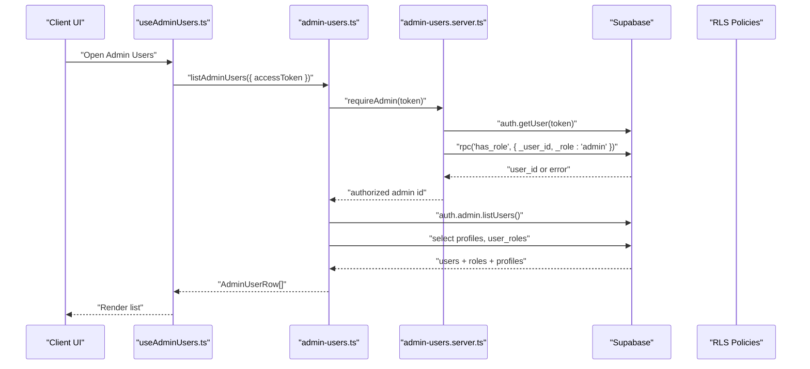
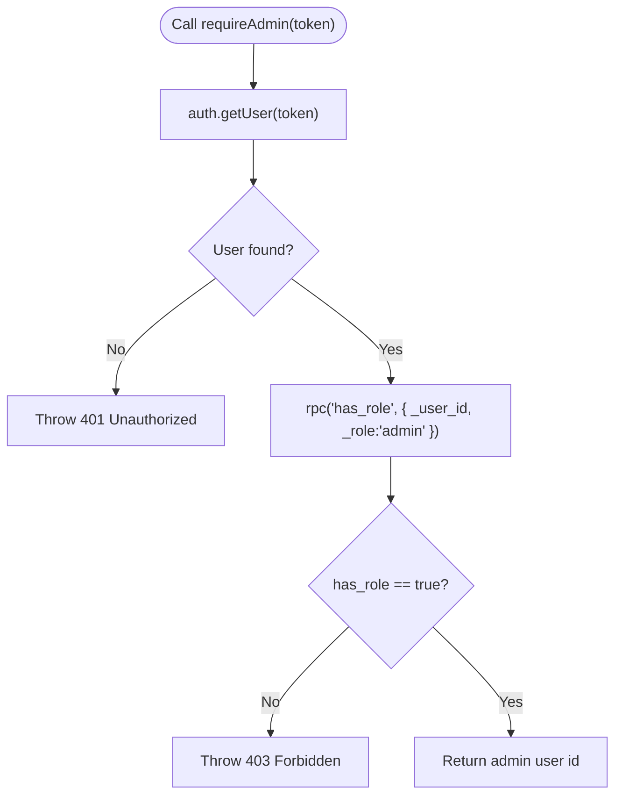
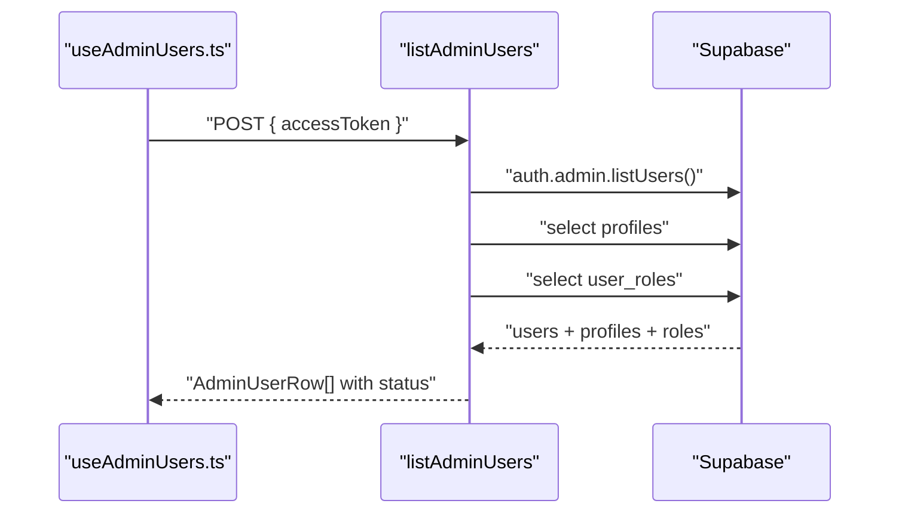
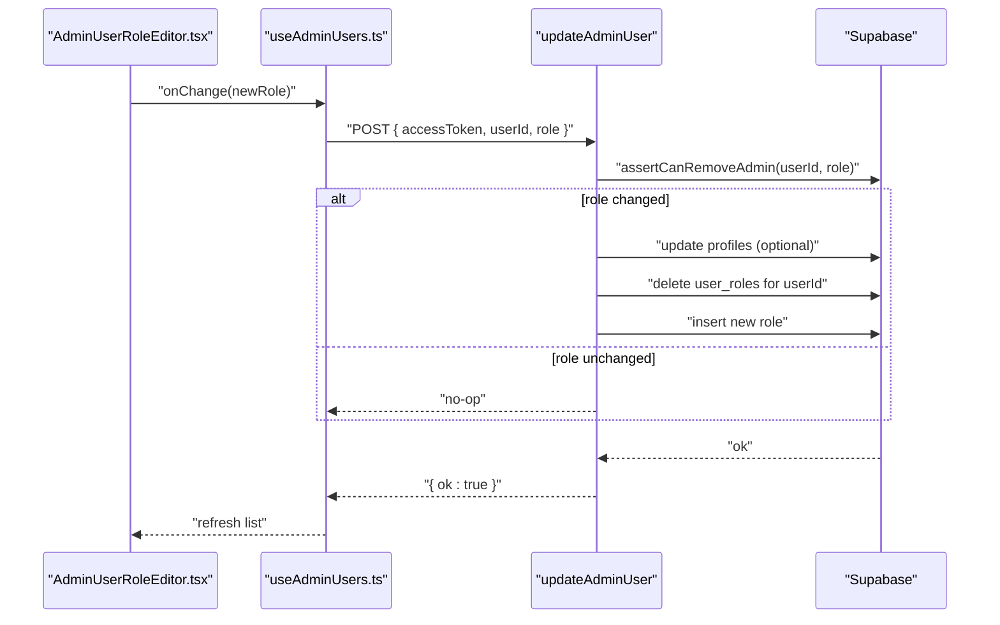
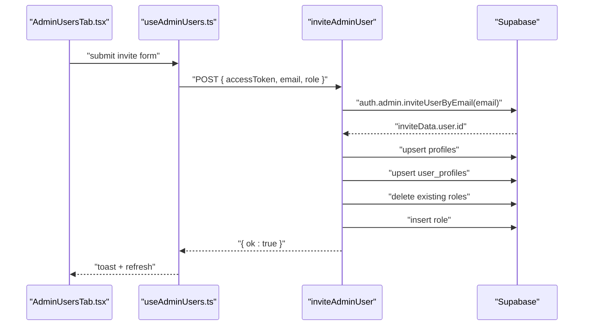
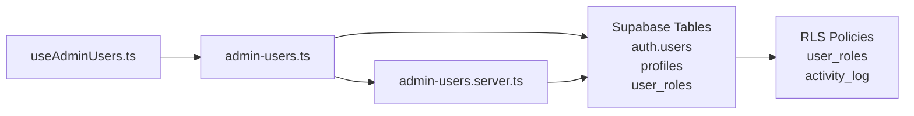

# User Role Management

<cite>
**Referenced Files in This Document**
- [admin-users.server.ts](file://src/lib/admin-users.server.ts)
- [admin-users.ts](file://src/lib/admin-users.ts)
- [AdminUserRoleEditor.tsx](file://src/components/admin/AdminUserRoleEditor.tsx)
- [useAdminUsers.ts](file://src/hooks/useAdminUsers.ts)
- [admin-constants.ts](file://src/lib/admin/admin-constants.ts)
- [AdminUserStatusBadge.tsx](file://src/components/admin/AdminUserStatusBadge.tsx)
- [AdminUsersTab.tsx](file://src/components/admin/AdminUsersTab.tsx)
- [audit-log.ts](file://src/lib/audit-log.ts)
- [audit-log-actions.ts](file://src/lib/audit-log-actions.ts)
- [20260429202127_cd9e1421-24c9-40f3-9ac6-9e2259cbb2af.sql](file://supabase/migrations/20260429202127_cd9e1421-24c9-40f3-9ac6-9e2259cbb2af.sql)
- [20260429202148_94cb6d44-ee0c-44f3-a6fb-d5a0e028031e.sql](file://supabase/migrations/20260429202148_94cb6d44-ee0c-44f3-a6fb-d5a0e028031e.sql)
- [20260507133000_automation_run_logs.sql](file://supabase/migrations/20260507133000_automation_run_logs.sql)
</cite>

## Table of Contents
1. [Introduction](#introduction)
2. [Project Structure](#project-structure)
3. [Core Components](#core-components)
4. [Architecture Overview](#architecture-overview)
5. [Detailed Component Analysis](#detailed-component-analysis)
6. [Dependency Analysis](#dependency-analysis)
7. [Performance Considerations](#performance-considerations)
8. [Troubleshooting Guide](#troubleshooting-guide)
9. [Conclusion](#conclusion)
10. [Appendices](#appendices)

## Introduction
This document describes the user role management system, covering the three roles (admin, tech, viewer), their permissions and capabilities, role assignment and modification workflows, user invitation and onboarding, status management (active, disabled, invited), and server-side authorization. It also documents anti-rollback protections against removing the last admin, bulk operations, permission troubleshooting, security considerations, and audit trail integration for role changes.

## Project Structure
The role management system spans server-side functions, client-side UI hooks, and Supabase RLS policies. Key areas:
- Server-side authorization and role operations
- Client-side forms and UI editors for roles and statuses
- Supabase functions and policies governing access
- Audit logging for administrative actions

**Diagram sources**
- [admin-users.ts:88-135](file://src/lib/admin-users.ts#L88-L135)
- [admin-users.server.ts:3-17](file://src/lib/admin-users.server.ts#L3-L17)
- [AdminUserRoleEditor.tsx:1-70](file://src/components/admin/AdminUserRoleEditor.tsx#L1-L70)
- [AdminUserStatusBadge.tsx:1-63](file://src/components/admin/AdminUserStatusBadge.tsx#L1-L63)
- [AdminUsersTab.tsx:352-379](file://src/components/admin/AdminUsersTab.tsx#L352-L379)
- [audit-log.ts:23-107](file://src/lib/audit-log.ts#L23-L107)
- [20260429202127_cd9e1421-24c9-40f3-9ac6-9e2259cbb2af.sql:82-124](file://supabase/migrations/20260429202127_cd9e1421-24c9-40f3-9ac6-9e2259cbb2af.sql#L82-L124)
- [20260429202148_94cb6d44-ee0c-44f3-a6fb-d5a0e028031e.sql:30-38](file://supabase/migrations/20260429202148_94cb6d44-ee0c-44f3-a6fb-d5a0e028031e.sql#L30-L38)

**Section sources**
- [admin-users.ts:88-135](file://src/lib/admin-users.ts#L88-L135)
- [admin-users.server.ts:3-17](file://src/lib/admin-users.server.ts#L3-L17)
- [AdminUserRoleEditor.tsx:1-70](file://src/components/admin/AdminUserRoleEditor.tsx#L1-L70)
- [AdminUserStatusBadge.tsx:1-63](file://src/components/admin/AdminUserStatusBadge.tsx#L1-L63)
- [AdminUsersTab.tsx:352-379](file://src/components/admin/AdminUsersTab.tsx#L352-L379)
- [audit-log.ts:23-107](file://src/lib/audit-log.ts#L23-L107)
- [20260429202127_cd9e1421-24c9-40f3-9ac6-9e2259cbb2af.sql:82-124](file://supabase/migrations/20260429202127_cd9e1421-24c9-40f3-9ac6-9e2259cbb2af.sql#L82-L124)
- [20260429202148_94cb6d44-ee0c-44f3-a6fb-d5a0e028031e.sql:30-38](file://supabase/migrations/20260429202148_94cb6d44-ee0c-44f3-a6fb-d5a0e028031e.sql#L30-L38)

## Core Components
- Role types and constants
  - Roles: admin, tech, viewer
  - Validation and labels for roles
- Authorization
  - requireAdmin middleware validates access tokens and enforces admin-only access via has_role RPC
- Role operations
  - List users with computed status and role
  - Update user role with anti-rollback protection
  - Invite users with rate limiting and role assignment
  - Resend invitations for invited users
  - Disable/enable users and delete users with safeguards
- UI integration
  - Role editor component and status badge
  - Hook orchestrating client-server interactions

**Section sources**
- [admin-constants.ts:3-23](file://src/lib/admin/admin-constants.ts#L3-L23)
- [admin-users.server.ts:3-17](file://src/lib/admin-users.server.ts#L3-L17)
- [admin-users.ts:53-86](file://src/lib/admin-users.ts#L53-L86)
- [admin-users.ts:88-135](file://src/lib/admin-users.ts#L88-L135)
- [admin-users.ts:137-167](file://src/lib/admin-users.ts#L137-L167)
- [admin-users.ts:169-225](file://src/lib/admin-users.ts#L169-L225)
- [admin-users.ts:227-248](file://src/lib/admin-users.ts#L227-L248)
- [admin-users.ts:250-278](file://src/lib/admin-users.ts#L250-L278)
- [AdminUserRoleEditor.tsx:1-70](file://src/components/admin/AdminUserRoleEditor.tsx#L1-L70)
- [AdminUserStatusBadge.tsx:1-63](file://src/components/admin/AdminUserStatusBadge.tsx#L1-L63)
- [useAdminUsers.ts:19-212](file://src/hooks/useAdminUsers.ts#L19-L212)

## Architecture Overview
The system enforces admin-only access for sensitive operations and computes user status from Supabase auth and profile data. Role assignments are stored in a dedicated table protected by RLS policies.

**Diagram sources**
- [useAdminUsers.ts:51-62](file://src/hooks/useAdminUsers.ts#L51-L62)
- [admin-users.ts:88-135](file://src/lib/admin-users.ts#L88-L135)
- [admin-users.server.ts:3-17](file://src/lib/admin-users.server.ts#L3-L17)
- [20260429202127_cd9e1421-24c9-40f3-9ac6-9e2259cbb2af.sql:82-124](file://supabase/migrations/20260429202127_cd9e1421-24c9-40f3-9ac6-9e2259cbb2af.sql#L82-L124)

## Detailed Component Analysis

### Roles and Permissions
- Role types
  - admin: full administrative control
  - tech: technician access (e.g., automation logs visibility)
  - viewer: read-only access
- Role validation and labeling
  - Constants define allowed roles and labels
  - UI components render role badges and selection

**Section sources**
- [admin-constants.ts:3-23](file://src/lib/admin/admin-constants.ts#L3-L23)
- [AdminUserRoleEditor.tsx:18-27](file://src/components/admin/AdminUserRoleEditor.tsx#L18-L27)
- [AdminUserRoleEditor.tsx:59-65](file://src/components/admin/AdminUserRoleEditor.tsx#L59-L65)

### Authorization and requireAdmin Middleware
- Validates access token and confirms admin role via RPC
- Returns the admin user identifier for downstream checks

**Diagram sources**
- [admin-users.server.ts:3-17](file://src/lib/admin-users.server.ts#L3-L17)

**Section sources**
- [admin-users.server.ts:3-17](file://src/lib/admin-users.server.ts#L3-L17)

### User Listing and Status Computation
- Lists users via Supabase admin client
- Joins profiles and user_roles to compute role and status
- Status logic:
  - invited: email not confirmed
  - disabled: temporarily banned
  - active: otherwise

**Diagram sources**
- [admin-users.ts:88-135](file://src/lib/admin-users.ts#L88-L135)

**Section sources**
- [admin-users.ts:88-135](file://src/lib/admin-users.ts#L88-L135)
- [AdminUserStatusBadge.tsx:25-62](file://src/components/admin/AdminUserStatusBadge.tsx#L25-L62)

### Role Assignment and Modification
- Update role
  - Validates role input
  - Anti-rollback: prevents removal of the last admin
  - Updates profile full_name and initials if provided
  - Deletes existing roles and inserts new role atomically
- UI integration
  - Role editor triggers saveRole which calls updateAdminUser

**Diagram sources**
- [admin-users.ts:137-167](file://src/lib/admin-users.ts#L137-L167)
- [admin-users.ts:69-86](file://src/lib/admin-users.ts#L69-L86)
- [AdminUserRoleEditor.tsx:48-66](file://src/components/admin/AdminUserRoleEditor.tsx#L48-L66)
- [useAdminUsers.ts:77-97](file://src/hooks/useAdminUsers.ts#L77-L97)

**Section sources**
- [admin-users.ts:137-167](file://src/lib/admin-users.ts#L137-L167)
- [admin-users.ts:69-86](file://src/lib/admin-users.ts#L69-L86)
- [AdminUserRoleEditor.tsx:48-66](file://src/components/admin/AdminUserRoleEditor.tsx#L48-L66)
- [useAdminUsers.ts:77-97](file://src/hooks/useAdminUsers.ts#L77-L97)

### User Invitation Workflow
- Validates role and email
- Invites user via Supabase auth admin
- Upserts profile and user_profiles
- Assigns initial role and notifies admins

**Diagram sources**
- [admin-users.ts:169-225](file://src/lib/admin-users.ts#L169-L225)
- [useAdminUsers.ts:153-174](file://src/hooks/useAdminUsers.ts#L153-L174)
- [AdminUsersTab.tsx:352-379](file://src/components/admin/AdminUsersTab.tsx#L352-L379)

**Section sources**
- [admin-users.ts:169-225](file://src/lib/admin-users.ts#L169-L225)
- [useAdminUsers.ts:153-174](file://src/hooks/useAdminUsers.ts#L153-L174)
- [AdminUsersTab.tsx:352-379](file://src/components/admin/AdminUsersTab.tsx#L352-L379)

### Resending Invitations
- Confirms user exists and is in invited state
- Re-sends invitation with redirect URL

**Section sources**
- [admin-users.ts:227-248](file://src/lib/admin-users.ts#L227-L248)
- [useAdminUsers.ts:114-132](file://src/hooks/useAdminUsers.ts#L114-L132)

### User Status Management (Active, Disabled, Invited)
- Status computation and badge rendering
- Disable/enable toggles via setAdminUserDisabled
- Anti-rollback: prevents self-disable and removal of last admin when downgrading

**Section sources**
- [admin-users.ts:250-264](file://src/lib/admin-users.ts#L250-L264)
- [AdminUserStatusBadge.tsx:14-63](file://src/components/admin/AdminUserStatusBadge.tsx#L14-L63)
- [AdminUsersTab.tsx:352-379](file://src/components/admin/AdminUsersTab.tsx#L352-L379)

### Anti-Rollback Mechanism
- Prevents removal of the last admin during role updates or disables
- Enforced by asserting admin count before modifications

**Section sources**
- [admin-users.ts:69-86](file://src/lib/admin-users.ts#L69-L86)

### Bulk Operations
- Filtering and selection handled in hook
- Bulk actions supported for disable/enable and role changes
- UI exposes bulk confirm flow

**Section sources**
- [useAdminUsers.ts:68-75](file://src/hooks/useAdminUsers.ts#L68-L75)
- [useAdminUsers.ts:19-212](file://src/hooks/useAdminUsers.ts#L19-L212)

### Permission Enforcement and RLS
- has_role RPC determines admin capability
- RLS policies on user_roles:
  - Users can read their own roles
  - Admins can read all roles
  - Admins can manage roles (ALL operations)
- Additional RLS allows tech access to automation run logs

**Section sources**
- [20260429202127_cd9e1421-24c9-40f3-9ac6-9e2259cbb2af.sql:82-124](file://supabase/migrations/20260429202127_cd9e1421-24c9-40f3-9ac6-9e2259cbb2af.sql#L82-L124)
- [20260429202148_94cb6d44-ee0c-44f3-a6fb-d5a0e028031e.sql:30-38](file://supabase/migrations/20260429202148_94cb6d44-ee0c-44f3-a6fb-d5a0e028031e.sql#L30-L38)
- [20260507133000_automation_run_logs.sql:22-34](file://supabase/migrations/20260507133000_automation_run_logs.sql#L22-L34)

### Audit Trails for Role Changes
- Audit log retrieval and export support filtering and pagination
- Audit actions include user-invited and user-disabled
- Admin-only access enforced via requireAdmin

**Section sources**
- [audit-log.ts:23-107](file://src/lib/audit-log.ts#L23-L107)
- [audit-log.ts:109-182](file://src/lib/audit-log.ts#L109-L182)
- [audit-log-actions.ts:1-28](file://src/lib/audit-log-actions.ts#L1-L28)

## Dependency Analysis
- Client-to-server
  - useAdminUsers orchestrates server functions
  - AdminUserRoleEditor and AdminUserStatusBadge drive user interactions
- Server-to-supabase
  - admin-users.ts uses Supabase auth admin APIs and RLS-protected tables
  - requireAdmin depends on has_role RPC
- Supabase policies
  - user_roles RLS governs who can read/manage roles
  - activity_log RLS restricts who can insert and read logs

**Diagram sources**
- [useAdminUsers.ts:19-212](file://src/hooks/useAdminUsers.ts#L19-L212)
- [admin-users.ts:88-135](file://src/lib/admin-users.ts#L88-L135)
- [admin-users.server.ts:3-17](file://src/lib/admin-users.server.ts#L3-L17)
- [20260429202127_cd9e1421-24c9-40f3-9ac6-9e2259cbb2af.sql:82-124](file://supabase/migrations/20260429202127_cd9e1421-24c9-40f3-9ac6-9e2259cbb2af.sql#L82-L124)

**Section sources**
- [useAdminUsers.ts:19-212](file://src/hooks/useAdminUsers.ts#L19-L212)
- [admin-users.ts:88-135](file://src/lib/admin-users.ts#L88-L135)
- [admin-users.server.ts:3-17](file://src/lib/admin-users.server.ts#L3-L17)
- [20260429202127_cd9e1421-24c9-40f3-9ac6-9e2259cbb2af.sql:82-124](file://supabase/migrations/20260429202127_cd9e1421-24c9-40f3-9ac6-9e2259cbb2af.sql#L82-L124)

## Performance Considerations
- Batched reads: listAdminUsers performs concurrent reads for users, profiles, and roles
- Minimal writes: role updates delete and insert roles in a single transactional block
- Rate limiting: invites are rate-limited to prevent abuse
- Pagination and deduplication: audit log retrieval deduplicates near-simultaneous events

[No sources needed since this section provides general guidance]

## Troubleshooting Guide
- Access denied (403)
  - Ensure the caller has admin role via requireAdmin
- Invalid token (401)
  - Verify access token validity and expiration
- Role update fails
  - Confirm role is one of admin, tech, viewer
  - Check anti-rollback: cannot downgrade to viewer if removing last admin
- Cannot disable self
  - Self-disable is blocked by setAdminUserDisabled
- Invitation errors
  - Validate email format and role
  - Ensure user was created and roles initialized
- Status not updating
  - Check email confirmation and ban duration fields

**Section sources**
- [admin-users.server.ts:3-17](file://src/lib/admin-users.server.ts#L3-L17)
- [admin-users.ts:141](file://src/lib/admin-users.ts#L141)
- [admin-users.ts:84-86](file://src/lib/admin-users.ts#L84-L86)
- [admin-users.ts:254-256](file://src/lib/admin-users.ts#L254-L256)
- [admin-users.ts:174](file://src/lib/admin-users.ts#L174)
- [admin-users.ts:238-239](file://src/lib/admin-users.ts#L238-L239)

## Conclusion
The role management system combines strong server-side authorization, robust anti-rollback protections, and clear UI workflows for inviting, editing, and managing users. Supabase RLS and RPC functions enforce role-based access, while audit logging provides visibility into administrative actions.

[No sources needed since this section summarizes without analyzing specific files]

## Appendices

### Role Types and Capabilities
- admin
  - Full access to administrative features
  - Can manage roles and users
- tech
  - Technician-level access
  - Example: can read automation run logs
- viewer
  - Read-only access

**Section sources**
- [admin-constants.ts:3-23](file://src/lib/admin/admin-constants.ts#L3-L23)
- [20260507133000_automation_run_logs.sql:22-34](file://supabase/migrations/20260507133000_automation_run_logs.sql#L22-L34)

### User Onboarding Workflow
- Invite user (with role)
- User receives email and sets password
- Initial role applied upon acceptance
- Optional manual role adjustment by admin

**Section sources**
- [admin-users.ts:169-225](file://src/lib/admin-users.ts#L169-L225)

### Security Considerations
- requireAdmin must be invoked before any privileged operation
- RLS policies restrict role management to admins
- Anti-rollback prevents accidental loss of administrative control
- Audit logs capture key administrative actions for review

**Section sources**
- [admin-users.server.ts:3-17](file://src/lib/admin-users.server.ts#L3-L17)
- [20260429202127_cd9e1421-24c9-40f3-9ac6-9e2259cbb2af.sql:82-124](file://supabase/migrations/20260429202127_cd9e1421-24c9-40f3-9ac6-9e2259cbb2af.sql#L82-L124)
- [audit-log.ts:23-107](file://src/lib/audit-log.ts#L23-L107)