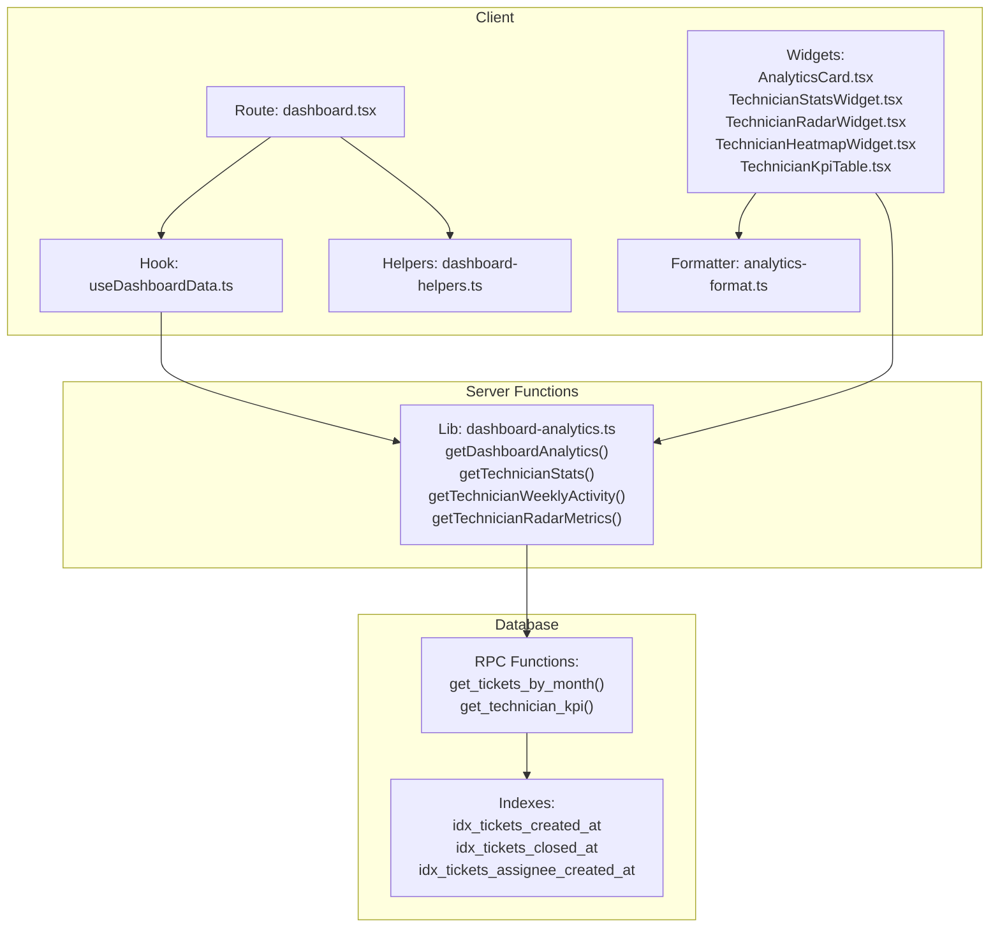
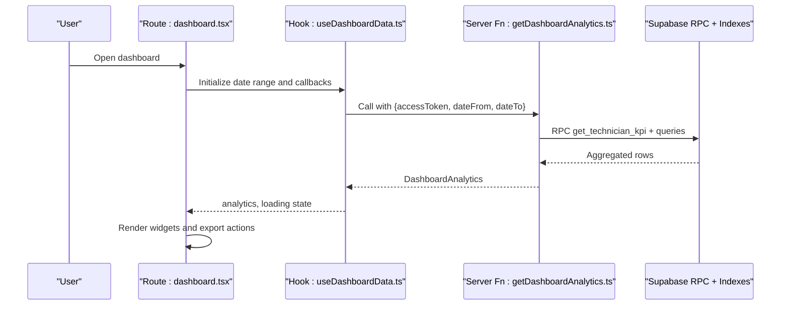
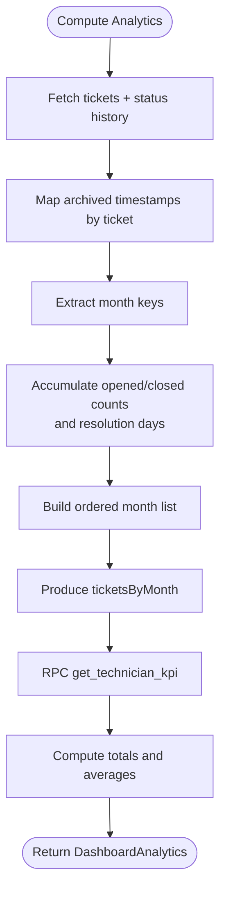
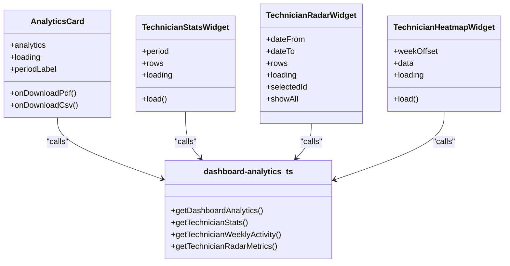
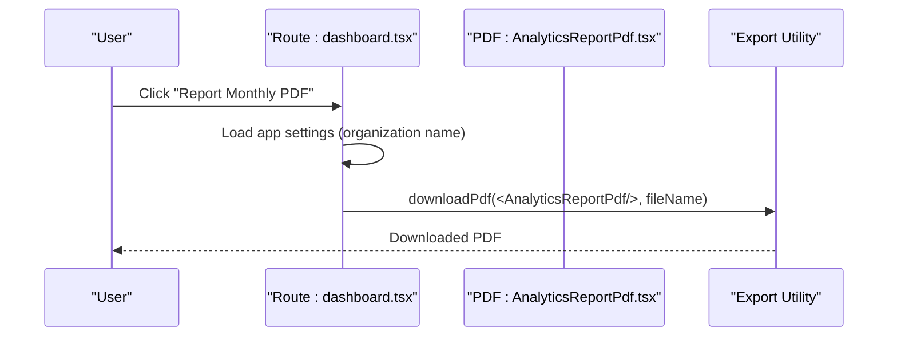
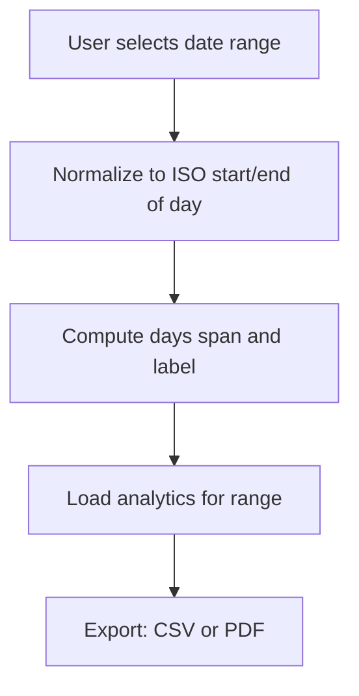
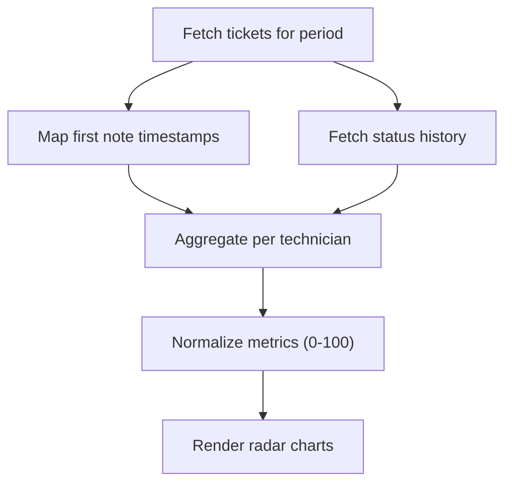
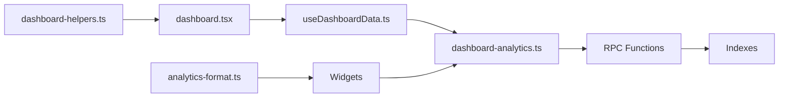

# Analytics and Reporting

<cite>
**Referenced Files in This Document**
- [dashboard-analytics.ts](file://src/lib/dashboard-analytics.ts)
- [analytics-format.ts](file://src/components/dashboard/analytics-format.ts)
- [useDashboardData.ts](file://src/hooks/useDashboardData.ts)
- [AnalyticsCard.tsx](file://src/components/dashboard/AnalyticsCard.tsx)
- [TechnicianStatsWidget.tsx](file://src/components/dashboard/TechnicianStatsWidget.tsx)
- [TechnicianRadarWidget.tsx](file://src/components/dashboard/TechnicianRadarWidget.tsx)
- [TechnicianHeatmapWidget.tsx](file://src/components/dashboard/TechnicianHeatmapWidget.tsx)
- [TechnicianKpiTable.tsx](file://src/components/dashboard/TechnicianKpiTable.tsx)
- [AnalyticsReportPdf.tsx](file://src/components/dashboard/AnalyticsReportPdf.tsx)
- [dashboard-helpers.ts](file://src/lib/dashboard-helpers.ts)
- [DateRangePicker.tsx](file://src/components/dashboard/DateRangePicker.tsx)
- [dashboard.tsx](file://src/routes/_app/dashboard.tsx)
- [20260511145300_dashboard_analytics_rpc_functions.sql](file://supabase/migrations/20260511145300_dashboard_analytics_rpc_functions.sql)
</cite>

## Table of Contents
1. [Introduction](#introduction)
2. [Project Structure](#project-structure)
3. [Core Components](#core-components)
4. [Architecture Overview](#architecture-overview)
5. [Detailed Component Analysis](#detailed-component-analysis)
6. [Dependency Analysis](#dependency-analysis)
7. [Performance Considerations](#performance-considerations)
8. [Troubleshooting Guide](#troubleshooting-guide)
9. [Conclusion](#conclusion)
10. [Appendices](#appendices)

## Introduction
This document explains the analytics and reporting system for the dashboard. It covers how key performance indicators, ticket metrics, and technician performance are computed and visualized, how PDF reports are generated, and how data is collected and aggregated. It also documents date range filtering, customizable report parameters, real-time dashboard widgets, and configuration options for report templates and export formats. Guidance is included for both managers reviewing performance and developers implementing analytics features.

## Project Structure
The analytics and reporting system spans client-side React components, server functions for analytics computation, and database RPC functions and indexes that power aggregations.

**Diagram sources**
- [dashboard.tsx:55-190](file://src/routes/_app/dashboard.tsx#L55-L190)
- [useDashboardData.ts:19-158](file://src/hooks/useDashboardData.ts#L19-L158)
- [dashboard-analytics.ts:36-166](file://src/lib/dashboard-analytics.ts#L36-L166)
- [dashboard-helpers.ts:4-25](file://src/lib/dashboard-helpers.ts#L4-L25)
- [analytics-format.ts:1-6](file://src/components/dashboard/analytics-format.ts#L1-L6)
- [20260511145300_dashboard_analytics_rpc_functions.sql:31-97](file://supabase/migrations/20260511145300_dashboard_analytics_rpc_functions.sql#L31-L97)

**Section sources**
- [dashboard.tsx:55-190](file://src/routes/_app/dashboard.tsx#L55-L190)
- [useDashboardData.ts:19-158](file://src/hooks/useDashboardData.ts#L19-L158)
- [dashboard-analytics.ts:36-166](file://src/lib/dashboard-analytics.ts#L36-L166)
- [dashboard-helpers.ts:4-25](file://src/lib/dashboard-helpers.ts#L4-L25)
- [analytics-format.ts:1-6](file://src/components/dashboard/analytics-format.ts#L1-L6)
- [20260511145300_dashboard_analytics_rpc_functions.sql:31-97](file://supabase/migrations/20260511145300_dashboard_analytics_rpc_functions.sql#L31-L97)

## Core Components
- Dashboard analytics server functions:
  - Monthly ticket counts and average resolution days
  - Technician KPIs (assigned, completed, average resolution days)
  - Technician weekly closure activity
  - Technician radar metrics (normalized scores across multiple dimensions)
- Real-time dashboard widgets:
  - Monthly bar charts and trend line for resolution time
  - Technician KPI cards and radar visualization
  - Weekly heatmap of closures by technician
- Report generation:
  - CSV export of analytics
  - PDF report with charts and tables
- Date range filtering:
  - Preset ranges and manual selection with ISO date boundaries

**Section sources**
- [dashboard-analytics.ts:20-28](file://src/lib/dashboard-analytics.ts#L20-L28)
- [dashboard-analytics.ts:36-166](file://src/lib/dashboard-analytics.ts#L36-L166)
- [dashboard-analytics.ts:168-251](file://src/lib/dashboard-analytics.ts#L168-L251)
- [dashboard-analytics.ts:253-331](file://src/lib/dashboard-analytics.ts#L253-L331)
- [dashboard-analytics.ts:333-554](file://src/lib/dashboard-analytics.ts#L333-L554)
- [AnalyticsCard.tsx:22-138](file://src/components/dashboard/AnalyticsCard.tsx#L22-L138)
- [TechnicianStatsWidget.tsx:13-173](file://src/components/dashboard/TechnicianStatsWidget.tsx#L13-L173)
- [TechnicianRadarWidget.tsx:21-184](file://src/components/dashboard/TechnicianRadarWidget.tsx#L21-L184)
- [TechnicianHeatmapWidget.tsx:25-120](file://src/components/dashboard/TechnicianHeatmapWidget.tsx#L25-L120)
- [dashboard-helpers.ts:4-25](file://src/lib/dashboard-helpers.ts#L4-L25)
- [AnalyticsReportPdf.tsx:18-135](file://src/components/dashboard/AnalyticsReportPdf.tsx#L18-L135)
- [DateRangePicker.tsx:16-96](file://src/components/dashboard/DateRangePicker.tsx#L16-L96)

## Architecture Overview
The analytics pipeline is a client-server flow:
- The dashboard route initializes date range and loads analytics via a server function.
- The server function validates the access token, computes aggregates using Supabase RPC functions and SQL indexes, and returns typed analytics data.
- Widgets render charts and KPIs from the analytics payload.
- Export flows generate CSV or PDF reports using the same analytics data.

**Diagram sources**
- [dashboard.tsx:76-190](file://src/routes/_app/dashboard.tsx#L76-L190)
- [useDashboardData.ts:114-123](file://src/hooks/useDashboardData.ts#L114-L123)
- [dashboard-analytics.ts:36-166](file://src/lib/dashboard-analytics.ts#L36-L166)
- [20260511145300_dashboard_analytics_rpc_functions.sql:77-97](file://supabase/migrations/20260511145300_dashboard_analytics_rpc_functions.sql#L77-L97)

## Detailed Component Analysis

### Analytics Data Model and Aggregation
- Data model:
  - Monthly metrics: month key, label, opened, closed, average resolution days
  - Technician KPIs: technician identity, full name, assigned, completed, average resolution days
  - Summary: totals and average across periods
- Aggregation logic:
  - Uses RPC functions for technician KPIs and monthly counts
  - Computes average resolution days from closed_at timestamps
  - Handles archived tickets by mapping archive timestamps to closed month
  - Normalizes radar metrics across a team for fair comparisons

**Diagram sources**
- [dashboard-analytics.ts:44-166](file://src/lib/dashboard-analytics.ts#L44-L166)
- [20260511145300_dashboard_analytics_rpc_functions.sql:77-97](file://supabase/migrations/20260511145300_dashboard_analytics_rpc_functions.sql#L77-L97)

**Section sources**
- [dashboard-analytics.ts:20-28](file://src/lib/dashboard-analytics.ts#L20-L28)
- [dashboard-analytics.ts:36-166](file://src/lib/dashboard-analytics.ts#L36-L166)
- [20260511145300_dashboard_analytics_rpc_functions.sql:31-97](file://supabase/migrations/20260511145300_dashboard_analytics_rpc_functions.sql#L31-L97)

### Real-Time Dashboard Widgets and Data Sources
- Monthly analytics card:
  - Renders bar chart for opened/closed tickets and line chart for average resolution days
  - Provides export actions to CSV and PDF
- Technician statistics widget:
  - Period selector (today/week/month)
  - Live refresh every 30 seconds
  - KPI cards with progress bars and workload badges
- Technician radar widget:
  - Normalized metrics across five dimensions
  - Toggle to show all technicians or focus on one
- Technician heatmap widget:
  - Weekly closure counts per technician
  - Navigation between weeks with live refresh

**Diagram sources**
- [AnalyticsCard.tsx:22-138](file://src/components/dashboard/AnalyticsCard.tsx#L22-L138)
- [TechnicianStatsWidget.tsx:13-173](file://src/components/dashboard/TechnicianStatsWidget.tsx#L13-L173)
- [TechnicianRadarWidget.tsx:21-184](file://src/components/dashboard/TechnicianRadarWidget.tsx#L21-L184)
- [TechnicianHeatmapWidget.tsx:25-120](file://src/components/dashboard/TechnicianHeatmapWidget.tsx#L25-L120)
- [dashboard-analytics.ts:36-554](file://src/lib/dashboard-analytics.ts#L36-L554)

**Section sources**
- [AnalyticsCard.tsx:22-138](file://src/components/dashboard/AnalyticsCard.tsx#L22-L138)
- [TechnicianStatsWidget.tsx:13-173](file://src/components/dashboard/TechnicianStatsWidget.tsx#L13-L173)
- [TechnicianRadarWidget.tsx:21-184](file://src/components/dashboard/TechnicianRadarWidget.tsx#L21-L184)
- [TechnicianHeatmapWidget.tsx:25-120](file://src/components/dashboard/TechnicianHeatmapWidget.tsx#L25-L120)
- [dashboard-analytics.ts:36-554](file://src/lib/dashboard-analytics.ts#L36-L554)

### PDF Report Generation
- Report structure:
  - Organization branding and metadata
  - Summary statistics (opened, closed, average resolution)
  - Charts: monthly bars, priority distribution donut
  - Tables: monthly detail and technician detail
- Parameters:
  - Analytics payload, period label, organization name, priority counts
- Export flow:
  - Dashboard triggers PDF generation via a shared export utility
  - Settings are fetched to populate organization branding

**Diagram sources**
- [dashboard.tsx:170-189](file://src/routes/_app/dashboard.tsx#L170-L189)
- [AnalyticsReportPdf.tsx:18-135](file://src/components/dashboard/AnalyticsReportPdf.tsx#L18-L135)

**Section sources**
- [AnalyticsReportPdf.tsx:18-135](file://src/components/dashboard/AnalyticsReportPdf.tsx#L18-L135)
- [dashboard.tsx:170-189](file://src/routes/_app/dashboard.tsx#L170-L189)

### Date Range Filtering and Customizable Parameters
- Date range picker:
  - Preset ranges (7, 30, 90, 180 days)
  - Manual date inputs with min/max constraints
  - ISO boundary normalization for start/end of day
- Dashboard hook:
  - Builds default 6-month range aligned to month starts
  - Formats period labels for display
  - Computes day span for trend computations
- Export parameters:
  - CSV: single consolidated sheet with two sections
  - PDF: branded page with optional organization name and priority counts

**Diagram sources**
- [DateRangePicker.tsx:16-96](file://src/components/dashboard/DateRangePicker.tsx#L16-L96)
- [dashboard-helpers.ts:27-50](file://src/lib/dashboard-helpers.ts#L27-L50)
- [dashboard-helpers.ts:4-25](file://src/lib/dashboard-helpers.ts#L4-L25)
- [useDashboardData.ts:26-64](file://src/hooks/useDashboardData.ts#L26-L64)

**Section sources**
- [DateRangePicker.tsx:16-96](file://src/components/dashboard/DateRangePicker.tsx#L16-L96)
- [dashboard-helpers.ts:27-50](file://src/lib/dashboard-helpers.ts#L27-L50)
- [dashboard-helpers.ts:4-25](file://src/lib/dashboard-helpers.ts#L4-L25)
- [useDashboardData.ts:26-64](file://src/hooks/useDashboardData.ts#L26-L64)

### Technician KPIs and Radar Metrics
- Technician KPIs:
  - Assigned and completed tickets within the selected period
  - Average resolution days when closed_at is available
  - Pending work calculation
- Radar metrics:
  - Five dimensions: volume, velocity, completion, responsiveness, reliability
  - Normalization against team max for fairness
  - Optional display of all technicians or a single focus view

**Diagram sources**
- [dashboard-analytics.ts:333-554](file://src/lib/dashboard-analytics.ts#L333-L554)

**Section sources**
- [dashboard-analytics.ts:12-18](file://src/lib/dashboard-analytics.ts#L12-L18)
- [dashboard-analytics.ts:333-554](file://src/lib/dashboard-analytics.ts#L333-L554)
- [TechnicianKpiTable.tsx:13-82](file://src/components/dashboard/TechnicianKpiTable.tsx#L13-L82)
- [TechnicianRadarWidget.tsx:64-105](file://src/components/dashboard/TechnicianRadarWidget.tsx#L64-L105)

## Dependency Analysis
- Client-to-server:
  - Route depends on hook for analytics lifecycle
  - Widgets depend on server functions for data
- Server-to-database:
  - Analytics functions rely on RPC functions and indexes
- Data model:
  - Consistent typing across server functions and components

**Diagram sources**
- [dashboard.tsx:76-190](file://src/routes/_app/dashboard.tsx#L76-L190)
- [useDashboardData.ts:114-123](file://src/hooks/useDashboardData.ts#L114-L123)
- [dashboard-analytics.ts:36-554](file://src/lib/dashboard-analytics.ts#L36-L554)
- [20260511145300_dashboard_analytics_rpc_functions.sql:31-102](file://supabase/migrations/20260511145300_dashboard_analytics_rpc_functions.sql#L31-L102)
- [analytics-format.ts:1-6](file://src/components/dashboard/analytics-format.ts#L1-L6)
- [dashboard-helpers.ts:4-25](file://src/lib/dashboard-helpers.ts#L4-L25)

**Section sources**
- [dashboard.tsx:76-190](file://src/routes/_app/dashboard.tsx#L76-L190)
- [useDashboardData.ts:114-123](file://src/hooks/useDashboardData.ts#L114-L123)
- [dashboard-analytics.ts:36-554](file://src/lib/dashboard-analytics.ts#L36-L554)
- [20260511145300_dashboard_analytics_rpc_functions.sql:31-102](file://supabase/migrations/20260511145300_dashboard_analytics_rpc_functions.sql#L31-L102)
- [analytics-format.ts:1-6](file://src/components/dashboard/analytics-format.ts#L1-L6)
- [dashboard-helpers.ts:4-25](file://src/lib/dashboard-helpers.ts#L4-L25)

## Performance Considerations
- Database indexing:
  - Indexes on created_at, closed_at, and assignee_id improve query performance for large datasets
- Aggregation strategy:
  - Prefer RPC functions for heavy aggregations to minimize client-side computation
- Real-time updates:
  - Use periodic polling for widgets that do not require immediate updates
  - Leverage Supabase channels for snapshot invalidation and refetch triggers
- Report generation:
  - Generate PDFs client-side from cached analytics data to avoid repeated server calls
- Formatting:
  - Use localized formatters for display; keep heavy computations server-side

[No sources needed since this section provides general guidance]

## Troubleshooting Guide
- Authentication failures:
  - Ensure access token is present and valid before invoking analytics server functions
- Empty or stale data:
  - Verify date range boundaries and timezone normalization
  - Confirm real-time channels are subscribed and refetch is triggered
- Large dataset slowness:
  - Confirm indexes exist and are used by queries
  - Reduce date range or disable unnecessary widgets during heavy periods
- Report generation delays:
  - Ensure analytics are loaded before initiating PDF export
  - Validate organization settings are fetched successfully

**Section sources**
- [dashboard-analytics.ts:36-42](file://src/lib/dashboard-analytics.ts#L36-L42)
- [useDashboardData.ts:101-112](file://src/hooks/useDashboardData.ts#L101-L112)
- [dashboard.tsx:170-189](file://src/routes/_app/dashboard.tsx#L170-L189)

## Conclusion
The analytics and reporting system combines efficient database RPC functions, robust client-side widgets, and flexible export formats. By leveraging indexed queries, normalized date ranges, and real-time invalidation, it delivers responsive dashboards and accurate reports suitable for both operational oversight and strategic planning.

[No sources needed since this section summarizes without analyzing specific files]

## Appendices

### Configuration Options and Best Practices
- Report templates:
  - Customize PDF sections and charts via the report component props
  - Use organization settings for branding consistency
- Metric calculations:
  - Adjust normalization thresholds for radar metrics as team sizes vary
- Export formats:
  - CSV export consolidates monthly and technician sections for quick review
  - PDF export includes charts and tables for formal distribution

**Section sources**
- [AnalyticsReportPdf.tsx:18-135](file://src/components/dashboard/AnalyticsReportPdf.tsx#L18-L135)
- [dashboard-helpers.ts:4-25](file://src/lib/dashboard-helpers.ts#L4-L25)
- [TechnicianRadarWidget.tsx:57-62](file://src/components/dashboard/TechnicianRadarWidget.tsx#L57-L62)