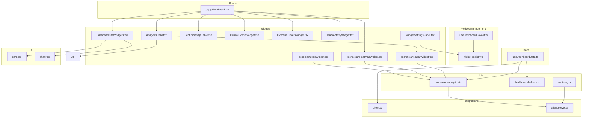
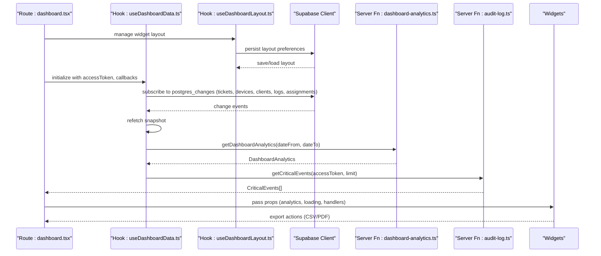
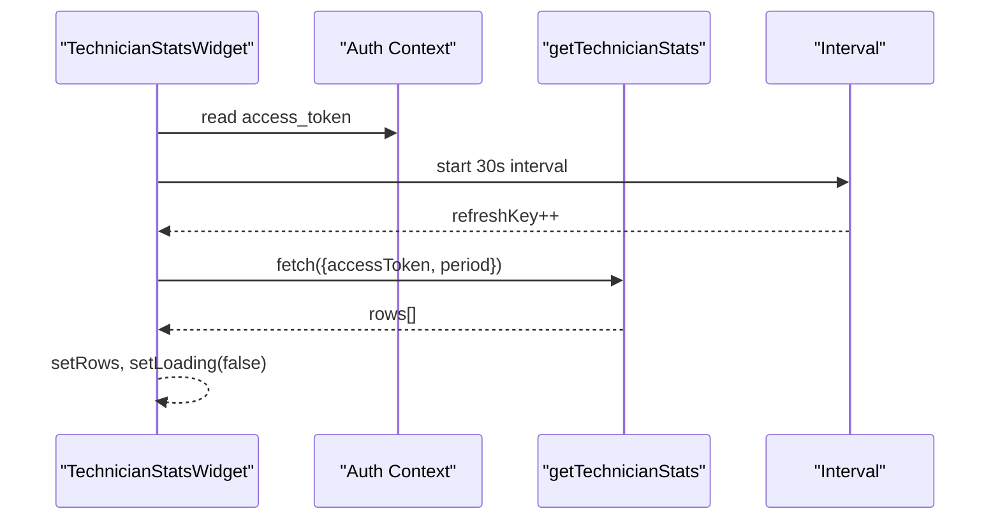
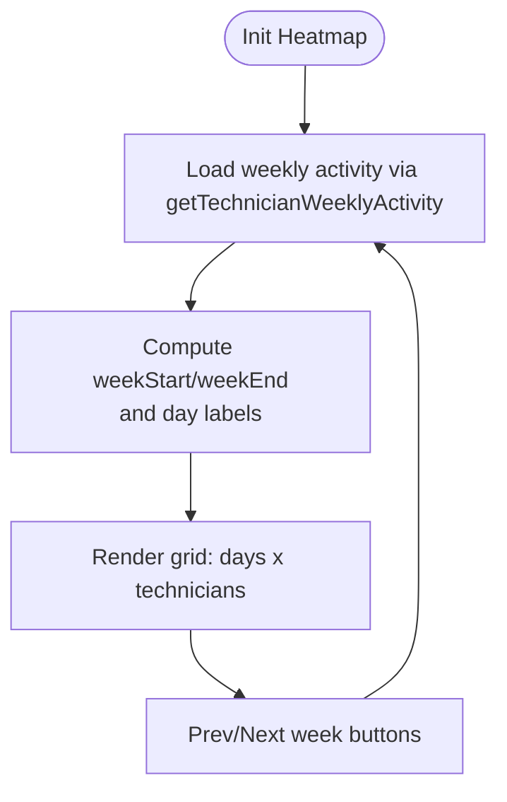
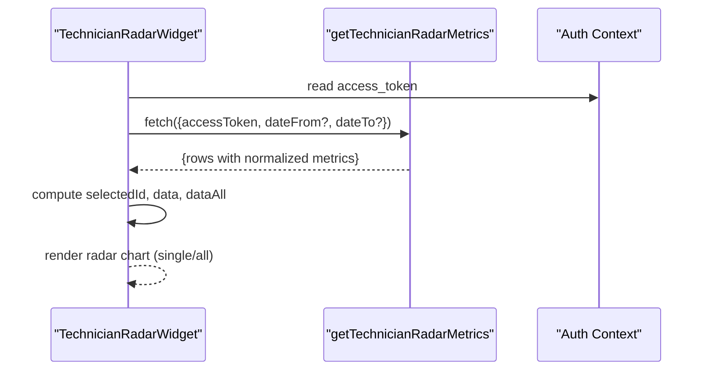
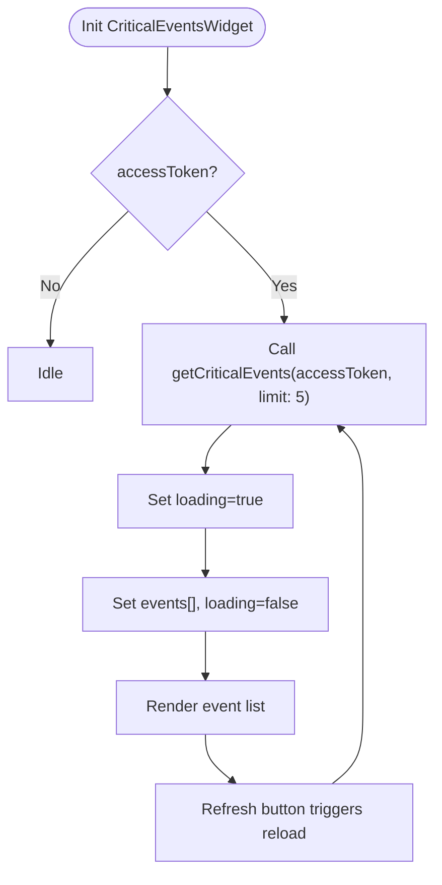
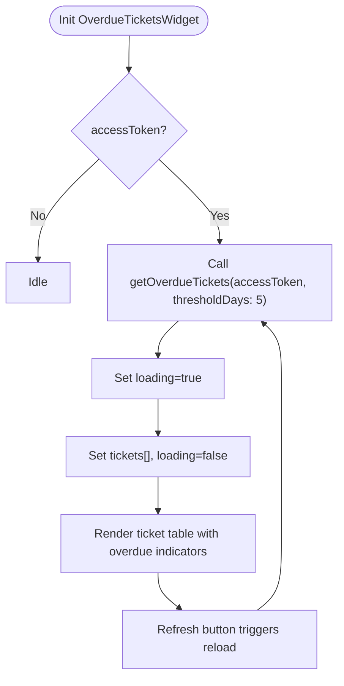
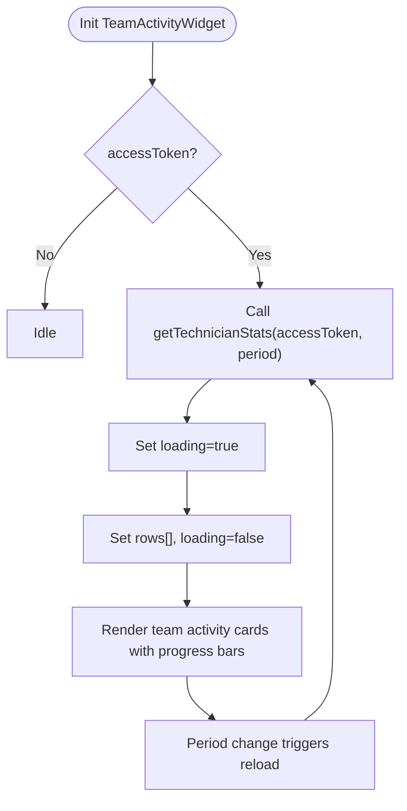
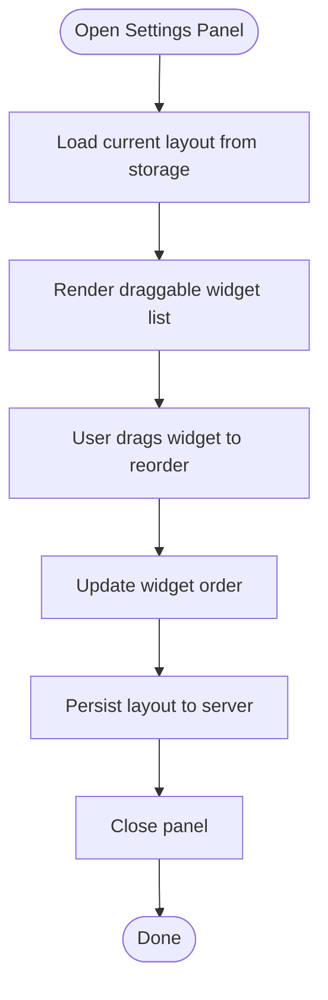
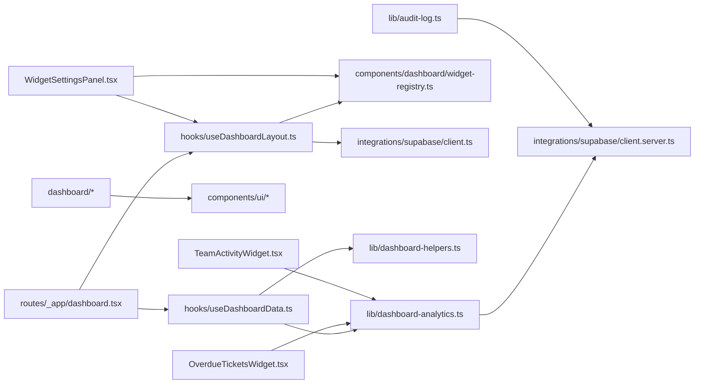

# Dashboard Widgets and Analytics Cards

<cite>
**Referenced Files in This Document**
- [AnalyticsCard.tsx](file://src/components/dashboard/AnalyticsCard.tsx)
- [DashboardStatWidgets.tsx](file://src/components/dashboard/DashboardStatWidgets.tsx)
- [TechnicianStatsWidget.tsx](file://src/components/dashboard/TechnicianStatsWidget.tsx)
- [TechnicianHeatmapWidget.tsx](file://src/components/dashboard/TechnicianHeatmapWidget.tsx)
- [TechnicianRadarWidget.tsx](file://src/components/dashboard/TechnicianRadarWidget.tsx)
- [TechnicianKpiTable.tsx](file://src/components/dashboard/TechnicianKpiTable.tsx)
- [CriticalEventsWidget.tsx](file://src/components/dashboard/CriticalEventsWidget.tsx)
- [OverdueTicketsWidget.tsx](file://src/components/dashboard/OverdueTicketsWidget.tsx)
- [TeamActivityWidget.tsx](file://src/components/dashboard/TeamActivityWidget.tsx)
- [WidgetSettingsPanel.tsx](file://src/components/dashboard/WidgetSettingsPanel.tsx)
- [widget-registry.ts](file://src/components/dashboard/widget-registry.ts)
- [analytics-format.ts](file://src/components/dashboard/analytics-format.ts)
- [useDashboardData.ts](file://src/hooks/useDashboardData.ts)
- [useDashboardLayout.ts](file://src/hooks/useDashboardLayout.ts)
- [dashboard-analytics.ts](file://src/lib/dashboard-analytics.ts)
- [dashboard-helpers.ts](file://src/lib/dashboard-helpers.ts)
- [dashboard.tsx](file://src/routes/_app/dashboard.tsx)
- [audit-log.ts](file://src/lib/audit-log.ts)
- [card.tsx](file://src/components/ui/card.tsx)
- [chart.tsx](file://src/components/ui/chart.tsx)
- [use-mobile.tsx](file://src/hooks/use-mobile.tsx)
- [client.ts](file://src/integrations/supabase/client.ts)
- [client.server.ts](file://src/integrations/supabase/client.server.ts)
</cite>

## Update Summary
**Changes Made**
- Added new OverdueTicketsWidget for monitoring SLA violations and overdue tickets
- Added new TeamActivityWidget for displaying team performance metrics and technician activity
- Added new WidgetSettingsPanel for drag-and-drop widget management and customization
- Enhanced dashboard layout system with persistent widget configurations using useDashboardLayout hook
- Updated widget registry with new widget types and default configurations
- Integrated new widgets into the main dashboard layout system
- Added comprehensive widget rendering system in dashboard.tsx with proper context passing

## Table of Contents
1. [Introduction](#introduction)
2. [Project Structure](#project-structure)
3. [Core Components](#core-components)
4. [Architecture Overview](#architecture-overview)
5. [Detailed Component Analysis](#detailed-component-analysis)
6. [Dependency Analysis](#dependency-analysis)
7. [Performance Considerations](#performance-considerations)
8. [Troubleshooting Guide](#troubleshooting-guide)
9. [Conclusion](#conclusion)
10. [Appendices](#appendices)

## Introduction
This document explains the dashboard widgets and analytics cards component suite used by administrators to monitor ticket trends, technician performance, and operational KPIs. It covers:
- Widget implementations: ticket statistics cards, technician performance widgets, heatmap visualization, radar charts, KPI tables, critical events monitoring, overdue tickets tracking, and team activity visualization
- Data structures powering rendering: AnalyticsCard props, DashboardStatWidgets configuration, TechnicianStatsWidget data formatting, and new widget registry system
- Widget lifecycle, data fetching patterns, and real-time updates
- Integration between server functions and client components for dynamic data binding
- Persistent widget configurations and drag-and-drop customization
- Responsive design patterns and mobile optimization
- Performance considerations for concurrent widget updates and refresh strategies

## Project Structure
The dashboard widgets live under the dashboard folder and integrate with reusable UI primitives, hooks, and a new widget management system. The main application route composes these widgets into a cohesive dashboard, including the new OverdueTicketsWidget, TeamActivityWidget, and WidgetSettingsPanel for enhanced customization.



**Diagram sources**
- [dashboard.tsx:26](file://src/routes/_app/dashboard.tsx#L26)
- [dashboard.tsx:514-517](file://src/routes/_app/dashboard.tsx#L514-L517)
- [OverdueTicketsWidget.tsx:1-117](file://src/components/dashboard/OverdueTicketsWidget.tsx#L1-L117)
- [TeamActivityWidget.tsx:1-118](file://src/components/dashboard/TeamActivityWidget.tsx#L1-L118)
- [WidgetSettingsPanel.tsx:1-147](file://src/components/dashboard/WidgetSettingsPanel.tsx#L1-L147)
- [widget-registry.ts:1-105](file://src/components/dashboard/widget-registry.ts#L1-L105)
- [useDashboardLayout.ts:1-102](file://src/hooks/useDashboardLayout.ts#L1-L102)

**Section sources**
- [dashboard.tsx:92-447](file://src/routes/_app/dashboard.tsx#L92-L447)
- [DashboardStatWidgets.tsx:1-264](file://src/components/dashboard/DashboardStatWidgets.tsx#L1-L264)
- [AnalyticsCard.tsx:1-149](file://src/components/dashboard/AnalyticsCard.tsx#L1-L149)

## Core Components
- AnalyticsCard: Renders monthly ticket counts and average resolution trend, plus a technician performance radar widget. Exposes export actions for CSV and PDF.
- DashboardStatWidgets: Provides stat cards, donut chart, and sparkline widgets for quick KPI scanning.
- TechnicianStatsWidget: Lists technicians with workload, completion percentage, and average resolution duration; supports period toggling and periodic refresh.
- TechnicianHeatmapWidget: Shows weekly ticket closure counts per technician with color-coded tiles.
- TechnicianRadarWidget: Displays normalized performance metrics (volume, speed, completion, responsiveness, reliability) for one or all technicians.
- TechnicianKpiTable: Compact table view of technician KPIs with click-to-filter behavior.
- CriticalEventsWidget: Displays recent critical security events with automatic refresh capabilities.
- OverdueTicketsWidget: Monitors SLA violations and overdue tickets with threshold-based filtering and detailed ticket information.
- TeamActivityWidget: Shows team performance metrics including active technicians, workload distribution, and completion rates.
- WidgetSettingsPanel: Drag-and-drop interface for managing widget visibility, ordering, and customization.
- widget-registry: Centralized widget definitions, types, and default configurations.
- analytics-format: Utility for consistent formatting of time durations.
- useDashboardData: Central hook orchestrating snapshot fetching, real-time subscriptions, analytics computation, and date-range handling.
- useDashboardLayout: Manages persistent widget configurations with drag-and-drop reordering and visibility controls.

**Updated** Added new OverdueTicketsWidget, TeamActivityWidget, WidgetSettingsPanel, and enhanced dashboard layout system with persistent widget configurations.

**Section sources**
- [AnalyticsCard.tsx:14-138](file://src/components/dashboard/AnalyticsCard.tsx#L14-L138)
- [DashboardStatWidgets.tsx:7-131](file://src/components/dashboard/DashboardStatWidgets.tsx#L7-L131)
- [TechnicianStatsWidget.tsx:13-172](file://src/components/dashboard/TechnicianStatsWidget.tsx#L13-L172)
- [TechnicianHeatmapWidget.tsx:25-119](file://src/components/dashboard/TechnicianHeatmapWidget.tsx#L25-L119)
- [TechnicianRadarWidget.tsx:21-183](file://src/components/dashboard/TechnicianRadarWidget.tsx#L21-L183)
- [TechnicianKpiTable.tsx:13-81](file://src/components/dashboard/TechnicianKpiTable.tsx#L13-L81)
- [CriticalEventsWidget.tsx:9-92](file://src/components/dashboard/CriticalEventsWidget.tsx#L9-L92)
- [OverdueTicketsWidget.tsx:10-117](file://src/components/dashboard/OverdueTicketsWidget.tsx#L10-L117)
- [TeamActivityWidget.tsx:11-118](file://src/components/dashboard/TeamActivityWidget.tsx#L11-L118)
- [WidgetSettingsPanel.tsx:79-147](file://src/components/dashboard/WidgetSettingsPanel.tsx#L79-L147)
- [widget-registry.ts:1-105](file://src/components/dashboard/widget-registry.ts#L1-L105)
- [analytics-format.ts:1-6](file://src/components/dashboard/analytics-format.ts#L1-L6)
- [useDashboardData.ts:19-158](file://src/hooks/useDashboardData.ts#L19-L158)
- [useDashboardLayout.ts:14-101](file://src/hooks/useDashboardLayout.ts#L14-L101)

## Architecture Overview
The dashboard composes multiple widgets that share a common data flow with enhanced management capabilities:
- Route initializes state and passes props to widgets
- useDashboardData loads a dashboard snapshot and subscribes to real-time changes
- useDashboardLayout manages persistent widget configurations with drag-and-drop reordering
- Server functions compute analytics and KPIs server-side for correctness and performance
- Widgets render charts and tables using shared UI components
- WidgetSettingsPanel provides interactive customization through drag-and-drop interface
- OverdueTicketsWidget and TeamActivityWidget provide specialized monitoring capabilities
- CriticalEventsWidget provides security monitoring through dedicated audit log queries



**Diagram sources**
- [dashboard.tsx:55-190](file://src/routes/_app/dashboard.tsx#L55-L190)
- [useDashboardData.ts:93-123](file://src/hooks/useDashboardData.ts#L93-L123)
- [useDashboardLayout.ts:22-37](file://src/hooks/useDashboardLayout.ts#L22-L37)
- [dashboard-analytics.ts:36-166](file://src/lib/dashboard-analytics.ts#L36-L166)
- [audit-log.ts:226-269](file://src/lib/audit-log.ts#L226-L269)
- [client.ts:1-40](file://src/integrations/supabase/client.ts#L1-L40)

## Detailed Component Analysis

### AnalyticsCard
- Purpose: Monthly ticket bar chart, average resolution line chart, and embedded radar widget for technician performance.
- Props:
  - analytics: DashboardAnalytics | null
  - loading: boolean
  - periodLabel: string
  - onDownloadPdf(): void
  - onDownloadCsv(): void
- Rendering:
  - Uses ChartContainer and ChartTooltipContent from shared chart utilities
  - TechnicianRadarWidget is embedded inside a card
- Export actions:
  - CSV export via helper
  - PDF generation via report component and download utility


**Diagram sources**
- [AnalyticsCard.tsx:22-138](file://src/components/dashboard/AnalyticsCard.tsx#L22-L138)
- [chart.tsx:35-62](file://src/components/ui/chart.tsx#L35-L62)

**Section sources**
- [AnalyticsCard.tsx:14-138](file://src/components/dashboard/AnalyticsCard.tsx#L14-L138)
- [analytics-format.ts:1-6](file://src/components/dashboard/analytics-format.ts#L1-L6)

### DashboardStatWidgets
- DashboardStatCard: Configurable stat card with accent color, optional link, and highlight effect.
- DashboardDonut: SVG-based donut chart with configurable legend visibility.
- DashboardAreaSpark: Single-series sparkline with hover support.
- DashboardAreaSparkMulti: Multi-series sparkline with synchronized hover and legend.

```mermaid
classDiagram
class DashboardStatCard {
+label : string
+value : number|string
+accent : string
+sub : string
+valueColor? : string
+icon : ReactNode
+href? : string
+highlight? : boolean
}
class DashboardDonut {
+data : {status : TicketStatus, n : number}[]
+total : number
+hideLegend? : boolean
}
class DashboardAreaSpark {
+data : number[]
+color? : string
}
class DashboardAreaSparkMulti {
+series : {data : number[], color : string, label? : string}[]
}
```

**Diagram sources**
- [DashboardStatWidgets.tsx:7-131](file://src/components/dashboard/DashboardStatWidgets.tsx#L7-L131)
- [DashboardStatWidgets.tsx:137-181](file://src/components/dashboard/DashboardStatWidgets.tsx#L137-L181)
- [DashboardStatWidgets.tsx:183-263](file://src/components/dashboard/DashboardStatWidgets.tsx#L183-L263)

**Section sources**
- [DashboardStatWidgets.tsx:7-131](file://src/components/dashboard/DashboardStatWidgets.tsx#L7-L131)
- [DashboardStatWidgets.tsx:137-181](file://src/components/dashboard/DashboardStatWidgets.tsx#L137-L181)
- [DashboardStatWidgets.tsx:183-263](file://src/components/dashboard/DashboardStatWidgets.tsx#L183-L263)

### TechnicianStatsWidget
- Purpose: Show technician workload, completion rate, and average resolution time; supports period selection (today, week, month).
- Lifecycle:
  - Loads data on mount and periodically (every 30 seconds) using a refresh key
  - Uses server function getTechnicianStats with access token
- Data formatting:
  - Computes active count, completion percentage, and workload color bands
  - Converts milliseconds to human-friendly duration



**Diagram sources**
- [TechnicianStatsWidget.tsx:13-44](file://src/components/dashboard/TechnicianStatsWidget.tsx#L13-L44)
- [dashboard-analytics.ts:168-251](file://src/lib/dashboard-analytics.ts#L168-L251)

**Section sources**
- [TechnicianStatsWidget.tsx:13-172](file://src/components/dashboard/TechnicianStatsWidget.tsx#L13-L172)
- [dashboard-analytics.ts:168-251](file://src/lib/dashboard-analytics.ts#L168-L251)

### TechnicianHeatmapWidget
- Purpose: Visualize weekly ticket closure counts per technician with color intensity.
- Features:
  - Week offset navigation
  - Color scale for counts
  - Responsive horizontal scrolling container



**Diagram sources**
- [TechnicianHeatmapWidget.tsx:25-119](file://src/components/dashboard/TechnicianHeatmapWidget.tsx#L25-L119)
- [dashboard-analytics.ts:253-331](file://src/lib/dashboard-analytics.ts#L253-L331)

**Section sources**
- [TechnicianHeatmapWidget.tsx:25-119](file://src/components/dashboard/TechnicianHeatmapWidget.tsx#L25-L119)
- [dashboard-analytics.ts:253-331](file://src/lib/dashboard-analytics.ts#L253-L331)

### TechnicianRadarWidget
- Purpose: Render normalized performance metrics for technicians in a radar chart.
- Features:
  - Toggle to show all technicians or a single selection
  - Normalization of metrics to 0–100 scale
  - Responsive container and tooltips/legend



**Diagram sources**
- [TechnicianRadarWidget.tsx:21-105](file://src/components/dashboard/TechnicianRadarWidget.tsx#L21-L105)
- [dashboard-analytics.ts:333-554](file://src/lib/dashboard-analytics.ts#L333-L554)

**Section sources**
- [TechnicianRadarWidget.tsx:21-183](file://src/components/dashboard/TechnicianRadarWidget.tsx#L21-L183)
- [dashboard-analytics.ts:333-554](file://src/lib/dashboard-analytics.ts#L333-L554)

### TechnicianKpiTable
- Purpose: Compact table view of technician KPIs with clickable rows to filter tickets by technician.
- Formatting:
  - Completion percentage and progress bar
  - Workload severity badges
  - Average resolution duration formatting

**Section sources**
- [TechnicianKpiTable.tsx:13-81](file://src/components/dashboard/TechnicianKpiTable.tsx#L13-L81)

### CriticalEventsWidget
- Purpose: Display recent critical security events with automatic refresh capabilities.
- Features:
  - Fetches critical events from audit log with severity level "critical"
  - Automatic loading and refresh functionality
  - Displays event count badge when events are present
  - Shows loading states and empty state messaging
  - Links to admin audit log for full details



**Diagram sources**
- [CriticalEventsWidget.tsx:13-25](file://src/components/dashboard/CriticalEventsWidget.tsx#L13-L25)
- [audit-log.ts:226-269](file://src/lib/audit-log.ts#L226-L269)

**Section sources**
- [CriticalEventsWidget.tsx:9-92](file://src/components/dashboard/CriticalEventsWidget.tsx#L9-L92)
- [audit-log.ts:226-269](file://src/lib/audit-log.ts#L226-L269)

### OverdueTicketsWidget
- Purpose: Monitor SLA violations and overdue tickets with threshold-based filtering and detailed ticket information.
- Features:
  - Threshold-based filtering (default 5 days)
  - Displays ticket code, client, device model, status, assignee, and days open
  - Color-coded severity indicators (red for >10 days, orange for >5 days)
  - Click-to-open ticket detail functionality
  - Manual refresh capability with loading states
  - Empty state messaging when no overdue tickets exist



**Diagram sources**
- [OverdueTicketsWidget.tsx:16-32](file://src/components/dashboard/OverdueTicketsWidget.tsx#L16-L32)
- [dashboard-analytics.ts:425-473](file://src/lib/dashboard-analytics.ts#L425-L473)

**Section sources**
- [OverdueTicketsWidget.tsx:10-117](file://src/components/dashboard/OverdueTicketsWidget.tsx#L10-L117)
- [dashboard-analytics.ts:410-473](file://src/lib/dashboard-analytics.ts#L410-L473)

### TeamActivityWidget
- Purpose: Display team performance metrics including active technicians, workload distribution, and completion rates.
- Features:
  - Period selection (today, week, month) with tabbed interface
  - Active technician counter showing current workload
  - Progress bars for completion rates
  - Color-coded workload indicators (high, medium, low)
  - Click-to-filter functionality for technician-specific views
  - Loading skeletons for improved UX during data fetch



**Diagram sources**
- [TeamActivityWidget.tsx:19-35](file://src/components/dashboard/TeamActivityWidget.tsx#L19-L35)
- [dashboard-analytics.ts:245-328](file://src/lib/dashboard-analytics.ts#L245-L328)

**Section sources**
- [TeamActivityWidget.tsx:11-118](file://src/components/dashboard/TeamActivityWidget.tsx#L11-L118)
- [dashboard-analytics.ts:245-328](file://src/lib/dashboard-analytics.ts#L245-L328)

### WidgetSettingsPanel
- Purpose: Provide drag-and-drop interface for managing widget visibility, ordering, and customization.
- Features:
  - Drag-and-drop reordering using @dnd-kit library
  - Visibility toggle for each widget
  - Persistent layout configuration across sessions
  - Slide-out panel interface with backdrop overlay
  - Keyboard accessibility support
  - Real-time preview of layout changes



**Diagram sources**
- [WidgetSettingsPanel.tsx:84-146](file://src/components/dashboard/WidgetSettingsPanel.tsx#L84-L146)
- [useDashboardLayout.ts:40-77](file://src/hooks/useDashboardLayout.ts#L40-L77)

**Section sources**
- [WidgetSettingsPanel.tsx:79-147](file://src/components/dashboard/WidgetSettingsPanel.tsx#L79-L147)
- [useDashboardLayout.ts:14-101](file://src/hooks/useDashboardLayout.ts#L14-L101)

### Enhanced Dashboard Layout System
- **Persistent Widget Configurations**: useDashboardLayout hook manages user-specific widget layouts with automatic persistence to server storage.
- **Drag-and-Drop Interface**: WidgetSettingsPanel provides intuitive drag-and-drop reordering using @dnd-kit library.
- **Widget Registry**: Centralized widget definitions with types, labels, descriptions, and default visibility.
- **Default Layout Creation**: Automatic creation of sensible default widget arrangements with hidden advanced widgets by default.
- **Real-time Layout Updates**: Changes are immediately reflected in the dashboard and persisted to the server.

**Updated** Enhanced dashboard layout system with persistent widget configurations and drag-and-drop management.

**Section sources**
- [useDashboardLayout.ts:14-101](file://src/hooks/useDashboardLayout.ts#L14-L101)
- [widget-registry.ts:1-105](file://src/components/dashboard/widget-registry.ts#L1-L105)
- [WidgetSettingsPanel.tsx:79-147](file://src/components/dashboard/WidgetSettingsPanel.tsx#L79-L147)

### Data Structures and Widget Rendering

#### AnalyticsCard props
- analytics: DashboardAnalytics | null
- loading: boolean
- periodLabel: string
- onDownloadPdf(): void
- onDownloadCsv(): void

**Section sources**
- [AnalyticsCard.tsx:14-28](file://src/components/dashboard/AnalyticsCard.tsx#L14-L28)

#### DashboardStatWidgets configuration
- DashboardStatCard: label, value, accent, sub, valueColor, icon, href, highlight
- DashboardDonut: data[{status, n}], total, hideLegend
- DashboardAreaSpark: data[], color
- DashboardAreaSparkMulti: series[{data[], color, label?}]

**Section sources**
- [DashboardStatWidgets.tsx:7-54](file://src/components/dashboard/DashboardStatWidgets.tsx#L7-L54)
- [DashboardStatWidgets.tsx:56-131](file://src/components/dashboard/DashboardStatWidgets.tsx#L56-L131)
- [DashboardStatWidgets.tsx:137-181](file://src/components/dashboard/DashboardStatWidgets.tsx#L137-L181)
- [DashboardStatWidgets.tsx:183-263](file://src/components/dashboard/DashboardStatWidgets.tsx#L183-L263)

#### TechnicianStatsWidget data formatting
- Rows include: id, name, initials, assigned, completed, pending, avg_days, avg_resolution_ms, active
- Completion percentage computed from assigned/completed
- Workload color bands based on assigned count thresholds

**Section sources**
- [TechnicianStatsWidget.tsx:19-62](file://src/components/dashboard/TechnicianStatsWidget.tsx#L19-L62)
- [dashboard-analytics.ts:168-251](file://src/lib/dashboard-analytics.ts#L168-L251)

#### DashboardAnalytics data model
- ticketsByMonth: array of monthly metrics with opened, closed, avg_days
- technicianKpi: array of technician KPIs
- summary: opened, closed, avgDays

**Section sources**
- [dashboard-analytics.ts:20-42](file://src/lib/dashboard-analytics.ts#L20-L42)

#### CriticalEventsWidget props
- accessToken: string | undefined
- Events: ActivityLogEntry[] (critical severity events)
- Loading state management for asynchronous data fetching

**Section sources**
- [CriticalEventsWidget.tsx:9-11](file://src/components/dashboard/CriticalEventsWidget.tsx#L9-L11)
- [audit-log.ts:6-23](file://src/lib/audit-log.ts#L6-L23)

#### OverdueTicketsWidget props and data model
- Props: accessToken (via auth context), thresholdDays (optional)
- Data model: OverdueTicketRow with ticket details, assignee information, and days calculation
- Threshold-based filtering for SLA violations

**Section sources**
- [OverdueTicketsWidget.tsx:10-117](file://src/components/dashboard/OverdueTicketsWidget.tsx#L10-L117)
- [dashboard-analytics.ts:410-473](file://src/lib/dashboard-analytics.ts#L410-L473)

#### TeamActivityWidget props and data model
- Props: period (today, week, month), navigate function for technician filtering
- Data model: TechnicianKpi with assigned, completed, pending counts and completion percentages
- Workload severity classification (high, medium, low)

**Section sources**
- [TeamActivityWidget.tsx:9-118](file://src/components/dashboard/TeamActivityWidget.tsx#L9-L118)
- [dashboard-analytics.ts:245-328](file://src/lib/dashboard-analytics.ts#L245-L328)

#### WidgetRegistry and Layout System
- WidgetId: Union type of all available widget identifiers
- WidgetEntry: Widget definition with id, label, and description
- WidgetLayoutItem: Individual widget configuration with order and visibility
- DashboardLayout: Complete layout configuration with widget array
- Default layout creation with hidden advanced widgets

**Section sources**
- [widget-registry.ts:1-105](file://src/components/dashboard/widget-registry.ts#L1-L105)
- [useDashboardLayout.ts:14-101](file://src/hooks/useDashboardLayout.ts#L14-L101)

### Widget Rendering System
The dashboard implements a comprehensive widget rendering system that manages widget composition, context passing, and lifecycle management:

- **Widget Registration**: All widgets are registered in the render function with unique keys and proper context injection
- **Context Management**: Each widget receives a comprehensive context object containing tickets, devices, analytics data, and utility functions
- **Lazy Loading**: Complex widgets like TechnicianStatsWidget are loaded lazily for performance
- **Error Boundaries**: Widgets are wrapped in error boundaries for robust error handling
- **Suspense Handling**: Async widgets use suspense for loading states
- **Navigation Integration**: Widgets provide seamless navigation to detailed views

**Section sources**
- [dashboard.tsx:324-993](file://src/routes/_app/dashboard.tsx#L324-L993)

## Dependency Analysis
- Route depends on useDashboardData for analytics and snapshot data, and useDashboardLayout for widget management
- Widgets depend on shared UI components (card.tsx, chart.tsx)
- Server functions in dashboard-analytics.ts encapsulate analytics computations and are invoked via TanStack server functions
- CriticalEventsWidget depends on audit-log.ts server functions for security event data
- OverdueTicketsWidget and TeamActivityWidget depend on dashboard-analytics.ts for specialized metrics
- WidgetSettingsPanel depends on widget-registry.ts for widget definitions and useDashboardLayout.ts for layout management
- Real-time updates are handled via Supabase channels subscribed in useDashboardData



**Diagram sources**
- [dashboard.tsx:55-190](file://src/routes/_app/dashboard.tsx#L55-L190)
- [useDashboardData.ts:93-123](file://src/hooks/useDashboardData.ts#L93-L123)
- [useDashboardLayout.ts:22-37](file://src/hooks/useDashboardLayout.ts#L22-L37)
- [dashboard-analytics.ts:36-166](file://src/lib/dashboard-analytics.ts#L36-L166)
- [audit-log.ts:226-269](file://src/lib/audit-log.ts#L226-L269)
- [client.ts:1-40](file://src/integrations/supabase/client.ts#L1-L40)
- [client.server.ts:31-41](file://src/integrations/supabase/client.server.ts#L31-L41)

**Section sources**
- [dashboard.tsx:55-190](file://src/routes/_app/dashboard.tsx#L55-L190)
- [useDashboardData.ts:93-123](file://src/hooks/useDashboardData.ts#L93-L123)
- [useDashboardLayout.ts:22-37](file://src/hooks/useDashboardLayout.ts#L22-L37)
- [dashboard-analytics.ts:36-166](file://src/lib/dashboard-analytics.ts#L36-L166)

## Performance Considerations
- Real-time synchronization: useDashboardData subscribes to multiple tables and triggers refetches on changes, minimizing stale data and reducing manual polling.
- Periodic refresh: TechnicianStatsWidget refreshes every 30 seconds; TechnicianHeatmapWidget refreshes every minute. Tune intervals based on data volatility and backend capacity.
- Efficient chart rendering: Recharts components are wrapped in ResponsiveContainer; avoid unnecessary re-renders by passing memoized data and avoiding inline object/function props.
- Server-side aggregation: dashboard-analytics.ts computes aggregates server-side, reducing client CPU and network overhead.
- Debounced exports: CSV/PDF generation is triggered from the route and leverages server-provided settings for PDF metadata.
- CriticalEventsWidget caching: Events are cached locally and refreshed on demand to minimize server requests.
- Widget layout persistence: useDashboardLayout minimizes server calls by batching layout updates and using optimistic UI updates.
- Drag-and-drop performance: WidgetSettingsPanel uses efficient sorting algorithms and debounced persistence to maintain smooth interactions.
- OverdueTicketsWidget optimization: Threshold-based filtering reduces data transfer and improves rendering performance for large datasets.
- Lazy loading: Complex widgets are loaded on-demand to improve initial page load performance.
- Context optimization: Widget context is memoized to prevent unnecessary re-renders across widgets.

**Updated** Added performance considerations for new widgets and enhanced layout system.

## Troubleshooting Guide
- Authentication failures: Server functions validate access tokens; ensure session access_token is present before invoking server functions.
- Real-time updates not appearing: Verify Supabase publication and replica identity settings; confirm channel subscription and removal on unmount.
- Widget shows skeleton or empty state: Check analytics loading flags and handle null analytics gracefully in widgets.
- Export failures: Confirm onDownloadPdf handler resolves app settings and that the report component receives required props.
- CriticalEventsWidget issues: Ensure user has admin privileges as getCriticalEvents requires admin authentication.
- OverdueTicketsWidget anomalies: Verify thresholdDays parameter and status filtering for in-progress and pending tickets.
- TeamActivityWidget issues: Check period parameter validation and ensure technician profiles exist for assignable roles.
- WidgetSettingsPanel problems: Verify drag-and-drop initialization and ensure widget IDs match registry definitions.
- Layout persistence failures: Check server function responses and ensure user profile has proper permissions for layout storage.
- Filtering anomalies: Verify that retired devices and archived/ready tickets are properly excluded from calculations.
- Widget rendering issues: Ensure all widgets are properly registered in the render function and receive required context props.
- Drag-and-drop conflicts: Check for proper sensor configuration and collision detection settings in WidgetSettingsPanel.

**Updated** Added troubleshooting guidance for new widgets and enhanced layout system.

**Section sources**
- [dashboard-analytics.ts:36-42](file://src/lib/dashboard-analytics.ts#L36-L42)
- [useDashboardData.ts:74-80](file://src/hooks/useDashboardData.ts#L74-L80)
- [dashboard.tsx:170-189](file://src/routes/_app/dashboard.tsx#L170-L189)
- [audit-log.ts:226-229](file://src/lib/audit-log.ts#L226-L229)
- [OverdueTicketsWidget.tsx:16-32](file://src/components/dashboard/OverdueTicketsWidget.tsx#L16-L32)
- [TeamActivityWidget.tsx:19-35](file://src/components/dashboard/TeamActivityWidget.tsx#L19-L35)
- [useDashboardLayout.ts:40-48](file://src/hooks/useDashboardLayout.ts#L40-L48)

## Conclusion
The dashboard widgets and analytics cards provide a comprehensive, real-time view of ticketing and technician performance with enhanced customization capabilities. They leverage a clean separation of concerns: server functions for accurate analytics, a central hook for data orchestration, and reusable UI components for consistent rendering. The addition of OverdueTicketsWidget and TeamActivityWidget enhances operational monitoring capabilities, while the new WidgetSettingsPanel provides intuitive drag-and-drop customization. The enhanced dashboard layout system with persistent widget configurations allows administrators to tailor their dashboard experience to specific needs. The useDashboardLayout hook ensures that user preferences are preserved across sessions, while the widget-registry system maintains consistency across the application. Administrators benefit from responsive, interactive widgets with security insights, SLA monitoring, and team performance tracking, while developers can extend or customize widgets with confidence in the underlying architecture.

**Updated** Enhanced conclusion to reflect new OverdueTicketsWidget, TeamActivityWidget, WidgetSettingsPanel, and improved layout management capabilities.

## Appendices

### Responsive Design Patterns and Mobile Optimization
- Grid-based layout: Uses responsive grid classes to stack or tile widgets on smaller screens.
- Horizontal scrolling: Heatmap and KPI table containers enable horizontal scrolling for narrow viewports.
- Typography scaling: Widget titles and subtitles adapt to screen sizes; tooltips and legends remain readable.
- Mobile breakpoint: A dedicated hook detects small screens to adjust behavior where needed.
- Touch-friendly interfaces: WidgetSettingsPanel provides optimal touch targets and gestures for mobile devices.
- Performance optimization: New widgets are designed with mobile performance in mind, using efficient rendering and minimal resource usage.
- Lazy loading: Complex widgets are loaded on-demand to improve mobile performance.

**Section sources**
- [dashboard.tsx:94-144](file://src/routes/_app/dashboard.tsx#L94-L144)
- [TechnicianHeatmapWidget.tsx:84-114](file://src/components/dashboard/TechnicianHeatmapWidget.tsx#L84-L114)
- [TechnicianKpiTable.tsx:24-81](file://src/components/dashboard/TechnicianKpiTable.tsx#L24-L81)
- [use-mobile.tsx:1-19](file://src/hooks/use-mobile.tsx#L1-L19)
- [WidgetSettingsPanel.tsx:102-146](file://src/components/dashboard/WidgetSettingsPanel.tsx#L102-L146)

### Widget Usage Examples (paths only)
- AnalyticsCard usage in route:
  - [dashboard.tsx:161-190](file://src/routes/_app/dashboard.tsx#L161-L190)
- Stat cards and donut:
  - [dashboard.tsx:94-144](file://src/routes/_app/dashboard.tsx#L94-L144)
- Sparklines:
  - [dashboard.tsx:202-282](file://src/routes/_app/dashboard.tsx#L202-L282)
- Heatmap:
  - [dashboard.tsx:393-394](file://src/routes/_app/dashboard.tsx#L393-L394)
- KPI table:
  - [dashboard.tsx:396-444](file://src/routes/_app/dashboard.tsx#L396-L444)
- CriticalEventsWidget:
  - [dashboard.tsx:514-517](file://src/routes/_app/dashboard.tsx#L514-L517)
- OverdueTicketsWidget:
  - [dashboard.tsx:954-959](file://src/routes/_app/dashboard.tsx#L954-L959)
- TeamActivityWidget:
  - [dashboard.tsx:961-966](file://src/routes/_app/dashboard.tsx#L961-L966)
- WidgetSettingsPanel:
  - [dashboard.tsx:519-521](file://src/routes/_app/dashboard.tsx#L519-L521)

**Updated** Added usage examples for new widgets and settings panel.