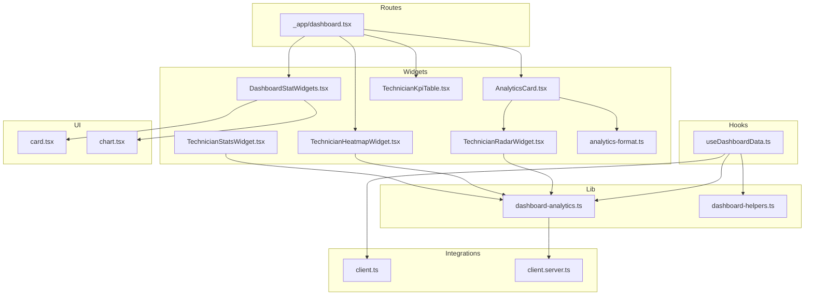
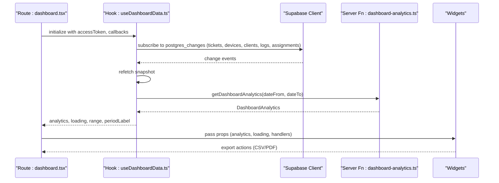
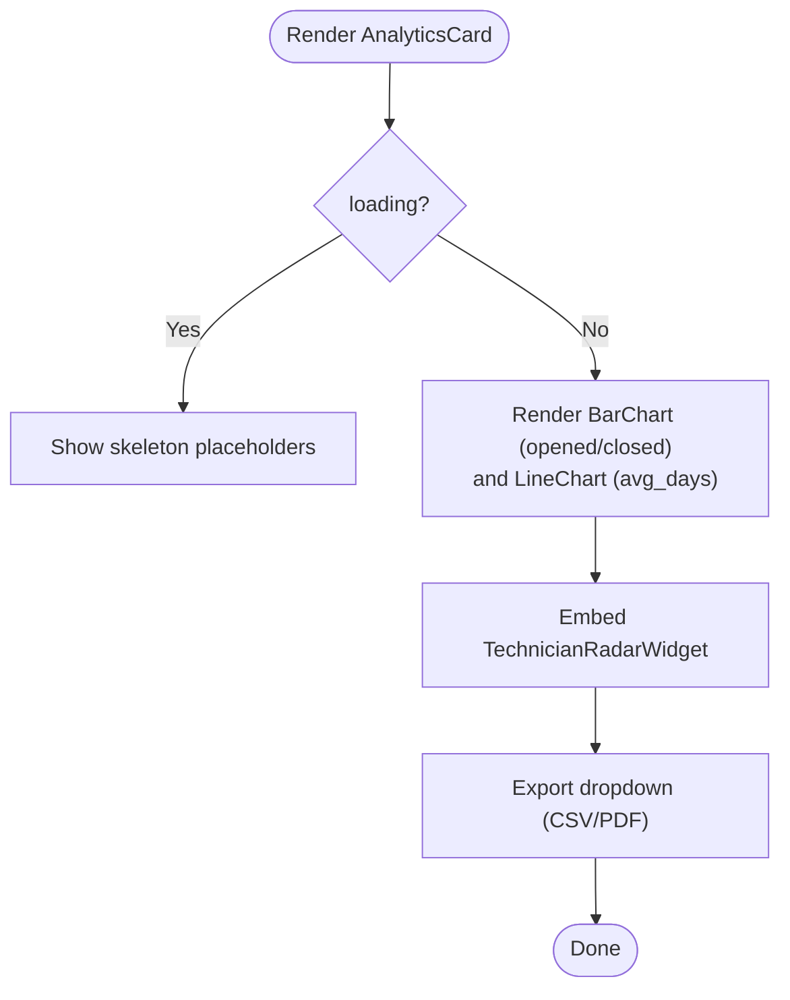
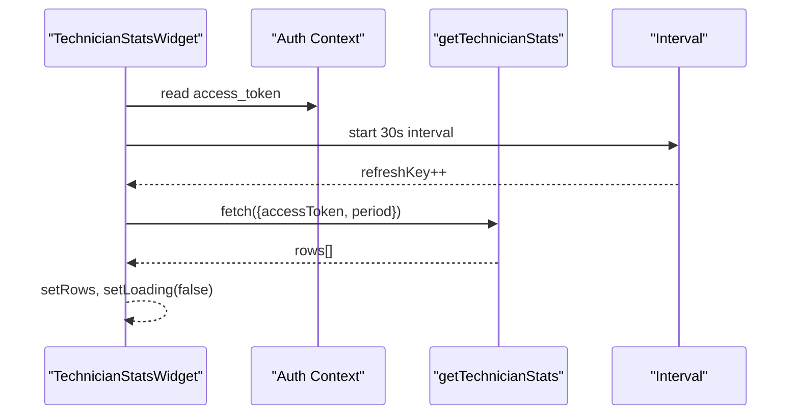
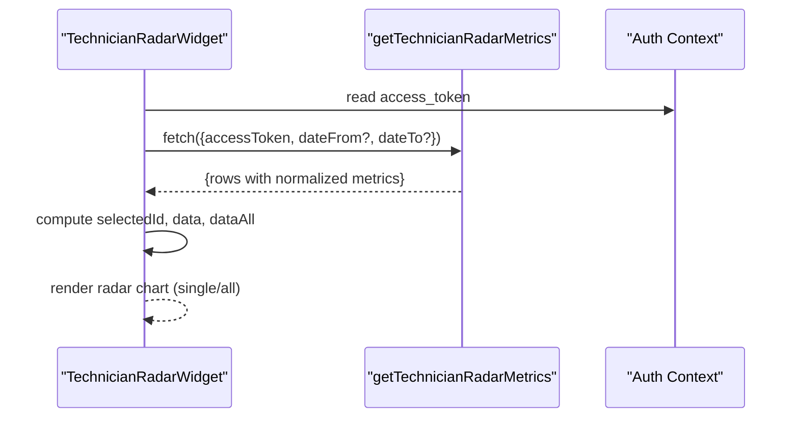
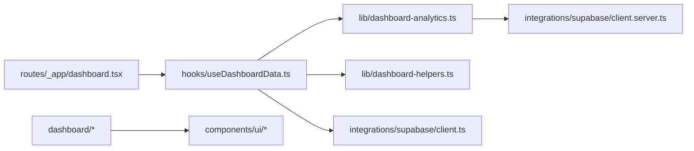

# Dashboard Widgets and Analytics Cards

<cite>
**Referenced Files in This Document**
- [AnalyticsCard.tsx](file://src/components/dashboard/AnalyticsCard.tsx)
- [DashboardStatWidgets.tsx](file://src/components/dashboard/DashboardStatWidgets.tsx)
- [TechnicianStatsWidget.tsx](file://src/components/dashboard/TechnicianStatsWidget.tsx)
- [TechnicianHeatmapWidget.tsx](file://src/components/dashboard/TechnicianHeatmapWidget.tsx)
- [TechnicianRadarWidget.tsx](file://src/components/dashboard/TechnicianRadarWidget.tsx)
- [TechnicianKpiTable.tsx](file://src/components/dashboard/TechnicianKpiTable.tsx)
- [analytics-format.ts](file://src/components/dashboard/analytics-format.ts)
- [useDashboardData.ts](file://src/hooks/useDashboardData.ts)
- [dashboard-analytics.ts](file://src/lib/dashboard-analytics.ts)
- [dashboard-helpers.ts](file://src/lib/dashboard-helpers.ts)
- [dashboard.tsx](file://src/routes/_app/dashboard.tsx)
- [card.tsx](file://src/components/ui/card.tsx)
- [chart.tsx](file://src/components/ui/chart.tsx)
- [use-mobile.tsx](file://src/hooks/use-mobile.tsx)
- [client.ts](file://src/integrations/supabase/client.ts)
- [client.server.ts](file://src/integrations/supabase/client.server.ts)
</cite>

## Table of Contents
1. [Introduction](#introduction)
2. [Project Structure](#project-structure)
3. [Core Components](#core-components)
4. [Architecture Overview](#architecture-overview)
5. [Detailed Component Analysis](#detailed-component-analysis)
6. [Dependency Analysis](#dependency-analysis)
7. [Performance Considerations](#performance-considerations)
8. [Troubleshooting Guide](#troubleshooting-guide)
9. [Conclusion](#conclusion)
10. [Appendices](#appendices)

## Introduction
This document explains the dashboard widgets and analytics cards component suite used by administrators to monitor ticket trends, technician performance, and operational KPIs. It covers:
- Widget implementations: ticket statistics cards, technician performance widgets, heatmap visualization, radar charts, and KPI tables
- Data structures powering rendering: AnalyticsCard props, DashboardStatWidgets configuration, and TechnicianStatsWidget data formatting
- Widget lifecycle, data fetching patterns, and real-time updates
- Integration between server functions and client components for dynamic data binding
- Responsive design patterns and mobile optimization
- Performance considerations for concurrent widget updates and refresh strategies

## Project Structure
The dashboard widgets live under the dashboard folder and integrate with reusable UI primitives and hooks. The main application route composes these widgets into a cohesive dashboard.



**Diagram sources**
- [dashboard.tsx:34-44](file://src/routes/_app/dashboard.tsx#L34-L44)
- [AnalyticsCard.tsx:1-149](file://src/components/dashboard/AnalyticsCard.tsx#L1-L149)
- [DashboardStatWidgets.tsx:1-264](file://src/components/dashboard/DashboardStatWidgets.tsx#L1-L264)
- [TechnicianStatsWidget.tsx:1-173](file://src/components/dashboard/TechnicianStatsWidget.tsx#L1-L173)
- [TechnicianHeatmapWidget.tsx:1-120](file://src/components/dashboard/TechnicianHeatmapWidget.tsx#L1-L120)
- [TechnicianRadarWidget.tsx:1-184](file://src/components/dashboard/TechnicianRadarWidget.tsx#L1-L184)
- [TechnicianKpiTable.tsx:1-82](file://src/components/dashboard/TechnicianKpiTable.tsx#L1-L82)
- [analytics-format.ts:1-6](file://src/components/dashboard/analytics-format.ts#L1-L6)
- [useDashboardData.ts:1-159](file://src/hooks/useDashboardData.ts#L1-L159)
- [dashboard-analytics.ts:1-559](file://src/lib/dashboard-analytics.ts#L1-L559)
- [dashboard-helpers.ts:1-72](file://src/lib/dashboard-helpers.ts#L1-L72)
- [card.tsx:1-56](file://src/components/ui/card.tsx#L1-L56)
- [chart.tsx:1-332](file://src/components/ui/chart.tsx#L1-L332)
- [client.ts:1-40](file://src/integrations/supabase/client.ts#L1-L40)
- [client.server.ts:31-41](file://src/integrations/supabase/client.server.ts#L31-L41)

**Section sources**
- [dashboard.tsx:92-447](file://src/routes/_app/dashboard.tsx#L92-L447)
- [DashboardStatWidgets.tsx:1-264](file://src/components/dashboard/DashboardStatWidgets.tsx#L1-L264)
- [AnalyticsCard.tsx:1-149](file://src/components/dashboard/AnalyticsCard.tsx#L1-L149)

## Core Components
- AnalyticsCard: Renders monthly ticket counts and average resolution trend, plus a technician performance radar widget. Exposes export actions for CSV and PDF.
- DashboardStatWidgets: Provides stat cards, donut chart, and sparkline widgets for quick KPI scanning.
- TechnicianStatsWidget: Lists technicians with workload, completion percentage, and average resolution duration; supports period toggling and periodic refresh.
- TechnicianHeatmapWidget: Shows weekly ticket closure counts per technician with color-coded tiles.
- TechnicianRadarWidget: Displays normalized performance metrics (volume, speed, completion, responsiveness, reliability) for one or all technicians.
- TechnicianKpiTable: Compact table view of technician KPIs with click-to-filter behavior.
- analytics-format: Utility for consistent formatting of time durations.
- useDashboardData: Central hook orchestrating snapshot fetching, real-time subscriptions, analytics computation, and date-range handling.

**Section sources**
- [AnalyticsCard.tsx:14-138](file://src/components/dashboard/AnalyticsCard.tsx#L14-L138)
- [DashboardStatWidgets.tsx:7-131](file://src/components/dashboard/DashboardStatWidgets.tsx#L7-L131)
- [TechnicianStatsWidget.tsx:13-172](file://src/components/dashboard/TechnicianStatsWidget.tsx#L13-L172)
- [TechnicianHeatmapWidget.tsx:25-119](file://src/components/dashboard/TechnicianHeatmapWidget.tsx#L25-L119)
- [TechnicianRadarWidget.tsx:21-183](file://src/components/dashboard/TechnicianRadarWidget.tsx#L21-L183)
- [TechnicianKpiTable.tsx:13-81](file://src/components/dashboard/TechnicianKpiTable.tsx#L13-L81)
- [analytics-format.ts:1-6](file://src/components/dashboard/analytics-format.ts#L1-L6)
- [useDashboardData.ts:19-158](file://src/hooks/useDashboardData.ts#L19-L158)

## Architecture Overview
The dashboard composes multiple widgets that share a common data flow:
- Route initializes state and passes props to widgets
- useDashboardData loads a dashboard snapshot and subscribes to real-time changes
- Server functions compute analytics and KPIs server-side for correctness and performance
- Widgets render charts and tables using shared UI components



**Diagram sources**
- [dashboard.tsx:55-190](file://src/routes/_app/dashboard.tsx#L55-L190)
- [useDashboardData.ts:93-123](file://src/hooks/useDashboardData.ts#L93-L123)
- [dashboard-analytics.ts:36-166](file://src/lib/dashboard-analytics.ts#L36-L166)
- [client.ts:1-40](file://src/integrations/supabase/client.ts#L1-L40)

## Detailed Component Analysis

### AnalyticsCard
- Purpose: Monthly ticket bar chart, average resolution line chart, and embedded radar widget for technician performance.
- Props:
  - analytics: DashboardAnalytics | null
  - loading: boolean
  - periodLabel: string
  - onDownloadPdf(): void
  - onDownloadCsv(): void
- Rendering:
  - Uses ChartContainer and ChartTooltipContent from shared chart utilities
  - TechnicianRadarWidget is embedded inside a card
- Export actions:
  - CSV export via helper
  - PDF generation via report component and download utility



**Diagram sources**
- [AnalyticsCard.tsx:22-138](file://src/components/dashboard/AnalyticsCard.tsx#L22-L138)
- [chart.tsx:35-62](file://src/components/ui/chart.tsx#L35-L62)

**Section sources**
- [AnalyticsCard.tsx:14-138](file://src/components/dashboard/AnalyticsCard.tsx#L14-L138)
- [analytics-format.ts:1-6](file://src/components/dashboard/analytics-format.ts#L1-L6)

### DashboardStatWidgets
- DashboardStatCard: Configurable stat card with accent color, optional link, and highlight effect.
- DashboardDonut: SVG-based donut chart with configurable legend visibility.
- DashboardAreaSpark: Single-series sparkline with hover support.
- DashboardAreaSparkMulti: Multi-series sparkline with synchronized hover and legend.

```mermaid
classDiagram
class DashboardStatCard {
+label : string
+value : number|string
+accent : string
+sub : string
+valueColor? : string
+icon : ReactNode
+href? : string
+highlight? : boolean
}
class DashboardDonut {
+data : {status : TicketStatus, n : number}[]
+total : number
+hideLegend? : boolean
}
class DashboardAreaSpark {
+data : number[]
+color? : string
}
class DashboardAreaSparkMulti {
+series : {data : number[], color : string, label? : string}[]
}
```

**Diagram sources**
- [DashboardStatWidgets.tsx:7-131](file://src/components/dashboard/DashboardStatWidgets.tsx#L7-L131)
- [DashboardStatWidgets.tsx:137-181](file://src/components/dashboard/DashboardStatWidgets.tsx#L137-L181)
- [DashboardStatWidgets.tsx:183-263](file://src/components/dashboard/DashboardStatWidgets.tsx#L183-L263)

**Section sources**
- [DashboardStatWidgets.tsx:7-131](file://src/components/dashboard/DashboardStatWidgets.tsx#L7-L131)
- [DashboardStatWidgets.tsx:137-181](file://src/components/dashboard/DashboardStatWidgets.tsx#L137-L181)
- [DashboardStatWidgets.tsx:183-263](file://src/components/dashboard/DashboardStatWidgets.tsx#L183-L263)

### TechnicianStatsWidget
- Purpose: Show technician workload, completion rate, and average resolution time; supports period selection (today, week, month).
- Lifecycle:
  - Loads data on mount and periodically (every 30 seconds) using a refresh key
  - Uses server function getTechnicianStats with access token
- Data formatting:
  - Computes active count, completion percentage, and workload color bands
  - Converts milliseconds to human-friendly duration



**Diagram sources**
- [TechnicianStatsWidget.tsx:13-44](file://src/components/dashboard/TechnicianStatsWidget.tsx#L13-L44)
- [dashboard-analytics.ts:168-251](file://src/lib/dashboard-analytics.ts#L168-L251)

**Section sources**
- [TechnicianStatsWidget.tsx:13-172](file://src/components/dashboard/TechnicianStatsWidget.tsx#L13-L172)
- [dashboard-analytics.ts:168-251](file://src/lib/dashboard-analytics.ts#L168-L251)

### TechnicianHeatmapWidget
- Purpose: Visualize weekly ticket closure counts per technician with color intensity.
- Features:
  - Week offset navigation
  - Color scale for counts
  - Responsive horizontal scrolling container


**Diagram sources**
- [TechnicianHeatmapWidget.tsx:25-119](file://src/components/dashboard/TechnicianHeatmapWidget.tsx#L25-L119)
- [dashboard-analytics.ts:253-331](file://src/lib/dashboard-analytics.ts#L253-L331)

**Section sources**
- [TechnicianHeatmapWidget.tsx:25-119](file://src/components/dashboard/TechnicianHeatmapWidget.tsx#L25-L119)
- [dashboard-analytics.ts:253-331](file://src/lib/dashboard-analytics.ts#L253-L331)

### TechnicianRadarWidget
- Purpose: Render normalized performance metrics for technicians in a radar chart.
- Features:
  - Toggle to show all technicians or a single selection
  - Normalization of metrics to 0–100 scale
  - Responsive container and tooltips/legend



**Diagram sources**
- [TechnicianRadarWidget.tsx:21-105](file://src/components/dashboard/TechnicianRadarWidget.tsx#L21-L105)
- [dashboard-analytics.ts:333-554](file://src/lib/dashboard-analytics.ts#L333-L554)

**Section sources**
- [TechnicianRadarWidget.tsx:21-183](file://src/components/dashboard/TechnicianRadarWidget.tsx#L21-L183)
- [dashboard-analytics.ts:333-554](file://src/lib/dashboard-analytics.ts#L333-L554)

### TechnicianKpiTable
- Purpose: Compact table view of technician KPIs with clickable rows to filter tickets by technician.
- Formatting:
  - Completion percentage and progress bar
  - Workload severity badges
  - Average resolution duration formatting

**Section sources**
- [TechnicianKpiTable.tsx:13-81](file://src/components/dashboard/TechnicianKpiTable.tsx#L13-L81)

### Data Structures and Widget Rendering

#### AnalyticsCard props
- analytics: DashboardAnalytics | null
- loading: boolean
- periodLabel: string
- onDownloadPdf(): void
- onDownloadCsv(): void

**Section sources**
- [AnalyticsCard.tsx:14-28](file://src/components/dashboard/AnalyticsCard.tsx#L14-L28)

#### DashboardStatWidgets configuration
- DashboardStatCard: label, value, accent, sub, valueColor, icon, href, highlight
- DashboardDonut: data[{status, n}], total, hideLegend
- DashboardAreaSpark: data[], color
- DashboardAreaSparkMulti: series[{data[], color, label?}]

**Section sources**
- [DashboardStatWidgets.tsx:7-54](file://src/components/dashboard/DashboardStatWidgets.tsx#L7-L54)
- [DashboardStatWidgets.tsx:56-131](file://src/components/dashboard/DashboardStatWidgets.tsx#L56-L131)
- [DashboardStatWidgets.tsx:137-181](file://src/components/dashboard/DashboardStatWidgets.tsx#L137-L181)
- [DashboardStatWidgets.tsx:183-263](file://src/components/dashboard/DashboardStatWidgets.tsx#L183-L263)

#### TechnicianStatsWidget data formatting
- Rows include: id, name, initials, assigned, completed, pending, avg_days, avg_resolution_ms, active
- Completion percentage computed from assigned/completed
- Workload color bands based on assigned count thresholds

**Section sources**
- [TechnicianStatsWidget.tsx:19-62](file://src/components/dashboard/TechnicianStatsWidget.tsx#L19-L62)
- [dashboard-analytics.ts:168-251](file://src/lib/dashboard-analytics.ts#L168-L251)

#### DashboardAnalytics data model
- ticketsByMonth: array of monthly metrics with opened, closed, avg_days
- technicianKpi: array of technician KPIs
- summary: opened, closed, avgDays

**Section sources**
- [dashboard-analytics.ts:20-28](file://src/lib/dashboard-analytics.ts#L20-L28)

## Dependency Analysis
- Route depends on useDashboardData for analytics and snapshot data
- Widgets depend on shared UI components (card.tsx, chart.tsx)
- Server functions in dashboard-analytics.ts encapsulate analytics computations and are invoked via TanStack server functions
- Real-time updates are handled via Supabase channels subscribed in useDashboardData



**Diagram sources**
- [dashboard.tsx:55-190](file://src/routes/_app/dashboard.tsx#L55-L190)
- [useDashboardData.ts:93-123](file://src/hooks/useDashboardData.ts#L93-L123)
- [dashboard-analytics.ts:36-166](file://src/lib/dashboard-analytics.ts#L36-L166)
- [client.ts:1-40](file://src/integrations/supabase/client.ts#L1-L40)
- [client.server.ts:31-41](file://src/integrations/supabase/client.server.ts#L31-L41)

**Section sources**
- [dashboard.tsx:55-190](file://src/routes/_app/dashboard.tsx#L55-L190)
- [useDashboardData.ts:93-123](file://src/hooks/useDashboardData.ts#L93-L123)
- [dashboard-analytics.ts:36-166](file://src/lib/dashboard-analytics.ts#L36-L166)

## Performance Considerations
- Real-time synchronization: useDashboardData subscribes to multiple tables and triggers refetches on changes, minimizing stale data and reducing manual polling.
- Periodic refresh: TechnicianStatsWidget refreshes every 30 seconds; TechnicianHeatmapWidget refreshes every minute. Tune intervals based on data volatility and backend capacity.
- Efficient chart rendering: Recharts components are wrapped in ResponsiveContainer; avoid unnecessary re-renders by passing memoized data and avoiding inline object/function props.
- Server-side aggregation: dashboard-analytics.ts computes aggregates server-side, reducing client CPU and network overhead.
- Debounced exports: CSV/PDF generation is triggered from the route and leverages server-provided settings for PDF metadata.

[No sources needed since this section provides general guidance]

## Troubleshooting Guide
- Authentication failures: Server functions validate access tokens; ensure session access_token is present before invoking server functions.
- Real-time updates not appearing: Verify Supabase publication and replica identity settings; confirm channel subscription and removal on unmount.
- Widget shows skeleton or empty state: Check analytics loading flags and handle null analytics gracefully in widgets.
- Export failures: Confirm onDownloadPdf handler resolves app settings and that the report component receives required props.

**Section sources**
- [dashboard-analytics.ts:36-42](file://src/lib/dashboard-analytics.ts#L36-L42)
- [useDashboardData.ts:74-80](file://src/hooks/useDashboardData.ts#L74-L80)
- [dashboard.tsx:170-189](file://src/routes/_app/dashboard.tsx#L170-L189)

## Conclusion
The dashboard widgets and analytics cards provide a comprehensive, real-time view of ticketing and technician performance. They leverage a clean separation of concerns: server functions for accurate analytics, a central hook for data orchestration, and reusable UI components for consistent rendering. Administrators benefit from responsive, interactive widgets, while developers can extend or customize widgets with confidence in the underlying architecture.

[No sources needed since this section summarizes without analyzing specific files]

## Appendices

### Responsive Design Patterns and Mobile Optimization
- Grid-based layout: Uses responsive grid classes to stack or tile widgets on smaller screens.
- Horizontal scrolling: Heatmap and KPI table containers enable horizontal scrolling for narrow viewports.
- Typography scaling: Widget titles and subtitles adapt to screen sizes; tooltips and legends remain readable.
- Mobile breakpoint: A dedicated hook detects small screens to adjust behavior where needed.

**Section sources**
- [dashboard.tsx:94-144](file://src/routes/_app/dashboard.tsx#L94-L144)
- [TechnicianHeatmapWidget.tsx:84-114](file://src/components/dashboard/TechnicianHeatmapWidget.tsx#L84-L114)
- [TechnicianKpiTable.tsx:24-81](file://src/components/dashboard/TechnicianKpiTable.tsx#L24-L81)
- [use-mobile.tsx:1-19](file://src/hooks/use-mobile.tsx#L1-L19)

### Widget Usage Examples (paths only)
- AnalyticsCard usage in route:
  - [dashboard.tsx:161-190](file://src/routes/_app/dashboard.tsx#L161-L190)
- Stat cards and donut:
  - [dashboard.tsx:94-144](file://src/routes/_app/dashboard.tsx#L94-L144)
- Sparklines:
  - [dashboard.tsx:202-282](file://src/routes/_app/dashboard.tsx#L202-L282)
- Heatmap:
  - [dashboard.tsx:393-394](file://src/routes/_app/dashboard.tsx#L393-L394)
- KPI table:
  - [dashboard.tsx:396-444](file://src/routes/_app/dashboard.tsx#L396-L444)