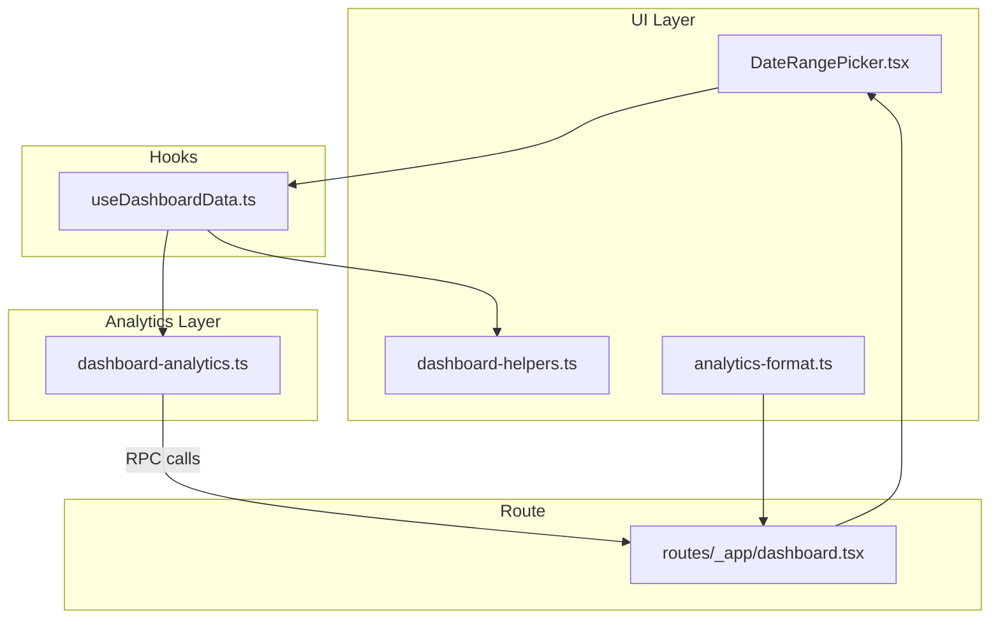
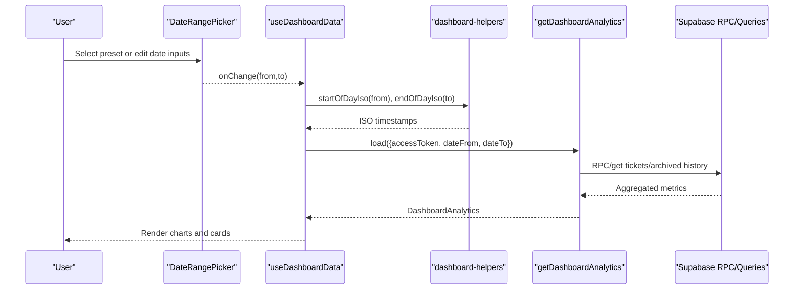
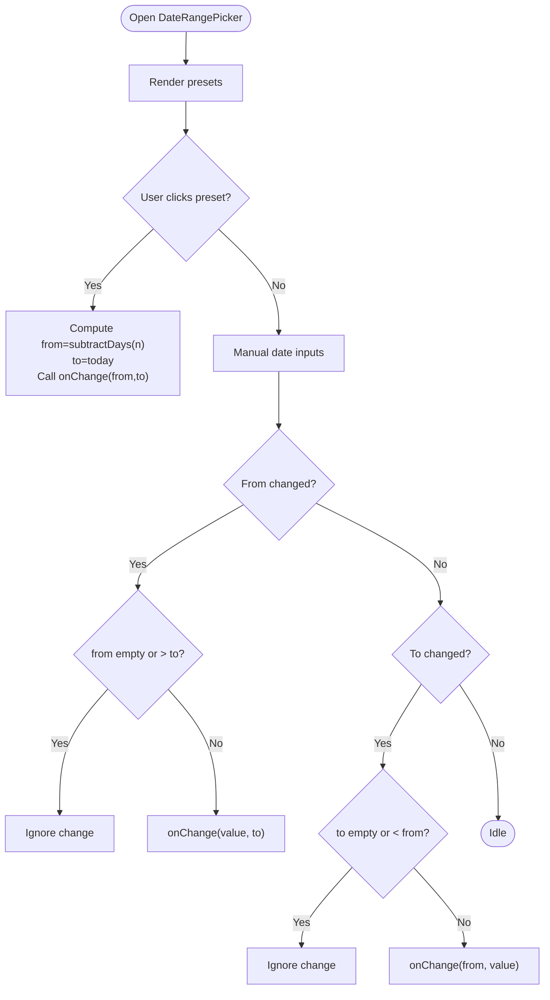
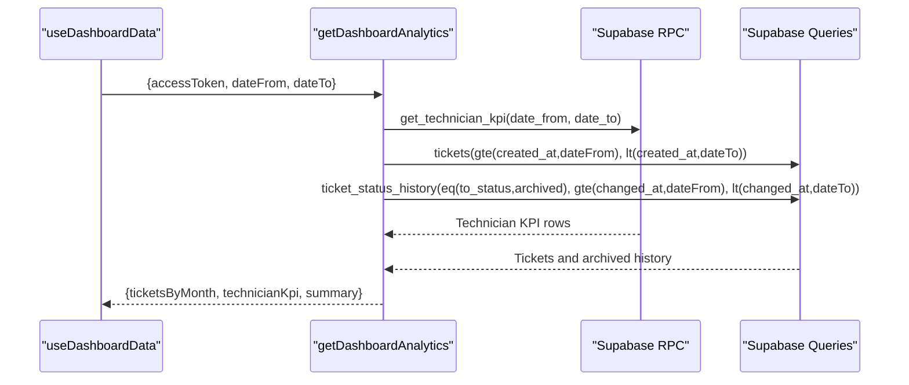
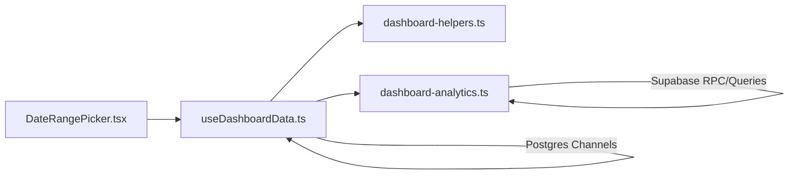

# Date Range Filtering and Time Period Management

<cite>
**Referenced Files in This Document**
- [DateRangePicker.tsx](file://src/components/dashboard/DateRangePicker.tsx)
- [dashboard-analytics.ts](file://src/lib/dashboard-analytics.ts)
- [dashboard-helpers.ts](file://src/lib/dashboard-helpers.ts)
- [useDashboardData.ts](file://src/hooks/useDashboardData.ts)
- [dashboard.tsx](file://src/routes/_app/dashboard.tsx)
- [analytics-format.ts](file://src/components/dashboard/analytics-format.ts)
</cite>

## Table of Contents
1. [Introduction](#introduction)
2. [Project Structure](#project-structure)
3. [Core Components](#core-components)
4. [Architecture Overview](#architecture-overview)
5. [Detailed Component Analysis](#detailed-component-analysis)
6. [Dependency Analysis](#dependency-analysis)
7. [Performance Considerations](#performance-considerations)
8. [Troubleshooting Guide](#troubleshooting-guide)
9. [Conclusion](#conclusion)

## Introduction
This document explains the date range filtering and time period management system used across the dashboard. It covers the DateRangePicker component, preset time ranges, custom date selection, validation logic, and how date ranges are transformed into analytics queries. It also documents time period calculations, ISO week handling, timezone considerations, and the integration between the UI and analytics server functions. Edge cases such as month boundaries, leap years, and daylight saving transitions are addressed, along with real-time data updates and analytics formatting utilities.

## Project Structure
The date range system spans three primary areas:
- UI component for date selection
- Utilities for date conversions and labels
- Analytics server functions that accept validated date ranges and compute metrics

**Diagram sources**
- [DateRangePicker.tsx:1-96](file://src/components/dashboard/DateRangePicker.tsx#L1-L96)
- [dashboard-helpers.ts:1-72](file://src/lib/dashboard-helpers.ts#L1-L72)
- [useDashboardData.ts:1-159](file://src/hooks/useDashboardData.ts#L1-L159)
- [dashboard-analytics.ts:1-559](file://src/lib/dashboard-analytics.ts#L1-L559)
- [dashboard.tsx:123-168](file://src/routes/_app/dashboard.tsx#L123-L168)
- [analytics-format.ts:1-6](file://src/components/dashboard/analytics-format.ts#L1-L6)

**Section sources**
- [DateRangePicker.tsx:1-96](file://src/components/dashboard/DateRangePicker.tsx#L1-L96)
- [dashboard-helpers.ts:1-72](file://src/lib/dashboard-helpers.ts#L1-L72)
- [useDashboardData.ts:1-159](file://src/hooks/useDashboardData.ts#L1-L159)
- [dashboard-analytics.ts:1-559](file://src/lib/dashboard-analytics.ts#L1-L559)
- [dashboard.tsx:123-168](file://src/routes/_app/dashboard.tsx#L123-L168)
- [analytics-format.ts:1-6](file://src/components/dashboard/analytics-format.ts#L1-L6)

## Core Components
- DateRangePicker: Provides preset ranges and manual date inputs with validation.
- Helpers: Convert dates to ISO strings, compute daily counts, and format period labels.
- Analytics server functions: Enforce input validation and compute KPIs by month and technician.
- Hook: Orchestrates fetching analytics and real-time updates based on the selected range.
- Formatting utilities: Normalize display of durations across the UI.

**Section sources**
- [DateRangePicker.tsx:1-96](file://src/components/dashboard/DateRangePicker.tsx#L1-L96)
- [dashboard-helpers.ts:27-71](file://src/lib/dashboard-helpers.ts#L27-L71)
- [dashboard-analytics.ts:30-34](file://src/lib/dashboard-analytics.ts#L30-L34)
- [useDashboardData.ts:19-123](file://src/hooks/useDashboardData.ts#L19-L123)
- [analytics-format.ts:1-6](file://src/components/dashboard/analytics-format.ts#L1-L6)

## Architecture Overview
The date range lifecycle:
- User selects a range via DateRangePicker.
- The hook converts the selected dates to inclusive ISO timestamps.
- Analytics server functions receive validated dateFrom/dateTo and compute metrics.
- Real-time channels subscribe to database changes for the selected range and trigger refetches.

**Diagram sources**
- [DateRangePicker.tsx:16-29](file://src/components/dashboard/DateRangePicker.tsx#L16-L29)
- [useDashboardData.ts:114-123](file://src/hooks/useDashboardData.ts#L114-L123)
- [dashboard-helpers.ts:39-45](file://src/lib/dashboard-helpers.ts#L39-L45)
- [dashboard-analytics.ts:36-60](file://src/lib/dashboard-analytics.ts#L36-L60)

## Detailed Component Analysis

### DateRangePicker Component
Implements:
- Preset ranges: 7 days, 30 days, 90 days, 180 days.
- Manual date inputs with min/max constraints to prevent invalid selections.
- Active preset detection based on computed boundaries.

Key behaviors:
- Preset application computes from as “today minus N days” and to as “today”.
- Input validation prevents from > to and vice versa.
- Uses local date conversion helpers to maintain consistent date strings.

**Diagram sources**
- [DateRangePicker.tsx:16-29](file://src/components/dashboard/DateRangePicker.tsx#L16-L29)
- [DateRangePicker.tsx:79-95](file://src/components/dashboard/DateRangePicker.tsx#L79-L95)

**Section sources**
- [DateRangePicker.tsx:9-14](file://src/components/dashboard/DateRangePicker.tsx#L9-L14)
- [DateRangePicker.tsx:16-29](file://src/components/dashboard/DateRangePicker.tsx#L16-L29)
- [DateRangePicker.tsx:79-95](file://src/components/dashboard/DateRangePicker.tsx#L79-L95)

### Date Calculation Algorithms and Time Zone Handling
- Local date conversion: The component uses local date arithmetic for presets and converts to date-only strings suitable for HTML input elements.
- Inclusive range semantics: The hook transforms date-only strings into ISO timestamps representing the start and end of the chosen days.
- ISO week handling: Dedicated server functions compute ISO week start (Monday) and weekly windows for technician activity.

Important notes:
- Date-only strings are converted to UTC-like ISO timestamps with time offsets to define inclusive day boundaries.
- ISO week calculations rely on local time arithmetic to determine the Monday-aligned window.

**Section sources**
- [DateRangePicker.tsx:79-91](file://src/components/dashboard/DateRangePicker.tsx#L79-L91)
- [dashboard-helpers.ts:39-45](file://src/lib/dashboard-helpers.ts#L39-L45)
- [dashboard-analytics.ts:174-184](file://src/lib/dashboard-analytics.ts#L174-L184)
- [dashboard-analytics.ts:264-271](file://src/lib/dashboard-analytics.ts#L264-L271)

### Integration Between Date Filters and Analytics Server Functions
- Input validation: The analytics server function validates accessToken presence and enforces datetime strings for dateFrom/dateTo.
- Query orchestration: Parallel RPC and queries fetch technician KPIs, tickets, and archived history; archived timestamps are mapped to close dates when closed_at is missing.
- Aggregation: Monthly buckets are generated from the requested range; resolution durations are computed per closed ticket; averages are aggregated across months and technicians.

**Diagram sources**
- [dashboard-analytics.ts:36-60](file://src/lib/dashboard-analytics.ts#L36-L60)
- [dashboard-analytics.ts:77-116](file://src/lib/dashboard-analytics.ts#L77-L116)
- [dashboard-analytics.ts:118-139](file://src/lib/dashboard-analytics.ts#L118-L139)

**Section sources**
- [dashboard-analytics.ts:30-34](file://src/lib/dashboard-analytics.ts#L30-L34)
- [dashboard-analytics.ts:44-60](file://src/lib/dashboard-analytics.ts#L44-L60)
- [dashboard-analytics.ts:77-116](file://src/lib/dashboard-analytics.ts#L77-L116)
- [dashboard-analytics.ts:118-139](file://src/lib/dashboard-analytics.ts#L118-L139)

### Real-Time Data Updates and Edge Cases
- Real-time subscription: The hook subscribes to Postgres changes for key tables and refetches dashboard data when the selected range changes.
- Edge cases handled:
  - Month boundaries: Monthly aggregation uses month-key generation from the start of the requested month.
  - Leap years: Date arithmetic naturally accounts for leap years.
  - Daylight saving transitions: Using date-only strings and local arithmetic avoids DST ambiguity for UI; inclusive day boundaries are defined via ISO timestamps.

**Section sources**
- [useDashboardData.ts:101-112](file://src/hooks/useDashboardData.ts#L101-L112)
- [dashboard-analytics.ts:77-79](file://src/lib/dashboard-analytics.ts#L77-L79)
- [dashboard-analytics.ts:119-126](file://src/lib/dashboard-analytics.ts#L119-L126)

### Analytics Formatting Utilities
- Duration formatting: Converts numeric days into human-friendly labels (e.g., hours vs. days) with a fallback for null/invalid values.
- Consistent display: Ensures uniform presentation of time periods across widgets and reports.

**Section sources**
- [analytics-format.ts:1-6](file://src/components/dashboard/analytics-format.ts#L1-L6)

## Dependency Analysis
- DateRangePicker depends on local date helpers for preset computations and input validation.
- useDashboardData orchestrates date conversion and triggers analytics loads.
- dashboard-analytics enforces input validation and performs heavy lifting for aggregations.
- Real-time updates depend on Supabase channels keyed by the selected range.

**Diagram sources**
- [DateRangePicker.tsx:16-29](file://src/components/dashboard/DateRangePicker.tsx#L16-L29)
- [useDashboardData.ts:114-123](file://src/hooks/useDashboardData.ts#L114-L123)
- [dashboard-helpers.ts:39-45](file://src/lib/dashboard-helpers.ts#L39-L45)
- [dashboard-analytics.ts:36-60](file://src/lib/dashboard-analytics.ts#L36-L60)

**Section sources**
- [DateRangePicker.tsx:16-29](file://src/components/dashboard/DateRangePicker.tsx#L16-L29)
- [useDashboardData.ts:114-123](file://src/hooks/useDashboardData.ts#L114-L123)
- [dashboard-helpers.ts:39-45](file://src/lib/dashboard-helpers.ts#L39-L45)
- [dashboard-analytics.ts:36-60](file://src/lib/dashboard-analytics.ts#L36-L60)

## Performance Considerations
- Minimize re-renders: The hook memoizes derived values (range, periodLabel) and analytics results.
- Efficient aggregation: Monthly grouping and Map-based accumulation reduce nested loops.
- Parallelization: Analytics fetches use Promise.all to minimize latency.
- Real-time efficiency: Subscriptions are scoped to the selected range to avoid unnecessary updates.

[No sources needed since this section provides general guidance]

## Troubleshooting Guide
Common issues and resolutions:
- Invalid date range: Ensure from ≤ to; the component enforces this via min/max attributes and validation handlers.
- Authentication failures: Analytics functions require a valid accessToken; errors are surfaced as unauthorized responses.
- Empty or partial data: Archived tickets are treated as closed when closed_at is missing; confirm that archived history exists for accurate closure counts.
- Real-time gaps: Verify that the Postgres channel subscription is active for the selected range and that database policies permit change events.

**Section sources**
- [DateRangePicker.tsx:21-29](file://src/components/dashboard/DateRangePicker.tsx#L21-L29)
- [dashboard-analytics.ts:40-42](file://src/lib/dashboard-analytics.ts#L40-L42)
- [dashboard-analytics.ts:100-115](file://src/lib/dashboard-analytics.ts#L100-L115)
- [useDashboardData.ts:101-112](file://src/hooks/useDashboardData.ts#L101-L112)

## Conclusion
The date range filtering system combines a user-friendly DateRangePicker with robust date conversion helpers and strict analytics input validation. It supports flexible presets, precise manual selection, and reliable monthly/weekly aggregations. Real-time subscriptions keep dashboards fresh, while formatting utilities ensure consistent display. The design balances usability for report authors with developer-friendly abstractions for custom time-based analytics.