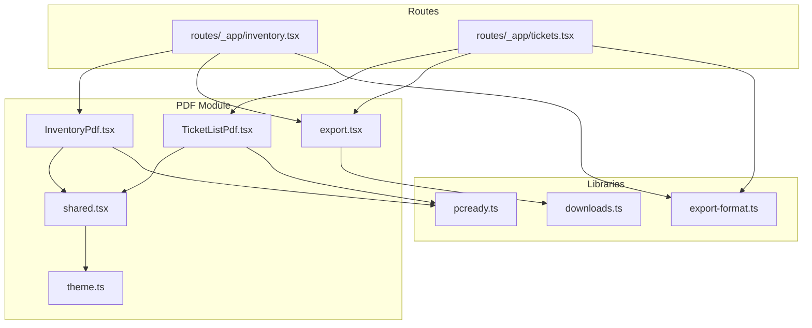
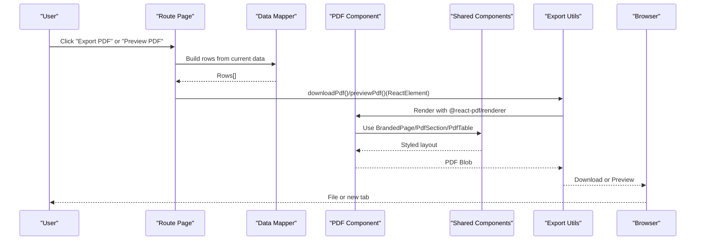
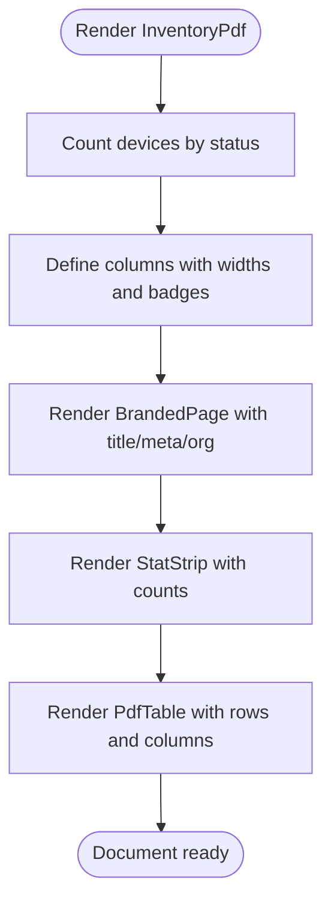
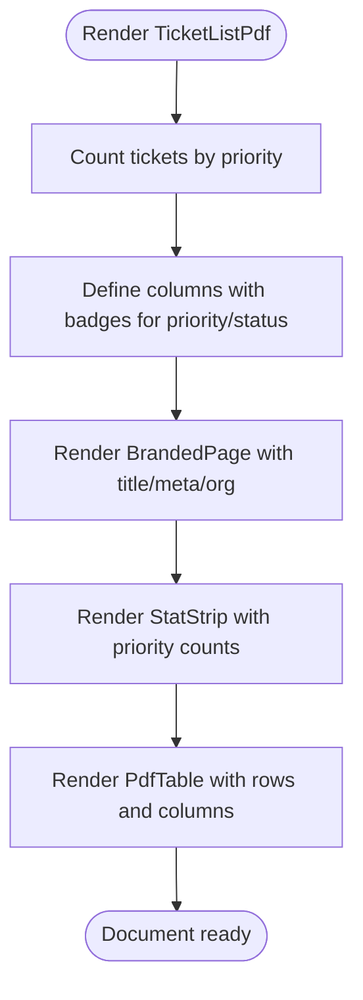
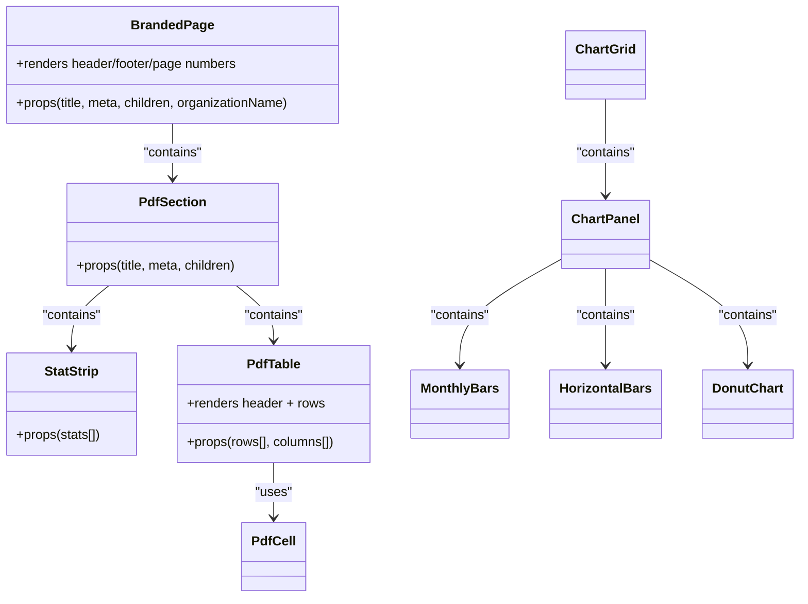
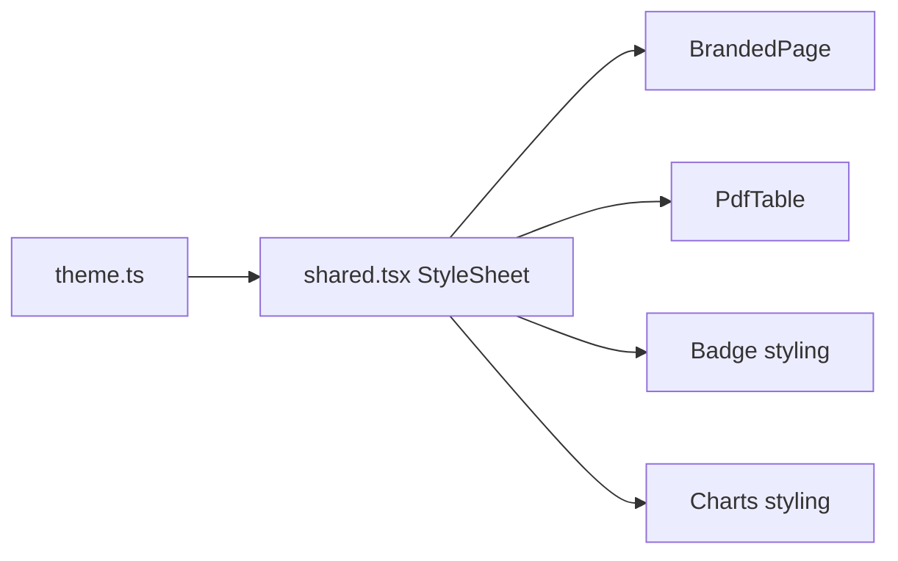
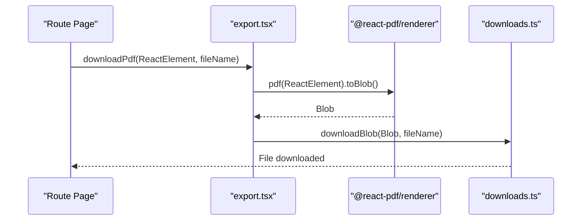
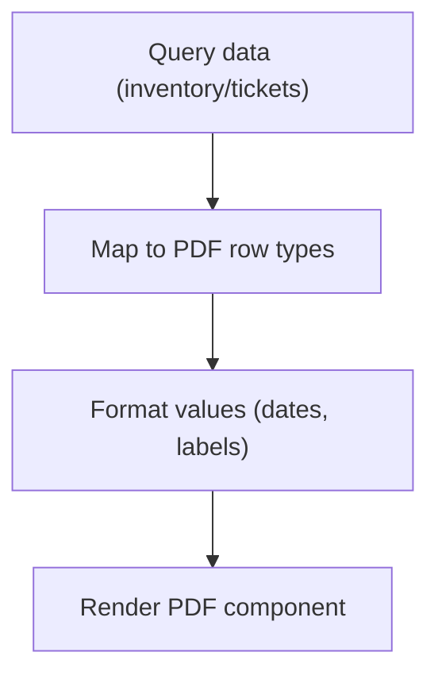
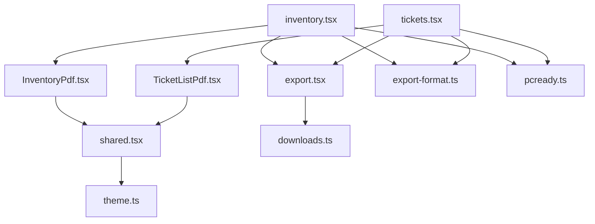

# PDF Report Generation System

<cite>
**Referenced Files in This Document**
- [InventoryPdf.tsx](file://src/components/pcready/pdf/InventoryPdf.tsx)
- [TicketListPdf.tsx](file://src/components/pcready/pdf/TicketListPdf.tsx)
- [export.tsx](file://src/components/pcready/pdf/export.tsx)
- [shared.tsx](file://src/components/pcready/pdf/shared.tsx)
- [theme.ts](file://src/components/pcready/pdf/theme.ts)
- [pcready.ts](file://src/lib/pcready.ts)
- [inventory.tsx](file://src/routes/_app/inventory.tsx)
- [tickets.tsx](file://src/routes/_app/tickets.tsx)
- [downloads.ts](file://src/lib/downloads.ts)
- [export-format.ts](file://src/lib/export-format.ts)
- [inventory-labels.ts](file://src/lib/inventory-labels.ts)
</cite>

## Table of Contents

1. [Introduction](#introduction)
2. [Project Structure](#project-structure)
3. [Core Components](#core-components)
4. [Architecture Overview](#architecture-overview)
5. [Detailed Component Analysis](#detailed-component-analysis)
6. [Dependency Analysis](#dependency-analysis)
7. [Performance Considerations](#performance-considerations)
8. [Troubleshooting Guide](#troubleshooting-guide)
9. [Conclusion](#conclusion)
10. [Appendices](#appendices)

## Introduction

This document explains the PDF report generation system used to produce print-friendly reports for inventory and ticket lists. It covers the React PDF Renderer-based architecture, shared styling and theming, data transformation from database-backed lists into PDF-ready structures, and the end-to-end export workflow from user actions to generated PDFs. It also addresses performance, memory management, browser compatibility, and integration with printing systems and downloads.

## Project Structure

The PDF system is organized under a dedicated module with reusable components, a theme, and export utilities:

- PDF components: InventoryPdf and TicketListPdf
- Shared building blocks: BrandedPage, PdfSection, StatStrip, PdfTable, charts, and layout helpers
- Theme and palette: fonts and color tokens
- Export utilities: download and preview wrappers around React PDF Renderer
- Data mapping and formatting: helpers in pcready.ts and route-specific transformers
- Downloads and filenames: utilities for consistent naming and blob handling

**Diagram sources**

- [InventoryPdf.tsx:1-93](file://src/components/pcready/pdf/InventoryPdf.tsx#L1-L93)
- [TicketListPdf.tsx:1-125](file://src/components/pcready/pdf/TicketListPdf.tsx#L1-L125)
- [shared.tsx:1-612](file://src/components/pcready/pdf/shared.tsx#L1-L612)
- [theme.ts:1-30](file://src/components/pcready/pdf/theme.ts#L1-L30)
- [export.tsx:1-18](file://src/components/pcready/pdf/export.tsx#L1-L18)
- [pcready.ts:1-241](file://src/lib/pcready.ts#L1-L241)
- [inventory.tsx:140-339](file://src/routes/_app/inventory.tsx#L140-L339)
- [tickets.tsx:140-339](file://src/routes/_app/tickets.tsx#L140-L339)
- [downloads.ts:1-190](file://src/lib/downloads.ts#L1-L190)
- [export-format.ts:1-35](file://src/lib/export-format.ts#L1-L35)

**Section sources**

- [InventoryPdf.tsx:1-93](file://src/components/pcready/pdf/InventoryPdf.tsx#L1-L93)
- [TicketListPdf.tsx:1-125](file://src/components/pcready/pdf/TicketListPdf.tsx#L1-L125)
- [shared.tsx:1-612](file://src/components/pcready/pdf/shared.tsx#L1-L612)
- [theme.ts:1-30](file://src/components/pcready/pdf/theme.ts#L1-L30)
- [export.tsx:1-18](file://src/components/pcready/pdf/export.tsx#L1-L18)
- [pcready.ts:1-241](file://src/lib/pcready.ts#L1-L241)
- [inventory.tsx:140-339](file://src/routes/_app/inventory.tsx#L140-L339)
- [tickets.tsx:140-339](file://src/routes/_app/tickets.tsx#L140-L339)
- [downloads.ts:1-190](file://src/lib/downloads.ts#L1-L190)
- [export-format.ts:1-35](file://src/lib/export-format.ts#L1-L35)

## Core Components

- InventoryPdf: Builds an inventory report with status statistics and a paginated table of devices.
- TicketListPdf: Builds a ticket listing with priority/status badges and a table of tickets.
- BrandedPage: Standardized page header/footer with branding, metadata, and page numbering.
- PdfSection: Section divider with title and optional metadata.
- StatStrip: Compact statistics cards for quick overview.
- PdfTable: Generic table renderer with configurable columns, widths, monospaced cells, and optional badges.
- Charts: Monthly bars, horizontal bars, and a donut chart for visual summaries (shared utilities).
- Theme: Palette and fonts for consistent print-friendly styling.
- Export utilities: downloadPdf and previewPdf orchestrate rendering and delivery.

**Section sources**

- [InventoryPdf.tsx:26-93](file://src/components/pcready/pdf/InventoryPdf.tsx#L26-L93)
- [TicketListPdf.tsx:27-125](file://src/components/pcready/pdf/TicketListPdf.tsx#L27-L125)
- [shared.tsx:308-355](file://src/components/pcready/pdf/shared.tsx#L308-L355)
- [shared.tsx:357-390](file://src/components/pcready/pdf/shared.tsx#L357-L390)
- [shared.tsx:357-369](file://src/components/pcready/pdf/shared.tsx#L357-L369)
- [shared.tsx:560-588](file://src/components/pcready/pdf/shared.tsx#L560-L588)
- [shared.tsx:405-442](file://src/components/pcready/pdf/shared.tsx#L405-L442)
- [shared.tsx:444-483](file://src/components/pcready/pdf/shared.tsx#L444-L483)
- [shared.tsx:485-514](file://src/components/pcready/pdf/shared.tsx#L485-L514)
- [theme.ts:1-30](file://src/components/pcready/pdf/theme.ts#L1-L30)
- [export.tsx:1-18](file://src/components/pcready/pdf/export.tsx#L1-L18)

## Architecture Overview

The system follows a layered pattern:

- Presentation layer: Route pages (inventory and tickets) collect data and trigger exports.
- Data mapping: Route-specific transformers convert database-backed records into PDF-ready rows.
- Rendering layer: PDF components assemble branded pages, sections, statistics, and tables.
- Export layer: Utilities render the React PDF tree to a Blob and either download or preview.

**Diagram sources**

- [inventory.tsx:142-176](file://src/routes/_app/inventory.tsx#L142-L176)
- [tickets.tsx:161-195](file://src/routes/_app/tickets.tsx#L161-L195)
- [InventoryPdf.tsx:26-85](file://src/components/pcready/pdf/InventoryPdf.tsx#L26-L85)
- [TicketListPdf.tsx:27-96](file://src/components/pcready/pdf/TicketListPdf.tsx#L27-L96)
- [shared.tsx:308-355](file://src/components/pcready/pdf/shared.tsx#L308-L355)
- [shared.tsx:560-588](file://src/components/pcready/pdf/shared.tsx#L560-L588)
- [export.tsx:5-17](file://src/components/pcready/pdf/export.tsx#L5-L17)

## Detailed Component Analysis

### Inventory Report PDF Component

- Purpose: Produce an inventory report with device counts by status and a detailed table.
- Data mapping: Converts device records to DevicePdfRow with formatted dates and truncated identifiers.
- Layout: Uses BrandedPage, StatStrip for counts, and PdfTable with columns for ID, model, serial, OS, status badge, client, assigned user, and last update.

**Diagram sources**

- [InventoryPdf.tsx:26-93](file://src/components/pcready/pdf/InventoryPdf.tsx#L26-L93)
- [shared.tsx:308-355](file://src/components/pcready/pdf/shared.tsx#L308-L355)
- [shared.tsx:357-369](file://src/components/pcready/pdf/shared.tsx#L357-L369)
- [shared.tsx:560-588](file://src/components/pcready/pdf/shared.tsx#L560-L588)

**Section sources**

- [InventoryPdf.tsx:8-17](file://src/components/pcready/pdf/InventoryPdf.tsx#L8-L17)
- [InventoryPdf.tsx:19-24](file://src/components/pcready/pdf/InventoryPdf.tsx#L19-L24)
- [InventoryPdf.tsx:43-62](file://src/components/pcready/pdf/InventoryPdf.tsx#L43-L62)
- [InventoryPdf.tsx:64-85](file://src/components/pcready/pdf/InventoryPdf.tsx#L64-L85)

### Ticket List Report PDF Component

- Purpose: Produce a ticket list report with priority and status badges and a detailed table.
- Data mapping: Converts ticket records to TicketPdfRow with formatted dates and labels.
- Layout: Uses BrandedPage, StatStrip for priority counts, and PdfTable with columns for ID, model, serial, client, requester, type, priority badge, status badge, assignee, and creation date.

**Diagram sources**

- [TicketListPdf.tsx:27-125](file://src/components/pcready/pdf/TicketListPdf.tsx#L27-L125)
- [shared.tsx:308-355](file://src/components/pcready/pdf/shared.tsx#L308-L355)
- [shared.tsx:357-369](file://src/components/pcready/pdf/shared.tsx#L357-L369)
- [shared.tsx:560-588](file://src/components/pcready/pdf/shared.tsx#L560-L588)

**Section sources**

- [TicketListPdf.tsx:14-25](file://src/components/pcready/pdf/TicketListPdf.tsx#L14-L25)
- [TicketListPdf.tsx:34-75](file://src/components/pcready/pdf/TicketListPdf.tsx#L34-L75)
- [TicketListPdf.tsx:77-96](file://src/components/pcready/pdf/TicketListPdf.tsx#L77-L96)

### Shared Components and Layout

- BrandedPage: Provides standardized header/footer, page numbering, and organization branding.
- PdfSection: Section title and metadata.
- StatStrip: Compact statistics panels.
- PdfTable: Generic table with alternating row colors, fixed headers, and configurable columns.
- Charts: Vertical bars, horizontal bars, and a donut chart for summary visuals.

**Diagram sources**

- [shared.tsx:308-355](file://src/components/pcready/pdf/shared.tsx#L308-L355)
- [shared.tsx:371-390](file://src/components/pcready/pdf/shared.tsx#L371-L390)
- [shared.tsx:357-369](file://src/components/pcready/pdf/shared.tsx#L357-L369)
- [shared.tsx:560-588](file://src/components/pcready/pdf/shared.tsx#L560-L588)
- [shared.tsx:392-403](file://src/components/pcready/pdf/shared.tsx#L392-L403)
- [shared.tsx:405-442](file://src/components/pcready/pdf/shared.tsx#L405-L442)
- [shared.tsx:444-483](file://src/components/pcready/pdf/shared.tsx#L444-L483)
- [shared.tsx:485-514](file://src/components/pcready/pdf/shared.tsx#L485-L514)

**Section sources**

- [shared.tsx:308-355](file://src/components/pcready/pdf/shared.tsx#L308-L355)
- [shared.tsx:357-390](file://src/components/pcready/pdf/shared.tsx#L357-L390)
- [shared.tsx:357-369](file://src/components/pcready/pdf/shared.tsx#L357-L369)
- [shared.tsx:560-588](file://src/components/pcready/pdf/shared.tsx#L560-L588)
- [shared.tsx:405-442](file://src/components/pcready/pdf/shared.tsx#L405-L442)
- [shared.tsx:444-483](file://src/components/pcready/pdf/shared.tsx#L444-L483)
- [shared.tsx:485-514](file://src/components/pcready/pdf/shared.tsx#L485-L514)

### Theme and Styling

- Palette: Defines print-safe colors for ink, backgrounds, surfaces, borders, and semantic accents.
- Fonts: Body, bold, and monospace families optimized for readability in PDFs.
- Styles: Centralized StyleSheet for page, header, footer, tables, badges, and charts.

**Diagram sources**

- [theme.ts:1-30](file://src/components/pcready/pdf/theme.ts#L1-L30)
- [shared.tsx:22-306](file://src/components/pcready/pdf/shared.tsx#L22-L306)

**Section sources**

- [theme.ts:1-30](file://src/components/pcready/pdf/theme.ts#L1-L30)
- [shared.tsx:22-306](file://src/components/pcready/pdf/shared.tsx#L22-L306)

### Export Workflow

- downloadPdf: Renders a React PDF element to a Blob and triggers a download with a generated filename.
- previewPdf: Renders a React PDF element to a Blob and opens a new tab for preview.
- Route integration: Both inventory and tickets pages call these functions after preparing rows and organization name.

**Diagram sources**

- [export.tsx:5-17](file://src/components/pcready/pdf/export.tsx#L5-L17)
- [downloads.ts:21-42](file://src/lib/downloads.ts#L21-L42)
- [inventory.tsx:142-176](file://src/routes/_app/inventory.tsx#L142-L176)
- [tickets.tsx:161-195](file://src/routes/_app/tickets.tsx#L161-L195)

**Section sources**

- [export.tsx:1-18](file://src/components/pcready/pdf/export.tsx#L1-L18)
- [downloads.ts:14-55](file://src/lib/downloads.ts#L14-L55)
- [export-format.ts:8-17](file://src/lib/export-format.ts#L8-L17)
- [inventory.tsx:142-176](file://src/routes/_app/inventory.tsx#L142-L176)
- [tickets.tsx:161-195](file://src/routes/_app/tickets.tsx#L161-L195)

### Data Transformation Patterns

- Inventory: Transforms device records to DevicePdfRow with status labels and formatted dates.
- Tickets: Transforms ticket records to TicketPdfRow with type, priority, and status labels.
- Formatting: Uses localized date formatting helpers from pcready.ts.

**Diagram sources**

- [inventory.tsx:142-176](file://src/routes/_app/inventory.tsx#L142-L176)
- [tickets.tsx:146-159](file://src/routes/_app/tickets.tsx#L146-L159)
- [pcready.ts:161-186](file://src/lib/pcready.ts#L161-L186)

**Section sources**

- [inventory.tsx:142-176](file://src/routes/_app/inventory.tsx#L142-L176)
- [tickets.tsx:146-159](file://src/routes/_app/tickets.tsx#L146-L159)
- [pcready.ts:161-186](file://src/lib/pcready.ts#L161-L186)

## Dependency Analysis

- Route pages depend on data mapping and export utilities.
- PDF components depend on shared layout and theme.
- Export utilities depend on downloads and filename helpers.
- Data mapping depends on pcready.ts for labels and formatting.

**Diagram sources**

- [inventory.tsx:142-176](file://src/routes/_app/inventory.tsx#L142-L176)
- [tickets.tsx:161-195](file://src/routes/_app/tickets.tsx#L161-L195)
- [InventoryPdf.tsx:1-4](file://src/components/pcready/pdf/InventoryPdf.tsx#L1-L4)
- [TicketListPdf.tsx:1-12](file://src/components/pcready/pdf/TicketListPdf.tsx#L1-L12)
- [shared.tsx:1-3](file://src/components/pcready/pdf/shared.tsx#L1-L3)
- [theme.ts:1-30](file://src/components/pcready/pdf/theme.ts#L1-L30)
- [export.tsx:1-3](file://src/components/pcready/pdf/export.tsx#L1-L3)
- [downloads.ts:1-12](file://src/lib/downloads.ts#L1-L12)
- [export-format.ts:1-17](file://src/lib/export-format.ts#L1-L17)
- [pcready.ts:1-241](file://src/lib/pcready.ts#L1-L241)

**Section sources**

- [inventory.tsx:142-176](file://src/routes/_app/inventory.tsx#L142-L176)
- [tickets.tsx:161-195](file://src/routes/_app/tickets.tsx#L161-L195)
- [InventoryPdf.tsx:1-4](file://src/components/pcready/pdf/InventoryPdf.tsx#L1-L4)
- [TicketListPdf.tsx:1-12](file://src/components/pcready/pdf/TicketListPdf.tsx#L1-L12)
- [shared.tsx:1-3](file://src/components/pcready/pdf/shared.tsx#L1-L3)
- [theme.ts:1-30](file://src/components/pcready/pdf/theme.ts#L1-L30)
- [export.tsx:1-3](file://src/components/pcready/pdf/export.tsx#L1-L3)
- [downloads.ts:1-12](file://src/lib/downloads.ts#L1-L12)
- [export-format.ts:1-17](file://src/lib/export-format.ts#L1-L17)
- [pcready.ts:1-241](file://src/lib/pcready.ts#L1-L241)

## Performance Considerations

- Rendering cost: Large datasets increase PDF generation time and memory usage. Consider:
  - Pagination or filtering to limit rows passed to the PDF component.
  - Defer heavy computations (e.g., badges, colors) to memoized helpers.
  - Avoid unnecessary re-renders by passing stable props and using keys thoughtfully.
- Memory management:
  - Revoke object URLs promptly after download/preview to prevent leaks.
  - Use short-lived previews with delayed revocation.
- Browser compatibility:
  - Ensure @react-pdf/renderer supports the target browsers and consider polyfills if needed.
  - Test print preview behavior across browsers.
- Print-friendly design:
  - Keep styles minimal and avoid dynamic content that may cause layout shifts.
  - Use fixed widths and wrap sparingly to reduce reflow.

[No sources needed since this section provides general guidance]

## Troubleshooting Guide

- Empty data export:
  - Routes guard against exporting when no rows are present and show user feedback.
- Export failures:
  - Errors are caught and surfaced via toast notifications; busy states are cleared in finally blocks.
- Blob handling:
  - downloadBlob and openBlobPreview manage object URL lifecycle; adjust revocation delays as needed.

**Section sources**

- [inventory.tsx:142-176](file://src/routes/_app/inventory.tsx#L142-L176)
- [tickets.tsx:161-195](file://src/routes/_app/tickets.tsx#L161-L195)
- [downloads.ts:21-42](file://src/lib/downloads.ts#L21-L42)

## Conclusion

The PDF report generation system leverages React PDF Renderer to deliver consistent, print-friendly reports for inventory and tickets. Its modular design separates concerns across data mapping, layout components, theming, and export utilities, enabling maintainable extensions and reliable performance. By following the patterns outlined here, teams can confidently add new report types and optimize for larger datasets.

[No sources needed since this section summarizes without analyzing specific files]

## Appendices

### Example Usage References

- Inventory export and preview in the inventory route:
  - [inventory.tsx:142-176](file://src/routes/_app/inventory.tsx#L142-L176)
- Ticket export and preview in the tickets route:
  - [tickets.tsx:161-195](file://src/routes/_app/tickets.tsx#L161-L195)
- PDF component usage:
  - [InventoryPdf.tsx:26-85](file://src/components/pcready/pdf/InventoryPdf.tsx#L26-L85)
  - [TicketListPdf.tsx:27-96](file://src/components/pcready/pdf/TicketListPdf.tsx#L27-L96)
- Export utilities:
  - [export.tsx:1-18](file://src/components/pcready/pdf/export.tsx#L1-L18)
- Downloads and filenames:
  - [downloads.ts:14-55](file://src/lib/downloads.ts#L14-L55)
  - [export-format.ts:8-17](file://src/lib/export-format.ts#L8-L17)
