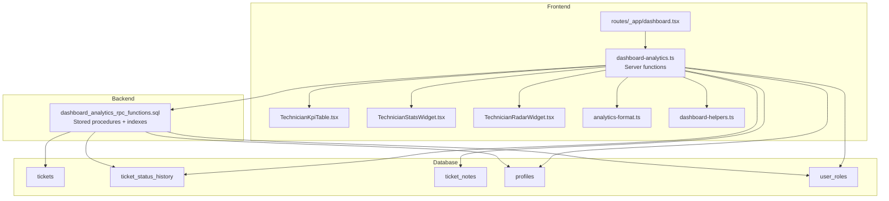
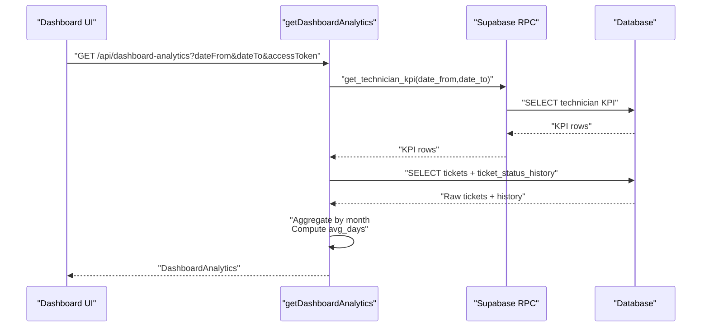
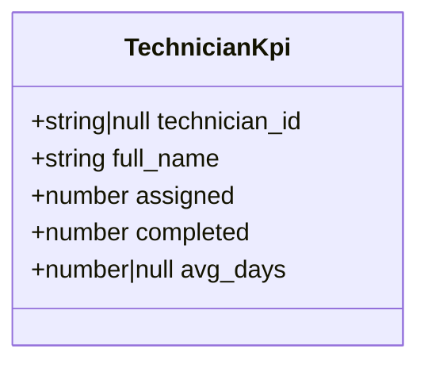
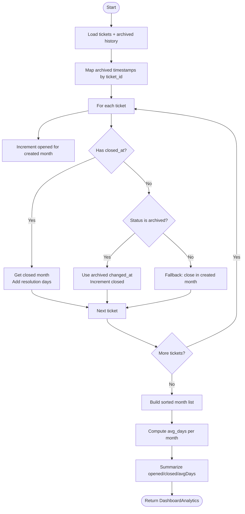
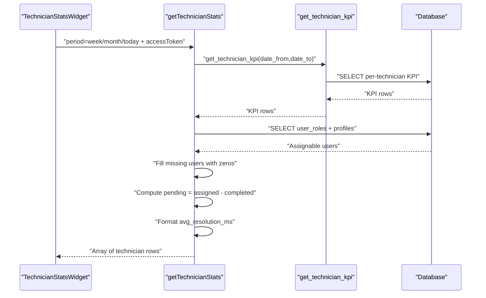
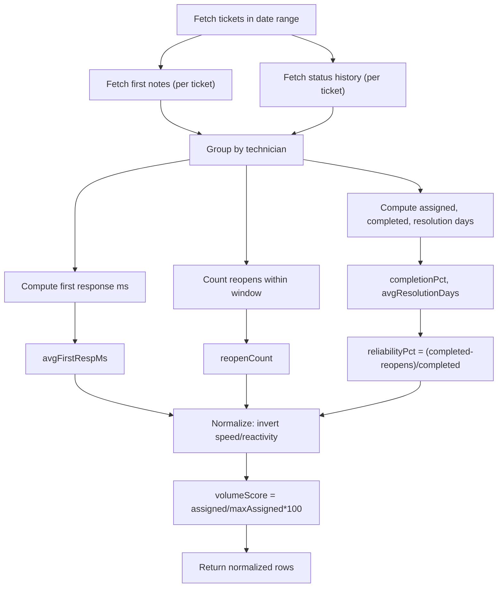
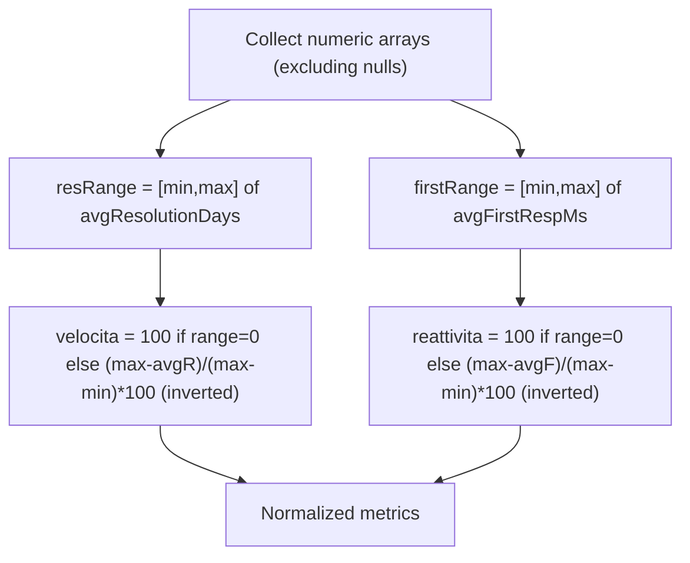
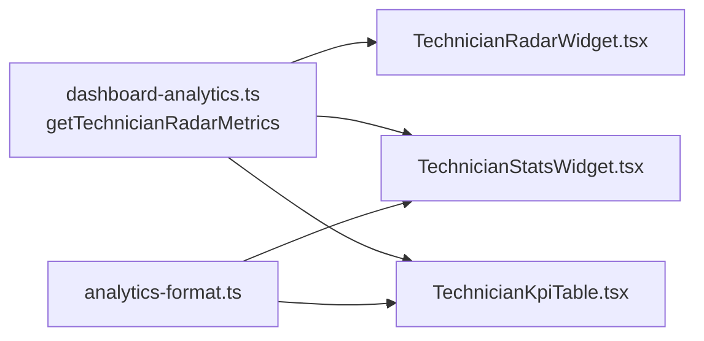
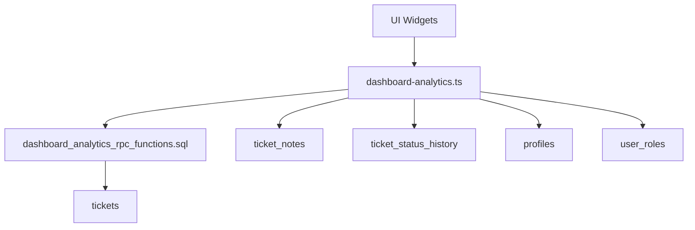

# Performance Metrics and KPI Calculation

<cite>
**Referenced Files in This Document**
- [dashboard-analytics.ts](file://src/lib/dashboard-analytics.ts)
- [TechnicianKpiTable.tsx](file://src/components/dashboard/TechnicianKpiTable.tsx)
- [TechnicianStatsWidget.tsx](file://src/components/dashboard/TechnicianStatsWidget.tsx)
- [TechnicianRadarWidget.tsx](file://src/components/dashboard/TechnicianRadarWidget.tsx)
- [analytics-format.ts](file://src/components/dashboard/analytics-format.ts)
- [dashboard-helpers.ts](file://src/lib/dashboard-helpers.ts)
- [dashboard.tsx](file://src/routes/_app/dashboard.tsx)
- [dashboard_analytics_rpc_functions.sql](file://supabase/migrations/20260511145300_dashboard_analytics_rpc_functions.sql)
- [fix_dashboard_analytics_closed_at.sql](file://supabase/migrations/20260513103000_fix_dashboard_analytics_closed_at.sql)
- [ticket-completion.server.ts](file://src/lib/ticket-completion.server.ts)
</cite>

## Table of Contents
1. [Introduction](#introduction)
2. [Project Structure](#project-structure)
3. [Core Components](#core-components)
4. [Architecture Overview](#architecture-overview)
5. [Detailed Component Analysis](#detailed-component-analysis)
6. [Dependency Analysis](#dependency-analysis)
7. [Performance Considerations](#performance-considerations)
8. [Troubleshooting Guide](#troubleshooting-guide)
9. [Conclusion](#conclusion)
10. [Appendices](#appendices)

## Introduction
This document explains the performance metrics and KPI calculation subsystem that powers the dashboard. It covers how raw ticket data is transformed into meaningful KPIs such as average resolution days, first response times, reopen rates, and completion percentages. It also documents the normalization techniques used for comparative analysis, the data aggregation logic, and how metrics feed into visualizations. The goal is to make the system understandable for managers interpreting performance data while providing developers with precise implementation details and optimization strategies.

## Project Structure
The KPI pipeline spans frontend server functions, backend stored procedures, and UI components:
- Frontend server functions orchestrate data fetching and computation.
- Backend stored procedures provide efficient aggregations and indexes.
- UI widgets render metrics and normalized scores.

**Diagram sources**
- [dashboard-analytics.ts:36-166](file://src/lib/dashboard-analytics.ts#L36-L166)
- [dashboard_analytics_rpc_functions.sql:31-97](file://supabase/migrations/20260511145300_dashboard_analytics_rpc_functions.sql#L31-L97)
- [TechnicianKpiTable.tsx:1-82](file://src/components/dashboard/TechnicianKpiTable.tsx#L1-L82)
- [TechnicianStatsWidget.tsx:1-173](file://src/components/dashboard/TechnicianStatsWidget.tsx#L1-L173)
- [TechnicianRadarWidget.tsx:1-184](file://src/components/dashboard/TechnicianRadarWidget.tsx#L1-L184)
- [analytics-format.ts:1-6](file://src/components/dashboard/analytics-format.ts#L1-L6)
- [dashboard-helpers.ts:1-72](file://src/lib/dashboard-helpers.ts#L1-L72)
- [dashboard.tsx:1-448](file://src/routes/_app/dashboard.tsx#L1-L448)

**Section sources**
- [dashboard-analytics.ts:36-166](file://src/lib/dashboard-analytics.ts#L36-L166)
- [dashboard_analytics_rpc_functions.sql:31-97](file://supabase/migrations/20260511145300_dashboard_analytics_rpc_functions.sql#L31-L97)
- [TechnicianKpiTable.tsx:1-82](file://src/components/dashboard/TechnicianKpiTable.tsx#L1-L82)
- [TechnicianStatsWidget.tsx:1-173](file://src/components/dashboard/TechnicianStatsWidget.tsx#L1-L173)
- [TechnicianRadarWidget.tsx:1-184](file://src/components/dashboard/TechnicianRadarWidget.tsx#L1-L184)
- [analytics-format.ts:1-6](file://src/components/dashboard/analytics-format.ts#L1-L6)
- [dashboard-helpers.ts:1-72](file://src/lib/dashboard-helpers.ts#L1-L72)
- [dashboard.tsx:1-448](file://src/routes/_app/dashboard.tsx#L1-L448)

## Core Components
- TechnicianKpi interface: Defines per-technician metrics used across widgets.
- DashboardAnalytics: Aggregated monthly and summary metrics for the dashboard.
- Server functions:
  - getDashboardAnalytics: Builds tickets-by-month and summary averages, and fetches technician KPIs via RPC.
  - getTechnicianStats: Computes per-technician assigned/completed/average-resolution and derived fields.
  - getTechnicianWeeklyActivity: Counts daily closures per technician for heatmaps.
  - getTechnicianRadarMetrics: Computes completion%, average resolution days, first response milliseconds, reopen counts, reliability%, and normalizes metrics.
- Formatting and helpers:
  - analytics-format.ts: Human-friendly display for average days.
  - dashboard-helpers.ts: CSV export, date utilities, and daily counts helper.

**Section sources**
- [dashboard-analytics.ts:4-28](file://src/lib/dashboard-analytics.ts#L4-L28)
- [dashboard-analytics.ts:36-166](file://src/lib/dashboard-analytics.ts#L36-L166)
- [dashboard-analytics.ts:168-251](file://src/lib/dashboard-analytics.ts#L168-L251)
- [dashboard-analytics.ts:253-331](file://src/lib/dashboard-analytics.ts#L253-L331)
- [dashboard-analytics.ts:333-554](file://src/lib/dashboard-analytics.ts#L333-L554)
- [analytics-format.ts:1-6](file://src/components/dashboard/analytics-format.ts#L1-L6)
- [dashboard-helpers.ts:1-72](file://src/lib/dashboard-helpers.ts#L1-L72)

## Architecture Overview
The system follows a layered approach:
- UI triggers server functions with date ranges and access tokens.
- Server functions validate auth, call Supabase RPCs and queries, and assemble metrics.
- Stored procedures aggregate counts and averages efficiently.
- Normalized metrics are returned for radar charts and tables.

**Diagram sources**
- [dashboard-analytics.ts:36-166](file://src/lib/dashboard-analytics.ts#L36-L166)
- [dashboard_analytics_rpc_functions.sql:77-97](file://supabase/migrations/20260511145300_dashboard_analytics_rpc_functions.sql#L77-L97)

## Detailed Component Analysis

### TechnicianKpi Interface and Data Model
The TechnicianKpi interface captures per-technician performance for quick rendering in tables and widgets.

**Diagram sources**
- [dashboard-analytics.ts:12-18](file://src/lib/dashboard-analytics.ts#L12-L18)

**Section sources**
- [dashboard-analytics.ts:12-18](file://src/lib/dashboard-analytics.ts#L12-L18)

### Monthly Ticket Aggregation and Average Resolution Days
The getDashboardAnalytics function aggregates tickets by month and computes average resolution days. It treats archived tickets as closed when appropriate and falls back to created month if needed.

**Diagram sources**
- [dashboard-analytics.ts:36-166](file://src/lib/dashboard-analytics.ts#L36-L166)

**Section sources**
- [dashboard-analytics.ts:36-166](file://src/lib/dashboard-analytics.ts#L36-L166)

### Technician Productivity Metrics and Completion Rates
The getTechnicianStats function builds per-technician rows including assigned, completed, pending, average resolution in days and milliseconds, and a boolean flag for activity. It ensures all assignable users appear, even with zero metrics.

**Diagram sources**
- [dashboard-analytics.ts:168-251](file://src/lib/dashboard-analytics.ts#L168-L251)

**Section sources**
- [dashboard-analytics.ts:168-251](file://src/lib/dashboard-analytics.ts#L168-L251)

### First Response Times and Reopen Rates
The getTechnicianRadarMetrics function computes:
- Completion percentage: completed / assigned
- Average resolution days: only when closed_at is present
- First response milliseconds: difference between first note and ticket creation
- Reopen count: transitions to pending/open after closed/archived within the selected window
- Reliability percentage: (completed - reopens) / completed
It then normalizes metrics to 0–100 scale, inverting “speed” and “reactivity” so lower values are better.

**Diagram sources**
- [dashboard-analytics.ts:333-554](file://src/lib/dashboard-analytics.ts#L333-L554)

**Section sources**
- [dashboard-analytics.ts:333-554](file://src/lib/dashboard-analytics.ts#L333-L554)

### Normalization Techniques: Min-Max Scaling and Percentiles
Normalization is applied to enable fair comparisons:
- Volume score: simple min-max scaling against team max assigned.
- Speed and Reactivity: inverted min-max scaling so lower values are better.
- Completion and Reliability: already percentages, clamped to 0–100.

**Diagram sources**
- [dashboard-analytics.ts:507-551](file://src/lib/dashboard-analytics.ts#L507-L551)

**Section sources**
- [dashboard-analytics.ts:507-551](file://src/lib/dashboard-analytics.ts#L507-L551)

### Data Aggregation from Raw Tickets to Calculated Metrics
- Raw data sources:
  - tickets: created_at, closed_at, status, assignee_id
  - ticket_status_history: to_status/from_status/changing timestamps
  - ticket_notes: first update timestamps
- Aggregation logic:
  - Month buckets: opened per created month; closed per closed month or archived timestamp
  - Resolution days: closed_at minus created_at (only when closed_at exists)
  - Archived handling: if closed_at is null but status is archived, use earliest archived timestamp
  - Technician KPIs: assigned and completed within date range; average resolution days filtered to closed tickets

**Section sources**
- [dashboard-analytics.ts:36-166](file://src/lib/dashboard-analytics.ts#L36-L166)
- [dashboard_analytics_rpc_functions.sql:31-97](file://supabase/migrations/20260511145300_dashboard_analytics_rpc_functions.sql#L31-L97)

### Visualization Integration
- TechnicianKpiTable: renders per-technician assigned/completed and average days with progress bars and workload badges.
- TechnicianStatsWidget: displays per-technician cards with completion percentage and formatted average resolution duration.
- TechnicianRadarWidget: shows normalized metrics (volume, speed, completion, reactivity, reliability) in radar charts, with optional “show all”.

**Diagram sources**
- [dashboard-analytics.ts:333-554](file://src/lib/dashboard-analytics.ts#L333-L554)
- [TechnicianKpiTable.tsx:1-82](file://src/components/dashboard/TechnicianKpiTable.tsx#L1-L82)
- [TechnicianStatsWidget.tsx:1-173](file://src/components/dashboard/TechnicianStatsWidget.tsx#L1-L173)
- [TechnicianRadarWidget.tsx:1-184](file://src/components/dashboard/TechnicianRadarWidget.tsx#L1-L184)
- [analytics-format.ts:1-6](file://src/components/dashboard/analytics-format.ts#L1-L6)

**Section sources**
- [TechnicianKpiTable.tsx:1-82](file://src/components/dashboard/TechnicianKpiTable.tsx#L1-L82)
- [TechnicianStatsWidget.tsx:1-173](file://src/components/dashboard/TechnicianStatsWidget.tsx#L1-L173)
- [TechnicianRadarWidget.tsx:1-184](file://src/components/dashboard/TechnicianRadarWidget.tsx#L1-L184)
- [analytics-format.ts:1-6](file://src/components/dashboard/analytics-format.ts#L1-L6)

### Relationship Between Raw Data, Metrics, and Dashboards
- Raw data: tickets, ticket_status_history, ticket_notes, profiles, user_roles.
- Computed metrics: monthly opened/closed/avg_days, per-technician assigned/completed/avg_days, completion%, first response ms, reopen counts, reliability%, normalized scores.
- Dashboard outputs: tables, weekly activity heatmaps, radar charts, CSV/PDF exports.

**Section sources**
- [dashboard-analytics.ts:36-166](file://src/lib/dashboard-analytics.ts#L36-L166)
- [dashboard-analytics.ts:168-251](file://src/lib/dashboard-analytics.ts#L168-L251)
- [dashboard-analytics.ts:253-331](file://src/lib/dashboard-analytics.ts#L253-L331)
- [dashboard-analytics.ts:333-554](file://src/lib/dashboard-analytics.ts#L333-L554)
- [dashboard.tsx:1-448](file://src/routes/_app/dashboard.tsx#L1-L448)

## Dependency Analysis
- Frontend server functions depend on Supabase client and Zod for input validation.
- Stored procedures depend on tickets, ticket_status_history, and profiles with supporting indexes.
- UI components depend on server functions and formatting utilities.

**Diagram sources**
- [dashboard-analytics.ts:36-166](file://src/lib/dashboard-analytics.ts#L36-L166)
- [dashboard_analytics_rpc_functions.sql:31-97](file://supabase/migrations/20260511145300_dashboard_analytics_rpc_functions.sql#L31-L97)

**Section sources**
- [dashboard-analytics.ts:36-166](file://src/lib/dashboard-analytics.ts#L36-L166)
- [dashboard_analytics_rpc_functions.sql:31-97](file://supabase/migrations/20260511145300_dashboard_analytics_rpc_functions.sql#L31-L97)

## Performance Considerations
- Database indexes:
  - Indexes on created_at, closed_at (where not null), and assignee_id + created_at improve query performance for time-range filtering and joins.
- Stored procedures:
  - Aggregations are computed server-side with SQL, reducing payload sizes and enabling fast slicing by month.
- Frontend optimizations:
  - Parallel fetches for technician KPI, tickets, and archived history minimize latency.
  - Normalization uses min-max scaling with precomputed ranges to avoid repeated scans.
  - Clamping to 0–100 prevents outliers from skewing radar visuals.
- Data volume:
  - For large datasets, consider pagination or chunked date windows in future iterations.
  - Ensure dateFrom/dateTo boundaries align with month truncation to avoid partial buckets.

[No sources needed since this section provides general guidance]

## Troubleshooting Guide
- Authentication failures:
  - If the access token is invalid or missing, server functions throw unauthorized responses. Verify session state and token validity.
- Missing closed_at on archived tickets:
  - The system falls back to archived timestamps or the created month for closure counting. If neither is available, tickets may appear as open in the closing month; confirm history records.
- Null or infinite values:
  - Averages are filtered to finite numbers before computing global averages. Nulls are displayed as “N/D” in UI.
- Normalization edge cases:
  - When min equals max for a metric, normalization yields 100 if the value is greater than zero, otherwise 0. This avoids division-by-zero scenarios.
- Export issues:
  - CSV/PDF exports rely on properly formatted periods and presence of analytics data. Validate date ranges and access token.

**Section sources**
- [dashboard-analytics.ts:36-166](file://src/lib/dashboard-analytics.ts#L36-L166)
- [dashboard-analytics.ts:507-551](file://src/lib/dashboard-analytics.ts#L507-L551)
- [dashboard-helpers.ts:1-72](file://src/lib/dashboard-helpers.ts#L1-L72)

## Conclusion
The performance metrics and KPI calculation system combines efficient backend aggregations with robust frontend computations to deliver actionable insights. By normalizing metrics and handling edge cases like archived tickets and null values, it supports fair comparisons and reliable dashboards. Developers can extend the system by adding new KPIs in the server functions and mapping them to UI components, while maintaining strong data accuracy and performance.

[No sources needed since this section summarizes without analyzing specific files]

## Appendices

### KPI Definitions and Algorithms
- Average resolution days (monthly):
  - Sum of (closed_at - created_at) in days divided by number of closed tickets within the month.
- First response time (radar):
  - Average milliseconds between ticket creation and first note; inverted for normalization.
- Reopen rate (radar):
  - Count of transitions to pending/open after closed/archived within the selected window.
- Completion percentage (radar/table):
  - Completed tickets divided by assigned tickets within the selected window.
- Reliability percentage (radar):
  - (Completed - Reopens) divided by Completed within the selected window.
- Normalization:
  - Min-max scaling with inversion for speed/reactivity; clamping to 0–100.

**Section sources**
- [dashboard-analytics.ts:333-554](file://src/lib/dashboard-analytics.ts#L333-L554)
- [dashboard_analytics_rpc_functions.sql:31-97](file://supabase/migrations/20260511145300_dashboard_analytics_rpc_functions.sql#L31-L97)

### Data Accuracy and Statistical Significance
- Use closed_at when available; otherwise, archived timestamps or created month as fallback.
- Filter to finite numeric values before computing averages.
- For small sample sizes, consider confidence intervals or minimum observation thresholds to assess statistical significance.

[No sources needed since this section provides general guidance]

### Ticket Completion Workflow Impact on Metrics
- Completing a ticket updates closed_at and can influence:
  - Monthly closed counts and average resolution days.
  - Technician KPIs for the completion period.
- PDF generation and notifications occur post-completion and do not alter KPIs directly.

**Section sources**
- [ticket-completion.server.ts:49-181](file://src/lib/ticket-completion.server.ts#L49-L181)
- [dashboard_analytics_rpc_functions.sql:31-97](file://supabase/migrations/20260511145300_dashboard_analytics_rpc_functions.sql#L31-L97)