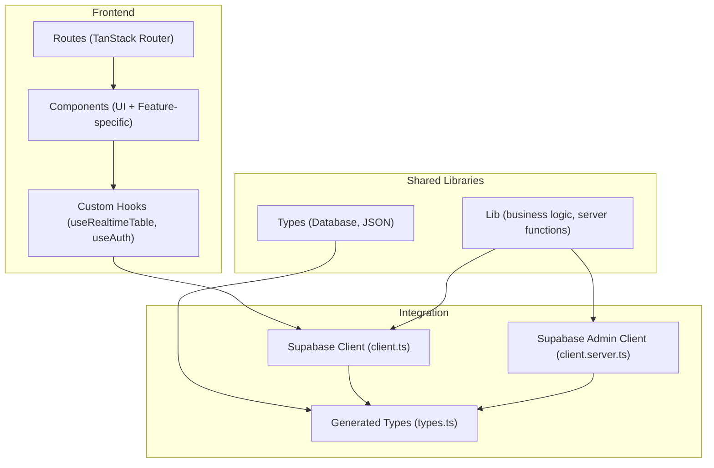
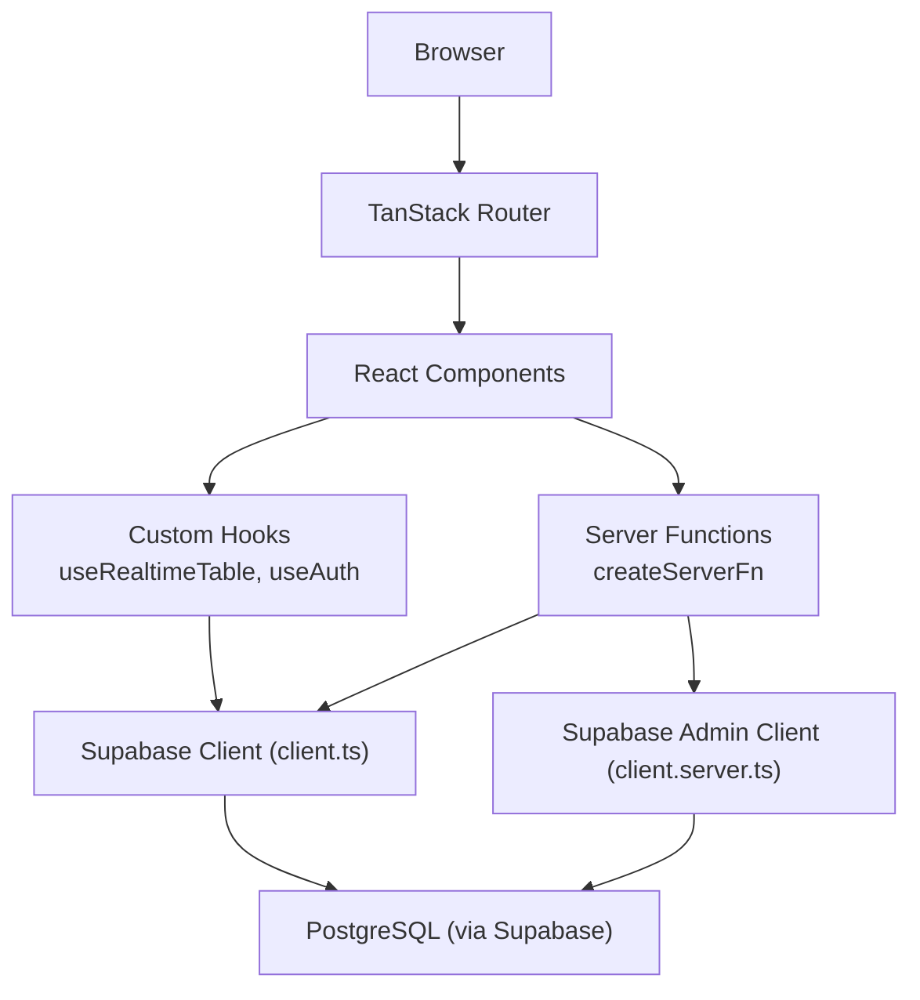
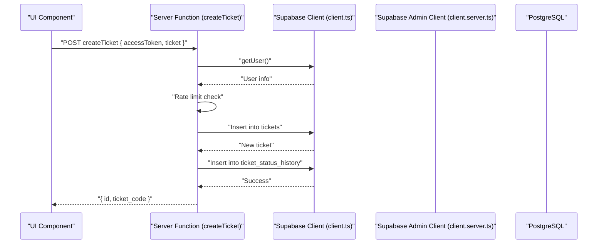
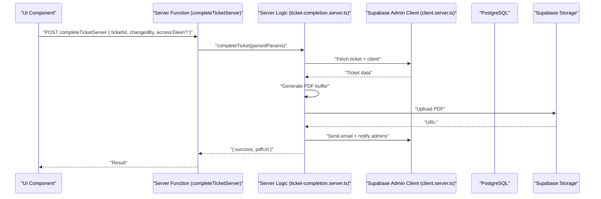
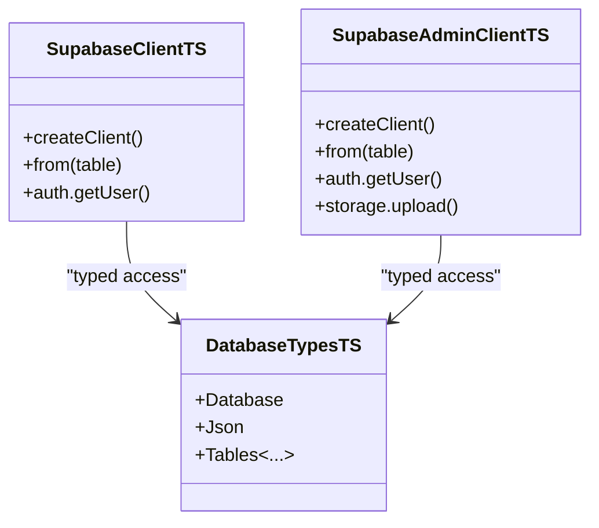
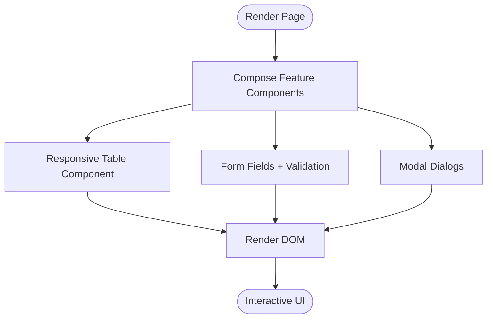
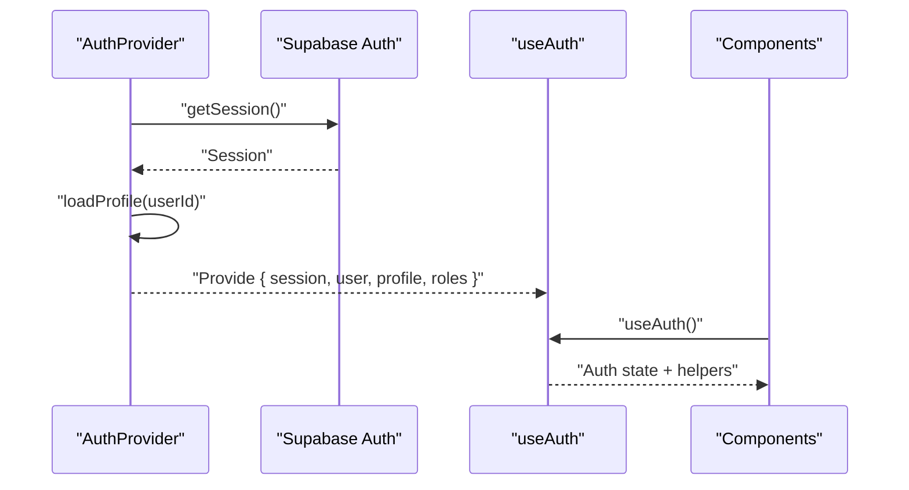
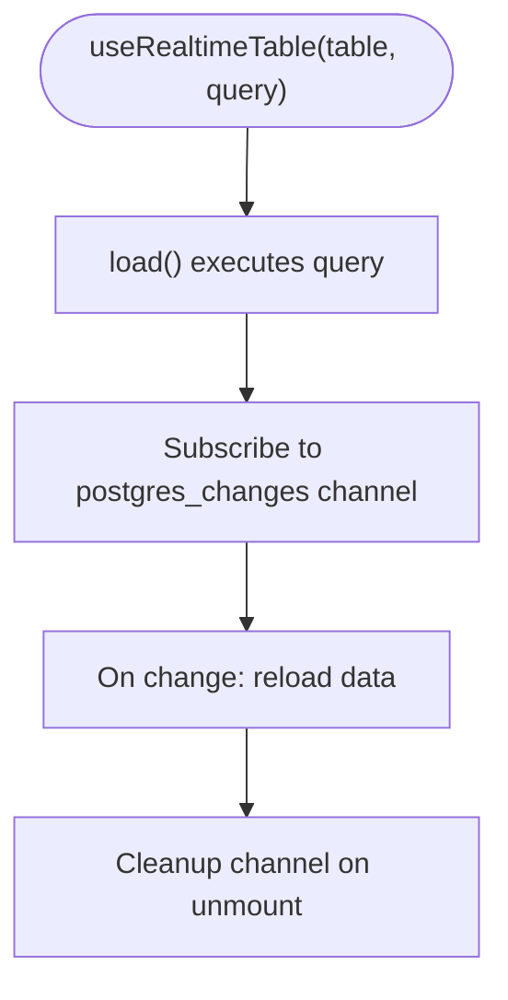
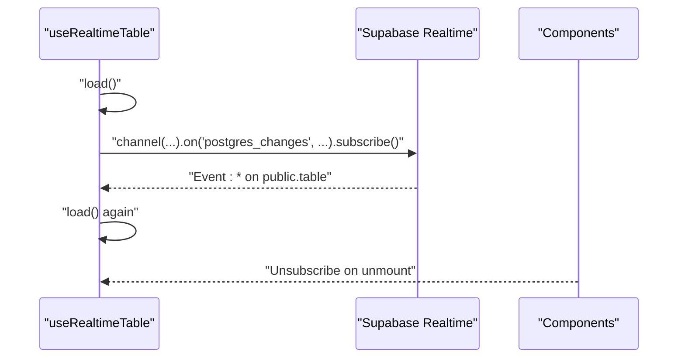
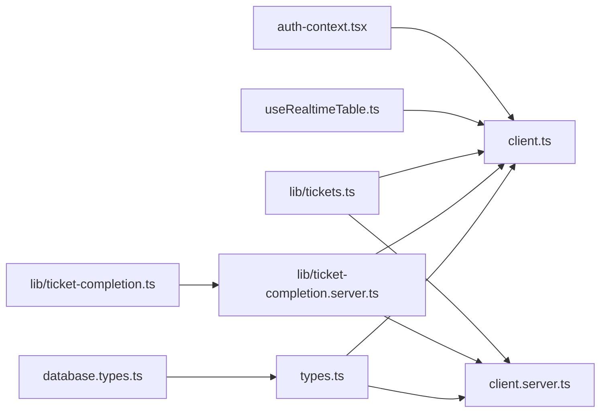

# Architectural Patterns

<cite>
**Referenced Files in This Document**
- [README.md](file://README.md)
- [vite.config.ts](file://vite.config.ts)
- [wrangler.jsonc](file://wrangler.jsonc)
- [src/integrations/supabase/client.ts](file://src/integrations/supabase/client.ts)
- [src/integrations/supabase/client.server.ts](file://src/integrations/supabase/client.server.ts)
- [src/integrations/supabase/auth-middleware.ts](file://src/integrations/supabase/auth-middleware.ts)
- [src/integrations/supabase/types.ts](file://src/integrations/supabase/types.ts)
- [src/types/database.types.ts](file://src/types/database.types.ts)
- [src/hooks/useRealtimeTable.ts](file://src/hooks/useRealtimeTable.ts)
- [src/lib/auth-context.tsx](file://src/lib/auth-context.tsx)
- [src/lib/tickets.ts](file://src/lib/tickets.ts)
- [src/lib/ticket-completion.ts](file://src/lib/ticket-completion.ts)
- [src/lib/ticket-completion.server.ts](file://src/lib/ticket-completion.server.ts)
- [src/lib/admin-users.server.ts](file://src/lib/admin-users.server.ts)
- [src/__tests__/queries.mutations.test.ts](file://src/__tests__/queries.mutations.test.ts)
- [src/__tests__/routes/tickets.test.ts](file://src/__tests__/routes/tickets.test.ts)
- [src/components/pcready/Modal.tsx](file://src/components/pcready/Modal.tsx)
- [src/routes/_app/clients.tsx](file://src/routes/_app/clients.tsx)
- [src/routes/_app/scripts.tsx](file://src/routes/_app/scripts.tsx)
</cite>

## Table of Contents

1. [Introduction](#introduction)
2. [Project Structure](#project-structure)
3. [Core Components](#core-components)
4. [Architecture Overview](#architecture-overview)
5. [Detailed Component Analysis](#detailed-component-analysis)
6. [Dependency Analysis](#dependency-analysis)
7. [Performance Considerations](#performance-considerations)
8. [Troubleshooting Guide](#troubleshooting-guide)
9. [Conclusion](#conclusion)

## Introduction

This document explains the architectural patterns implemented in PCReady. It focuses on:

- Server Functions Pattern using TanStack createServerFn to separate business logic from UI
- Repository Pattern for typed Supabase query utilities and database access abstraction
- Component Composition for modular UI and feature-specific components
- State Management using React hooks and custom hooks such as use-realtime-table and auth-context
- Observer Pattern via Supabase real-time subscriptions for live data updates
- Clear separation of concerns among frontend components, server functions, and database operations

These patterns are grounded in the repository’s codebase and validated by tests and configuration.

**Section sources**

- [README.md:1-159](file://README.md#L1-L159)

## Project Structure

PCReady follows a file-based routing architecture with a clear separation between UI components, server-side logic, typed Supabase integration, and domain libraries:

- Frontend UI: src/components and src/routes
- Shared logic and hooks: src/lib and src/hooks
- Supabase integration: src/integrations/supabase
- Types: src/types and generated supabase types
- Tests: src/**tests**

**Diagram sources**

- [vite.config.ts:1-7](file://vite.config.ts#L1-L7)
- [wrangler.jsonc:1-7](file://wrangler.jsonc#L1-L7)
- [src/integrations/supabase/client.ts:1-41](file://src/integrations/supabase/client.ts#L1-L41)
- [src/integrations/supabase/client.server.ts:1-42](file://src/integrations/supabase/client.server.ts#L1-L42)
- [src/integrations/supabase/types.ts:1249-1278](file://src/integrations/supabase/types.ts#L1249-L1278)
- [src/types/database.types.ts:1-1](file://src/types/database.types.ts#L1-L1)

**Section sources**

- [vite.config.ts:1-7](file://vite.config.ts#L1-L7)
- [wrangler.jsonc:1-7](file://wrangler.jsonc#L1-L7)
- [README.md:125-134](file://README.md#L125-L134)

## Core Components

- Supabase Clients: client.ts (client-side) and client.server.ts (server-side with service role)
- Server Functions: TanStack createServerFn wrappers around business logic
- Real-time Hook: useRealtimeTable for reactive UI updates
- Authentication Context: auth-context for centralized auth state and permissions
- Typed Database Access: generated types and helper libraries

**Section sources**

- [src/integrations/supabase/client.ts:1-41](file://src/integrations/supabase/client.ts#L1-L41)
- [src/integrations/supabase/client.server.ts:1-42](file://src/integrations/supabase/client.server.ts#L1-L42)
- [src/hooks/useRealtimeTable.ts:1-50](file://src/hooks/useRealtimeTable.ts#L1-L50)
- [src/lib/auth-context.tsx:1-173](file://src/lib/auth-context.tsx#L1-L173)
- [src/integrations/supabase/types.ts:1249-1278](file://src/integrations/supabase/types.ts#L1249-L1278)

## Architecture Overview

The system separates concerns across three layers:

- Presentation Layer: UI components and routes
- Application Layer: Server functions and custom hooks
- Data Layer: Supabase clients and typed database access

**Diagram sources**

- [src/lib/tickets.ts:1-111](file://src/lib/tickets.ts#L1-L111)
- [src/lib/ticket-completion.ts:1-15](file://src/lib/ticket-completion.ts#L1-L15)
- [src/lib/ticket-completion.server.ts:1-289](file://src/lib/ticket-completion.server.ts#L1-L289)
- [src/integrations/supabase/client.ts:1-41](file://src/integrations/supabase/client.ts#L1-L41)
- [src/integrations/supabase/client.server.ts:1-42](file://src/integrations/supabase/client.server.ts#L1-L42)

## Detailed Component Analysis

### Server Functions Pattern (TanStack createServerFn)

The Server Functions Pattern isolates business logic behind server-callable endpoints while keeping UI components free of backend details. Two examples demonstrate this pattern:

- Creating a staff ticket with access-token-based auth and rate limiting
- Completing a ticket with PDF generation, email dispatch, and admin notifications

Key characteristics:

- Strongly typed input validation with Zod
- Access-token propagation to Supabase for authenticated queries
- Server-only operations (e.g., admin tasks) delegated to server functions
- Real-world side effects (storage, emails, notifications) encapsulated in server logic

**Diagram sources**

- [src/lib/tickets.ts:50-111](file://src/lib/tickets.ts#L50-L111)
- [src/integrations/supabase/client.ts:1-41](file://src/integrations/supabase/client.ts#L1-L41)

**Diagram sources**

- [src/lib/ticket-completion.ts:10-15](file://src/lib/ticket-completion.ts#L10-L15)
- [src/lib/ticket-completion.server.ts:49-181](file://src/lib/ticket-completion.server.ts#L49-L181)
- [src/integrations/supabase/client.server.ts:1-42](file://src/integrations/supabase/client.server.ts#L1-L42)

Practical examples from the codebase:

- Server function wrapper for creating tickets: [src/lib/tickets.ts:50-111](file://src/lib/tickets.ts#L50-L111)
- Server function wrapper for completing tickets: [src/lib/ticket-completion.ts:10-15](file://src/lib/ticket-completion.ts#L10-L15)
- Server-side implementation of completion workflow: [src/lib/ticket-completion.server.ts:49-181](file://src/lib/ticket-completion.server.ts#L49-L181)

**Section sources**

- [src/lib/tickets.ts:1-111](file://src/lib/tickets.ts#L1-L111)
- [src/lib/ticket-completion.ts:1-15](file://src/lib/ticket-completion.ts#L1-L15)
- [src/lib/ticket-completion.server.ts:1-289](file://src/lib/ticket-completion.server.ts#L1-L289)

### Repository Pattern (Typed Supabase Query Utilities)

The codebase abstracts database access through typed Supabase clients and helper libraries:

- Supabase client.ts provides a client-side client configured for browser/SSR
- Supabase client.server.ts provides a server-side client with service role for privileged operations
- Generated types.ts and types/database.types.ts ensure compile-time safety for database operations
- Tests mock the Supabase client to validate query mutations and reads

**Diagram sources**

- [src/integrations/supabase/client.ts:1-41](file://src/integrations/supabase/client.ts#L1-L41)
- [src/integrations/supabase/client.server.ts:1-42](file://src/integrations/supabase/client.server.ts#L1-L42)
- [src/integrations/supabase/types.ts:1249-1278](file://src/integrations/supabase/types.ts#L1249-L1278)
- [src/types/database.types.ts:1-1](file://src/types/database.types.ts#L1-L1)

Practical examples from the codebase:

- Mocked insert test validating repository-style mutation: [src/**tests**/queries.mutations.test.ts:30-38](file://src/__tests__/queries.mutations.test.ts#L30-L38)
- Mocked select test validating repository-style read: [src/**tests**/routes/tickets.test.ts:20-34](file://src/__tests__/routes/tickets.test.ts#L20-L34)

**Section sources**

- [src/integrations/supabase/client.ts:1-41](file://src/integrations/supabase/client.ts#L1-L41)
- [src/integrations/supabase/client.server.ts:1-42](file://src/integrations/supabase/client.server.ts#L1-L42)
- [src/integrations/supabase/types.ts:1249-1278](file://src/integrations/supabase/types.ts#L1249-L1278)
- [src/types/database.types.ts:1-1](file://src/types/database.types.ts#L1-L1)
- [src/**tests**/queries.mutations.test.ts:1-38](file://src/__tests__/queries.mutations.test.ts#L1-L38)
- [src/**tests**/routes/tickets.test.ts:1-35](file://src/__tests__/routes/tickets.test.ts#L1-L35)

### Component Composition Pattern

PCReady builds modular UI using composition:

- Feature-specific components encapsulate domain logic (e.g., Modals, Wizards)
- Layout and page-state components handle cross-cutting concerns
- Routes compose lists, forms, and modals into cohesive pages

Examples:

- Modal component with title, footer, and portal rendering: [src/components/pcready/Modal.tsx:35-78](file://src/components/pcready/Modal.tsx#L35-L78)
- Responsive table composition in clients route: [src/routes/\_app/clients.tsx:1393-1444](file://src/routes/_app/clients.tsx#L1393-L1444)
- Form field composition in scripts route: [src/routes/\_app/scripts.tsx:634-670](file://src/routes/_app/scripts.tsx#L634-L670)

**Diagram sources**

- [src/components/pcready/Modal.tsx:35-78](file://src/components/pcready/Modal.tsx#L35-L78)
- [src/routes/\_app/clients.tsx:1393-1444](file://src/routes/_app/clients.tsx#L1393-L1444)
- [src/routes/\_app/scripts.tsx:634-670](file://src/routes/_app/scripts.tsx#L634-L670)

**Section sources**

- [src/components/pcready/Modal.tsx:35-78](file://src/components/pcready/Modal.tsx#L35-L78)
- [src/routes/\_app/clients.tsx:1393-1444](file://src/routes/_app/clients.tsx#L1393-L1444)
- [src/routes/\_app/scripts.tsx:634-670](file://src/routes/_app/scripts.tsx#L634-L670)

### State Management with React Hooks and Custom Hooks

- Authentication state is centralized in auth-context with provider and hook
- Real-time state synchronization is handled by useRealtimeTable for reactive UI updates
- UI state is managed via component-local hooks and controlled props

**Diagram sources**

- [src/lib/auth-context.tsx:43-166](file://src/lib/auth-context.tsx#L43-L166)

**Diagram sources**

- [src/hooks/useRealtimeTable.ts:10-49](file://src/hooks/useRealtimeTable.ts#L10-L49)

Practical examples from the codebase:

- Auth provider and hook: [src/lib/auth-context.tsx:43-173](file://src/lib/auth-context.tsx#L43-L173)
- Real-time table hook: [src/hooks/useRealtimeTable.ts:10-49](file://src/hooks/useRealtimeTable.ts#L10-L49)

**Section sources**

- [src/lib/auth-context.tsx:1-173](file://src/lib/auth-context.tsx#L1-L173)
- [src/hooks/useRealtimeTable.ts:1-50](file://src/hooks/useRealtimeTable.ts#L1-L50)

### Observer Pattern via Supabase Real-time Subscriptions

Supabase real-time channels keep UI synchronized with database changes. The useRealtimeTable hook:

- Executes an initial query
- Subscribes to postgres_changes events for a given table
- Refreshes data on any change and cleans up on unmount

**Diagram sources**

- [src/hooks/useRealtimeTable.ts:33-46](file://src/hooks/useRealtimeTable.ts#L33-L46)

**Section sources**

- [src/hooks/useRealtimeTable.ts:1-50](file://src/hooks/useRealtimeTable.ts#L1-L50)

### Separation of Concerns

- Frontend components focus on rendering and user interactions
- Server functions encapsulate business logic and side effects
- Database operations are abstracted via typed Supabase clients and server-side admin client
- Authentication and authorization are enforced via middleware and RPC checks

Evidence from the codebase:

- Admin authorization enforcement via RPC: [src/lib/admin-users.server.ts:3-17](file://src/lib/admin-users.server.ts#L3-L17)
- Auth middleware for server requests: [src/integrations/supabase/auth-middleware.ts:7-36](file://src/integrations/supabase/auth-middleware.ts#L7-L36)
- Client and server Supabase clients: [src/integrations/supabase/client.ts:1-41](file://src/integrations/supabase/client.ts#L1-L41), [src/integrations/supabase/client.server.ts:1-42](file://src/integrations/supabase/client.server.ts#L1-L42)

**Section sources**

- [src/lib/admin-users.server.ts:1-18](file://src/lib/admin-users.server.ts#L1-L18)
- [src/integrations/supabase/auth-middleware.ts:1-36](file://src/integrations/supabase/auth-middleware.ts#L1-L36)
- [src/integrations/supabase/client.ts:1-41](file://src/integrations/supabase/client.ts#L1-L41)
- [src/integrations/supabase/client.server.ts:1-42](file://src/integrations/supabase/client.server.ts#L1-L42)

## Dependency Analysis

The following diagram highlights key dependencies across layers and modules:

**Diagram sources**

- [src/lib/auth-context.tsx:1-173](file://src/lib/auth-context.tsx#L1-L173)
- [src/hooks/useRealtimeTable.ts:1-50](file://src/hooks/useRealtimeTable.ts#L1-L50)
- [src/lib/tickets.ts:1-111](file://src/lib/tickets.ts#L1-L111)
- [src/lib/ticket-completion.ts:1-15](file://src/lib/ticket-completion.ts#L1-L15)
- [src/lib/ticket-completion.server.ts:1-289](file://src/lib/ticket-completion.server.ts#L1-L289)
- [src/integrations/supabase/client.ts:1-41](file://src/integrations/supabase/client.ts#L1-L41)
- [src/integrations/supabase/client.server.ts:1-42](file://src/integrations/supabase/client.server.ts#L1-L42)
- [src/integrations/supabase/types.ts:1249-1278](file://src/integrations/supabase/types.ts#L1249-L1278)
- [src/types/database.types.ts:1-1](file://src/types/database.types.ts#L1-L1)

**Section sources**

- [src/lib/auth-context.tsx:1-173](file://src/lib/auth-context.tsx#L1-L173)
- [src/hooks/useRealtimeTable.ts:1-50](file://src/hooks/useRealtimeTable.ts#L1-L50)
- [src/lib/tickets.ts:1-111](file://src/lib/tickets.ts#L1-L111)
- [src/lib/ticket-completion.ts:1-15](file://src/lib/ticket-completion.ts#L1-L15)
- [src/lib/ticket-completion.server.ts:1-289](file://src/lib/ticket-completion.server.ts#L1-L289)
- [src/integrations/supabase/client.ts:1-41](file://src/integrations/supabase/client.ts#L1-L41)
- [src/integrations/supabase/client.server.ts:1-42](file://src/integrations/supabase/client.server.ts#L1-L42)
- [src/integrations/supabase/types.ts:1249-1278](file://src/integrations/supabase/types.ts#L1249-L1278)
- [src/types/database.types.ts:1-1](file://src/types/database.types.ts#L1-L1)

## Performance Considerations

- Server-side pagination and filtering reduce memory usage and improve responsiveness for large datasets
- Real-time subscriptions update only affected tables, minimizing unnecessary re-renders
- Server functions centralize heavy operations (PDF generation, email dispatch) on the server to keep the client responsive
- Typed Supabase clients avoid runtime errors and reduce network overhead by selecting only required fields

[No sources needed since this section provides general guidance]

## Troubleshooting Guide

Common issues and where to look:

- Missing Supabase credentials on server: the server clients throw explicit errors when environment variables are missing
  - [src/integrations/supabase/client.server.ts:12-20](file://src/integrations/supabase/client.server.ts#L12-L20)
  - [src/integrations/supabase/client.ts:12-20](file://src/integrations/supabase/client.ts#L12-L20)
- Unauthorized or invalid access tokens in server functions: server functions validate tokens and user roles
  - [src/lib/tickets.ts:54-62](file://src/lib/tickets.ts#L54-L62)
  - [src/lib/admin-users.server.ts:3-17](file://src/lib/admin-users.server.ts#L3-L17)
- Real-time subscription not updating: verify table name and channel suffix; ensure cleanup on unmount
  - [src/hooks/useRealtimeTable.ts:33-46](file://src/hooks/useRealtimeTable.ts#L33-L46)
- Authentication state not loading: check auth middleware and session retrieval
  - [src/lib/auth-context.tsx:114-146](file://src/lib/auth-context.tsx#L114-L146)

**Section sources**

- [src/integrations/supabase/client.server.ts:1-42](file://src/integrations/supabase/client.server.ts#L1-L42)
- [src/integrations/supabase/client.ts:1-41](file://src/integrations/supabase/client.ts#L1-L41)
- [src/lib/tickets.ts:1-111](file://src/lib/tickets.ts#L1-L111)
- [src/lib/admin-users.server.ts:1-18](file://src/lib/admin-users.server.ts#L1-L18)
- [src/hooks/useRealtimeTable.ts:1-50](file://src/hooks/useRealtimeTable.ts#L1-L50)
- [src/lib/auth-context.tsx:1-173](file://src/lib/auth-context.tsx#L1-L173)

## Conclusion

PCReady’s architecture cleanly separates presentation, application, and data layers:

- Server Functions isolate business logic and enforce auth/security
- Repository Pattern with typed Supabase clients ensures reliable database access
- Component Composition yields modular, reusable UI
- React hooks and custom hooks manage state and real-time updates
- Supabase real-time subscriptions implement the Observer Pattern for live UI
- Strong separation of concerns improves maintainability and testability

[No sources needed since this section summarizes without analyzing specific files]
