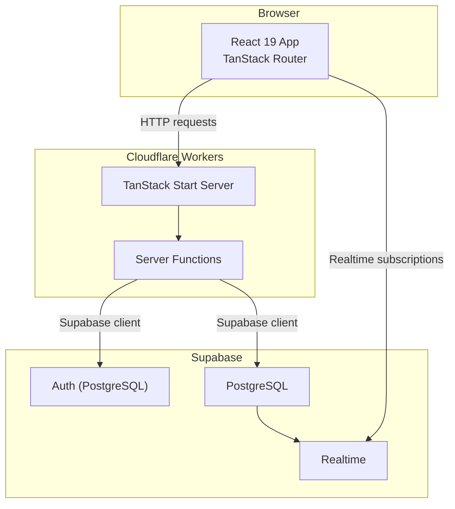
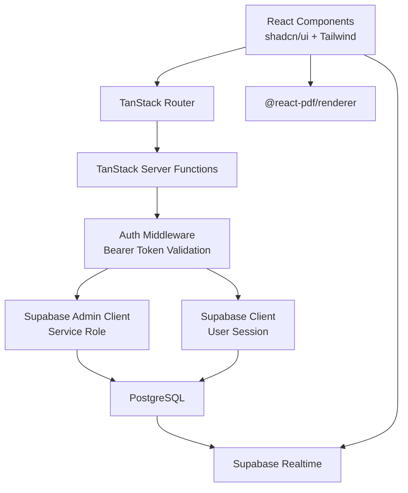
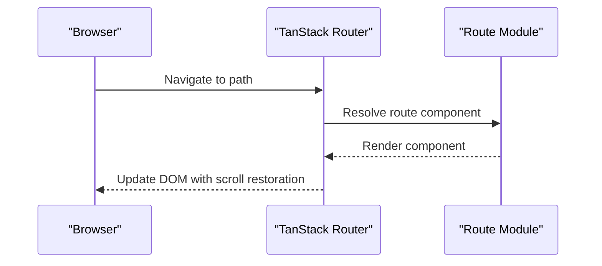
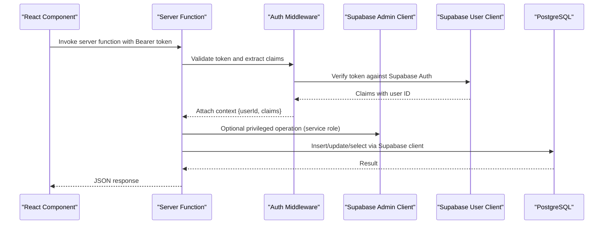
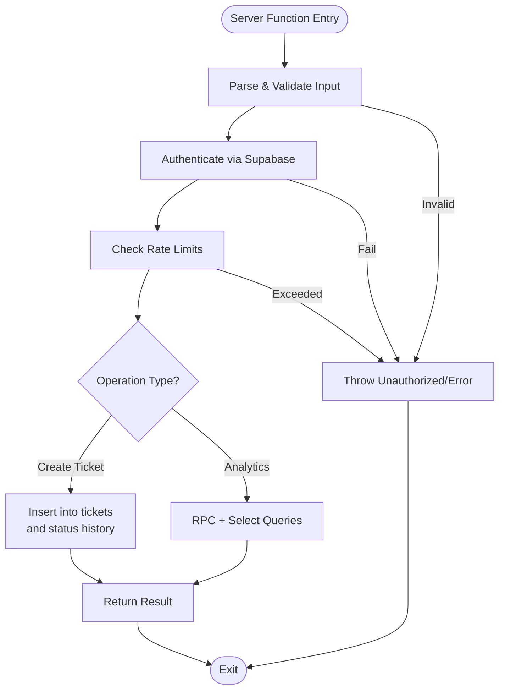
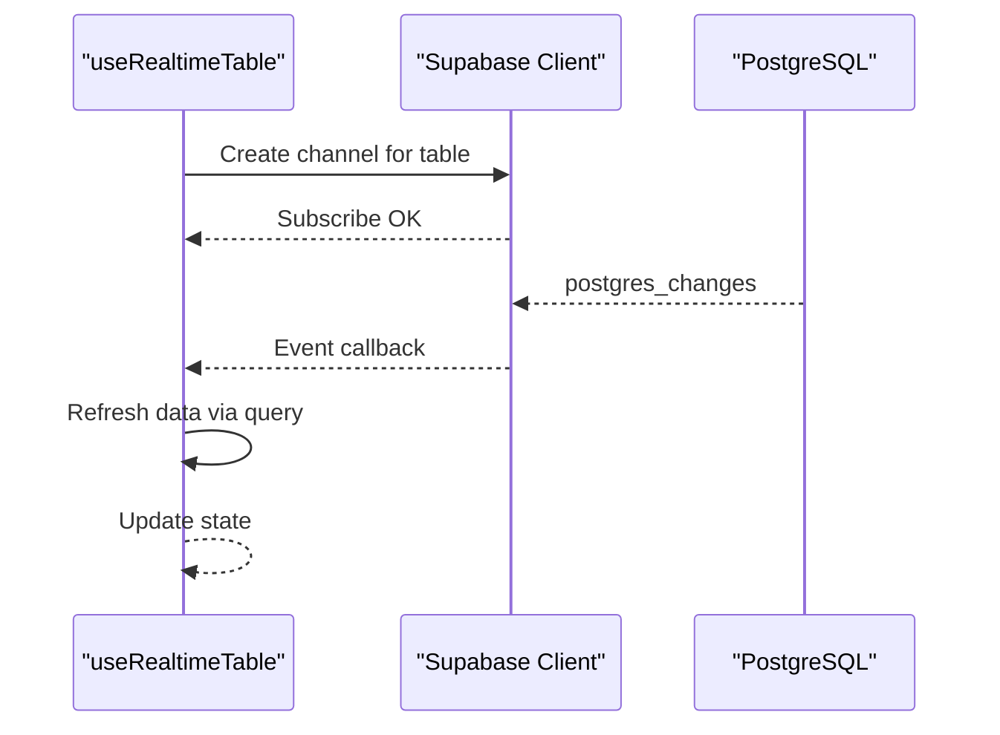
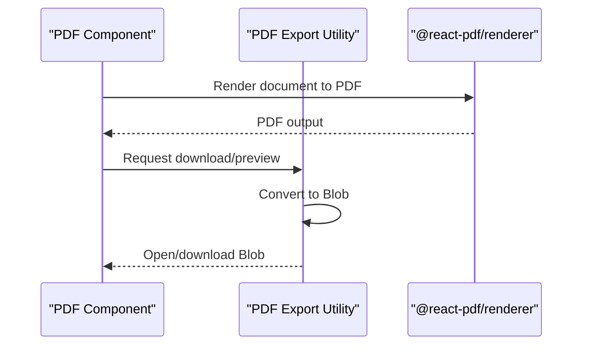
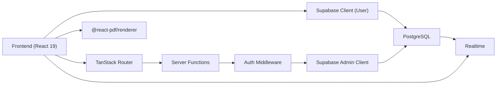

# Architecture Overview

<cite>
**Referenced Files in This Document**
- [package.json](file://package.json)
- [vite.config.ts](file://vite.config.ts)
- [wrangler.jsonc](file://wrangler.jsonc)
- [src/router.tsx](file://src/router.tsx)
- [src/integrations/supabase/client.ts](file://src/integrations/supabase/client.ts)
- [src/integrations/supabase/client.server.ts](file://src/integrations/supabase/client.server.ts)
- [src/integrations/supabase/auth-middleware.ts](file://src/integrations/supabase/auth-middleware.ts)
- [src/hooks/useRealtimeTable.ts](file://src/hooks/useRealtimeTable.ts)
- [src/lib/tickets.ts](file://src/lib/tickets.ts)
- [src/lib/dashboard-analytics.ts](file://src/lib/dashboard-analytics.ts)
- [src/routes/_app/admin.tsx](file://src/routes/_app/admin.tsx)
- [src/components/pcready/pdf/export.tsx](file://src/components/pcready/pdf/export.tsx)
- [src/types/database.types.ts](file://src/types/database.types.ts)
</cite>

## Table of Contents

1. [Introduction](#introduction)
2. [Project Structure](#project-structure)
3. [Core Components](#core-components)
4. [Architecture Overview](#architecture-overview)
5. [Detailed Component Analysis](#detailed-component-analysis)
6. [Dependency Analysis](#dependency-analysis)
7. [Performance Considerations](#performance-considerations)
8. [Troubleshooting Guide](#troubleshooting-guide)
9. [Conclusion](#conclusion)
10. [Appendices](#appendices)

## Introduction

This document describes the full-stack architecture of PCReady, a React 19 application built with the TanStack ecosystem, integrated with Supabase for authentication and database, and deployed via Cloudflare Workers. The system emphasizes:

- File-based routing with TanStack Router
- Server Functions Pattern for business logic separation
- Repository-style typed Supabase queries
- Component Composition for modular UI
- Real-time updates via Supabase Realtime
- PDF generation capabilities using @react-pdf/renderer
- Scalable Cloudflare Workers deployment

## Project Structure

The project follows a layered, feature-oriented structure:

- Frontend: React 19 with TanStack Router, shadcn/ui + Tailwind CSS
- Backend: TanStack Server Functions for server-side logic
- Data: Supabase client libraries for authenticated and admin operations
- Infrastructure: Cloudflare Workers via TanStack Start

**Diagram sources**

- [src/router.tsx:1-16](file://src/router.tsx#L1-L16)
- [wrangler.jsonc:1-8](file://wrangler.jsonc#L1-L8)
- [src/integrations/supabase/client.ts:1-41](file://src/integrations/supabase/client.ts#L1-L41)
- [src/integrations/supabase/client.server.ts:1-42](file://src/integrations/supabase/client.server.ts#L1-L42)
- [src/hooks/useRealtimeTable.ts:1-50](file://src/hooks/useRealtimeTable.ts#L1-L50)

**Section sources**

- [package.json:1-110](file://package.json#L1-L110)
- [vite.config.ts:1-58](file://vite.config.ts#L1-L58)
- [wrangler.jsonc:1-8](file://wrangler.jsonc#L1-L8)

## Core Components

- React 19 + TanStack Router: File-system based routing and client-side navigation
- TanStack Start + Cloudflare Workers: Server runtime for SSR, static generation, and server functions
- Supabase client libraries: Client-side authenticated access and server-side admin access
- Real-time subscriptions: Live UI updates via Supabase Realtime
- PDF generation: @react-pdf/renderer for client-side PDF rendering and download/preview
- Build toolchain: Vite with TanStack config, optimized chunking, and SSR support

**Section sources**

- [package.json:22-85](file://package.json#L22-L85)
- [src/router.tsx:1-16](file://src/router.tsx#L1-L16)
- [src/integrations/supabase/client.ts:1-41](file://src/integrations/supabase/client.ts#L1-L41)
- [src/integrations/supabase/client.server.ts:1-42](file://src/integrations/supabase/client.server.ts#L1-L42)
- [src/hooks/useRealtimeTable.ts:1-50](file://src/hooks/useRealtimeTable.ts#L1-L50)
- [src/components/pcready/pdf/export.tsx:1-18](file://src/components/pcready/pdf/export.tsx#L1-L18)
- [vite.config.ts:1-58](file://vite.config.ts#L1-L58)

## Architecture Overview

PCReady’s architecture separates concerns across layers:

- Presentation Layer: React components and TanStack Router manage routing and UI composition
- Application Layer: TanStack Server Functions encapsulate business logic and enforce authorization
- Data Access Layer: Supabase client libraries provide typed database access and RLS enforcement
- Real-time Layer: Supabase Realtime channels keep UI synchronized with database changes
- Infrastructure Layer: Cloudflare Workers host the server runtime and serve static assets

**Diagram sources**

- [src/router.tsx:1-16](file://src/router.tsx#L1-L16)
- [src/integrations/supabase/auth-middleware.ts:1-74](file://src/integrations/supabase/auth-middleware.ts#L1-L74)
- [src/integrations/supabase/client.server.ts:1-42](file://src/integrations/supabase/client.server.ts#L1-L42)
- [src/integrations/supabase/client.ts:1-41](file://src/integrations/supabase/client.ts#L1-L41)
- [src/hooks/useRealtimeTable.ts:1-50](file://src/hooks/useRealtimeTable.ts#L1-L50)
- [src/components/pcready/pdf/export.tsx:1-18](file://src/components/pcready/pdf/export.tsx#L1-L18)

## Detailed Component Analysis

### Routing and Navigation

- File-based routing via TanStack Router generates the route tree and integrates error/pending states
- Scroll restoration and default preload policies configured at the router level

**Diagram sources**

- [src/router.tsx:1-16](file://src/router.tsx#L1-L16)

**Section sources**

- [src/router.tsx:1-16](file://src/router.tsx#L1-L16)

### Authentication and Authorization

- Client-side Supabase client handles user sessions and local persistence
- Server-side Supabase admin client bypasses RLS for privileged operations
- TanStack auth middleware validates Bearer tokens and injects claims into server function context

**Diagram sources**

- [src/integrations/supabase/auth-middleware.ts:1-74](file://src/integrations/supabase/auth-middleware.ts#L1-L74)
- [src/integrations/supabase/client.server.ts:1-42](file://src/integrations/supabase/client.server.ts#L1-L42)
- [src/integrations/supabase/client.ts:1-41](file://src/integrations/supabase/client.ts#L1-L41)

**Section sources**

- [src/integrations/supabase/auth-middleware.ts:1-74](file://src/integrations/supabase/auth-middleware.ts#L1-L74)
- [src/integrations/supabase/client.ts:1-41](file://src/integrations/supabase/client.ts#L1-L41)
- [src/integrations/supabase/client.server.ts:1-42](file://src/integrations/supabase/client.server.ts#L1-L42)

### Server Functions Pattern

- Server functions encapsulate business logic, input validation, rate limiting, and database operations
- Example: Creating tickets validates payload, enforces rate limits, inserts into tickets, and logs status history
- Example: Dashboard analytics aggregates metrics using RPCs and server-side queries

**Diagram sources**

- [src/lib/tickets.ts:1-111](file://src/lib/tickets.ts#L1-L111)
- [src/lib/dashboard-analytics.ts:1-559](file://src/lib/dashboard-analytics.ts#L1-L559)

**Section sources**

- [src/lib/tickets.ts:1-111](file://src/lib/tickets.ts#L1-L111)
- [src/lib/dashboard-analytics.ts:1-559](file://src/lib/dashboard-analytics.ts#L1-L559)

### Real-time Data Synchronization

- React hook subscribes to Supabase Realtime channels for a given table
- On change events, it refreshes data by re-running the provided query
- Channel suffix ensures isolation across component instances

**Diagram sources**

- [src/hooks/useRealtimeTable.ts:1-50](file://src/hooks/useRealtimeTable.ts#L1-L50)

**Section sources**

- [src/hooks/useRealtimeTable.ts:1-50](file://src/hooks/useRealtimeTable.ts#L1-L50)

### PDF Generation Pipeline

- Components render a React PDF document using @react-pdf/renderer
- Utility functions convert the document to a Blob and trigger download or preview

**Diagram sources**

- [src/components/pcready/pdf/export.tsx:1-18](file://src/components/pcready/pdf/export.tsx#L1-L18)

**Section sources**

- [src/components/pcready/pdf/export.tsx:1-18](file://src/components/pcready/pdf/export.tsx#L1-L18)

### Typed Database Access

- Supabase types are re-exported for consistent typing across the app
- Server functions import typed Database and Json types to ensure correctness

**Section sources**

- [src/types/database.types.ts:1-2](file://src/types/database.types.ts#L1-L2)

## Dependency Analysis

The system exhibits clear layering and low coupling:

- Frontend depends on TanStack Router and Supabase client for user operations
- Server functions depend on Supabase admin client for privileged operations and on auth middleware for authorization
- Real-time subscriptions depend on Supabase client and database triggers
- Build and deployment rely on Vite and Cloudflare Workers configuration

**Diagram sources**

- [src/router.tsx:1-16](file://src/router.tsx#L1-L16)
- [src/integrations/supabase/client.ts:1-41](file://src/integrations/supabase/client.ts#L1-L41)
- [src/integrations/supabase/client.server.ts:1-42](file://src/integrations/supabase/client.server.ts#L1-L42)
- [src/integrations/supabase/auth-middleware.ts:1-74](file://src/integrations/supabase/auth-middleware.ts#L1-L74)
- [src/hooks/useRealtimeTable.ts:1-50](file://src/hooks/useRealtimeTable.ts#L1-L50)
- [src/components/pcready/pdf/export.tsx:1-18](file://src/components/pcready/pdf/export.tsx#L1-L18)

**Section sources**

- [package.json:22-85](file://package.json#L22-L85)
- [vite.config.ts:1-58](file://vite.config.ts#L1-L58)
- [wrangler.jsonc:1-8](file://wrangler.jsonc#L1-L8)

## Performance Considerations

- Chunking and vendor splitting: Vite configuration groups heavy libraries (e.g., @react-pdf, recharts, reactflow) into dedicated chunks to improve caching and reduce initial bundle size
- SSR and PDF compatibility: Vite SSR settings include @react-pdf/renderer to avoid runtime resolution issues
- Real-time efficiency: useRealtimeTable minimizes network by subscribing to specific tables and refreshing only on change events
- Rate limiting: Server functions enforce rate limits to prevent abuse and control database load

**Section sources**

- [vite.config.ts:17-38](file://vite.config.ts#L17-L38)
- [src/lib/tickets.ts:6, 62:6-62](file://src/lib/tickets.ts#L6-L62)
- [src/hooks/useRealtimeTable.ts:33-46](file://src/hooks/useRealtimeTable.ts#L33-L46)

## Troubleshooting Guide

Common issues and resolutions:

- Missing Supabase environment variables: Both client and server-side clients validate presence of URLs and keys and throw descriptive errors
- Unauthorized access: Auth middleware checks for Bearer token presence and validity; server functions also verify user identity
- Realtime subscription cleanup: Channels are removed on component unmount to prevent memory leaks
- PDF rendering failures: Ensure @react-pdf/renderer is included in SSR/noExternal and optimizeDeps settings

**Section sources**

- [src/integrations/supabase/client.ts:12-20](file://src/integrations/supabase/client.ts#L12-L20)
- [src/integrations/supabase/client.server.ts:12-20](file://src/integrations/supabase/client.server.ts#L12-L20)
- [src/integrations/supabase/auth-middleware.ts:24-41](file://src/integrations/supabase/auth-middleware.ts#L24-L41)
- [src/hooks/useRealtimeTable.ts:43-46](file://src/hooks/useRealtimeTable.ts#L43-L46)
- [vite.config.ts:14-16](file://vite.config.ts#L14-L16)

## Conclusion

PCReady’s architecture leverages modern web technologies to deliver a scalable, maintainable, and real-time enabled application. The combination of TanStack Router, TanStack Server Functions, Supabase, and Cloudflare Workers provides a cohesive system where business logic is cleanly separated from presentation, data access is strongly typed, and real-time updates keep the UI responsive. The build pipeline and deployment topology are optimized for performance and developer productivity.

## Appendices

### Technology Stack Summary

- Frontend: React 19, TanStack Router, shadcn/ui, Tailwind CSS
- Backend: TanStack Server Functions, TanStack Start, Cloudflare Workers
- Data: Supabase (authentication, database, RLS, Realtime)
- Build: Vite with TanStack config, SSR, optimized chunking
- PDF: @react-pdf/renderer

**Section sources**

- [package.json:22-85](file://package.json#L22-L85)
- [vite.config.ts:1-58](file://vite.config.ts#L1-L58)
- [wrangler.jsonc:1-8](file://wrangler.jsonc#L1-L8)
