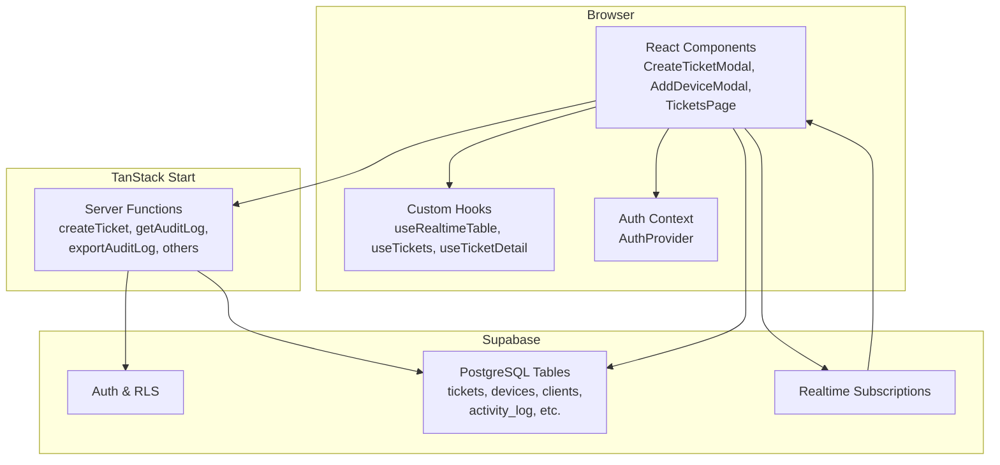
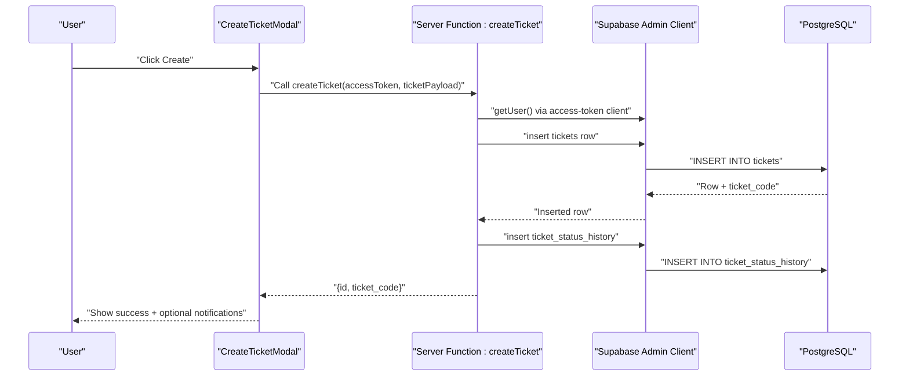
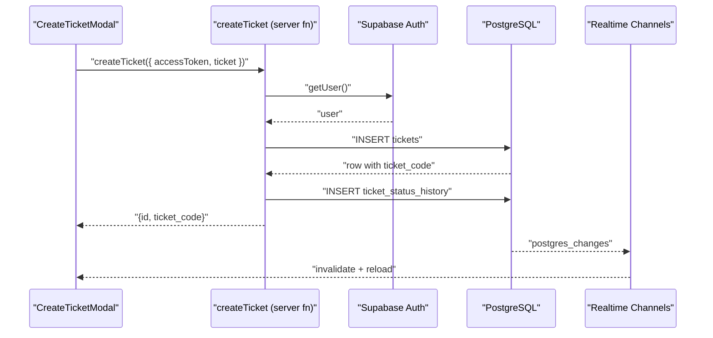
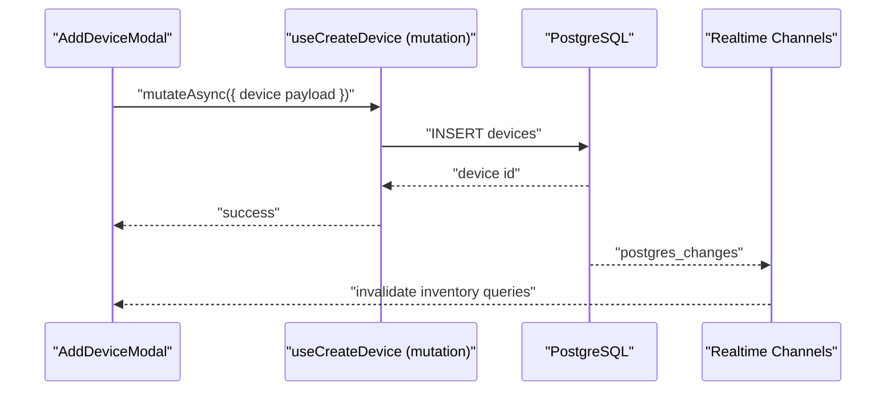
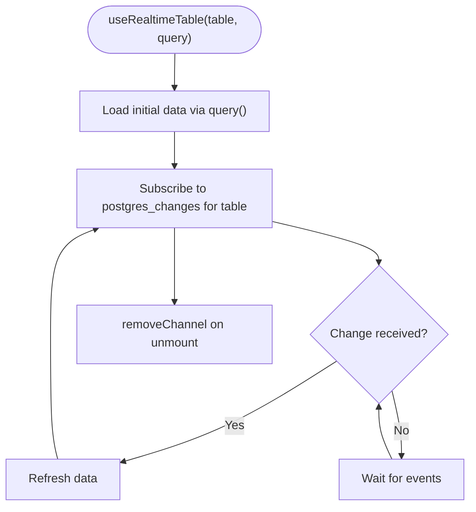
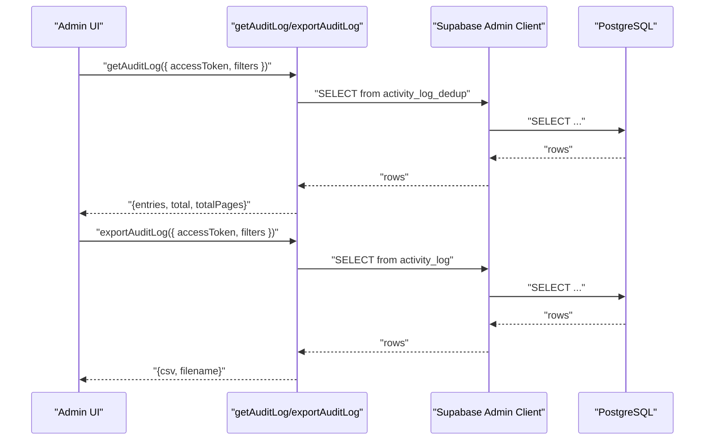
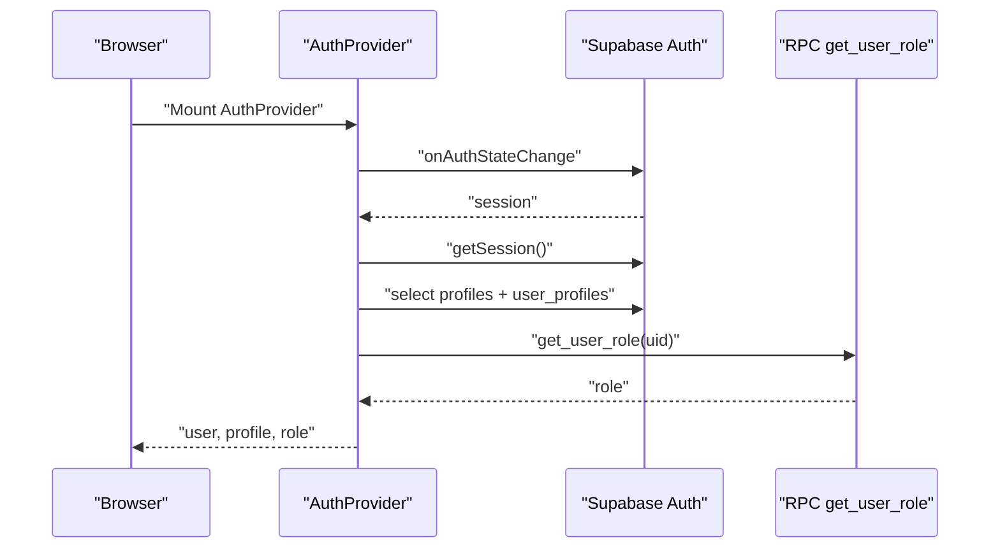
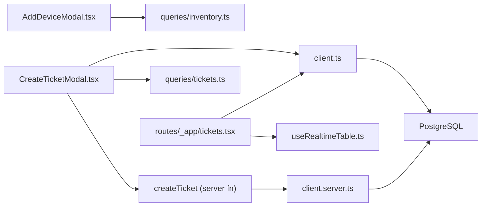

# Data Flow and Communication

<cite>
**Referenced Files in This Document**
- [README.md](file://README.md)
- [client.ts](file://src/integrations/supabase/client.ts)
- [client.server.ts](file://src/integrations/supabase/client.server.ts)
- [useRealtimeTable.ts](file://src/hooks/useRealtimeTable.ts)
- [audit-log.ts](file://src/lib/audit-log.ts)
- [audit-log-actions.ts](file://src/lib/audit-log-actions.ts)
- [auth-context.tsx](file://src/lib/auth-context.tsx)
- [tickets.ts](file://src/lib/tickets.ts)
- [CreateTicketModal.tsx](file://src/components/pcready/CreateTicketModal.tsx)
- [AddDeviceModal.tsx](file://src/components/pcready/AddDeviceModal.tsx)
- [tickets.tsx](file://src/routes/_app/tickets.tsx)
- [queries/tickets.ts](file://src/lib/queries/tickets.ts)
- [queries/inventory.ts](file://src/lib/queries/inventory.ts)
- [use-tickets.tsx](file://src/lib/use-tickets.tsx)
- [use-detail.tsx](file://src/lib/use-detail.tsx)
- [new.tsx](file://src/routes/portal/tickets/new.tsx)
</cite>

## Table of Contents

1. [Introduction](#introduction)
2. [Project Structure](#project-structure)
3. [Core Components](#core-components)
4. [Architecture Overview](#architecture-overview)
5. [Detailed Component Analysis](#detailed-component-analysis)
6. [Dependency Analysis](#dependency-analysis)
7. [Performance Considerations](#performance-considerations)
8. [Troubleshooting Guide](#troubleshooting-guide)
9. [Conclusion](#conclusion)

## Introduction

This document explains the data flow patterns and communication mechanisms in PCReady. It traces the end-to-end journey from user interface interactions through React components, TanStack Start server functions, Supabase, and database operations. It covers bidirectional data flows, real-time updates via Supabase subscriptions, client-side state management, error handling, validation, retry strategies, audit logging, and performance characteristics.

## Project Structure

PCReady is a React + TypeScript application using TanStack Router and TanStack Start for file-based routing and server functions. Supabase provides authentication, database, and real-time capabilities. The frontend communicates with Supabase directly for user-facing reads/writes and via TanStack Start server functions for privileged operations. Real-time updates keep views synchronized with database changes.

**Diagram sources**

- [client.ts:1-41](file://src/integrations/supabase/client.ts#L1-L41)
- [client.server.ts:1-42](file://src/integrations/supabase/client.server.ts#L1-L42)
- [useRealtimeTable.ts:1-50](file://src/hooks/useRealtimeTable.ts#L1-L50)
- [auth-context.tsx:1-173](file://src/lib/auth-context.tsx#L1-L173)
- [tickets.ts:1-111](file://src/lib/tickets.ts#L1-L111)
- [audit-log.ts:1-183](file://src/lib/audit-log.ts#L1-L183)
- [tickets.tsx:1-400](file://src/routes/_app/tickets.tsx#L1-L400)

**Section sources**

- [README.md:1-159](file://README.md#L1-L159)
- [client.ts:1-41](file://src/integrations/supabase/client.ts#L1-L41)
- [client.server.ts:1-42](file://src/integrations/supabase/client.server.ts#L1-L42)

## Core Components

- Supabase clients:
  - Public client for browser sessions and real-time.
  - Admin client for server-side privileged operations.
- Authentication context manages session, profile, roles, and permissions.
- Server functions encapsulate privileged operations and enforce rate limits.
- Real-time hook synchronizes lists with database changes.
- Queries module centralizes Supabase read/write operations and invalidations.
- UI modals orchestrate user-driven mutations and side effects.

**Section sources**

- [client.ts:1-41](file://src/integrations/supabase/client.ts#L1-L41)
- [client.server.ts:1-42](file://src/integrations/supabase/client.server.ts#L1-L42)
- [auth-context.tsx:1-173](file://src/lib/auth-context.tsx#L1-L173)
- [tickets.ts:1-111](file://src/lib/tickets.ts#L1-L111)
- [useRealtimeTable.ts:1-50](file://src/hooks/useRealtimeTable.ts#L1-L50)
- [queries/tickets.ts:1-284](file://src/lib/queries/tickets.ts#L1-L284)
- [queries/inventory.ts:1-128](file://src/lib/queries/inventory.ts#L1-L128)

## Architecture Overview

The system follows a layered pattern:

- Presentation layer: React components and TanStack Router.
- Domain layer: TanStack Start server functions for privileged operations.
- Data access layer: Supabase client libraries and typed queries.
- Real-time layer: Supabase Realtime channels for live updates.

**Diagram sources**

- [CreateTicketModal.tsx:196-300](file://src/components/pcready/CreateTicketModal.tsx#L196-L300)
- [tickets.ts:50-111](file://src/lib/tickets.ts#L50-L111)
- [client.server.ts:8-29](file://src/integrations/supabase/client.server.ts#L8-L29)

## Detailed Component Analysis

### Ticket Creation Flow

End-to-end flow from UI to database and audit trail:

- UI collects inputs in the modal, validates locally, and prepares payload.
- Calls a TanStack Start server function with the user’s access token.
- Server function authenticates the user, enforces rate limits, inserts the ticket, records status history, and optionally triggers notifications and emails.
- Real-time subscriptions update the tickets list and related views.

**Diagram sources**

- [CreateTicketModal.tsx:196-300](file://src/components/pcready/CreateTicketModal.tsx#L196-L300)
- [tickets.ts:50-111](file://src/lib/tickets.ts#L50-L111)
- [useRealtimeTable.ts:33-46](file://src/hooks/useRealtimeTable.ts#L33-L46)

**Section sources**

- [CreateTicketModal.tsx:138-300](file://src/components/pcready/CreateTicketModal.tsx#L138-L300)
- [tickets.ts:50-111](file://src/lib/tickets.ts#L50-L111)
- [queries/tickets.ts:148-172](file://src/lib/queries/tickets.ts#L148-L172)

### Device Assignment and Inventory

- The AddDeviceModal validates inputs using Zod, constructs a payload, and calls a mutation to create a device.
- The mutation inserts into the devices table and invalidates inventory queries.
- The tickets list page subscribes to tickets table changes to surface “updates available” UX.

**Diagram sources**

- [AddDeviceModal.tsx:76-118](file://src/components/pcready/AddDeviceModal.tsx#L76-L118)
- [queries/inventory.ts:102-108](file://src/lib/queries/inventory.ts#L102-L108)
- [tickets.tsx:112-122](file://src/routes/_app/tickets.tsx#L112-L122)

**Section sources**

- [AddDeviceModal.tsx:27-118](file://src/components/pcready/AddDeviceModal.tsx#L27-L118)
- [queries/inventory.ts:82-108](file://src/lib/queries/inventory.ts#L82-L108)
- [tickets.tsx:112-122](file://src/routes/_app/tickets.tsx#L112-L122)

### Real-Time Updates and Client State

- The useRealtimeTable hook loads initial data and subscribes to postgres_changes on a given table. On change, it refreshes data and removes the channel on unmount.
- The tickets list page uses a dedicated realtime channel to show a quick “updates available” indicator and manual refresh.
- Centralized stores manage UI state for modals and detail panels.

**Diagram sources**

- [useRealtimeTable.ts:10-49](file://src/hooks/useRealtimeTable.ts#L10-L49)
- [tickets.tsx:112-122](file://src/routes/_app/tickets.tsx#L112-L122)
- [use-tickets.tsx:1-56](file://src/lib/use-tickets.tsx#L1-L56)
- [use-detail.tsx:1-47](file://src/lib/use-detail.tsx#L1-L47)

**Section sources**

- [useRealtimeTable.ts:1-50](file://src/hooks/useRealtimeTable.ts#L1-L50)
- [tickets.tsx:112-122](file://src/routes/_app/tickets.tsx#L112-L122)
- [use-tickets.tsx:1-56](file://src/lib/use-tickets.tsx#L1-L56)
- [use-detail.tsx:1-47](file://src/lib/use-detail.tsx#L1-L47)

### Audit Logging and Data Tracking

- Audit log entries are persisted to the activity_log table and surfaced via a server function that:
  - Requires admin access.
  - Reads from a deduplicated view for listing.
  - Optionally exports CSV with de-duplication by message and timestamp second.
- Audit actions are centrally defined for consistent tracking across flows.

**Diagram sources**

- [audit-log.ts:23-107](file://src/lib/audit-log.ts#L23-L107)
- [audit-log.ts:109-182](file://src/lib/audit-log.ts#L109-L182)
- [audit-log-actions.ts:1-28](file://src/lib/audit-log-actions.ts#L1-L28)

**Section sources**

- [audit-log.ts:1-183](file://src/lib/audit-log.ts#L1-L183)
- [audit-log-actions.ts:1-28](file://src/lib/audit-log-actions.ts#L1-L28)

### Authentication and Authorization Flow

- The AuthProvider initializes Supabase auth, listens to auth state changes, loads profile and role RPC, and exposes permissions (canEdit, isAdmin).
- Server functions validate access tokens and enforce role-based policies.

**Diagram sources**

- [auth-context.tsx:114-146](file://src/lib/auth-context.tsx#L114-L146)

**Section sources**

- [auth-context.tsx:1-173](file://src/lib/auth-context.tsx#L1-L173)

### Client-Side State Management

- Centralized stores for UI state:
  - useTickets: manages search, counts, and modal open/close flags.
  - useTicketDetail: opens/closes ticket detail panel.
- These stores use a minimal sync-external-store pattern to broadcast changes to subscribed components.

**Section sources**

- [use-tickets.tsx:1-56](file://src/lib/use-tickets.tsx#L1-L56)
- [use-detail.tsx:1-47](file://src/lib/use-detail.tsx#L1-L47)

### Portal Ticket Creation (Client-Side Server Function)

- The portal route loads a token from localStorage, validates presence, and fetches categories via a server function.
- The retry mechanism uses a key to force refetch on error.

**Section sources**

- [new.tsx:15-76](file://src/routes/portal/tickets/new.tsx#L15-L76)

## Dependency Analysis

- Frontend components depend on:
  - Supabase client for direct queries and real-time.
  - TanStack Start server functions for privileged operations.
  - Custom hooks for real-time synchronization and UI state.
- Server functions depend on:
  - Supabase admin client for bypassing RLS.
  - Auth context for role checks and rate limiting.
- Real-time relies on Supabase channels and table-level replication identity.

**Diagram sources**

- [CreateTicketModal.tsx:1-559](file://src/components/pcready/CreateTicketModal.tsx#L1-L559)
- [tickets.ts:1-111](file://src/lib/tickets.ts#L1-L111)
- [queries/tickets.ts:1-284](file://src/lib/queries/tickets.ts#L1-L284)
- [queries/inventory.ts:1-128](file://src/lib/queries/inventory.ts#L1-L128)
- [useRealtimeTable.ts:1-50](file://src/hooks/useRealtimeTable.ts#L1-L50)
- [client.ts:1-41](file://src/integrations/supabase/client.ts#L1-L41)
- [client.server.ts:1-42](file://src/integrations/supabase/client.server.ts#L1-L42)

**Section sources**

- [queries/tickets.ts:1-284](file://src/lib/queries/tickets.ts#L1-L284)
- [queries/inventory.ts:1-128](file://src/lib/queries/inventory.ts#L1-L128)
- [useRealtimeTable.ts:1-50](file://src/hooks/useRealtimeTable.ts#L1-L50)

## Performance Considerations

- Pagination and filtering:
  - Server-side pagination with fixed page size and exact counting reduces memory usage and network overhead.
- Real-time efficiency:
  - Realtime channels subscribe to specific tables and events; cleanup on unmount prevents leaks.
- Client caching:
  - TanStack Query caches queries and invalidates on mutations, minimizing redundant requests.
- Rate limiting:
  - Server functions enforce per-user rate limits to protect backend resources.
- Export optimization:
  - PDF generation operates on current filtered page data to avoid heavy client-side computations.

**Section sources**

- [README.md:44-49](file://README.md#L44-L49)
- [useRealtimeTable.ts:33-46](file://src/hooks/useRealtimeTable.ts#L33-L46)
- [queries/tickets.ts:148-172](file://src/lib/queries/tickets.ts#L148-L172)
- [tickets.ts:62-62](file://src/lib/tickets.ts#L62-L62)

## Troubleshooting Guide

- Authentication failures:
  - Verify access token presence and validity; the auth provider surfaces errors during session retrieval.
- Server function errors:
  - Use toast helpers to present formatted errors; inspect thrown responses for 401/403/429 scenarios.
- Real-time not updating:
  - Ensure the channel is created and not removed prematurely; confirm table subscription matches the intended schema/table.
- Audit log discrepancies:
  - Deduplication occurs by message and timestamp second; confirm filters and ordering align with expectations.
- Portal token issues:
  - If token is missing, the portal route redirects to the portal landing; ensure token persistence and retries on failure.

**Section sources**

- [auth-context.tsx:114-146](file://src/lib/auth-context.tsx#L114-L146)
- [CreateTicketModal.tsx:295-300](file://src/components/pcready/CreateTicketModal.tsx#L295-L300)
- [useRealtimeTable.ts:33-46](file://src/hooks/useRealtimeTable.ts#L33-L46)
- [audit-log.ts:73-81](file://src/lib/audit-log.ts#L73-L81)
- [new.tsx:23-46](file://src/routes/portal/tickets/new.tsx#L23-L46)

## Conclusion

PCReady implements a robust, layered data flow:

- UI components collect inputs and orchestrate operations.
- TanStack Start server functions handle privileged tasks with strong validation and rate limiting.
- Supabase provides secure, real-time data access with RLS and replication identity.
- Real-time subscriptions and TanStack Query ensure responsive, consistent views.
- Audit logging and structured action keys enable traceability across user and automated activities.
