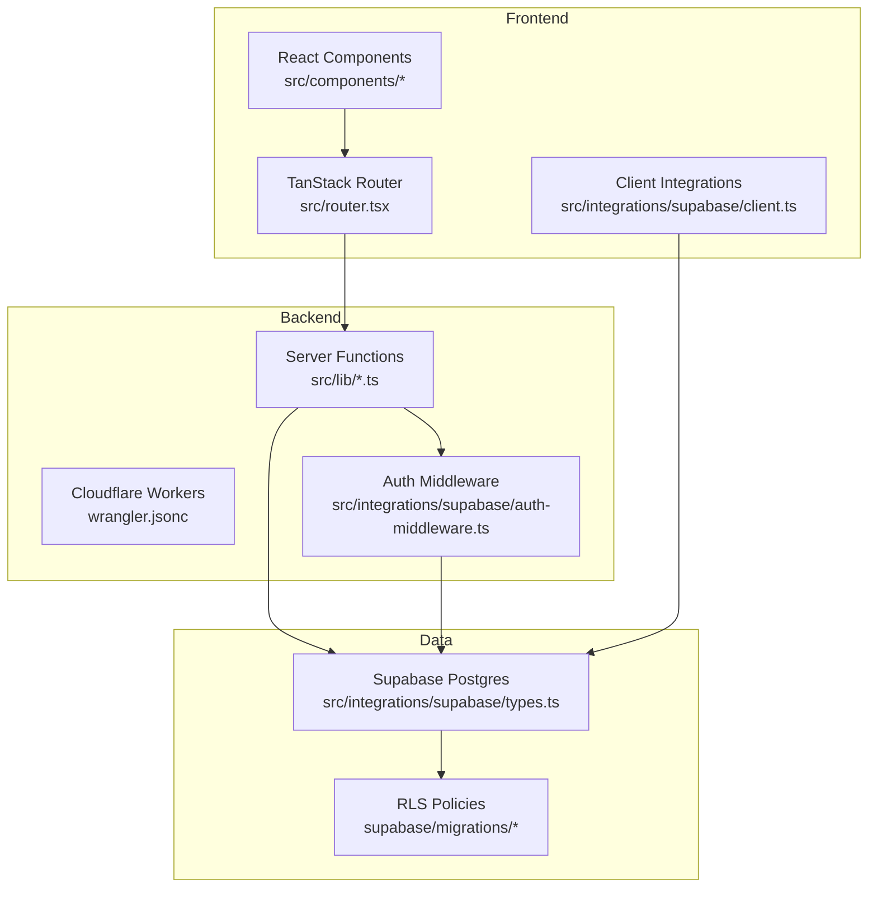
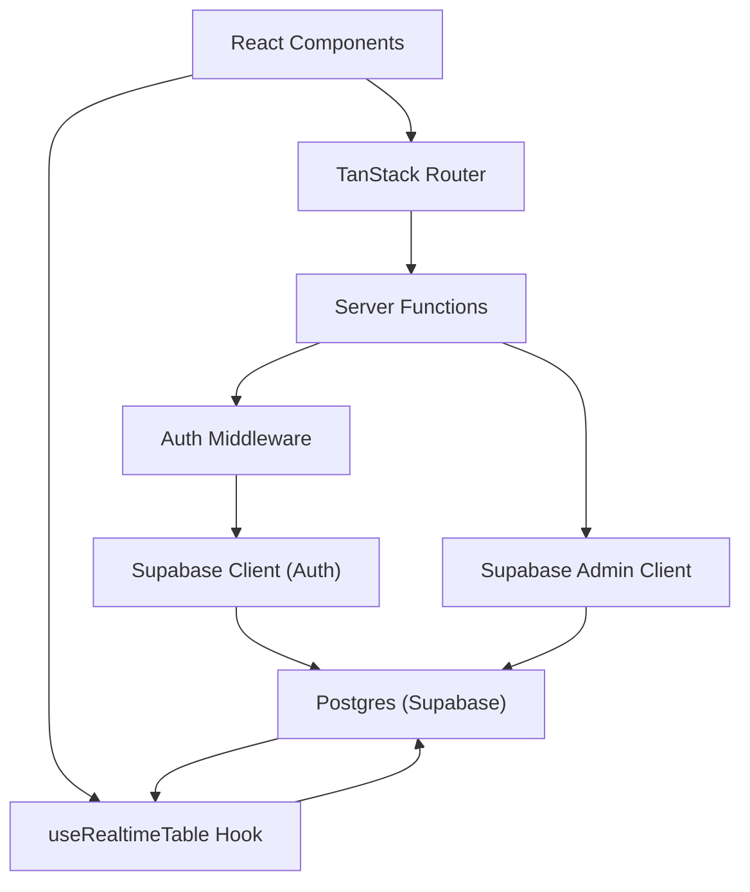
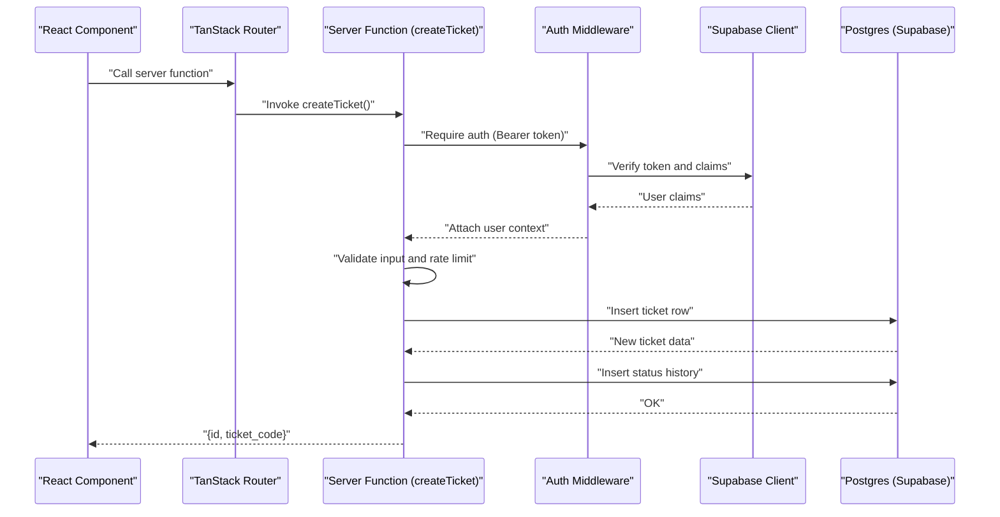
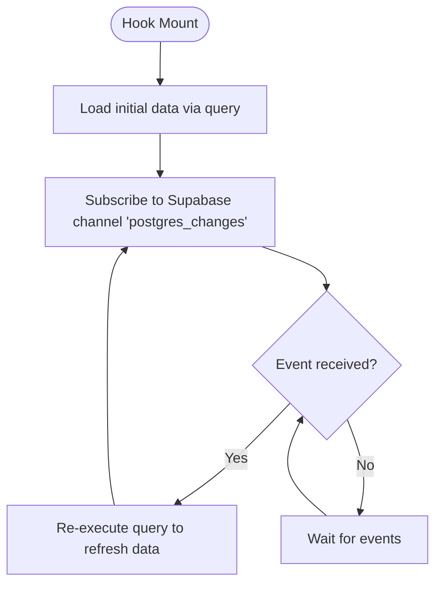
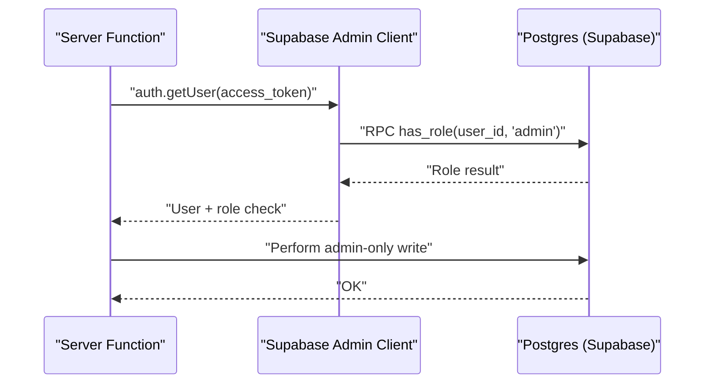
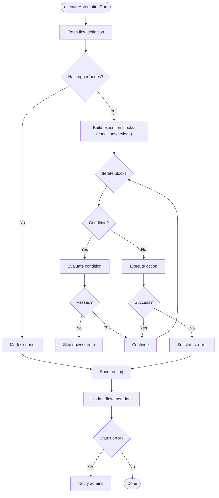
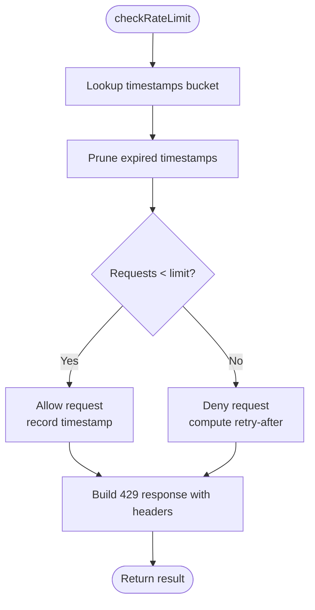
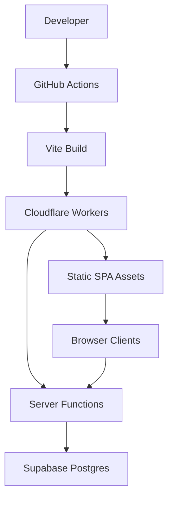
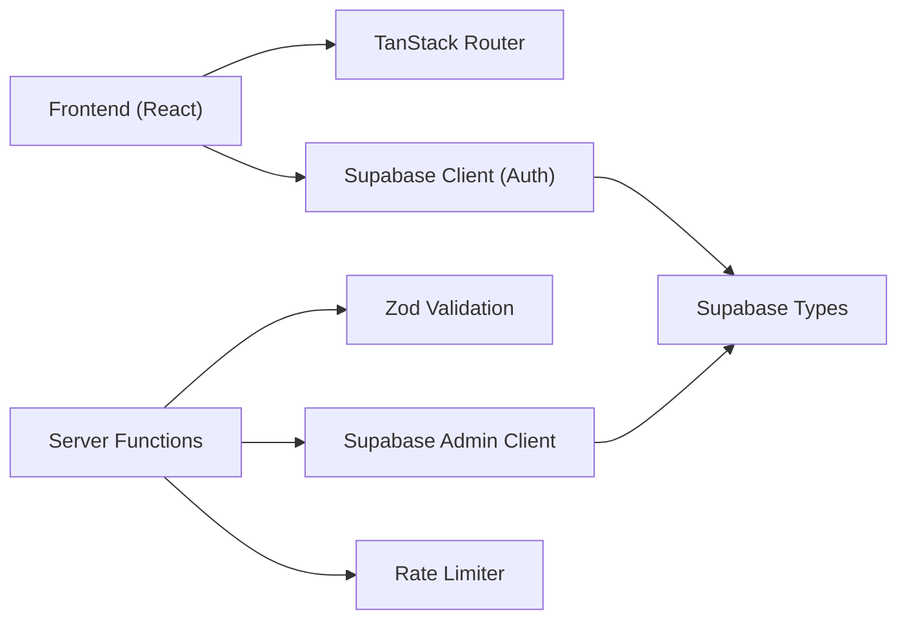

# System Design

<cite>
**Referenced Files in This Document**
- [README.md](file://README.md)
- [architecture.md](file://docs/architecture.md)
- [package.json](file://package.json)
- [wrangler.jsonc](file://wrangler.jsonc)
- [deploy.yml](file://.github/workflows/deploy.yml)
- [router.tsx](file://src/router.tsx)
- [client.ts](file://src/integrations/supabase/client.ts)
- [client.server.ts](file://src/integrations/supabase/client.server.ts)
- [auth-middleware.ts](file://src/integrations/supabase/auth-middleware.ts)
- [useRealtimeTable.ts](file://src/hooks/useRealtimeTable.ts)
- [tickets.ts](file://src/lib/tickets.ts)
- [admin-users.server.ts](file://src/lib/admin-users.server.ts)
- [automation-runs.server.ts](file://src/lib/automation-runs.server.ts)
- [rate-limit.ts](file://src/lib/rate-limit.ts)
- [rate-limit-config.ts](file://src/lib/rate-limit-config.ts)
- [versioning.ts](file://src/lib/versioning.ts)
- [types.ts](file://src/integrations/supabase/types.ts)
- [config.toml](file://supabase/config.toml)
</cite>

## Table of Contents

1. [Introduction](#introduction)
2. [Project Structure](#project-structure)
3. [Core Components](#core-components)
4. [Architecture Overview](#architecture-overview)
5. [Detailed Component Analysis](#detailed-component-analysis)
6. [Dependency Analysis](#dependency-analysis)
7. [Performance Considerations](#performance-considerations)
8. [Troubleshooting Guide](#troubleshooting-guide)
9. [Conclusion](#conclusion)

## Introduction

This document describes the full-stack architecture of PCReady, focusing on the separation between the frontend Single Page Application (SPA) built with React and TanStack Router, and the backend serverless functions powered by Cloudflare Workers. It explains how data flows from React components through the router and server functions to Supabase Postgres, and how Supabase’s real-time capabilities keep the UI synchronized. It also covers infrastructure, deployment topology, scalability, and separation of concerns across presentation, business logic, and data layers.

## Project Structure

The repository follows a clear separation of concerns:

- Frontend SPA: React + TanStack Router (file-based routing) with Vite for build tooling.
- Backend serverless: Cloudflare Workers configured via Wrangler, hosting TanStack Start server functions.
- Data layer: Supabase Postgres with Row Level Security (RLS), real-time channels, and stored procedures.
- DevOps: GitHub Actions for CI/CD to deploy to Cloudflare Workers.

**Diagram sources**

- [router.tsx:1-16](file://src/router.tsx#L1-L16)
- [client.ts:1-41](file://src/integrations/supabase/client.ts#L1-L41)
- [client.server.ts:1-42](file://src/integrations/supabase/client.server.ts#L1-L42)
- [auth-middleware.ts:1-74](file://src/integrations/supabase/auth-middleware.ts#L1-L74)
- [wrangler.jsonc:1-8](file://wrangler.jsonc#L1-L8)
- [types.ts:1-120](file://src/integrations/supabase/types.ts#L1-L120)

**Section sources**

- [README.md:1-159](file://README.md#L1-L159)
- [architecture.md:1-37](file://docs/architecture.md#L1-L37)
- [package.json:1-110](file://package.json#L1-L110)
- [wrangler.jsonc:1-8](file://wrangler.jsonc#L1-L8)

## Core Components

- Frontend SPA and Routing
  - TanStack Router creates the SPA routing tree and integrates with TanStack Start for server-side rendering and server functions.
  - The router is configured with error handling and scroll restoration.
- Supabase Clients
  - Client for browser-side authenticated queries (user-aware, respects RLS).
  - Admin client for server functions (service role, bypasses RLS).
- Authentication Middleware
  - Validates Bearer tokens and injects user context into server functions.
- Server Functions
  - Example: createTicket server function validates input, enforces rate limits, and inserts records into Supabase.
  - Admin utilities: requireAdmin and requireAutomationRunnerUser enforce roles.
- Real-time Hooks
  - useRealtimeTable subscribes to Supabase Postgres changes and refreshes data on events.
- Rate Limiting
  - In-memory sliding window with optional Redis-backed scaling.
- Versioning
  - Entity version snapshots and diffs for auditability and restore.

**Section sources**

- [router.tsx:1-16](file://src/router.tsx#L1-L16)
- [client.ts:1-41](file://src/integrations/supabase/client.ts#L1-L41)
- [client.server.ts:1-42](file://src/integrations/supabase/client.server.ts#L1-L42)
- [auth-middleware.ts:1-74](file://src/integrations/supabase/auth-middleware.ts#L1-L74)
- [tickets.ts:1-111](file://src/lib/tickets.ts#L1-L111)
- [admin-users.server.ts:1-18](file://src/lib/admin-users.server.ts#L1-L18)
- [automation-runs.server.ts:1-200](file://src/lib/automation-runs.server.ts#L1-L200)
- [useRealtimeTable.ts:1-50](file://src/hooks/useRealtimeTable.ts#L1-L50)
- [rate-limit.ts:1-104](file://src/lib/rate-limit.ts#L1-L104)
- [rate-limit-config.ts:1-31](file://src/lib/rate-limit-config.ts#L1-L31)
- [versioning.ts:1-271](file://src/lib/versioning.ts#L1-L271)

## Architecture Overview

The system is layered:

- Presentation Layer: React SPA with TanStack Router.
- Business Logic Layer: TanStack Start server functions and middleware.
- Data Access Layer: Supabase client libraries and Postgres.

**Diagram sources**

- [router.tsx:1-16](file://src/router.tsx#L1-L16)
- [auth-middleware.ts:1-74](file://src/integrations/supabase/auth-middleware.ts#L1-L74)
- [client.ts:1-41](file://src/integrations/supabase/client.ts#L1-L41)
- [client.server.ts:1-42](file://src/integrations/supabase/client.server.ts#L1-L42)
- [useRealtimeTable.ts:1-50](file://src/hooks/useRealtimeTable.ts#L1-L50)
- [types.ts:1-120](file://src/integrations/supabase/types.ts#L1-L120)

## Detailed Component Analysis

### Data Flow: Create Ticket

This sequence illustrates how a React component triggers a server function, which authenticates via Supabase, enforces rate limits, and writes to the database.

**Diagram sources**

- [tickets.ts:50-111](file://src/lib/tickets.ts#L50-L111)
- [auth-middleware.ts:7-74](file://src/integrations/supabase/auth-middleware.ts#L7-L74)
- [client.ts:5-41](file://src/integrations/supabase/client.ts#L5-L41)

**Section sources**

- [tickets.ts:1-111](file://src/lib/tickets.ts#L1-L111)
- [auth-middleware.ts:1-74](file://src/integrations/supabase/auth-middleware.ts#L1-L74)

### Real-time Data Synchronization

The useRealtimeTable hook establishes a Supabase real-time channel for a given table, loads initial data, and refreshes on change events.

**Diagram sources**

- [useRealtimeTable.ts:10-50](file://src/hooks/useRealtimeTable.ts#L10-L50)
- [client.ts:5-41](file://src/integrations/supabase/client.ts#L5-L41)

**Section sources**

- [useRealtimeTable.ts:1-50](file://src/hooks/useRealtimeTable.ts#L1-L50)

### Role-Based Access Control and Admin Operations

Admin utilities demonstrate enforcement of roles using RPC checks and service-role clients.

**Diagram sources**

- [admin-users.server.ts:1-18](file://src/lib/admin-users.server.ts#L1-L18)
- [client.server.ts:1-42](file://src/integrations/supabase/client.server.ts#L1-L42)

**Section sources**

- [admin-users.server.ts:1-18](file://src/lib/admin-users.server.ts#L1-L18)
- [client.server.ts:1-42](file://src/integrations/supabase/client.server.ts#L1-L42)

### Automation Execution Pipeline

The automation engine executes flows composed of conditions and actions, logs outcomes, and notifies administrators on failure.

**Diagram sources**

- [automation-runs.server.ts:94-207](file://src/lib/automation-runs.server.ts#L94-L207)

**Section sources**

- [automation-runs.server.ts:1-207](file://src/lib/automation-runs.server.ts#L1-L207)

### Rate Limiting Strategy

The rate limiter enforces sliding-window quotas per identifier and preset keys. Excess requests return a 429 with standard rate limit headers.

**Diagram sources**

- [rate-limit.ts:30-104](file://src/lib/rate-limit.ts#L30-L104)
- [rate-limit-config.ts:1-31](file://src/lib/rate-limit-config.ts#L1-L31)

**Section sources**

- [rate-limit.ts:1-104](file://src/lib/rate-limit.ts#L1-L104)
- [rate-limit-config.ts:1-31](file://src/lib/rate-limit-config.ts#L1-L31)

### Deployment Topology and Infrastructure

- Frontend assets are built with Vite and deployed to Cloudflare Workers via Wrangler.
- Environment secrets are injected during CI/CD to configure Supabase and Cloudflare credentials.
- Supabase manages Postgres, RLS, and real-time subscriptions.

**Diagram sources**

- [deploy.yml:1-53](file://.github/workflows/deploy.yml#L1-L53)
- [wrangler.jsonc:1-8](file://wrangler.jsonc#L1-L8)
- [package.json:1-110](file://package.json#L1-L110)

**Section sources**

- [deploy.yml:1-53](file://.github/workflows/deploy.yml#L1-L53)
- [wrangler.jsonc:1-8](file://wrangler.jsonc#L1-L8)
- [README.md:95-103](file://README.md#L95-L103)

## Dependency Analysis

- Frontend depends on TanStack Router, Supabase JS client, and UI libraries.
- Server functions depend on Supabase clients (auth and admin), Zod for validation, and rate limiting utilities.
- Supabase types define the schema used across the app.

**Diagram sources**

- [package.json:22-86](file://package.json#L22-L86)
- [client.ts:1-41](file://src/integrations/supabase/client.ts#L1-L41)
- [client.server.ts:1-42](file://src/integrations/supabase/client.server.ts#L1-L42)
- [tickets.ts:1-111](file://src/lib/tickets.ts#L1-L111)
- [rate-limit.ts:1-104](file://src/lib/rate-limit.ts#L1-L104)
- [types.ts:1-120](file://src/integrations/supabase/types.ts#L1-L120)

**Section sources**

- [package.json:22-86](file://package.json#L22-L86)
- [types.ts:1-120](file://src/integrations/supabase/types.ts#L1-L120)

## Performance Considerations

- Pagination and server-side filtering reduce payload sizes and database load.
- Real-time subscriptions keep UI in sync with minimal polling overhead.
- Sliding-window rate limiting prevents abuse and stabilizes throughput.
- Serverless cold starts can be mitigated by keeping functions small and leveraging caching where appropriate.
- Supabase RLS and indexes should be reviewed to optimize query plans.

[No sources needed since this section provides general guidance]

## Troubleshooting Guide

- Authentication failures
  - Ensure Bearer token is present and valid; verify Supabase environment variables are set in the server environment.
- Rate limit exceeded
  - Inspect Retry-After and X-RateLimit-\* headers; adjust presets or implement client-side backoff.
- Real-time not updating
  - Confirm Supabase real-time channel subscription and table permissions; check network connectivity and CORS.
- Admin operations failing
  - Verify service role key and RPC role checks; confirm user has required role.

**Section sources**

- [auth-middleware.ts:1-74](file://src/integrations/supabase/auth-middleware.ts#L1-L74)
- [rate-limit.ts:74-104](file://src/lib/rate-limit.ts#L74-L104)
- [useRealtimeTable.ts:1-50](file://src/hooks/useRealtimeTable.ts#L1-L50)
- [admin-users.server.ts:1-18](file://src/lib/admin-users.server.ts#L1-L18)

## Conclusion

PCReady employs a clean separation of concerns: the frontend focuses on presentation and user interactions, serverless functions encapsulate business logic and enforce policies, and Supabase provides secure, real-time data access. The deployment pipeline leverages Cloudflare Workers for scalable edge execution and GitHub Actions for automated delivery. Together, these choices enable a responsive, secure, and maintainable full-stack system.
