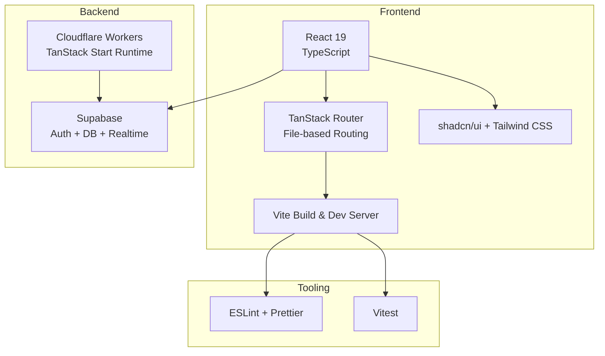
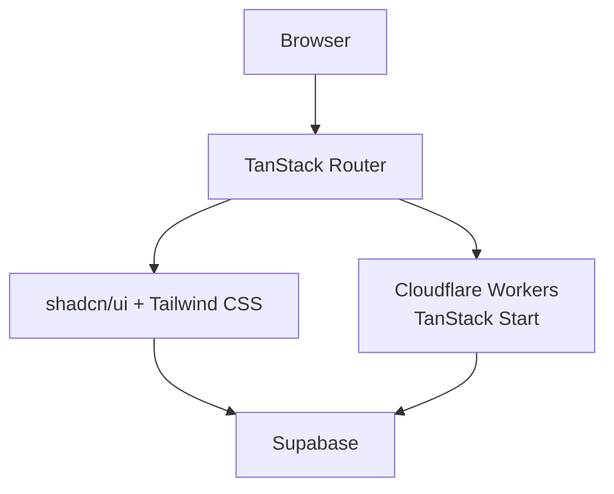
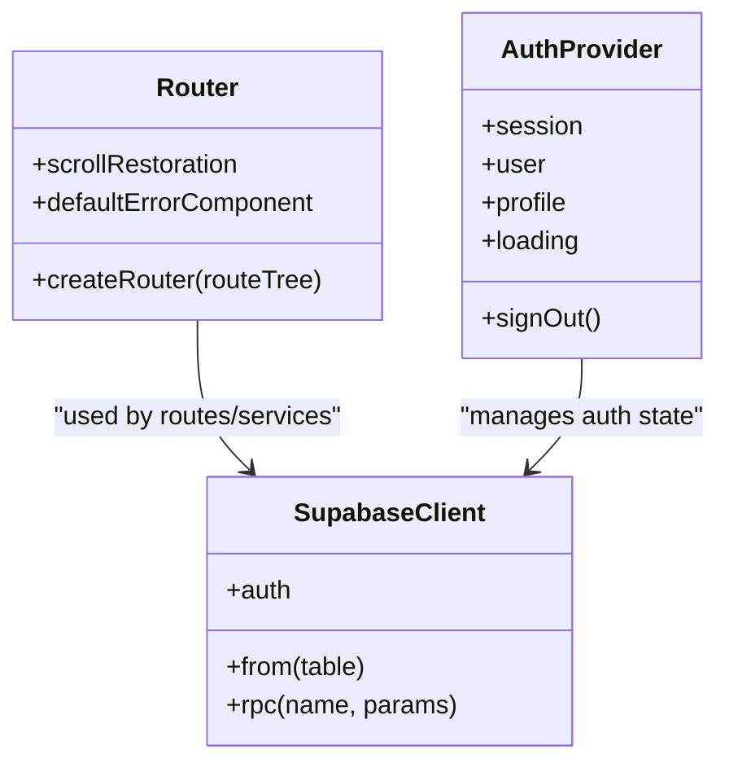
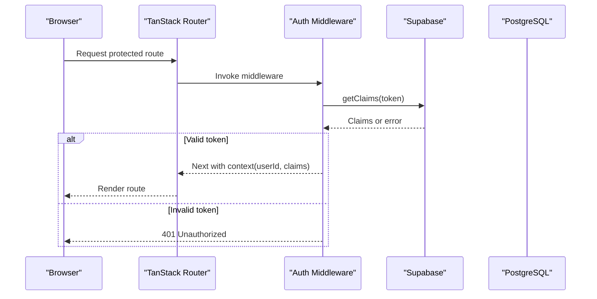
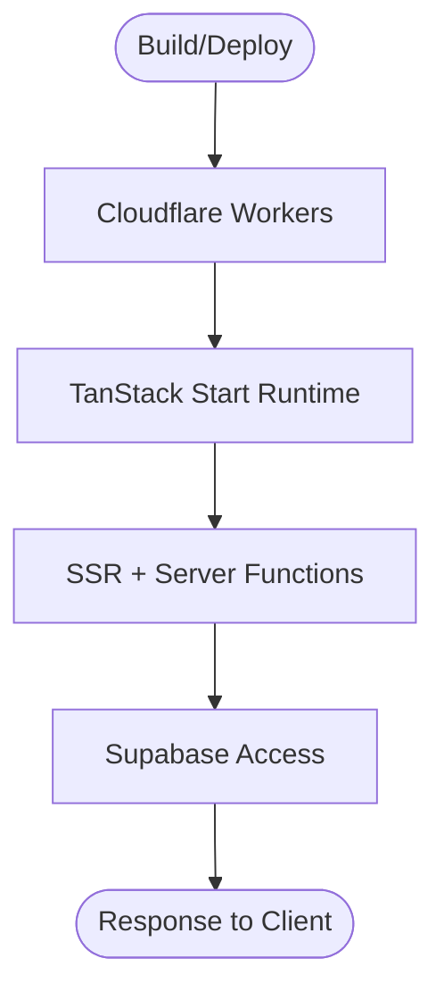
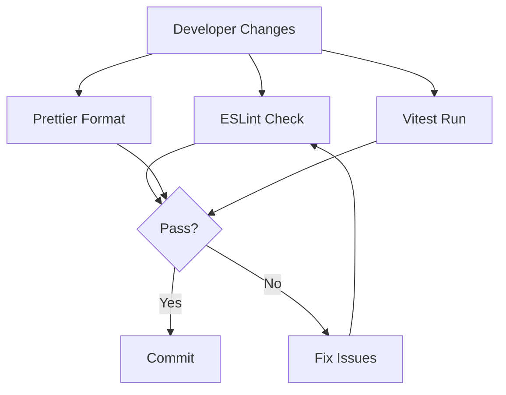
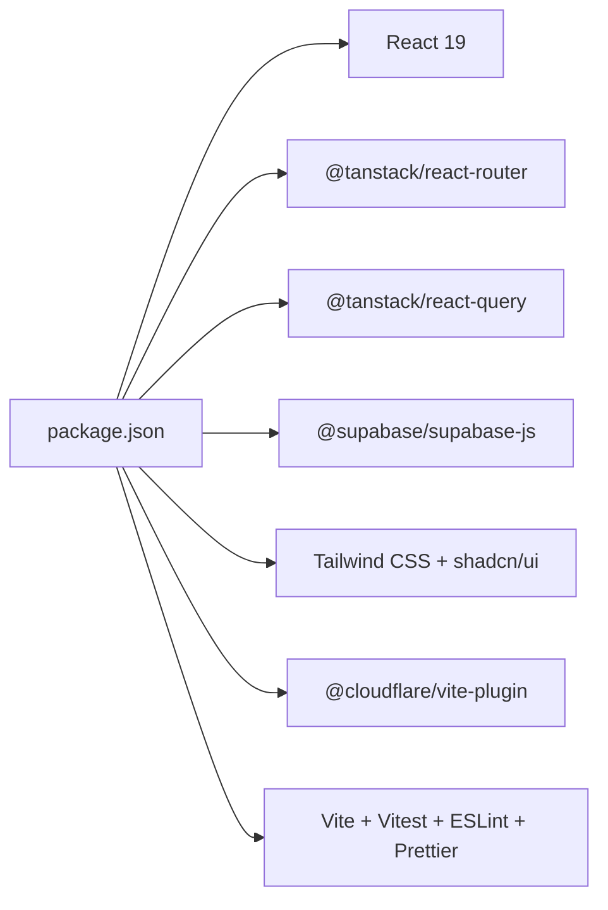

# Technology Stack

<cite>
**Referenced Files in This Document**
- [package.json](file://package.json)
- [vite.config.ts](file://vite.config.ts)
- [tsconfig.json](file://tsconfig.json)
- [eslint.config.js](file://eslint.config.js)
- [components.json](file://components.json)
- [wrangler.jsonc](file://wrangler.jsonc)
- [supabase/config.toml](file://supabase/config.toml)
- [src/router.tsx](file://src/router.tsx)
- [src/integrations/supabase/client.ts](file://src/integrations/supabase/client.ts)
- [src/integrations/supabase/client.server.ts](file://src/integrations/supabase/client.server.ts)
- [src/integrations/supabase/auth-middleware.ts](file://src/integrations/supabase/auth-middleware.ts)
- [src/lib/auth-context.tsx](file://src/lib/auth-context.tsx)
- [src/routes/_app.tsx](file://src/routes/_app.tsx)
</cite>

## Table of Contents
1. [Introduction](#introduction)
2. [Project Structure](#project-structure)
3. [Core Components](#core-components)
4. [Architecture Overview](#architecture-overview)
5. [Detailed Component Analysis](#detailed-component-analysis)
6. [Dependency Analysis](#dependency-analysis)
7. [Performance Considerations](#performance-considerations)
8. [Troubleshooting Guide](#troubleshooting-guide)
9. [Conclusion](#conclusion)

## Introduction
This document describes PCReady’s technology stack and development environment. It covers the frontend (React 19, TypeScript, Vite, TanStack Router), UI framework (shadcn/ui with Tailwind CSS), backend (Supabase for auth, database, and real-time), and serverless functions (Cloudflare Workers). It also documents development tools (ESLint, Prettier), testing (Vitest), dependency management, version compatibility, upgrade paths, build and deployment processes, and workflow optimizations.

## Project Structure
The project follows a modern full-stack monorepo-like structure:
- Frontend built with React 19 and TanStack Router for file-based routing
- UI built with shadcn/ui and Tailwind CSS
- Backend powered by Supabase (authentication, database, real-time)
- Serverless functions hosted on Cloudflare Workers via TanStack Start
- Tooling includes Vite, TypeScript, ESLint, Prettier, and Vitest

[No sources needed since this diagram shows conceptual workflow, not actual code structure]

## Core Components
- Frontend framework: React 19 with TypeScript for type-safe UI development
- Routing: TanStack Router with file-based routing and route generation
- UI library: shadcn/ui with Tailwind CSS for consistent, accessible components
- Build tool: Vite configured via TanStack Start preset for fast dev and optimized builds
- Backend: Supabase for authentication, relational database, and real-time subscriptions
- Serverless: Cloudflare Workers via TanStack Start for server functions and SSR
- Quality tools: ESLint for linting, Prettier for formatting, Vitest for unit tests

**Section sources**
- [package.json:22-86](file://package.json#L22-L86)
- [package.json:87-108](file://package.json#L87-L108)
- [vite.config.ts:1-58](file://vite.config.ts#L1-L58)
- [tsconfig.json:1-30](file://tsconfig.json#L1-L30)
- [eslint.config.js:1-63](file://eslint.config.js#L1-L63)
- [components.json:1-23](file://components.json#L1-L23)
- [wrangler.jsonc:1-8](file://wrangler.jsonc#L1-L8)

## Architecture Overview
PCReady uses a client-driven architecture with serverless functions and a managed backend:
- Client-side React app with TanStack Router handles routing and UI
- Supabase provides authentication, database, and real-time subscriptions
- TanStack Start integrates Cloudflare Workers for server-side rendering and server functions
- Vite manages development and production builds with optimized chunking and SSR support

**Diagram sources**
- [src/router.tsx:1-16](file://src/router.tsx#L1-L16)
- [src/integrations/supabase/client.ts:1-41](file://src/integrations/supabase/client.ts#L1-L41)
- [src/integrations/supabase/client.server.ts:1-42](file://src/integrations/supabase/client.server.ts#L1-L42)
- [wrangler.jsonc:1-8](file://wrangler.jsonc#L1-L8)

## Detailed Component Analysis

### Frontend: React 19 + TanStack Router + shadcn/ui + Tailwind CSS
- React 19 powers the UI with concurrent features and improved performance
- TanStack Router provides file-based routing with route generation and strong typing
- shadcn/ui components are styled with Tailwind CSS and configured via components.json
- Vite is configured via TanStack Start preset with custom chunking and SSR support

**Diagram sources**
- [src/router.tsx:1-16](file://src/router.tsx#L1-L16)
- [src/integrations/supabase/client.ts:1-41](file://src/integrations/supabase/client.ts#L1-L41)
- [src/lib/auth-context.tsx:1-173](file://src/lib/auth-context.tsx#L1-L173)

**Section sources**
- [package.json:71-74](file://package.json#L71-L74)
- [package.json:54-57](file://package.json#L54-L57)
- [components.json:1-23](file://components.json#L1-L23)
- [vite.config.ts:1-58](file://vite.config.ts#L1-L58)
- [src/routes/_app.tsx:1-566](file://src/routes/_app.tsx#L1-L566)

### Backend: Supabase Authentication, Database, and Real-time
- Supabase client initialization supports both browser and server environments
- Server-side admin client uses service role key for privileged operations
- Auth middleware validates bearer tokens and injects user context for protected routes
- Authentication state is managed in the React app with real-time updates

**Diagram sources**
- [src/integrations/supabase/auth-middleware.ts:1-74](file://src/integrations/supabase/auth-middleware.ts#L1-L74)
- [src/integrations/supabase/client.ts:1-41](file://src/integrations/supabase/client.ts#L1-L41)
- [src/integrations/supabase/client.server.ts:1-42](file://src/integrations/supabase/client.server.ts#L1-L42)

**Section sources**
- [src/integrations/supabase/client.ts:1-41](file://src/integrations/supabase/client.ts#L1-L41)
- [src/integrations/supabase/client.server.ts:1-42](file://src/integrations/supabase/client.server.ts#L1-L42)
- [src/integrations/supabase/auth-middleware.ts:1-74](file://src/integrations/supabase/auth-middleware.ts#L1-L74)
- [src/lib/auth-context.tsx:1-173](file://src/lib/auth-context.tsx#L1-L173)

### Serverless: Cloudflare Workers via TanStack Start
- TanStack Start runtime runs on Cloudflare Workers with compatibility flags
- Worker entry points are configured for SSR and server functions
- Supabase environment variables are injected at build/runtime for secure access

**Diagram sources**
- [wrangler.jsonc:1-8](file://wrangler.jsonc#L1-L8)
- [src/integrations/supabase/client.server.ts:1-42](file://src/integrations/supabase/client.server.ts#L1-L42)

**Section sources**
- [wrangler.jsonc:1-8](file://wrangler.jsonc#L1-L8)
- [supabase/config.toml:1-1](file://supabase/config.toml#L1-L1)

### Development Tools: ESLint, Prettier, and Vitest
- ESLint configuration extends recommended TypeScript and React Refresh rules with custom ignores and relaxed rules for specific folders
- Prettier is integrated via CLI scripts for consistent formatting
- Vitest runs unit tests with coverage configured for targeted modules

**Diagram sources**
- [eslint.config.js:1-63](file://eslint.config.js#L1-L63)
- [package.json:15-20](file://package.json#L15-L20)
- [vite.config.ts:39-55](file://vite.config.ts#L39-L55)

**Section sources**
- [eslint.config.js:1-63](file://eslint.config.js#L1-L63)
- [package.json:15-20](file://package.json#L15-L20)
- [vite.config.ts:39-55](file://vite.config.ts#L39-L55)

## Dependency Analysis
- Frontend dependencies include React 19, TanStack Router, Radix UI primitives, shadcn/ui components, Tailwind CSS, and related libraries
- Backend and serverless dependencies include Supabase client, TanStack Query, and Cloudflare Vite plugin
- Tooling dependencies include Vite, TypeScript, ESLint, Prettier, and Vitest

**Diagram sources**
- [package.json:22-108](file://package.json#L22-L108)

**Section sources**
- [package.json:22-108](file://package.json#L22-L108)

## Performance Considerations
- Vite build configuration optimizes dependencies into vendor chunks for PDF, charts, drag-and-drop, flow, Swagger UI, and Radix UI
- SSR excludes problematic dependencies and suppresses specific warnings during analysis
- Coverage thresholds focus on targeted modules to maintain meaningful metrics

**Section sources**
- [vite.config.ts:17-38](file://vite.config.ts#L17-L38)
- [vite.config.ts:39-55](file://vite.config.ts#L39-L55)

## Troubleshooting Guide
- Missing Supabase environment variables cause client/server initialization to log and throw errors; ensure environment variables are present for both client and server contexts
- Auth middleware requires a Bearer token; missing or invalid tokens result in 401 responses
- ESLint ignores generated files and specific paths to reduce noise; verify ignore patterns if linting anomalies occur
- Vitest coverage excludes type definitions and test files; adjust include/exclude patterns if coverage drifts

**Section sources**
- [src/integrations/supabase/client.ts:8-20](file://src/integrations/supabase/client.ts#L8-L20)
- [src/integrations/supabase/client.server.ts:9-20](file://src/integrations/supabase/client.server.ts#L9-L20)
- [src/integrations/supabase/auth-middleware.ts:24-41](file://src/integrations/supabase/auth-middleware.ts#L24-L41)
- [eslint.config.js:9-21](file://eslint.config.js#L9-L21)
- [vite.config.ts:43-54](file://vite.config.ts#L43-L54)

## Conclusion
PCReady’s stack combines a modern React 19 frontend with TanStack Router and shadcn/ui/Tailwind CSS, backed by Supabase for authentication, database, and real-time features, and executed on Cloudflare Workers via TanStack Start. Development tools ensure code quality and reliability, while Vite and SSR enable fast iteration and optimal performance. The architecture balances developer productivity with scalability and maintainability.