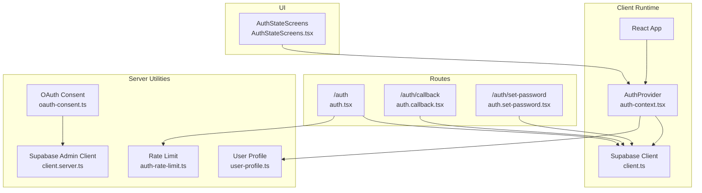
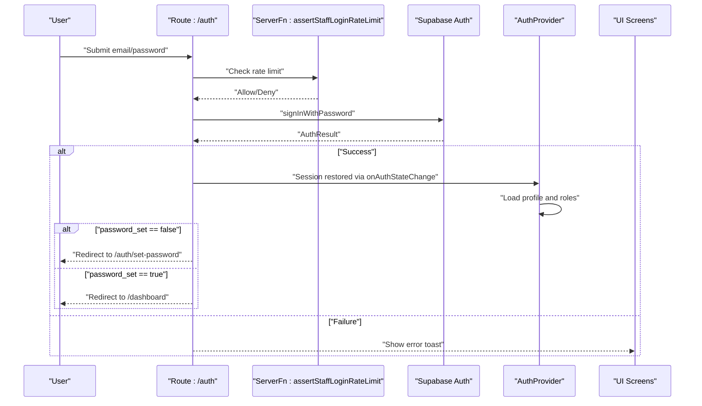
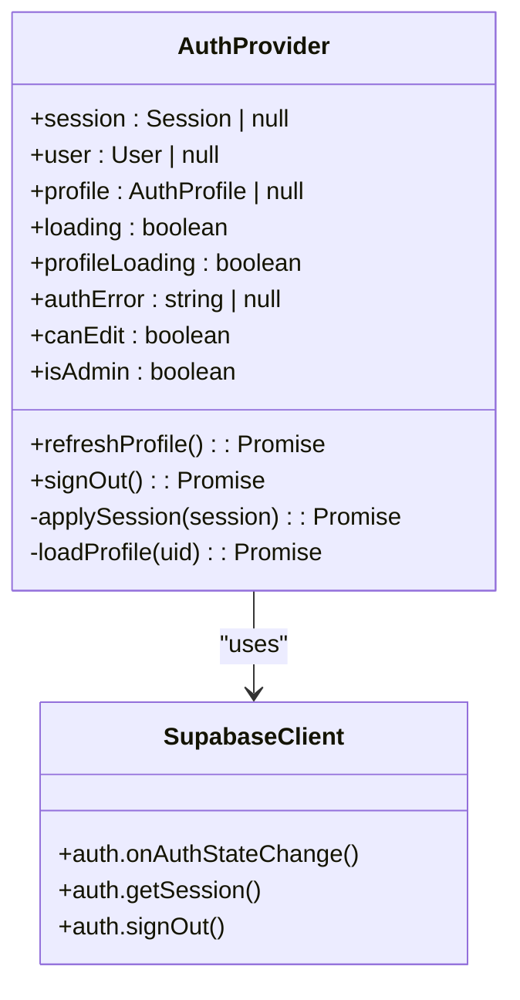
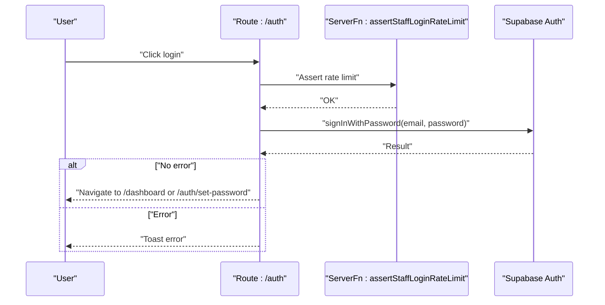
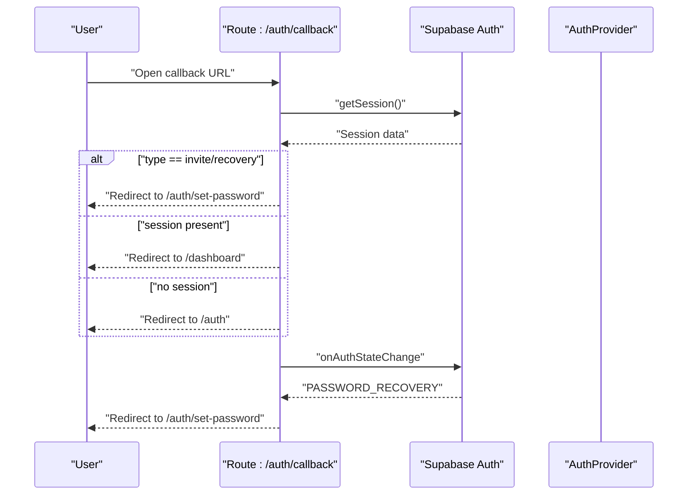
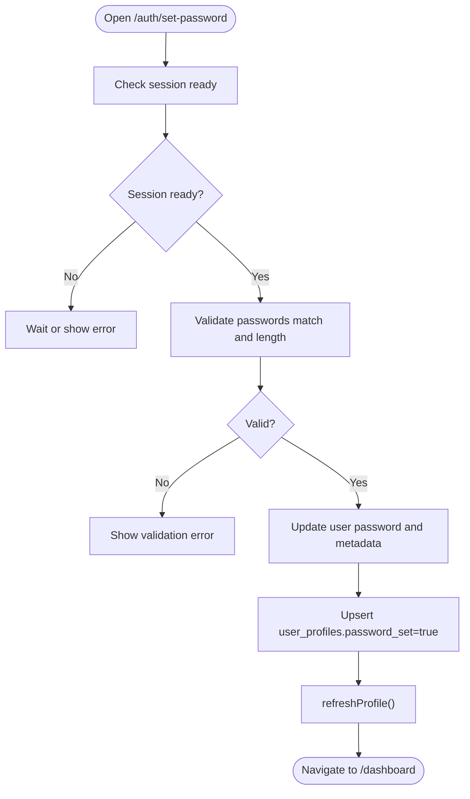
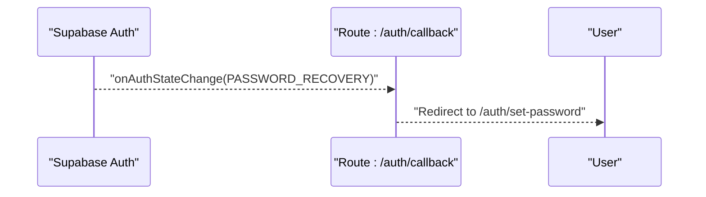
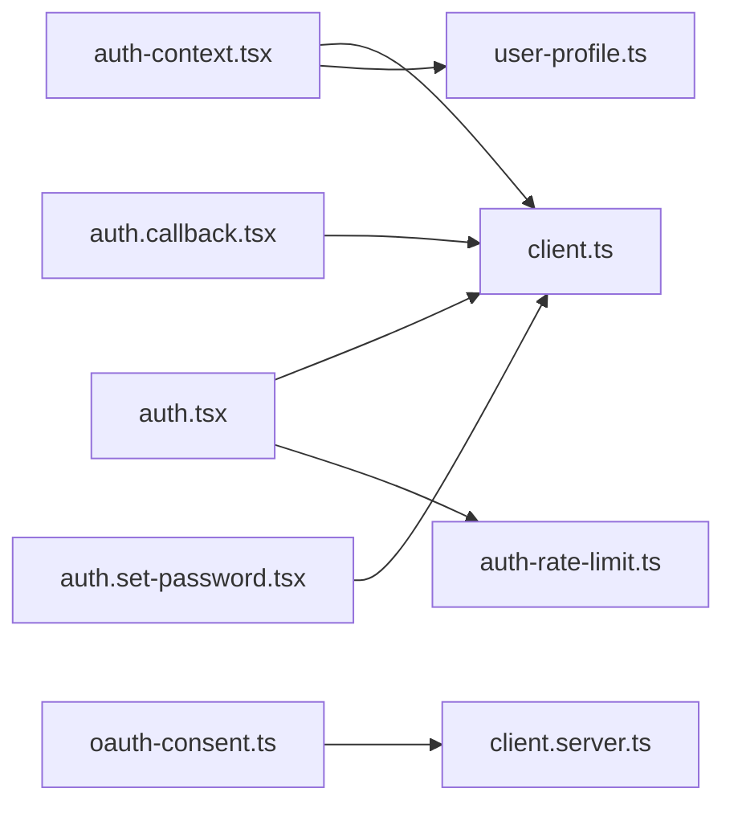

# Authentication Flow

<cite>
**Referenced Files in This Document**
- [auth-context.tsx](file://src/lib/auth-context.tsx)
- [client.ts](file://src/integrations/supabase/client.ts)
- [client.server.ts](file://src/integrations/supabase/client.server.ts)
- [auth.tsx](file://src/routes/auth.tsx)
- [auth.callback.tsx](file://src/routes/auth.callback.tsx)
- [auth.set-password.tsx](file://src/routes/auth.set-password.tsx)
- [AuthStateScreens.tsx](file://src/components/auth/AuthStateScreens.tsx)
- [auth-rate-limit.ts](file://src/lib/auth-rate-limit.ts)
- [user-profile.ts](file://src/lib/user-profile.ts)
- [oauth-consent.ts](file://src/lib/oauth-consent.ts)
</cite>

## Table of Contents
1. [Introduction](#introduction)
2. [Project Structure](#project-structure)
3. [Core Components](#core-components)
4. [Architecture Overview](#architecture-overview)
5. [Detailed Component Analysis](#detailed-component-analysis)
6. [Dependency Analysis](#dependency-analysis)
7. [Performance Considerations](#performance-considerations)
8. [Troubleshooting Guide](#troubleshooting-guide)
9. [Conclusion](#conclusion)

## Introduction
This document explains the authentication flow in PCReady, focusing on Supabase Auth with email/password login, session establishment and persistence, automatic session restoration on page reload, and authentication state management via React Context. It also covers OAuth callback handling, the password set flow for new users, password reset procedures, error handling strategies, session persistence and automatic logout scenarios, and practical guidance for integrating authentication checks in components. Multi-tab session management and concurrent login prevention are addressed conceptually.

## Project Structure
PCReady’s authentication implementation spans several modules:
- Supabase client configuration with persistent sessions and token auto-refresh
- A React Context provider that manages session, user, and profile state
- Route handlers for login, OAuth callback, and password set flows
- UI screens for loading, error, and missing profile states
- Rate limiting for staff login attempts
- Server-side utilities for admin operations and user profile management
- OAuth consent utilities for third-party integrations

**Diagram sources**
- [auth-context.tsx:43-166](file://src/lib/auth-context.tsx#L43-L166)
- [client.ts:5-41](file://src/integrations/supabase/client.ts#L5-L41)
- [auth.tsx:19-84](file://src/routes/auth.tsx#L19-L84)
- [auth.callback.tsx:9-84](file://src/routes/auth.callback.tsx#L9-L84)
- [auth.set-password.tsx:14-189](file://src/routes/auth.set-password.tsx#L14-L189)
- [AuthStateScreens.tsx:18-80](file://src/components/auth/AuthStateScreens.tsx#L18-L80)
- [auth-rate-limit.ts:18-25](file://src/lib/auth-rate-limit.ts#L18-L25)
- [user-profile.ts:73-134](file://src/lib/user-profile.ts#L73-L134)
- [oauth-consent.ts:141-194](file://src/lib/oauth-consent.ts#L141-L194)
- [client.server.ts:8-42](file://src/integrations/supabase/client.server.ts#L8-L42)

**Section sources**
- [auth-context.tsx:43-166](file://src/lib/auth-context.tsx#L43-L166)
- [client.ts:5-41](file://src/integrations/supabase/client.ts#L5-L41)
- [auth.tsx:19-84](file://src/routes/auth.tsx#L19-L84)
- [auth.callback.tsx:9-84](file://src/routes/auth.callback.tsx#L9-L84)
- [auth.set-password.tsx:14-189](file://src/routes/auth.set-password.tsx#L14-L189)
- [AuthStateScreens.tsx:18-80](file://src/components/auth/AuthStateScreens.tsx#L18-L80)
- [auth-rate-limit.ts:18-25](file://src/lib/auth-rate-limit.ts#L18-L25)
- [user-profile.ts:73-134](file://src/lib/user-profile.ts#L73-L134)
- [oauth-consent.ts:141-194](file://src/lib/oauth-consent.ts#L141-L194)
- [client.server.ts:8-42](file://src/integrations/supabase/client.server.ts#L8-L42)

## Core Components
- Supabase client configured with persistent sessions and token auto-refresh, ensuring seamless re-authentication after reload.
- AuthProvider that:
  - Subscribes to Supabase auth state changes
  - Restores session on app start
  - Loads user profile and roles
  - Exposes session, user, profile, loading flags, and sign-out
- Login route (/auth) that validates rate limits, authenticates via email/password, and navigates to dashboard or password set screen depending on user state.
- OAuth callback handler (/auth/callback) that finalizes session retrieval and redirects based on session presence or special flows (invite/recovery).
- Password set route (/auth/set-password) for new users to set a permanent password and finalize registration.
- AuthStateScreens for loading, error, and missing profile states during authentication transitions.
- Rate limiting for staff login attempts to mitigate brute-force.
- Server-side utilities for admin operations and user profile management.

**Section sources**
- [client.ts:22-28](file://src/integrations/supabase/client.ts#L22-L28)
- [auth-context.tsx:43-166](file://src/lib/auth-context.tsx#L43-L166)
- [auth.tsx:44-84](file://src/routes/auth.tsx#L44-L84)
- [auth.callback.tsx:30-72](file://src/routes/auth.callback.tsx#L30-L72)
- [auth.set-password.tsx:38-105](file://src/routes/auth.set-password.tsx#L38-L105)
- [AuthStateScreens.tsx:29-79](file://src/components/auth/AuthStateScreens.tsx#L29-L79)
- [auth-rate-limit.ts:18-25](file://src/lib/auth-rate-limit.ts#L18-L25)
- [user-profile.ts:73-134](file://src/lib/user-profile.ts#L73-L134)

## Architecture Overview
The authentication architecture centers on Supabase Auth with a React Context provider managing state and UI flows.

**Diagram sources**
- [auth.tsx:70-84](file://src/routes/auth.tsx#L70-L84)
- [auth-rate-limit.ts:18-25](file://src/lib/auth-rate-limit.ts#L18-L25)
- [client.ts:22-28](file://src/integrations/supabase/client.ts#L22-L28)
- [auth-context.tsx:114-146](file://src/lib/auth-context.tsx#L114-L146)

## Detailed Component Analysis

### AuthProvider and Session Management
AuthProvider subscribes to Supabase auth state changes, restores the session on startup, and loads profile and role data. It exposes:
- session, user, profile, loading flags
- profileLoading and authError
- refreshProfile and signOut
- Role-derived helpers canEdit and isAdmin

**Diagram sources**
- [auth-context.tsx:24-35](file://src/lib/auth-context.tsx#L24-L35)
- [auth-context.tsx:43-166](file://src/lib/auth-context.tsx#L43-L166)
- [client.ts:5-41](file://src/integrations/supabase/client.ts#L5-L41)

**Section sources**
- [auth-context.tsx:43-166](file://src/lib/auth-context.tsx#L43-L166)
- [client.ts:22-28](file://src/integrations/supabase/client.ts#L22-L28)

### Email/Password Login Flow
- Validates rate limit server-side before attempting login
- Calls Supabase signInWithPassword
- On success, navigates to dashboard or password set based on profile.password_set
- Displays user-friendly errors via toasts

**Diagram sources**
- [auth.tsx:70-84](file://src/routes/auth.tsx#L70-L84)
- [auth-rate-limit.ts:18-25](file://src/lib/auth-rate-limit.ts#L18-L25)

**Section sources**
- [auth.tsx:44-84](file://src/routes/auth.tsx#L44-L84)
- [auth-rate-limit.ts:18-25](file://src/lib/auth-rate-limit.ts#L18-L25)

### OAuth Callback Handling
- Parses hash parameters to detect invite/recovery flows
- Retrieves session and redirects accordingly
- Subscribes to auth state changes to detect password recovery events

**Diagram sources**
- [auth.callback.tsx:37-72](file://src/routes/auth.callback.tsx#L37-L72)
- [client.ts:22-28](file://src/integrations/supabase/client.ts#L22-L28)

**Section sources**
- [auth.callback.tsx:30-72](file://src/routes/auth.callback.tsx#L30-L72)

### Password Set Flow for New Users
- Ensures a session exists before allowing password setting
- Validates password confirmation and length
- Updates user password and marks password_set in user_profiles
- Refreshes profile and navigates to dashboard

**Diagram sources**
- [auth.set-password.tsx:50-105](file://src/routes/auth.set-password.tsx#L50-L105)
- [auth-context.tsx:157-159](file://src/lib/auth-context.tsx#L157-L159)

**Section sources**
- [auth.set-password.tsx:38-105](file://src/routes/auth.set-password.tsx#L38-L105)

### Password Reset Procedures
- Recovery flow is detected by auth state change event PASSWORD_RECOVERY
- Redirects to /auth/set-password to allow setting a new password
- Server-side admin utilities support password updates for authorized operations

**Diagram sources**
- [auth.callback.tsx:59-64](file://src/routes/auth.callback.tsx#L59-L64)

**Section sources**
- [auth.callback.tsx:59-64](file://src/routes/auth.callback.tsx#L59-L64)
- [user-profile.ts:179-203](file://src/lib/user-profile.ts#L179-L203)

### Authentication State Screens
- AuthLoadingScreen: renders while authentication resolves
- AuthErrorScreen: displays error messages with retry and sign out actions
- MissingProfileScreen: informs about missing profile and offers retry/sign out

**Section sources**
- [AuthStateScreens.tsx:29-79](file://src/components/auth/AuthStateScreens.tsx#L29-L79)

### OAuth Consent Utilities
- Validates OAuth requests, grants consent, denies consent, and generates authorization codes
- Uses server-side Supabase client with service role key for admin operations

**Section sources**
- [oauth-consent.ts:141-194](file://src/lib/oauth-consent.ts#L141-L194)
- [client.server.ts:8-42](file://src/integrations/supabase/client.server.ts#L8-L42)

## Dependency Analysis
- AuthProvider depends on Supabase client for auth state and session persistence
- Routes depend on Supabase client for authentication operations and on AuthProvider for state
- Rate limiting server function is invoked before login attempts
- User profile operations rely on server-side Supabase client for admin tasks

**Diagram sources**
- [auth-context.tsx:10-11](file://src/lib/auth-context.tsx#L10-L11)
- [client.ts:5-41](file://src/integrations/supabase/client.ts#L5-L41)
- [auth.tsx:11-12](file://src/routes/auth.tsx#L11-L12)
- [auth-rate-limit.ts:18-25](file://src/lib/auth-rate-limit.ts#L18-L25)
- [user-profile.ts:3](file://src/lib/user-profile.ts#L3)
- [auth.callback.tsx:6](file://src/routes/auth.callback.tsx#L6)
- [auth.set-password.tsx:6](file://src/routes/auth.set-password.tsx#L6)
- [oauth-consent.ts:4](file://src/lib/oauth-consent.ts#L4)
- [client.server.ts:5-42](file://src/integrations/supabase/client.server.ts#L5-L42)

**Section sources**
- [auth-context.tsx:10-11](file://src/lib/auth-context.tsx#L10-L11)
- [client.ts:5-41](file://src/integrations/supabase/client.ts#L5-L41)
- [auth.tsx:11-12](file://src/routes/auth.tsx#L11-L12)
- [auth-rate-limit.ts:18-25](file://src/lib/auth-rate-limit.ts#L18-L25)
- [user-profile.ts:3](file://src/lib/user-profile.ts#L3)
- [auth.callback.tsx:6](file://src/routes/auth.callback.tsx#L6)
- [auth.set-password.tsx:6](file://src/routes/auth.set-password.tsx#L6)
- [oauth-consent.ts:4](file://src/lib/oauth-consent.ts#L4)
- [client.server.ts:5-42](file://src/integrations/supabase/client.server.ts#L5-L42)

## Performance Considerations
- Token auto-refresh and persisted sessions reduce redundant login prompts and improve UX.
- Parallel profile and role loading minimizes profile fetch latency.
- Debounced profile refresh prevents unnecessary re-fetches during rapid state changes.

## Troubleshooting Guide
Common issues and remedies:
- Invalid credentials or rate-limited attempts: The login route surfaces server-provided error messages via toasts. Verify rate limit configuration and user credentials.
- Session restoration failure: AuthProvider catches errors during getSession and clears state with an error message. Check environment variables for Supabase URL and keys.
- Missing profile: AuthProvider sets an error state when profile data is unavailable. Ensure profile tables exist and user has a valid role.
- OAuth callback failures: Confirm redirect URI matches configured clients and that the session is retrievable post-callback.
- Password set errors: Validate password length and confirmation, and ensure session is present before proceeding.

**Section sources**
- [auth.tsx:79-83](file://src/routes/auth.tsx#L79-L83)
- [auth-context.tsx:130-139](file://src/lib/auth-context.tsx#L130-L139)
- [auth.set-password.tsx:100-104](file://src/routes/auth.set-password.tsx#L100-L104)
- [auth.callback.tsx:45-49](file://src/routes/auth.callback.tsx#L45-L49)

## Conclusion
PCReady’s authentication system leverages Supabase Auth with persistent sessions and React Context for robust state management. The login, OAuth callback, and password set flows are designed for clarity and resilience, with rate limiting, error handling, and profile loading integrated seamlessly. Developers can rely on AuthProvider to centralize authentication state and use the provided routes and utilities to implement secure, user-friendly authentication experiences.