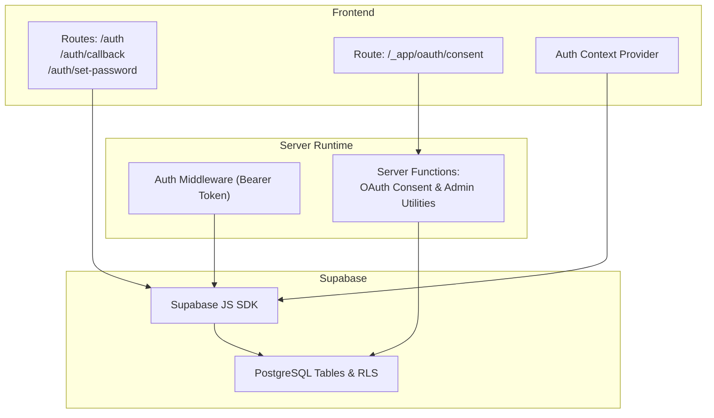
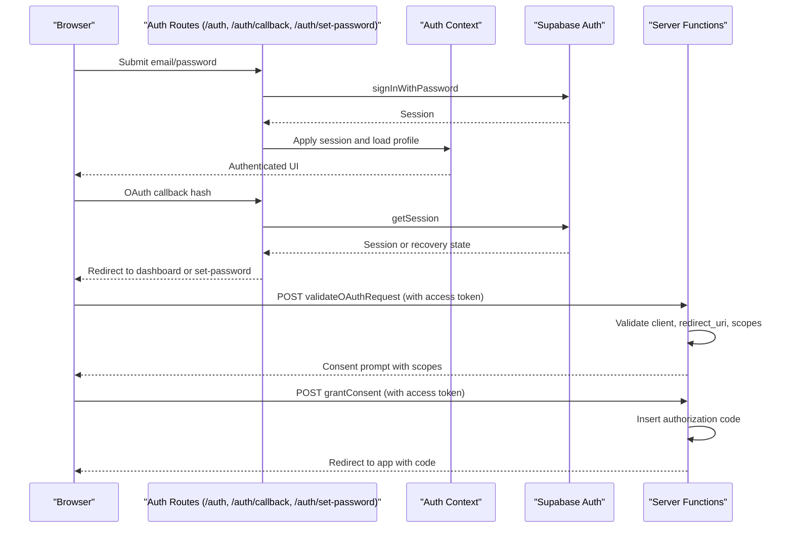
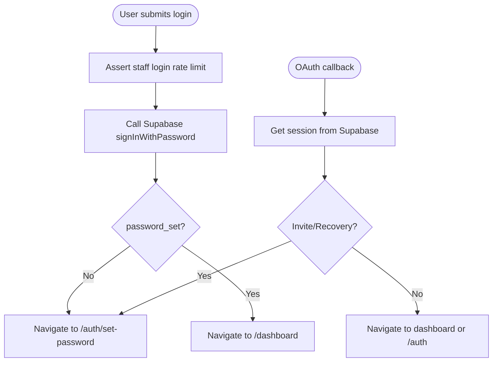
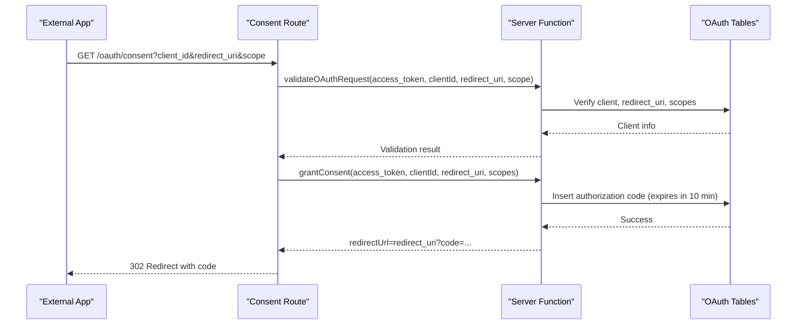
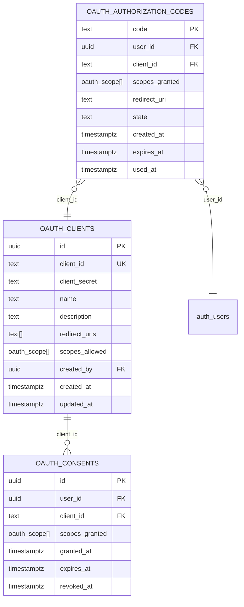
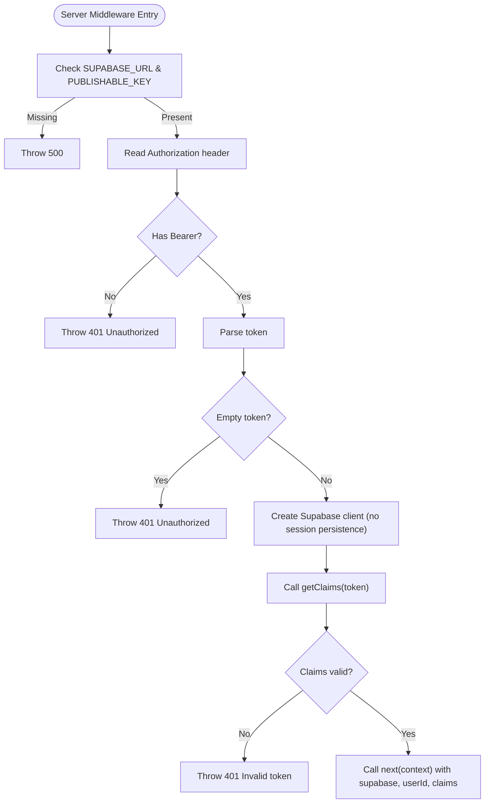
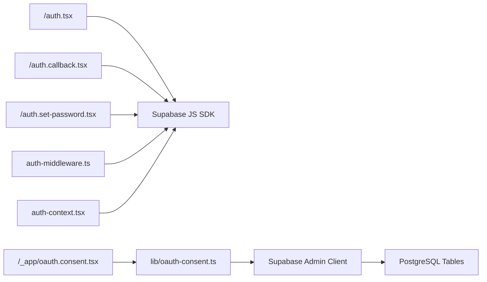

# Authentication and Authorization

<cite>
**Referenced Files in This Document**
- [auth-middleware.ts](file://src/integrations/supabase/auth-middleware.ts)
- [auth-context.tsx](file://src/lib/auth-context.tsx)
- [auth.tsx](file://src/routes/auth.tsx)
- [auth.callback.tsx](file://src/routes/auth.callback.tsx)
- [auth.set-password.tsx](file://src/routes/auth.set-password.tsx)
- [oauth-consent.ts](file://src/lib/oauth-consent.ts)
- [oauth.consent.tsx](file://src/routes/_app/oauth.consent.tsx)
- [admin-users.server.ts](file://src/lib/admin-users.server.ts)
- [20260503120001_oauth_tables.sql](file://supabase/migrations/20260503120001_oauth_tables.sql)
- [20260430143000_admin_user_management_rls.sql](file://supabase/migrations/20260430143000_admin_user_management_rls.sql)
- [20260504170000_add_rls_policies_automation_flows.sql](file://supabase/migrations/20260504170000_add_rls_policies_automation_flows.sql)
</cite>

## Table of Contents

1. [Introduction](#introduction)
2. [Project Structure](#project-structure)
3. [Core Components](#core-components)
4. [Architecture Overview](#architecture-overview)
5. [Detailed Component Analysis](#detailed-component-analysis)
6. [Dependency Analysis](#dependency-analysis)
7. [Performance Considerations](#performance-considerations)
8. [Troubleshooting Guide](#troubleshooting-guide)
9. [Conclusion](#conclusion)

## Introduction

This document explains PCReady’s authentication and authorization system built on Supabase Auth. It covers:

- Authentication flows: email/password login, OAuth provider callbacks, session lifecycle, and password reset
- Role-based access control (RBAC) with admin, tech, and viewer roles
- OAuth 2.0 consent flow for external applications
- Row Level Security (RLS) policies for data isolation
- Authentication middleware protecting server routes
- Session management, password reset, and user invitation workflows
- Security considerations: JWT handling, CSRF protection, and secure cookies
- Registration, password strength, and verification workflows
- Common scenarios: password recovery, multi-factor authentication setup, and session timeout handling
- Troubleshooting and production best practices

## Project Structure

The authentication system spans frontend UI routes, React context, Supabase client integrations, server-side middleware, and Supabase database policies.



**Diagram sources**

- [auth.tsx:1-168](file://src/routes/auth.tsx#L1-L168)
- [auth.callback.tsx:1-84](file://src/routes/auth.callback.tsx#L1-L84)
- [auth.set-password.tsx:1-189](file://src/routes/auth.set-password.tsx#L1-L189)
- [oauth.consent.tsx:1-220](file://src/routes/_app/oauth.consent.tsx#L1-L220)
- [auth-context.tsx:1-173](file://src/lib/auth-context.tsx#L1-L173)
- [auth-middleware.ts:1-74](file://src/integrations/supabase/auth-middleware.ts#L1-L74)
- [oauth-consent.ts:1-520](file://src/lib/oauth-consent.ts#L1-L520)
- [20260503120001_oauth_tables.sql:1-66](file://supabase/migrations/20260503120001_oauth_tables.sql#L1-L66)

**Section sources**

- [auth.tsx:1-168](file://src/routes/auth.tsx#L1-L168)
- [auth.callback.tsx:1-84](file://src/routes/auth.callback.tsx#L1-L84)
- [auth.set-password.tsx:1-189](file://src/routes/auth.set-password.tsx#L1-L189)
- [oauth.consent.tsx:1-220](file://src/routes/_app/oauth.consent.tsx#L1-L220)
- [auth-context.tsx:1-173](file://src/lib/auth-context.tsx#L1-L173)
- [auth-middleware.ts:1-74](file://src/integrations/supabase/auth-middleware.ts#L1-L74)
- [oauth-consent.ts:1-520](file://src/lib/oauth-consent.ts#L1-L520)
- [20260503120001_oauth_tables.sql:1-66](file://supabase/migrations/20260503120001_oauth_tables.sql#L1-L66)

## Core Components

- Supabase Auth integration via React context for session, user, and profile state
- Email/password login route with rate limiting and navigation logic
- OAuth callback handler for external provider redirects and password reset flows
- Password set route enforcing minimum length and updating user metadata/profile
- OAuth 2.0 consent flow with client validation, scope checks, and authorization code generation
- Authentication middleware enforcing Bearer token validation for protected server routes
- Role-based access control using Supabase RLS policies and admin RPC checks
- Admin utilities for OAuth client lifecycle and auditing

**Section sources**

- [auth-context.tsx:1-173](file://src/lib/auth-context.tsx#L1-L173)
- [auth.tsx:1-168](file://src/routes/auth.tsx#L1-L168)
- [auth.callback.tsx:1-84](file://src/routes/auth.callback.tsx#L1-L84)
- [auth.set-password.tsx:1-189](file://src/routes/auth.set-password.tsx#L1-L189)
- [oauth.consent.tsx:1-220](file://src/routes/_app/oauth.consent.tsx#L1-L220)
- [oauth-consent.ts:1-520](file://src/lib/oauth-consent.ts#L1-L520)
- [auth-middleware.ts:1-74](file://src/integrations/supabase/auth-middleware.ts#L1-L74)
- [admin-users.server.ts:1-18](file://src/lib/admin-users.server.ts#L1-L18)

## Architecture Overview

The system integrates Supabase Auth on the frontend and backend:

- Frontend: React context tracks session and user profile; routes implement login, callback, and password set flows
- Backend: Server functions validate OAuth requests, manage consent, and enforce admin-only operations
- Middleware: Validates Bearer tokens for protected server routes
- Database: RLS policies govern access to profiles, OAuth tables, and automation flows



**Diagram sources**

- [auth.tsx:70-84](file://src/routes/auth.tsx#L70-L84)
- [auth.callback.tsx:37-72](file://src/routes/auth.callback.tsx#L37-L72)
- [auth.set-password.tsx:66-105](file://src/routes/auth.set-password.tsx#L66-L105)
- [oauth-consent.ts:141-194](file://src/lib/oauth-consent.ts#L141-L194)
- [oauth-consent.ts:197-254](file://src/lib/oauth-consent.ts#L197-L254)
- [oauth.consent.tsx:56-96](file://src/routes/_app/oauth.consent.tsx#L56-L96)

## Detailed Component Analysis

### Authentication Flows: Email/Password, OAuth Callbacks, and Password Reset

- Email/Password Login
  - The login route validates rate limits, calls Supabase sign-in, and navigates to dashboard or password set depending on user state
  - Minimum password length is enforced on the client
- OAuth Callback
  - Parses hash parameters, retrieves session, and redirects to dashboard or password set based on invite/recovery state
- Password Set
  - Enforces minimum length, confirms passwords, updates user metadata and profile, then refreshes context and navigates to dashboard



**Diagram sources**

- [auth.tsx:70-84](file://src/routes/auth.tsx#L70-L84)
- [auth.callback.tsx:37-72](file://src/routes/auth.callback.tsx#L37-L72)
- [auth.set-password.tsx:61-105](file://src/routes/auth.set-password.tsx#L61-L105)

**Section sources**

- [auth.tsx:1-168](file://src/routes/auth.tsx#L1-L168)
- [auth.callback.tsx:1-84](file://src/routes/auth.callback.tsx#L1-L84)
- [auth.set-password.tsx:1-189](file://src/routes/auth.set-password.tsx#L1-L189)

### Role-Based Access Control (RBAC)

- Roles
  - admin, tech, viewer are represented in the UI context and enforced in RLS policies
- Profile loading
  - The context loads profile, user profile, and resolves role via a stored procedure
- Admin enforcement
  - Admin-only server functions validate access token and role via RPC

```mermaid
classDiagram
class AuthProfile {
+string id
+string full_name
+string initials
+string avatar_url
+boolean password_set
+AppRole role
}
class AuthCtx {
+Session session
+User user
+AuthProfile profile
+boolean loading
+boolean profileLoading
+string authError
+boolean canEdit
+boolean isAdmin
+refreshProfile()
+signOut()
}
class AppRole {
<<enum>>
"admin"
"tech"
"viewer"
}
AuthCtx --> AuthProfile : "manages"
AuthProfile --> AppRole : "has role"
```

**Diagram sources**

- [auth-context.tsx:13-35](file://src/lib/auth-context.tsx#L13-L35)
- [auth-context.tsx:148-165](file://src/lib/auth-context.tsx#L148-L165)

**Section sources**

- [auth-context.tsx:1-173](file://src/lib/auth-context.tsx#L1-L173)
- [admin-users.server.ts:1-18](file://src/lib/admin-users.server.ts#L1-L18)

### OAuth 2.0 Consent Flow

- Request Validation
  - Validates client_id, redirect_uri, and requested scopes against allowed scopes
- Consent Grant
  - Generates a short-lived authorization code and redirects the user-agent to the client with the code
- Consent Denial
  - Returns redirect with standard OAuth error parameters
- Admin Lifecycle
  - Admins can list, create, update status, and rotate secrets for OAuth clients; lifecycle history is audited



**Diagram sources**

- [oauth.consent.tsx:56-96](file://src/routes/_app/oauth.consent.tsx#L56-L96)
- [oauth-consent.ts:141-194](file://src/lib/oauth-consent.ts#L141-L194)
- [oauth-consent.ts:197-254](file://src/lib/oauth-consent.ts#L197-L254)

**Section sources**

- [oauth.consent.tsx:1-220](file://src/routes/_app/oauth.consent.tsx#L1-L220)
- [oauth-consent.ts:1-520](file://src/lib/oauth-consent.ts#L1-L520)
- [20260503120001_oauth_tables.sql:1-66](file://supabase/migrations/20260503120001_oauth_tables.sql#L1-L66)

### Row Level Security (RLS) Policies

- Profiles
  - Admins can read and update profiles based on role checks
- OAuth Tables
  - Clients: authenticated users can read; admins can manage
  - Authorization codes: admin-only read; internal use
  - Consents: users can read/update own; admins can read all
- Automation Flows
  - Select allowed for all; inserts/updates/deletes restricted to owner



**Diagram sources**

- [20260503120001_oauth_tables.sql:4-43](file://supabase/migrations/20260503120001_oauth_tables.sql#L4-L43)

**Section sources**

- [20260430143000_admin_user_management_rls.sql:1-13](file://supabase/migrations/20260430143000_admin_user_management_rls.sql#L1-L13)
- [20260504170000_add_rls_policies_automation_flows.sql:1-30](file://supabase/migrations/20260504170000_add_rls_policies_automation_flows.sql#L1-L30)
- [20260503120001_oauth_tables.sql:1-66](file://supabase/migrations/20260503120001_oauth_tables.sql#L1-L66)

### Authentication Middleware for Protected Routes

- Validates presence of SUPABASE_URL and SUPABASE_PUBLISHABLE_KEY
- Extracts Authorization header, ensures Bearer token format
- Creates a Supabase client configured for server-side token introspection
- Calls getClaims to validate token and extract user ID
- Injects supabase client and user claims into the request context



**Diagram sources**

- [auth-middleware.ts:7-72](file://src/integrations/supabase/auth-middleware.ts#L7-L72)

**Section sources**

- [auth-middleware.ts:1-74](file://src/integrations/supabase/auth-middleware.ts#L1-L74)

### Session Management, Password Reset, and Invitations

- Session lifecycle
  - Auth context subscribes to Supabase auth state changes, loads profile, and exposes refresh/sign-out
- Password reset
  - OAuth callback detects PASSWORD_RECOVERY and redirects to set-password flow
- Invitation
  - OAuth callback detects invite type and redirects to set-password; set-password route enforces minimum length and updates user metadata and profile

**Section sources**

- [auth-context.tsx:114-146](file://src/lib/auth-context.tsx#L114-L146)
- [auth.callback.tsx:59-64](file://src/routes/auth.callback.tsx#L59-L64)
- [auth.set-password.tsx:66-105](file://src/routes/auth.set-password.tsx#L66-L105)

### Security Considerations

- JWT handling
  - Middleware validates Bearer tokens and extracts claims; client sessions are managed by Supabase SDK
- CSRF protection
  - Not explicitly implemented in the reviewed code; consider adding CSRF tokens for state-changing operations and ensuring SameSite cookies
- Secure cookies
  - Supabase manages cookie configuration; ensure HTTPS-only, SameSite, and Secure flags are configured in Supabase project settings
- Token scope and expiration
  - Authorization codes expire after 10 minutes; ensure clients redeem promptly
- Admin-only operations
  - Server functions validate access tokens and roles via RPC before performing sensitive actions

**Section sources**

- [auth-middleware.ts:43-54](file://src/integrations/supabase/auth-middleware.ts#L43-L54)
- [oauth-consent.ts:218-224](file://src/lib/oauth-consent.ts#L218-L224)
- [admin-users.server.ts:1-18](file://src/lib/admin-users.server.ts#L1-L18)

### User Registration, Password Strength, and Verification Workflows

- Registration
  - Accounts are created by administrators; users receive an invitation link
- Password strength
  - Set-password route enforces a minimum length; client-side constraints also enforce minimum lengths
- Verification
  - After setting a password, users are redirected to the dashboard

**Section sources**

- [auth.set-password.tsx:76-79](file://src/routes/auth.set-password.tsx#L76-L79)
- [auth.set-password.tsx:97-105](file://src/routes/auth.set-password.tsx#L97-L105)

### Common Authentication Scenarios

- Password recovery
  - Detected by OAuth callback; user is redirected to set-password flow
- Multi-factor authentication (MFA)
  - Not implemented in the reviewed code; enable MFA in Supabase Auth settings and integrate via Supabase SDK
- Session timeout handling
  - Supabase handles session refresh; middleware relies on valid tokens; ensure client-side error handling for 401 responses

**Section sources**

- [auth.callback.tsx:61-63](file://src/routes/auth.callback.tsx#L61-L63)

## Dependency Analysis

- Frontend depends on Supabase JS SDK for authentication and on server functions for OAuth consent
- Server functions depend on Supabase Admin client and Postgres tables
- Middleware depends on Supabase client and environment variables
- RLS policies depend on role-checking functions and stored procedures



**Diagram sources**

- [auth.tsx:1-168](file://src/routes/auth.tsx#L1-L168)
- [auth.callback.tsx:1-84](file://src/routes/auth.callback.tsx#L1-L84)
- [auth.set-password.tsx:1-189](file://src/routes/auth.set-password.tsx#L1-L189)
- [oauth.consent.tsx:1-220](file://src/routes/_app/oauth.consent.tsx#L1-L220)
- [oauth-consent.ts:1-520](file://src/lib/oauth-consent.ts#L1-L520)
- [auth-middleware.ts:1-74](file://src/integrations/supabase/auth-middleware.ts#L1-L74)
- [auth-context.tsx:1-173](file://src/lib/auth-context.tsx#L1-L173)

**Section sources**

- [auth.tsx:1-168](file://src/routes/auth.tsx#L1-L168)
- [auth.callback.tsx:1-84](file://src/routes/auth.callback.tsx#L1-L84)
- [auth.set-password.tsx:1-189](file://src/routes/auth.set-password.tsx#L1-L189)
- [oauth.consent.tsx:1-220](file://src/routes/_app/oauth.consent.tsx#L1-L220)
- [oauth-consent.ts:1-520](file://src/lib/oauth-consent.ts#L1-L520)
- [auth-middleware.ts:1-74](file://src/integrations/supabase/auth-middleware.ts#L1-L74)
- [auth-context.tsx:1-173](file://src/lib/auth-context.tsx#L1-L173)

## Performance Considerations

- Minimize concurrent profile loads by debouncing and canceling stale requests
- Use server functions for OAuth operations to avoid exposing secrets on the client
- Keep authorization codes short-lived to reduce storage and improve security
- Prefer batched reads for profile data to reduce round trips

## Troubleshooting Guide

- Missing Supabase environment variables in middleware
  - Ensure SUPABASE_URL and SUPABASE_PUBLISHABLE_KEY are set; middleware throws 500 if missing
- Invalid or missing Authorization header
  - Middleware requires Bearer token; otherwise returns 401
- Invalid token or missing user ID in claims
  - Middleware throws 401 for invalid tokens or missing sub
- OAuth client not active or redirect URI mismatch
  - Validation fails with 400; ensure client status is active and redirect URI is registered
- Invalid scopes
  - Requested scopes must be a subset of allowed scopes; otherwise returns 400
- Admin-only operations
  - RequireAdmin checks must pass; otherwise returns 401/403
- Session errors
  - Auth context catches session errors and clears state; verify network connectivity and Supabase availability

**Section sources**

- [auth-middleware.ts:12-20](file://src/integrations/supabase/auth-middleware.ts#L12-L20)
- [auth-middleware.ts:28-41](file://src/integrations/supabase/auth-middleware.ts#L28-L41)
- [auth-middleware.ts:56-63](file://src/integrations/supabase/auth-middleware.ts#L56-L63)
- [oauth-consent.ts:158-178](file://src/lib/oauth-consent.ts#L158-L178)
- [oauth-consent.ts:167-169](file://src/lib/oauth-consent.ts#L167-L169)
- [admin-users.server.ts:3-14](file://src/lib/admin-users.server.ts#L3-L14)

## Conclusion

PCReady’s authentication and authorization system leverages Supabase Auth for robust identity management, complemented by a React context for session state, server functions for OAuth consent, and RLS policies for data isolation. The design emphasizes:

- Clear separation of concerns between frontend, server, and database
- Strong RBAC enforcement and admin-only controls
- Secure OAuth consent flow with strict validation and short-lived codes
- Middleware-driven protection for server routes
- Practical workflows for invitations, password resets, and session management

For production, ensure CSRF protections, secure cookie configuration, and MFA enablement where applicable.
