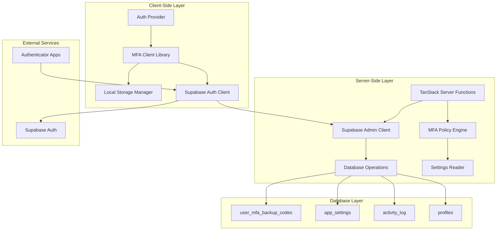
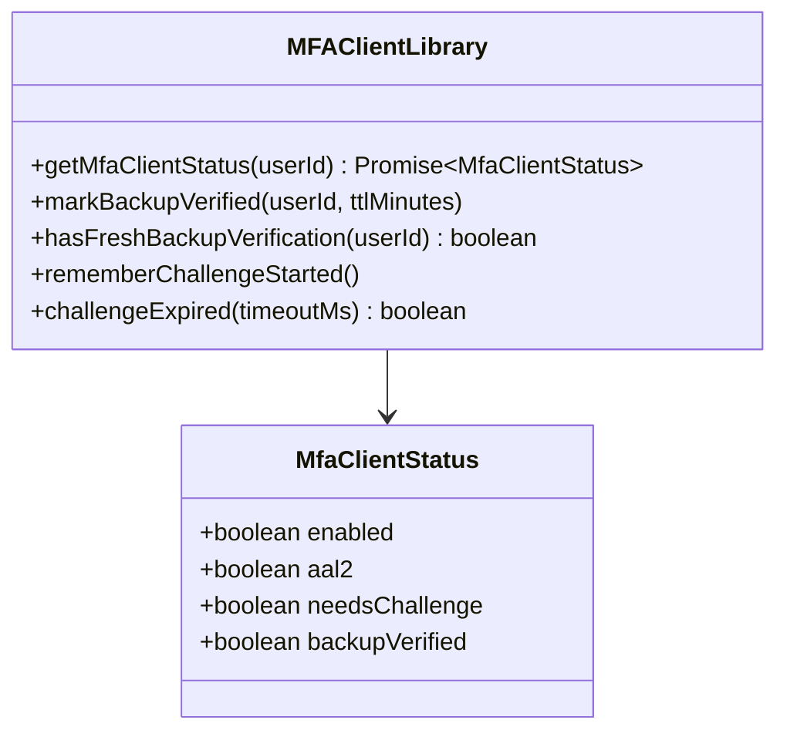
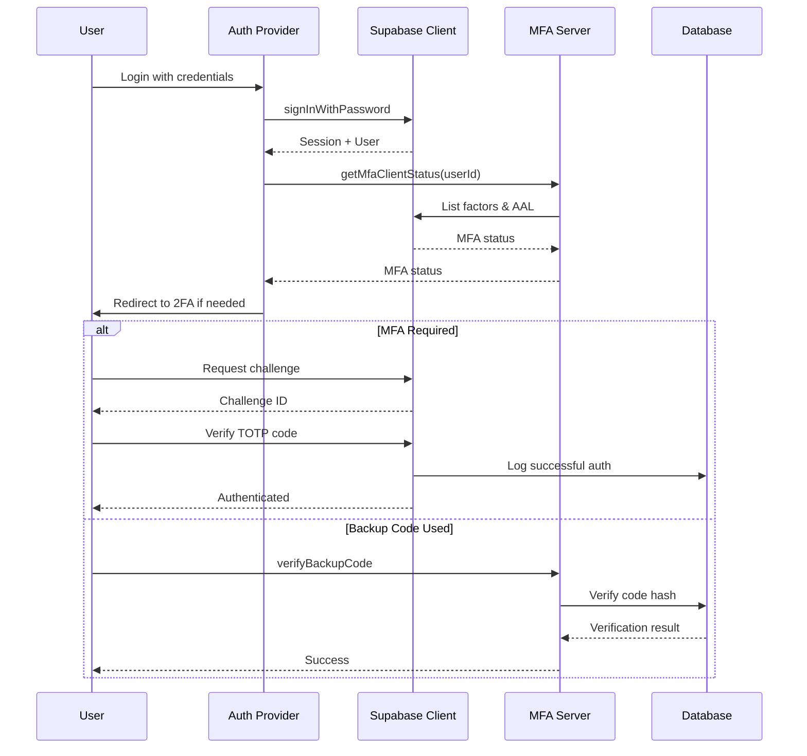
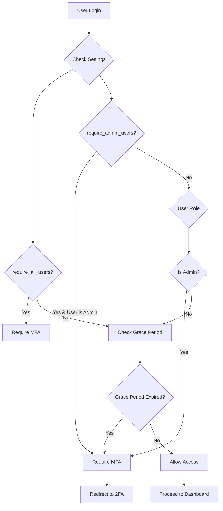
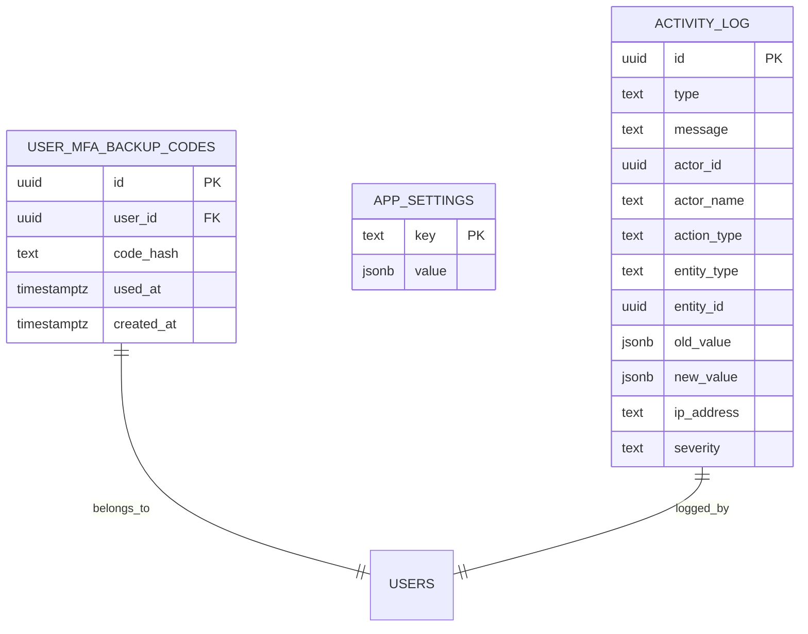
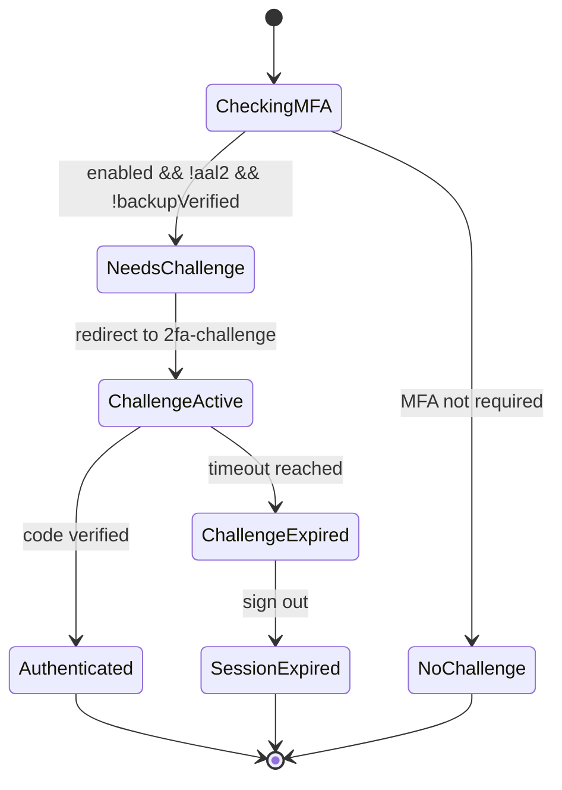
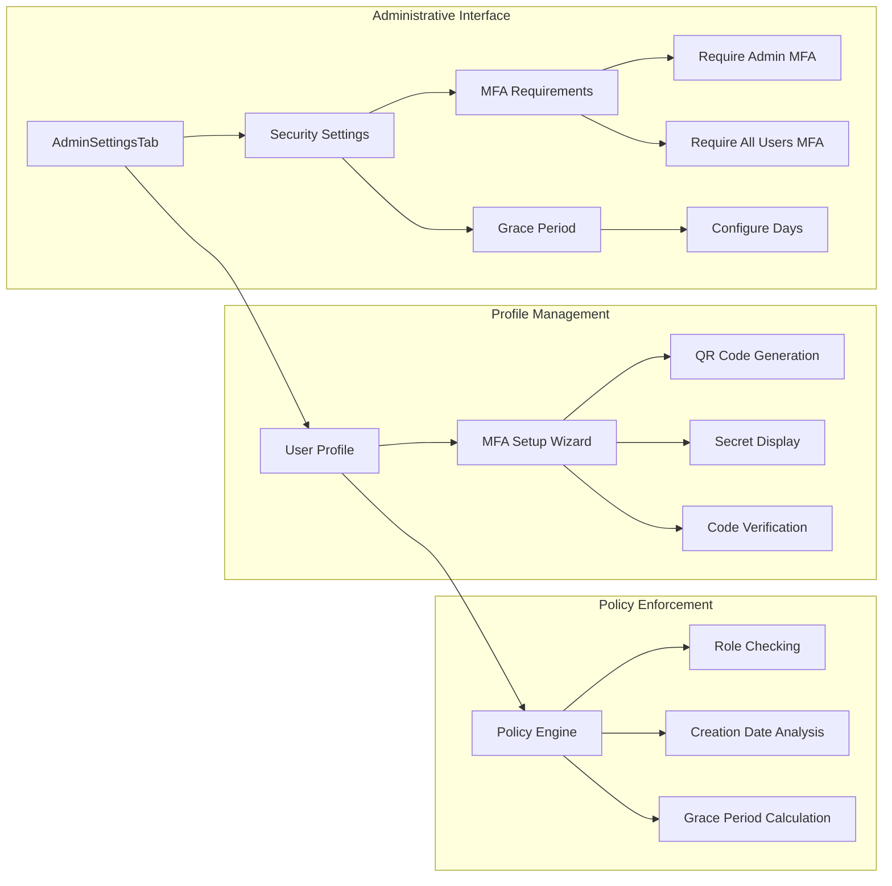

# Multi-Factor Authentication

<cite>
**Referenced Files in This Document**
- [mfa.ts](file://src/lib/mfa.ts)
- [mfa-client.ts](file://src/lib/mfa-client.ts)
- [auth.2fa-challenge.tsx](file://src/routes/auth.2fa-challenge.tsx)
- [auth.tsx](file://src/routes/auth.tsx)
- [mfa_backup_codes.sql](file://supabase/migrations/20260517120000_mfa_backup_codes.sql)
- [auth-middleware.ts](file://src/integrations/supabase/auth-middleware.ts)
- [AdminSettingsTab.tsx](file://src/components/admin/AdminSettingsTab.tsx)
- [profile.tsx](file://src/routes/_app/profile.tsx)
</cite>

## Table of Contents

1. [Introduction](#introduction)
2. [System Architecture](#system-architecture)
3. [Core Components](#core-components)
4. [Authentication Flow](#authentication-flow)
5. [MFA Policy Management](#mfa-policy-management)
6. [Backup Code System](#backup-code-system)
7. [Client-Side MFA Handling](#client-side-mfa-handling)
8. [Administrative Controls](#administrative-controls)
9. [Security Implementation](#security-implementation)
10. [Troubleshooting Guide](#troubleshooting-guide)
11. [Conclusion](#conclusion)

## Introduction

Multi-Factor Authentication (MFA) is a critical security feature implemented in the PCReady application that adds an extra layer of protection beyond traditional username and password authentication. This comprehensive MFA system leverages Time-Based One-Time Password (TOTP) protocols integrated with Supabase's authentication infrastructure, along with a robust backup code system for disaster recovery scenarios.

The MFA implementation consists of three main components: TOTP-based authentication through authenticator apps, a backup code system for emergency access, and administrative policies that govern when MFA is required. The system is designed to be both user-friendly and secure, providing multiple pathways for authentication while maintaining strict security controls.

## System Architecture

The MFA system follows a distributed architecture pattern that separates concerns between client-side handling, server-side verification, and database-backed persistence:



**Diagram sources**

- [mfa.ts:112-137](file://src/lib/mfa.ts#L112-L137)
- [mfa-client.ts:52-72](file://src/lib/mfa-client.ts#L52-L72)
- [auth.2fa-challenge.tsx:48-64](file://src/routes/auth.2fa-challenge.tsx#L48-L64)

The architecture ensures separation of concerns with client-side logic handling user interactions and local state management, while server-side functions manage authentication policies and database operations securely.

## Core Components

### MFA Server Functions

The server-side MFA implementation is built around several key server functions that handle different aspects of the authentication process:

```mermaid
classDiagram
class MFAServerFunctions {
+getMfaPolicyForUser(userId, createdAt) Promise~MfaAccessStatus~
+getMyMfaAccessStatus(input) Promise~MfaAccessStatus~
+getBackupCodeStatus(input) Promise~MfaBackupCodeStatus~
+regenerateBackupCodes(input) Promise~{codes}~
+verifyBackupCode(input) Promise~{ok}~
+logMfaAuditEvent(input) Promise~{ok}~
}
class MfaAccessStatus {
+boolean required
+boolean graceExpired
+string graceEndsAt
+boolean requireAllUsers
+boolean requireAdmins
+number graceDays
}
class MfaBackupCodeStatus {
+number remaining
+number total
+string last_used_at
}
MFAServerFunctions --> MfaAccessStatus
MFAServerFunctions --> MfaBackupCodeStatus
```

**Diagram sources**

- [mfa.ts:3-16](file://src/lib/mfa.ts#L3-L16)
- [mfa.ts:112-137](file://src/lib/mfa.ts#L112-L137)
- [mfa.ts:146-200](file://src/lib/mfa.ts#L146-L200)

**Section sources**

- [mfa.ts:112-262](file://src/lib/mfa.ts#L112-L262)

### Client-Side MFA Management

The client-side implementation provides real-time MFA status monitoring and local state management:



**Diagram sources**

- [mfa-client.ts:6-11](file://src/lib/mfa-client.ts#L6-L11)
- [mfa-client.ts:52-72](file://src/lib/mfa-client.ts#L52-L72)

**Section sources**

- [mfa-client.ts:1-73](file://src/lib/mfa-client.ts#L1-L73)

## Authentication Flow

The MFA authentication process follows a structured flow that ensures security while maintaining user experience:



**Diagram sources**

- [auth.tsx:72-92](file://src/routes/auth.tsx#L72-L92)
- [auth.2fa-challenge.tsx:48-106](file://src/routes/auth.2fa-challenge.tsx#L48-L106)
- [mfa.ts:202-240](file://src/lib/mfa.ts#L202-L240)

**Section sources**

- [auth.tsx:46-92](file://src/routes/auth.tsx#L46-L92)
- [auth.2fa-challenge.tsx:32-128](file://src/routes/auth.2fa-challenge.tsx#L32-L128)

## MFA Policy Management

The MFA policy system provides flexible configuration options controlled through administrative settings:

| Setting                   | Type    | Default | Description                        |
| ------------------------- | ------- | ------- | ---------------------------------- |
| `mfa_require_admin_users` | boolean | false   | Require MFA for all administrators |
| `mfa_require_all_users`   | boolean | false   | Require MFA for all users          |
| `mfa_grace_period_days`   | number  | 7       | Days before enforcing MFA          |

The policy evaluation considers user roles and account creation dates to determine MFA requirements:



**Diagram sources**

- [mfa.ts:112-137](file://src/lib/mfa.ts#L112-L137)
- [mfa_backup_codes.sql:26-31](file://supabase/migrations/20260517120000_mfa_backup_codes.sql#L26-L31)

**Section sources**

- [mfa.ts:112-137](file://src/lib/mfa.ts#L112-L137)
- [AdminSettingsTab.tsx:459-520](file://src/components/admin/AdminSettingsTab.tsx#L459-L520)

## Backup Code System

The backup code system provides emergency access when primary MFA methods fail:



**Diagram sources**

- [mfa_backup_codes.sql:1-8](file://supabase/migrations/20260517120000_mfa_backup_codes.sql#L1-L8)
- [mfa.ts:66-90](file://src/lib/mfa.ts#L66-L90)

Each user receives 8 backup codes, each 20 bytes in length, hashed using SHA-256 with the user ID as salt. Codes are formatted in groups of four characters separated by hyphens for readability.

**Section sources**

- [mfa.ts:36-41](file://src/lib/mfa.ts#L36-L41)
- [mfa.ts:170-200](file://src/lib/mfa.ts#L170-L200)

## Client-Side MFA Handling

The client-side implementation manages MFA state and user interactions:



**Diagram sources**

- [mfa-client.ts:52-72](file://src/lib/mfa-client.ts#L52-L72)
- [auth.2fa-challenge.tsx:102-122](file://src/routes/auth.2fa-challenge.tsx#L102-L122)

The client maintains local state for backup verification using localStorage with TTL (Time-To-Live) mechanisms to prevent replay attacks.

**Section sources**

- [mfa-client.ts:17-37](file://src/lib/mfa-client.ts#L17-L37)
- [auth.2fa-challenge.tsx:130-144](file://src/routes/auth.2fa-challenge.tsx#L130-L144)

## Administrative Controls

Administrators can configure MFA policies through the settings interface:



**Diagram sources**

- [AdminSettingsTab.tsx:459-520](file://src/components/admin/AdminSettingsTab.tsx#L459-L520)
- [profile.tsx:364-390](file://src/routes/_app/profile.tsx#L364-L390)

**Section sources**

- [AdminSettingsTab.tsx:434-521](file://src/components/admin/AdminSettingsTab.tsx#L434-L521)
- [profile.tsx:359-855](file://src/routes/_app/profile.tsx#L359-L855)

## Security Implementation

The MFA implementation incorporates multiple security layers:

### Cryptographic Security

- Backup codes are hashed using SHA-256 with user ID as salt
- Random byte generation for cryptographically secure code creation
- Secure token handling through Supabase authentication

### Session Security

- Challenge timers prevent replay attacks
- Local storage TTL prevents long-term session hijacking
- IP address logging for suspicious activity detection

### Database Security

- Row-level security policies restrict access to user-specific data
- Audit logging captures all authentication events
- Index optimization for backup code verification

**Section sources**

- [mfa.ts:26-30](file://src/lib/mfa.ts#L26-L30)
- [mfa.ts:66-90](file://src/lib/mfa.ts#L66-L90)
- [mfa_backup_codes.sql:17-24](file://supabase/migrations/20260517120000_mfa_backup_codes.sql#L17-L24)

## Troubleshooting Guide

### Common Issues and Solutions

**Issue: 2FA Challenge Not Starting**

- Verify authenticator app is properly configured
- Check time synchronization on device
- Ensure network connectivity to Supabase

**Issue: Backup Code Not Working**

- Verify code format (8+ characters, optional hyphens)
- Check if code has expired or already used
- Confirm backup code regeneration was successful

**Issue: MFA Required but Not Configured**

- Check administrative MFA policy settings
- Verify user role affects MFA requirements
- Review grace period expiration date

**Issue: Session Timeout During Challenge**

- Challenge expires after 5 minutes
- Restart authentication process
- Clear browser cache and cookies if persistent issues occur

**Section sources**

- [auth.2fa-challenge.tsx:108-122](file://src/routes/auth.2fa-challenge.tsx#L108-L122)
- [mfa-client.ts:47-50](file://src/lib/mfa-client.ts#L47-L50)

## Conclusion

The Multi-Factor Authentication system in PCReady provides comprehensive security through a well-designed combination of TOTP-based authentication, backup code systems, and flexible administrative controls. The implementation balances security requirements with user experience, offering multiple authentication pathways while maintaining strict security protocols.

Key strengths of the implementation include:

- Flexible policy management through configurable settings
- Comprehensive backup mechanisms for disaster recovery
- Real-time client-side status monitoring
- Robust audit logging and security controls
- Seamless integration with Supabase authentication infrastructure

The system provides administrators with granular control over MFA requirements while ensuring users have reliable access methods through backup codes and proper error handling mechanisms.
