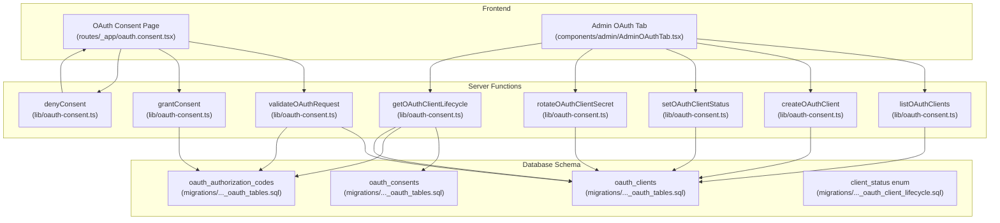
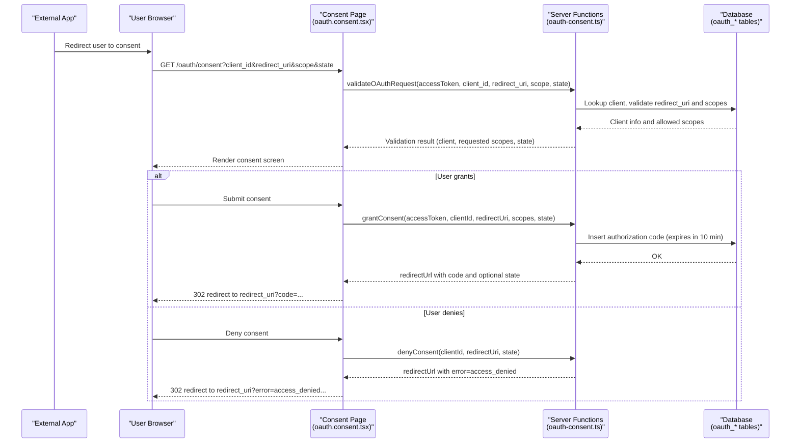
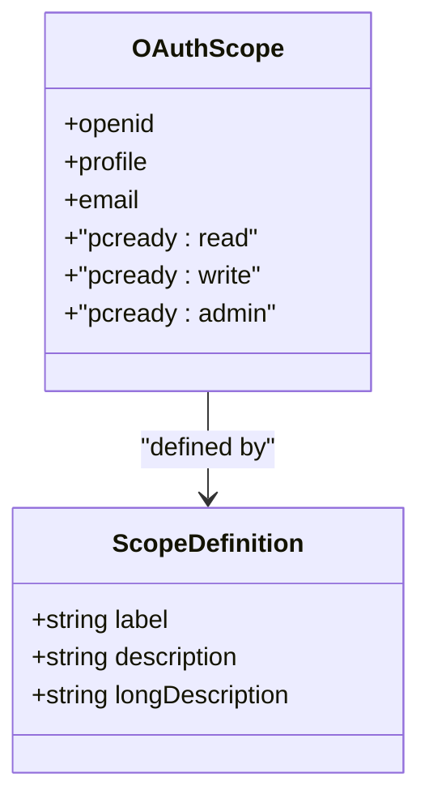
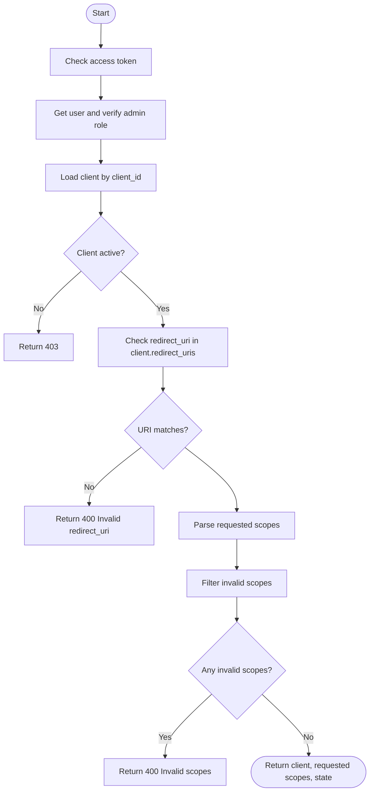
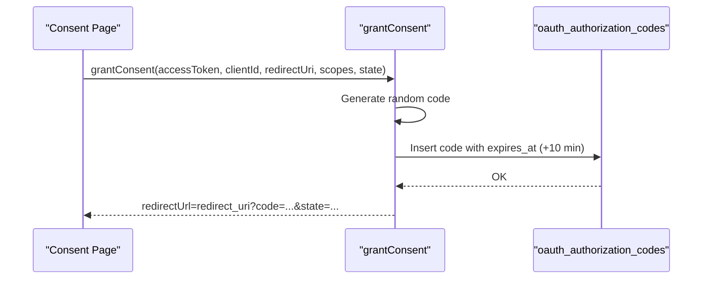
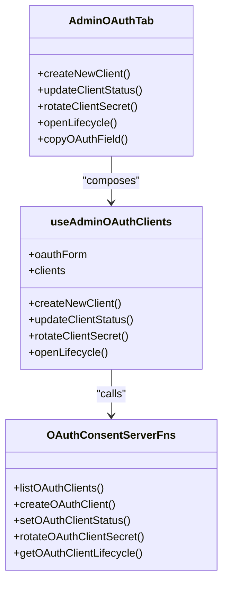
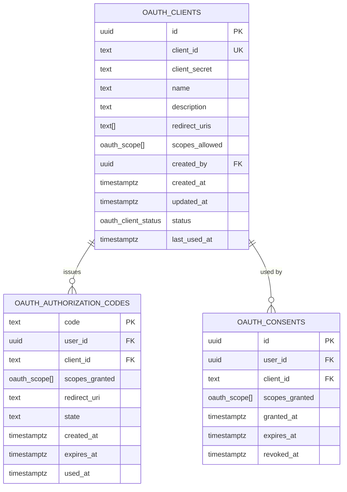
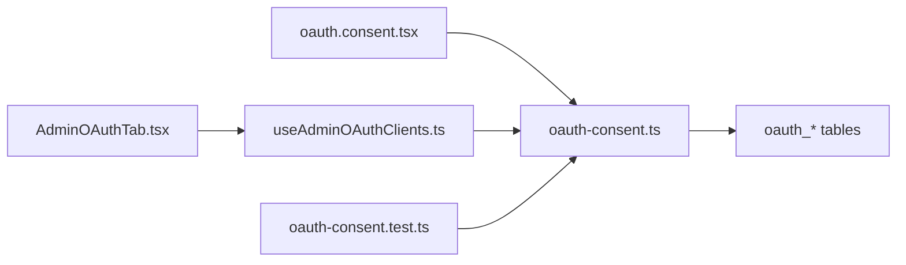

# OAuth 2.0 Implementation

<cite>
**Referenced Files in This Document**
- [oauth.ts](file://lib/schemas/oauth.ts)
- [oauth-scopes.ts](file://src/lib/oauth-scopes.ts)
- [oauth-consent.ts](file://src/lib/oauth-consent.ts)
- [AdminOAuthTab.tsx](file://src/components/admin/AdminOAuthTab.tsx)
- [useAdminOAuthClients.ts](file://src/hooks/useAdminOAuthClients.ts)
- [oauth.consent.tsx](file://src/routes/_app/oauth.consent.tsx)
- [oauth_tables.sql](file://supabase/migrations/20260503120001_oauth_tables.sql)
- [oauth_client_lifecycle.sql](file://supabase/migrations/20260514210000_oauth_client_lifecycle.sql)
- [oauth-consent.test.ts](file://src/__tests__/lib/oauth-consent.test.ts)
</cite>

## Table of Contents
1. [Introduction](#introduction)
2. [Project Structure](#project-structure)
3. [Core Components](#core-components)
4. [Architecture Overview](#architecture-overview)
5. [Detailed Component Analysis](#detailed-component-analysis)
6. [Dependency Analysis](#dependency-analysis)
7. [Performance Considerations](#performance-considerations)
8. [Security Considerations](#security-considerations)
9. [Troubleshooting Guide](#troubleshooting-guide)
10. [Conclusion](#conclusion)

## Introduction
This document explains the OAuth 2.0 implementation in PCReady with a focus on the Authorization Code flow for external application integration. It covers client registration and management, scope-based permissions, the user consent screen, token issuance mechanics, and operational controls for administrators. It also highlights security considerations and provides troubleshooting guidance.

## Project Structure
The OAuth implementation spans frontend UI, server-side logic, and backend database schema:
- Frontend consent page and admin UI for client lifecycle
- Server functions for validation, consent, and administrative actions
- Database schema for clients, authorization codes, consents, and lifecycle status
- Tests for helper functions

**Diagram sources**
- [oauth.consent.tsx:1-220](file://src/routes/_app/oauth.consent.tsx#L1-L220)
- [AdminOAuthTab.tsx:1-682](file://src/components/admin/AdminOAuthTab.tsx#L1-L682)
- [oauth-consent.ts:140-520](file://src/lib/oauth-consent.ts#L140-L520)
- [oauth_tables.sql:1-66](file://supabase/migrations/20260503120001_oauth_tables.sql#L1-L66)
- [oauth_client_lifecycle.sql:1-13](file://supabase/migrations/20260514210000_oauth_client_lifecycle.sql#L1-L13)

**Section sources**
- [oauth.consent.tsx:1-220](file://src/routes/_app/oauth.consent.tsx#L1-L220)
- [AdminOAuthTab.tsx:1-682](file://src/components/admin/AdminOAuthTab.tsx#L1-L682)
- [oauth-consent.ts:140-520](file://src/lib/oauth-consent.ts#L140-L520)
- [oauth_tables.sql:1-66](file://supabase/migrations/20260503120001_oauth_tables.sql#L1-L66)
- [oauth_client_lifecycle.sql:1-13](file://supabase/migrations/20260514210000_oauth_client_lifecycle.sql#L1-L13)

## Core Components
- OAuth scopes definition and labeling
- OAuth client schema and validation
- Consent flow server functions (validation, grant, deny)
- Admin client lifecycle functions (list, create, status, rotate secret, lifecycle)
- Frontend consent page and admin client management UI
- Database schema for clients, authorization codes, consents, and status

**Section sources**
- [oauth-scopes.ts:1-65](file://src/lib/oauth-scopes.ts#L1-L65)
- [oauth.ts:1-16](file://lib/schemas/oauth.ts#L1-L16)
- [oauth-consent.ts:140-520](file://src/lib/oauth-consent.ts#L140-L520)
- [AdminOAuthTab.tsx:1-682](file://src/components/admin/AdminOAuthTab.tsx#L1-L682)
- [useAdminOAuthClients.ts:1-196](file://src/hooks/useAdminOAuthClients.ts#L1-L196)
- [oauth_tables.sql:1-66](file://supabase/migrations/20260503120001_oauth_tables.sql#L1-L66)
- [oauth_client_lifecycle.sql:1-13](file://supabase/migrations/20260514210000_oauth_client_lifecycle.sql#L1-L13)

## Architecture Overview
PCReady implements the OAuth 2.0 Authorization Code flow:
- Integrators redirect users to the consent page with client_id, redirect_uri, scope, and state.
- PCReady validates the request against registered clients and allowed scopes.
- The user reviews requested scopes and either authorizes or denies.
- On authorization, PCReady issues a short-lived authorization code stored in the database.
- The integrator exchanges the code for tokens via the token endpoint (implemented elsewhere in the system).
- Administrators manage clients, scopes, and lifecycle (active/disabled/revoked).

**Diagram sources**
- [oauth.consent.tsx:35-114](file://src/routes/_app/oauth.consent.tsx#L35-L114)
- [oauth-consent.ts:140-254](file://src/lib/oauth-consent.ts#L140-L254)
- [oauth_tables.sql:18-31](file://supabase/migrations/20260503120001_oauth_tables.sql#L18-L31)

**Section sources**
- [oauth.consent.tsx:35-114](file://src/routes/_app/oauth.consent.tsx#L35-L114)
- [oauth-consent.ts:140-254](file://src/lib/oauth-consent.ts#L140-L254)
- [oauth_tables.sql:18-31](file://supabase/migrations/20260503120001_oauth_tables.sql#L18-L31)

## Detailed Component Analysis

### OAuth Scopes and Permission Model
- Defined scopes include identity (openid), profile, email, and PCReady-specific scopes (read, write, admin).
- Each scope has a label and a long description suitable for the consent screen.
- Scope validation ensures requested scopes are a subset of allowed scopes per client.

**Diagram sources**
- [oauth-scopes.ts:1-65](file://src/lib/oauth-scopes.ts#L1-L65)

**Section sources**
- [oauth-scopes.ts:1-65](file://src/lib/oauth-scopes.ts#L1-L65)

### OAuth Client Registration and Validation
- Clients are defined by name, description, redirect URIs (array), and allowed scopes.
- Validation checks:
  - Client exists and is active
  - redirect_uri matches one of the client’s registered URIs
  - All requested scopes are within scopes_allowed

**Diagram sources**
- [oauth-consent.ts:140-194](file://src/lib/oauth-consent.ts#L140-L194)
- [oauth.ts:4-13](file://lib/schemas/oauth.ts#L4-L13)

**Section sources**
- [oauth-consent.ts:140-194](file://src/lib/oauth-consent.ts#L140-L194)
- [oauth.ts:4-13](file://lib/schemas/oauth.ts#L4-L13)

### Consent Screen and Authorization Code Issuance
- The consent page validates the request, renders requested scopes, and offers Grant/Deny actions.
- On Grant:
  - Generates a random authorization code
  - Stores code with user_id, client_id, scopes_granted, redirect_uri, state, and expiry (~10 minutes)
  - Updates client last_used_at
  - Returns redirect_url with code and optional state
- On Deny:
  - Builds redirect_url with error=access_denied and optional state

**Diagram sources**
- [oauth-consent.ts:196-254](file://src/lib/oauth-consent.ts#L196-L254)
- [oauth_tables.sql:18-31](file://supabase/migrations/20260503120001_oauth_tables.sql#L18-L31)

**Section sources**
- [oauth.consent.tsx:78-114](file://src/routes/_app/oauth.consent.tsx#L78-L114)
- [oauth-consent.ts:196-254](file://src/lib/oauth-consent.ts#L196-L254)
- [oauth_tables.sql:18-31](file://supabase/migrations/20260503120001_oauth_tables.sql#L18-L31)

### Admin Client Management
- Admins can:
  - List clients
  - Create clients (with generated client_id and client_secret)
  - Change status (active/disabled/revoked)
  - Rotate secrets for active clients
  - View lifecycle data (consents, authorization events, admin events)
- The admin UI provides forms, warnings, and lifecycle tables.

**Diagram sources**
- [AdminOAuthTab.tsx:22-682](file://src/components/admin/AdminOAuthTab.tsx#L22-L682)
- [useAdminOAuthClients.ts:21-196](file://src/hooks/useAdminOAuthClients.ts#L21-L196)
- [oauth-consent.ts:266-520](file://src/lib/oauth-consent.ts#L266-L520)

**Section sources**
- [AdminOAuthTab.tsx:22-682](file://src/components/admin/AdminOAuthTab.tsx#L22-L682)
- [useAdminOAuthClients.ts:21-196](file://src/hooks/useAdminOAuthClients.ts#L21-L196)
- [oauth-consent.ts:266-520](file://src/lib/oauth-consent.ts#L266-L520)

### Database Schema and Row Level Security
- oauth_clients: stores client credentials, metadata, allowed scopes, status, and timestamps.
- oauth_authorization_codes: stores short-lived codes with expiry and redemption tracking.
- oauth_consents: records user consents per client with granted scopes and expiry.
- Row Level Security policies restrict access to authenticated users and admins.

**Diagram sources**
- [oauth_tables.sql:4-43](file://supabase/migrations/20260503120001_oauth_tables.sql#L4-L43)
- [oauth_client_lifecycle.sql:3-7](file://supabase/migrations/20260514210000_oauth_client_lifecycle.sql#L3-L7)

**Section sources**
- [oauth_tables.sql:1-66](file://supabase/migrations/20260503120001_oauth_tables.sql#L1-L66)
- [oauth_client_lifecycle.sql:1-13](file://supabase/migrations/20260514210000_oauth_client_lifecycle.sql#L1-L13)

## Dependency Analysis
- Frontend depends on server functions for validation, consent, and admin actions.
- Server functions depend on Supabase client for database operations and RPC calls.
- Database schema defines the contract for clients, codes, and consents.
- Tests validate helper functions used in the consent flow.

**Diagram sources**
- [oauth.consent.tsx:1-220](file://src/routes/_app/oauth.consent.tsx#L1-L220)
- [AdminOAuthTab.tsx:1-682](file://src/components/admin/AdminOAuthTab.tsx#L1-L682)
- [useAdminOAuthClients.ts:1-196](file://src/hooks/useAdminOAuthClients.ts#L1-L196)
- [oauth-consent.ts:140-520](file://src/lib/oauth-consent.ts#L140-L520)
- [oauth-consent.test.ts:1-35](file://src/__tests__/lib/oauth-consent.test.ts#L1-L35)

**Section sources**
- [oauth.consent.tsx:1-220](file://src/routes/_app/oauth.consent.tsx#L1-L220)
- [AdminOAuthTab.tsx:1-682](file://src/components/admin/AdminOAuthTab.tsx#L1-L682)
- [useAdminOAuthClients.ts:1-196](file://src/hooks/useAdminOAuthClients.ts#L1-L196)
- [oauth-consent.ts:140-520](file://src/lib/oauth-consent.ts#L140-L520)
- [oauth-consent.test.ts:1-35](file://src/__tests__/lib/oauth-consent.test.ts#L1-L35)

## Performance Considerations
- Authorization codes expire after ~10 minutes to limit exposure windows.
- Indexes on oauth_authorization_codes.expiry and oauth_clients.status improve lookup performance.
- Admin lifecycle queries limit result sets to prevent heavy loads.
- Rate limiting applies to client creation to avoid abuse.

[No sources needed since this section provides general guidance]

## Security Considerations
- Redirect URI validation: The server enforces exact match against registered URIs.
- Scope validation: Requested scopes must be a subset of allowed scopes.
- Client status enforcement: Only active clients can initiate flows; disabled clients pause flows; revoked clients cannot be reactivated.
- Secret rotation: Admins can rotate secrets for active clients; previous secrets become invalid immediately.
- Token storage: Authorization codes are stored with expiry and are single-use; refresh tokens are not implemented in the referenced code.
- PKCE: Not implemented in the referenced code; consider adding S256 challenge support for public clients.
- Audit logging: Administrative actions and secret rotations are recorded in the activity log.

**Section sources**
- [oauth-consent.ts:167-178](file://src/lib/oauth-consent.ts#L167-L178)
- [oauth-consent.ts:214-216](file://src/lib/oauth-consent.ts#L214-L216)
- [oauth-consent.ts:422-426](file://src/lib/oauth-consent.ts#L422-L426)
- [oauth_tables.sql:45-65](file://supabase/migrations/20260503120001_oauth_tables.sql#L45-L65)
- [oauth_client_lifecycle.sql:3-13](file://supabase/migrations/20260514210000_oauth_client_lifecycle.sql#L3-L13)

## Troubleshooting Guide
Common issues and resolutions:
- Invalid client_id or inactive client:
  - Ensure the client exists and has status active.
  - Verify the client was created by an admin and not revoked.
- Invalid redirect_uri:
  - Confirm the redirect_uri exactly matches one of the client’s registered URIs.
- Invalid scopes:
  - Ensure requested scopes are a subset of scopes_allowed configured for the client.
- Authorization code not issued:
  - Check that the consent page received a valid validation result and that the user clicked Grant.
  - Verify the authorization code record exists and is unexpired.
- Access denied redirect:
  - When the user denies consent, the server builds a redirect with error=access_denied and optional state.
- Admin actions failing:
  - Confirm the access token belongs to an admin user.
  - Check audit logs for administrative events.

**Section sources**
- [oauth-consent.ts:158-178](file://src/lib/oauth-consent.ts#L158-L178)
- [oauth-consent.ts:214-216](file://src/lib/oauth-consent.ts#L214-L216)
- [oauth-consent.ts:512-520](file://src/lib/oauth-consent.ts#L512-L520)
- [oauth-consent.test.ts:9-27](file://src/__tests__/lib/oauth-consent.test.ts#L9-L27)

## Conclusion
PCReady’s OAuth 2.0 implementation centers on a secure Authorization Code flow with strict redirect URI and scope validation, a clear consent screen, and robust admin controls for client lifecycle management. The database schema and RLS policies enforce access restrictions, while audit logging tracks administrative actions. Administrators can manage clients, rotate secrets, and monitor usage. For enhanced security, consider implementing PKCE for public clients and refresh token issuance.