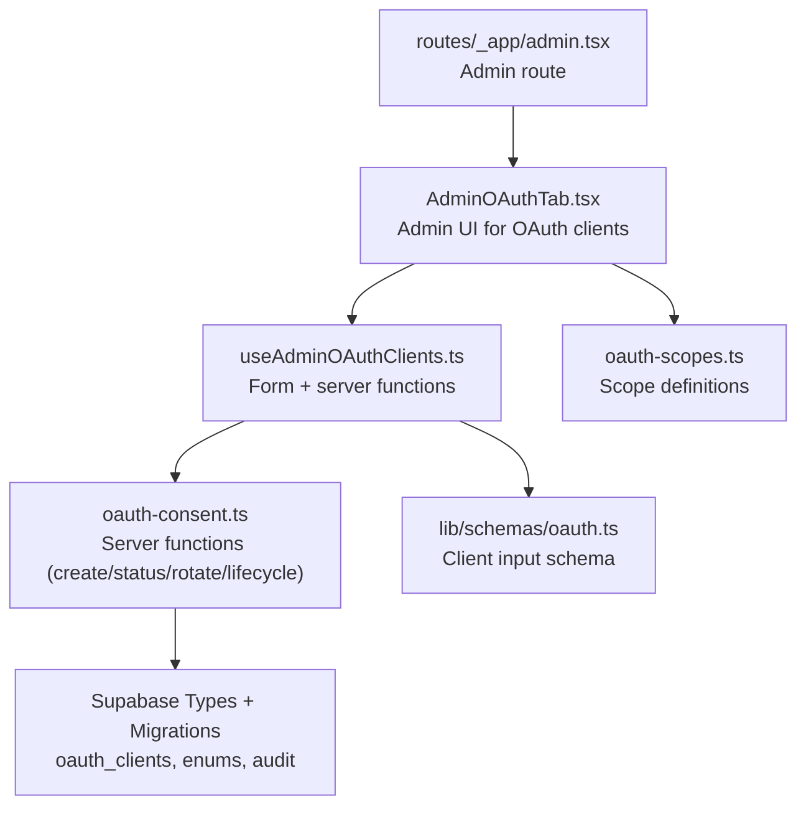
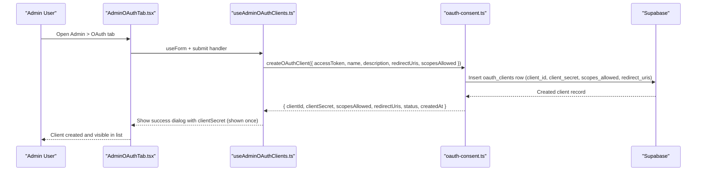
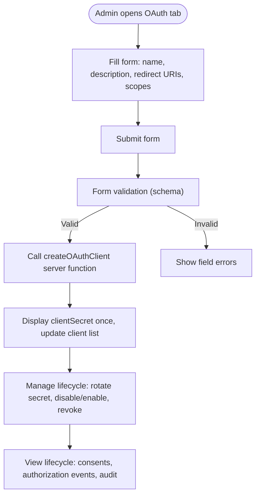
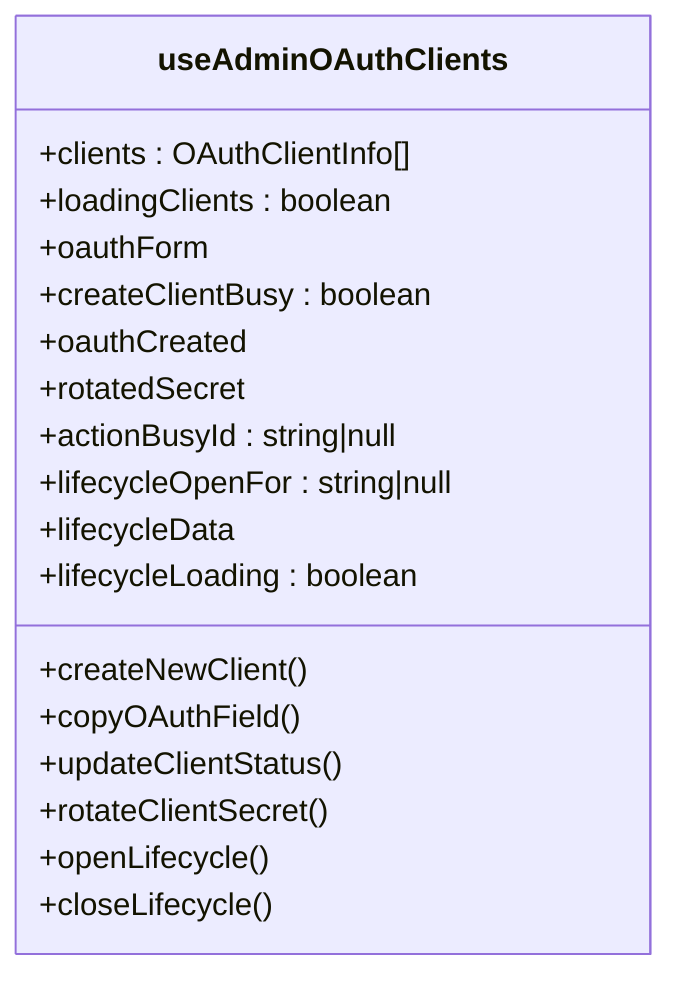
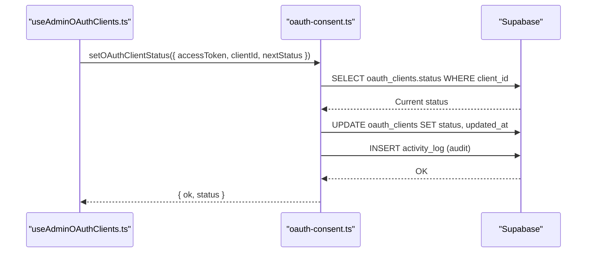
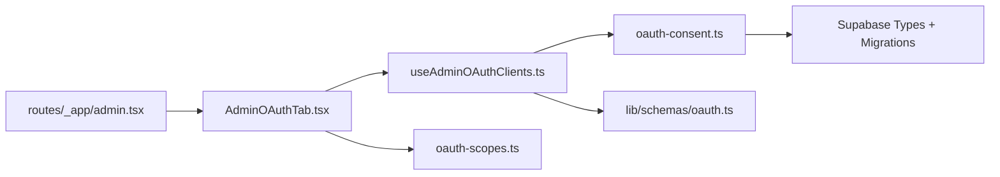

# OAuth Client Management

<cite>
**Referenced Files in This Document**
- [AdminOAuthTab.tsx](file://src/components/admin/AdminOAuthTab.tsx)
- [useAdminOAuthClients.ts](file://src/hooks/useAdminOAuthClients.ts)
- [oauth-consent.ts](file://src/lib/oauth-consent.ts)
- [oauth-scopes.ts](file://src/lib/oauth-scopes.ts)
- [oauth.ts](file://lib/schemas/oauth.ts)
- [admin.tsx](file://src/routes/_app/admin.tsx)
- [types.ts](file://src/integrations/supabase/types.ts)
- [20260514220000_oauth_client_lifecycle.sql](file://supabase/migrations/20260514220000_oauth_client_lifecycle.sql)
</cite>

## Table of Contents
1. [Introduction](#introduction)
2. [Project Structure](#project-structure)
3. [Core Components](#core-components)
4. [Architecture Overview](#architecture-overview)
5. [Detailed Component Analysis](#detailed-component-analysis)
6. [Dependency Analysis](#dependency-analysis)
7. [Performance Considerations](#performance-considerations)
8. [Troubleshooting Guide](#troubleshooting-guide)
9. [Conclusion](#conclusion)

## Introduction
This document explains how administrators register, configure, and manage OAuth clients in PCReady. It covers client creation, secret management, redirect URI configuration, lifecycle controls (activate, deactivate, revoke), scope selection, and administrative auditing. It also provides practical setup examples for common integration scenarios and highlights security considerations for redirect URI validation and client trust establishment.

## Project Structure
The OAuth client management feature spans UI, hooks, server-side functions, and Supabase database definitions:
- UI: Admin panel tab for OAuth client creation and management
- Hooks: Form handling, validation, and server function orchestration
- Server functions: Secure creation, status updates, secret rotation, lifecycle retrieval
- Database: OAuth clients table, enums, and related audit/log tables

**Diagram sources**
- [AdminOAuthTab.tsx:22-682](file://src/components/admin/AdminOAuthTab.tsx#L22-L682)
- [useAdminOAuthClients.ts:21-196](file://src/hooks/useAdminOAuthClients.ts#L21-L196)
- [oauth-consent.ts:1-520](file://src/lib/oauth-consent.ts#L1-L520)
- [oauth.ts:1-16](file://lib/schemas/oauth.ts#L1-L16)
- [oauth-scopes.ts:1-65](file://src/lib/oauth-scopes.ts#L1-L65)
- [admin.tsx:23-49](file://src/routes/_app/admin.tsx#L23-L49)
- [types.ts:604-681](file://src/integrations/supabase/types.ts#L604-L681)
- [20260514220000_oauth_client_lifecycle.sql:1-12](file://supabase/migrations/20260514220000_oauth_client_lifecycle.sql#L1-L12)

**Section sources**
- [AdminOAuthTab.tsx:22-682](file://src/components/admin/AdminOAuthTab.tsx#L22-L682)
- [useAdminOAuthClients.ts:21-196](file://src/hooks/useAdminOAuthClients.ts#L21-L196)
- [oauth-consent.ts:1-520](file://src/lib/oauth-consent.ts#L1-L520)
- [oauth.ts:1-16](file://lib/schemas/oauth.ts#L1-L16)
- [oauth-scopes.ts:1-65](file://src/lib/oauth-scopes.ts#L1-L65)
- [admin.tsx:23-49](file://src/routes/_app/admin.tsx#L23-L49)
- [types.ts:604-681](file://src/integrations/supabase/types.ts#L604-L681)
- [20260514220000_oauth_client_lifecycle.sql:1-12](file://supabase/migrations/20260514220000_oauth_client_lifecycle.sql#L1-L12)

## Core Components
- Admin UI for OAuth clients: Create clients, configure scopes, manage lifecycle, view activity
- Hook orchestrating form submission, server functions, and lifecycle dialogs
- Server functions for secure operations: create, list, update status, rotate secret, get lifecycle
- Input schema validating client creation parameters
- Scope definitions and labels for permission selection
- Database schema and migration defining client table, enums, and audit columns

**Section sources**
- [AdminOAuthTab.tsx:22-682](file://src/components/admin/AdminOAuthTab.tsx#L22-L682)
- [useAdminOAuthClients.ts:21-196](file://src/hooks/useAdminOAuthClients.ts#L21-L196)
- [oauth-consent.ts:266-437](file://src/lib/oauth-consent.ts#L266-L437)
- [oauth.ts:4-13](file://lib/schemas/oauth.ts#L4-L13)
- [oauth-scopes.ts:17-54](file://src/lib/oauth-scopes.ts#L17-L54)
- [types.ts:604-681](file://src/integrations/supabase/types.ts#L604-L681)
- [20260514220000_oauth_client_lifecycle.sql:1-12](file://supabase/migrations/20260514220000_oauth_client_lifecycle.sql#L1-L12)

## Architecture Overview
The OAuth client management flow integrates frontend UI, React hooks, server functions, and Supabase backend.

**Diagram sources**
- [AdminOAuthTab.tsx:97-198](file://src/components/admin/AdminOAuthTab.tsx#L97-L198)
- [useAdminOAuthClients.ts:66-95](file://src/hooks/useAdminOAuthClients.ts#L66-L95)
- [oauth-consent.ts:294-343](file://src/lib/oauth-consent.ts#L294-L343)
- [types.ts:604-656](file://src/integrations/supabase/types.ts#L604-L656)

## Detailed Component Analysis

### Admin UI: OAuth Client Creation and Management
- Purpose: Allow admins to create OAuth clients, configure scopes, manage lifecycle, and inspect activity
- Key capabilities:
  - Create new client with name, optional description, newline-separated redirect URIs, and selectable scopes
  - Copy client identifiers and secrets
  - Rotate client secret, disable/enable, revoke, and view lifecycle history
  - View consent history, authorization events, and admin audit entries

**Diagram sources**
- [AdminOAuthTab.tsx:97-198](file://src/components/admin/AdminOAuthTab.tsx#L97-L198)
- [useAdminOAuthClients.ts:66-95](file://src/hooks/useAdminOAuthClients.ts#L66-L95)
- [oauth-consent.ts:294-343](file://src/lib/oauth-consent.ts#L294-L343)

**Section sources**
- [AdminOAuthTab.tsx:22-682](file://src/components/admin/AdminOAuthTab.tsx#L22-L682)
- [useAdminOAuthClients.ts:21-196](file://src/hooks/useAdminOAuthClients.ts#L21-L196)

### Hook: Form Handling and Server Function Orchestration
- Responsibilities:
  - Initialize form with Zod schema validation
  - Load clients, create new client, update status, rotate secret, open lifecycle dialog
  - Copy fields to clipboard and show toast notifications
  - Handle loading states and action busy indicators

**Diagram sources**
- [useAdminOAuthClients.ts:21-196](file://src/hooks/useAdminOAuthClients.ts#L21-L196)

**Section sources**
- [useAdminOAuthClients.ts:21-196](file://src/hooks/useAdminOAuthClients.ts#L21-L196)

### Server Functions: Secure Operations
- createOAuthClient: Generates unique client_id and client_secret, persists allowed scopes and redirect URIs, logs audit event
- listOAuthClients: Returns paginated client list ordered by creation date
- setOAuthClientStatus: Updates client status with audit logging; prevents changes to revoked clients
- rotateOAuthClientSecret: Generates new secret for active clients and logs audit event
- getOAuthClientLifecycle: Aggregates consent history, authorization events, and admin audit entries

**Diagram sources**
- [oauth-consent.ts:350-400](file://src/lib/oauth-consent.ts#L350-L400)
- [types.ts:604-656](file://src/integrations/supabase/types.ts#L604-L656)

**Section sources**
- [oauth-consent.ts:294-437](file://src/lib/oauth-consent.ts#L294-L437)

### Input Validation Schema
- Enforces required fields and transforms multiline redirect URIs into an array
- Validates presence of at least one redirect URI
- Restricts scopes to allowed enum values

**Section sources**
- [oauth.ts:4-13](file://lib/schemas/oauth.ts#L4-L13)

### Scope Definitions and Labels
- Defines available scopes with human-readable labels and descriptions
- Used in UI to render scope cards and tooltips

**Section sources**
- [oauth-scopes.ts:17-54](file://src/lib/oauth-scopes.ts#L17-L54)

### Database Schema and Lifecycle Migration
- oauth_clients table stores client metadata, scopes, redirect URIs, status, timestamps, and creator
- Enum oauth_client_status supports active, disabled, revoked states
- Audit columns track last activity and enable lifecycle insights

**Section sources**
- [types.ts:604-656](file://src/integrations/supabase/types.ts#L604-L656)
- [20260514220000_oauth_client_lifecycle.sql:1-12](file://supabase/migrations/20260514220000_oauth_client_lifecycle.sql#L1-L12)

## Dependency Analysis
- UI depends on hook for form state and server function orchestration
- Hook depends on server functions for all CRUD operations
- Server functions depend on Supabase client for database operations and audit logging
- Schema validates inputs before server functions execute
- Scope definitions drive UI rendering and validation

**Diagram sources**
- [AdminOAuthTab.tsx:22-682](file://src/components/admin/AdminOAuthTab.tsx#L22-L682)
- [useAdminOAuthClients.ts:21-196](file://src/hooks/useAdminOAuthClients.ts#L21-L196)
- [oauth-consent.ts:1-520](file://src/lib/oauth-consent.ts#L1-L520)
- [oauth.ts:1-16](file://lib/schemas/oauth.ts#L1-L16)
- [oauth-scopes.ts:1-65](file://src/lib/oauth-scopes.ts#L1-L65)
- [admin.tsx:23-49](file://src/routes/_app/admin.tsx#L23-L49)
- [types.ts:604-681](file://src/integrations/supabase/types.ts#L604-L681)

**Section sources**
- [AdminOAuthTab.tsx:22-682](file://src/components/admin/AdminOAuthTab.tsx#L22-L682)
- [useAdminOAuthClients.ts:21-196](file://src/hooks/useAdminOAuthClients.ts#L21-L196)
- [oauth-consent.ts:1-520](file://src/lib/oauth-consent.ts#L1-L520)
- [oauth.ts:1-16](file://lib/schemas/oauth.ts#L1-L16)
- [oauth-scopes.ts:1-65](file://src/lib/oauth-scopes.ts#L1-L65)
- [admin.tsx:23-49](file://src/routes/_app/admin.tsx#L23-L49)
- [types.ts:604-681](file://src/integrations/supabase/types.ts#L604-L681)

## Performance Considerations
- Client listing is ordered by creation date; consider pagination and filtering for large datasets
- Lifecycle queries limit returned rows to recent entries to keep UI responsive
- Secret rotation and status updates are single-row operations; ensure minimal network latency for admin actions

[No sources needed since this section provides general guidance]

## Troubleshooting Guide
Common issues and resolutions:
- Unauthorized or forbidden access when performing admin actions
  - Ensure the access token belongs to an admin user; server functions check roles before processing
- Invalid client_id or status-related errors
  - Active clients are required for secret rotation; revoked clients cannot be modified
- Invalid redirect_uri during authorization
  - Redirect URI must match exactly one configured value; mismatches cause validation failures
- Invalid scopes
  - Requested scopes must be a subset of allowed scopes; extra scopes are rejected
- Audit visibility
  - Use lifecycle dialog to review consent history, authorization events, and admin actions

**Section sources**
- [oauth-consent.ts:37-48](file://src/lib/oauth-consent.ts#L37-L48)
- [oauth-consent.ts:162-178](file://src/lib/oauth-consent.ts#L162-L178)
- [oauth-consent.ts:422-426](file://src/lib/oauth-consent.ts#L422-L426)
- [AdminOAuthTab.tsx:518-620](file://src/components/admin/AdminOAuthTab.tsx#L518-L620)

## Conclusion
PCReady’s OAuth client management provides administrators a secure, auditable way to register and operate third-party integrations. The system enforces strict redirect URI validation, granular scope control, and robust lifecycle management with clear audit trails. By following the setup examples and security recommendations below, administrators can confidently onboard external applications while maintaining strong security posture.

### Setup Examples by Integration Scenario
- Mobile app (installed on devices)
  - Choose Authorization Code flow
  - Configure one or more loopback or deep-link redirect URIs
  - Select minimal scopes (openid, profile, email) for basic identity
  - Use short-lived tokens and refresh strategies appropriate for mobile
- Web application (browser-based)
  - Configure HTTPS redirect URIs for production
  - Select scopes aligned with the app’s functional needs (read/write/admin)
  - Implement CSRF protection and state parameters
- Service account (server-to-server)
  - Use Authorization Code flow with a dedicated client
  - Limit scopes to least privilege
  - Store client secret securely and rotate regularly

### Security Considerations
- Redirect URI validation
  - Ensure redirect URIs are exact matches; avoid wildcards
  - Prefer HTTPS for production environments
- Client secret handling
  - Store secrets in secure configuration systems
  - Rotate secrets periodically and immediately after compromise
- Trust establishment
  - Limit scopes to business necessity
  - Monitor lifecycle and audit logs for suspicious activity
  - Disable or revoke clients promptly when no longer needed

[No sources needed since this section summarizes without analyzing specific files]