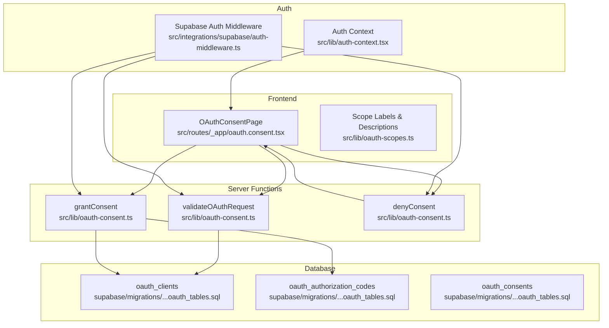
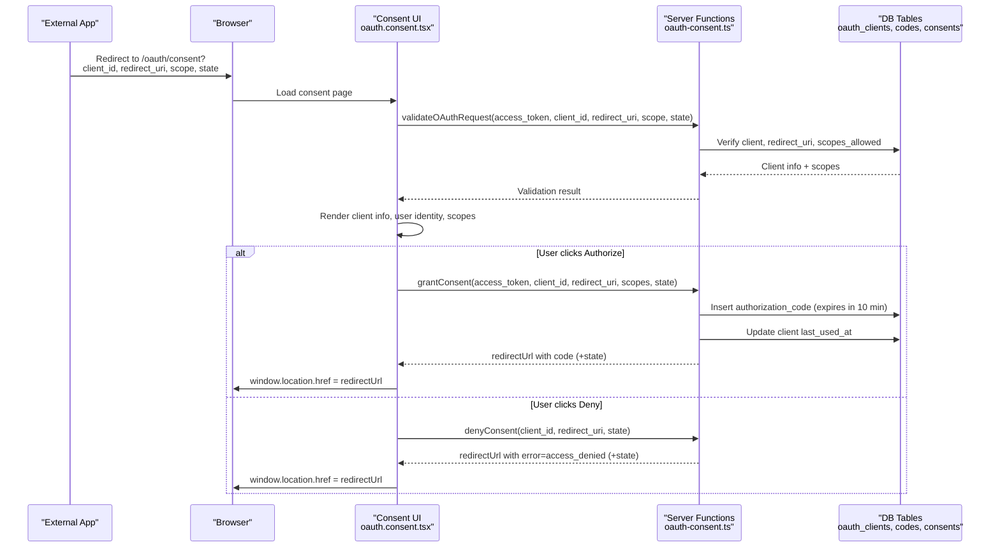
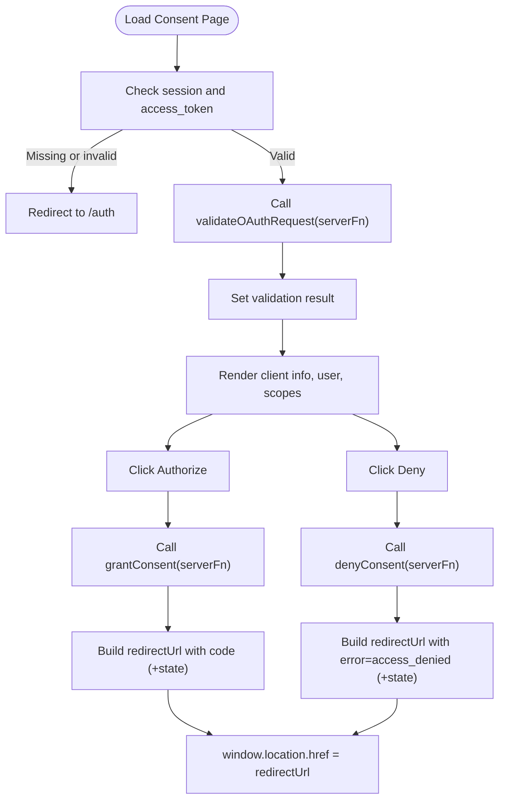
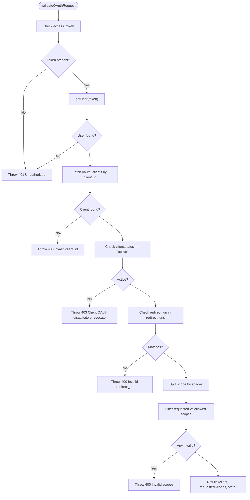
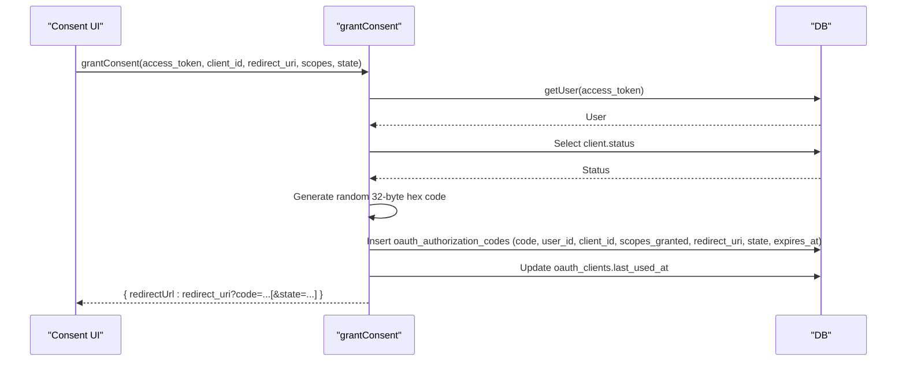
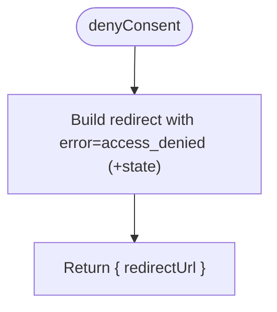
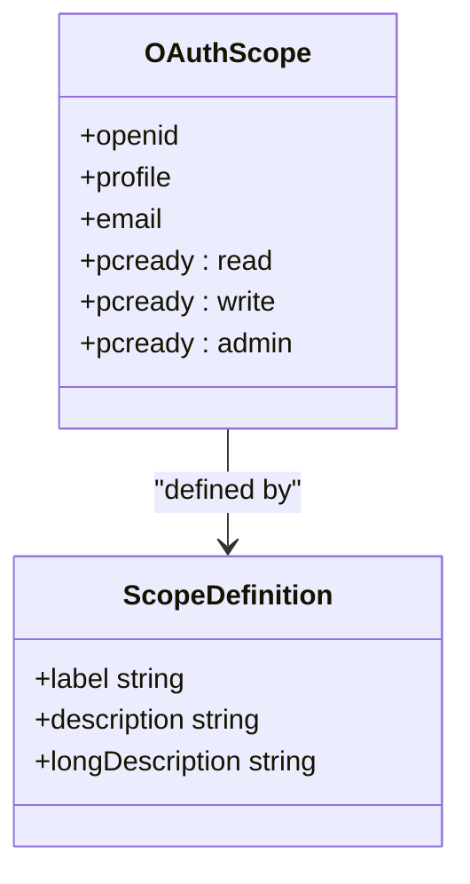
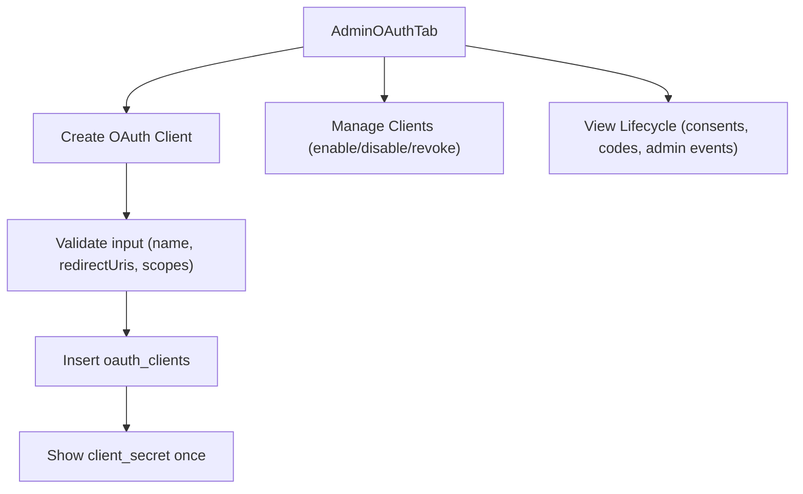
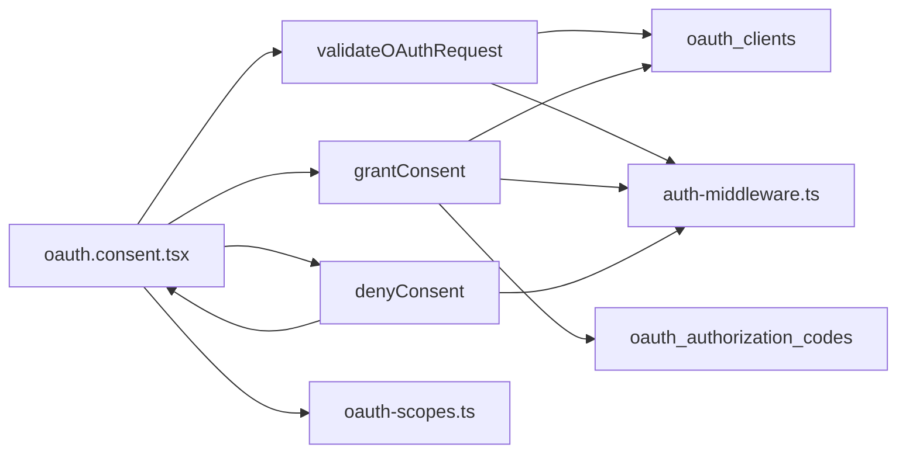

# OAuth Consent Flow

<cite>
**Referenced Files in This Document**
- [oauth.consent.tsx](file://src/routes/_app/oauth.consent.tsx)
- [oauth-consent.ts](file://src/lib/oauth-consent.ts)
- [oauth-scopes.ts](file://src/lib/oauth-scopes.ts)
- [oauth.ts](file://lib/schemas/oauth.ts)
- [auth-middleware.ts](file://src/integrations/supabase/auth-middleware.ts)
- [auth-context.tsx](file://src/lib/auth-context.tsx)
- [AdminOAuthTab.tsx](file://src/components/admin/AdminOAuthTab.tsx)
- [oauth_tables.sql](file://supabase/migrations/20260503120001_oauth_tables.sql)
- [oauth-consent.test.ts](file://src/__tests__/lib/oauth-consent.test.ts)
</cite>

## Table of Contents

1. [Introduction](#introduction)
2. [Project Structure](#project-structure)
3. [Core Components](#core-components)
4. [Architecture Overview](#architecture-overview)
5. [Detailed Component Analysis](#detailed-component-analysis)
6. [Dependency Analysis](#dependency-analysis)
7. [Performance Considerations](#performance-considerations)
8. [Troubleshooting Guide](#troubleshooting-guide)
9. [Conclusion](#conclusion)

## Introduction

This document explains the OAuth consent flow in PCReady. It covers the end-to-end authorization experience for users authorizing external applications to access their PCReady account, including the consent screen UI, server-side validation, grant/deny processing, redirect URL construction, and integration with Supabase authentication. It also documents supported scopes, error handling, and common troubleshooting steps.

## Project Structure

The OAuth consent flow spans frontend UI, server functions, Supabase authentication, and database schemas:

- Frontend route renders the consent screen and handles user actions.
- Server functions validate OAuth requests, record grants, and construct redirects.
- Supabase authentication verifies session tokens and user roles.
- Database tables store OAuth clients, authorization codes, and consent records.

**Diagram sources**

- [oauth.consent.tsx:1-220](file://src/routes/_app/oauth.consent.tsx#L1-L220)
- [oauth-consent.ts:140-254](file://src/lib/oauth-consent.ts#L140-L254)
- [oauth-scopes.ts:1-65](file://src/lib/oauth-scopes.ts#L1-L65)
- [auth-context.tsx:1-173](file://src/lib/auth-context.tsx#L1-L173)
- [auth-middleware.ts:1-74](file://src/integrations/supabase/auth-middleware.ts#L1-L74)
- [oauth_tables.sql:1-66](file://supabase/migrations/20260503120001_oauth_tables.sql#L1-L66)

**Section sources**

- [oauth.consent.tsx:1-220](file://src/routes/_app/oauth.consent.tsx#L1-L220)
- [oauth-consent.ts:140-254](file://src/lib/oauth-consent.ts#L140-L254)
- [oauth-scopes.ts:1-65](file://src/lib/oauth-scopes.ts#L1-L65)
- [auth-context.tsx:1-173](file://src/lib/auth-context.tsx#L1-L173)
- [auth-middleware.ts:1-74](file://src/integrations/supabase/auth-middleware.ts#L1-L74)
- [oauth_tables.sql:1-66](file://supabase/migrations/20260503120001_oauth_tables.sql#L1-L66)

## Core Components

- Consent Screen UI: Displays client info, user identity, requested scopes, and accept/deny actions.
- Validation Function: Verifies access token, client existence, active status, redirect URI match, and scope allowance.
- Grant Function: Generates an authorization code, records it with expiry, updates client usage, and builds redirect URL.
- Deny Function: Builds an OAuth error redirect with optional state.
- Scope Definitions: Provides human-readable labels and descriptions for scopes.
- Supabase Integration: Uses Supabase Admin SDK to verify tokens and enforce role checks.

**Section sources**

- [oauth.consent.tsx:35-219](file://src/routes/_app/oauth.consent.tsx#L35-L219)
- [oauth-consent.ts:140-254](file://src/lib/oauth-consent.ts#L140-L254)
- [oauth-consent.ts:512-519](file://src/lib/oauth-consent.ts#L512-L519)
- [oauth-scopes.ts:17-64](file://src/lib/oauth-scopes.ts#L17-L64)
- [auth-context.tsx:43-166](file://src/lib/auth-context.tsx#L43-L166)

## Architecture Overview

The flow begins when an external application initiates an Authorization Code grant by redirecting the user to PCReady’s consent route. PCReady validates the request server-side, displays the consent UI, and upon user decision, either issues an authorization code or returns an OAuth error.

**Diagram sources**

- [oauth.consent.tsx:39-114](file://src/routes/_app/oauth.consent.tsx#L39-L114)
- [oauth-consent.ts:140-254](file://src/lib/oauth-consent.ts#L140-L254)
- [oauth-consent.ts:512-519](file://src/lib/oauth-consent.ts#L512-L519)
- [oauth_tables.sql:4-43](file://supabase/migrations/20260503120001_oauth_tables.sql#L4-L43)

## Detailed Component Analysis

### Consent Screen UI

The consent page:

- Validates the OAuth query parameters.
- Requires an authenticated session with a valid access token.
- Calls the server to validate the request and render client info, user identity, and requested scopes.
- Provides Authorize and Deny buttons that trigger server functions.

**Diagram sources**

- [oauth.consent.tsx:35-114](file://src/routes/_app/oauth.consent.tsx#L35-L114)
- [oauth-consent.ts:140-254](file://src/lib/oauth-consent.ts#L140-L254)
- [oauth-consent.ts:512-519](file://src/lib/oauth-consent.ts#L512-L519)

**Section sources**

- [oauth.consent.tsx:20-33](file://src/routes/_app/oauth.consent.tsx#L20-L33)
- [oauth.consent.tsx:35-219](file://src/routes/_app/oauth.consent.tsx#L35-L219)

### Server-Side Validation Logic

The validation function performs:

- Access token presence and validity via Supabase Admin getUser.
- Client lookup by client_id with status check.
- Redirect URI validation against stored URIs.
- Scope validation against scopes_allowed.
- Returns client info, requested scopes, and optional state for rendering.

**Diagram sources**

- [oauth-consent.ts:140-194](file://src/lib/oauth-consent.ts#L140-L194)

**Section sources**

- [oauth-consent.ts:140-194](file://src/lib/oauth-consent.ts#L140-L194)

### Grant Consent and Authorization Code Issuance

On authorization:

- Validates access token and client status again.
- Generates a secure 32-byte hex authorization code.
- Inserts a record into oauth_authorization_codes with expiry (~10 minutes).
- Updates client last_used_at.
- Constructs redirect URL with code and optional state.

**Diagram sources**

- [oauth-consent.ts:196-254](file://src/lib/oauth-consent.ts#L196-L254)
- [oauth_tables.sql:18-29](file://supabase/migrations/20260503120001_oauth_tables.sql#L18-L29)

**Section sources**

- [oauth-consent.ts:196-254](file://src/lib/oauth-consent.ts#L196-L254)

### Deny Consent and Error Redirect

On denial:

- Constructs a redirect URL containing error=access_denied and optional state.

**Diagram sources**

- [oauth-consent.ts:512-519](file://src/lib/oauth-consent.ts#L512-L519)

**Section sources**

- [oauth-consent.ts:512-519](file://src/lib/oauth-consent.ts#L512-L519)

### Supported OAuth Scopes

Scope definitions provide labels and descriptions for the consent screen and admin documentation.

**Diagram sources**

- [oauth-scopes.ts:1-65](file://src/lib/oauth-scopes.ts#L1-L65)

**Section sources**

- [oauth-scopes.ts:17-64](file://src/lib/oauth-scopes.ts#L17-L64)

### Admin Client Management

Administrators can create OAuth clients, configure redirect URIs and allowed scopes, rotate secrets, and view lifecycle data.

**Diagram sources**

- [AdminOAuthTab.tsx:22-682](file://src/components/admin/AdminOAuthTab.tsx#L22-L682)
- [oauth.ts:4-15](file://lib/schemas/oauth.ts#L4-L15)

**Section sources**

- [AdminOAuthTab.tsx:22-682](file://src/components/admin/AdminOAuthTab.tsx#L22-L682)
- [oauth.ts:4-15](file://lib/schemas/oauth.ts#L4-L15)

## Dependency Analysis

- UI depends on server functions for validation, grant, and deny.
- Server functions depend on Supabase Admin SDK for token verification and database operations.
- Database tables define the schema for clients, authorization codes, and consents.
- Scope definitions are consumed by both UI and admin components.

**Diagram sources**

- [oauth.consent.tsx:39-114](file://src/routes/_app/oauth.consent.tsx#L39-L114)
- [oauth-consent.ts:140-254](file://src/lib/oauth-consent.ts#L140-L254)
- [oauth-consent.ts:512-519](file://src/lib/oauth-consent.ts#L512-L519)
- [oauth_scopes.ts:17-64](file://src/lib/oauth-scopes.ts#L17-L64)
- [auth-middleware.ts:1-74](file://src/integrations/supabase/auth-middleware.ts#L1-L74)
- [oauth_tables.sql:4-43](file://supabase/migrations/20260503120001_oauth_tables.sql#L4-L43)

**Section sources**

- [oauth-consent.ts:140-254](file://src/lib/oauth-consent.ts#L140-L254)
- [oauth-consent.ts:512-519](file://src/lib/oauth-consent.ts#L512-L519)
- [oauth_tables.sql:4-43](file://supabase/migrations/20260503120001_oauth_tables.sql#L4-L43)

## Performance Considerations

- Authorization codes expire after ~10 minutes to minimize risk.
- Redirect URIs are validated against a stored array to prevent open redirect vulnerabilities.
- Scope validation prevents requesting unauthorized permissions.
- Server functions use single-row selects and targeted updates to reduce overhead.

[No sources needed since this section provides general guidance]

## Troubleshooting Guide

Common issues and resolutions:

- Invalid client_id
  - Cause: client_id not found or inactive.
  - Resolution: Verify client exists and status is active.
  - Section sources
    - [oauth-consent.ts:158-165](file://src/lib/oauth-consent.ts#L158-L165)
- Invalid redirect_uri
  - Cause: redirect_uri not included in client’s redirect_uris.
  - Resolution: Ensure exact match with configured URIs.
  - Section sources
    - [oauth-consent.ts:167-169](file://src/lib/oauth-consent.ts#L167-L169)
- Invalid scopes
  - Cause: requested scopes not subset of scopes_allowed.
  - Resolution: Request only allowed scopes.
  - Section sources
    - [oauth-consent.ts:171-178](file://src/lib/oauth-consent.ts#L171-L178)
- Unauthorized or missing access_token
  - Cause: missing or invalid Bearer token.
  - Resolution: Ensure user is logged in and session has a valid access_token.
  - Section sources
    - [oauth-consent.ts:144-148](file://src/lib/oauth-consent.ts#L144-L148)
    - [auth-context.tsx:43-166](file://src/lib/auth-context.tsx#L43-L166)
- Deny redirect parameters
  - Cause: missing state or incorrect error format.
  - Resolution: Use denyConsent to build redirect with error=access_denied and optional state.
  - Section sources
    - [oauth-consent.ts:72-80](file://src/lib/oauth-consent.ts#L72-L80)
    - [oauth-consent.test.ts:9-27](file://src/__tests__/lib/oauth-consent.test.ts#L9-L27)

## Conclusion

PCReady’s OAuth consent flow securely mediates third-party access to user data. The UI presents clear client and permission information, while server functions rigorously validate requests, enforce scope boundaries, and produce short-lived authorization codes. Administrators can manage clients and monitor usage. Following the validation and troubleshooting guidance helps ensure reliable integrations.
