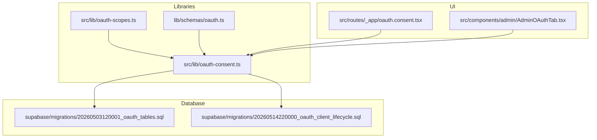
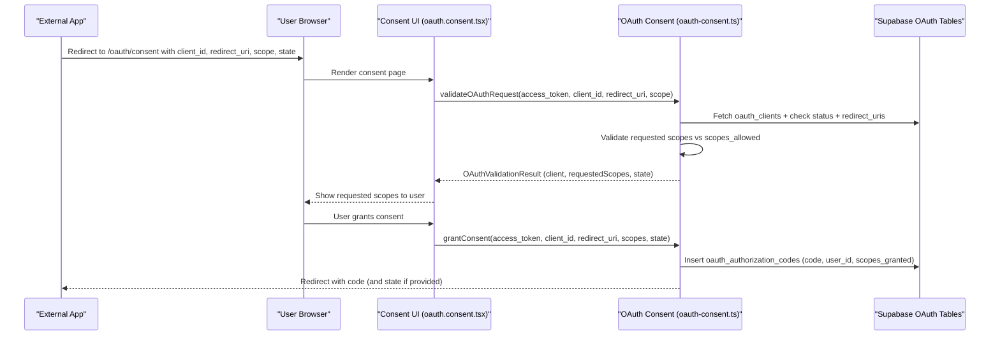
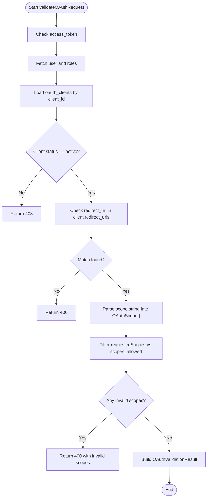
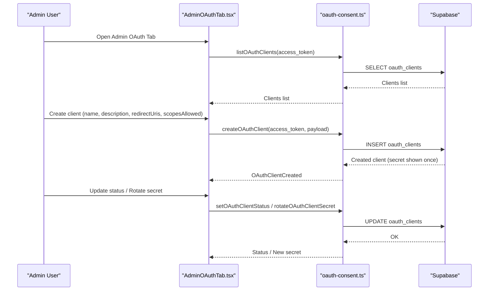
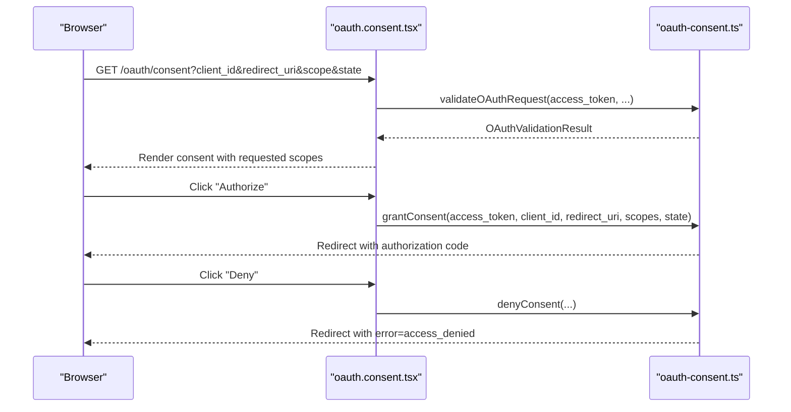
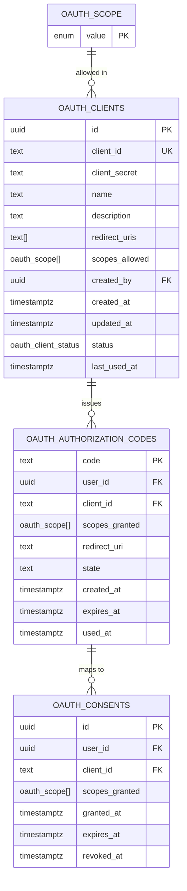
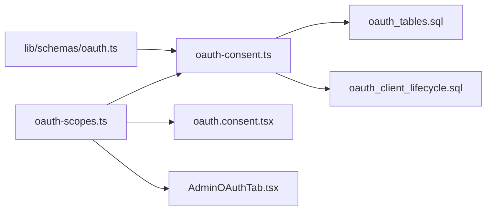

# OAuth Scopes System

<cite>
**Referenced Files in This Document**
- [oauth-scopes.ts](file://src/lib/oauth-scopes.ts)
- [oauth-consent.ts](file://src/lib/oauth-consent.ts)
- [oauth.ts](file://lib/schemas/oauth.ts)
- [oauth.consent.tsx](file://src/routes/_app/oauth.consent.tsx)
- [AdminOAuthTab.tsx](file://src/components/admin/AdminOAuthTab.tsx)
- [oauth-consent.test.ts](file://src/__tests__/lib/oauth-consent.test.ts)
- [oauth_tables.sql](file://supabase/migrations/20260503120001_oauth_tables.sql)
- [oauth_client_lifecycle.sql](file://supabase/migrations/20260514220000_oauth_client_lifecycle.sql)
</cite>

## Table of Contents
1. [Introduction](#introduction)
2. [Project Structure](#project-structure)
3. [Core Components](#core-components)
4. [Architecture Overview](#architecture-overview)
5. [Detailed Component Analysis](#detailed-component-analysis)
6. [Dependency Analysis](#dependency-analysis)
7. [Performance Considerations](#performance-considerations)
8. [Troubleshooting Guide](#troubleshooting-guide)
9. [Conclusion](#conclusion)
10. [Appendices](#appendices)

## Introduction
This document explains the OAuth scopes system in PCReady. It covers the scope-based permission model, the available scopes, validation during the OAuth flow, and how scopes map to application functionality. It also documents scope management best practices, security considerations, and guidance for extending the system with custom scopes.

## Project Structure
The OAuth scopes system spans TypeScript libraries, React UI components, Zod schemas, and Supabase database migrations:
- Scope definitions and helpers live in a dedicated library module.
- The OAuth consent flow is implemented as server functions and a React route.
- Admin UI exposes OAuth client creation and lifecycle management.
- Database migrations define the persisted scope model and related tables.



**Diagram sources**
- [oauth-scopes.ts:1-65](file://src/lib/oauth-scopes.ts#L1-L65)
- [oauth-consent.ts:1-520](file://src/lib/oauth-consent.ts#L1-L520)
- [oauth.ts:1-16](file://lib/schemas/oauth.ts#L1-L16)
- [oauth.consent.tsx:1-220](file://src/routes/_app/oauth.consent.tsx#L1-L220)
- [AdminOAuthTab.tsx:1-682](file://src/components/admin/AdminOAuthTab.tsx#L1-L682)
- [oauth_tables.sql:1-66](file://supabase/migrations/20260503120001_oauth_tables.sql#L1-L66)
- [oauth_client_lifecycle.sql:1-12](file://supabase/migrations/20260514220000_oauth_client_lifecycle.sql#L1-L12)

**Section sources**
- [oauth-scopes.ts:1-65](file://src/lib/oauth-scopes.ts#L1-L65)
- [oauth-consent.ts:1-520](file://src/lib/oauth-consent.ts#L1-L520)
- [oauth.ts:1-16](file://lib/schemas/oauth.ts#L1-L16)
- [oauth.consent.tsx:1-220](file://src/routes/_app/oauth.consent.tsx#L1-L220)
- [AdminOAuthTab.tsx:1-682](file://src/components/admin/AdminOAuthTab.tsx#L1-L682)
- [oauth_tables.sql:1-66](file://supabase/migrations/20260503120001_oauth_tables.sql#L1-L66)
- [oauth_client_lifecycle.sql:1-12](file://supabase/migrations/20260514220000_oauth_client_lifecycle.sql#L1-L12)

## Core Components
- Scope definitions and labels: Centralized enumeration of scopes with human-readable labels and descriptions.
- Consent validation and grant flow: Server-side validation of client, redirect URI, and requested scopes; generation of authorization codes upon user consent.
- Admin client management: Creation, status updates, secret rotation, and lifecycle inspection of OAuth clients.
- UI consent screen: Displays requested scopes to users and obtains explicit consent.
- Schema validation: Ensures client creation inputs conform to allowed scopes and redirect URIs.

Key responsibilities:
- Scope definition and lookup helpers.
- Request validation against allowed scopes and client status.
- Authorization code issuance with granted scopes.
- Admin-only operations and audit logging.

**Section sources**
- [oauth-scopes.ts:1-65](file://src/lib/oauth-scopes.ts#L1-L65)
- [oauth-consent.ts:140-254](file://src/lib/oauth-consent.ts#L140-L254)
- [oauth.ts:1-16](file://lib/schemas/oauth.ts#L1-L16)
- [oauth.consent.tsx:35-220](file://src/routes/_app/oauth.consent.tsx#L35-L220)
- [AdminOAuthTab.tsx:22-682](file://src/components/admin/AdminOAuthTab.tsx#L22-L682)

## Architecture Overview
The OAuth scopes system enforces a strict, client-driven permission model:
- Clients declare allowed scopes at creation time.
- During authorization, requested scopes are validated against allowed scopes.
- Users review and approve scopes on the consent screen.
- Upon consent, an authorization code is issued with the granted scopes.
- Admins manage clients, statuses, and secrets; lifecycle data is audited.



**Diagram sources**
- [oauth.consent.tsx:35-114](file://src/routes/_app/oauth.consent.tsx#L35-L114)
- [oauth-consent.ts:140-254](file://src/lib/oauth-consent.ts#L140-L254)
- [oauth_tables.sql:18-32](file://supabase/migrations/20260503120001_oauth_tables.sql#L18-L32)

## Detailed Component Analysis

### Scope Definitions and Labels
- Scope enumeration defines the canonical set of scopes.
- Helpers provide localized labels and descriptions for UI rendering.
- Long descriptions explain real-world impact for user consent.

Scope categories:
- Identity: openid, profile, email
- Application data: pcready:read, pcready:write, pcready:admin

```mermaid
classDiagram
class OAuthScope {
<<enumeration>>
"openid"
"profile"
"email"
"pcready : read"
"pcready : write"
"pcready : admin"
}
class ScopeDefinition {
+string label
+string description
+string longDescription
}
class OAuthScopesMap {
+Record<OAuthScope, ScopeDefinition>
}
OAuthScopesMap --> OAuthScope : "keys"
OAuthScopesMap --> ScopeDefinition : "values"
```

**Diagram sources**
- [oauth-scopes.ts:1-65](file://src/lib/oauth-scopes.ts#L1-L65)

**Section sources**
- [oauth-scopes.ts:1-65](file://src/lib/oauth-scopes.ts#L1-L65)

### Consent Validation and Authorization Code Issuance
- Validates access token, client existence, active status, and redirect URI match.
- Splits requested scopes and filters out invalid ones not declared by the client.
- On consent, generates a secure authorization code with expiration and stores granted scopes.



**Diagram sources**
- [oauth-consent.ts:140-194](file://src/lib/oauth-consent.ts#L140-L194)

**Section sources**
- [oauth-consent.ts:140-194](file://src/lib/oauth-consent.ts#L140-L194)

### Admin Client Management and Lifecycle
- Admins can create clients with allowed scopes and redirect URIs.
- Manage client status (active, disabled, revoked) and rotate secrets.
- Inspect lifecycle: consent history, authorization code events, and admin audit logs.



**Diagram sources**
- [AdminOAuthTab.tsx:22-682](file://src/components/admin/AdminOAuthTab.tsx#L22-L682)
- [oauth-consent.ts:266-437](file://src/lib/oauth-consent.ts#L266-L437)
- [oauth_tables.sql:4-16](file://supabase/migrations/20260503120001_oauth_tables.sql#L4-L16)

**Section sources**
- [AdminOAuthTab.tsx:22-682](file://src/components/admin/AdminOAuthTab.tsx#L22-L682)
- [oauth-consent.ts:266-437](file://src/lib/oauth-consent.ts#L266-L437)

### UI Consent Screen
- Renders client info and user identity.
- Lists requested scopes with labels and descriptions.
- Submits consent or denial; denial redirects with standardized error parameters.



**Diagram sources**
- [oauth.consent.tsx:35-114](file://src/routes/_app/oauth.consent.tsx#L35-L114)
- [oauth-consent.ts:196-254](file://src/lib/oauth-consent.ts#L196-L254)

**Section sources**
- [oauth.consent.tsx:35-220](file://src/routes/_app/oauth.consent.tsx#L35-L220)
- [oauth-consent.ts:72-114](file://src/lib/oauth-consent.ts#L72-L114)

### Database Model and Policies
- Enumerated scope type and tables for clients, authorization codes, and consents.
- Row Level Security policies restrict access to authenticated users and admins.
- Lifecycle status and timestamps track client activity.



**Diagram sources**
- [oauth_tables.sql:1-66](file://supabase/migrations/20260503120001_oauth_tables.sql#L1-L66)
- [oauth_client_lifecycle.sql:1-12](file://supabase/migrations/20260514220000_oauth_client_lifecycle.sql#L1-L12)

**Section sources**
- [oauth_tables.sql:1-66](file://supabase/migrations/20260503120001_oauth_tables.sql#L1-L66)
- [oauth_client_lifecycle.sql:1-12](file://supabase/migrations/20260514220000_oauth_client_lifecycle.sql#L1-L12)

## Dependency Analysis
- Scope definitions are consumed by:
  - Consent validation logic to filter requested scopes.
  - UI components to render labels and descriptions.
  - Admin UI to populate scope checkboxes.
  - Zod schema to validate client creation inputs.



**Diagram sources**
- [oauth-scopes.ts:1-65](file://src/lib/oauth-scopes.ts#L1-L65)
- [oauth-consent.ts:1-520](file://src/lib/oauth-consent.ts#L1-L520)
- [oauth.ts:1-16](file://lib/schemas/oauth.ts#L1-L16)
- [oauth.consent.tsx:1-220](file://src/routes/_app/oauth.consent.tsx#L1-L220)
- [AdminOAuthTab.tsx:1-682](file://src/components/admin/AdminOAuthTab.tsx#L1-L682)
- [oauth_tables.sql:1-66](file://supabase/migrations/20260503120001_oauth_tables.sql#L1-L66)
- [oauth_client_lifecycle.sql:1-12](file://supabase/migrations/20260514220000_oauth_client_lifecycle.sql#L1-L12)

**Section sources**
- [oauth-scopes.ts:1-65](file://src/lib/oauth-scopes.ts#L1-L65)
- [oauth-consent.ts:1-520](file://src/lib/oauth-consent.ts#L1-L520)
- [oauth.ts:1-16](file://lib/schemas/oauth.ts#L1-L16)
- [oauth.consent.tsx:1-220](file://src/routes/_app/oauth.consent.tsx#L1-L220)
- [AdminOAuthTab.tsx:1-682](file://src/components/admin/AdminOAuthTab.tsx#L1-L682)
- [oauth_tables.sql:1-66](file://supabase/migrations/20260503120001_oauth_tables.sql#L1-L66)
- [oauth_client_lifecycle.sql:1-12](file://supabase/migrations/20260514220000_oauth_client_lifecycle.sql#L1-L12)

## Performance Considerations
- Scope filtering is linear in the number of requested scopes against allowed scopes; keep requested scope sets minimal.
- Authorization code expiration reduces storage lifetime; ensure timely token exchange.
- Indexes on oauth_authorization_codes expire_at improve cleanup efficiency.
- Admin lifecycle queries limit result sets to recent entries to avoid heavy scans.

[No sources needed since this section provides general guidance]

## Troubleshooting Guide
Common issues and resolutions:
- Invalid client_id: Verify client registration and uniqueness.
- Invalid redirect_uri: Ensure the provided URI exactly matches one of the client’s registered URIs.
- Invalid scopes: Confirm requested scopes are a subset of scopes_allowed declared by the client.
- Client inactive/disabled/revoked: Activate or recreate the client as appropriate.
- Access denied by user: The denial URL includes standardized error parameters; handle gracefully in the app.

Validation helpers:
- Deny redirect builder constructs proper error responses.
- Invalid scope detection filters requested scopes against allowed ones.

**Section sources**
- [oauth-consent.ts:72-114](file://src/lib/oauth-consent.ts#L72-L114)
- [oauth-consent.ts:140-194](file://src/lib/oauth-consent.ts#L140-L194)
- [oauth-consent.test.ts:1-35](file://src/__tests__/lib/oauth-consent.test.ts#L1-L35)

## Conclusion
PCReady’s OAuth scopes system provides a robust, client-driven permission model. Scopes are clearly defined, validated at runtime, and surfaced to users for informed consent. Admins retain strong control over clients, statuses, and secrets, while lifecycle insights support auditing and incident response. The system is extensible and secure by design.

[No sources needed since this section summarizes without analyzing specific files]

## Appendices

### Available Scopes Reference
- openid: Identity (OpenID) — Stable user identifier for the external app.
- profile: Profile — Display name and initials.
- email: Email — User’s email address.
- pcready:read: Read data — View customers, tickets, devices, checklists, and related content.
- pcready:write: Write data — Create and update tickets, statuses, notes, and operational data.
- pcready:admin: Administration — Administrative actions (users, settings, audit).

Scope descriptions are rendered in the consent UI and admin panels for transparency.

**Section sources**
- [oauth-scopes.ts:17-54](file://src/lib/oauth-scopes.ts#L17-L54)
- [oauth.consent.tsx:178-195](file://src/routes/_app/oauth.consent.tsx#L178-L195)
- [AdminOAuthTab.tsx:158-192](file://src/components/admin/AdminOAuthTab.tsx#L158-L192)

### Scope Combination Examples and Access Levels
- openid profile email: Basic identity and profile read.
- openid profile email pcready:read: Identity plus read-only access to operational data.
- openid profile email pcready:read pcready:write: Identity plus read/write access to operational data.
- openid profile email pcready:read pcready:write pcready:admin: Full administrative access.

Mapping to application functionality:
- Read-only dashboards and reporting: pcready:read.
- Field tools and automations: pcready:read pcready:write.
- Internal admin tooling: pcready:read pcready:write pcready:admin.

[No sources needed since this section provides conceptual examples]

### Relationship Between OAuth Scopes and User Roles
- Admin-only operations (e.g., client management, audit reads) require administrator privileges.
- End-user consent flow requires an authenticated session but does not inherently depend on admin role.
- Scope “pcready:admin” implies administrative capabilities; assign only to trusted internal integrations.

[No sources needed since this section provides general guidance]

### Scope Management Best Practices and Security Considerations
- Principle of least privilege: Allow only the minimum scopes necessary for the integration.
- Regular audits: Use lifecycle views to monitor consent and authorization code usage.
- Secret rotation: Rotate client secrets periodically and immediately after compromise.
- Status controls: Disable clients temporarily and revoke when permanently decommissioned.
- Redirect URI discipline: Keep redirect URIs precise and validated.
- Expiration and cleanup: Authorization codes expire quickly; ensure prompt token exchange.

[No sources needed since this section provides general guidance]

### Implementing Custom Scopes and Extending the System
Steps to add a new scope:
1. Extend the scope enumeration and add a definition with label and descriptions.
2. Update the Zod schema to include the new scope in the allowed list.
3. Update UI components to render the new scope in admin forms and consent screens.
4. Add or adjust database policies and tables if new persistence is needed.
5. Update tests to cover validation and UI behavior.

Guidelines:
- Keep scope names stable and descriptive.
- Provide clear, user-friendly labels and long descriptions.
- Align scope granularity with application capabilities.
- Document scope impact and recommended usage.

**Section sources**
- [oauth-scopes.ts:1-65](file://src/lib/oauth-scopes.ts#L1-L65)
- [oauth.ts](file://lib/schemas/oauth.ts#L12)
- [AdminOAuthTab.tsx:158-192](file://src/components/admin/AdminOAuthTab.tsx#L158-L192)
- [oauth-consent.ts:171-178](file://src/lib/oauth-consent.ts#L171-L178)