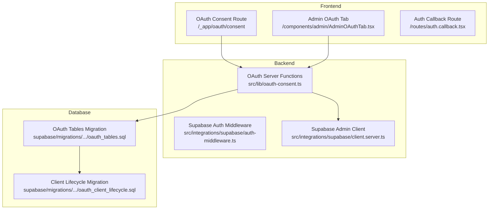
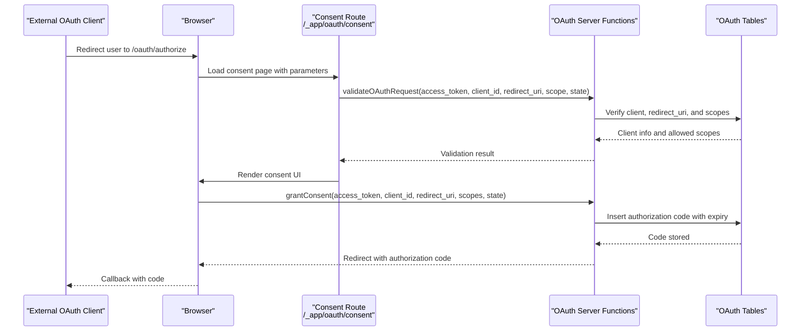
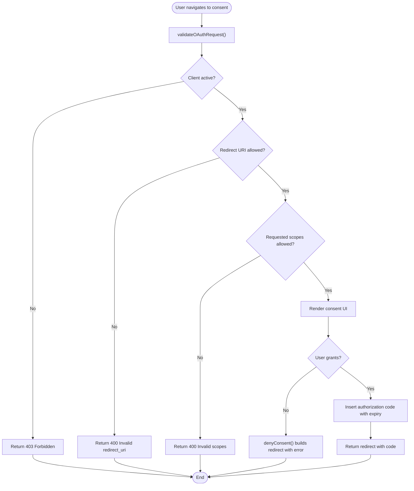
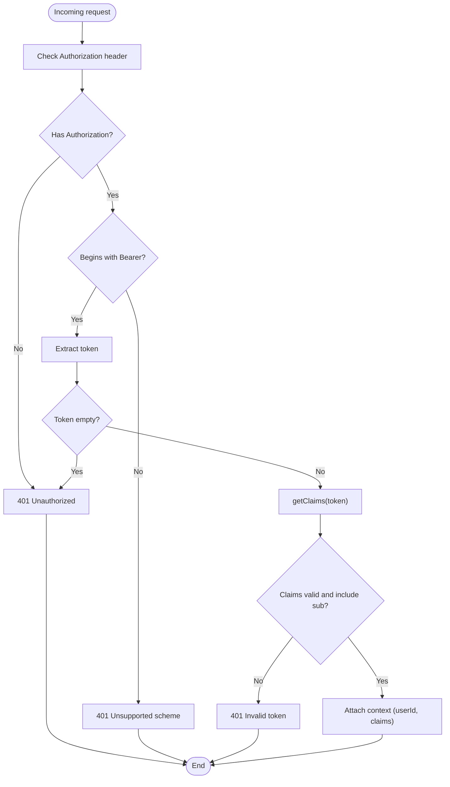
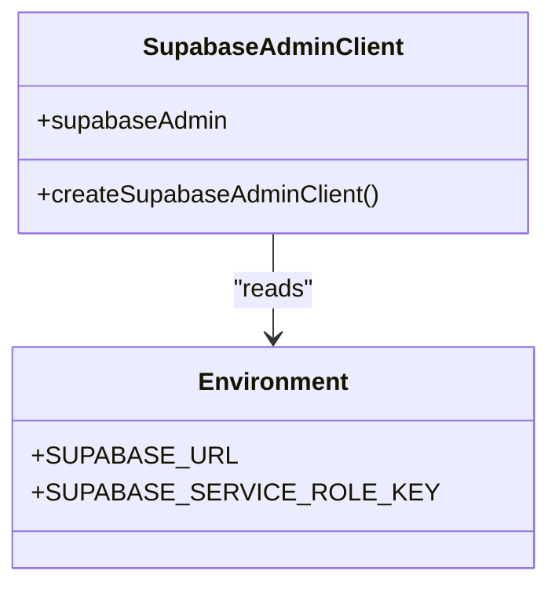
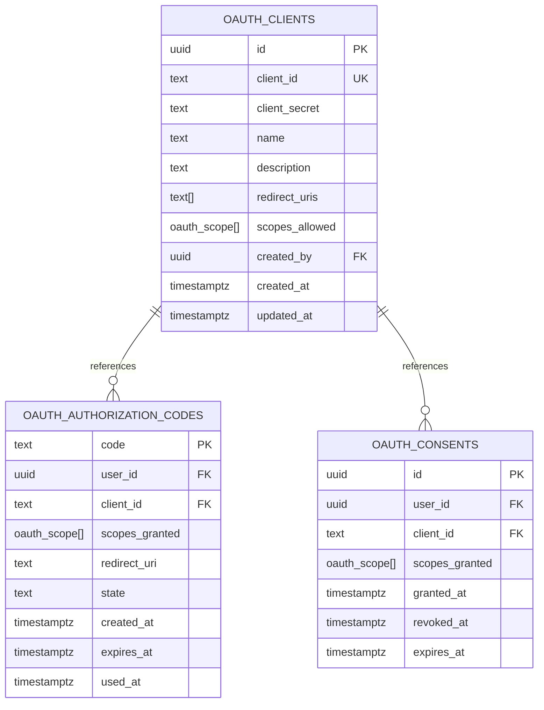
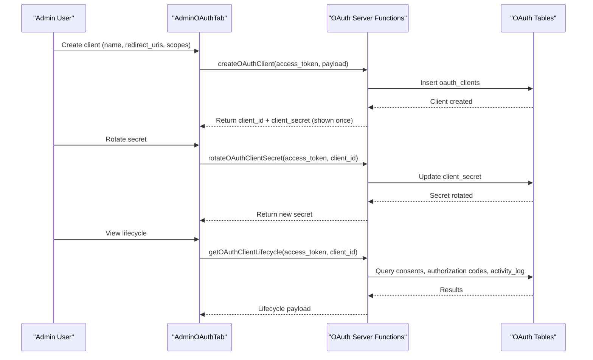
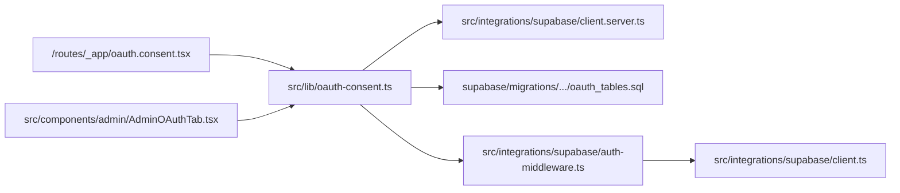

# OAuth Security Implementation

<cite>
**Referenced Files in This Document**
- [oauth-consent.ts](file://src/lib/oauth-consent.ts)
- [oauth-scopes.ts](file://src/lib/oauth-scopes.ts)
- [oauth.ts](file://lib/schemas/oauth.ts)
- [oauth.consent.tsx](file://src/routes/_app/oauth.consent.tsx)
- [AdminOAuthTab.tsx](file://src/components/admin/AdminOAuthTab.tsx)
- [auth-middleware.ts](file://src/integrations/supabase/auth-middleware.ts)
- [client.server.ts](file://src/integrations/supabase/client.server.ts)
- [client.ts](file://src/integrations/supabase/client.ts)
- [auth.callback.tsx](file://src/routes/auth.callback.tsx)
- [oauth-consent.test.ts](file://src/__tests__/lib/oauth-consent.test.ts)
- [oauth_tables.sql](file://supabase/migrations/20260503120001_oauth_tables.sql)
- [oauth_client_lifecycle.sql](file://supabase/migrations/20260514182000_oauth_client_lifecycle.sql)
</cite>

## Table of Contents
1. [Introduction](#introduction)
2. [Project Structure](#project-structure)
3. [Core Components](#core-components)
4. [Architecture Overview](#architecture-overview)
5. [Detailed Component Analysis](#detailed-component-analysis)
6. [Dependency Analysis](#dependency-analysis)
7. [Performance Considerations](#performance-considerations)
8. [Security Patterns and Attack Mitigation](#security-patterns-and-attack-mitigation)
9. [Logging and Monitoring](#logging-and-monitoring)
10. [Best Practices and Common Pitfalls](#best-practices-and-common-pitfalls)
11. [Conclusion](#conclusion)

## Introduction
This document provides comprehensive documentation for the OAuth security implementation in PCReady. It details the security measures protecting OAuth flows, including request validation, token verification, and access control. It explains the integration with Supabase authentication security features and how they enhance OAuth protection. The document also covers security patterns used to prevent common OAuth attacks such as CSRF, man-in-the-middle, and token replay attacks. Additional topics include secure redirect URI validation, state parameter handling, PKCE implementation gaps, token storage security, refresh token handling, access token expiration management, logging and monitoring capabilities, and best practices for OAuth client implementations.

## Project Structure
The OAuth implementation spans frontend routes, backend server functions, Supabase integration utilities, and database schemas. Key areas include:
- Frontend consent flow and admin management UI
- Backend server functions for OAuth request validation, consent granting, and client lifecycle management
- Supabase authentication middleware and client utilities
- Database schema for OAuth clients, authorization codes, and consent records

**Diagram sources**
- [oauth.consent.tsx:1-220](file://src/routes/_app/oauth.consent.tsx#L1-L220)
- [AdminOAuthTab.tsx:1-682](file://src/components/admin/AdminOAuthTab.tsx#L1-L682)
- [auth.callback.tsx:1-84](file://src/routes/auth.callback.tsx#L1-L84)
- [oauth-consent.ts:1-520](file://src/lib/oauth-consent.ts#L1-L520)
- [auth-middleware.ts:1-74](file://src/integrations/supabase/auth-middleware.ts#L1-L74)
- [client.server.ts:1-42](file://src/integrations/supabase/client.server.ts#L1-L42)
- [oauth_tables.sql:1-33](file://supabase/migrations/20260503120001_oauth_tables.sql#L1-L33)
- [oauth_client_lifecycle.sql:1-200](file://supabase/migrations/20260514182000_oauth_client_lifecycle.sql#L1-L200)

**Section sources**
- [oauth-consent.ts:1-520](file://src/lib/oauth-consent.ts#L1-L520)
- [oauth-scopes.ts:1-65](file://src/lib/oauth-scopes.ts#L1-L65)
- [oauth.ts:1-16](file://lib/schemas/oauth.ts#L1-L16)
- [oauth.consent.tsx:1-220](file://src/routes/_app/oauth.consent.tsx#L1-L220)
- [AdminOAuthTab.tsx:1-682](file://src/components/admin/AdminOAuthTab.tsx#L1-L682)
- [auth-middleware.ts:1-74](file://src/integrations/supabase/auth-middleware.ts#L1-L74)
- [client.server.ts:1-42](file://src/integrations/supabase/client.server.ts#L1-L42)
- [client.ts:1-41](file://src/integrations/supabase/client.ts#L1-L41)
- [auth.callback.tsx:1-84](file://src/routes/auth.callback.tsx#L1-L84)
- [oauth-consent.test.ts:1-34](file://src/__tests__/lib/oauth-consent.test.ts#L1-L34)
- [oauth_tables.sql:1-33](file://supabase/migrations/20260503120001_oauth_tables.sql#L1-L33)
- [oauth_client_lifecycle.sql:1-200](file://supabase/migrations/20260514182000_oauth_client_lifecycle.sql#L1-L200)

## Core Components
- OAuth Consent Flow: Validates incoming requests, renders user consent prompts, grants authorization codes, and denies requests with proper error handling.
- OAuth Scopes: Defines available scopes and their descriptions for granular permission control.
- OAuth Client Schema: Validates client creation inputs including redirect URIs and allowed scopes.
- Supabase Authentication Middleware: Enforces Bearer token authentication and validates claims for server functions.
- Supabase Admin Client: Provides a service role client for privileged operations bypassing Row Level Security.
- Database Schema: Defines OAuth clients, authorization codes, and consent records with appropriate constraints and indexes.

**Section sources**
- [oauth-consent.ts:140-254](file://src/lib/oauth-consent.ts#L140-L254)
- [oauth-scopes.ts:1-65](file://src/lib/oauth-scopes.ts#L1-L65)
- [oauth.ts:1-16](file://lib/schemas/oauth.ts#L1-L16)
- [auth-middleware.ts:7-73](file://src/integrations/supabase/auth-middleware.ts#L7-L73)
- [client.server.ts:8-41](file://src/integrations/supabase/client.server.ts#L8-L41)
- [oauth_tables.sql:1-33](file://supabase/migrations/20260503120001_oauth_tables.sql#L1-L33)

## Architecture Overview
The OAuth flow integrates frontend consent, backend validation and authorization, and database-backed persistence. Supabase authentication middleware secures server functions, while the admin client handles privileged operations. The database enforces referential integrity and stores ephemeral authorization codes with expiration.

**Diagram sources**
- [oauth.consent.tsx:35-114](file://src/routes/_app/oauth.consent.tsx#L35-L114)
- [oauth-consent.ts:141-254](file://src/lib/oauth-consent.ts#L141-L254)
- [oauth_tables.sql:18-32](file://supabase/migrations/20260503120001_oauth_tables.sql#L18-L32)

## Detailed Component Analysis

### OAuth Consent Flow
The consent flow validates incoming OAuth requests, ensures the client is active, checks that the redirect URI matches configured values, and verifies requested scopes against allowed scopes. Upon user consent, an authorization code is generated and stored with an expiration time, then returned to the client via redirect.

**Diagram sources**
- [oauth-consent.ts:141-254](file://src/lib/oauth-consent.ts#L141-L254)
- [oauth-consent.ts:72-80](file://src/lib/oauth-consent.ts#L72-L80)

**Section sources**
- [oauth-consent.ts:141-254](file://src/lib/oauth-consent.ts#L141-L254)
- [oauth-consent.ts:72-80](file://src/lib/oauth-consent.ts#L72-L80)
- [oauth-consent.test.ts:9-27](file://src/__tests__/lib/oauth-consent.test.ts#L9-L27)

### Supabase Authentication Middleware
The middleware enforces Bearer token authentication, validates token claims, and injects user context into server functions. It rejects missing or malformed tokens and ensures only Bearer tokens are accepted.

**Diagram sources**
- [auth-middleware.ts:7-73](file://src/integrations/supabase/auth-middleware.ts#L7-L73)

**Section sources**
- [auth-middleware.ts:7-73](file://src/integrations/supabase/auth-middleware.ts#L7-L73)

### Supabase Admin Client
The admin client uses the service role key to bypass Row Level Security for privileged operations. It is designed for server-side use only and is proxied to avoid repeated initialization.

**Diagram sources**
- [client.server.ts:8-41](file://src/integrations/supabase/client.server.ts#L8-L41)

**Section sources**
- [client.server.ts:8-41](file://src/integrations/supabase/client.server.ts#L8-L41)

### OAuth Database Schema
The OAuth schema defines clients, authorization codes, and consent records with constraints and indexes. Authorization codes are stored temporarily with an expiration timestamp and marked when redeemed.

**Diagram sources**
- [oauth_tables.sql:4-32](file://supabase/migrations/20260503120001_oauth_tables.sql#L4-L32)

**Section sources**
- [oauth_tables.sql:1-33](file://supabase/migrations/20260503120001_oauth_tables.sql#L1-L33)

### Admin OAuth Management UI
The admin tab allows creation of OAuth clients, setting status, rotating secrets, and viewing lifecycle data including consents, authorization events, and audit logs.

**Diagram sources**
- [AdminOAuthTab.tsx:256-437](file://src/components/admin/AdminOAuthTab.tsx#L256-L437)
- [oauth-consent.ts:294-437](file://src/lib/oauth-consent.ts#L294-L437)
- [oauth_tables.sql:18-32](file://supabase/migrations/20260503120001_oauth_tables.sql#L18-L32)

**Section sources**
- [AdminOAuthTab.tsx:256-437](file://src/components/admin/AdminOAuthTab.tsx#L256-L437)
- [oauth-consent.ts:294-437](file://src/lib/oauth-consent.ts#L294-L437)

## Dependency Analysis
The OAuth implementation exhibits clear separation of concerns:
- Frontend routes depend on server functions for validation and consent operations.
- Server functions depend on the Supabase admin client for database operations.
- Database schema depends on OAuth enums and foreign keys.
- Supabase middleware enforces authentication for server functions.

**Diagram sources**
- [oauth.consent.tsx:1-220](file://src/routes/_app/oauth.consent.tsx#L1-L220)
- [AdminOAuthTab.tsx:1-682](file://src/components/admin/AdminOAuthTab.tsx#L1-L682)
- [oauth-consent.ts:1-520](file://src/lib/oauth-consent.ts#L1-L520)
- [client.server.ts:1-42](file://src/integrations/supabase/client.server.ts#L1-L42)
- [auth-middleware.ts:1-74](file://src/integrations/supabase/auth-middleware.ts#L1-L74)
- [client.ts:1-41](file://src/integrations/supabase/client.ts#L1-L41)
- [oauth_tables.sql:1-33](file://supabase/migrations/20260503120001_oauth_tables.sql#L1-L33)

**Section sources**
- [oauth-consent.ts:1-520](file://src/lib/oauth-consent.ts#L1-L520)
- [oauth.consent.tsx:1-220](file://src/routes/_app/oauth.consent.tsx#L1-L220)
- [AdminOAuthTab.tsx:1-682](file://src/components/admin/AdminOAuthTab.tsx#L1-L682)
- [auth-middleware.ts:1-74](file://src/integrations/supabase/auth-middleware.ts#L1-L74)
- [client.server.ts:1-42](file://src/integrations/supabase/client.server.ts#L1-L42)
- [client.ts:1-41](file://src/integrations/supabase/client.ts#L1-L41)
- [oauth_tables.sql:1-33](file://supabase/migrations/20260503120001_oauth_tables.sql#L1-L33)

## Performance Considerations
- Authorization code generation uses cryptographically secure randomness and stores expiration timestamps for efficient cleanup.
- Database indexes on expiration fields support timely cleanup of stale authorization codes.
- Server functions minimize round-trips by batching reads and writes where possible.
- Client-side caching and lazy initialization of Supabase clients reduce overhead.

[No sources needed since this section provides general guidance]

## Security Patterns and Attack Mitigation

### Request Validation
- Client validation ensures the client is active and the redirect URI exactly matches configured values.
- Scope validation restricts requested scopes to those allowed for the client.
- Token validation requires a valid Bearer token with claims verified by Supabase.

**Section sources**
- [oauth-consent.ts:158-178](file://src/lib/oauth-consent.ts#L158-L178)
- [auth-middleware.ts:56-63](file://src/integrations/supabase/auth-middleware.ts#L56-L63)

### Token Verification and Access Control
- Supabase authentication middleware enforces Bearer token authentication and validates claims.
- Server functions require authenticated access tokens before performing sensitive operations.
- Role-based access control is enforced for administrative actions.

**Section sources**
- [auth-middleware.ts:7-73](file://src/integrations/supabase/auth-middleware.ts#L7-L73)
- [oauth-consent.ts:37-48](file://src/lib/oauth-consent.ts#L37-L48)

### Secure Redirect URI Validation
- Redirect URIs are validated against the client's configured list, ensuring strict matching.
- Any mismatch triggers a validation error, preventing open redirect vulnerabilities.

**Section sources**
- [oauth-consent.ts:167-169](file://src/lib/oauth-consent.ts#L167-L169)

### State Parameter Handling
- State parameter is preserved and returned during both grant and denial flows.
- Tests confirm state inclusion in deny redirects and absence when not provided.

**Section sources**
- [oauth-consent.ts:192-193](file://src/lib/oauth-consent.ts#L192-L193)
- [oauth-consent.ts:77-79](file://src/lib/oauth-consent.ts#L77-L79)
- [oauth-consent.test.ts:9-27](file://src/__tests__/lib/oauth-consent.test.ts#L9-L27)

### PKCE (Proof Key for Code Exchange)
- Current implementation does not indicate PKCE support in the provided files.
- Recommendation: Implement PKCE by generating and storing code_verifier and verifying code_challenge during token exchange.

[No sources needed since this section provides recommendations]

### Token Storage Security
- Authorization codes are stored with expiration timestamps and marked when redeemed.
- Client secrets are rotated through the admin interface, with audit logging.

**Section sources**
- [oauth-consent.ts:224-239](file://src/lib/oauth-consent.ts#L224-L239)
- [oauth-consent.ts:406-437](file://src/lib/oauth-consent.ts#L406-L437)
- [oauth_tables.sql:18-32](file://supabase/migrations/20260503120001_oauth_tables.sql#L18-L32)

### Refresh Token Handling
- No refresh token handling is implemented in the provided files.
- Recommendation: Implement refresh token rotation and secure storage with short lifespans.

[No sources needed since this section provides recommendations]

### Access Token Expiration Management
- Access tokens are validated via Supabase claims; expiration is managed server-side.
- Authorization codes have explicit expiration times to mitigate replay risks.

**Section sources**
- [auth-middleware.ts:56-63](file://src/integrations/supabase/auth-middleware.ts#L56-L63)
- [oauth-consent.ts:224-225](file://src/lib/oauth-consent.ts#L224-L225)

### CSRF Protection
- State parameter is preserved and returned, enabling detection of state mismatches.
- Recommendation: Implement anti-CSRF measures such as SameSite cookies and CSRF tokens for additional protection.

[No sources needed since this section provides recommendations]

### Man-in-the-Middle and Token Replay Attacks
- Authorization codes expire quickly and are single-use, reducing replay risk.
- Client secret rotation mitigates long-term exposure.

**Section sources**
- [oauth-consent.ts:224-225](file://src/lib/oauth-consent.ts#L224-L225)
- [oauth-consent.ts:406-437](file://src/lib/oauth-consent.ts#L406-L437)

## Logging and Monitoring
- Audit logging captures client lifecycle events including creation, updates, secret rotation, and status changes.
- Activity log entries record administrative actions with actor, action type, and timestamps.
- Consent history and authorization event tracking provide visibility into user authorizations and code redemption status.

**Section sources**
- [oauth-consent.ts:50-70](file://src/lib/oauth-consent.ts#L50-L70)
- [oauth-consent.ts:443-510](file://src/lib/oauth-consent.ts#L443-L510)
- [oauth-client_lifecycle.sql:1-200](file://supabase/migrations/20260514182000_oauth_client_lifecycle.sql#L1-L200)

## Best Practices and Common Pitfalls
- Always validate redirect URIs against the client's configured list.
- Never log or expose client secrets; show only once during creation.
- Implement PKCE for public clients to prevent authorization code interception.
- Use short-lived authorization codes and enforce single-use redemption.
- Rotate client secrets periodically and monitor for unauthorized usage.
- Ensure state parameters are always included and validated.
- Avoid storing sensitive tokens in client-side storage; use secure server-side sessions.
- Common pitfalls: accepting wildcard redirect URIs, failing to validate scopes, ignoring state parameters, and not expiring authorization codes.

[No sources needed since this section provides general guidance]

## Conclusion
PCReady's OAuth implementation incorporates robust request validation, strict redirect URI enforcement, scope control, and comprehensive audit logging. Supabase authentication middleware and the admin client provide strong access control and secure privileged operations. While the current implementation focuses on authorization code flow with state handling and secure code storage, enhancements such as PKCE and refresh token management would further strengthen protection against modern OAuth threats. The admin interface enables effective lifecycle management and monitoring of OAuth clients, supporting ongoing security operations.