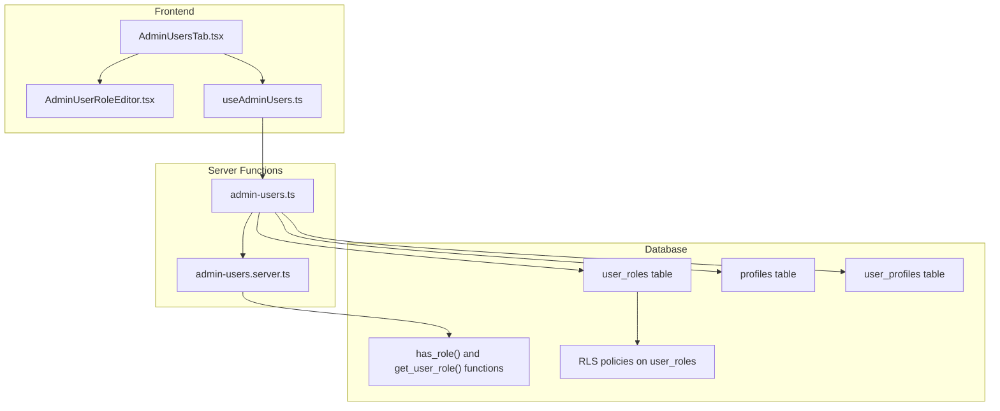
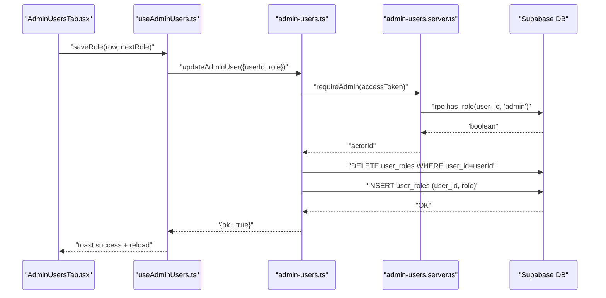
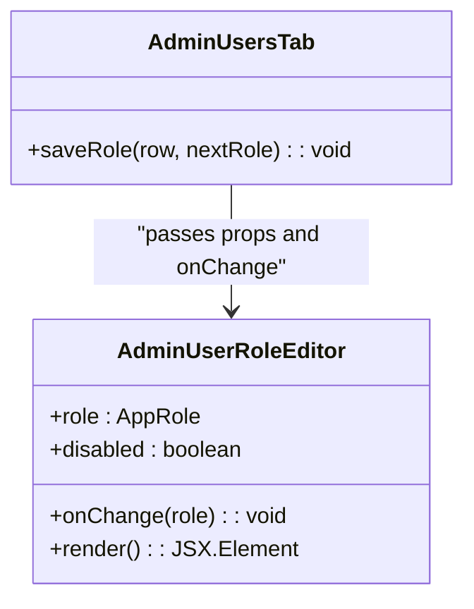
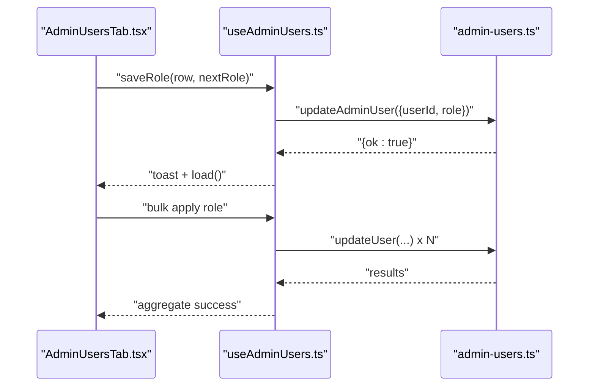
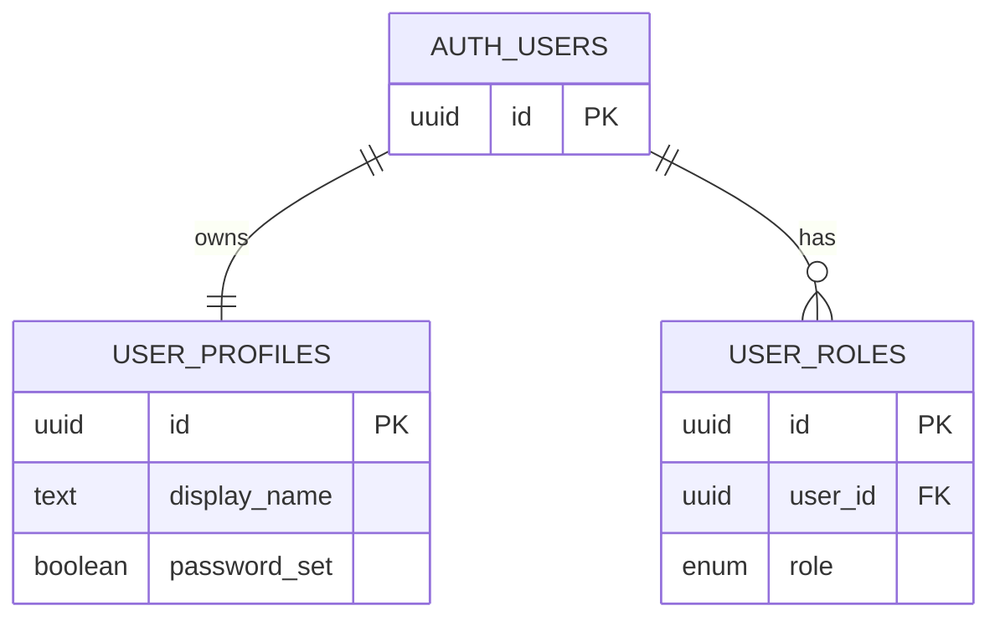
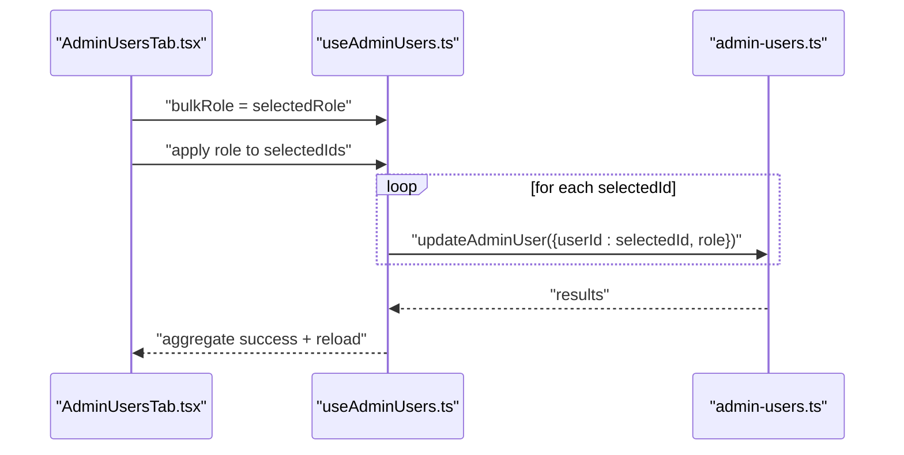
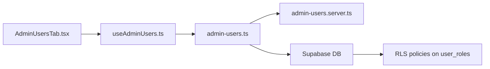

# Role Assignment Mechanism

<cite>
**Referenced Files in This Document**
- [admin-users.ts](file://src/lib/admin-users.ts)
- [admin-users.server.ts](file://src/lib/admin-users.server.ts)
- [AdminUserRoleEditor.tsx](file://src/components/admin/AdminUserRoleEditor.tsx)
- [AdminUsersTab.tsx](file://src/components/admin/AdminUsersTab.tsx)
- [useAdminUsers.ts](file://src/hooks/useAdminUsers.ts)
- [admin-constants.ts](file://src/lib/admin/admin-constants.ts)
- [user-profile.ts](file://src/lib/user-profile.ts)
- [20260429202127_cd9e1421-24c9-40f3-9ac6-9e2259cbb2af.sql](file://supabase/migrations/20260429202127_cd9e1421-24c9-40f3-9ac6-9e2259cbb2af.sql)
- [20260507123000_user_profiles.sql](file://supabase/migrations/20260507123000_user_profiles.sql)
- [audit-log.ts](file://src/lib/audit-log.ts)
</cite>

## Table of Contents
1. [Introduction](#introduction)
2. [Project Structure](#project-structure)
3. [Core Components](#core-components)
4. [Architecture Overview](#architecture-overview)
5. [Detailed Component Analysis](#detailed-component-analysis)
6. [Dependency Analysis](#dependency-analysis)
7. [Performance Considerations](#performance-considerations)
8. [Troubleshooting Guide](#troubleshooting-guide)
9. [Conclusion](#conclusion)
10. [Appendices](#appendices)

## Introduction
This document explains the role assignment mechanism in PCReady. It covers how user roles are determined via database functions and persisted in the user profiles and roles tables, how administrators assign and modify roles through the admin interface, and how server-side validation and RLS policies enforce access control. It also details propagation of role changes to permissions, programmatic assignment and bulk updates, and audit trail considerations.

## Project Structure
The role assignment system spans frontend components, React hooks, server functions, and backend database logic:
- Frontend admin UI: AdminUsersTab renders the user list and integrates AdminUserRoleEditor for inline role editing.
- Hook orchestration: useAdminUsers coordinates server function calls and state for listing, updating, inviting, disabling, and deleting users.
- Server functions: admin-users.ts exposes server functions for listing users, updating roles, inviting users, resending invites, disabling users, and deleting users.
- Authentication and authorization: admin-users.server.ts validates admin access using database RPC functions.
- Database schema and policies: migrations define the app_role enum, user_roles table, helper functions (has_role, get_user_role), and RLS policies governing who can read and manage roles.
- User profiles: user-profile.ts manages user profile persistence and is used during invitations and profile normalization.



**Diagram sources**
- [AdminUsersTab.tsx:1-497](file://src/components/admin/AdminUsersTab.tsx#L1-L497)
- [AdminUserRoleEditor.tsx:1-70](file://src/components/admin/AdminUserRoleEditor.tsx#L1-L70)
- [useAdminUsers.ts:1-213](file://src/hooks/useAdminUsers.ts#L1-L213)
- [admin-users.ts:1-279](file://src/lib/admin-users.ts#L1-L279)
- [admin-users.server.ts:1-18](file://src/lib/admin-users.server.ts#L1-L18)
- [20260429202127_cd9e1421-24c9-40f3-9ac6-9e2259cbb2af.sql:1-124](file://supabase/migrations/20260429202127_cd9e1421-24c9-40f3-9ac6-9e2259cbb2af.sql#L1-L124)
- [20260507123000_user_profiles.sql:1-107](file://supabase/migrations/20260507123000_user_profiles.sql#L1-L107)

**Section sources**
- [AdminUsersTab.tsx:1-497](file://src/components/admin/AdminUsersTab.tsx#L1-L497)
- [AdminUserRoleEditor.tsx:1-70](file://src/components/admin/AdminUserRoleEditor.tsx#L1-L70)
- [useAdminUsers.ts:1-213](file://src/hooks/useAdminUsers.ts#L1-L213)
- [admin-users.ts:1-279](file://src/lib/admin-users.ts#L1-L279)
- [admin-users.server.ts:1-18](file://src/lib/admin-users.server.ts#L1-L18)
- [20260429202127_cd9e1421-24c9-40f3-9ac6-9e2259cbb2af.sql:1-124](file://supabase/migrations/20260429202127_cd9e1421-24c9-40f3-9ac6-9e2259cbb2af.sql#L1-L124)
- [20260507123000_user_profiles.sql:1-107](file://supabase/migrations/20260507123000_user_profiles.sql#L1-L107)

## Core Components
- AdminUserRoleEditor: An inline editor that renders the current role and allows switching among admin, tech, and viewer via a select control. It uses ADMIN_ROLES and adminRoleLabel constants and enforces valid role transitions.
- AdminUsersTab: The admin panel tab that lists users, supports filtering, bulk operations, and integrates AdminUserRoleEditor for per-user role changes.
- useAdminUsers: A hook orchestrating server function calls for listing, updating roles, inviting users, disabling/enabling users, and removing users. It handles loading states, selection, and error messaging.
- admin-users.ts: Server functions implementing role assignment, user invitation, invite resends, user disabling/enabling, and deletion. Includes validation, rate limiting for invitations, and role change enforcement.
- admin-users.server.ts: Authorization guard requiring admin access using database RPC has_role and returning the acting user ID.
- admin-constants.ts: Defines ADMIN_ROLES, adminRoleLabel, and isAppRole validator used by the UI and server functions.
- user-profile.ts: Manages user profile persistence and is leveraged during invitations and profile normalization.

**Section sources**
- [AdminUserRoleEditor.tsx:1-70](file://src/components/admin/AdminUserRoleEditor.tsx#L1-L70)
- [AdminUsersTab.tsx:1-497](file://src/components/admin/AdminUsersTab.tsx#L1-L497)
- [useAdminUsers.ts:1-213](file://src/hooks/useAdminUsers.ts#L1-L213)
- [admin-users.ts:1-279](file://src/lib/admin-users.ts#L1-L279)
- [admin-users.server.ts:1-18](file://src/lib/admin-users.server.ts#L1-L18)
- [admin-constants.ts:1-23](file://src/lib/admin/admin-constants.ts#L1-L23)
- [user-profile.ts:1-204](file://src/lib/user-profile.ts#L1-L204)

## Architecture Overview
The role assignment architecture combines a frontend admin interface with server functions and database-level enforcement:
- Frontend triggers server functions via TanStack Start server functions.
- Server functions validate inputs, enforce business rules (e.g., preventing removal of the last admin), and perform atomic role updates.
- Database functions (has_role, get_user_role) and RLS policies govern who can read and manage roles.
- Role changes propagate immediately to permissions enforced by RLS policies.



**Diagram sources**
- [AdminUsersTab.tsx:77-97](file://src/components/admin/AdminUsersTab.tsx#L77-L97)
- [useAdminUsers.ts:77-97](file://src/hooks/useAdminUsers.ts#L77-L97)
- [admin-users.ts:137-167](file://src/lib/admin-users.ts#L137-L167)
- [admin-users.server.ts:3-17](file://src/lib/admin-users.server.ts#L3-L17)
- [20260429202127_cd9e1421-24c9-40f3-9ac6-9e2259cbb2af.sql:73-85](file://supabase/migrations/20260429202127_cd9e1421-24c9-40f3-9ac6-9e2259cbb2af.sql#L73-L85)

## Detailed Component Analysis

### AdminUserRoleEditor Component
AdminUserRoleEditor renders the current role with a colored badge and switches to an editable select when clicked. It validates role values against ADMIN_ROLES and triggers the parent’s onChange handler.



**Diagram sources**
- [AdminUserRoleEditor.tsx:7-15](file://src/components/admin/AdminUserRoleEditor.tsx#L7-L15)
- [AdminUsersTab.tsx:348-352](file://src/components/admin/AdminUsersTab.tsx#L348-L352)

**Section sources**
- [AdminUserRoleEditor.tsx:1-70](file://src/components/admin/AdminUserRoleEditor.tsx#L1-L70)
- [admin-constants.ts:3-23](file://src/lib/admin/admin-constants.ts#L3-L23)

### AdminUsersTab and useAdminUsers Integration
AdminUsersTab integrates AdminUserRoleEditor and delegates role updates to useAdminUsers.saveRole, which calls updateAdminUser. It also supports bulk operations, filtering, and invites.



**Diagram sources**
- [AdminUsersTab.tsx:150-197](file://src/components/admin/AdminUsersTab.tsx#L150-L197)
- [useAdminUsers.ts:77-97](file://src/hooks/useAdminUsers.ts#L77-L97)
- [admin-users.ts:137-167](file://src/lib/admin-users.ts#L137-L167)

**Section sources**
- [AdminUsersTab.tsx:1-497](file://src/components/admin/AdminUsersTab.tsx#L1-L497)
- [useAdminUsers.ts:1-213](file://src/hooks/useAdminUsers.ts#L1-L213)

### Server-Side Role Assignment Logic
The updateAdminUser server function:
- Validates the requested role against allowed values.
- Enforces that removing the last admin is prevented.
- Updates the user’s profile full_name and initials if provided.
- Deletes existing user_roles rows for the user and inserts the new role atomically.
- Returns success.

```mermaid
flowchart TD
Start([Entry: updateAdminUser]) --> Validate["Validate role"]
Validate --> CanRemove{"Can remove last admin?"}
CanRemove --> |No| Error["Throw error"]
CanRemove --> |Yes| UpdateProfile["Upsert profile full_name and initials"]
UpdateProfile --> DeleteOld["DELETE user_roles by user_id"]
DeleteOld --> InsertNew["INSERT new role"]
InsertNew --> Done([Return {ok: true}])
Error --> Done
```

**Diagram sources**
- [admin-users.ts:137-167](file://src/lib/admin-users.ts#L137-L167)
- [admin-users.ts:69-86](file://src/lib/admin-users.ts#L69-L86)

**Section sources**
- [admin-users.ts:137-167](file://src/lib/admin-users.ts#L137-L167)

### Database Schema and Policies
The database defines:
- app_role enum with values admin, tech, viewer.
- user_roles table storing user_id and role with RLS policies:
  - Users can read their own roles.
  - Admins can read all roles.
  - Admins can manage roles (ALL operations) with appropriate USING/WITH CHECK conditions.
- Helper functions:
  - has_role(user_id, role) returns boolean.
  - get_user_role(user_id) returns the single role for a user.
- Initial role assignment on sign-up occurs in handle_new_user, giving the first user admin and others tech by default.



**Diagram sources**
- [20260429202127_cd9e1421-24c9-40f3-9ac6-9e2259cbb2af.sql:64-85](file://supabase/migrations/20260429202127_cd9e1421-24c9-40f3-9ac6-9e2259cbb2af.sql#L64-L85)
- [20260507123000_user_profiles.sql:1-16](file://supabase/migrations/20260507123000_user_profiles.sql#L1-L16)

**Section sources**
- [20260429202127_cd9e1421-24c9-40f3-9ac6-9e2259cbb2af.sql:1-124](file://supabase/migrations/20260429202127_cd9e1421-24c9-40f3-9ac6-9e2259cbb2af.sql#L1-L124)
- [20260507123000_user_profiles.sql:1-107](file://supabase/migrations/20260507123000_user_profiles.sql#L1-L107)

### Programmatic Role Assignment and Bulk Updates
Programmatic role assignment:
- Call updateAdminUser with { accessToken, userId, role } to change a single user’s role.
- Use inviteAdminUser to programmatically invite a user and assign a role in one operation.

Bulk user role updates:
- Select multiple users in AdminUsersTab and apply a new role via the bulk action handler, which invokes updateAdminUser for each selected user.



**Diagram sources**
- [AdminUsersTab.tsx:150-197](file://src/components/admin/AdminUsersTab.tsx#L150-L197)
- [useAdminUsers.ts:170-174](file://src/hooks/useAdminUsers.ts#L170-L174)
- [admin-users.ts:137-167](file://src/lib/admin-users.ts#L137-L167)

**Section sources**
- [AdminUsersTab.tsx:150-197](file://src/components/admin/AdminUsersTab.tsx#L150-L197)
- [useAdminUsers.ts:170-174](file://src/hooks/useAdminUsers.ts#L170-L174)
- [admin-users.ts:137-167](file://src/lib/admin-users.ts#L137-L167)

### Role Changes and Permission Propagation
Role changes propagate immediately because:
- RLS policies on user_roles and dependent tables rely on has_role checks.
- After updateAdminUser completes, subsequent queries enforce permissions based on the latest role.

**Section sources**
- [20260429202127_cd9e1421-24c9-40f3-9ac6-9e2259cbb2af.sql:88-118](file://supabase/migrations/20260429202127_cd9e1421-24c9-40f3-9ac6-9e2259cbb2af.sql#L88-L118)
- [admin-users.ts:137-167](file://src/lib/admin-users.ts#L137-L167)

### Relationship Between Roles and Database Access Permissions
- has_role(user_id, 'admin') gates administrative access in server functions and RLS policies.
- get_user_role(user_id) determines a user’s single active role for UI and logic.
- RLS policies restrict reads/writes to user_roles and other entities based on has_role checks.

**Section sources**
- [admin-users.server.ts:10-14](file://src/lib/admin-users.server.ts#L10-L14)
- [20260429202127_cd9e1421-24c9-40f3-9ac6-9e2259cbb2af.sql:73-85](file://supabase/migrations/20260429202127_cd9e1421-24c9-40f3-9ac6-9e2259cbb2af.sql#L73-L85)
- [20260429202127_cd9e1421-24c9-40f3-9ac6-9e2259cbb2af.sql:88-118](file://supabase/migrations/20260429202127_cd9e1421-24c9-40f3-9ac6-9e2259cbb2af.sql#L88-L118)

### Approval Processes and Audit Trail Considerations
- The system does not implement explicit multi-step approvals for role changes; administrators can assign roles directly.
- Audit logs capture user actions and can be exported for review. Administrators can filter by actor, action type, and date range.

**Section sources**
- [audit-log.ts:23-107](file://src/lib/audit-log.ts#L23-L107)
- [audit-log.ts:109-182](file://src/lib/audit-log.ts#L109-L182)

## Dependency Analysis
- AdminUsersTab depends on AdminUserRoleEditor and useAdminUsers.
- useAdminUsers depends on server functions in admin-users.ts.
- admin-users.ts depends on admin-users.server.ts for authorization and Supabase client for DB operations.
- Database dependencies: user_roles table, helper functions (has_role, get_user_role), and RLS policies.



**Diagram sources**
- [AdminUsersTab.tsx:1-66](file://src/components/admin/AdminUsersTab.tsx#L1-L66)
- [useAdminUsers.ts:1-31](file://src/hooks/useAdminUsers.ts#L1-L31)
- [admin-users.ts:1-8](file://src/lib/admin-users.ts#L1-L8)
- [admin-users.server.ts:1-3](file://src/lib/admin-users.server.ts#L1-L3)
- [20260429202127_cd9e1421-24c9-40f3-9ac6-9e2259cbb2af.sql:88-118](file://supabase/migrations/20260429202127_cd9e1421-24c9-40f3-9ac6-9e2259cbb2af.sql#L88-L118)

**Section sources**
- [AdminUsersTab.tsx:1-66](file://src/components/admin/AdminUsersTab.tsx#L1-L66)
- [useAdminUsers.ts:1-31](file://src/hooks/useAdminUsers.ts#L1-L31)
- [admin-users.ts:1-8](file://src/lib/admin-users.ts#L1-L8)
- [admin-users.server.ts:1-3](file://src/lib/admin-users.server.ts#L1-L3)
- [20260429202127_cd9e1421-24c9-40f3-9ac6-9e2259cbb2af.sql:88-118](file://supabase/migrations/20260429202127_cd9e1421-24c9-40f3-9ac6-9e2259cbb2af.sql#L88-L118)

## Performance Considerations
- Role listing uses concurrent queries to fetch auth users, profiles, and roles, minimizing latency.
- Bulk operations use Promise.allSettled to parallelize role updates and provide immediate feedback.
- RLS checks occur server-side on each request, ensuring correctness but adding minimal overhead.

[No sources needed since this section provides general guidance]

## Troubleshooting Guide
Common issues and resolutions:
- Access denied when changing roles:
  - Ensure the acting user has admin role via has_role check.
  - Verify requireAdmin succeeds before invoking updateAdminUser.
- Cannot remove the last admin:
  - The assertCanRemoveAdmin function prevents reducing admins below one. Assign another admin first.
- Invalid role or email:
  - updateAdminUser and inviteAdminUser validate roles and emails; fix inputs and retry.
- Rate-limited invitations:
  - inviteAdminUser applies rate limiting; wait and retry.
- Permission synchronization:
  - After role changes, RLS policies take effect immediately. If permissions appear stale, refresh the page or re-authenticate.

**Section sources**
- [admin-users.server.ts:3-17](file://src/lib/admin-users.server.ts#L3-L17)
- [admin-users.ts:69-86](file://src/lib/admin-users.ts#L69-L86)
- [admin-users.ts:140-141](file://src/lib/admin-users.ts#L140-L141)
- [admin-users.ts:173-174](file://src/lib/admin-users.ts#L173-L174)

## Conclusion
PCReady’s role assignment mechanism combines a secure admin UI with robust server-side validation and database-level RLS policies. Roles are stored in user_roles, derived via helper functions, and enforced immediately across the system. Administrators can assign roles individually or in bulk, and audit logs provide visibility into changes.

## Appendices

### Appendix A: Database Role Functions and Policies
- has_role(user_id, role): Boolean check for admin/tech/viewer.
- get_user_role(user_id): Returns the user’s current role.
- RLS policies:
  - Users can read their own roles.
  - Admins can read all roles.
  - Admins can manage roles with proper USING/WITH CHECK conditions.

**Section sources**
- [20260429202127_cd9e1421-24c9-40f3-9ac6-9e2259cbb2af.sql:73-85](file://supabase/migrations/20260429202127_cd9e1421-24c9-40f3-9ac6-9e2259cbb2af.sql#L73-L85)
- [20260429202127_cd9e1421-24c9-40f3-9ac6-9e2259cbb2af.sql:88-118](file://supabase/migrations/20260429202127_cd9e1421-24c9-40f3-9ac6-9e2259cbb2af.sql#L88-L118)