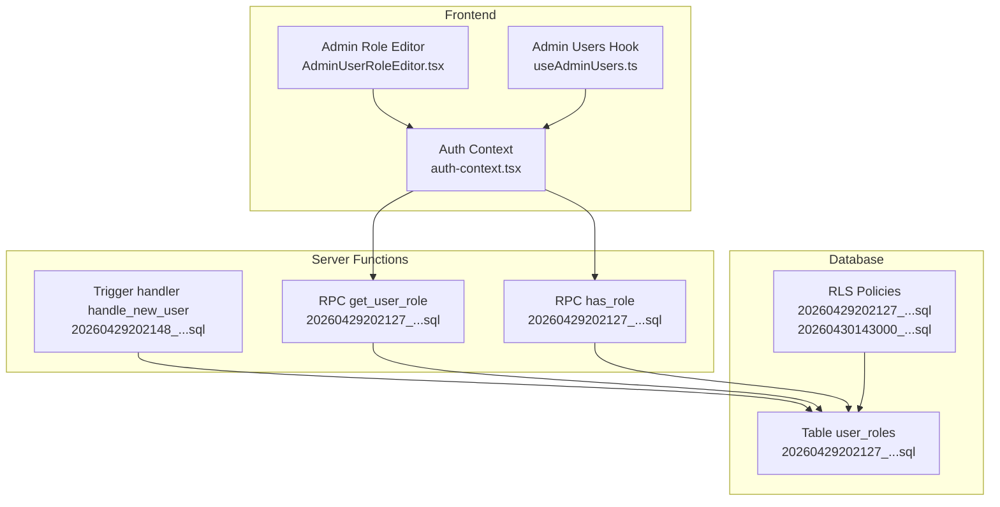
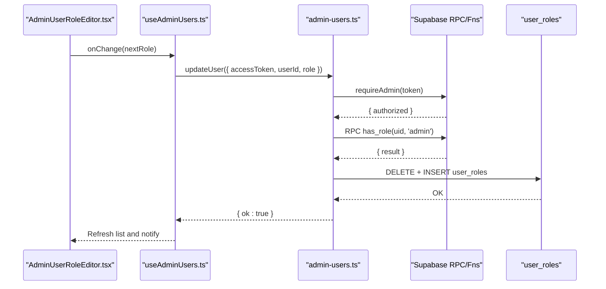
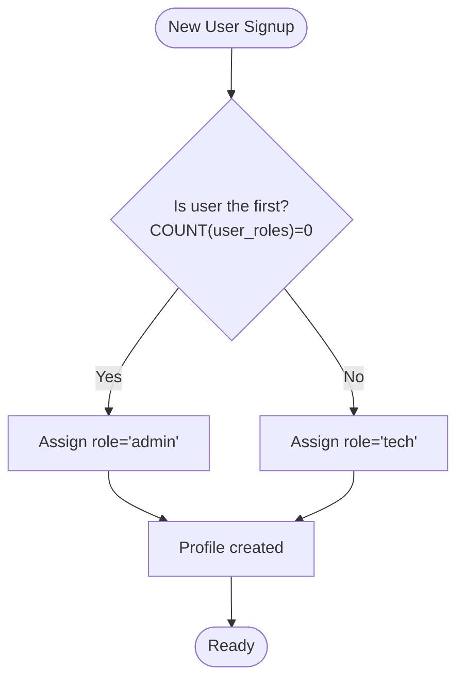
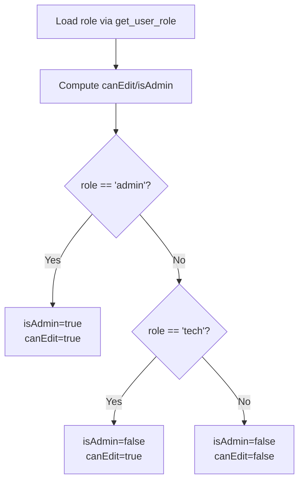
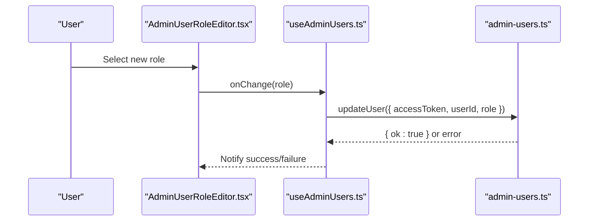
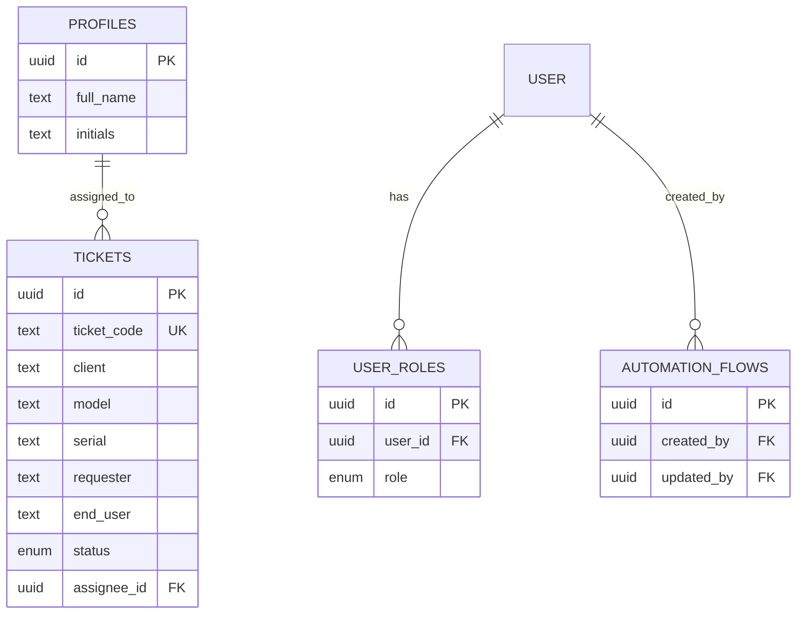
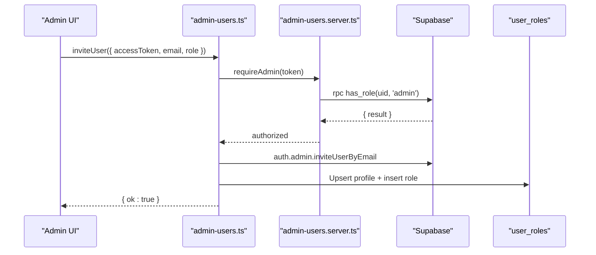
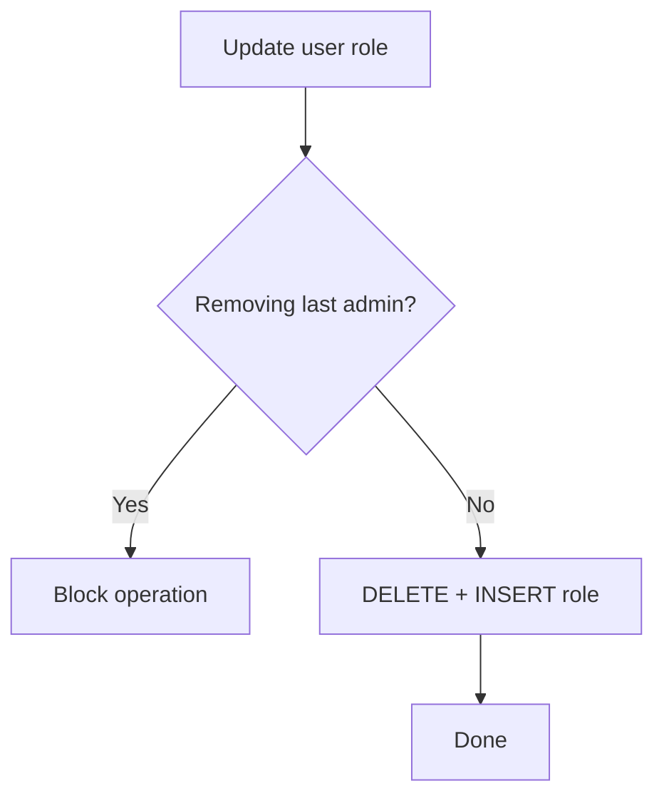
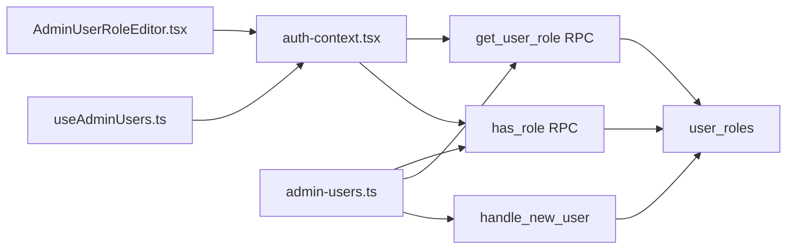

# Role Definition and Permissions

<cite>
**Referenced Files in This Document**
- [auth-context.tsx](file://src/lib/auth-context.tsx)
- [admin-users.server.ts](file://src/lib/admin-users.server.ts)
- [admin-users.ts](file://src/lib/admin-users.ts)
- [admin-users.test.ts](file://src/__tests__/lib/admin-users.test.ts)
- [AdminUserRoleEditor.tsx](file://src/components/admin/AdminUserRoleEditor.tsx)
- [AdminUsersTab.tsx](file://src/components/admin/AdminUsersTab.tsx)
- [useAdminUsers.ts](file://src/hooks/useAdminUsers.ts)
- [admin-constants.ts](file://src/lib/admin/admin-constants.ts)
- [openapi.yaml](file://public/openapi/openapi.yaml)
- [20260429202127_cd9e1421-24c9-40f3-9ac6-9e2259cbb2af.sql](file://supabase/migrations/20260429202127_cd9e1421-24c9-40f3-9ac6-9e2259cbb2af.sql)
- [20260429202148_94cb6d44-ee0c-44f3-a6fb-d5a0e028031e.sql](file://supabase/migrations/20260429202148_94cb6d44-ee0c-44f3-a6fb-d5a0e028031e.sql)
- [20260430143000_admin_user_management_rls.sql](file://supabase/migrations/20260430143000_admin_user_management_rls.sql)
- [20260504170000_add_rls_policies_automation_flows.sql](file://supabase/migrations/20260504170000_add_rls_policies_automation_flows.sql)
- [domain-model.md](file://docs/domain-model.md)
</cite>

## Table of Contents
1. [Introduction](#introduction)
2. [Project Structure](#project-structure)
3. [Core Components](#core-components)
4. [Architecture Overview](#architecture-overview)
5. [Detailed Component Analysis](#detailed-component-analysis)
6. [Dependency Analysis](#dependency-analysis)
7. [Performance Considerations](#performance-considerations)
8. [Troubleshooting Guide](#troubleshooting-guide)
9. [Conclusion](#conclusion)

## Introduction
This document explains the role definition and permission system in PCReady. It covers the three user roles (admin, tech, viewer), how permissions are derived from roles via computed properties, the AppRole type and role assignment via the get_user_role RPC, and how roles integrate with database access through Row Level Security (RLS) policies. It also outlines permission hierarchy, UI rendering patterns, and troubleshooting guidance for role-related issues.

## Project Structure
PCReady’s role system spans frontend React components and server-side Supabase functions and policies:
- Frontend: Authentication context exposes role-derived booleans canEdit and isAdmin; admin UI components render role controls and enforce admin-only actions.
- Backend: Supabase defines the app_role enum, user_roles table, helper functions has_role and get_user_role, and RLS policies governing access to resources.

**Diagram sources**
- [auth-context.tsx:13-166](file://src/lib/auth-context.tsx#L13-L166)
- [AdminUserRoleEditor.tsx:1-69](file://src/components/admin/AdminUserRoleEditor.tsx#L1-L69)
- [useAdminUsers.ts:64-212](file://src/hooks/useAdminUsers.ts#L64-L212)
- [20260429202127_cd9e1421-24c9-40f3-9ac6-9e2259cbb2af.sql:64-118](file://supabase/migrations/20260429202127_cd9e1421-24c9-40f3-9ac6-9e2259cbb2af.sql#L64-L118)
- [20260429202148_94cb6d44-ee0c-44f3-a6fb-d5a0e028031e.sql:121-148](file://supabase/migrations/20260429202148_94cb6d44-ee0c-44f3-a6fb-d5a0e028031e.sql#L121-L148)

**Section sources**
- [auth-context.tsx:13-166](file://src/lib/auth-context.tsx#L13-L166)
- [20260429202127_cd9e1421-24c9-40f3-9ac6-9e2259cbb2af.sql:64-118](file://supabase/migrations/20260429202127_cd9e1421-24c9-40f3-9ac6-9e2259cbb2af.sql#L64-L118)

## Core Components
- AppRole type: Enumerated role values used across the app.
- Auth context: Loads user profile and role, computes canEdit and isAdmin.
- Admin role editor: Renders and edits roles for users.
- Admin user management: Lists, invites, updates, disables, and deletes users; enforces admin-only operations.
- Supabase role functions and policies: Provides has_role and get_user_role RPCs and RLS policies.

Key implementation references:
- AppRole and computed properties: [auth-context.tsx:13-166](file://src/lib/auth-context.tsx#L13-L166)
- Admin role editor UI: [AdminUserRoleEditor.tsx:1-69](file://src/components/admin/AdminUserRoleEditor.tsx#L1-L69)
- Admin user management server functions: [admin-users.ts:88-279](file://src/lib/admin-users.ts#L88-L279)
- Admin-only enforcement: [admin-users.server.ts:3-17](file://src/lib/admin-users.server.ts#L3-L17)
- Role assignment on signup: [20260429202148_94cb6d44-ee0c-44f3-a6fb-d5a0e028031e.sql:121-148](file://supabase/migrations/20260429202148_94cb6d44-ee0c-44f3-a6fb-d5a0e028031e.sql#L121-L148)
- Role functions and policies: [20260429202127_cd9e1421-24c9-40f3-9ac6-9e2259cbb2af.sql:73-118](file://supabase/migrations/20260429202127_cd9e1421-24c9-40f3-9ac6-9e2259cbb2af.sql#L73-L118)

**Section sources**
- [auth-context.tsx:13-166](file://src/lib/auth-context.tsx#L13-L166)
- [AdminUserRoleEditor.tsx:1-69](file://src/components/admin/AdminUserRoleEditor.tsx#L1-L69)
- [admin-users.ts:88-279](file://src/lib/admin-users.ts#L88-L279)
- [admin-users.server.ts:3-17](file://src/lib/admin-users.server.ts#L3-L17)
- [20260429202148_94cb6d44-ee0c-44f3-a6fb-d5a0e028031e.sql:121-148](file://supabase/migrations/20260429202148_94cb6d44-ee0c-44f3-a6fb-d5a0e028031e.sql#L121-L148)
- [20260429202127_cd9e1421-24c9-40f3-9ac6-9e2259cbb2af.sql:73-118](file://supabase/migrations/20260429202127_cd9e1421-24c9-40f3-9ac6-9e2259cbb2af.sql#L73-L118)

## Architecture Overview
The role system is centered on a single source-of-truth: the user_roles table. Roles are resolved at runtime via RPCs and cached in the auth context. UI components and server functions gate access based on these roles.

**Diagram sources**
- [AdminUserRoleEditor.tsx:1-69](file://src/components/admin/AdminUserRoleEditor.tsx#L1-L69)
- [useAdminUsers.ts:77-97](file://src/hooks/useAdminUsers.ts#L77-L97)
- [admin-users.ts:137-167](file://src/lib/admin-users.ts#L137-L167)
- [admin-users.server.ts:3-17](file://src/lib/admin-users.server.ts#L3-L17)
- [20260429202127_cd9e1421-24c9-40f3-9ac6-9e2259cbb2af.sql:73-85](file://supabase/migrations/20260429202127_cd9e1421-24c9-40f3-9ac6-9e2259cbb2af.sql#L73-L85)

## Detailed Component Analysis

### AppRole Type and Role Assignment
- AppRole is defined as a union of "admin" | "tech" | "viewer".
- Role assignment occurs during user signup via the handle_new_user trigger. The first user becomes admin; subsequent users become tech by default. Roles can later be changed by admins.

**Diagram sources**
- [20260429202148_94cb6d44-ee0c-44f3-a6fb-d5a0e028031e.sql:121-148](file://supabase/migrations/20260429202148_94cb6d44-ee0c-44f3-a6fb-d5a0e028031e.sql#L121-L148)

**Section sources**
- [auth-context.tsx:13](file://src/lib/auth-context.tsx#L13)
- [20260429202148_94cb6d44-ee0c-44f3-a6fb-d5a0e028031e.sql:121-148](file://supabase/migrations/20260429202148_94cb6d44-ee0c-44f3-a6fb-d5a0e028031e.sql#L121-L148)

### Computed Properties: canEdit and isAdmin
- canEdit is true when role equals "admin" or "tech".
- isAdmin is true when role equals "admin".
- These values are derived from the user’s role loaded from the get_user_role RPC.

**Diagram sources**
- [auth-context.tsx:155-156](file://src/lib/auth-context.tsx#L155-L156)
- [20260429202127_cd9e1421-24c9-40f3-9ac6-9e2259cbb2af.sql:80-85](file://supabase/migrations/20260429202127_cd9e1421-24c9-40f3-9ac6-9e2259cbb2af.sql#L80-L85)

**Section sources**
- [auth-context.tsx:155-156](file://src/lib/auth-context.tsx#L155-L156)
- [20260429202127_cd9e1421-24c9-40f3-9ac6-9e2259cbb2af.sql:80-85](file://supabase/migrations/20260429202127_cd9e1421-24c9-40f3-9ac6-9e2259cbb2af.sql#L80-L85)

### Role-Based UI Rendering and Feature Availability
- Admin role editor renders a badge representing the current role and allows changing it when the current user is admin.
- Bulk role change UI is available in the admin users tab for admin users.
- Admin-only actions (invite, disable, delete) are gated by requireAdmin on the server.

**Diagram sources**
- [AdminUserRoleEditor.tsx:1-69](file://src/components/admin/AdminUserRoleEditor.tsx#L1-L69)
- [useAdminUsers.ts:77-97](file://src/hooks/useAdminUsers.ts#L77-L97)
- [admin-users.ts:137-167](file://src/lib/admin-users.ts#L137-L167)

**Section sources**
- [AdminUserRoleEditor.tsx:1-69](file://src/components/admin/AdminUserRoleEditor.tsx#L1-L69)
- [AdminUsersTab.tsx:151-181](file://src/components/admin/AdminUsersTab.tsx#L151-L181)
- [useAdminUsers.ts:77-97](file://src/hooks/useAdminUsers.ts#L77-L97)
- [admin-users.ts:137-167](file://src/lib/admin-users.ts#L137-L167)

### Permission Hierarchy and Access Control
- admin: Full access to admin-managed resources and operations.
- tech: Editing capabilities (create/update) for tickets and related entities; limited administrative functions.
- viewer: Read-only access.

RLS policies reflect this hierarchy:
- user_roles: Admins can read all roles and manage roles; users can read their own roles.
- profiles: Admins can read and update profiles; users can update their own profile.
- tickets: Authenticated users can read; tech/admin can insert/update; admin can delete.
- automation_flows: Owner-only insert/update/delete; select allowed broadly.

**Diagram sources**
- [20260429202127_cd9e1421-24c9-40f3-9ac6-9e2259cbb2af.sql:64-118](file://supabase/migrations/20260429202127_cd9e1421-24c9-40f3-9ac6-9e2259cbb2af.sql#L64-L118)
- [20260430143000_admin_user_management_rls.sql:5-12](file://supabase/migrations/20260430143000_admin_user_management_rls.sql#L5-L12)
- [20260504170000_add_rls_policies_automation_flows.sql:1-29](file://supabase/migrations/20260504170000_add_rls_policies_automation_flows.sql#L1-L29)

**Section sources**
- [20260429202127_cd9e1421-24c9-40f3-9ac6-9e2259cbb2af.sql:182-221](file://supabase/migrations/20260429202127_cd9e1421-24c9-40f3-9ac6-9e2259cbb2af.sql#L182-L221)
- [20260430143000_admin_user_management_rls.sql:5-12](file://supabase/migrations/20260430143000_admin_user_management_rls.sql#L5-L12)
- [20260504170000_add_rls_policies_automation_flows.sql:1-29](file://supabase/migrations/20260504170000_add_rls_policies_automation_flows.sql#L1-L29)

### Role Assignment API and Validation
- Admins can invite users with a chosen role and update existing users’ roles.
- Role values are validated against the AppRole union and enforced by server functions.
- OpenAPI schema enumerates allowed roles for admin endpoints.

**Diagram sources**
- [admin-users.ts:169-225](file://src/lib/admin-users.ts#L169-L225)
- [admin-users.server.ts:3-17](file://src/lib/admin-users.server.ts#L3-L17)
- [openapi.yaml:1121-1139](file://public/openapi/openapi.yaml#L1121-L1139)

**Section sources**
- [admin-users.ts:169-225](file://src/lib/admin-users.ts#L169-L225)
- [admin-users.server.ts:3-17](file://src/lib/admin-users.server.ts#L3-L17)
- [openapi.yaml:1121-1139](file://public/openapi/openapi.yaml#L1121-L1139)

### Role Inheritance Patterns and Escalation Scenarios
- There is no explicit role inheritance in the schema. Roles are stored independently in user_roles.
- Escalation is controlled by requireAdmin checks on the server and has_role RPC usage in RLS policies.
- The system prevents removal of the last admin by asserting admin count before role changes.

**Diagram sources**
- [admin-users.ts:69-86](file://src/lib/admin-users.ts#L69-L86)
- [20260429202127_cd9e1421-24c9-40f3-9ac6-9e2259cbb2af.sql:109-118](file://supabase/migrations/20260429202127_cd9e1421-24c9-40f3-9ac6-9e2259cbb2af.sql#L109-L118)

**Section sources**
- [admin-users.ts:69-86](file://src/lib/admin-users.ts#L69-L86)
- [20260429202127_cd9e1421-24c9-40f3-9ac6-9e2259cbb2af.sql:109-118](file://supabase/migrations/20260429202127_cd9e1421-24c9-40f3-9ac6-9e2259cbb2af.sql#L109-L118)

## Dependency Analysis
- Frontend depends on Supabase RPCs to resolve roles and on server functions for admin-only operations.
- Server functions depend on Supabase auth and role functions to enforce permissions.
- Database policies depend on has_role to enforce access.

**Diagram sources**
- [auth-context.tsx:13-166](file://src/lib/auth-context.tsx#L13-L166)
- [AdminUserRoleEditor.tsx:1-69](file://src/components/admin/AdminUserRoleEditor.tsx#L1-L69)
- [useAdminUsers.ts:64-212](file://src/hooks/useAdminUsers.ts#L64-L212)
- [admin-users.ts:88-279](file://src/lib/admin-users.ts#L88-L279)
- [20260429202127_cd9e1421-24c9-40f3-9ac6-9e2259cbb2af.sql:73-85](file://supabase/migrations/20260429202127_cd9e1421-24c9-40f3-9ac6-9e2259cbb2af.sql#L73-L85)
- [20260429202148_94cb6d44-ee0c-44f3-a6fb-d5a0e028031e.sql:121-148](file://supabase/migrations/20260429202148_94cb6d44-ee0c-44f3-a6fb-d5a0e028031e.sql#L121-L148)

**Section sources**
- [auth-context.tsx:13-166](file://src/lib/auth-context.tsx#L13-L166)
- [admin-users.ts:88-279](file://src/lib/admin-users.ts#L88-L279)
- [20260429202127_cd9e1421-24c9-40f3-9ac6-9e2259cbb2af.sql:73-85](file://supabase/migrations/20260429202127_cd9e1421-24c9-40f3-9ac6-9e2259cbb2af.sql#L73-L85)
- [20260429202148_94cb6d44-ee0c-44f3-a6fb-d5a0e028031e.sql:121-148](file://supabase/migrations/20260429202148_94cb6d44-ee0c-44f3-a6fb-d5a0e028031e.sql#L121-L148)

## Performance Considerations
- Role resolution uses a single RPC call per session load; caching in the auth context avoids redundant network calls.
- Admin bulk operations use Promise.allSettled to parallelize requests while maintaining UX feedback.
- RLS policies are evaluated server-side; ensure indexes and minimal SELECT fan-out for tables with heavy RLS checks.

## Troubleshooting Guide
Common issues and resolutions:
- Role not updating after admin action
  - Verify requireAdmin succeeds and has_role returns true for the acting user.
  - Confirm user_roles DELETE + INSERT succeeded and UI reloads the list.
  - References: [admin-users.server.ts:3-17](file://src/lib/admin-users.server.ts#L3-L17), [admin-users.ts:154-167](file://src/lib/admin-users.ts#L154-L167)
- Last admin removed unintentionally
  - The system blocks removing the last admin; ensure at least one admin remains.
  - Reference: [admin-users.ts:69-86](file://src/lib/admin-users.ts#L69-L86)
- Viewer sees no edit controls
  - canEdit is false for viewers; this is expected behavior.
  - Reference: [auth-context.tsx:155-156](file://src/lib/auth-context.tsx#L155-L156)
- Admin cannot manage roles
  - Ensure the acting user has role admin via has_role RPC.
  - Reference: [20260429202127_cd9e1421-24c9-40f3-9ac6-9e2259cbb2af.sql:109-118](file://supabase/migrations/20260429202127_cd9e1421-24c9-40f3-9ac6-9e2259cbb2af.sql#L109-L118)
- Role mismatch in UI vs backend
  - Confirm get_user_role RPC returns the expected role and auth context caches it.
  - Reference: [auth-context.tsx:69](file://src/lib/auth-context.tsx#L69), [20260429202127_cd9e1421-24c9-40f3-9ac6-9e2259cbb2af.sql:80-85](file://supabase/migrations/20260429202127_cd9e1421-24c9-40f3-9ac6-9e2259cbb2af.sql#L80-L85)

**Section sources**
- [admin-users.server.ts:3-17](file://src/lib/admin-users.server.ts#L3-L17)
- [admin-users.ts:69-86](file://src/lib/admin-users.ts#L69-L86)
- [auth-context.tsx:69](file://src/lib/auth-context.tsx#L69)
- [20260429202127_cd9e1421-24c9-40f3-9ac6-9e2259cbb2af.sql:80-85](file://supabase/migrations/20260429202127_cd9e1421-24c9-40f3-9ac6-9e2259cbb2af.sql#L80-L85)
- [20260429202127_cd9e1421-24c9-40f3-9ac6-9e2259cbb2af.sql:109-118](file://supabase/migrations/20260429202127_cd9e1421-24c9-40f3-9ac6-9e2259cbb2af.sql#L109-L118)

## Conclusion
PCReady’s role system centers on a simple, robust model: roles are stored in user_roles, resolved via RPCs, and enforced by RLS policies. Admins have broad control, tech users can edit, and viewers have read-only access. The system prevents escalation pitfalls like removing the last admin and provides clear UI signals for role-aware features.