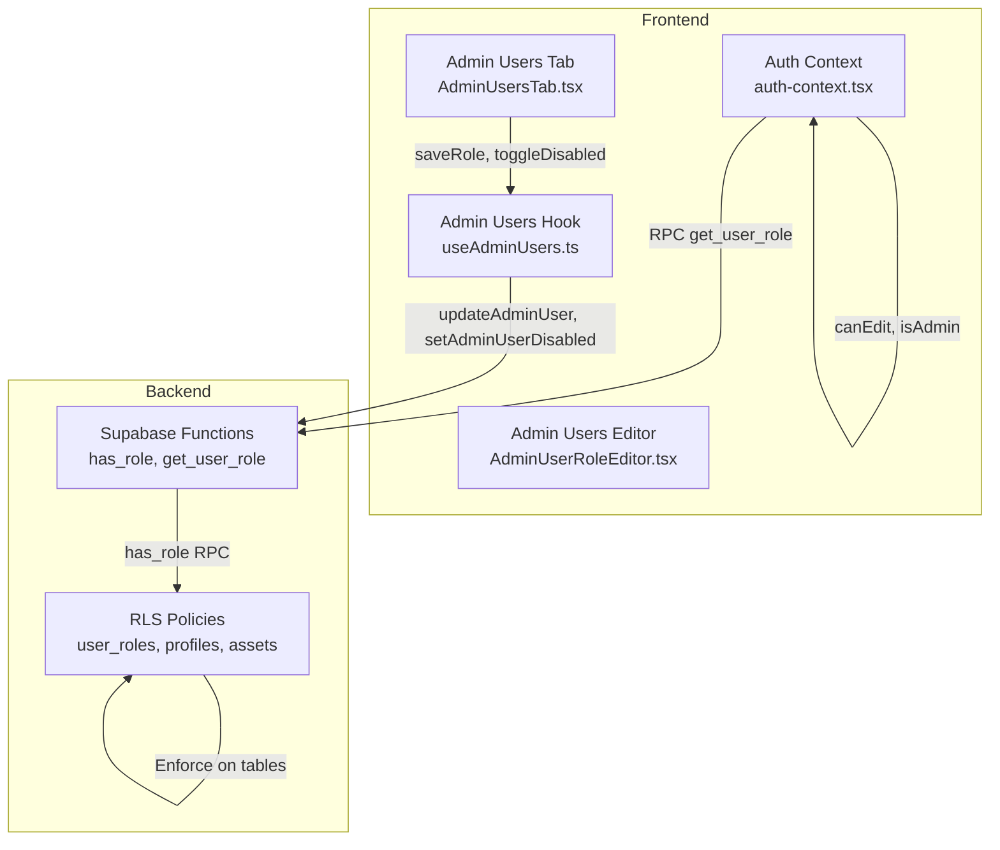
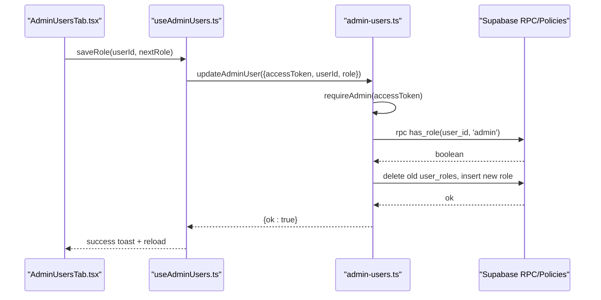
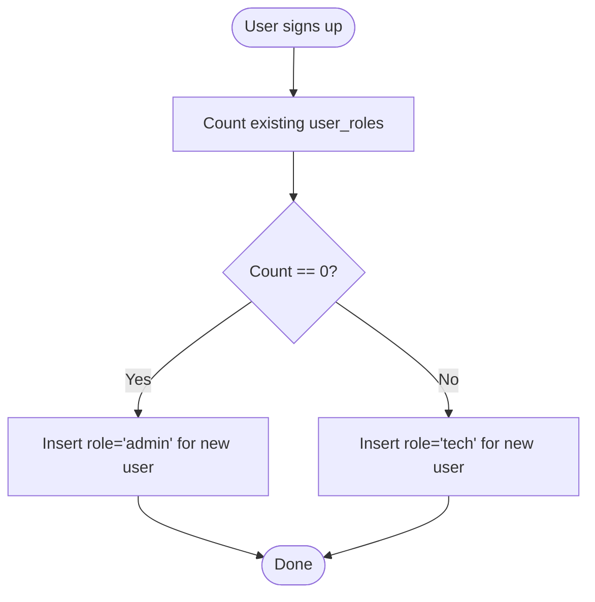
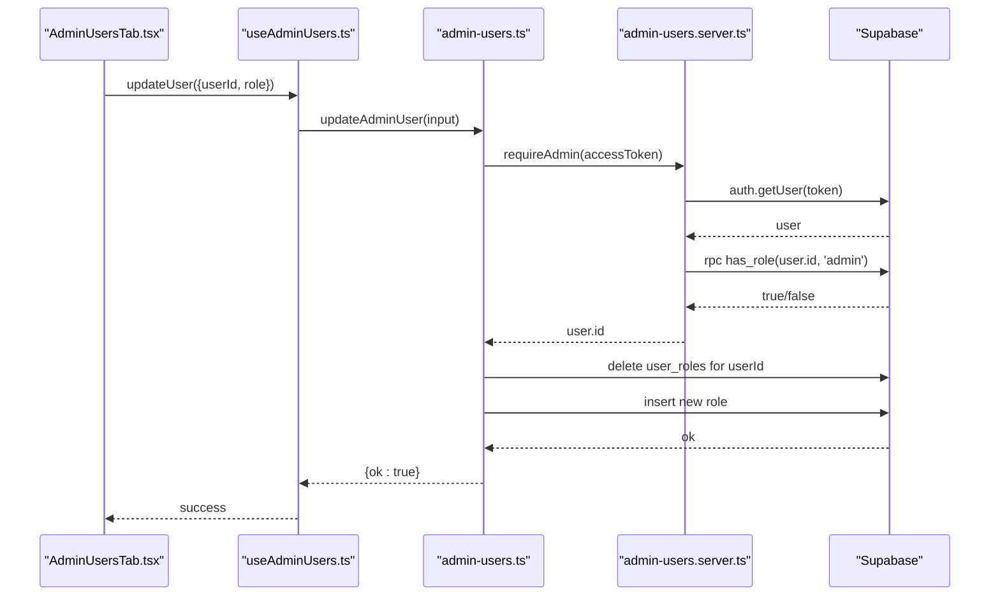
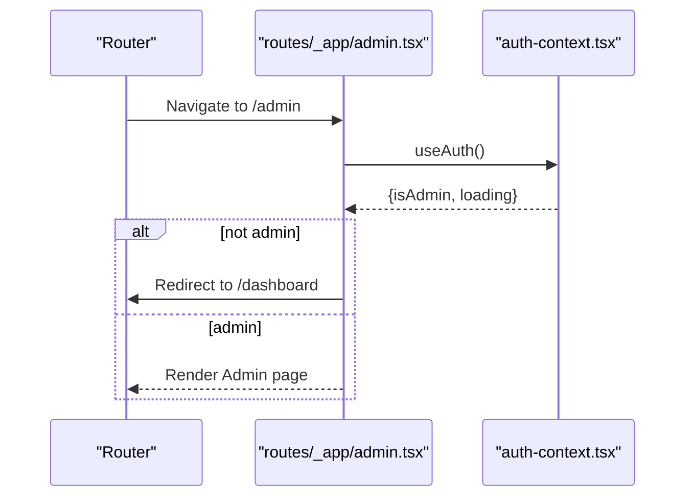
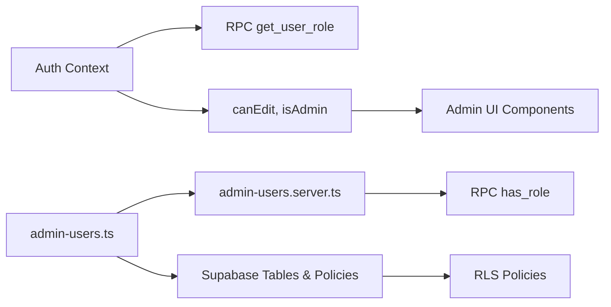

# Role-Based Access Control

<cite>
**Referenced Files in This Document**
- [auth-context.tsx](file://src/lib/auth-context.tsx)
- [admin-users.ts](file://src/lib/admin-users.ts)
- [admin-users.server.ts](file://src/lib/admin-users.server.ts)
- [AdminUsersTab.tsx](file://src/components/admin/AdminUsersTab.tsx)
- [AdminUserRoleEditor.tsx](file://src/components/admin/AdminUserRoleEditor.tsx)
- [useAdminUsers.ts](file://src/hooks/useAdminUsers.ts)
- [admin-constants.ts](file://src/lib/admin/admin-constants.ts)
- [20260429202127_cd9e1421-24c9-40f3-9ac6-9e2259cbb2af.sql](file://supabase/migrations/20260429202127_cd9e1421-24c9-40f3-9ac6-9e2259cbb2af.sql)
- [20260430143000_admin_user_management_rls.sql](file://supabase/migrations/20260430143000_admin_user_management_rls.sql)
- [20260430170000_split_assets_clients_tickets.sql](file://supabase/migrations/20260430170000_split_assets_clients_tickets.sql)
- [20260429202148_94cb6d44-ee0c-44f3-a6fb-d5a0e028031e.sql](file://supabase/migrations/20260429202148_94cb6d44-ee0c-44f3-a6fb-d5a0e028031e.sql)
- [openapi.yaml](file://public/openapi/openapi.yaml)
- [admin.tsx](file://src/routes/_app/admin.tsx)
</cite>

## Table of Contents

1. [Introduction](#introduction)
2. [Project Structure](#project-structure)
3. [Core Components](#core-components)
4. [Architecture Overview](#architecture-overview)
5. [Detailed Component Analysis](#detailed-component-analysis)
6. [Dependency Analysis](#dependency-analysis)
7. [Performance Considerations](#performance-considerations)
8. [Troubleshooting Guide](#troubleshooting-guide)
9. [Conclusion](#conclusion)

## Introduction

This document explains the role-based access control (RBAC) system in PCReady. It covers the three user roles (admin, tech, viewer), how roles are determined and enforced, how administrators manage users and roles, and how roles integrate with route protection and component-level access control. It also details the relationship between roles and database Row Level Security (RLS) policies, permission escalation safeguards, and troubleshooting guidance.

## Project Structure

PCReady’s RBAC spans frontend React components and hooks, backend Supabase database functions and policies, and server-side validation utilities. Key areas:

- Frontend authentication context and UI components for role-aware rendering
- Admin user management server functions and client hooks
- Supabase database functions and RLS policies for enforcing roles
- Route protection using the authentication context

**Diagram sources**

- [auth-context.tsx:69-86](file://src/lib/auth-context.tsx#L69-L86)
- [admin-users.ts:137-167](file://src/lib/admin-users.ts#L137-L167)
- [20260429202127_cd9e1421-24c9-40f3-9ac6-9e2259cbb2af.sql:73-85](file://supabase/migrations/20260429202127_cd9e1421-24c9-40f3-9ac6-9e2259cbb2af.sql#L73-L85)
- [20260430143000_admin_user_management_rls.sql:5-12](file://supabase/migrations/20260430143000_admin_user_management_rls.sql#L5-L12)

**Section sources**

- [auth-context.tsx:1-173](file://src/lib/auth-context.tsx#L1-L173)
- [admin-users.ts:1-279](file://src/lib/admin-users.ts#L1-L279)
- [20260429202127_cd9e1421-24c9-40f3-9ac6-9e2259cbb2af.sql:64-118](file://supabase/migrations/20260429202127_cd9e1421-24c9-40f3-9ac6-9e2259cbb2af.sql#L64-L118)

## Core Components

- Authentication context: Loads user profile, determines role via database RPC, exposes canEdit and isAdmin flags for UI decisions.
- Admin user management: Server functions to list, update, invite, disable, and delete users; includes admin-only protections and anti-escalation logic.
- Database functions and policies: has_role and get_user_role enforce role checks; RLS policies restrict access to resources by role.
- UI components: Role editor and admin tab provide role assignment and status management with role-aware controls.

**Section sources**

- [auth-context.tsx:13-35](file://src/lib/auth-context.tsx#L13-L35)
- [auth-context.tsx:148-166](file://src/lib/auth-context.tsx#L148-L166)
- [admin-users.ts:88-135](file://src/lib/admin-users.ts#L88-L135)
- [admin-users.server.ts:3-17](file://src/lib/admin-users.server.ts#L3-L17)
- [20260429202127_cd9e1421-24c9-40f3-9ac6-9e2259cbb2af.sql:73-85](file://supabase/migrations/20260429202127_cd9e1421-24c9-40f3-9ac6-9e2259cbb2af.sql#L73-L85)

## Architecture Overview

The RBAC architecture combines client-side role flags with server-side enforcement:

- Frontend: AuthProvider loads profile and role using get_user_role RPC; exposes canEdit and isAdmin for UI.
- Backend: has_role RPC and RLS policies enforce access to data and administrative actions.
- Admin management: Server functions validate admin privileges and prevent role escalation (e.g., removing the last admin).

**Diagram sources**

- [AdminUsersTab.tsx:348-352](file://src/components/admin/AdminUsersTab.tsx#L348-L352)
- [useAdminUsers.ts:77-97](file://src/hooks/useAdminUsers.ts#L77-L97)
- [admin-users.ts:137-167](file://src/lib/admin-users.ts#L137-L167)
- [admin-users.server.ts:3-17](file://src/lib/admin-users.server.ts#L3-L17)

## Detailed Component Analysis

### Roles and Permissions

- Roles: admin, tech, viewer
- canEdit: true for admin and tech
- isAdmin: true only for admin
- Viewer has read-only access; tech can edit; admin can manage users and data.

**Section sources**

- [auth-context.tsx:13-22](file://src/lib/auth-context.tsx#L13-L22)
- [auth-context.tsx:155-156](file://src/lib/auth-context.tsx#L155-L156)
- [admin-constants.ts:3-22](file://src/lib/admin/admin-constants.ts#L3-L22)

### Role Assignment Mechanism

- Database functions:
  - has_role(user_id, role): checks if a user has a given role
  - get_user_role(user_id): returns the user’s single active role
- Frontend role determination:
  - AuthProvider calls get_user_role RPC and sets profile.role
- Default role creation:
  - First user created becomes admin; others become tech automatically

**Diagram sources**

- [20260429202148_94cb6d44-ee0c-44f3-a6fb-d5a0e028031e.sql:121-124](file://supabase/migrations/20260429202148_94cb6d44-ee0c-44f3-a6fb-d5a0e028031e.sql#L121-L124)

**Section sources**

- [20260429202127_cd9e1421-24c9-40f3-9ac6-9e2259cbb2af.sql:73-85](file://supabase/migrations/20260429202127_cd9e1421-24c9-40f3-9ac6-9e2259cbb2af.sql#L73-L85)
- [auth-context.tsx:69-86](file://src/lib/auth-context.tsx#L69-L86)

### Permission Checking Utilities (Auth Context)

- canEdit: derived from profile.role
- isAdmin: derived from profile.role
- These flags drive conditional rendering and component-level access control.

**Section sources**

- [auth-context.tsx:148-166](file://src/lib/auth-context.tsx#L148-L166)

### Admin User Management

- Listing users: fetches auth users, profiles, and roles; computes status from auth and ban state
- Updating roles: validates role, enforces anti-escalation rules, updates profiles and user_roles
- Inviting users: creates invitation, upserts profile and default role
- Disabling/removing users: prevents self-action and last-admin removal

**Diagram sources**

- [AdminUsersTab.tsx:348-352](file://src/components/admin/AdminUsersTab.tsx#L348-L352)
- [useAdminUsers.ts:77-97](file://src/hooks/useAdminUsers.ts#L77-L97)
- [admin-users.ts:137-167](file://src/lib/admin-users.ts#L137-L167)
- [admin-users.server.ts:3-17](file://src/lib/admin-users.server.ts#L3-L17)

**Section sources**

- [admin-users.ts:88-135](file://src/lib/admin-users.ts#L88-L135)
- [admin-users.ts:137-167](file://src/lib/admin-users.ts#L137-L167)
- [admin-users.ts:169-225](file://src/lib/admin-users.ts#L169-L225)
- [admin-users.ts:250-278](file://src/lib/admin-users.ts#L250-L278)
- [admin-users.server.ts:3-17](file://src/lib/admin-users.server.ts#L3-L17)

### Role-Aware UI Components

- AdminUserRoleEditor: displays current role and allows admin to change it
- AdminUsersTab: renders role selector, status badges, and action buttons based on canEdit/isAdmin

**Section sources**

- [AdminUserRoleEditor.tsx:1-70](file://src/components/admin/AdminUserRoleEditor.tsx#L1-L70)
- [AdminUsersTab.tsx:348-352](file://src/components/admin/AdminUsersTab.tsx#L348-L352)
- [AdminUsersTab.tsx:102-110](file://src/components/admin/AdminUsersTab.tsx#L102-L110)

### Route Protection and Component-Level Access Control

- Route protection: Admin route checks isAdmin and redirects non-admins
- Component-level access: useAuth() flags inform visibility and interactivity of controls

**Diagram sources**

- [admin.tsx:24-29](file://src/routes/_app/admin.tsx#L24-L29)
- [auth-context.tsx:168-172](file://src/lib/auth-context.tsx#L168-L172)

**Section sources**

- [admin.tsx:24-29](file://src/routes/_app/admin.tsx#L24-L29)

### Role-Based Navigation Patterns

- Admin-only routes: protected by checking isAdmin
- Conditional rendering: buttons and forms rendered only when canEdit/isAdmin is true
- Bulk actions: enabled only for admins; viewer cannot trigger role changes

**Section sources**

- [AdminUsersTab.tsx:150-198](file://src/components/admin/AdminUsersTab.tsx#L150-L198)
- [AdminUsersTab.tsx:372-398](file://src/components/admin/AdminUsersTab.tsx#L372-L398)

### Relationship Between Roles and Database Access (RLS)

- has_role RPC and get_user_role determine frontend role
- RLS policies restrict reads/writes based on has_role checks
- Examples:
  - Clients, devices, client_contacts: tech/admin can insert/update/delete; admin-only deletes
  - Profiles: admins can read/update
  - user_roles: admins can manage roles; users can read own roles

**Section sources**

- [20260430170000_split_assets_clients_tickets.sql:57-79](file://supabase/migrations/20260430170000_split_assets_clients_tickets.sql#L57-L79)
- [20260430143000_admin_user_management_rls.sql:5-12](file://supabase/migrations/20260430143000_admin_user_management_rls.sql#L5-L12)
- [20260429202127_cd9e1421-24c9-40f3-9ac6-9e2259cbb2af.sql:108-118](file://supabase/migrations/20260429202127_cd9e1421-24c9-40f3-9ac6-9e2259cbb2af.sql#L108-L118)

### Role Inheritance and Permission Escalation Safeguards

- Role inheritance: none; each user has one effective role per get_user_role
- Escalation safeguards:
  - Anti-removal of last admin: assertCanRemoveAdmin prevents removing sole admin
  - Self-action prevention: cannot disable or delete yourself
  - requireAdmin middleware ensures only admins can manage users

**Section sources**

- [admin-users.ts:69-86](file://src/lib/admin-users.ts#L69-L86)
- [admin-users.ts:250-278](file://src/lib/admin-users.ts#L250-L278)
- [admin-users.server.ts:3-17](file://src/lib/admin-users.server.ts#L3-L17)

## Dependency Analysis

- AuthProvider depends on:
  - Supabase RPC get_user_role
  - Supabase tables: profiles, user_profiles, user_roles
- Admin user management depends on:
  - Supabase RPC has_role
  - Supabase auth.admin APIs for invites and bans
  - Anti-escalation logic to protect admin role integrity
- RLS policies depend on:
  - has_role function for role checks
  - Supabase auth.uid() for session identity

**Diagram sources**

- [auth-context.tsx:69-86](file://src/lib/auth-context.tsx#L69-L86)
- [admin-users.ts:137-167](file://src/lib/admin-users.ts#L137-L167)
- [admin-users.server.ts:3-17](file://src/lib/admin-users.server.ts#L3-L17)
- [20260429202127_cd9e1421-24c9-40f3-9ac6-9e2259cbb2af.sql:73-85](file://supabase/migrations/20260429202127_cd9e1421-24c9-40f3-9ac6-9e2259cbb2af.sql#L73-L85)

**Section sources**

- [auth-context.tsx:148-166](file://src/lib/auth-context.tsx#L148-L166)
- [admin-users.ts:137-167](file://src/lib/admin-users.ts#L137-L167)
- [admin-users.server.ts:3-17](file://src/lib/admin-users.server.ts#L3-L17)

## Performance Considerations

- Role resolution: get_user_role is cached per session; avoid redundant calls by using the provided context flags canEdit and isAdmin
- Bulk operations: use batched server calls for role/status updates to minimize network overhead
- RLS overhead: keep filters selective; avoid broad scans on large datasets

## Troubleshooting Guide

Common issues and resolutions:

- Access denied when managing users:
  - Verify the caller has admin role via requireAdmin; check has_role RPC response
- Cannot remove last admin:
  - assertCanRemoveAdmin prevents removal if count <= 1; ensure another admin exists
- Self-disable/self-delete attempts:
  - Enforced by server functions; ensure current user ID differs from target
- Role not updating:
  - Confirm updateAdminUser succeeded and UI reloaded; verify user_roles insert/delete completed
- RLS denies access:
  - Ensure has_role returns true for the relevant role; verify RLS policies on target tables

**Section sources**

- [admin-users.server.ts:3-17](file://src/lib/admin-users.server.ts#L3-L17)
- [admin-users.ts:69-86](file://src/lib/admin-users.ts#L69-L86)
- [admin-users.ts:250-278](file://src/lib/admin-users.ts#L250-L278)
- [20260430170000_split_assets_clients_tickets.sql:57-79](file://supabase/migrations/20260430170000_split_assets_clients_tickets.sql#L57-L79)

## Conclusion

PCReady’s RBAC combines a simple role model (admin, tech, viewer) with robust enforcement at the database level and secure admin management on the frontend. The system prevents escalation, protects the last admin, and exposes clear permission flags for UI decisions. Administrators can manage roles and user status safely, while RLS policies ensure consistent access control across data tables.
