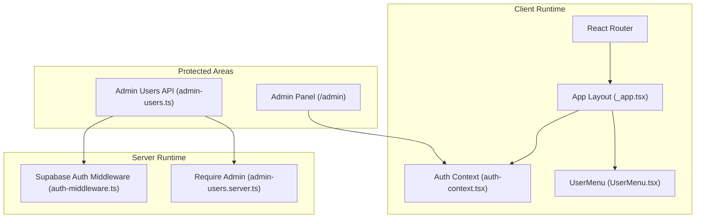
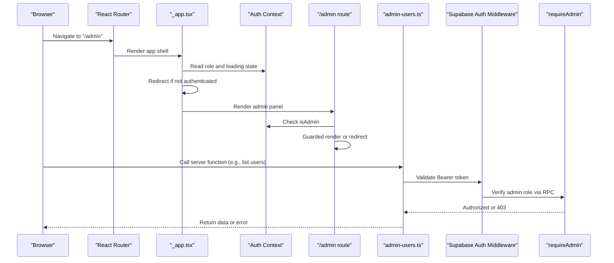
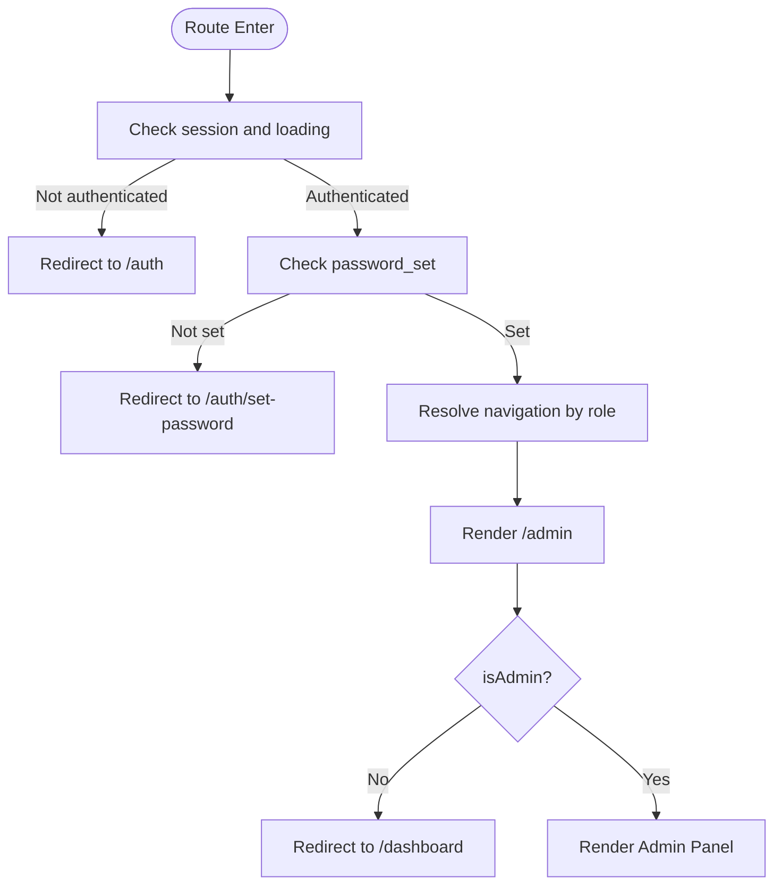
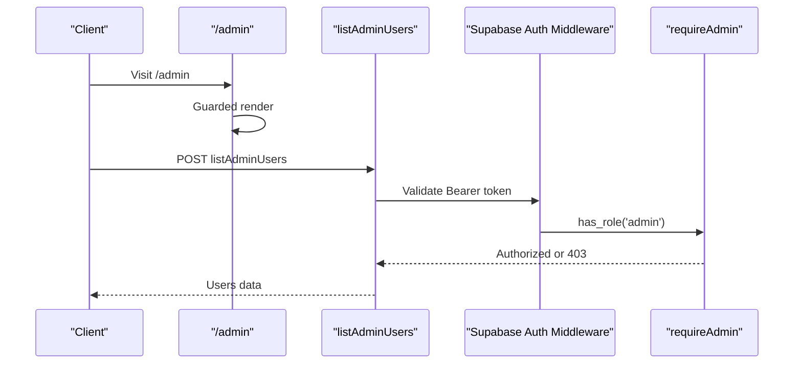
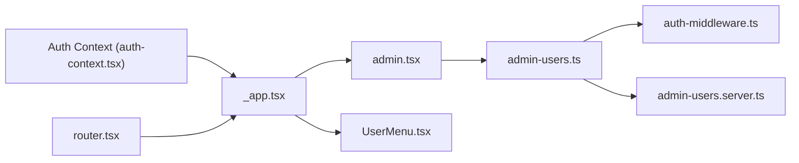

# Route Protection and Access Control

<cite>
**Referenced Files in This Document**
- [auth-context.tsx](file://src/lib/auth-context.tsx)
- [auth-middleware.ts](file://src/integrations/supabase/auth-middleware.ts)
- [admin-users.server.ts](file://src/lib/admin-users.server.ts)
- [admin-users.ts](file://src/lib/admin-users.ts)
- [_app.tsx](file://src/routes/_app.tsx)
- [admin.tsx](file://src/routes/_app/admin.tsx)
- [index.tsx](file://src/routes/index.tsx)
- [auth.tsx](file://src/routes/auth.tsx)
- [oauth-scopes.ts](file://src/lib/oauth-scopes.ts)
- [UserMenu.tsx](file://src/components/layout/UserMenu.tsx)
- [RouteHelpers.tsx](file://src/components/RouteHelpers.tsx)
- [router.tsx](file://src/router.tsx)
</cite>

## Table of Contents
1. [Introduction](#introduction)
2. [Project Structure](#project-structure)
3. [Core Components](#core-components)
4. [Architecture Overview](#architecture-overview)
5. [Detailed Component Analysis](#detailed-component-analysis)
6. [Dependency Analysis](#dependency-analysis)
7. [Performance Considerations](#performance-considerations)
8. [Troubleshooting Guide](#troubleshooting-guide)
9. [Conclusion](#conclusion)

## Introduction
This document explains how PCReady enforces route protection and access control across the application. It covers the authentication state lifecycle, the useAuth hook, role-based navigation, and route-level guards. It also details how server-side middleware validates tokens for protected APIs and how admin-sensitive areas are guarded both on the client and server. Guidance is included for implementing protected routes, role-based navigation patterns, and troubleshooting access control issues.

## Project Structure
PCReady organizes access control around three pillars:
- Authentication state and user roles managed by a React context provider
- Client-side route guards and role-aware navigation
- Server-side middleware and RPC-based role checks for protected endpoints



**Diagram sources**
- [_app.tsx:172-337](file://src/routes/_app.tsx#L172-L337)
- [auth-context.tsx:43-166](file://src/lib/auth-context.tsx#L43-L166)
- [UserMenu.tsx:20-69](file://src/components/layout/UserMenu.tsx#L20-L69)
- [admin.tsx:23-49](file://src/routes/_app/admin.tsx#L23-L49)
- [admin-users.ts:88-135](file://src/lib/admin-users.ts#L88-L135)
- [auth-middleware.ts:7-73](file://src/integrations/supabase/auth-middleware.ts#L7-L73)
- [admin-users.server.ts:3-17](file://src/lib/admin-users.server.ts#L3-L17)

**Section sources**
- [_app.tsx:172-337](file://src/routes/_app.tsx#L172-L337)
- [auth-context.tsx:43-166](file://src/lib/auth-context.tsx#L43-L166)
- [admin.tsx:23-49](file://src/routes/_app/admin.tsx#L23-L49)
- [admin-users.ts:88-135](file://src/lib/admin-users.ts#L88-L135)
- [auth-middleware.ts:7-73](file://src/integrations/supabase/auth-middleware.ts#L7-L73)
- [admin-users.server.ts:3-17](file://src/lib/admin-users.server.ts#L3-L17)

## Core Components
- Auth context and useAuth hook: centralizes session, user, profile, and role-derived capabilities (isAdmin, canEdit). Provides refreshProfile and signOut.
- Client-side route guards: enforce role-based access in route components and navigation groups.
- Server-side middleware: validates bearer tokens and injects user context for protected server functions.
- Admin server functions: require admin via RPC checks before allowing sensitive operations.

**Section sources**
- [auth-context.tsx:13-35](file://src/lib/auth-context.tsx#L13-L35)
- [auth-context.tsx:148-163](file://src/lib/auth-context.tsx#L148-L163)
- [_app.tsx:125-148](file://src/routes/_app.tsx#L125-L148)
- [admin.tsx:23-49](file://src/routes/_app/admin.tsx#L23-L49)
- [auth-middleware.ts:7-73](file://src/integrations/supabase/auth-middleware.ts#L7-L73)
- [admin-users.server.ts:3-17](file://src/lib/admin-users.server.ts#L3-L17)

## Architecture Overview
The access control architecture combines client-side and server-side enforcement:



**Diagram sources**
- [_app.tsx:184-186](file://src/routes/_app.tsx#L184-L186)
- [_app.tsx:217-233](file://src/routes/_app.tsx#L217-L233)
- [admin.tsx:23-49](file://src/routes/_app/admin.tsx#L23-L49)
- [admin-users.ts:88-135](file://src/lib/admin-users.ts#L88-L135)
- [auth-middleware.ts:7-73](file://src/integrations/supabase/auth-middleware.ts#L7-L73)
- [admin-users.server.ts:3-17](file://src/lib/admin-users.server.ts#L3-L17)

## Detailed Component Analysis

### Authentication State and useAuth Hook
- Role types and profile shape define capabilities such as isAdmin and canEdit.
- Profile loading aggregates data from multiple Supabase tables and computes role via a stored procedure.
- The hook exposes refreshProfile and signOut to keep state consistent after external changes.

```mermaid
classDiagram
class AuthCtx {
+Session session
+User user
+AuthProfile profile
+boolean loading
+boolean profileLoading
+string authError
+boolean canEdit
+boolean isAdmin
+refreshProfile() Promise<void>
+signOut() Promise<void>
}
class AuthProfile {
+string id
+string full_name
+string initials
+string avatar_url
+boolean password_set
+AppRole role
}
class AppRole {
<<enum>>
"admin"
"tech"
"viewer"
}
AuthCtx --> AuthProfile : "owns"
AuthProfile --> AppRole : "role"
```

**Diagram sources**
- [auth-context.tsx:13-35](file://src/lib/auth-context.tsx#L13-L35)
- [auth-context.tsx:52-94](file://src/lib/auth-context.tsx#L52-L94)
- [auth-context.tsx:148-163](file://src/lib/auth-context.tsx#L148-L163)

**Section sources**
- [auth-context.tsx:13-35](file://src/lib/auth-context.tsx#L13-L35)
- [auth-context.tsx:52-94](file://src/lib/auth-context.tsx#L52-L94)
- [auth-context.tsx:148-163](file://src/lib/auth-context.tsx#L148-L163)

### Client-Side Route Guards and Role-Based Navigation
- Root guard redirects unauthenticated users to the login route.
- App layout enforces authentication and password-set requirements before rendering the main UI.
- Navigation groups filter visible links by required roles and device visibility.
- The admin route enforces admin-only access and redirects non-admins to the dashboard.



**Diagram sources**
- [index.tsx:11-23](file://src/routes/index.tsx#L11-L23)
- [_app.tsx:184-186](file://src/routes/_app.tsx#L184-L186)
- [_app.tsx:217-233](file://src/routes/_app.tsx#L217-L233)
- [_app.tsx:125-148](file://src/routes/_app.tsx#L125-L148)
- [admin.tsx:23-49](file://src/routes/_app/admin.tsx#L23-L49)

**Section sources**
- [index.tsx:11-23](file://src/routes/index.tsx#L11-L23)
- [_app.tsx:184-186](file://src/routes/_app.tsx#L184-L186)
- [_app.tsx:217-233](file://src/routes/_app.tsx#L217-L233)
- [_app.tsx:125-148](file://src/routes/_app.tsx#L125-L148)
- [admin.tsx:23-49](file://src/routes/_app/admin.tsx#L23-L49)

### Protected Admin Panel and User Management
- The admin route uses useAuth.isAdmin to guard rendering and redirects unauthorized users.
- Admin user management functions are server functions that require admin privileges via a stored RPC check.
- The server middleware validates Bearer tokens for requests to admin endpoints.



**Diagram sources**
- [admin.tsx:23-49](file://src/routes/_app/admin.tsx#L23-L49)
- [admin-users.ts:88-135](file://src/lib/admin-users.ts#L88-L135)
- [auth-middleware.ts:7-73](file://src/integrations/supabase/auth-middleware.ts#L7-L73)
- [admin-users.server.ts:3-17](file://src/lib/admin-users.server.ts#L3-L17)

**Section sources**
- [admin.tsx:23-49](file://src/routes/_app/admin.tsx#L23-L49)
- [admin-users.ts:88-135](file://src/lib/admin-users.ts#L88-L135)
- [auth-middleware.ts:7-73](file://src/integrations/supabase/auth-middleware.ts#L7-L73)
- [admin-users.server.ts:3-17](file://src/lib/admin-users.server.ts#L3-L17)

### Conditional Rendering Based on Roles
- Navigation items declare required roles; the resolver filters out items for users who do not meet the criteria.
- The admin route conditionally renders content only when the user is an admin.
- The UserMenu component displays role-specific labels and actions.

**Section sources**
- [_app.tsx:125-148](file://src/routes/_app.tsx#L125-L148)
- [UserMenu.tsx:20-69](file://src/components/layout/UserMenu.tsx#L20-L69)

### OAuth Scopes and Permissions
- OAuth scopes define granular permissions exposed to third-party applications.
- These scopes inform consent screens and guide integration behavior, complementing route-level access control.

**Section sources**
- [oauth-scopes.ts:1-65](file://src/lib/oauth-scopes.ts#L1-L65)

## Dependency Analysis
Access control depends on coordinated behavior across client and server:



**Diagram sources**
- [auth-context.tsx:43-166](file://src/lib/auth-context.tsx#L43-L166)
- [_app.tsx:172-337](file://src/routes/_app.tsx#L172-L337)
- [admin.tsx:23-49](file://src/routes/_app/admin.tsx#L23-L49)
- [admin-users.ts:88-135](file://src/lib/admin-users.ts#L88-L135)
- [auth-middleware.ts:7-73](file://src/integrations/supabase/auth-middleware.ts#L7-L73)
- [admin-users.server.ts:3-17](file://src/lib/admin-users.server.ts#L3-L17)
- [UserMenu.tsx:20-69](file://src/components/layout/UserMenu.tsx#L20-L69)
- [router.tsx:5-15](file://src/router.tsx#L5-L15)

**Section sources**
- [auth-context.tsx:43-166](file://src/lib/auth-context.tsx#L43-L166)
- [_app.tsx:172-337](file://src/routes/_app.tsx#L172-L337)
- [admin.tsx:23-49](file://src/routes/_app/admin.tsx#L23-L49)
- [admin-users.ts:88-135](file://src/lib/admin-users.ts#L88-L135)
- [auth-middleware.ts:7-73](file://src/integrations/supabase/auth-middleware.ts#L7-L73)
- [admin-users.server.ts:3-17](file://src/lib/admin-users.server.ts#L3-L17)
- [UserMenu.tsx:20-69](file://src/components/layout/UserMenu.tsx#L20-L69)
- [router.tsx:5-15](file://src/router.tsx#L5-L15)

## Performance Considerations
- Profile loading uses concurrent queries to fetch profile, user profile, and role; a request ID ensures stale updates are ignored.
- Navigation filtering is computed once per profile change and device state, minimizing repeated work during routing.
- Server middleware performs a single token claim check and RPC call per protected request.

[No sources needed since this section provides general guidance]

## Troubleshooting Guide
Common issues and resolutions:
- Unauthenticated users redirected to login:
  - Ensure the auth state is loaded and session exists before navigating to protected routes.
  - Verify the root guard and app layout redirection logic.
  - Section sources
    - [index.tsx:11-23](file://src/routes/index.tsx#L11-L23)
    - [_app.tsx:184-186](file://src/routes/_app.tsx#L184-L186)

- Missing or invalid session leads to error screen:
  - Confirm authError handling and refreshProfile invocation.
  - Section sources
    - [_app.tsx:217-233](file://src/routes/_app.tsx#L217-L233)
    - [auth-context.tsx:114-146](file://src/lib/auth-context.tsx#L114-L146)

- Admin route inaccessible:
  - Check useAuth.isAdmin and the admin route’s guard logic.
  - Section sources
    - [admin.tsx:23-49](file://src/routes/_app/admin.tsx#L23-L49)
    - [auth-context.tsx:155-156](file://src/lib/auth-context.tsx#L155-L156)

- Protected server function fails:
  - Confirm Bearer token presence and validity in the request header.
  - Verify the RPC-based admin check passes.
  - Section sources
    - [auth-middleware.ts:7-73](file://src/integrations/supabase/auth-middleware.ts#L7-L73)
    - [admin-users.server.ts:3-17](file://src/lib/admin-users.server.ts#L3-L17)

- Navigation items not appearing:
  - Validate requiredRoles and visibility conditions in navigation groups.
  - Section sources
    - [_app.tsx:125-148](file://src/routes/_app.tsx#L125-L148)

- Password-set requirement blocking access:
  - Ensure users with password_set=false are redirected to the set-password route.
  - Section sources
    - [_app.tsx:211-215](file://src/routes/_app.tsx#L211-L215)

## Conclusion
PCReady’s access control combines a robust authentication context, client-side route guards, and server-side middleware and RPC checks. The useAuth hook centralizes role awareness, enabling consistent conditional rendering and navigation. Admin-sensitive operations are protected by both client and server layers, ensuring secure access to privileged areas. Following the patterns documented here will help maintain and extend access control safely across the application.