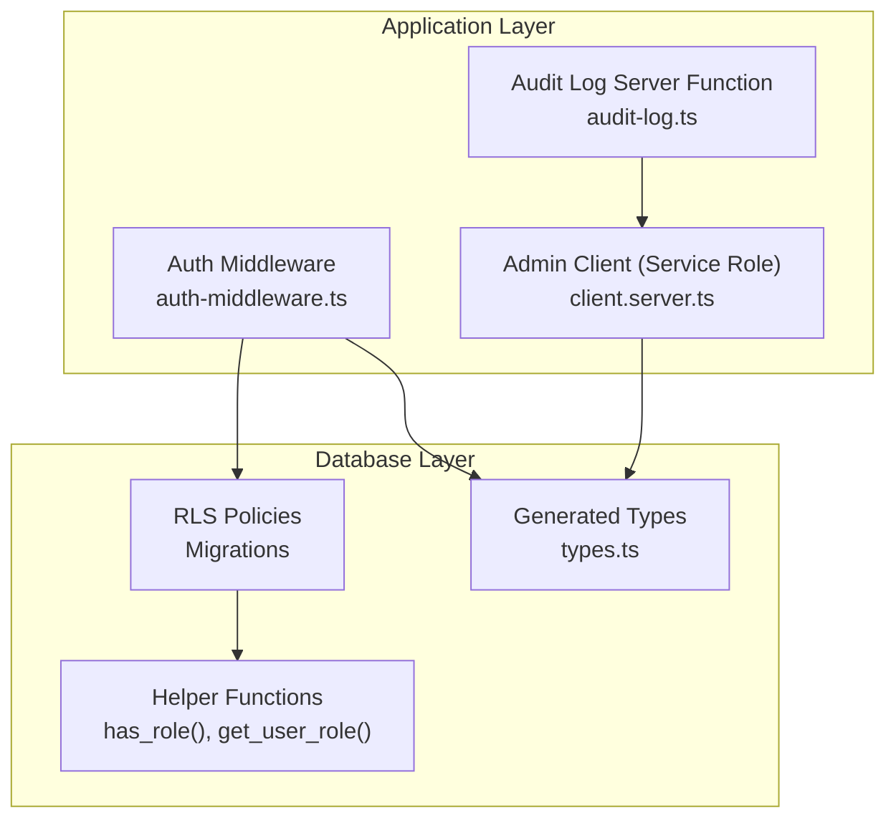
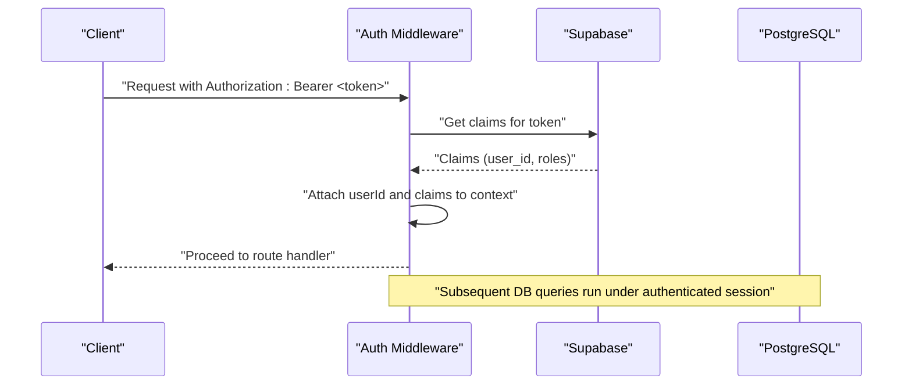
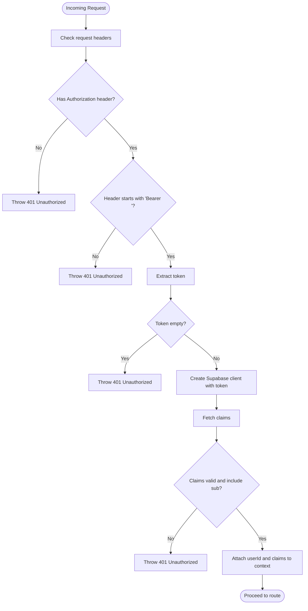
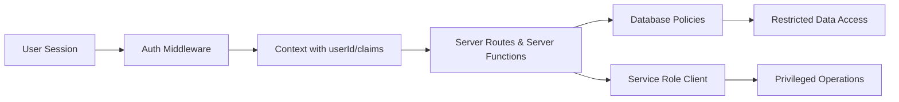
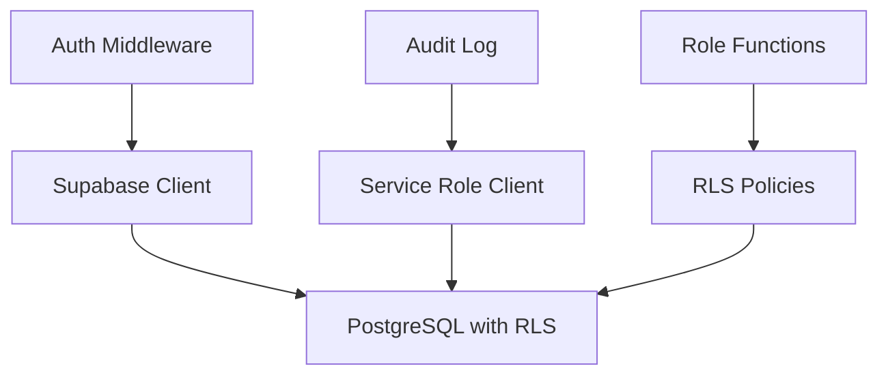

# Security Policies and Row Level Security

<cite>
**Referenced Files in This Document**
- [auth-middleware.ts](file://src/integrations/supabase/auth-middleware.ts)
- [client.server.ts](file://src/integrations/supabase/client.server.ts)
- [types.ts](file://src/integrations/supabase/types.ts)
- [20260430143000_admin_user_management_rls.sql](file://supabase/migrations/20260430143000_admin_user_management_rls.sql)
- [20260430170000_split_assets_clients_tickets.sql](file://supabase/migrations/20260430170000_split_assets_clients_tickets.sql)
- [20260504170000_add_rls_policies_automation_flows.sql](file://supabase/migrations/20260504170000_add_rls_policies_automation_flows.sql)
- [20260514210000_tickets_tech_delete_policy.sql](file://supabase/migrations/20260514210000_tickets_tech_delete_policy.sql)
- [20260505000000_patch_idempotent.sql](file://supabase/migrations/20260505000000_patch_idempotent.sql)
- [20260430143000_admin_user_management_rls.sql](file://supabase/migrations/20260430143000_admin_user_management_rls.sql)
- [20260430170000_split_assets_clients_tickets.sql](file://supabase/migrations/20260430170000_split_assets_clients_tickets.sql)
- [20260504170000_add_rls_policies_automation_flows.sql](file://supabase/migrations/20260504170000_add_rls_policies_automation_flows.sql)
- [20260514210000_tickets_tech_delete_policy.sql](file://supabase/migrations/20260514210000_tickets_tech_delete_policy.sql)
- [20260505000000_patch_idempotent.sql](file://supabase/migrations/20260505000000_patch_idempotent.sql)
- [20260430143000_admin_user_management_rls.sql](file://supabase/migrations/20260430143000_admin_user_management_rls.sql)
- [20260430170000_split_assets_clients_tickets.sql](file://supabase/migrations/20260430170000_split_assets_clients_tickets.sql)
- [20260504170000_add_rls_policies_automation_flows.sql](file://supabase/migrations/20260504170000_add_rls_policies_automation_flows.sql)
- [20260514210000_tickets_tech_delete_policy.sql](file://supabase/migrations/20260514210000_tickets_tech_delete_policy.sql)
- [20260505000000_patch_idempotent.sql](file://supabase/migrations/20260505000000_patch_idempotent.sql)
- [audit-log.ts](file://src/lib/audit-log.ts)
- [domain-model.md](file://docs/domain-model.md)
</cite>

## Table of Contents
1. [Introduction](#introduction)
2. [Project Structure](#project-structure)
3. [Core Components](#core-components)
4. [Architecture Overview](#architecture-overview)
5. [Detailed Component Analysis](#detailed-component-analysis)
6. [Dependency Analysis](#dependency-analysis)
7. [Performance Considerations](#performance-considerations)
8. [Troubleshooting Guide](#troubleshooting-guide)
9. [Conclusion](#conclusion)
10. [Appendices](#appendices)

## Introduction
This document explains the security model and Row Level Security (RLS) implementation in PCReady. It covers database-level policies that enforce data isolation and access control based on user roles and ownership, the authentication middleware that validates sessions and enforces application-level checks, and the integration between database policies and application-layer permissions. It also outlines security considerations, examples of policy definitions, and best practices for maintaining and debugging security policies.

## Project Structure
Security-related code spans three primary areas:
- Supabase database policies and helper functions defined in migration files
- Application-level authentication middleware that validates tokens and exposes user claims
- Server-side Supabase client configured with service role credentials for privileged operations

**Diagram sources**
- [auth-middleware.ts:1-74](file://src/integrations/supabase/auth-middleware.ts#L1-L74)
- [client.server.ts:1-42](file://src/integrations/supabase/client.server.ts#L1-L42)
- [audit-log.ts:1-183](file://src/lib/audit-log.ts#L1-L183)
- [20260430143000_admin_user_management_rls.sql:1-13](file://supabase/migrations/20260430143000_admin_user_management_rls.sql#L1-L13)
- [20260430170000_split_assets_clients_tickets.sql:46-79](file://supabase/migrations/20260430170000_split_assets_clients_tickets.sql#L46-L79)
- [20260504170000_add_rls_policies_automation_flows.sql:1-30](file://supabase/migrations/20260504170000_add_rls_policies_automation_flows.sql#L1-L30)
- [20260514210000_tickets_tech_delete_policy.sql:1-8](file://supabase/migrations/20260514210000_tickets_tech_delete_policy.sql#L1-L8)
- [20260505000000_patch_idempotent.sql:41-62](file://supabase/migrations/20260505000000_patch_idempotent.sql#L41-L62)
- [types.ts:1-800](file://src/integrations/supabase/types.ts#L1-L800)

**Section sources**
- [auth-middleware.ts:1-74](file://src/integrations/supabase/auth-middleware.ts#L1-L74)
- [client.server.ts:1-42](file://src/integrations/supabase/client.server.ts#L1-L42)
- [types.ts:1-800](file://src/integrations/supabase/types.ts#L1-L800)

## Core Components
- Authentication middleware: Extracts and validates Bearer tokens, fetches claims, and injects user identity into the request context for server routes and server functions.
- Service role client: Lazily initialized client configured with the Supabase service role key for privileged operations that must bypass RLS.
- Database RLS policies: Enforce ownership and role-based access across tables such as clients, devices, tickets, automation flows, OAuth tables, and activity logs.
- Helper functions: Role-checking functions and generated TypeScript types support secure typing and runtime checks.

Key responsibilities:
- Enforce session validity and extract user identity
- Prevent unauthorized access via database-level policies
- Allow privileged operations server-side while keeping client-facing queries bound to RLS
- Provide audit logging for administrative and user actions

**Section sources**
- [auth-middleware.ts:7-72](file://src/integrations/supabase/auth-middleware.ts#L7-L72)
- [client.server.ts:8-41](file://src/integrations/supabase/client.server.ts#L8-L41)
- [20260430143000_admin_user_management_rls.sql:5-12](file://supabase/migrations/20260430143000_admin_user_management_rls.sql#L5-L12)
- [20260430170000_split_assets_clients_tickets.sql:57-79](file://supabase/migrations/20260430170000_split_assets_clients_tickets.sql#L57-L79)
- [20260504170000_add_rls_policies_automation_flows.sql:6-25](file://supabase/migrations/20260504170000_add_rls_policies_automation_flows.sql#L6-L25)
- [20260505000000_patch_idempotent.sql:41-62](file://supabase/migrations/20260505000000_patch_idempotent.sql#L41-L62)

## Architecture Overview
The security architecture combines:
- Token-based authentication validated by the middleware
- Database RLS enforced for all user-facing queries
- Service role client for server-side tasks that must bypass RLS
- Audit logging for compliance and monitoring

**Diagram sources**
- [auth-middleware.ts:56-71](file://src/integrations/supabase/auth-middleware.ts#L56-L71)

## Detailed Component Analysis

### Authentication Middleware
Responsibilities:
- Validates presence and format of Authorization header
- Creates a Supabase client with the provided token
- Calls the Supabase API to fetch claims
- Injects user identity and claims into the request context for downstream handlers

Security implications:
- Ensures all server routes receive a verified user identity
- Prevents token-less or malformed requests from proceeding
- Provides a single place to enforce token validation and extract claims

**Diagram sources**
- [auth-middleware.ts:24-71](file://src/integrations/supabase/auth-middleware.ts#L24-L71)

**Section sources**
- [auth-middleware.ts:7-72](file://src/integrations/supabase/auth-middleware.ts#L7-L72)

### Service Role Client (Bypass RLS)
Responsibilities:
- Lazily initializes a Supabase client using the service role key
- Used exclusively for server-side operations that must bypass RLS (e.g., administrative tasks)
- Never exposed to client code

Security implications:
- Prevents accidental RLS bypass from client-side code
- Centralizes privileged operations behind explicit server functions

**Section sources**
- [client.server.ts:8-41](file://src/integrations/supabase/client.server.ts#L8-L41)

### Database-Level RLS Policies

#### Profiles and Roles
- Users can insert/update their own profile row
- Admins can read/update profiles
- Role membership is stored in a dedicated table with helper functions to check roles

Policy examples:
- Users can update their own profile row
- Admins can read and update profiles
- Role table allows selective admin access

**Section sources**
- [20260430143000_admin_user_management_rls.sql:5-12](file://supabase/migrations/20260430143000_admin_user_management_rls.sql#L5-L12)
- [20260430170000_split_assets_clients_tickets.sql:64-85](file://supabase/migrations/20260430170000_split_assets_clients_tickets.sql#L64-L85)

#### Clients, Devices, Client Contacts
- All authenticated users can read these entities
- Tech and Admin users can insert/update/delete
- Admin-only delete for clients and devices

Policy examples:
- All authenticated users can read clients
- Tech/Admin can insert/update clients
- Admin-only delete for clients

**Section sources**
- [20260430170000_split_assets_clients_tickets.sql:57-79](file://supabase/migrations/20260430170000_split_assets_clients_tickets.sql#L57-L79)

#### Tickets
- Ownership-based deletion policy extended to technicians
- Previously only admins could delete tickets; now techs can delete if they match the ownership criteria

Policy examples:
- Staff (admin or tech) can delete tickets

**Section sources**
- [20260514210000_tickets_tech_delete_policy.sql:4-7](file://supabase/migrations/20260514210000_tickets_tech_delete_policy.sql#L4-L7)

#### Automation Flows
- RLS enabled
- Select allowed to everyone
- Insert restricted to creator
- Update requires creator and sets updated_by to current user
- Delete restricted to creator

Policy examples:
- Insert own
- Update own
- Delete own

**Section sources**
- [20260504170000_add_rls_policies_automation_flows.sql:6-25](file://supabase/migrations/20260504170000_add_rls_policies_automation_flows.sql#L6-L25)

#### OAuth Tables
- oauth_clients: authenticated users can read; admins can manage
- oauth_authorization_codes: admin-only read
- oauth_consents: users can read/select own; admins can read all; users can insert/update own

Policy examples:
- Authenticated users can read oauth_clients
- Admins can manage oauth_clients
- Users can read own consents
- Admins can read all consents
- Users can insert/update own consents

**Section sources**
- [20260430170000_split_assets_clients_tickets.sql:45-65](file://supabase/migrations/20260430170000_split_assets_clients_tickets.sql#L45-L65)

#### Activity Log
- RLS enabled
- Idempotent policies ensure authenticated users can read and insert logs
- Additional policy tightens activity_log inserts to require actor_id to match the authenticated user

Policy examples:
- All authenticated users can read logs
- Authenticated users can insert logs
- Activity log insert requires actor_id to equal current user

**Section sources**
- [20260505000000_patch_idempotent.sql:41-62](file://supabase/migrations/20260505000000_patch_idempotent.sql#L41-L62)
- [20260430143000_admin_user_management_rls.sql:34-38](file://supabase/migrations/20260430143000_admin_user_management_rls.sql#L34-L38)

#### Entity Versions
- RLS enabled
- Users can view versions for entities they can access
- Only authenticated users can create versions

Policy examples:
- Users can view entity versions
- Authenticated users can create versions

**Section sources**
- [20260503120000_entity_versions.sql:29-41](file://supabase/migrations/20260503120000_entity_versions.sql#L29-L41)

### Relationship Between Database Policies and Application-Level Permissions
- Database policies define the baseline isolation and ownership semantics
- Application middleware ensures requests originate from valid sessions and attach user identity
- Server-side privileged operations use the service role client to bypass RLS when necessary
- Audit logging captures actions for compliance and incident response

**Diagram sources**
- [auth-middleware.ts:56-71](file://src/integrations/supabase/auth-middleware.ts#L56-L71)
- [client.server.ts:8-41](file://src/integrations/supabase/client.server.ts#L8-L41)
- [20260430170000_split_assets_clients_tickets.sql:57-79](file://supabase/migrations/20260430170000_split_assets_clients_tickets.sql#L57-L79)

## Dependency Analysis
- The auth middleware depends on Supabase’s token introspection and injects claims into the request context
- Database policies depend on helper functions for role checks and on the authenticated user session
- The service role client is used by server functions that must bypass RLS
- Audit logging relies on the service role client and database views for deduplication

**Diagram sources**
- [auth-middleware.ts:43-54](file://src/integrations/supabase/auth-middleware.ts#L43-L54)
- [client.server.ts:22-28](file://src/integrations/supabase/client.server.ts#L22-L28)
- [20260430143000_admin_user_management_rls.sql:73-85](file://supabase/migrations/20260430143000_admin_user_management_rls.sql#L73-L85)
- [audit-log.ts:36-48](file://src/lib/audit-log.ts#L36-L48)

**Section sources**
- [auth-middleware.ts:43-54](file://src/integrations/supabase/auth-middleware.ts#L43-L54)
- [client.server.ts:22-28](file://src/integrations/supabase/client.server.ts#L22-L28)
- [audit-log.ts:23-107](file://src/lib/audit-log.ts#L23-L107)

## Performance Considerations
- Keep RLS policies minimal and deterministic to reduce overhead
- Prefer indexed columns in policy expressions (e.g., user_id, created_by)
- Use server-side service role client for batch operations that must bypass RLS
- Avoid overly broad SELECT policies; scope reads to the smallest dataset necessary

## Troubleshooting Guide
Common issues and resolutions:
- Unauthorized errors on database queries
  - Verify the request includes a valid Bearer token
  - Confirm the token belongs to an authenticated user
  - Ensure the user has the required role or owns the target record
- Missing environment variables for Supabase
  - Ensure SUPABASE_URL, SUPABASE_PUBLISHABLE_KEY, and SUPABASE_SERVICE_ROLE_KEY are set
- Policy conflicts or unexpected denials
  - Review the relevant migration for the affected table to confirm policy definitions
  - Check helper functions for role checks and confirm they are executable by authenticated users
- Audit log discrepancies
  - Confirm activity_log insert policy requires actor_id to match the authenticated user
  - Use the deduplicated view for accurate reporting

**Section sources**
- [auth-middleware.ts:12-20](file://src/integrations/supabase/auth-middleware.ts#L12-L20)
- [client.server.ts:12-20](file://src/integrations/supabase/client.server.ts#L12-L20)
- [20260505000000_patch_idempotent.sql:34-38](file://supabase/migrations/20260505000000_patch_idempotent.sql#L34-L38)
- [audit-log.ts:36-48](file://src/lib/audit-log.ts#L36-L48)

## Conclusion
PCReady’s security model combines strong database-level RLS with robust application-level authentication. Database policies enforce ownership and role-based access across core entities, while the auth middleware ensures all server routes operate under validated identities. Privileged operations are isolated behind the service role client. Together, these mechanisms provide defense-in-depth against data leakage, privilege escalation, and unauthorized access.

## Appendices

### Security Best Practices for Maintaining and Updating Policies
- Keep policies idempotent and documented alongside migrations
- Use helper functions for role checks and grant execute permissions narrowly
- Prefer least-privilege: allow reads only when necessary; restrict deletes to owners or admins
- Regularly review and test policies after schema or role changes
- Monitor audit logs for anomalies and unauthorized access attempts

### Examples of Policy Definitions and Their Impact
- Clients, Devices, Client Contacts: authenticated users can read; tech/admin can insert/update/delete; admin-only delete
- Tickets: deletion allowed for staff (admin or tech)
- Automation Flows: select allowed; insert/update/delete restricted to owner
- OAuth Tables: read/write policies tailored to roles and ownership
- Activity Log: authenticated users can read and insert; insert requires actor_id to match current user
- Entity Versions: authenticated users can create; visibility constrained by access to underlying entities

**Section sources**
- [20260430170000_split_assets_clients_tickets.sql:57-79](file://supabase/migrations/20260430170000_split_assets_clients_tickets.sql#L57-L79)
- [20260514210000_tickets_tech_delete_policy.sql:4-7](file://supabase/migrations/20260514210000_tickets_tech_delete_policy.sql#L4-L7)
- [20260504170000_add_rls_policies_automation_flows.sql:6-25](file://supabase/migrations/20260504170000_add_rls_policies_automation_flows.sql#L6-L25)
- [20260430170000_split_assets_clients_tickets.sql:45-65](file://supabase/migrations/20260430170000_split_assets_clients_tickets.sql#L45-L65)
- [20260505000000_patch_idempotent.sql:41-62](file://supabase/migrations/20260505000000_patch_idempotent.sql#L41-L62)
- [20260503120000_entity_versions.sql:29-41](file://supabase/migrations/20260503120000_entity_versions.sql#L29-L41)