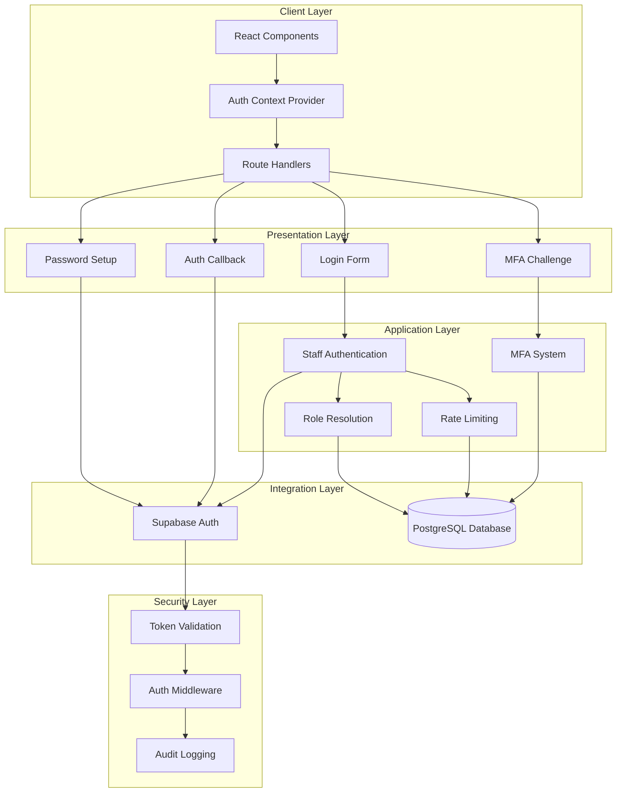
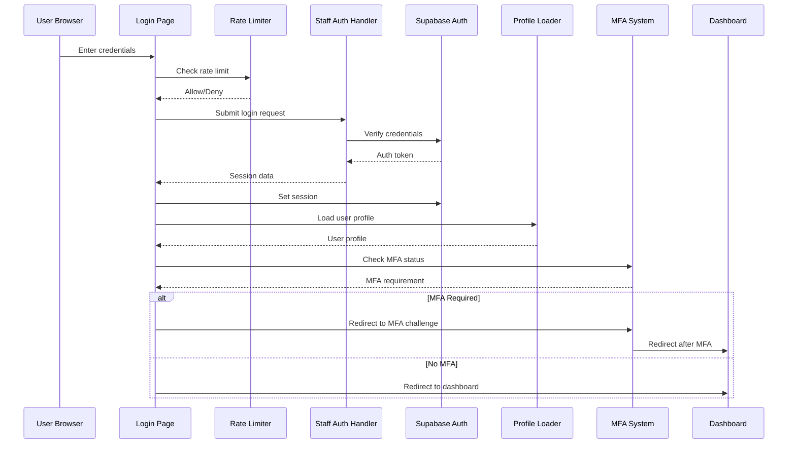
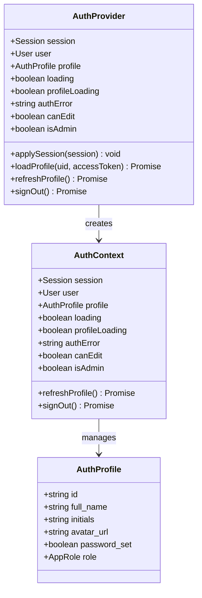
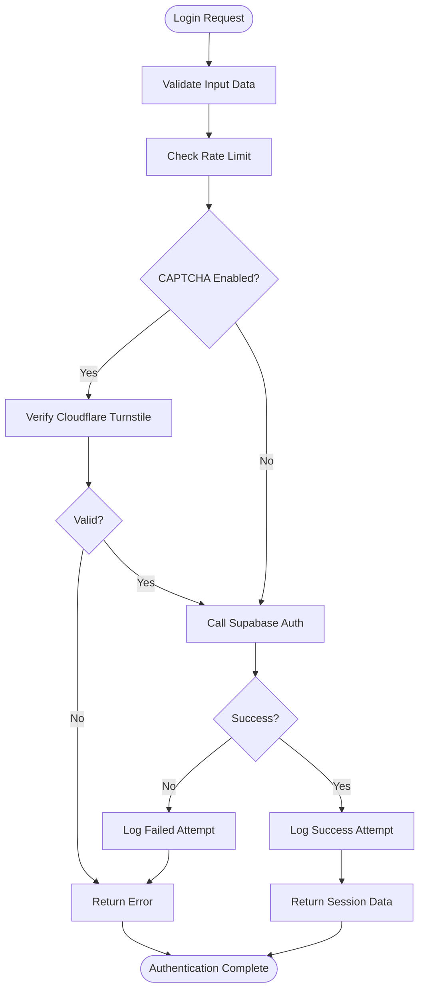
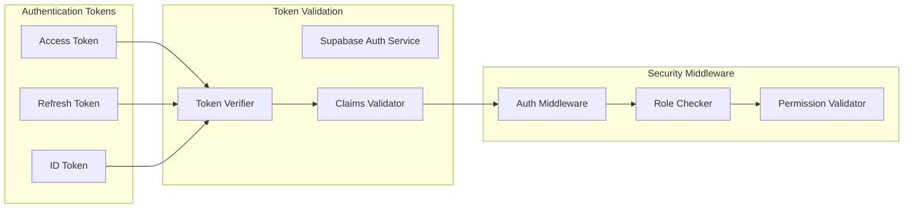
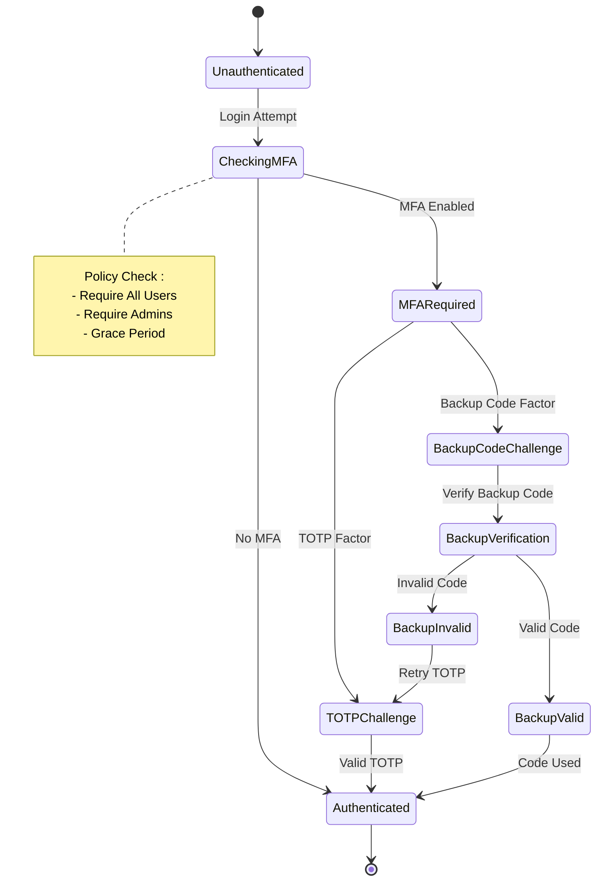
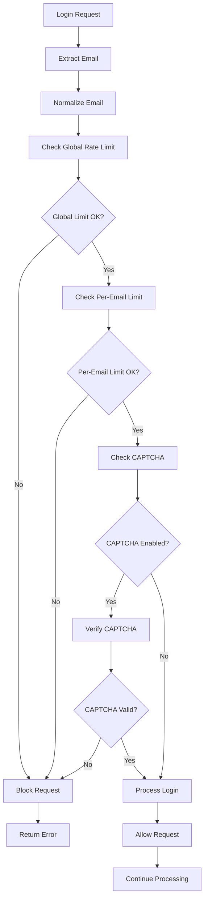
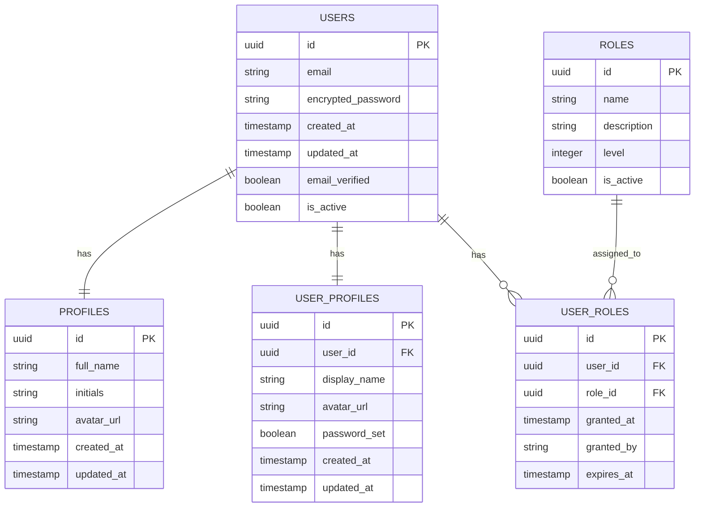
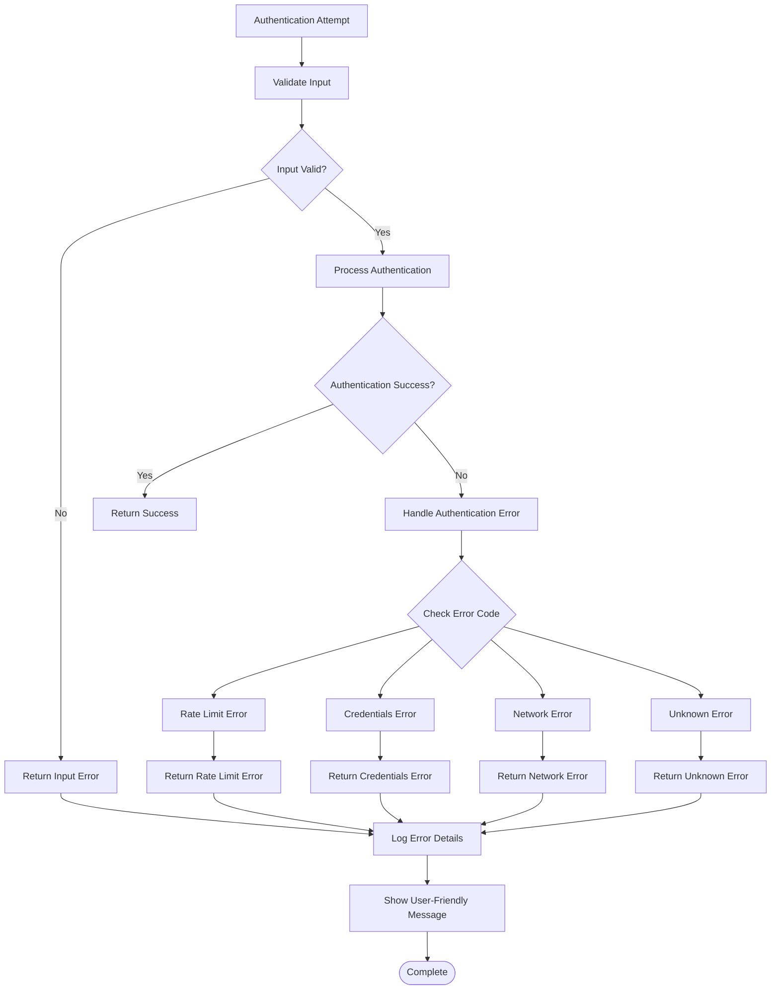

# Staff Authentication System

<cite>
**Referenced Files in This Document**
- [staff-auth.ts](file://src/lib/staff-auth.ts)
- [staff-auth.server.ts](file://src/lib/server/staff-auth.server.ts)
- [auth-context.tsx](file://src/lib/auth-context.tsx)
- [auth-provider.tsx](file://src/lib/auth-provider.tsx)
- [auth.tsx](file://src/routes/auth.tsx)
- [auth.callback.tsx](file://src/routes/auth.callback.tsx)
- [auth.2fa-challenge.tsx](file://src/routes/auth.2fa-challenge.tsx)
- [auth.set-password.tsx](file://src/routes/auth.set-password.tsx)
- [get-my-role.ts](file://src/lib/get-my-role.ts)
- [auth-rate-limit.ts](file://src/lib/auth-rate-limit.ts)
- [mfa.ts](file://src/lib/mfa.ts)
- [mfa-client.ts](file://src/lib/mfa-client.ts)
- [auth-middleware.ts](file://src/integrations/supabase/auth-middleware.ts)
- [AuthStateScreens.tsx](file://src/components/auth/AuthStateScreens.tsx)
</cite>

## Table of Contents
1. [Introduction](#introduction)
2. [System Architecture](#system-architecture)
3. [Authentication Flow](#authentication-flow)
4. [Core Components](#core-components)
5. [Security Implementation](#security-implementation)
6. [MFA System](#mfa-system)
7. [Rate Limiting](#rate-limiting)
8. [User Profile Management](#user-profile-management)
9. [Error Handling](#error-handling)
10. [Performance Considerations](#performance-considerations)
11. [Troubleshooting Guide](#troubleshooting-guide)
12. [Conclusion](#conclusion)

## Introduction

The Staff Authentication System is a comprehensive authentication solution built with React Router, TanStack Start, and Supabase Auth. It provides secure staff login capabilities with multi-factor authentication (MFA), rate limiting, and role-based access control. The system supports both traditional password authentication and modern MFA verification methods including TOTP and backup codes.

The authentication system follows modern security practices including token-based authentication, client-side session management, server-side validation, and comprehensive error handling. It integrates seamlessly with the broader PCReady application ecosystem while maintaining strict separation between client and server concerns.

## System Architecture

The authentication system follows a layered architecture pattern with clear separation of concerns:



**Diagram sources**
- [auth-provider.tsx:12-149](file://src/lib/auth-provider.tsx#L12-L149)
- [staff-auth.ts:10-15](file://src/lib/staff-auth.ts#L10-L15)
- [auth.tsx:47-169](file://src/routes/auth.tsx#L47-L169)

## Authentication Flow

The authentication process follows a secure, multi-stage flow designed to prevent unauthorized access while providing a smooth user experience:



**Diagram sources**
- [auth.tsx:74-109](file://src/routes/auth.tsx#L74-L109)
- [staff-auth.server.ts:29-77](file://src/lib/server/staff-auth.server.ts#L29-L77)
- [auth-provider.tsx:23-92](file://src/lib/auth-provider.tsx#L23-L92)

**Section sources**
- [auth.tsx:47-169](file://src/routes/auth.tsx#L47-L169)
- [staff-auth.ts:10-15](file://src/lib/staff-auth.ts#L10-L15)
- [staff-auth.server.ts:29-77](file://src/lib/server/staff-auth.server.ts#L29-L77)

## Core Components

### Authentication Context Provider

The authentication context provider manages the global authentication state and provides essential authentication utilities to the application:



**Diagram sources**
- [auth-provider.tsx:12-149](file://src/lib/auth-provider.tsx#L12-L149)
- [auth-context.tsx:6-26](file://src/lib/auth-context.tsx#L6-L26)

The provider handles real-time authentication state changes, profile loading, and session management. It ensures thread-safe profile updates and provides reactive authentication state to all components in the application.

**Section sources**
- [auth-provider.tsx:12-149](file://src/lib/auth-provider.tsx#L12-L149)
- [auth-context.tsx:1-35](file://src/lib/auth-context.tsx#L1-L35)

### Staff Authentication Handler

The staff authentication system provides a robust server-side authentication mechanism with comprehensive error handling and security measures:



**Diagram sources**
- [staff-auth.server.ts:29-77](file://src/lib/server/staff-auth.server.ts#L29-L77)

**Section sources**
- [staff-auth.ts:10-15](file://src/lib/staff-auth.ts#L10-L15)
- [staff-auth.server.ts:1-87](file://src/lib/server/staff-auth.server.ts#L1-L87)

## Security Implementation

### Token-Based Authentication

The system implements a secure token-based authentication mechanism that separates client-side session management from server-side validation:



**Diagram sources**
- [auth-middleware.ts:7-73](file://src/integrations/supabase/auth-middleware.ts#L7-L73)
- [get-my-role.ts:3-16](file://src/lib/get-my-role.ts#L3-L16)

### Environment-Based Security

The authentication system adapts its security posture based on the deployment environment:

| Environment | Security Features | CAPTCHA | Rate Limits | Audit Logging |
|-------------|-------------------|---------|-------------|---------------|
| Development | Disabled | Off | Relaxed | Basic |
| Staging | Optional | Optional | Standard | Enhanced |
| Production | Required | Required | Strict | Full |

**Section sources**
- [auth-middleware.ts:1-74](file://src/integrations/supabase/auth-middleware.ts#L1-L74)
- [staff-auth.server.ts:14-24](file://src/lib/server/staff-auth.server.ts#L14-L24)

## MFA System

The Multi-Factor Authentication (MFA) system provides layered security through multiple authentication factors:



**Diagram sources**
- [mfa-client.ts:52-72](file://src/lib/mfa-client.ts#L52-L72)
- [auth.2fa-challenge.tsx:32-217](file://src/routes/auth.2fa-challenge.tsx#L32-L217)

### MFA Factors

The system supports multiple MFA factors with comprehensive validation:

| Factor Type | Description | Verification Method | Security Level |
|-------------|-------------|-------------------|----------------|
| TOTP | Time-based One-Time Password | 6-digit code | High |
| Backup Codes | Pre-generated codes | 8-character codes | Medium |
| Biometric | Fingerprint/Touch ID | Hardware-based | Very High |
| Hardware Token | Physical security key | Push/pulse | Very High |

**Section sources**
- [mfa.ts:112-137](file://src/lib/mfa.ts#L112-L137)
- [mfa-client.ts:52-72](file://src/lib/mfa-client.ts#L52-L72)
- [auth.2fa-challenge.tsx:32-217](file://src/routes/auth.2fa-challenge.tsx#L32-L217)

## Rate Limiting

The authentication system implements comprehensive rate limiting to prevent brute force attacks and abuse:



**Diagram sources**
- [auth-rate-limit.ts:18-24](file://src/lib/auth-rate-limit.ts#L18-L24)
- [staff-auth.server.ts:30-38](file://src/lib/server/staff-auth.server.ts#L30-L38)

**Section sources**
- [auth-rate-limit.ts:1-25](file://src/lib/auth-rate-limit.ts#L1-L25)
- [staff-auth.server.ts:14-24](file://src/lib/server/staff-auth.server.ts#L14-L24)

## User Profile Management

The authentication system manages comprehensive user profiles with role-based access control:



**Diagram sources**
- [auth-context.tsx:6-13](file://src/lib/auth-context.tsx#L6-L13)
- [auth-provider.tsx:29-65](file://src/lib/auth-provider.tsx#L29-L65)

**Section sources**
- [auth-context.tsx:1-35](file://src/lib/auth-context.tsx#L1-L35)
- [auth-provider.tsx:23-73](file://src/lib/auth-provider.tsx#L23-L73)

## Error Handling

The authentication system implements comprehensive error handling with user-friendly messaging and detailed logging:



**Diagram sources**
- [auth.tsx:104-108](file://src/routes/auth.tsx#L104-L108)
- [auth-provider.tsx:66-72](file://src/lib/auth-provider.tsx#L66-L72)

**Section sources**
- [auth.tsx:43-45](file://src/routes/auth.tsx#L43-L45)
- [auth-provider.tsx:8-10](file://src/lib/auth-provider.tsx#L8-L10)

## Performance Considerations

### Asynchronous Loading Strategies

The authentication system employs several performance optimization techniques:

1. **Parallel Profile Loading**: User profiles are loaded concurrently using Promise.all
2. **Request Batching**: Multiple database queries are batched to reduce round trips
3. **Caching Strategy**: Local caching of authentication state reduces unnecessary re-renders
4. **Lazy Loading**: Authentication components are loaded on-demand

### Memory Management

The system implements careful memory management to prevent leaks:

- Profile request cancellation using request IDs
- Proper cleanup of event listeners
- Efficient state updates using React hooks
- Cleanup of timers and intervals

**Section sources**
- [auth-provider.tsx:29-39](file://src/lib/auth-provider.tsx#L29-L39)
- [auth-provider.tsx:96-98](file://src/lib/auth-provider.tsx#L96-L98)

## Troubleshooting Guide

### Common Authentication Issues

| Issue | Symptoms | Solution |
|-------|----------|----------|
| Login Blocked | Immediate rate limit error | Wait for cooldown period |
| CAPTCHA Failure | Repeated CAPTCHA validation errors | Check Cloudflare configuration |
| MFA Timeout | 2FA challenge expires | Restart authentication flow |
| Profile Loading | Blank user info on dashboard | Check database connectivity |
| Session Expiration | Automatic logout | Verify token validity |

### Debugging Authentication Flows

Enable debug logging by setting the appropriate environment variables:

```bash
# Enable authentication debug logs
DEBUG_AUTH=true

# Enable detailed error messages
DEBUG_ERRORS=true

# Enable network tracing
DEBUG_NETWORK=true
```

### Monitoring Authentication Metrics

Key metrics to monitor:

- **Authentication Success Rate**: Percentage of successful logins
- **Rate Limit Violations**: Count of blocked requests
- **MFA Usage**: Adoption rates for multi-factor authentication
- **Session Duration**: Average session lifetime
- **Error Rates**: Breakdown of authentication errors

**Section sources**
- [staff-auth.server.ts:56-66](file://src/lib/server/staff-auth.server.ts#L56-L66)
- [auth.tsx:81-94](file://src/routes/auth.tsx#L81-L94)

## Conclusion

The Staff Authentication System provides a comprehensive, secure, and scalable authentication solution for the PCReady platform. It combines modern security practices with user-friendly design to deliver a reliable authentication experience.

Key strengths of the system include:

- **Multi-layered Security**: Token-based authentication with MFA support
- **Robust Rate Limiting**: Protection against brute force attacks
- **Comprehensive Error Handling**: User-friendly error messages with detailed logging
- **Performance Optimization**: Asynchronous loading and efficient state management
- **Extensible Design**: Modular architecture supporting future enhancements

The system successfully balances security requirements with usability, providing administrators with powerful tools while ensuring staff members have a seamless authentication experience. The implementation demonstrates best practices in modern web application security and can serve as a foundation for similar authentication systems.