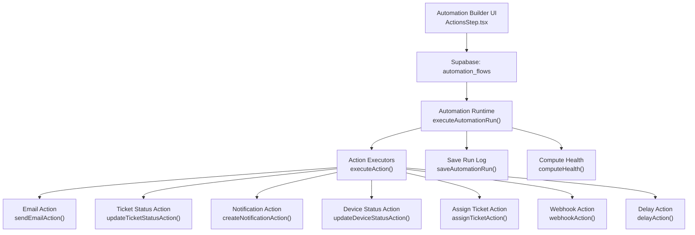
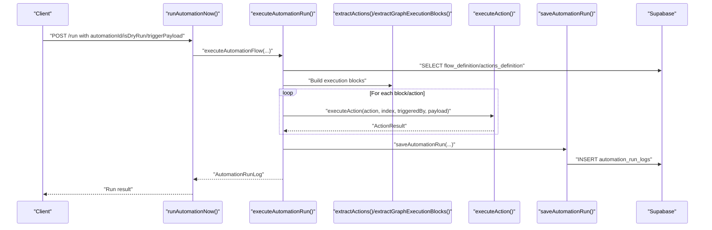
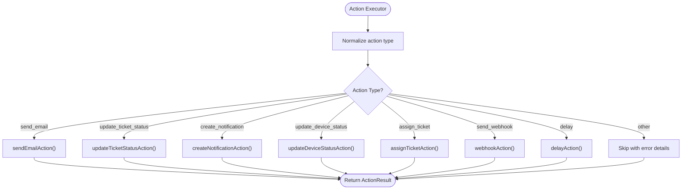
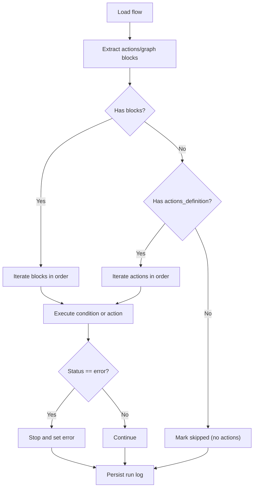
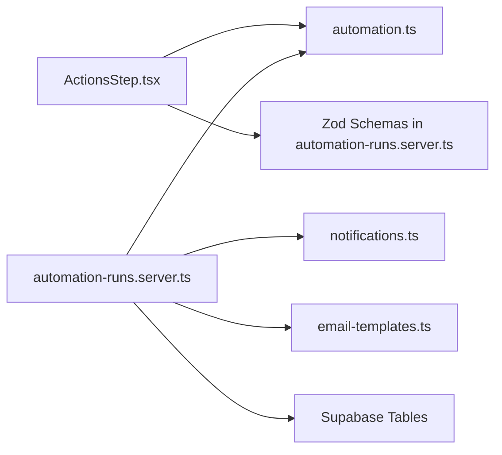
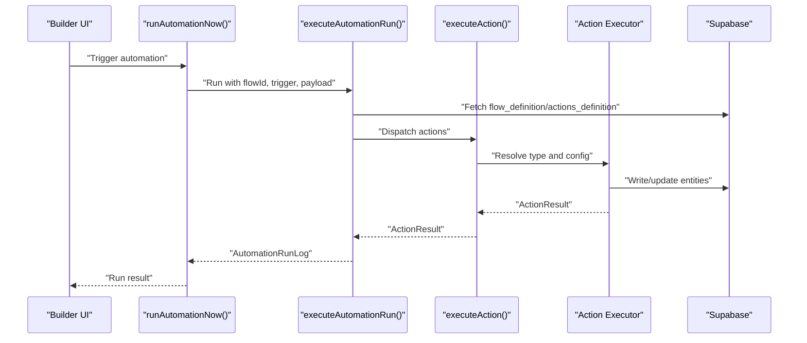

# Automation Actions

<cite>
**Referenced Files in This Document**
- [automation.ts](file://src/types/automation.ts)
- [automation-runs.ts](file://src/lib/automation-runs.ts)
- [automation-runs.server.ts](file://src/lib/automation-runs.server.ts)
- [automations.ts](file://src/lib/queries/automations.ts)
- [ActionsStep.tsx](file://src/components/automations/steps/ActionsStep.tsx)
- [notifications.ts](file://src/lib/notifications.ts)
- [email-templates.ts](file://src/lib/email-templates.ts)
</cite>

## Table of Contents

1. [Introduction](#introduction)
2. [Project Structure](#project-structure)
3. [Core Components](#core-components)
4. [Architecture Overview](#architecture-overview)
5. [Detailed Component Analysis](#detailed-component-analysis)
6. [Dependency Analysis](#dependency-analysis)
7. [Performance Considerations](#performance-considerations)
8. [Troubleshooting Guide](#troubleshooting-guide)
9. [Conclusion](#conclusion)
10. [Appendices](#appendices)

## Introduction

This document explains how automation actions are executed and configured in the system. It covers supported action types (email notifications, status updates, data transformations, and external API calls), input parameters, output handling, and result processing. It also details the execution pipeline, chaining of actions in automation flows, validation, error handling, retries, performance optimization, and troubleshooting guidance.

## Project Structure

Automation flows are defined and persisted in the database and executed by a server-side runtime. The UI provides a builder to define actions and conditions. The runtime validates and executes actions against Supabase tables and external services.

**Diagram sources**

- [ActionsStep.tsx:1-298](file://src/components/automations/steps/ActionsStep.tsx#L1-L298)
- [automation-runs.server.ts:94-207](file://src/lib/automation-runs.server.ts#L94-L207)
- [automation-runs.server.ts:990-1050](file://src/lib/automation-runs.server.ts#L990-L1050)
- [automation-runs.server.ts:38-56](file://src/lib/automation-runs.server.ts#L38-L56)
- [automation-runs.ts:144-210](file://src/lib/automation-runs.ts#L144-L210)

**Section sources**

- [automations.ts:1-179](file://src/lib/queries/automations.ts#L1-L179)
- [automation-runs.ts:77-142](file://src/lib/automation-runs.ts#L77-L142)
- [automation-runs.server.ts:94-207](file://src/lib/automation-runs.server.ts#L94-L207)

## Core Components

- Action types and schemas: The runtime supports actions such as sending emails, updating ticket/device statuses, assigning tickets, creating in-app notifications, invoking webhooks, and registering delays. Each action has a dedicated executor and Zod schema for validation.
- Execution pipeline: The runtime extracts actions from the flow definition, iterates them, and records results in a structured run log. Conditions can short-circuit execution.
- Logging and health: Each run writes a record with status, duration, trigger payload, and per-action outcomes. Health is computed from recent run statuses.
- UI builder: The ActionsStep component renders action forms and defaults for each action type.

**Section sources**

- [automation-runs.server.ts:576-582](file://src/lib/automation-runs.server.ts#L576-L582)
- [automation-runs.server.ts:532-574](file://src/lib/automation-runs.server.ts#L532-L574)
- [automation-runs.server.ts:990-1050](file://src/lib/automation-runs.server.ts#L990-L1050)
- [automation.ts:47-71](file://src/types/automation.ts#L47-L71)
- [automation-runs.ts:144-210](file://src/lib/automation-runs.ts#L144-L210)
- [ActionsStep.tsx:7-44](file://src/components/automations/steps/ActionsStep.tsx#L7-L44)

## Architecture Overview

The automation engine orchestrates a deterministic execution order:

- Extract actions from the flow definition (or graph blocks).
- Validate and execute each action.
- Record ActionResult entries and overall run status.
- Persist run log and update flow metadata.
- Notify administrators on failure.

**Diagram sources**

- [automation-runs.ts:94-108](file://src/lib/automation-runs.ts#L94-L108)
- [automation-runs.server.ts:94-207](file://src/lib/automation-runs.server.ts#L94-L207)
- [automation-runs.server.ts:279-295](file://src/lib/automation-runs.server.ts#L279-L295)
- [automation-runs.server.ts:301-341](file://src/lib/automation-runs.server.ts#L301-L341)
- [automation-runs.server.ts:990-1050](file://src/lib/automation-runs.server.ts#L990-L1050)
- [automation-runs.server.ts:38-56](file://src/lib/automation-runs.server.ts#L38-L56)

## Detailed Component Analysis

### Supported Action Types and Execution

- Email notifications
  - Validates subject/body length and optional HTML flag.
  - Resolves recipient from config or trigger payload.
  - Sends via SMTP and returns delivery metadata.
  - Errors propagate with actionable messages.
- Status updates
  - Update ticket status: resolves ticket_id from config/payload, updates tickets table, returns updated status.
  - Update device status: resolves device_id from config/payload, updates devices table, optionally notifies admins on state transitions.
- Data transformations
  - Assign ticket: sets assignee_id on tickets row.
  - Create in-app notification: inserts into notifications table with type, title, body, link, and payload.
- External API calls
  - Webhook: posts JSON payload to URL; supports templating placeholders from trigger payload; captures HTTP status and response text.
- Control flow
  - Delay: validates amount/unit and records delay metadata; actual deferred execution requires a scheduler.
  - Conditions: evaluated to decide branch; skipped blocks halt execution until next condition or action.

**Diagram sources**

- [automation-runs.server.ts:990-1050](file://src/lib/automation-runs.server.ts#L990-L1050)
- [automation-runs.server.ts:629-674](file://src/lib/automation-runs.server.ts#L629-L674)
- [automation-runs.server.ts:676-714](file://src/lib/automation-runs.server.ts#L676-L714)
- [automation-runs.server.ts:716-772](file://src/lib/automation-runs.server.ts#L716-L772)
- [automation-runs.server.ts:774-836](file://src/lib/automation-runs.server.ts#L774-L836)
- [automation-runs.server.ts:838-876](file://src/lib/automation-runs.server.ts#L838-L876)
- [automation-runs.server.ts:914-988](file://src/lib/automation-runs.server.ts#L914-L988)
- [automation-runs.server.ts:878-912](file://src/lib/automation-runs.server.ts#L878-L912)

**Section sources**

- [automation-runs.server.ts:532-574](file://src/lib/automation-runs.server.ts#L532-L574)
- [automation-runs.server.ts:629-674](file://src/lib/automation-runs.server.ts#L629-L674)
- [automation-runs.server.ts:676-714](file://src/lib/automation-runs.server.ts#L676-L714)
- [automation-runs.server.ts:716-772](file://src/lib/automation-runs.server.ts#L716-L772)
- [automation-runs.server.ts:774-836](file://src/lib/automation-runs.server.ts#L774-L836)
- [automation-runs.server.ts:838-876](file://src/lib/automation-runs.server.ts#L838-L876)
- [automation-runs.server.ts:914-988](file://src/lib/automation-runs.server.ts#L914-L988)
- [automation-runs.server.ts:878-912](file://src/lib/automation-runs.server.ts#L878-L912)

### Action Input Parameters and Validation

- Email action
  - Required: subject, body.
  - Optional: to (email address), is_html (boolean).
  - Validation ensures presence of recipient either in config or trigger payload.
- Ticket status update
  - Required: status enum; ticket_id (explicit or from payload).
- Device status update
  - Required: status enum; device_id (explicit or from payload).
- Assign ticket
  - Required: ticket_id and assignee_id.
- Create notification
  - Required: title; resolved user_id from config or payload.
  - Optional: type, body, link, payload.
- Webhook
  - Required: url; optional payload (JSON string with templated placeholders).
- Delay
  - Required: amount (positive integer), unit ("hours" or "days").

**Section sources**

- [automation-runs.server.ts:532-574](file://src/lib/automation-runs.server.ts#L532-L574)
- [automation-runs.server.ts:542-564](file://src/lib/automation-runs.server.ts#L542-L564)
- [automation-runs.server.ts:556-564](file://src/lib/automation-runs.server.ts#L556-L564)
- [automation-runs.server.ts:561-564](file://src/lib/automation-runs.server.ts#L561-L564)
- [automation-runs.server.ts:547-554](file://src/lib/automation-runs.server.ts#L547-L554)
- [automation-runs.server.ts:571-574](file://src/lib/automation-runs.server.ts#L571-L574)
- [automation-runs.server.ts:566-569](file://src/lib/automation-runs.server.ts#L566-L569)

### Output Handling and Result Processing

- ActionResult shape includes:
  - action, status, blockId, blockType, input, details, result, error.
- Actions populate details with identifiers and metadata (e.g., ticket_id/status, device_id/status, channel, HTTP status).
- Results include human-readable messages and truncated response bodies for diagnostics.

**Section sources**

- [automation.ts:8-18](file://src/types/automation.ts#L8-L18)
- [automation-runs.server.ts:664-673](file://src/lib/automation-runs.server.ts#L664-L673)
- [automation-runs.server.ts:708-713](file://src/lib/automation-runs.server.ts#L708-L713)
- [automation-runs.server.ts:766-771](file://src/lib/automation-runs.server.ts#L766-L771)
- [automation-runs.server.ts:830-835](file://src/lib/automation-runs.server.ts#L830-L835)
- [automation-runs.server.ts:870-875](file://src/lib/automation-runs.server.ts#L870-L875)
- [automation-runs.server.ts:969-977](file://src/lib/automation-runs.server.ts#L969-L977)
- [automation-runs.server.ts:901-911](file://src/lib/automation-runs.server.ts#L901-L911)

### Execution Pipeline and Chaining

- Extraction:
  - Actions can be defined in actions_definition or via nodes in the flow graph.
  - Graph traversal follows edges and evaluates conditions to determine next block.
- Execution:
  - For each block/action, executeAction dispatches to the appropriate handler.
  - On error, the run stops and marks status as error; otherwise continues.
- Dry run:
  - Simulates blocks and actions without side effects; useful for validation.

**Diagram sources**

- [automation-runs.server.ts:279-295](file://src/lib/automation-runs.server.ts#L279-L295)
- [automation-runs.server.ts:301-341](file://src/lib/automation-runs.server.ts#L301-L341)
- [automation-runs.server.ts:94-207](file://src/lib/automation-runs.server.ts#L94-L207)
- [automation-runs.server.ts:227-267](file://src/lib/automation-runs.server.ts#L227-L267)

**Section sources**

- [automation-runs.server.ts:279-295](file://src/lib/automation-runs.server.ts#L279-L295)
- [automation-runs.server.ts:301-341](file://src/lib/automation-runs.server.ts#L301-L341)
- [automation-runs.server.ts:94-207](file://src/lib/automation-runs.server.ts#L94-L207)
- [automation-runs.server.ts:227-267](file://src/lib/automation-runs.server.ts#L227-L267)

### Common Use Cases and Example Configurations

Note: The following are conceptual examples. Use the UI builder to configure actions and refer to the validation schemas for exact fields.

- Send a notification email
  - Set subject and body; optionally set HTML flag.
  - Provide recipient either in config.to or in the trigger payload under a recognized email key.
  - On success, details include channel and recipient; result includes a success message.
- Update a ticket’s status
  - Provide ticket_id (explicitly or via trigger payload).
  - Choose status from allowed values.
  - On success, details include ticket_id and new status; result confirms update.
- Create an in-app notification
  - Provide user_id (or rely on assignee_id/user_id in payload).
  - Choose type from available notification types.
  - Provide title and optional body/link/payload.
  - On success, details include notification_id and type; result confirms creation.
- Update a device’s status
  - Provide device_id (explicitly or via trigger payload).
  - Choose status from allowed values.
  - On success, details include device_id and new status; result confirms update.
- Call an external service via webhook
  - Provide URL and optional JSON payload (with placeholders like {{trigger}} and {{ticket_id}}).
  - On success, details include HTTP status; result includes a success message and truncated response.
- Register a delay
  - Provide amount and unit (hours/days).
  - On success, details include delay_ms; result indicates the action was registered.

**Section sources**

- [ActionsStep.tsx:112-149](file://src/components/automations/steps/ActionsStep.tsx#L112-L149)
- [ActionsStep.tsx:151-177](file://src/components/automations/steps/ActionsStep.tsx#L151-L177)
- [ActionsStep.tsx:179-230](file://src/components/automations/steps/ActionsStep.tsx#L179-L230)
- [ActionsStep.tsx:232-258](file://src/components/automations/steps/ActionsStep.tsx#L232-L258)
- [ActionsStep.tsx:260-281](file://src/components/automations/steps/ActionsStep.tsx#L260-L281)
- [automation-runs.server.ts:532-574](file://src/lib/automation-runs.server.ts#L532-L574)
- [automation-runs.server.ts:542-564](file://src/lib/automation-runs.server.ts#L542-L564)
- [automation-runs.server.ts:547-554](file://src/lib/automation-runs.server.ts#L547-L554)
- [automation-runs.server.ts:556-564](file://src/lib/automation-runs.server.ts#L556-L564)
- [automation-runs.server.ts:561-564](file://src/lib/automation-runs.server.ts#L561-L564)
- [automation-runs.server.ts:571-574](file://src/lib/automation-runs.server.ts#L571-L574)
- [automation-runs.server.ts:566-569](file://src/lib/automation-runs.server.ts#L566-L569)

### Validation, Error Handling, and Retry Mechanisms

- Validation
  - Each action uses a Zod schema to validate configuration; invalid configs produce ActionResult with error.
  - Recipient resolution for emails and ID resolution for tickets/devices are handled with fallbacks.
- Error handling
  - On action error, the run stops immediately and status becomes error.
  - If no actions were executed, a validation step is recorded with error details.
  - On error, a system notification is sent to administrators.
- Retries
  - There is no built-in retry mechanism in the runtime. For transient failures (e.g., network), consider wrapping external calls in a separate scheduled job or queue-based processor.

**Section sources**

- [automation-runs.server.ts:634-641](file://src/lib/automation-runs.server.ts#L634-L641)
- [automation-runs.server.ts:682-688](file://src/lib/automation-runs.server.ts#L682-L688)
- [automation-runs.server.ts:723-729](file://src/lib/automation-runs.server.ts#L723-L729)
- [automation-runs.server.ts:779-786](file://src/lib/automation-runs.server.ts#L779-L786)
- [automation-runs.server.ts:844-849](file://src/lib/automation-runs.server.ts#L844-L849)
- [automation-runs.server.ts:920-929](file://src/lib/automation-runs.server.ts#L920-L929)
- [automation-runs.server.ts:889-898](file://src/lib/automation-runs.server.ts#L889-L898)
- [automation-runs.server.ts:157-169](file://src/lib/automation-runs.server.ts#L157-L169)
- [automation-runs.server.ts:209-225](file://src/lib/automation-runs.server.ts#L209-L225)

## Dependency Analysis

- UI builder depends on action type definitions and default configs.
- Runtime depends on:
  - Supabase client for reads/writes to tickets, devices, notifications, and automation run logs.
  - Email service for sending messages.
  - Notification service for creating in-app notifications.
- Types define the shape of run logs and flow definitions.

**Diagram sources**

- [ActionsStep.tsx:1-298](file://src/components/automations/steps/ActionsStep.tsx#L1-L298)
- [automation.ts:1-72](file://src/types/automation.ts#L1-L72)
- [automation-runs.server.ts:532-574](file://src/lib/automation-runs.server.ts#L532-L574)
- [notifications.ts:1-140](file://src/lib/notifications.ts#L1-L140)
- [email-templates.ts:1-112](file://src/lib/email-templates.ts#L1-L112)

**Section sources**

- [automation.ts:1-72](file://src/types/automation.ts#L1-L72)
- [automation-runs.server.ts:532-574](file://src/lib/automation-runs.server.ts#L532-L574)
- [notifications.ts:1-140](file://src/lib/notifications.ts#L1-L140)
- [email-templates.ts:1-112](file://src/lib/email-templates.ts#L1-L112)

## Performance Considerations

- Minimize external calls: Batch webhook calls or defer heavy operations to a queue-backed worker.
- Avoid unnecessary writes: Only update fields that changed; leverage existing IDs from trigger payloads.
- Use dry-run frequently: Validate flows before enabling to reduce runtime errors and retries.
- Monitor health: Use computed health metrics to detect failing flows early.
- Limit payload sizes: Keep webhook payloads concise; truncate long responses in logs.

[No sources needed since this section provides general guidance]

## Troubleshooting Guide

- Email action fails
  - Verify recipient is present in config.to or a recognized email key in the trigger payload.
  - Ensure subject/body meet length constraints and is_html is set appropriately.
  - Inspect error message for SMTP failures.
- Ticket/Device update fails
  - Confirm IDs are valid UUIDs and exist in the respective tables.
  - Check that the chosen status is allowed for the entity.
- Notification creation fails
  - Ensure user_id is provided or resolvable from payload.
  - Validate notification type is supported.
- Webhook call fails
  - Check URL validity and network reachability.
  - Validate JSON payload syntax and placeholder substitution.
  - Inspect HTTP status and response text captured in details/result.
- Delay action appears to have no effect
  - This action registers a delay; actual deferred execution requires a scheduler or queue worker.
- Run marked as error
  - Review the run log for the first failing action and its error message.
  - Check recent run health to assess trend.

**Section sources**

- [automation-runs.server.ts:642-650](file://src/lib/automation-runs.server.ts#L642-L650)
- [automation-runs.server.ts:690-696](file://src/lib/automation-runs.server.ts#L690-L696)
- [automation-runs.server.ts:731-741](file://src/lib/automation-runs.server.ts#L731-L741)
- [automation-runs.server.ts:788-794](file://src/lib/automation-runs.server.ts#L788-L794)
- [automation-runs.server.ts:852-858](file://src/lib/automation-runs.server.ts#L852-L858)
- [automation-runs.server.ts:934-950](file://src/lib/automation-runs.server.ts#L934-L950)
- [automation-runs.server.ts:959-968](file://src/lib/automation-runs.server.ts#L959-L968)
- [automation-runs.server.ts:899-911](file://src/lib/automation-runs.server.ts#L899-L911)
- [automation-runs.ts:144-210](file://src/lib/automation-runs.ts#L144-L210)

## Conclusion

The automation system provides a robust, validated pipeline for executing actions against Supabase and external services. By leveraging dry-run capabilities, structured logging, and health monitoring, teams can build reliable flows that update statuses, send notifications, transform data, and integrate with external systems. For advanced scenarios requiring retries or scheduling, extend the runtime with a queue-based processor.

[No sources needed since this section summarizes without analyzing specific files]

## Appendices

### Action Execution Sequence (Code-Level)

**Diagram sources**

- [automation-runs.ts:94-108](file://src/lib/automation-runs.ts#L94-L108)
- [automation-runs.server.ts:94-207](file://src/lib/automation-runs.server.ts#L94-L207)
- [automation-runs.server.ts:990-1050](file://src/lib/automation-runs.server.ts#L990-L1050)
