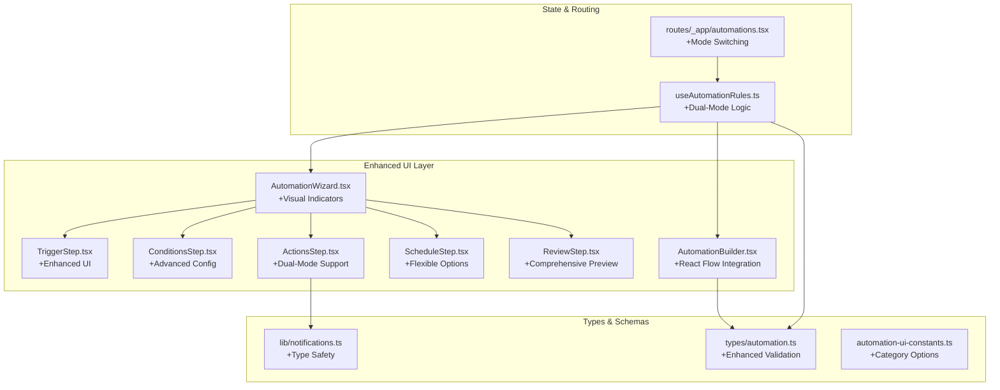
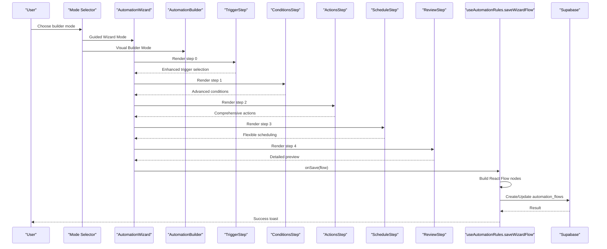
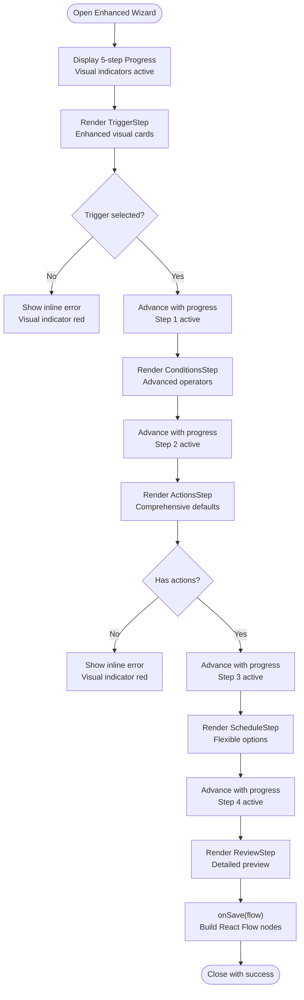
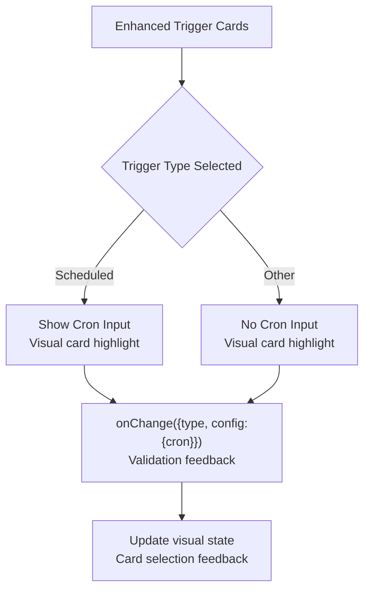
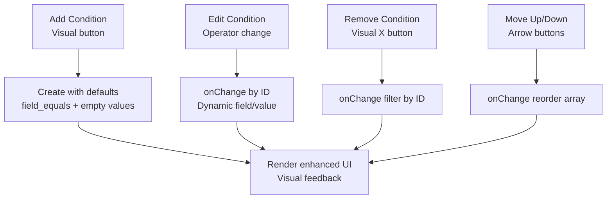
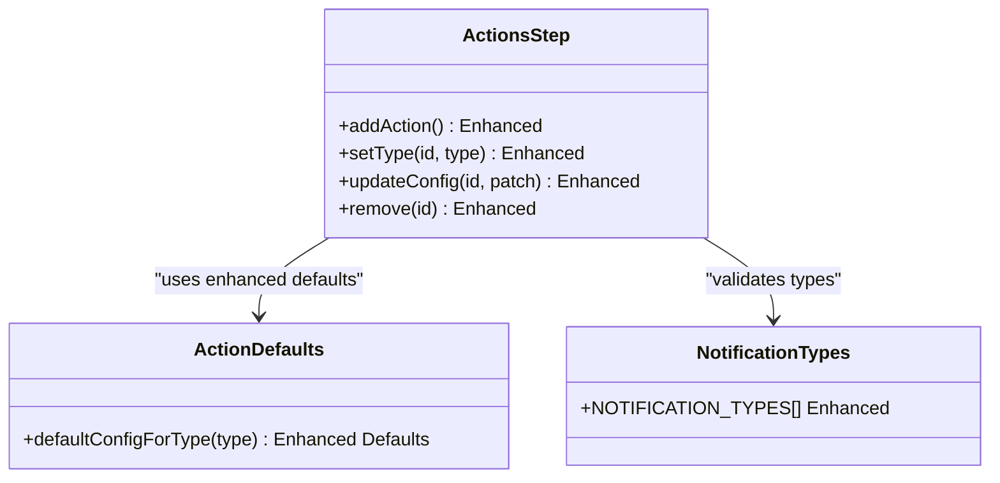
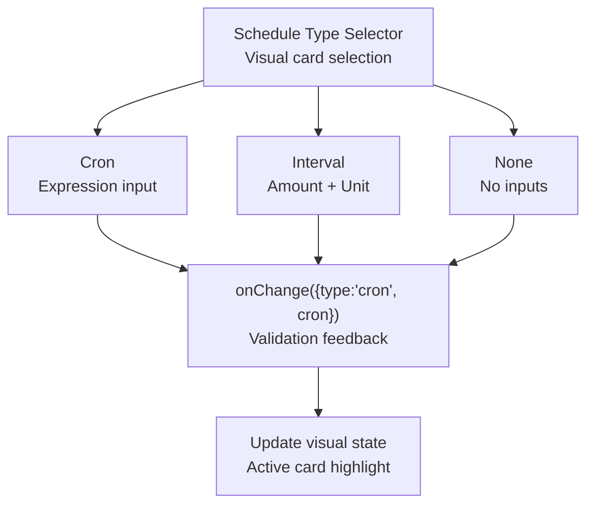
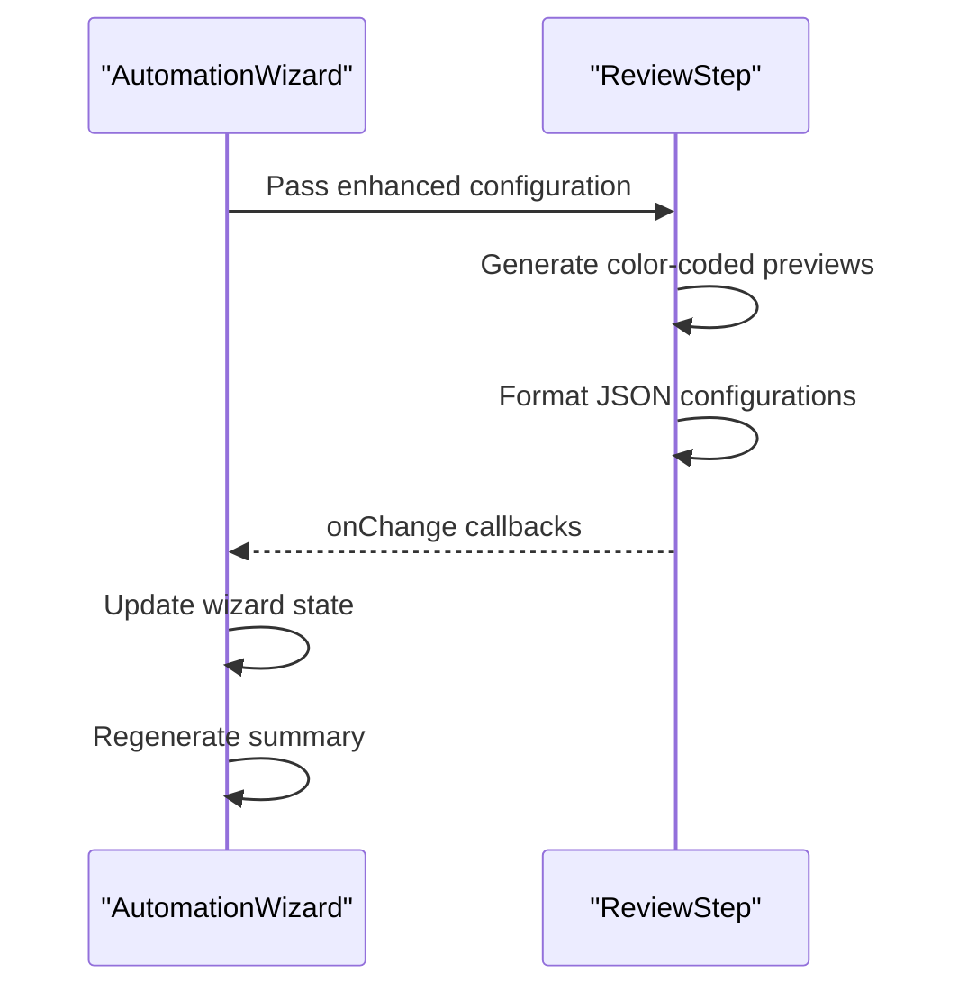
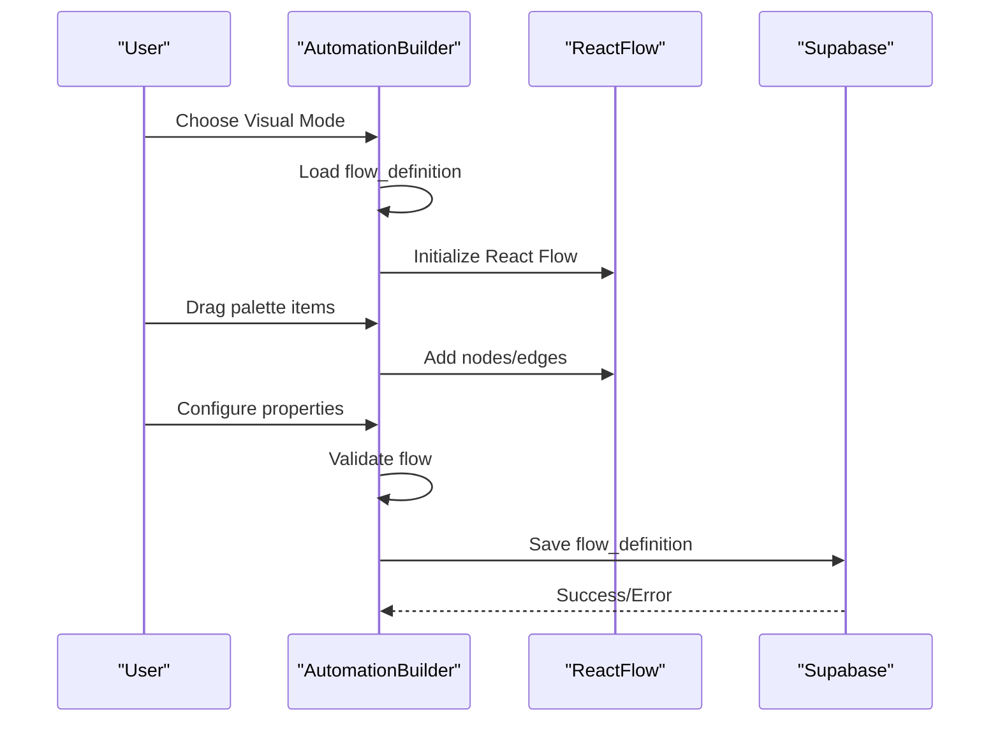
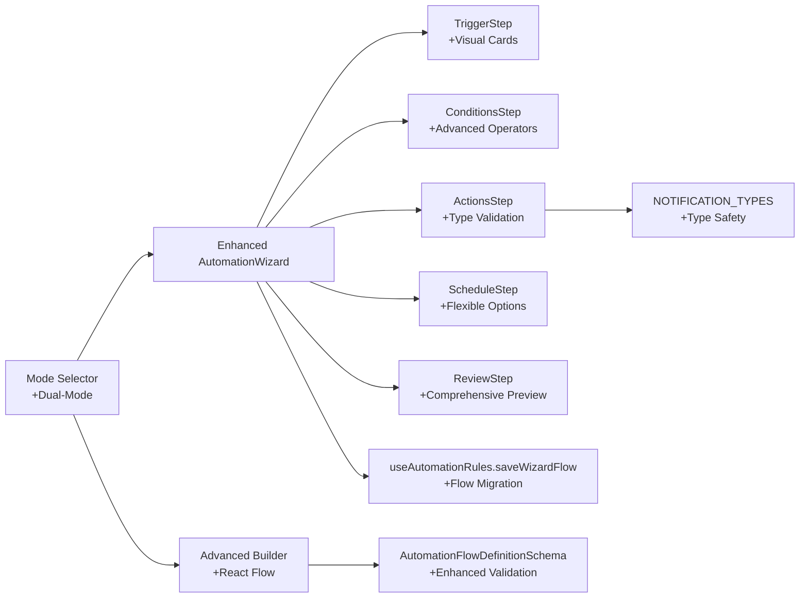

# Automation Flow Builder

<cite>
**Referenced Files in This Document**
- [AutomationWizard.tsx](file://src/components/automations/AutomationWizard.tsx)
- [TriggerStep.tsx](file://src/components/automations/steps/TriggerStep.tsx)
- [ConditionsStep.tsx](file://src/components/automations/steps/ConditionsStep.tsx)
- [ActionsStep.tsx](file://src/components/automations/steps/ActionsStep.tsx)
- [ScheduleStep.tsx](file://src/components/automations/steps/ScheduleStep.tsx)
- [ReviewStep.tsx](file://src/components/automations/steps/ReviewStep.tsx)
- [AutomationBuilder.tsx](file://src/components/pcready/automation/AutomationBuilder.tsx)
- [useAutomationRules.ts](file://src/hooks/useAutomationRules.ts)
- [automations.tsx](file://src/routes/_app/automations.tsx)
- [automation.ts](file://src/types/automation.ts)
- [notifications.ts](file://src/lib/notifications.ts)
- [automation-ui-constants.ts](file://src/lib/automations/automation-ui-constants.ts)
</cite>

## Update Summary
**Changes Made**
- Enhanced AutomationWizard with improved visual step indicators and progress tracking
- Added dual-mode builder support (guided wizard + advanced visual builder)
- Improved error handling and validation across all steps
- Enhanced action configuration options with more sophisticated defaults
- Added advanced visual builder with React Flow integration
- Implemented comprehensive flow migration from wizard to visual format

## Table of Contents
1. [Introduction](#introduction)
2. [Project Structure](#project-structure)
3. [Core Components](#core-components)
4. [Architecture Overview](#architecture-overview)
5. [Detailed Component Analysis](#detailed-component-analysis)
6. [Dependency Analysis](#dependency-analysis)
7. [Performance Considerations](#performance-considerations)
8. [Troubleshooting Guide](#troubleshooting-guide)
9. [Conclusion](#conclusion)
10. [Appendices](#appendices)

## Introduction
This document describes the enhanced Automation Flow Builder interface used to construct complex automation rules through a guided wizard system. The system now features a five-step wizard process with improved visual indicators, comprehensive validation, and dual-mode builder support (guided wizard and advanced visual builder). It focuses on creating triggers, conditions, actions, scheduling, and review/publish flows with enhanced user experience and advanced configuration options.

## Project Structure
The Automation Flow Builder spans several modules with enhanced integration:
- **Enhanced Wizard-based guided builder** under the automations folder with visual step indicators
- **Advanced visual builder** powered by React Flow for complex flow construction
- **Dual-mode architecture** supporting both guided wizard and visual builder approaches
- **Route and state management hooks** coordinating creation, updates, and persistence
- **Types and schemas** for automation flows and run logs with comprehensive validation
- **Notifications library** supporting in-app notifications with enhanced type safety

**Diagram sources**
- [AutomationWizard.tsx:15-21](file://src/components/automations/AutomationWizard.tsx#L15-L21)
- [TriggerStep.tsx:4-45](file://src/components/automations/steps/TriggerStep.tsx#L4-L45)
- [ConditionsStep.tsx:8-18](file://src/components/automations/steps/ConditionsStep.tsx#L8-L18)
- [ActionsStep.tsx:7-44](file://src/components/automations/steps/ActionsStep.tsx#L7-L44)
- [ScheduleStep.tsx:1-39](file://src/components/automations/steps/ScheduleStep.tsx#L1-L39)
- [ReviewStep.tsx:1-196](file://src/components/automations/steps/ReviewStep.tsx#L1-L196)
- [AutomationBuilder.tsx:1-527](file://src/components/pcready/automation/AutomationBuilder.tsx#L1-L527)
- [useAutomationRules.ts:87-88](file://src/hooks/useAutomationRules.ts#L87-L88)
- [automations.tsx:286-301](file://src/routes/_app/automations.tsx#L286-L301)
- [automation.ts:4-19](file://src/types/automation.ts#L4-L19)
- [notifications.ts:6-16](file://src/lib/notifications.ts#L6-L16)
- [automation-ui-constants.ts:1](file://src/lib/automations/automation-ui-constants.ts#L1)

**Section sources**
- [automations.tsx:286-301](file://src/routes/_app/automations.tsx#L286-L301)
- [useAutomationRules.ts:87-88](file://src/hooks/useAutomationRules.ts#L87-L88)

## Core Components
- **Enhanced AutomationWizard**: Orchestrates the guided five-step process with visual step indicators, comprehensive validation, and dual-mode support
- **Step Components**:
  - **TriggerStep**: Enhanced trigger selection with visual cards and scheduled configuration
  - **ConditionsStep**: Advanced logical conditions with operator selection and dynamic configuration
  - **ActionsStep**: Comprehensive action types with sophisticated defaults and validation
  - **ScheduleStep**: Flexible scheduling options with cron and interval support
  - **ReviewStep**: Detailed summary with comprehensive preview and configuration editing
- **Advanced Visual Builder**: React Flow-powered visual flow editor with drag-and-drop capabilities
- **Dual-Mode Architecture**: Seamless switching between guided wizard and advanced visual builder

Key enhancements:
- **Visual Progress Tracking**: Step-by-step progress indicators with completion states
- **Enhanced Validation**: Comprehensive step validation with inline error handling
- **Dual-Mode Support**: Guided wizard for beginners, visual builder for advanced users
- **Advanced Configuration**: Sophisticated defaults and type-safe action configurations
- **Flow Migration**: Automatic conversion from wizard format to visual React Flow format

**Section sources**
- [AutomationWizard.tsx:15-21](file://src/components/automations/AutomationWizard.tsx#L15-L21)
- [TriggerStep.tsx:4-45](file://src/components/automations/steps/TriggerStep.tsx#L4-L45)
- [ConditionsStep.tsx:8-18](file://src/components/automations/steps/ConditionsStep.tsx#L8-L18)
- [ActionsStep.tsx:7-44](file://src/components/automations/steps/ActionsStep.tsx#L7-L44)
- [ScheduleStep.tsx:1-39](file://src/components/automations/steps/ScheduleStep.tsx#L1-L39)
- [ReviewStep.tsx:1-196](file://src/components/automations/steps/ReviewStep.tsx#L1-L196)
- [AutomationBuilder.tsx:1-527](file://src/components/pcready/automation/AutomationBuilder.tsx#L1-L527)

## Architecture Overview
The enhanced system provides dual-path architecture supporting both guided wizard and advanced visual builder approaches, with seamless flow migration and comprehensive validation.

**Diagram sources**
- [automations.tsx:286-301](file://src/routes/_app/automations.tsx#L286-L301)
- [AutomationWizard.tsx:102-149](file://src/components/automations/AutomationWizard.tsx#L102-L149)
- [useAutomationRules.ts:188-284](file://src/hooks/useAutomationRules.ts#L188-L284)
- [TriggerStep.tsx:62-103](file://src/components/automations/steps/TriggerStep.tsx#L62-L103)
- [ConditionsStep.tsx:27-58](file://src/components/automations/steps/ConditionsStep.tsx#L27-L58)
- [ActionsStep.tsx:53-79](file://src/components/automations/steps/ActionsStep.tsx#L53-L79)
- [ScheduleStep.tsx:14-24](file://src/components/automations/steps/ScheduleStep.tsx#L14-L24)
- [ReviewStep.tsx:28-42](file://src/components/automations/steps/ReviewStep.tsx#L28-L42)

## Detailed Component Analysis

### Enhanced AutomationWizard: Five-Step Process with Visual Indicators
- **Enhanced State Model**:
  - Step index with visual progress tracking
  - Name/description/category configuration
  - Trigger, conditions, actions, schedule definitions
  - Change note for version history
  - Inline error handling with step-specific validation
- **Visual Progress System**:
  - Five-step progress bar with completion indicators
  - Color-coded step states (completed, current, upcoming)
  - Interactive step navigation with validation
- **Enhanced Navigation**:
  - Next validates current step with comprehensive error handling
  - Previous moves backward through validated steps
  - Test button integration for rule validation
- **Advanced Validation**:
  - Step 0 requires trigger selection
  - Step 2 requires at least one action
  - Comprehensive error messaging with visual indicators
- **Flow Generation**:
  - Human-readable summaries from trigger and actions
  - Automatic flow object construction for persistence

**Diagram sources**
- [AutomationWizard.tsx:102-149](file://src/components/automations/AutomationWizard.tsx#L102-L149)
- [AutomationWizard.tsx:49-60](file://src/components/automations/AutomationWizard.tsx#L49-L60)
- [AutomationWizard.tsx:69-81](file://src/components/automations/AutomationWizard.tsx#L69-L81)

**Section sources**
- [AutomationWizard.tsx:15-21](file://src/components/automations/AutomationWizard.tsx#L15-L21)
- [AutomationWizard.tsx:49-60](file://src/components/automations/AutomationWizard.tsx#L49-L60)
- [AutomationWizard.tsx:69-81](file://src/components/automations/AutomationWizard.tsx#L69-L81)
- [AutomationWizard.tsx:102-149](file://src/components/automations/AutomationWizard.tsx#L102-L149)

### Enhanced TriggerStep: Visual Trigger Selection
- **Enhanced Trigger Options** with visual cards:
  - Ticket created/updated with ticket icons
  - Checklist completed with checklist icon
  - Scheduled with clock icon and cron configuration
  - Manual with mouse pointer icon
- **Visual Feedback System**:
  - Color-coded cards with selected state highlighting
  - Icon-based visual indicators
  - Hover and selection states with transitions
- **Advanced Configuration**:
  - Conditional cron expression input for scheduled triggers
  - Comprehensive trigger type selection with descriptions
  - Real-time validation and error handling

**Diagram sources**
- [TriggerStep.tsx:62-103](file://src/components/automations/steps/TriggerStep.tsx#L62-L103)
- [TriggerStep.tsx:105-123](file://src/components/automations/steps/TriggerStep.tsx#L105-L123)

**Section sources**
- [TriggerStep.tsx:4-45](file://src/components/automations/steps/TriggerStep.tsx#L4-L45)
- [TriggerStep.tsx:62-103](file://src/components/automations/steps/TriggerStep.tsx#L62-L103)
- [TriggerStep.tsx:105-123](file://src/components/automations/steps/TriggerStep.tsx#L105-L123)

### Advanced ConditionsStep: Sophisticated Condition Management
- **Enhanced Operator System** with comprehensive options:
  - Field comparison operators (equals, not equals, greater than, less than)
  - String operators (contains, starts with, ends with)
  - Priority and tag filtering
- **Advanced Configuration**:
  - Dynamic field/value input for field comparisons
  - Drag-and-drop reordering with visual indicators
  - Move up/down functionality with disabled states
- **Visual Feedback**:
  - "AND" separators between conditions
  - Empty state with guidance
  - Error state visualization

**Diagram sources**
- [ConditionsStep.tsx:27-58](file://src/components/automations/steps/ConditionsStep.tsx#L27-L58)
- [ConditionsStep.tsx:121-147](file://src/components/automations/steps/ConditionsStep.tsx#L121-L147)

**Section sources**
- [ConditionsStep.tsx:8-18](file://src/components/automations/steps/ConditionsStep.tsx#L8-L18)
- [ConditionsStep.tsx:27-58](file://src/components/automations/steps/ConditionsStep.tsx#L27-L58)
- [ConditionsStep.tsx:121-147](file://src/components/automations/steps/ConditionsStep.tsx#L121-L147)

### Enhanced ActionsStep: Comprehensive Action Configuration
- **Advanced Action Types** with sophisticated defaults:
  - send_email with recipient, subject, body, HTML toggle
  - update_ticket_status with status dropdown and ID fields
  - create_notification with type selection from NOTIFICATION_TYPES
  - update_device_status with device status management
  - assign_ticket with assignee selection
- **Enhanced Configuration**:
  - Type-specific forms with validation
  - Default configuration reset on type change
  - Dynamic field visibility based on action type
- **Visual Design**:
  - Card-based action configuration
  - Type selector with visual feedback
  - Remove action button with visual styling

**Diagram sources**
- [ActionsStep.tsx:53-79](file://src/components/automations/steps/ActionsStep.tsx#L53-L79)
- [notifications.ts:6-16](file://src/lib/notifications.ts#L6-L16)

**Section sources**
- [ActionsStep.tsx:7-44](file://src/components/automations/steps/ActionsStep.tsx#L7-L44)
- [ActionsStep.tsx:53-79](file://src/components/automations/steps/ActionsStep.tsx#L53-L79)
- [notifications.ts:6-16](file://src/lib/notifications.ts#L6-L16)

### Enhanced ScheduleStep: Flexible Scheduling Options
- **Advanced Schedule Types**:
  - None (no scheduling)
  - Cron (standard cron expression)
  - Interval (time-based intervals)
- **Enhanced Configuration**:
  - Conditional rendering based on schedule type
  - Comprehensive cron expression input with validation
  - Interval configuration with units and amounts
- **Visual Feedback**:
  - Type selector with visual indicators
  - Conditional input rendering
  - Clear separation of scheduling options

**Diagram sources**
- [ScheduleStep.tsx:14-24](file://src/components/automations/steps/ScheduleStep.tsx#L14-L24)
- [ScheduleStep.tsx:26-35](file://src/components/automations/steps/ScheduleStep.tsx#L26-L35)

**Section sources**
- [ScheduleStep.tsx:1-39](file://src/components/automations/steps/ScheduleStep.tsx#L1-L39)
- [ScheduleStep.tsx:14-24](file://src/components/automations/steps/ScheduleStep.tsx#L14-L24)
- [ScheduleStep.tsx:26-35](file://src/components/automations/steps/ScheduleStep.tsx#L26-L35)

### Enhanced ReviewStep: Comprehensive Flow Preview
- **Detailed Preview System**:
  - Complete rule summary with trigger and actions
  - Enhanced configuration preview with JSON formatting
  - Category selection with AUTOMATION_CATEGORY_OPTIONS
- **Visual Design**:
  - Color-coded preview sections (blue for trigger, amber for conditions, etc.)
  - Card-based presentation with borders and backgrounds
  - Enhanced typography and spacing
- **Configuration Editing**:
  - Direct editing of name, description, category
  - Real-time summary updates
  - Comprehensive change tracking

**Diagram sources**
- [ReviewStep.tsx:28-42](file://src/components/automations/steps/ReviewStep.tsx#L28-L42)
- [ReviewStep.tsx:95-102](file://src/components/automations/steps/ReviewStep.tsx#L95-L102)
- [ReviewStep.tsx:105-191](file://src/components/automations/steps/ReviewStep.tsx#L105-L191)

**Section sources**
- [ReviewStep.tsx:1-196](file://src/components/automations/steps/ReviewStep.tsx#L1-L196)
- [ReviewStep.tsx:28-42](file://src/components/automations/steps/ReviewStep.tsx#L28-L42)
- [ReviewStep.tsx:95-102](file://src/components/automations/steps/ReviewStep.tsx#L95-L102)
- [ReviewStep.tsx:105-191](file://src/components/automations/steps/ReviewStep.tsx#L105-L191)

### Advanced Visual Builder: React Flow Integration
- **React Flow Canvas** with comprehensive features:
  - Drag-and-drop node creation from palette
  - Connectable edges with conditional branching
  - Visual node selection and property editing
- **Enhanced Node Types**:
  - Trigger nodes with event descriptions
  - Condition nodes with operator configuration
  - Action nodes with specialized configuration panels
- **Advanced Property System**:
  - Node-specific configuration panels
  - Edge branching with True/False labels
  - Real-time flow validation and error reporting
- **Dual-Mode Integration**:
  - Automatic conversion from wizard to visual format
  - Bidirectional flow synchronization
  - Seamless mode switching

**Diagram sources**
- [AutomationBuilder.tsx:44-75](file://src/components/pcready/automation/AutomationBuilder.tsx#L44-L75)
- [AutomationBuilder.tsx:80-91](file://src/components/pcready/automation/AutomationBuilder.tsx#L80-L91)
- [AutomationBuilder.tsx:119-152](file://src/components/pcready/automation/AutomationBuilder.tsx#L119-L152)

**Section sources**
- [AutomationBuilder.tsx:1-527](file://src/components/pcready/automation/AutomationBuilder.tsx#L1-L527)
- [AutomationBuilder.tsx:44-75](file://src/components/pcready/automation/AutomationBuilder.tsx#L44-L75)
- [AutomationBuilder.tsx:80-91](file://src/components/pcready/automation/AutomationBuilder.tsx#L80-L91)
- [AutomationBuilder.tsx:119-152](file://src/components/pcready/automation/AutomationBuilder.tsx#L119-L152)

## Dependency Analysis
- **Enhanced Wizard Integration**: AutomationWizard composes all step components with visual indicators
- **Dual-Mode Architecture**: Route-level mode switching between wizard and visual builder
- **Advanced Builder Integration**: Visual builder uses React Flow with comprehensive node types
- **Enhanced Action Types**: ActionsStep integrates with NOTIFICATION_TYPES for validation
- **Flow Migration Pipeline**: Wizard flows automatically converted to React Flow format

**Diagram sources**
- [AutomationWizard.tsx:5-9](file://src/components/automations/AutomationWizard.tsx#L5-L9)
- [ActionsStep.tsx:7-13](file://src/components/automations/steps/ActionsStep.tsx#L7-L13)
- [notifications.ts:6-16](file://src/lib/notifications.ts#L6-L16)
- [AutomationBuilder.tsx:1-24](file://src/components/pcready/automation/AutomationBuilder.tsx#L1-L24)
- [automation.ts:4-19](file://src/types/automation.ts#L4-L19)
- [automations.tsx:286-301](file://src/routes/_app/automations.tsx#L286-L301)

**Section sources**
- [useAutomationRules.ts:188-284](file://src/hooks/useAutomationRules.ts#L188-L284)
- [automation.ts:23-36](file://src/types/automation.ts#L23-L36)

## Performance Considerations
- **Enhanced Rendering Optimization**:
  - Minimal re-renders through efficient state updates
  - Visual progress tracking with optimized DOM updates
  - Debounced validation for better responsiveness
- **Advanced Builder Performance**:
  - Lazy loading of React Flow components
  - Efficient node/edge state management
  - Optimized drag-and-drop performance
- **Dual-Mode Efficiency**:
  - Mode switching with minimal overhead
  - Shared validation logic across modes
  - Efficient flow migration between formats
- **Memory Management**:
  - Proper cleanup of React Flow instances
  - Efficient state cleanup on component unmount
  - Optimized toast notifications

## Troubleshooting Guide
**Enhanced Common Issues and Resolutions**:
- **Missing trigger or actions**:
  - Symptom: Visual progress indicator shows error state
  - Resolution: Select trigger; add at least one action; check visual validation
- **Empty name in visual builder**:
  - Symptom: Save disabled with visual error indication
  - Resolution: Provide non-empty name; check validation feedback
- **Invalid cron expression**:
  - Symptom: Schedule validation fails with error message
  - Resolution: Enter valid cron expression; check format requirements
- **Notification type validation failure**:
  - Symptom: Action validation fails with type error
  - Resolution: Ensure notification type is in NOTIFICATION_TYPES array
- **Flow migration errors**:
  - Symptom: Wizard to visual conversion fails
  - Resolution: Check flow_definition format; verify React Flow compatibility
- **Mode switching issues**:
  - Symptom: Dual-mode navigation fails
  - Resolution: Ensure proper mode state management; check component loading

**Section sources**
- [AutomationWizard.tsx:49-60](file://src/components/automations/AutomationWizard.tsx#L49-L60)
- [AutomationBuilder.tsx:123-127](file://src/components/pcready/automation/AutomationBuilder.tsx#L123-L127)
- [useAutomationRules.ts:273-284](file://src/hooks/useAutomationRules.ts#L273-L284)
- [notifications.ts:6-16](file://src/lib/notifications.ts#L6-L16)

## Conclusion
The enhanced Automation Flow Builder provides a comprehensive dual-mode solution for creating automation rules:
- **Guided Wizard**: Five-step process with visual indicators for quick, form-driven flows
- **Advanced Visual Builder**: React Flow-powered visual construction for complex, graph-based flows
- **Enhanced Validation**: Comprehensive validation with real-time feedback and error handling
- **Dual-Mode Integration**: Seamless switching between wizard and visual approaches
- **Advanced Configuration**: Sophisticated defaults and type-safe action configurations

Both paths converge into a standardized flow definition suitable for runtime execution and comprehensive auditing.

## Appendices

### Enhanced Concrete Examples from the Codebase
- **Wizard Flow Construction**:
  - Enhanced five-step process with visual indicators and validation
  - Automatic React Flow node generation from wizard inputs
  - See [saveWizardFlow:188-284](file://src/hooks/useAutomationRules.ts#L188-L284)
- **Step Navigation and Validation**:
  - Enhanced step advancement with visual feedback
  - Comprehensive inline error handling with visual indicators
  - See [handleNext/handlePrev/handleSave:69-81](file://src/components/automations/AutomationWizard.tsx#L69-L81)
- **Advanced Builder Save**:
  - React Flow integration with comprehensive validation
  - Visual error feedback and loading states
  - See [handleSave:119-152](file://src/components/pcready/automation/AutomationBuilder.tsx#L119-L152)
- **Enhanced Notification Types**:
  - Comprehensive type validation and safety
  - Enhanced type definitions and validation
  - See [NOTIFICATION_TYPES:6-16](file://src/lib/notifications.ts#L6-L16)
- **Dual-Mode Architecture**:
  - Mode switching with visual indicators
  - Enhanced route-level integration
  - See [mode switching:286-301](file://src/routes/_app/automations.tsx#L286-L301)

### Best Practices for Effective Automation Flows
- **Enhanced Trigger Selection**: Choose specific triggers with clear visual indicators
- **Advanced Condition Design**: Use sophisticated operators for precise filtering
- **Comprehensive Action Planning**: Limit actions to essential steps with proper defaults
- **Flexible Scheduling**: Use appropriate scheduling options with validation
- **Dual-Mode Strategy**: Start with wizard for simple flows, switch to visual for complex automation
- **Version Control**: Utilize change notes for comprehensive audit trails
- **Visual Validation**: Leverage enhanced validation feedback for better user experience