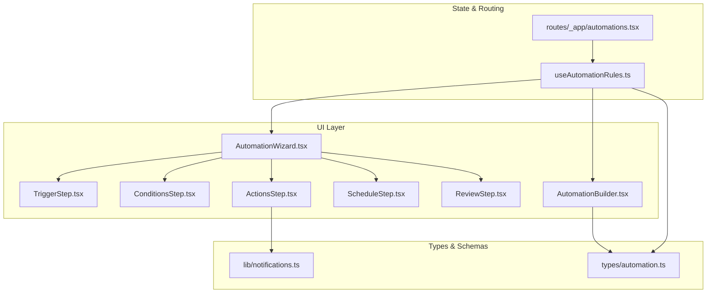
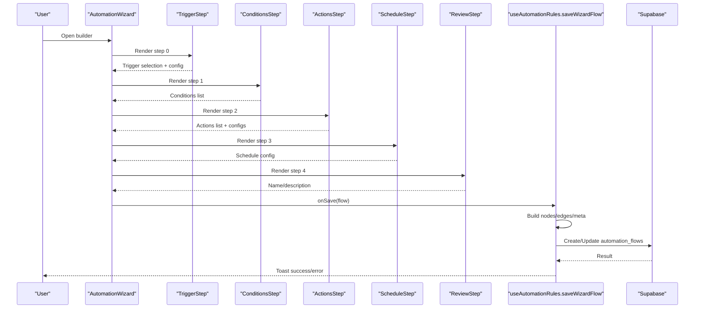
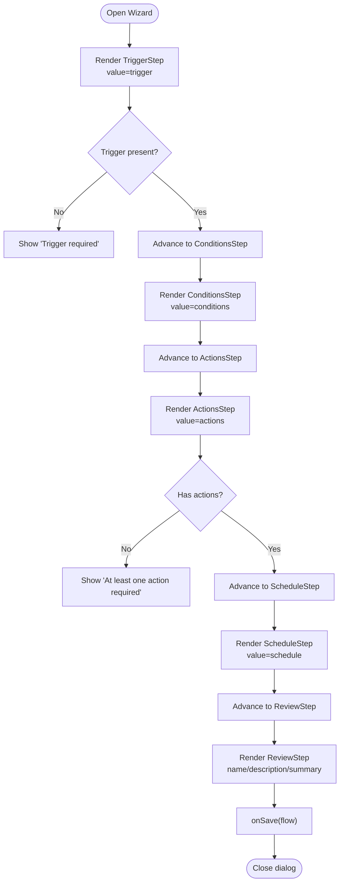
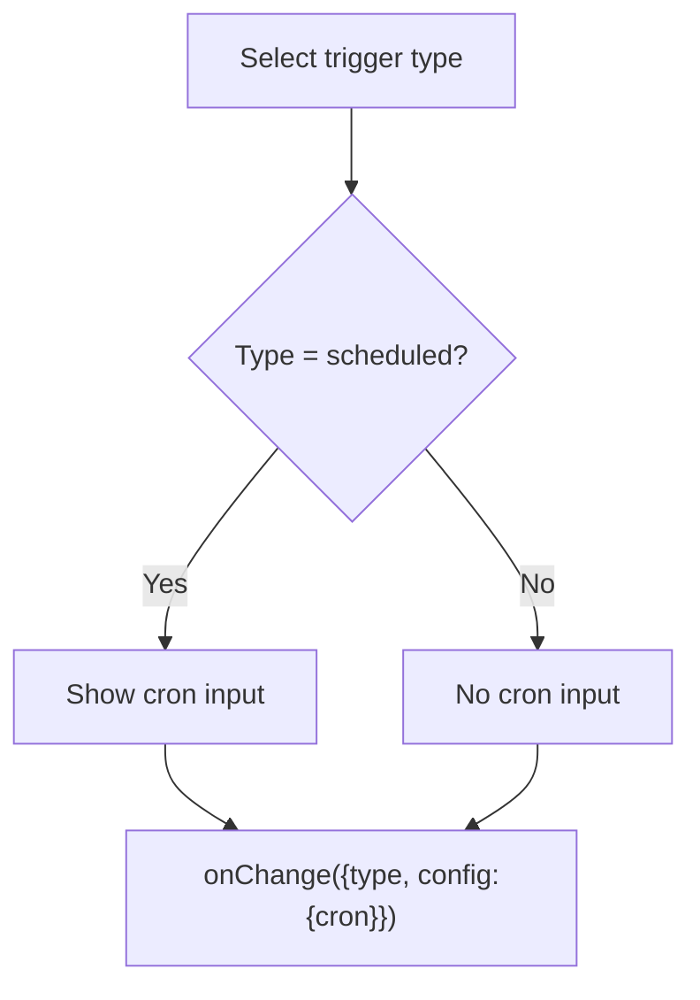
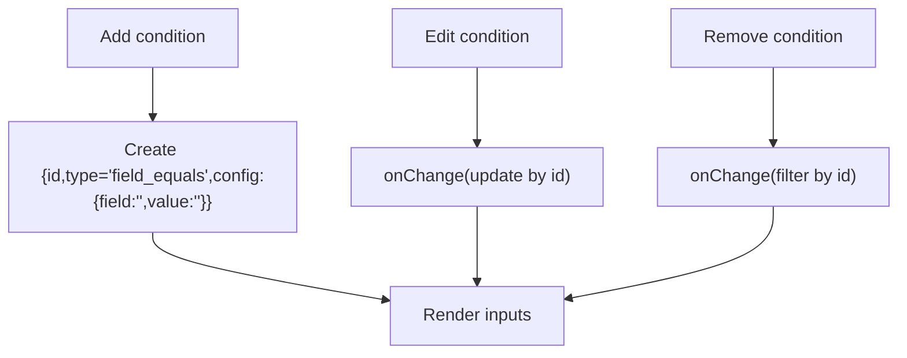
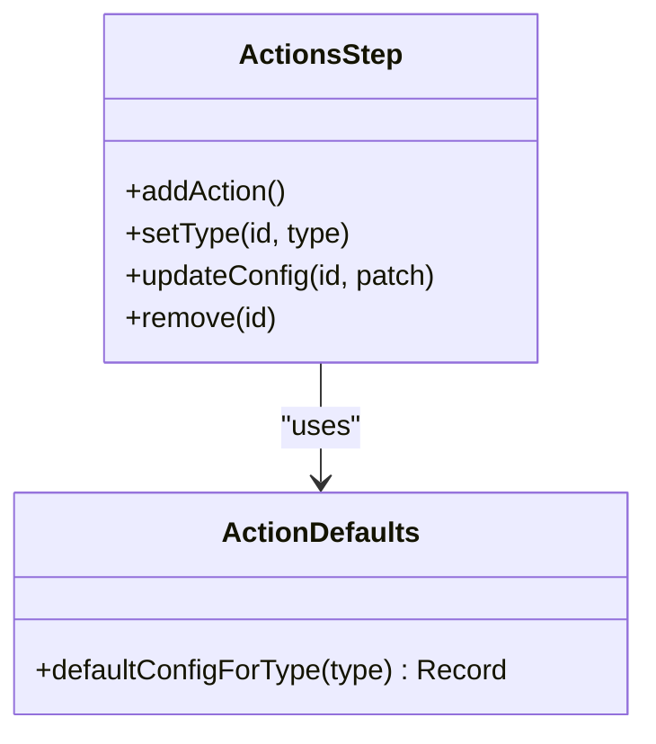
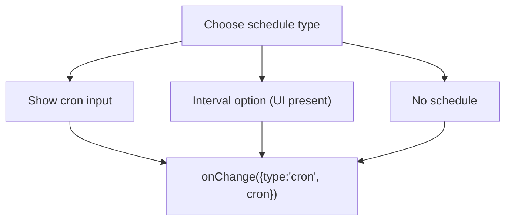
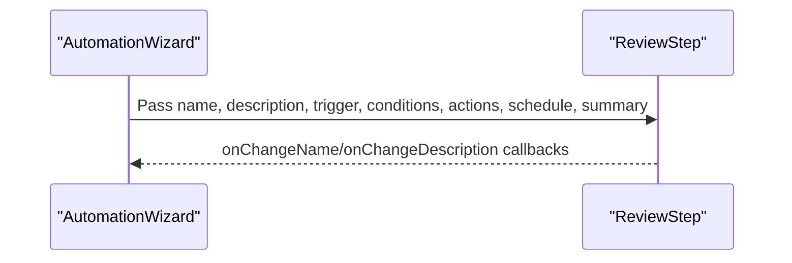
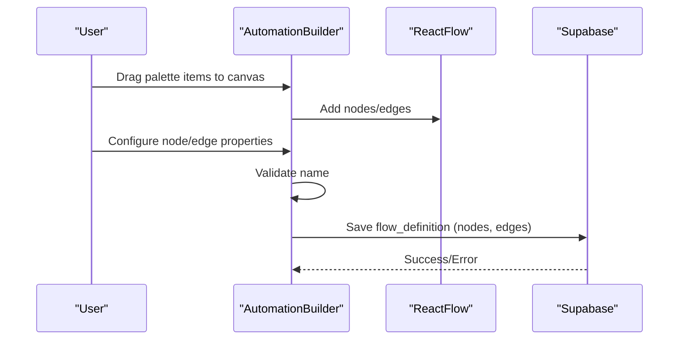
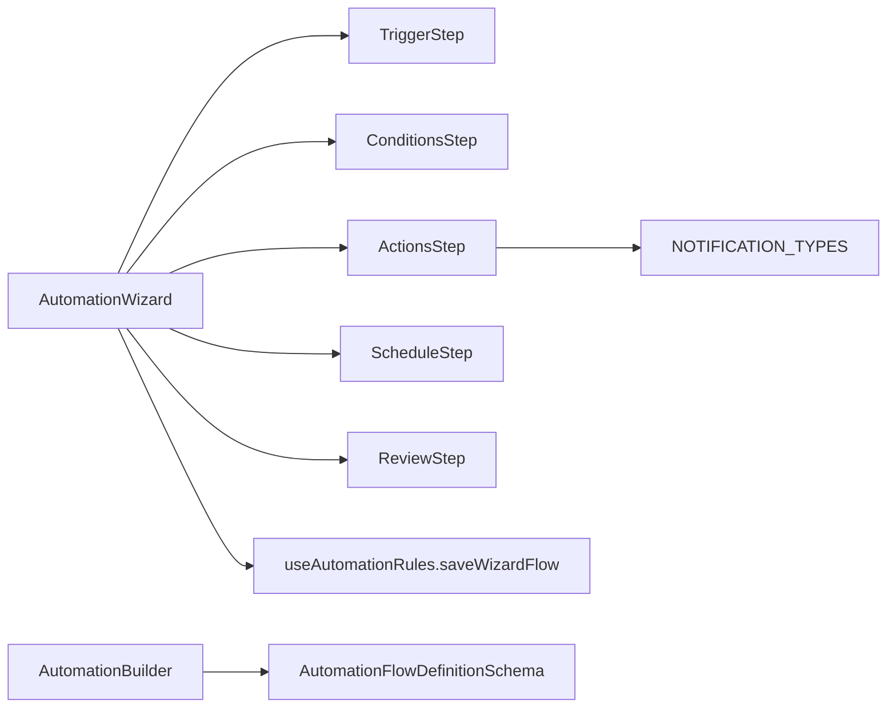

# Automation Flow Builder

<cite>
**Referenced Files in This Document**
- [AutomationWizard.tsx](file://src/components/automations/AutomationWizard.tsx)
- [TriggerStep.tsx](file://src/components/automations/steps/TriggerStep.tsx)
- [ConditionsStep.tsx](file://src/components/automations/steps/ConditionsStep.tsx)
- [ActionsStep.tsx](file://src/components/automations/steps/ActionsStep.tsx)
- [ScheduleStep.tsx](file://src/components/automations/steps/ScheduleStep.tsx)
- [ReviewStep.tsx](file://src/components/automations/steps/ReviewStep.tsx)
- [AutomationBuilder.tsx](file://src/components/pcready/automation/AutomationBuilder.tsx)
- [useAutomationRules.ts](file://src/hooks/useAutomationRules.ts)
- [automations.tsx](file://src/routes/_app/automations.tsx)
- [automation.ts](file://src/types/automation.ts)
- [notifications.ts](file://src/lib/notifications.ts)
</cite>

## Table of Contents
1. [Introduction](#introduction)
2. [Project Structure](#project-structure)
3. [Core Components](#core-components)
4. [Architecture Overview](#architecture-overview)
5. [Detailed Component Analysis](#detailed-component-analysis)
6. [Dependency Analysis](#dependency-analysis)
7. [Performance Considerations](#performance-considerations)
8. [Troubleshooting Guide](#troubleshooting-guide)
9. [Conclusion](#conclusion)
10. [Appendices](#appendices)

## Introduction
This document describes the Automation Flow Builder interface used to construct complex automation rules. It focuses on the guided, multi-step wizard that enables users to define triggers, conditions, actions, scheduling, and review/publish flows. It also covers the advanced visual builder for constructing flow graphs with nodes and edges. The guide explains form handling, validation logic, error states, and user experience considerations, and provides practical examples mapped to the actual codebase.

## Project Structure
The Automation Flow Builder spans several modules:
- Wizard-based guided builder under the automations folder
- Advanced visual builder powered by React Flow
- Route and state management hooks coordinating creation, updates, and persistence
- Types and schemas for automation flows and run logs
- Notifications library supporting in-app notifications

**Diagram sources**
- [AutomationWizard.tsx:1-168](file://src/components/automations/AutomationWizard.tsx#L1-L168)
- [TriggerStep.tsx:1-43](file://src/components/automations/steps/TriggerStep.tsx#L1-L43)
- [ConditionsStep.tsx:1-75](file://src/components/automations/steps/ConditionsStep.tsx#L1-L75)
- [ActionsStep.tsx:1-298](file://src/components/automations/steps/ActionsStep.tsx#L1-L298)
- [ScheduleStep.tsx:1-39](file://src/components/automations/steps/ScheduleStep.tsx#L1-L39)
- [ReviewStep.tsx:1-77](file://src/components/automations/steps/ReviewStep.tsx#L1-L77)
- [AutomationBuilder.tsx:1-200](file://src/components/pcready/automation/AutomationBuilder.tsx#L1-L200)
- [useAutomationRules.ts:1-413](file://src/hooks/useAutomationRules.ts#L1-L413)
- [automations.tsx:1-261](file://src/routes/_app/automations.tsx#L1-L261)
- [automation.ts:1-72](file://src/types/automation.ts#L1-L72)
- [notifications.ts:1-140](file://src/lib/notifications.ts#L1-L140)

**Section sources**
- [automations.tsx:1-261](file://src/routes/_app/automations.tsx#L1-L261)
- [useAutomationRules.ts:1-413](file://src/hooks/useAutomationRules.ts#L1-L413)

## Core Components
- AutomationWizard: orchestrates the guided multi-step process, validates current step, aggregates flow definition, and delegates saving to the parent route handler.
- Steps:
  - TriggerStep: selects trigger type and configures optional cron for scheduled triggers.
  - ConditionsStep: composes logical conditions (field equals, priority high, tag contains) with dynamic addition/removal.
  - ActionsStep: defines automated responses (email, status update, notification, device status, assignment) with per-action forms and defaults.
  - ScheduleStep: optional scheduling via cron or interval.
  - ReviewStep: renders a summary and allows final edits to name/description.
- Advanced Builder (AutomationBuilder): visual flow editor with drag-and-drop nodes, edges, and property panels for triggers, conditions, and actions.

Key responsibilities:
- Form handling: controlled inputs, local state updates, and step navigation.
- Validation: step-specific checks with inline error messages.
- Persistence: transforms wizard flow into a graph-compatible structure and saves via mutation hooks.

**Section sources**
- [AutomationWizard.tsx:13-168](file://src/components/automations/AutomationWizard.tsx#L13-L168)
- [TriggerStep.tsx:1-43](file://src/components/automations/steps/TriggerStep.tsx#L1-L43)
- [ConditionsStep.tsx:1-75](file://src/components/automations/steps/ConditionsStep.tsx#L1-L75)
- [ActionsStep.tsx:1-298](file://src/components/automations/steps/ActionsStep.tsx#L1-L298)
- [ScheduleStep.tsx:1-39](file://src/components/automations/steps/ScheduleStep.tsx#L1-L39)
- [ReviewStep.tsx:1-77](file://src/components/automations/steps/ReviewStep.tsx#L1-L77)
- [AutomationBuilder.tsx:1-200](file://src/components/pcready/automation/AutomationBuilder.tsx#L1-L200)

## Architecture Overview
The wizard and advanced builder feed into a unified persistence pipeline that converts the user’s intent into a structured flow definition compatible with the runtime engine.

**Diagram sources**
- [AutomationWizard.tsx:58-86](file://src/components/automations/AutomationWizard.tsx#L58-L86)
- [useAutomationRules.ts:135-231](file://src/hooks/useAutomationRules.ts#L135-L231)
- [TriggerStep.tsx:13-39](file://src/components/automations/steps/TriggerStep.tsx#L13-L39)
- [ConditionsStep.tsx:12-25](file://src/components/automations/steps/ConditionsStep.tsx#L12-L25)
- [ActionsStep.tsx:53-78](file://src/components/automations/steps/ActionsStep.tsx#L53-L78)
- [ScheduleStep.tsx:13-35](file://src/components/automations/steps/ScheduleStep.tsx#L13-L35)
- [ReviewStep.tsx:27-73](file://src/components/automations/steps/ReviewStep.tsx#L27-L73)

## Detailed Component Analysis

### AutomationWizard: Multi-step orchestration and validation
- State model:
  - Step index, name/description, trigger, conditions, actions, schedule, change note, and inline errors.
- Navigation:
  - Next validates current step and advances; Prev moves backward.
- Validation:
  - Step 0 requires a trigger.
  - Step 2 requires at least one action.
- Summary generation:
  - Builds a human-readable summary from trigger and actions.
- Save:
  - Constructs a flow object and invokes onSave with the final structure.

**Diagram sources**
- [AutomationWizard.tsx:36-86](file://src/components/automations/AutomationWizard.tsx#L36-L86)

**Section sources**
- [AutomationWizard.tsx:22-86](file://src/components/automations/AutomationWizard.tsx#L22-L86)

### TriggerStep: Event triggers and scheduled configuration
- Provides a dropdown to choose a trigger type.
- Supports a scheduled trigger with a cron expression input.
- Updates parent state with a minimal config object when changed.

**Diagram sources**
- [TriggerStep.tsx:13-39](file://src/components/automations/steps/TriggerStep.tsx#L13-L39)

**Section sources**
- [TriggerStep.tsx:1-43](file://src/components/automations/steps/TriggerStep.tsx#L1-L43)

### ConditionsStep: Logical conditions and filters
- Dynamically adds/removes conditions with unique IDs.
- Supports multiple condition types (field equals, priority high, tag contains).
- For field_equals, captures field and value.

**Diagram sources**
- [ConditionsStep.tsx:12-25](file://src/components/automations/steps/ConditionsStep.tsx#L12-L25)

**Section sources**
- [ConditionsStep.tsx:1-75](file://src/components/automations/steps/ConditionsStep.tsx#L1-L75)

### ActionsStep: Automated responses and configurations
- Predefined action types with sensible defaults:
  - send_email (to, subject, body, is_html)
  - update_ticket_status (ticket_id, status)
  - create_notification (user_id, type, title, body, link)
  - update_device_status (device_id, status)
  - assign_ticket (ticket_id, assignee_id)
- Per-type forms render conditionally; supports dynamic type switching with default config reset.

**Diagram sources**
- [ActionsStep.tsx:29-78](file://src/components/automations/steps/ActionsStep.tsx#L29-L78)

**Section sources**
- [ActionsStep.tsx:1-298](file://src/components/automations/steps/ActionsStep.tsx#L1-L298)
- [notifications.ts:6-16](file://src/lib/notifications.ts#L6-L16)

### ScheduleStep: Time-based automation rules
- Optional scheduling with type selection (none, cron, interval).
- Renders cron expression input when applicable.

**Diagram sources**
- [ScheduleStep.tsx:13-35](file://src/components/automations/steps/ScheduleStep.tsx#L13-L35)

**Section sources**
- [ScheduleStep.tsx:1-39](file://src/components/automations/steps/ScheduleStep.tsx#L1-L39)

### ReviewStep: Summary and finalization
- Displays name, description, trigger, actions, and optional schedule.
- Allows editing name/description prior to save.

**Diagram sources**
- [ReviewStep.tsx:27-73](file://src/components/automations/steps/ReviewStep.tsx#L27-L73)

**Section sources**
- [ReviewStep.tsx:1-77](file://src/components/automations/steps/ReviewStep.tsx#L1-L77)

### Advanced Builder (AutomationBuilder): Visual flow construction
- React Flow canvas with draggable nodes and connectable edges.
- Palette of triggers, conditions, and actions; property panel for editing node/edge data.
- Saves the entire flow_definition (nodes, edges) plus metadata to Supabase.

**Diagram sources**
- [AutomationBuilder.tsx:80-152](file://src/components/pcready/automation/AutomationBuilder.tsx#L80-L152)

**Section sources**
- [AutomationBuilder.tsx:1-200](file://src/components/pcready/automation/AutomationBuilder.tsx#L1-L200)
- [AutomationBuilder.tsx:200-400](file://src/components/pcready/automation/AutomationBuilder.tsx#L200-L400)
- [AutomationBuilder.tsx:400-527](file://src/components/pcready/automation/AutomationBuilder.tsx#L400-L527)

## Dependency Analysis
- Wizard-to-steps: AutomationWizard composes TriggerStep, ConditionsStep, ActionsStep, ScheduleStep, and ReviewStep.
- Wizard-to-state: Uses useAutomationRules.saveWizardFlow to persist flows.
- Advanced builder-to-types: Persists nodes/edges/meta conforming to AutomationFlowDefinitionSchema.
- ActionsStep-to-notifications: Uses NOTIFICATION_TYPES for notification actions.

**Diagram sources**
- [AutomationWizard.tsx:3-7](file://src/components/automations/AutomationWizard.tsx#L3-L7)
- [ActionsStep.tsx:1-13](file://src/components/automations/steps/ActionsStep.tsx#L1-L13)
- [notifications.ts:6-16](file://src/lib/notifications.ts#L6-L16)
- [AutomationBuilder.tsx:1-24](file://src/components/pcready/automation/AutomationBuilder.tsx#L1-L24)
- [automation.ts:4-19](file://src/types/automation.ts#L4-L19)

**Section sources**
- [useAutomationRules.ts:135-231](file://src/hooks/useAutomationRules.ts#L135-L231)
- [automation.ts:23-36](file://src/types/automation.ts#L23-L36)

## Performance Considerations
- Minimize re-renders by updating only affected parts of the flow (per-step state updates).
- Defer heavy UI initialization (e.g., advanced builder) until opened to reduce initial bundle cost.
- Batch updates when adding/removing conditions/actions to avoid excessive renders.
- Use controlled inputs and incremental state changes to keep validation fast and responsive.

## Troubleshooting Guide
Common issues and resolutions:
- Missing trigger or actions:
  - Symptom: Inline error on Next click.
  - Resolution: Select a trigger; add at least one action.
- Empty name in advanced builder:
  - Symptom: Save disabled or error toast.
  - Resolution: Provide a non-empty name before saving.
- Scheduled cron invalid:
  - Symptom: Runtime ignores schedule.
  - Resolution: Enter a valid cron expression.
- Notification type mismatch:
  - Symptom: Save succeeds but notification fails at runtime.
  - Resolution: Ensure the chosen notification type is in NOTIFICATION_TYPES.
- Versioning and change notes:
  - Symptom: Missing audit trail after updates.
  - Resolution: Provide a change note when saving via the wizard; the hook persists versions.

**Section sources**
- [AutomationWizard.tsx:36-49](file://src/components/automations/AutomationWizard.tsx#L36-L49)
- [AutomationBuilder.tsx:119-152](file://src/components/pcready/automation/AutomationBuilder.tsx#L119-L152)
- [useAutomationRules.ts:135-231](file://src/hooks/useAutomationRules.ts#L135-L231)
- [notifications.ts:6-16](file://src/lib/notifications.ts#L6-L16)

## Conclusion
The Automation Flow Builder offers two complementary pathways to define automation rules:
- Guided wizard for quick, form-driven flows with robust validation and review.
- Advanced visual builder for complex, graph-based flows with rich node/edge configuration.

Both paths converge into a standardized flow definition suitable for runtime execution and auditing.

## Appendices

### Concrete Examples from the Codebase
- Wizard flow construction:
  - Building nodes/edges/meta from wizard inputs and saving to automation_flows.
  - See [saveWizardFlow:135-231](file://src/hooks/useAutomationRules.ts#L135-L231).
- Step navigation and validation:
  - Step advancement and inline error handling.
  - See [handleNext/handlePrev/handleSave:58-86](file://src/components/automations/AutomationWizard.tsx#L58-L86).
- Advanced builder save:
  - Saving nodes/edges to flow_definition and validating name.
  - See [handleSave:119-152](file://src/components/pcready/automation/AutomationBuilder.tsx#L119-L152).
- Notification action types:
  - Supported notification types enumeration.
  - See [NOTIFICATION_TYPES:6-16](file://src/lib/notifications.ts#L6-L16).

### Best Practices for Effective Automation Flows
- Keep triggers specific (e.g., “ticket updated” vs. broad “any change”).
- Use conditions to narrow scope (e.g., priority high, tag contains).
- Limit actions to essential steps; chain actions thoughtfully.
- Prefer explicit IDs when the trigger does not supply them.
- Use schedules sparingly and validate cron expressions.
- Document changes with change notes for auditability.