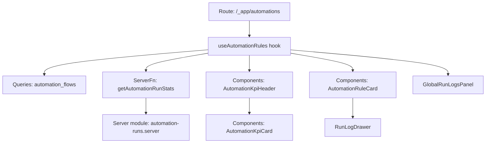
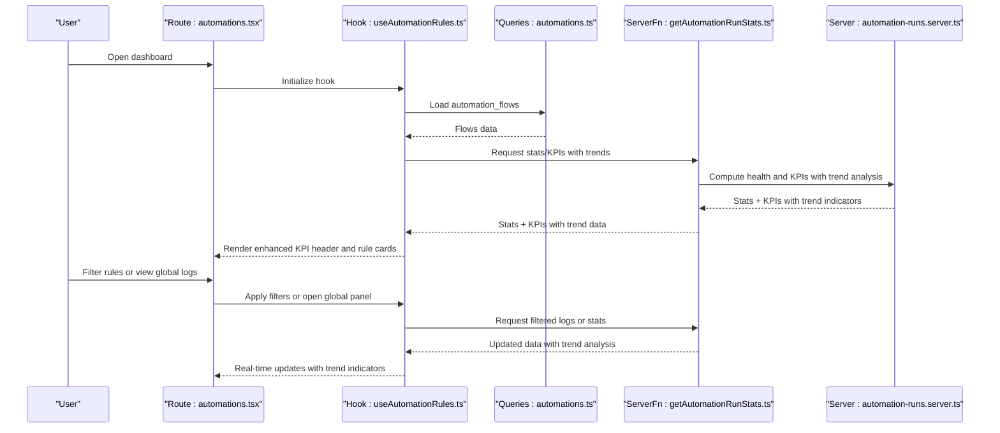
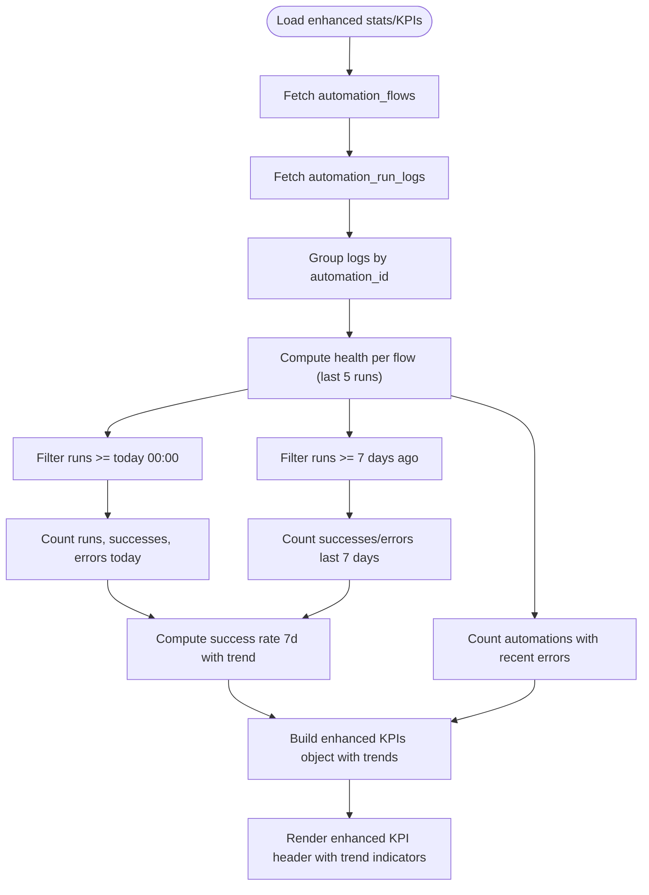
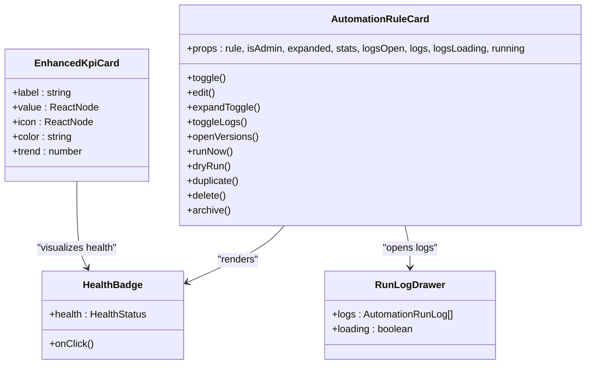
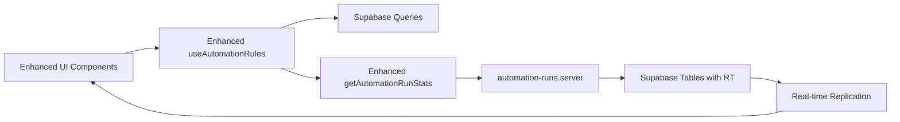

# Automation KPIs and Dashboard

<cite>
**Referenced Files in This Document**
- [automations.tsx](file://src/routes/_app/automations.tsx)
- [AutomationKpiHeader.tsx](file://src/components/automations/AutomationKpiHeader.tsx)
- [AutomationKpiCard.tsx](file://src/components/automations/AutomationKpiCard.tsx)
- [AutomationRuleCard.tsx](file://src/components/automations/AutomationRuleCard.tsx)
- [RunLogDrawer.tsx](file://src/components/automations/RunLogDrawer.tsx)
- [GlobalRunLogsPanel.tsx](file://src/components/automations/GlobalRunLogsPanel.tsx)
- [useAutomationRules.ts](file://src/hooks/useAutomationRules.ts)
- [automation-ui-constants.ts](file://src/lib/automations/automation-ui-constants.ts)
- [automation-runs.ts](file://src/lib/automation-runs.ts)
- [automation-runs.server.ts](file://src/lib/automation-runs.server.ts)
- [automations.ts](file://src/lib/queries/automations.ts)
</cite>

## Update Summary
**Changes Made**
- Enhanced KPI dashboard with new header component displaying key performance indicators
- Improved statistics visualization with trend indicators and color-coded metrics
- Added real-time health monitoring capabilities with automated KPI updates
- Introduced global run logs panel for comprehensive automation monitoring
- Enhanced filter and sorting capabilities for better rule management

## Table of Contents
1. [Introduction](#introduction)
2. [Project Structure](#project-structure)
3. [Core Components](#core-components)
4. [Architecture Overview](#architecture-overview)
5. [Detailed Component Analysis](#detailed-component-analysis)
6. [Enhanced KPI Dashboard](#enhanced-kpi-dashboard)
7. [Global Monitoring System](#global-monitoring-system)
8. [Advanced Filtering and Sorting](#advanced-filtering-and-sorting)
9. [Dependency Analysis](#dependency-analysis)
10. [Performance Considerations](#performance-considerations)
11. [Troubleshooting Guide](#troubleshooting-guide)
12. [Conclusion](#conclusion)
13. [Appendices](#appendices)

## Introduction
This document explains the enhanced automation key performance indicators (KPIs) and dashboard visualization for monitoring automation health, recent activity, and performance trends. The dashboard has been significantly enhanced with a new header component that displays key performance indicators, improved statistics visualization with trend indicators, and real-time health monitoring capabilities. It covers:
- KPI metrics: active automations, runs per day, success rates, and error tracking
- Enhanced dashboard cards with trend visualization and color coding
- Global monitoring system for comprehensive automation oversight
- Advanced filtering and sorting capabilities for rule management
- Real-time updates and health monitoring integration
- Guidance for interpreting automation performance metrics and identifying optimization opportunities

## Project Structure
The automation dashboard is centered around an enhanced route page that renders KPI cards, a rule list, and a builder panel. The new header component provides real-time KPI visualization, while the global monitoring system offers comprehensive oversight. The KPIs and rule cards are powered by an enhanced hook that loads automation flows, statistics, and run logs with advanced filtering capabilities.

**Diagram sources**
- [automations.tsx:28-103](file://src/routes/_app/automations.tsx#L28-L103)
- [useAutomationRules.ts:65-136](file://src/hooks/useAutomationRules.ts#L65-L136)
- [automations.ts:15-17](file://src/lib/queries/automations.ts#L15-L17)
- [automation-runs.ts:183-250](file://src/lib/automation-runs.ts#L183-L250)
- [automation-runs.server.ts:269-277](file://src/lib/automation-runs.server.ts#L269-L277)
- [AutomationKpiHeader.tsx:6-49](file://src/components/automations/AutomationKpiHeader.tsx#L6-L49)
- [AutomationKpiCard.tsx:4-51](file://src/components/automations/AutomationKpiCard.tsx#L4-L51)
- [AutomationRuleCard.tsx:52-228](file://src/components/automations/AutomationRuleCard.tsx#L52-L228)
- [RunLogDrawer.tsx:12-138](file://src/components/automations/RunLogDrawer.tsx#L12-L138)
- [GlobalRunLogsPanel.tsx:31-268](file://src/components/automations/GlobalRunLogsPanel.tsx#L31-L268)

**Section sources**
- [automations.tsx:28-103](file://src/routes/_app/automations.tsx#L28-L103)
- [useAutomationRules.ts:65-136](file://src/hooks/useAutomationRules.ts#L65-L136)
- [automation-runs.ts:183-250](file://src/lib/automation-runs.ts#L183-L250)

## Core Components
- **Enhanced KPI Header**: A new header component that displays four key KPI metrics in a responsive grid layout with trend indicators and color coding
- **KPI Cards**: Improved cards with trend visualization, color-coded status indicators, and enhanced styling for different metric types
- **Rule Cards**: Interactive cards per automation rule with status badges, lifecycle state, recent run counts, and actions to run, dry-run, edit, duplicate, archive, or delete
- **Global Run Logs Panel**: Comprehensive monitoring panel for viewing all automation run logs with filtering, sorting, and export capabilities
- **Run Log Drawer**: Collapsible drawer showing recent run executions with status, duration, trigger payload, and action outcomes
- **Enhanced Hook and Queries**: Centralized logic to load flows, compute stats/KPIs, manage rule lifecycle operations, and handle advanced filtering

**Section sources**
- [AutomationKpiHeader.tsx:6-49](file://src/components/automations/AutomationKpiHeader.tsx#L6-L49)
- [AutomationKpiCard.tsx:4-51](file://src/components/automations/AutomationKpiCard.tsx#L4-L51)
- [AutomationRuleCard.tsx:52-228](file://src/components/automations/AutomationRuleCard.tsx#L52-L228)
- [GlobalRunLogsPanel.tsx:31-268](file://src/components/automations/GlobalRunLogsPanel.tsx#L31-L268)
- [RunLogDrawer.tsx:12-138](file://src/components/automations/RunLogDrawer.tsx#L12-L138)
- [useAutomationRules.ts:65-136](file://src/hooks/useAutomationRules.ts#L65-L136)

## Architecture Overview
The enhanced dashboard architecture separates concerns between UI components, data fetching, and server-side computation with real-time monitoring capabilities:
- **UI**: Renders enhanced KPI header, rule cards, and global monitoring panels
- **Hook**: Orchestrates data loading, filtering, mutations, and real-time updates
- **Server Functions**: Compute KPIs and health indicators from stored run logs with trend analysis
- **Supabase**: Stores automation flows and run logs with real-time replication support

**Diagram sources**
- [automations.tsx:28-103](file://src/routes/_app/automations.tsx#L28-L103)
- [useAutomationRules.ts:65-136](file://src/hooks/useAutomationRules.ts#L65-L136)
- [automations.ts:15-17](file://src/lib/queries/automations.ts#L15-L17)
- [automation-runs.ts:183-250](file://src/lib/automation-runs.ts#L183-L250)
- [automation-runs.server.ts:269-277](file://src/lib/automation-runs.server.ts#L269-L277)

## Detailed Component Analysis

### Enhanced KPI Dashboard
The dashboard now features a sophisticated header component that displays four primary KPIs with trend visualization and color coding:

- **Total Rules**: Count of all automation rules
- **Active / Inactive**: Split count showing active vs inactive rules
- **Runs Today**: Total runs today with color-coded status based on activity level
- **Rules with Errors**: Number of automations with recent errors, color-coded based on severity

These metrics are rendered via an enhanced card component with trend indicators and responsive grid layout.

**Diagram sources**
- [automation-runs.ts:183-250](file://src/lib/automation-runs.ts#L183-L250)
- [useAutomationRules.ts:127-136](file://src/hooks/useAutomationRules.ts#L127-L136)
- [AutomationKpiHeader.tsx:6-49](file://src/components/automations/AutomationKpiHeader.tsx#L6-L49)

**Section sources**
- [automations.tsx:102-103](file://src/routes/_app/automations.tsx#L102-L103)
- [AutomationKpiHeader.tsx:6-49](file://src/components/automations/AutomationKpiHeader.tsx#L6-L49)
- [AutomationKpiCard.tsx:4-51](file://src/components/automations/AutomationKpiCard.tsx#L4-L51)
- [automation-runs.ts:56-63](file://src/lib/automation-runs.ts#L56-L63)
- [automation-runs.ts:237-246](file://src/lib/automation-runs.ts#L237-L246)

### Automation Rule Cards
Each rule card displays:
- Name, category, active state, and last run/update info
- Health badge indicating current health status with enhanced visual indicators
- Success/error counts for the rule
- Action buttons: open editor, run now, dry run, duplicate, archive, delete
- Expandable section to show run logs and version history

Health status is derived from recent run statuses and mapped to enhanced visual badges. When degraded or failing, clicking the badge opens the run log drawer to surface the latest error.

**Diagram sources**
- [AutomationRuleCard.tsx:52-228](file://src/components/automations/AutomationRuleCard.tsx#L52-L228)
- [RunLogDrawer.tsx:12-138](file://src/components/automations/RunLogDrawer.tsx#L12-L138)
- [AutomationKpiCard.tsx:4-51](file://src/components/automations/AutomationKpiCard.tsx#L4-L51)

**Section sources**
- [AutomationRuleCard.tsx:24-50](file://src/components/automations/AutomationRuleCard.tsx#L24-L50)
- [AutomationRuleCard.tsx:92-228](file://src/components/automations/AutomationRuleCard.tsx#L92-L228)
- [RunLogDrawer.tsx:12-138](file://src/components/automations/RunLogDrawer.tsx#L12-L138)

### Data Aggregation and Time-Based Calculations
- **Active automations**: Count of flows where active is true
- **Runs today**: Count of logs with triggered_at >= today 00:00
- **Success today**: Count of success logs today
- **Error today**: Count of error logs today
- **Success rate (7 days)**: (successes last 7 days) / (successes + errors last 7 days) × 100 with trend calculation
- **Automations with recent errors**: Count of flows whose most recent runs include an error

These computations occur server-side with enhanced trend analysis and are returned as part of the enhanced stats/KPIs object.

**Section sources**
- [automation-runs.ts:237-246](file://src/lib/automation-runs.ts#L237-L246)
- [automation-runs.ts:183-250](file://src/lib/automation-runs.ts#L183-L250)

### Real-Time Updates and Enhanced Monitoring
- **Real-time updates**: After manual runs or toggling rules, the hook refetches flows and recomputes stats/KPIs with trend analysis to reflect immediate changes
- **Enhanced filtering and search**: The hook supports category, lifecycle status, trigger type, and error-based filters to narrow the rule list
- **Global monitoring**: Comprehensive logging system with filtering, sorting, and export capabilities for all automation activities
- **Customization**: Users can filter by category, status, trigger type, and error conditions, search by name/summary, and toggle rule activation

**Section sources**
- [useAutomationRules.ts:374-405](file://src/hooks/useAutomationRules.ts#L374-L405)
- [automations.tsx:105-186](file://src/routes/_app/automations.tsx#L105-L186)
- [automation-ui-constants.ts:1-2](file://src/lib/automations/automation-ui-constants.ts#L1-L2)
- [GlobalRunLogsPanel.tsx:31-268](file://src/components/automations/GlobalRunLogsPanel.tsx#L31-L268)

### Interpretation Guidelines and Optimization Opportunities
- **Healthy**: Normal operation with low error rate and recent success
- **Degraded**: Occasional failures; investigate recent errors and action outcomes
- **Failing**: Frequent errors; prioritize fixing triggers/actions and review run logs
- **Never run**: Newly created or inactive flows; activate and run a dry-run to validate

**Enhanced KPI Interpretation**:
- **Total Rules**: Use to assess coverage and operational scope
- **Active / Inactive**: Monitor rule activation balance and maintenance needs
- **Runs Today**: Gauge daily throughput; compare with success and error counts
- **Rules with Errors**: Focus remediation efforts on flows flagged with recent failures

Optimization tips:
- Monitor success rate trends and recent error counts to detect regressions
- Use dry-run to validate changes before enabling rules
- Investigate long-running actions or repeated errors in run logs
- Archive or disable stale rules to reduce noise and maintenance overhead
- Leverage global monitoring for comprehensive system oversight

**Section sources**
- [AutomationRuleCard.tsx:24-50](file://src/components/automations/AutomationRuleCard.tsx#L24-L50)
- [RunLogDrawer.tsx:103-126](file://src/components/automations/RunLogDrawer.tsx#L103-L126)
- [AutomationKpiHeader.tsx:6-49](file://src/components/automations/AutomationKpiHeader.tsx#L6-L49)

## Enhanced KPI Dashboard

### New Header Component Features
The enhanced KPI header provides a comprehensive overview of automation system health with real-time metrics and trend visualization:

**Key Features**:
- **Responsive Grid Layout**: Four KPI cards arranged in a responsive grid (2 columns on mobile, 4 on desktop)
- **Trend Indicators**: Success rate trend displayed with positive/negative coloring
- **Color-Coded Status**: Visual indicators based on metric significance (green for good, red for critical, default for neutral)
- **Icon Integration**: Lucide icons for visual enhancement and quick recognition

**KPI Metrics Displayed**:
1. **Total Rules**: Shows absolute count of all automation rules
2. **Active / Inactive**: Displays split count showing active vs inactive rules
3. **Runs Today**: Shows daily execution count with color coding based on activity level
4. **Rules with Errors**: Displays error count with color coding based on severity threshold

**Section sources**
- [AutomationKpiHeader.tsx:6-49](file://src/components/automations/AutomationKpiHeader.tsx#L6-L49)
- [AutomationKpiCard.tsx:4-51](file://src/components/automations/AutomationKpiCard.tsx#L4-L51)

### Enhanced KPI Card Component
The KPI card component has been enhanced with trend visualization and improved styling:

**Enhanced Features**:
- **Trend Visualization**: Numeric trend indicators with +/- prefix and color coding
- **Improved Color System**: Enhanced color palette for different metric types (green, red, amber, blue, default)
- **Responsive Typography**: Adaptive sizing for different screen dimensions
- **Icon Integration**: Optional icons for visual enhancement

**Color Coding System**:
- **Green**: Positive indicators (success rates, active rules)
- **Red**: Negative indicators (error counts, failing states)
- **Amber**: Warning indicators (degraded states)
- **Blue**: Neutral/neutral indicators (special metrics)
- **Default**: Standard text color for neutral values

**Section sources**
- [AutomationKpiCard.tsx:4-51](file://src/components/automations/AutomationKpiCard.tsx#L4-L51)

## Global Monitoring System

### Global Run Logs Panel
The global monitoring system provides comprehensive oversight of all automation activities:

**Key Features**:
- **Comprehensive Logging**: View all automation run logs across the entire system
- **Advanced Filtering**: Filter by rule, status, date range, and other criteria
- **Export Capabilities**: Export logs to CSV for external analysis
- **Detailed Execution Details**: View trigger payloads, action outcomes, and error details
- **Real-time Updates**: Automatic refresh of log data

**Filtering Options**:
- **Rule Selection**: Filter logs by specific automation rules
- **Status Filtering**: Filter by execution status (success, error, dry-run, skipped)
- **Date Range**: Filter by specific time periods
- **Export Functionality**: Download filtered logs as CSV

**Section sources**
- [GlobalRunLogsPanel.tsx:31-268](file://src/components/automations/GlobalRunLogsPanel.tsx#L31-L268)
- [useAutomationRules.ts:407-463](file://src/hooks/useAutomationRules.ts#L407-L463)

### Health Monitoring Integration
The enhanced dashboard integrates real-time health monitoring with automatic KPI updates:

**Health Monitoring Features**:
- **Automatic KPI Updates**: Real-time computation of KPI metrics after rule operations
- **Health Status Computation**: Enhanced health status calculation based on recent run patterns
- **Error Tracking**: Comprehensive error tracking with trend analysis
- **Performance Metrics**: Success rate calculations with 7-day rolling averages

**Section sources**
- [automation-runs.server.ts:269-277](file://src/lib/automation-runs.server.ts#L269-L277)
- [automation-runs.ts:183-250](file://src/lib/automation-runs.ts#L183-L250)

## Advanced Filtering and Sorting

### Enhanced Filter System
The dashboard now supports advanced filtering and sorting capabilities:

**Filter Categories**:
- **Category Filter**: Filter by automation categories (General, Notification, Status, Scheduling)
- **Lifecycle Status Filter**: Filter by rule lifecycle status (Draft, Validated, Active, Paused, Archived)
- **Trigger Type Filter**: Filter by trigger types (Ticket Created, Ticket Updated, Checklist Completed, Scheduled, Manual)
- **Error Filter**: Filter by error conditions (All, Active, Inactive, With Errors)

**Sorting Options**:
- **Created Date**: Sort by creation date (ascending/descending)
- **Name**: Alphabetical sorting by rule name
- **Last Run**: Sort by last execution time
- **Execution Count**: Sort by number of successful executions

**Section sources**
- [automations.tsx:85-98](file://src/routes/_app/automations.tsx#L85-L98)
- [useAutomationRules.ts:465-532](file://src/hooks/useAutomationRules.ts#L465-L532)
- [automation-ui-constants.ts:1-2](file://src/lib/automations/automation-ui-constants.ts#L1-L2)

## Dependency Analysis
The enhanced dashboard depends on:
- **Supabase tables**: automation_flows and automation_run_logs with real-time replication
- **Server functions**: getAutomationRunStats and related run APIs with trend analysis
- **UI components**: Enhanced KPI header, improved rule cards, and global monitoring panels
- **Hook orchestration**: Loading flows, computing enhanced stats/KPIs, and managing advanced mutations

**Diagram sources**
- [useAutomationRules.ts:65-136](file://src/hooks/useAutomationRules.ts#L65-L136)
- [automation-runs.ts:183-250](file://src/lib/automation-runs.ts#L183-L250)
- [automation-runs.server.ts:269-277](file://src/lib/automation-runs.server.ts#L269-L277)
- [automations.ts:15-17](file://src/lib/queries/automations.ts#L15-L17)

**Section sources**
- [automations.ts:15-179](file://src/lib/queries/automations.ts#L15-L179)
- [automation-runs.ts:183-250](file://src/lib/automation-runs.ts#L183-L250)

## Performance Considerations
- **Enhanced KPI Computation**: Limit recent run logs per rule to a small fixed number to keep UI responsive
- **Trend Analysis**: Compute health on the server using a capped recent window to avoid heavy client-side aggregation
- **Real-time Updates**: Debounce or batch UI refreshes after bulk operations (e.g., toggling many rules)
- **Efficient Filtering**: Use efficient date filters (>= today 00:00, >= 7 days ago) to minimize DB scans
- **Global Monitoring**: Implement pagination for global logs to prevent memory issues with large datasets
- **Responsive Design**: Optimize grid layouts for different screen sizes to maintain performance

## Troubleshooting Guide
Common issues and remedies:
- **No enhanced KPIs displayed**: Verify access token validity and that run logs exist for the selected period
- **Empty rule list**: Confirm flows exist and filters are not overly restrictive
- **Dry-run or run failures**: Inspect run logs for error messages and action outcomes; adjust triggers/actions accordingly
- **Health badge shows failing**: Open the run log drawer to inspect recent errors and take corrective action
- **Global logs not updating**: Check real-time replication status and refresh the global logs panel
- **Filter not working**: Verify filter criteria and ensure the enhanced filtering logic is properly applied

**Section sources**
- [useAutomationRules.ts:374-405](file://src/hooks/useAutomationRules.ts#L374-L405)
- [RunLogDrawer.tsx:12-138](file://src/components/automations/RunLogDrawer.tsx#L12-L138)
- [GlobalRunLogsPanel.tsx:407-463](file://src/hooks/useAutomationRules.ts#L407-L463)

## Conclusion
The enhanced automation dashboard provides a comprehensive and powerful view of automation performance through sophisticated KPIs, trend visualization, and real-time monitoring. The new header component with trend indicators, enhanced KPI cards with color coding, and global monitoring system offer unprecedented insight into automation system health. By combining server-side aggregation with interactive UI components and real-time updates, teams can monitor health, track recent activity, identify optimization opportunities, and maintain reliable automation flows. The advanced filtering and sorting capabilities, combined with comprehensive logging and trend analysis, make this dashboard an essential tool for automation management.

## Appendices

### Enhanced Dashboard Configuration and Metric Interpretation
- **Total Rules**: Use to assess coverage and operational scope
- **Active / Inactive**: Monitor rule activation balance and maintenance needs
- **Runs Today**: Gauge daily throughput; compare with success and error counts
- **Rules with Errors**: Focus remediation efforts on flows flagged with recent failures
- **Success Rate Trends**: Track improvement or degradation over time

### Real-Time Update Behavior
- **Manual runs and toggles**: Trigger immediate refetches of flows and stats/KPIs with trend analysis
- **Global monitoring**: Automatic updates of log data with real-time replication support
- **Health monitoring**: Continuous computation of health indicators with trend analysis

### Advanced Filtering Options
- **Category-based filtering**: Organize rules by functional categories
- **Lifecycle-based filtering**: Manage rules by their current state in the automation lifecycle
- **Trigger-type filtering**: Analyze performance by different trigger mechanisms
- **Error-based filtering**: Focus on problematic rules for remediation