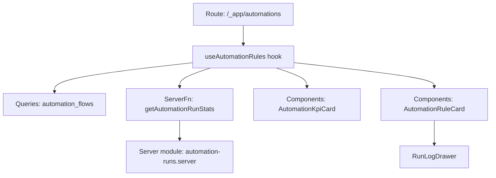
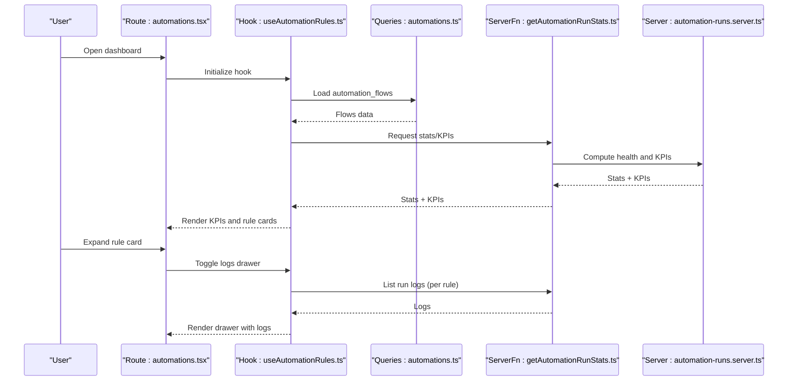
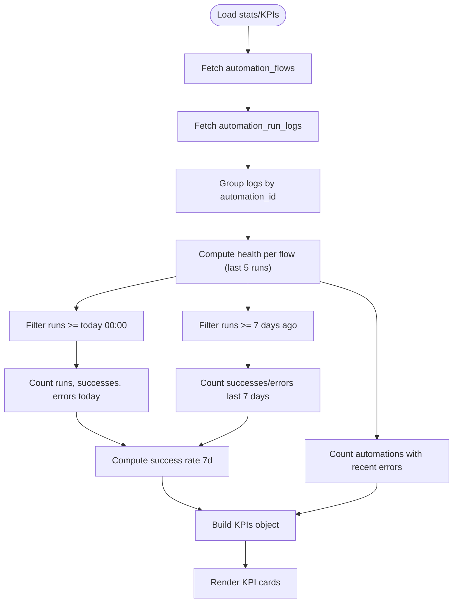
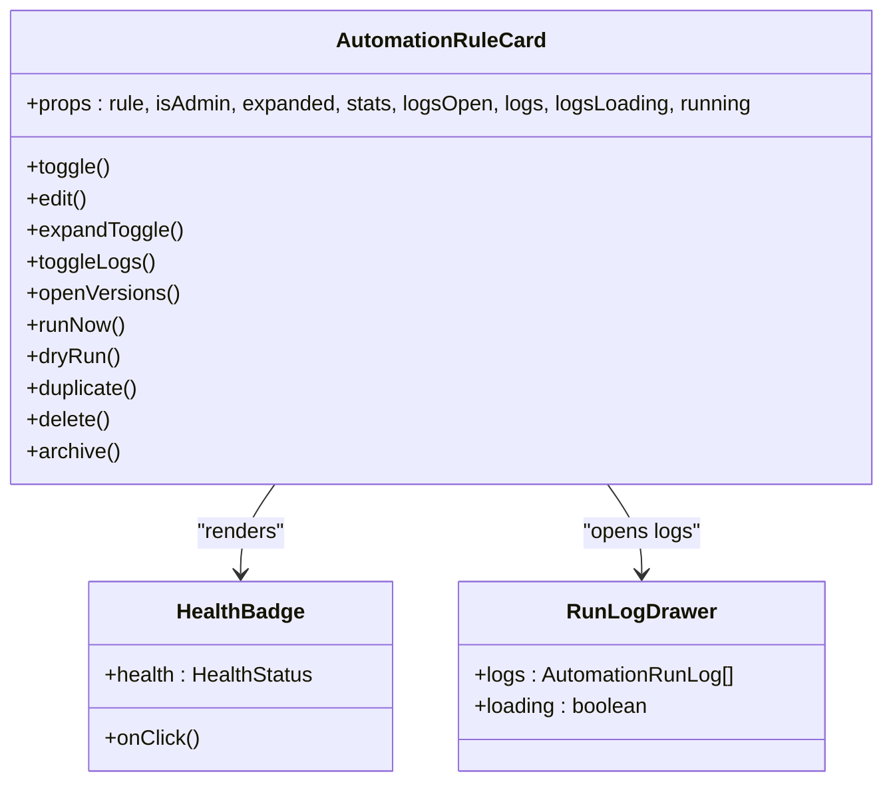
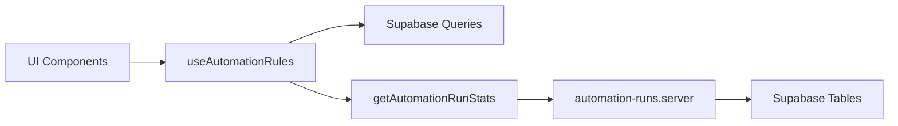

# Automation KPIs and Dashboard

<cite>
**Referenced Files in This Document**
- [automations.tsx](file://src/routes/_app/automations.tsx)
- [AutomationKpiCard.tsx](file://src/components/automations/AutomationKpiCard.tsx)
- [AutomationRuleCard.tsx](file://src/components/automations/AutomationRuleCard.tsx)
- [RunLogDrawer.tsx](file://src/components/automations/RunLogDrawer.tsx)
- [useAutomationRules.ts](file://src/hooks/useAutomationRules.ts)
- [automation-ui-constants.ts](file://src/lib/automations/automation-ui-constants.ts)
- [automation-runs.ts](file://src/lib/automation-runs.ts)
- [automation-runs.server.ts](file://src/lib/automation-runs.server.ts)
- [automations.ts](file://src/lib/queries/automations.ts)
</cite>

## Table of Contents
1. [Introduction](#introduction)
2. [Project Structure](#project-structure)
3. [Core Components](#core-components)
4. [Architecture Overview](#architecture-overview)
5. [Detailed Component Analysis](#detailed-component-analysis)
6. [Dependency Analysis](#dependency-analysis)
7. [Performance Considerations](#performance-considerations)
8. [Troubleshooting Guide](#troubleshooting-guide)
9. [Conclusion](#conclusion)
10. [Appendices](#appendices)

## Introduction
This document explains the automation key performance indicators (KPIs) and dashboard visualization for monitoring automation health, recent activity, and performance trends. It covers:
- KPI metrics: active automations, runs per day, success rates, and error tracking
- Dashboard cards for automation health, recent activity, and performance trends
- Automation rule cards for quick access and management of individual automation flows
- Data aggregation processes and time-based calculations for success rates and health indicators
- Dashboard customization options and real-time updates
- Guidance for interpreting automation performance metrics and identifying optimization opportunities

## Project Structure
The automation dashboard is centered around a route page that renders KPI cards, a rule list, and a builder panel. The KPIs and rule cards are powered by a hook that loads automation flows, statistics, and run logs. The server-side logic computes KPIs and health indicators.

**Diagram sources**
- [automations.tsx:22-160](file://src/routes/_app/automations.tsx#L22-L160)
- [useAutomationRules.ts:32-96](file://src/hooks/useAutomationRules.ts#L32-L96)
- [automations.ts:15-17](file://src/lib/queries/automations.ts#L15-L17)
- [automation-runs.ts:144-210](file://src/lib/automation-runs.ts#L144-L210)
- [automation-runs.server.ts:1-36](file://src/lib/automation-runs.server.ts#L1-L36)
- [AutomationKpiCard.tsx:1-11](file://src/components/automations/AutomationKpiCard.tsx#L1-L11)
- [AutomationRuleCard.tsx:1-228](file://src/components/automations/AutomationRuleCard.tsx#L1-L228)
- [RunLogDrawer.tsx:1-138](file://src/components/automations/RunLogDrawer.tsx#L1-L138)

**Section sources**
- [automations.tsx:22-160](file://src/routes/_app/automations.tsx#L22-L160)
- [useAutomationRules.ts:32-96](file://src/hooks/useAutomationRules.ts#L32-L96)
- [automation-runs.ts:144-210](file://src/lib/automation-runs.ts#L144-L210)

## Core Components
- KPI Cards: Lightweight widgets displaying active automations, runs today, success rate over 7 days, and recent error counts.
- Rule Cards: Interactive cards per automation rule with status badges, lifecycle state, recent run counts, and actions to run, dry-run, edit, duplicate, archive, or delete.
- Run Log Drawer: Collapsible drawer showing recent run executions with status, duration, trigger payload, and action outcomes.
- Hook and Queries: Centralized logic to load flows, compute stats/KPIs, and manage rule lifecycle operations.

**Section sources**
- [AutomationKpiCard.tsx:1-11](file://src/components/automations/AutomationKpiCard.tsx#L1-L11)
- [AutomationRuleCard.tsx:52-228](file://src/components/automations/AutomationRuleCard.tsx#L52-L228)
- [RunLogDrawer.tsx:12-138](file://src/components/automations/RunLogDrawer.tsx#L12-L138)
- [useAutomationRules.ts:32-413](file://src/hooks/useAutomationRules.ts#L32-L413)
- [automations.ts:15-179](file://src/lib/queries/automations.ts#L15-L179)

## Architecture Overview
The dashboard architecture separates concerns between UI components, data fetching, and server-side computation:
- UI: Renders KPIs and rule cards, and displays run logs.
- Hook: Orchestrates data loading, filtering, and mutations.
- Server Functions: Compute KPIs and health indicators from stored run logs.
- Supabase: Stores automation flows and run logs.

**Diagram sources**
- [automations.tsx:22-160](file://src/routes/_app/automations.tsx#L22-L160)
- [useAutomationRules.ts:32-96](file://src/hooks/useAutomationRules.ts#L32-L96)
- [automations.ts:15-17](file://src/lib/queries/automations.ts#L15-L17)
- [automation-runs.ts:144-210](file://src/lib/automation-runs.ts#L144-L210)
- [automation-runs.server.ts:1-36](file://src/lib/automation-runs.server.ts#L1-L36)

## Detailed Component Analysis

### KPI Metrics and Dashboard Cards
The dashboard presents four primary KPIs:
- Active automations: Count of active flows.
- Runs today: Total runs today, shown alongside successes and errors.
- Success rate (7 days): Percentage of successful runs over the last 7 days.
- Recent errors: Number of automations with at least one error in recent runs.

These are rendered via a simple card component and populated by the hook’s stats/KPIs.

**Diagram sources**
- [automation-runs.ts:144-210](file://src/lib/automation-runs.ts#L144-L210)
- [useAutomationRules.ts:74-96](file://src/hooks/useAutomationRules.ts#L74-L96)

**Section sources**
- [automations.tsx:116-127](file://src/routes/_app/automations.tsx#L116-L127)
- [AutomationKpiCard.tsx:1-11](file://src/components/automations/AutomationKpiCard.tsx#L1-L11)
- [automation-runs.ts:56-63](file://src/lib/automation-runs.ts#L56-L63)
- [automation-runs.ts:198-207](file://src/lib/automation-runs.ts#L198-L207)

### Automation Rule Cards
Each rule card displays:
- Name, category, active state, and last run/update info
- Health badge indicating current health status
- Success/error counts for the rule
- Action buttons: open editor, run now, dry run, duplicate, archive, delete
- Expandable section to show run logs and version history

Health status is derived from recent run statuses and mapped to visual badges. When degraded or failing, clicking the badge opens the run log drawer to surface the latest error.

**Diagram sources**
- [AutomationRuleCard.tsx:52-228](file://src/components/automations/AutomationRuleCard.tsx#L52-L228)
- [RunLogDrawer.tsx:12-138](file://src/components/automations/RunLogDrawer.tsx#L12-L138)

**Section sources**
- [AutomationRuleCard.tsx:24-50](file://src/components/automations/AutomationRuleCard.tsx#L24-L50)
- [AutomationRuleCard.tsx:92-228](file://src/components/automations/AutomationRuleCard.tsx#L92-L228)
- [RunLogDrawer.tsx:12-138](file://src/components/automations/RunLogDrawer.tsx#L12-L138)

### Data Aggregation and Time-Based Calculations
- Active automations: Count of flows where active is true.
- Runs today: Count of logs with triggered_at >= today 00:00.
- Success today: Count of success logs today.
- Error today: Count of error logs today.
- Success rate (7 days): (successes last 7 days) / (successes + errors last 7 days) × 100.
- Automations with recent errors: Count of flows whose most recent runs include an error.

These computations occur server-side and are returned as part of the stats/KPIs object.

**Section sources**
- [automation-runs.ts:184-207](file://src/lib/automation-runs.ts#L184-L207)

### Real-Time Updates and Customization
- Real-time updates: After manual runs or toggling rules, the hook refetches flows and recomputes stats/KPIs to reflect immediate changes.
- Filtering and search: The hook supports category, lifecycle status, and free-text search to narrow the rule list.
- Customization: Users can filter by category and status, search by name/summary, and toggle rule activation.

**Section sources**
- [useAutomationRules.ts:351-368](file://src/hooks/useAutomationRules.ts#L351-L368)
- [automations.tsx:79-108](file://src/routes/_app/automations.tsx#L79-L108)
- [automation-ui-constants.ts:1-2](file://src/lib/automations/automation-ui-constants.ts#L1-L2)

### Interpretation Guidelines and Optimization Opportunities
- Healthy: Normal operation with low error rate and recent success.
- Degraded: Occasional failures; investigate recent errors and action outcomes.
- Failing: Frequent errors; prioritize fixing triggers/actions and review run logs.
- Never run: Newly created or inactive flows; activate and run a dry-run to validate.

Optimization tips:
- Monitor success rate trends and recent error counts to detect regressions.
- Use dry-run to validate changes before enabling rules.
- Investigate long-running actions or repeated errors in run logs.
- Archive or disable stale rules to reduce noise and maintenance overhead.

**Section sources**
- [AutomationRuleCard.tsx:24-50](file://src/components/automations/AutomationRuleCard.tsx#L24-L50)
- [RunLogDrawer.tsx:103-126](file://src/components/automations/RunLogDrawer.tsx#L103-L126)

## Dependency Analysis
The dashboard depends on:
- Supabase tables: automation_flows and automation_run_logs
- Server functions: getAutomationRunStats and related run APIs
- UI components: KPI cards, rule cards, and run log drawer
- Hook orchestration: loading flows, computing stats/KPIs, and managing mutations

**Diagram sources**
- [useAutomationRules.ts:32-96](file://src/hooks/useAutomationRules.ts#L32-L96)
- [automation-runs.ts:144-210](file://src/lib/automation-runs.ts#L144-L210)
- [automation-runs.server.ts:1-36](file://src/lib/automation-runs.server.ts#L1-L36)
- [automations.ts:15-17](file://src/lib/queries/automations.ts#L15-L17)

**Section sources**
- [automations.ts:15-179](file://src/lib/queries/automations.ts#L15-L179)
- [automation-runs.ts:144-210](file://src/lib/automation-runs.ts#L144-L210)

## Performance Considerations
- Limit recent run logs per rule to a small fixed number to keep UI responsive.
- Compute health on the server using a capped recent window to avoid heavy client-side aggregation.
- Debounce or batch UI refreshes after bulk operations (e.g., toggling many rules).
- Use efficient date filters (>= today 00:00, >= 7 days ago) to minimize DB scans.

## Troubleshooting Guide
Common issues and remedies:
- No KPIs displayed: Verify access token validity and that run logs exist for the selected period.
- Empty rule list: Confirm flows exist and filters are not overly restrictive.
- Dry-run or run failures: Inspect run logs for error messages and action outcomes; adjust triggers/actions accordingly.
- Health badge shows failing: Open the run log drawer to inspect recent errors and take corrective action.

**Section sources**
- [useAutomationRules.ts:300-316](file://src/hooks/useAutomationRules.ts#L300-L316)
- [RunLogDrawer.tsx:12-138](file://src/components/automations/RunLogDrawer.tsx#L12-L138)

## Conclusion
The automation dashboard provides a concise yet powerful view of automation performance through KPIs and rule cards. By combining server-side aggregation with interactive UI components, teams can monitor health, track recent activity, and quickly identify optimization opportunities. Use the provided filters, dry-run capabilities, and run logs to maintain reliable automation flows.

## Appendices

### Example Dashboard Configuration and Metric Interpretation
- Active automations: Use to assess coverage and operational scope.
- Runs today: Gauge daily throughput; compare with success and error counts.
- Success rate (7 days): Track trend stability; declining rates indicate potential issues.
- Recent errors: Focus remediation efforts on flows flagged with recent failures.

### Real-Time Update Behavior
- Manual runs and toggles trigger immediate refetches of flows and stats/KPIs, ensuring the dashboard reflects the latest state without requiring a page reload.