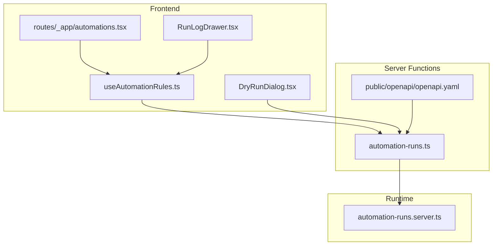
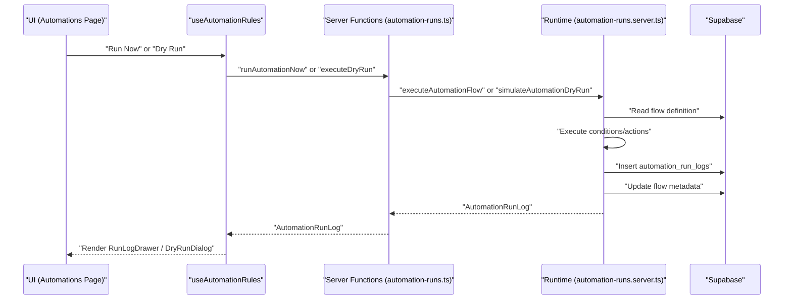
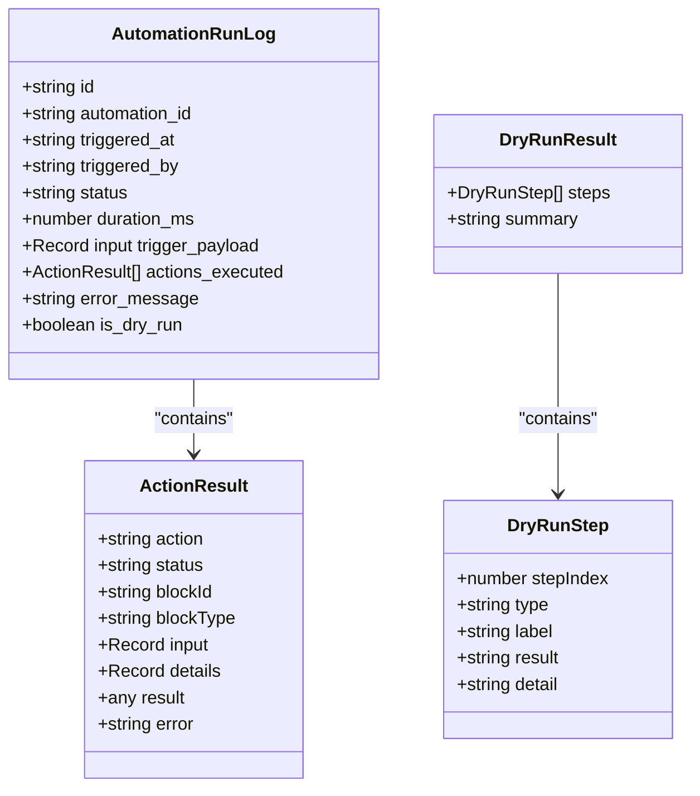
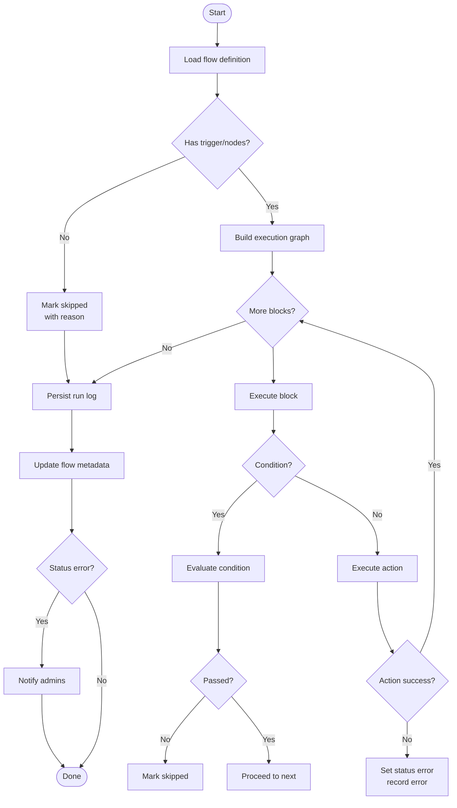
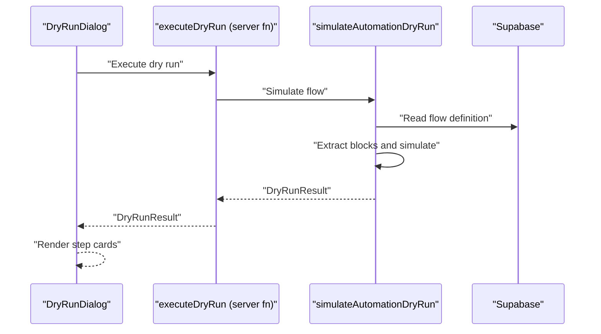
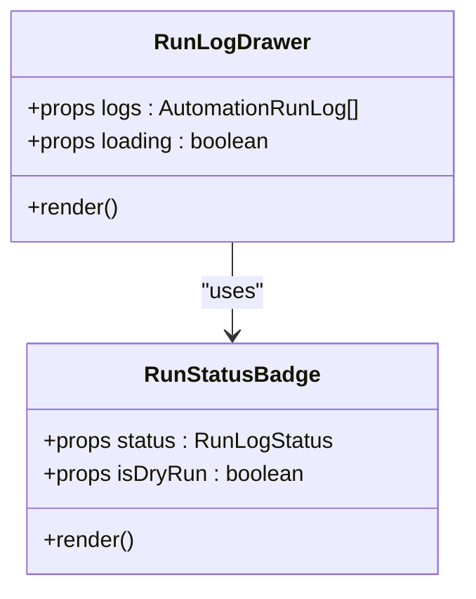
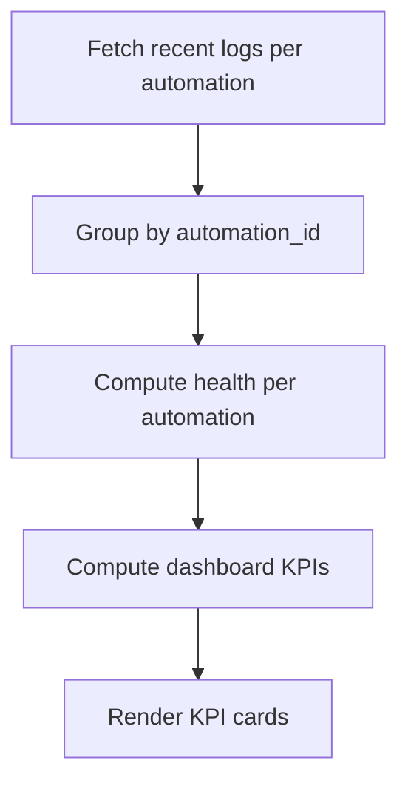
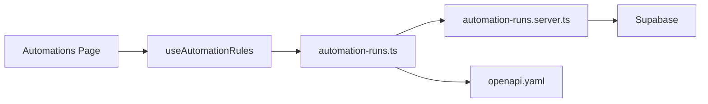

# Automation Monitoring and Logs

<cite>
**Referenced Files in This Document**
- [automation-runs.ts](file://src/lib/automation-runs.ts)
- [automation-runs.server.ts](file://src/lib/automation-runs.server.ts)
- [useAutomationRules.ts](file://src/hooks/useAutomationRules.ts)
- [RunLogDrawer.tsx](file://src/components/automations/RunLogDrawer.tsx)
- [DryRunDialog.tsx](file://src/components/automations/DryRunDialog.tsx)
- [automations.tsx](file://src/routes/_app/automations.tsx)
- [automation.ts](file://src/types/automation.ts)
- [openapi.yaml](file://public/openapi/openapi.yaml)
</cite>

## Table of Contents
1. [Introduction](#introduction)
2. [Project Structure](#project-structure)
3. [Core Components](#core-components)
4. [Architecture Overview](#architecture-overview)
5. [Detailed Component Analysis](#detailed-component-analysis)
6. [Dependency Analysis](#dependency-analysis)
7. [Performance Considerations](#performance-considerations)
8. [Troubleshooting Guide](#troubleshooting-guide)
9. [Conclusion](#conclusion)

## Introduction
This document explains the automation monitoring, logging, and debugging capabilities of the system. It covers:
- The automation run log system: success/error tracking, execution timing, and detailed result reporting
- Dry run functionality for testing automation flows without executing actions
- The run log interface for viewing execution history, status indicators, and error details
- Health monitoring for tracking automation performance and identifying issues
- Log filtering, searching, and exporting capabilities
- Debugging workflows for troubleshooting failed automation executions and performance optimization techniques

## Project Structure
The automation monitoring stack spans frontend UI components, server functions, and backend runtime logic:
- Frontend hooks orchestrate run execution, stats, and logs
- UI components render run history, status badges, and dry-run results
- Server functions expose secure endpoints for manual runs, dry runs, and stats
- Backend runtime executes flows, records logs, and computes health

**Diagram sources**
- [useAutomationRules.ts:32-349](file://src/hooks/useAutomationRules.ts#L32-L349)
- [RunLogDrawer.tsx:12-101](file://src/components/automations/RunLogDrawer.tsx#L12-L101)
- [DryRunDialog.tsx:18-82](file://src/components/automations/DryRunDialog.tsx#L18-L82)
- [automations.tsx:22-260](file://src/routes/_app/automations.tsx#L22-L260)
- [automation-runs.ts:77-155](file://src/lib/automation-runs.ts#L77-L155)
- [automation-runs.server.ts:94-207](file://src/lib/automation-runs.server.ts#L94-L207)
- [openapi.yaml:575-581](file://public/openapi/openapi.yaml#L575-L581)

**Section sources**
- [useAutomationRules.ts:32-349](file://src/hooks/useAutomationRules.ts#L32-L349)
- [RunLogDrawer.tsx:12-101](file://src/components/automations/RunLogDrawer.tsx#L12-L101)
- [DryRunDialog.tsx:18-82](file://src/components/automations/DryRunDialog.tsx#L18-L82)
- [automations.tsx:22-260](file://src/routes/_app/automations.tsx#L22-L260)
- [automation-runs.ts:77-155](file://src/lib/automation-runs.ts#L77-L155)
- [automation-runs.server.ts:94-207](file://src/lib/automation-runs.server.ts#L94-L207)
- [openapi.yaml:575-581](file://public/openapi/openapi.yaml#L575-L581)

## Core Components
- Run log data model and server functions:
  - Run log fields include identifiers, timestamps, status, duration, trigger payload, executed actions, error messages, and dry-run flag
  - Server functions provide listing, manual execution, dry-run simulation, and health computation
- Runtime execution pipeline:
  - Validates flow, executes conditions/actions, records outcomes, persists logs, updates metadata, and notifies failures
- Frontend orchestration:
  - Loads rules, stats, and logs; triggers manual runs and dry runs; renders run history and health KPIs
- UI rendering:
  - Run log drawer displays status badges, timestamps, durations, error messages, and structured action details
  - Dry run dialog shows step-by-step pass/skip/error outcomes

**Section sources**
- [automation-runs.ts:33-44](file://src/lib/automation-runs.ts#L33-L44)
- [automation-runs.ts:77-155](file://src/lib/automation-runs.ts#L77-L155)
- [automation-runs.server.ts:94-207](file://src/lib/automation-runs.server.ts#L94-L207)
- [useAutomationRules.ts:300-349](file://src/hooks/useAutomationRules.ts#L300-L349)
- [RunLogDrawer.tsx:12-101](file://src/components/automations/RunLogDrawer.tsx#L12-L101)
- [DryRunDialog.tsx:18-82](file://src/components/automations/DryRunDialog.tsx#L18-L82)

## Architecture Overview
The system exposes secure endpoints for manual runs and dry runs, backed by a runtime that executes flows and writes logs. Stats and health are computed server-side and surfaced to the UI.

**Diagram sources**
- [automations.tsx:135-159](file://src/routes/_app/automations.tsx#L135-L159)
- [useAutomationRules.ts:318-349](file://src/hooks/useAutomationRules.ts#L318-L349)
- [automation-runs.ts:94-118](file://src/lib/automation-runs.ts#L94-L118)
- [automation-runs.server.ts:94-207](file://src/lib/automation-runs.server.ts#L94-L207)

## Detailed Component Analysis

### Run Log Data Model and Server Functions
- Data model:
  - Run log fields include identifiers, timestamps, status, duration, trigger payload, executed actions, error messages, and dry-run flag
  - Action results capture action name, status, block identity/type, input, details, result, and error
- Server functions:
  - List run logs per automation
  - Manual run endpoint with dry-run toggle
  - Dry-run endpoint for step-by-step simulation
  - Compute health and dashboard KPIs

**Diagram sources**
- [automation-runs.ts:33-44](file://src/lib/automation-runs.ts#L33-L44)
- [automation-runs.ts:8-18](file://src/lib/automation-runs.ts#L8-L18)
- [automation-runs.ts:20-31](file://src/lib/automation-runs.ts#L20-L31)

**Section sources**
- [automation-runs.ts:33-44](file://src/lib/automation-runs.ts#L33-L44)
- [automation-runs.ts:77-155](file://src/lib/automation-runs.ts#L77-L155)
- [automation.ts:47-71](file://src/types/automation.ts#L47-L71)

### Runtime Execution Pipeline
- Flow validation and extraction:
  - Extracts trigger, conditions, and actions from flow definition
  - Builds execution graph for condition/action blocks
- Execution loop:
  - Executes conditions and actions; short-circuits on skip/error
  - Records action results and stops on failure
- Logging and notifications:
  - Persists run log with status, duration, payload, and actions
  - Updates flow metadata and notifies admins on failure

**Diagram sources**
- [automation-runs.server.ts:94-207](file://src/lib/automation-runs.server.ts#L94-L207)
- [automation-runs.server.ts:227-267](file://src/lib/automation-runs.server.ts#L227-L267)

**Section sources**
- [automation-runs.server.ts:94-207](file://src/lib/automation-runs.server.ts#L94-L207)
- [automation-runs.server.ts:227-267](file://src/lib/automation-runs.server.ts#L227-L267)

### Dry Run Functionality
- Purpose:
  - Simulate flow execution without performing real actions
  - Show pass/skip/error outcomes for each step
- Behavior:
  - Extracts trigger, conditions, and actions for dry-run
  - Evaluates conditions and simulates actions
  - Returns a summary and per-step details

**Diagram sources**
- [DryRunDialog.tsx:18-82](file://src/components/automations/DryRunDialog.tsx#L18-L82)
- [automation-runs.ts:110-118](file://src/lib/automation-runs.ts#L110-L118)
- [automation-runs.server.ts:227-267](file://src/lib/automation-runs.server.ts#L227-L267)

**Section sources**
- [DryRunDialog.tsx:18-82](file://src/components/automations/DryRunDialog.tsx#L18-L82)
- [automation-runs.ts:110-118](file://src/lib/automation-runs.ts#L110-L118)
- [automation-runs.server.ts:227-267](file://src/lib/automation-runs.server.ts#L227-L267)

### Run Log Interface
- Drawer:
  - Lists recent runs (default limit) with status badges, timestamps, and durations
  - Expands to show trigger payload and per-action details
  - Displays error messages when present
- Status badges:
  - Visual indicators for success, error, skipped, and dry-run
- Filtering and searching:
  - Category and lifecycle status filters
  - Text search across name and summary

**Diagram sources**
- [RunLogDrawer.tsx:12-101](file://src/components/automations/RunLogDrawer.tsx#L12-L101)

**Section sources**
- [RunLogDrawer.tsx:12-101](file://src/components/automations/RunLogDrawer.tsx#L12-L101)
- [automations.tsx:79-108](file://src/routes/_app/automations.tsx#L79-L108)

### Health Monitoring and KPIs
- Health computation:
  - Based on recent run statuses (last N runs)
  - Classifications: healthy, degraded, failing, never_run
- Dashboard KPIs:
  - Active automations
  - Runs today and success/error counts
  - 7-day success rate
  - Automations with recent errors

**Diagram sources**
- [automation-runs.ts:144-210](file://src/lib/automation-runs.ts#L144-L210)
- [automation-runs.server.ts:269-277](file://src/lib/automation-runs.server.ts#L269-L277)

**Section sources**
- [automation-runs.ts:144-210](file://src/lib/automation-runs.ts#L144-L210)
- [automation-runs.server.ts:269-277](file://src/lib/automation-runs.server.ts#L269-L277)

## Dependency Analysis
- Frontend-to-server:
  - useAutomationRules orchestrates server function calls for runs, dry runs, and stats
  - UI components depend on typed run log models
- Server-to-runtime:
  - Server functions delegate to runtime for execution and persistence
- OpenAPI:
  - Manual run endpoint requires bearer authentication

**Diagram sources**
- [automations.tsx:22-260](file://src/routes/_app/automations.tsx#L22-L260)
- [useAutomationRules.ts:32-349](file://src/hooks/useAutomationRules.ts#L32-L349)
- [automation-runs.ts:77-155](file://src/lib/automation-runs.ts#L77-L155)
- [openapi.yaml:575-581](file://public/openapi/openapi.yaml#L575-L581)
- [automation-runs.server.ts:94-207](file://src/lib/automation-runs.server.ts#L94-L207)

**Section sources**
- [useAutomationRules.ts:32-349](file://src/hooks/useAutomationRules.ts#L32-L349)
- [automation-runs.ts:77-155](file://src/lib/automation-runs.ts#L77-L155)
- [automation-runs.server.ts:94-207](file://src/lib/automation-runs.server.ts#L94-L207)
- [openapi.yaml:575-581](file://public/openapi/openapi.yaml#L575-L581)

## Performance Considerations
- Limit run history:
  - Server-side limit ensures fast loads and bounded memory usage
- Efficient grouping:
  - Group logs by automation_id server-side for quick stats computation
- Minimal UI rendering:
  - Expandable drawers avoid rendering large datasets at once
- Action-level details:
  - Only render expanded details when needed to reduce DOM overhead

[No sources needed since this section provides general guidance]

## Troubleshooting Guide
- Common error patterns:
  - Missing trigger or nodes: flow is marked skipped with a reason
  - Action-level errors: recorded in action result with error message
  - Validation failures: schema parsing errors reported in action results
- Log analysis techniques:
  - Inspect run status and error_message
  - Review actions_executed for failing action and error details
  - Use dry run to validate conditions and actions without side effects
- Debugging workflows:
  - Start with dry run to confirm flow logic
  - For failures, check trigger payload shape and action configurations
  - Verify required IDs (ticket/device/user) are present in payload or config
  - Review health trends and recent error counts
- Exporting and filtering:
  - Current UI supports filtering by category/status and text search
  - Export capability is not exposed in the UI; consider extending server functions to support CSV exports

**Section sources**
- [automation-runs.server.ts:117-169](file://src/lib/automation-runs.server.ts#L117-L169)
- [RunLogDrawer.tsx:34-36](file://src/components/automations/RunLogDrawer.tsx#L34-L36)
- [DryRunDialog.tsx:67-78](file://src/components/automations/DryRunDialog.tsx#L67-L78)
- [automations.tsx:79-108](file://src/routes/_app/automations.tsx#L79-L108)

## Conclusion
The automation monitoring system provides a robust foundation for observing, validating, and optimizing automation flows. It captures detailed execution traces, offers dry-run validation, computes health metrics, and surfaces actionable insights through UI components. Extending filtering/searching and adding export capabilities would further enhance operational visibility.