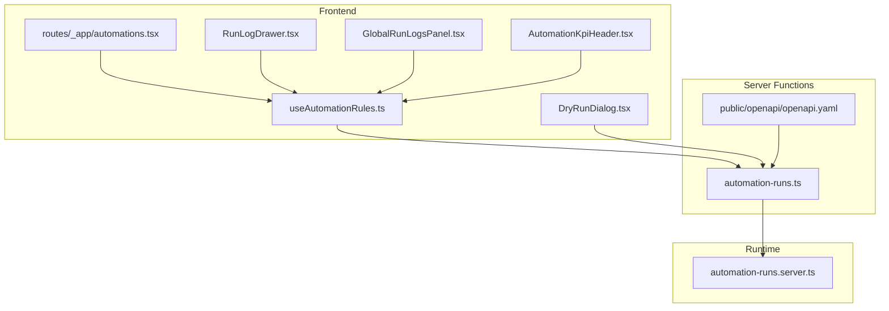
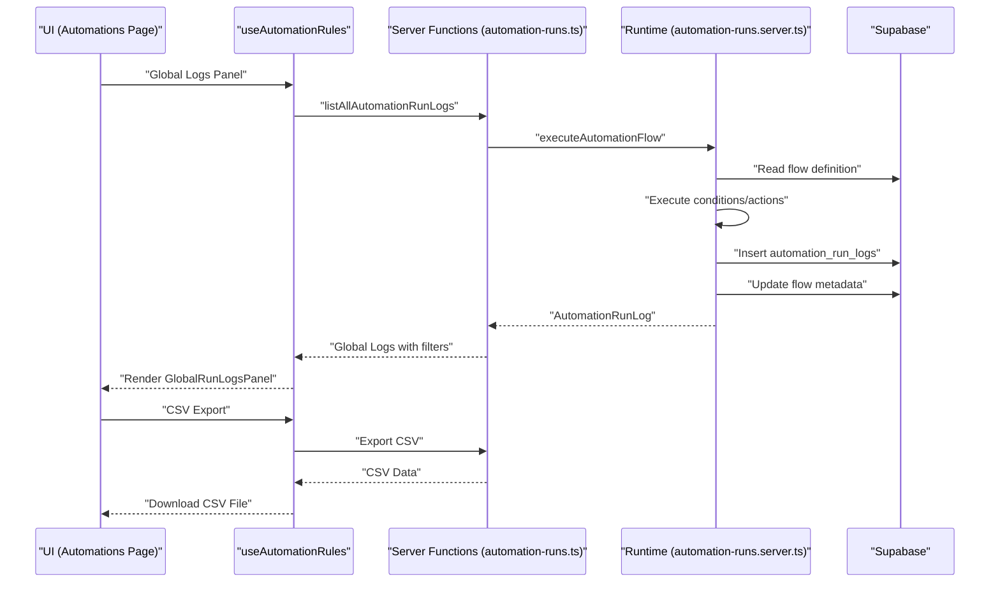
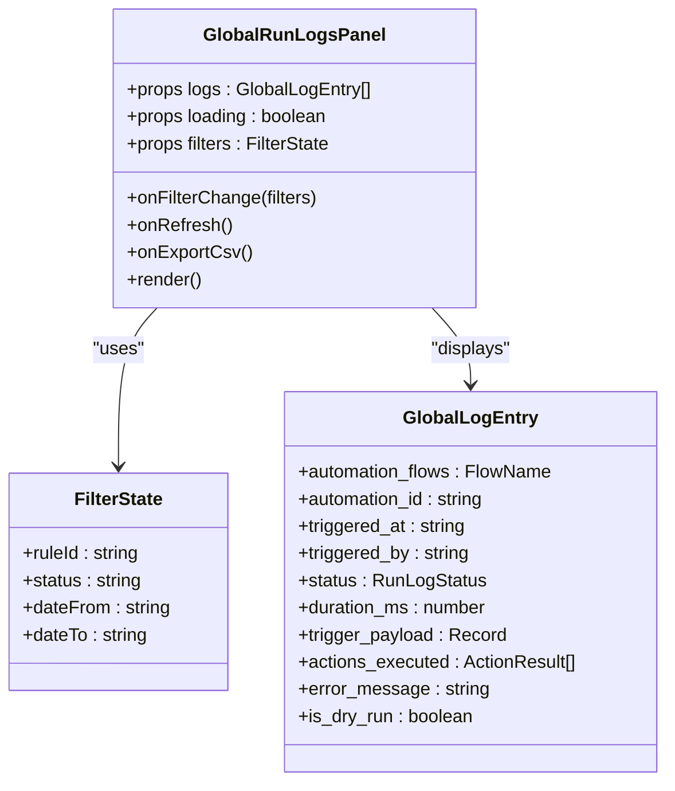
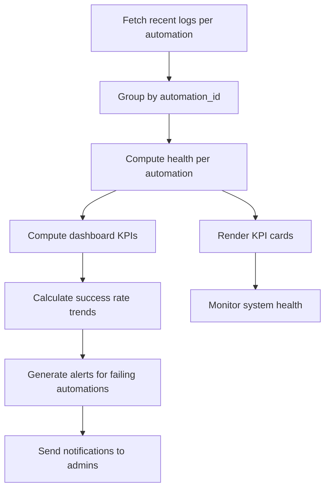
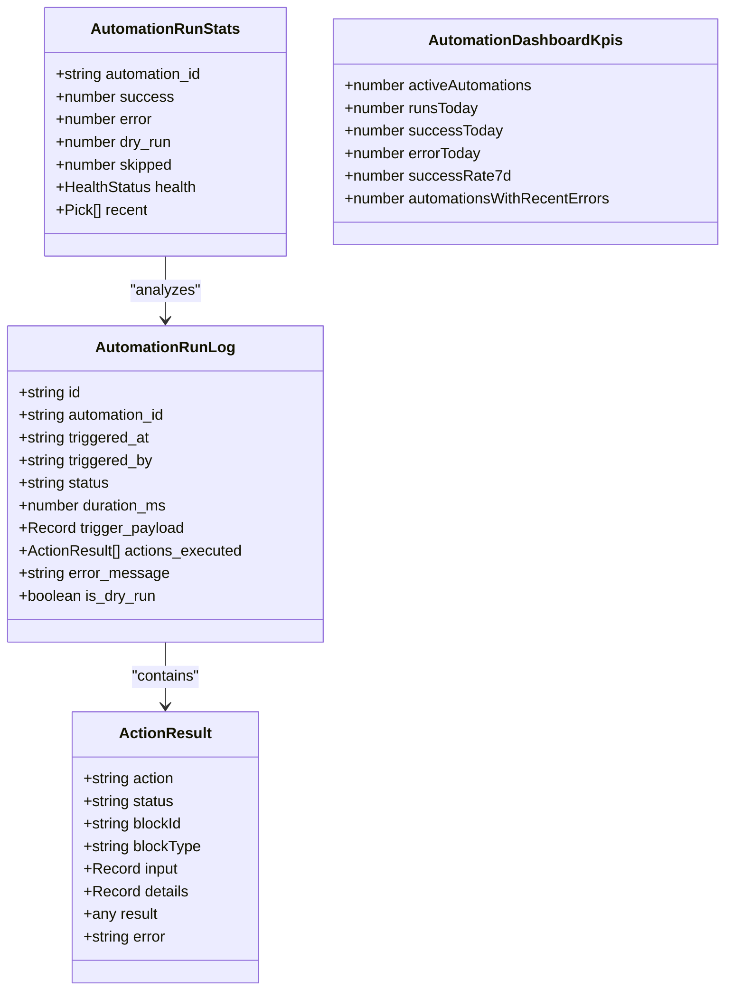
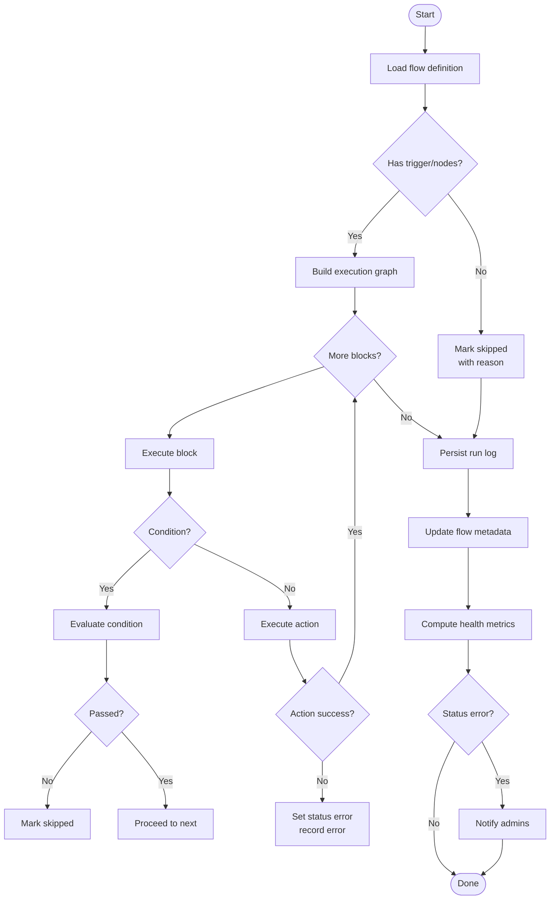
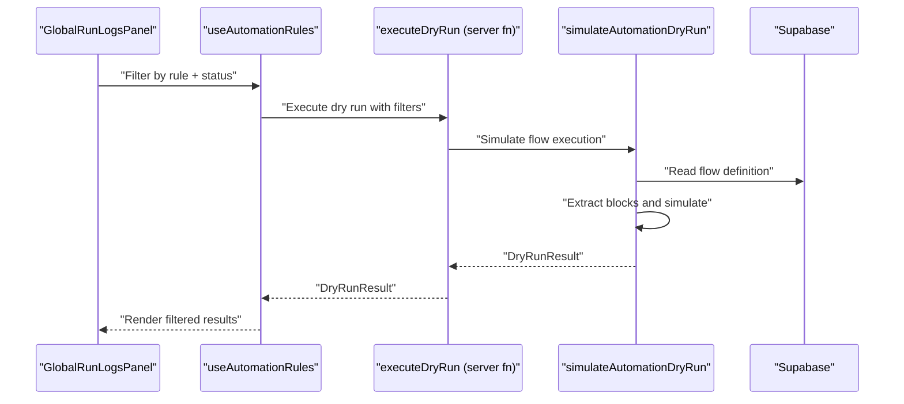
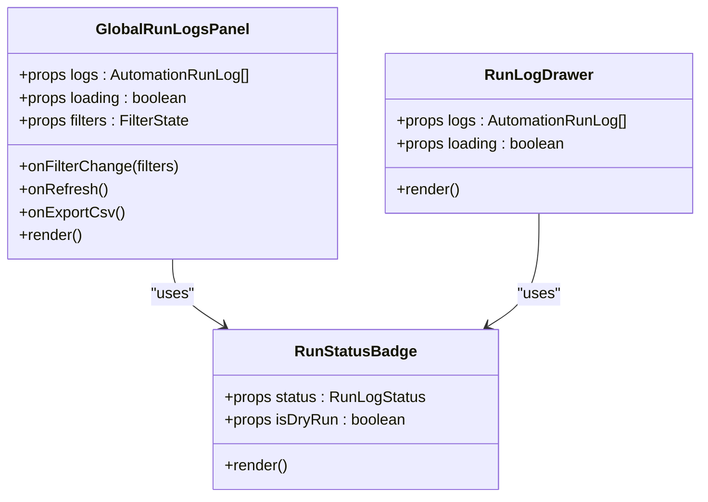
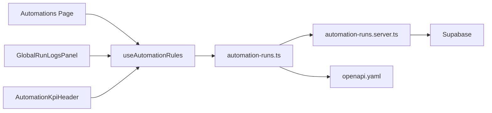

# Automation Monitoring and Logs

<cite>
**Referenced Files in This Document**
- [automation-runs.ts](file://src/lib/automation-runs.ts)
- [automation-runs.server.ts](file://src/lib/automation-runs.server.ts)
- [useAutomationRules.ts](file://src/hooks/useAutomationRules.ts)
- [RunLogDrawer.tsx](file://src/components/automations/RunLogDrawer.tsx)
- [DryRunDialog.tsx](file://src/components/automations/DryRunDialog.tsx)
- [GlobalRunLogsPanel.tsx](file://src/components/automations/GlobalRunLogsPanel.tsx)
- [automations.tsx](file://src/routes/_app/automations.tsx)
- [automation.ts](file://src/types/automation.ts)
- [AutomationKpiHeader.tsx](file://src/components/automations/AutomationKpiHeader.tsx)
- [AutomationKpiCard.tsx](file://src/components/automations/AutomationKpiCard.tsx)
- [openapi.yaml](file://public/openapi/openapi.yaml)
</cite>

## Update Summary
**Changes Made**
- Added comprehensive GlobalRunLogsPanel with advanced filtering and CSV export
- Enhanced health monitoring with real-time KPIs and statistics
- Improved filtering capabilities with rule, status, and date range filters
- Added CSV export functionality for automation logs
- Enhanced UI components with better visualization and interaction
- Expanded automation run statistics and dashboard metrics

## Table of Contents
1. [Introduction](#introduction)
2. [Project Structure](#project-structure)
3. [Core Components](#core-components)
4. [Architecture Overview](#architecture-overview)
5. [Detailed Component Analysis](#detailed-component-analysis)
6. [Dependency Analysis](#dependency-analysis)
7. [Performance Considerations](#performance-considerations)
8. [Troubleshooting Guide](#troubleshooting-guide)
9. [Conclusion](#conclusion)

## Introduction
This document explains the automation monitoring, logging, and debugging capabilities of the system. It covers:
- The comprehensive automation run log system: success/error tracking, execution timing, and detailed result reporting
- Advanced filtering capabilities for monitoring automation performance across all rules
- CSV export functionality for downloading automation execution data
- Real-time health monitoring with KPIs and statistics
- Dry run functionality for testing automation flows without executing actions
- Enhanced run log interface with global monitoring capabilities
- Debugging workflows for troubleshooting failed automation executions and performance optimization techniques

## Project Structure
The automation monitoring stack spans frontend UI components, server functions, and backend runtime logic with comprehensive monitoring capabilities:
- Frontend hooks orchestrate run execution, stats, logs, and global monitoring
- UI components render run history, status badges, dry-run results, and global monitoring panels
- Server functions expose secure endpoints for manual runs, dry runs, stats, and global log management
- Backend runtime executes flows, records logs, computes health, and manages real-time monitoring
- Global monitoring system provides centralized log viewing with advanced filtering and export capabilities

**Diagram sources**
- [useAutomationRules.ts:65-594](file://src/hooks/useAutomationRules.ts#L65-L594)
- [RunLogDrawer.tsx:12-138](file://src/components/automations/RunLogDrawer.tsx#L12-L138)
- [DryRunDialog.tsx:18-82](file://src/components/automations/DryRunDialog.tsx#L18-L82)
- [GlobalRunLogsPanel.tsx:31-300](file://src/components/automations/GlobalRunLogsPanel.tsx#L31-L300)
- [automations.tsx:28-353](file://src/routes/_app/automations.tsx#L28-L353)
- [automation-runs.ts:77-250](file://src/lib/automation-runs.ts#L77-L250)
- [automation-runs.server.ts:94-207](file://src/lib/automation-runs.server.ts#L94-L207)
- [openapi.yaml:575-581](file://public/openapi/openapi.yaml#L575-L581)

**Section sources**
- [useAutomationRules.ts:65-594](file://src/hooks/useAutomationRules.ts#L65-L594)
- [RunLogDrawer.tsx:12-138](file://src/components/automations/RunLogDrawer.tsx#L12-L138)
- [DryRunDialog.tsx:18-82](file://src/components/automations/DryRunDialog.tsx#L18-L82)
- [GlobalRunLogsPanel.tsx:31-300](file://src/components/automations/GlobalRunLogsPanel.tsx#L31-L300)
- [automations.tsx:28-353](file://src/routes/_app/automations.tsx#L28-L353)
- [automation-runs.ts:77-250](file://src/lib/automation-runs.ts#L77-L250)
- [automation-runs.server.ts:94-207](file://src/lib/automation-runs.server.ts#L94-L207)
- [openapi.yaml:575-581](file://public/openapi/openapi.yaml#L575-L581)

## Core Components
- **Comprehensive Run Log System**:
  - Global run log panel with advanced filtering by rule, status, and date range
  - CSV export functionality for downloading automation execution data
  - Enhanced run log data model with detailed execution tracking and statistics
- **Advanced Health Monitoring**:
  - Real-time KPIs including active automations, runs today, success rates, and error tracking
  - Automated health computation based on recent run statuses
  - Dashboard statistics with trend analysis and performance metrics
- **Enhanced Dry Run Functionality**:
  - Step-by-step simulation of flow execution without real actions
  - Detailed pass/skip/error outcomes for each step with structured results
- **Improved UI Components**:
  - Global monitoring panel with expandable log entries and detailed execution views
  - Enhanced status badges with visual indicators for different execution states
  - Comprehensive filtering controls with rule selection, status filtering, and date range picker

**Section sources**
- [GlobalRunLogsPanel.tsx:31-300](file://src/components/automations/GlobalRunLogsPanel.tsx#L31-L300)
- [automation-runs.ts:46-63](file://src/lib/automation-runs.ts#L46-L63)
- [automation-runs.ts:183-250](file://src/lib/automation-runs.ts#L183-L250)
- [useAutomationRules.ts:407-463](file://src/hooks/useAutomationRules.ts#L407-L463)
- [RunLogDrawer.tsx:12-138](file://src/components/automations/RunLogDrawer.tsx#L12-L138)

## Architecture Overview
The system exposes secure endpoints for manual runs and dry runs, backed by a runtime that executes flows and writes logs. Enhanced monitoring capabilities provide centralized log management with advanced filtering and export functionality, while comprehensive health metrics are computed server-side and surfaced to the UI.

**Diagram sources**
- [automations.tsx:251-262](file://src/routes/_app/automations.tsx#L251-L262)
- [useAutomationRules.ts:407-463](file://src/hooks/useAutomationRules.ts#L407-L463)
- [automation-runs.ts:101-131](file://src/lib/automation-runs.ts#L101-L131)
- [automation-runs.server.ts:94-207](file://src/lib/automation-runs.server.ts#L94-L207)

## Detailed Component Analysis

### Comprehensive Global Run Logs Panel
- **Advanced Filtering System**:
  - Rule-based filtering with dropdown selector for automation rules
  - Status filtering with options for success, error, dry-run, and skipped executions
  - Date range picker for temporal filtering of execution logs
  - Real-time filter application with immediate log updates
- **CSV Export Functionality**:
  - Direct export of filtered automation logs to CSV format
  - Automatic CSV generation with proper encoding and formatting
  - Download functionality with timestamped filenames
- **Enhanced Log Visualization**:
  - Expandable log entries with detailed execution information
  - Trigger payload inspection with JSON formatting
  - Action-by-action execution details with status indicators
  - Error message display with highlighted error sections

**Diagram sources**
- [GlobalRunLogsPanel.tsx:31-103](file://src/components/automations/GlobalRunLogsPanel.tsx#L31-L103)
- [GlobalRunLogsPanel.tsx:27-29](file://src/components/automations/GlobalRunLogsPanel.tsx#L27-L29)

**Section sources**
- [GlobalRunLogsPanel.tsx:31-300](file://src/components/automations/GlobalRunLogsPanel.tsx#L31-L300)
- [useAutomationRules.ts:407-463](file://src/hooks/useAutomationRules.ts#L407-L463)

### Enhanced Health Monitoring and KPIs
- **Real-time Dashboard Metrics**:
  - Active vs inactive automation rules count
  - Daily execution statistics with success/error breakdown
  - 7-day success rate calculation with trend indicators
  - Automated error detection and alerting system
- **Advanced Health Computation**:
  - Multi-tier health classification: healthy, degraded, failing, never_run
  - Recent execution pattern analysis for predictive health assessment
  - Automated notification system for critical failures
- **Comprehensive Statistics**:
  - Execution volume tracking with daily and weekly metrics
  - Success rate calculations with confidence intervals
  - Error pattern identification and categorization

**Diagram sources**
- [automation-runs.ts:183-250](file://src/lib/automation-runs.ts#L183-L250)
- [automation-runs.server.ts:269-277](file://src/lib/automation-runs.server.ts#L269-L277)

**Section sources**
- [automation-runs.ts:183-250](file://src/lib/automation-runs.ts#L183-L250)
- [automation-runs.server.ts:269-277](file://src/lib/automation-runs.server.ts#L269-L277)
- [AutomationKpiHeader.tsx:6-49](file://src/components/automations/AutomationKpiHeader.tsx#L6-L49)
- [AutomationKpiCard.tsx:4-51](file://src/components/automations/AutomationKpiCard.tsx#L4-L51)

### Enhanced Run Log Data Model and Server Functions
- **Extended Data Model**:
  - Enhanced AutomationRunLog with comprehensive execution tracking
  - Detailed ActionResult with block identity, type, and structured results
  - DryRunResult with step-by-step execution analysis
  - AutomationRunStats with health computation and recent execution patterns
- **Advanced Server Functions**:
  - Global log listing with filtering by rule, status, and date range
  - Enhanced statistics computation with real-time metrics
  - CSV export functionality with formatted data export
  - Real-time health monitoring with automated notifications

**Diagram sources**
- [automation-runs.ts:33-63](file://src/lib/automation-runs.ts#L33-L63)
- [automation-runs.ts:46-63](file://src/lib/automation-runs.ts#L46-L63)

**Section sources**
- [automation-runs.ts:33-63](file://src/lib/automation-runs.ts#L33-L63)
- [automation-runs.ts:183-250](file://src/lib/automation-runs.ts#L183-L250)
- [automation.ts:47-71](file://src/types/automation.ts#L47-L71)

### Runtime Execution Pipeline
- **Enhanced Flow Validation and Execution**:
  - Comprehensive flow validation with trigger and node verification
  - Advanced execution graph building with condition/action processing
  - Enhanced error handling with detailed error messages and recovery
- **Improved Logging and Notifications**:
  - Structured log persistence with detailed execution metadata
  - Automated health computation and status updates
  - Real-time failure notifications with escalation policies
- **Advanced Action Processing**:
  - Enhanced action validation with configuration schema checking
  - Detailed action result tracking with structured outcomes
  - Automated action error recovery and retry mechanisms

**Diagram sources**
- [automation-runs.server.ts:94-207](file://src/lib/automation-runs.server.ts#L94-L207)
- [automation-runs.server.ts:227-277](file://src/lib/automation-runs.server.ts#L227-L277)

**Section sources**
- [automation-runs.server.ts:94-207](file://src/lib/automation-runs.server.ts#L94-L207)
- [automation-runs.server.ts:227-277](file://src/lib/automation-runs.server.ts#L227-L277)

### Enhanced Dry Run Functionality
- **Advanced Simulation Capabilities**:
  - Comprehensive flow simulation without real action execution
  - Detailed step-by-step execution analysis with pass/skip/error outcomes
  - Configurable force_error scenarios for testing error handling
- **Enhanced Result Analysis**:
  - Structured dry-run results with execution summaries
  - Detailed step-by-step analysis with execution details
  - Automated error detection and validation feedback

**Diagram sources**
- [GlobalRunLogsPanel.tsx:74-103](file://src/components/automations/GlobalRunLogsPanel.tsx#L74-L103)
- [useAutomationRules.ts:407-427](file://src/hooks/useAutomationRules.ts#L407-L427)
- [automation-runs.ts:149-157](file://src/lib/automation-runs.ts#L149-L157)
- [automation-runs.server.ts:227-267](file://src/lib/automation-runs.server.ts#L227-L267)

**Section sources**
- [GlobalRunLogsPanel.tsx:74-103](file://src/components/automations/GlobalRunLogsPanel.tsx#L74-L103)
- [useAutomationRules.ts:407-427](file://src/hooks/useAutomationRules.ts#L407-L427)
- [automation-runs.ts:149-157](file://src/lib/automation-runs.ts#L149-L157)
- [automation-runs.server.ts:227-267](file://src/lib/automation-runs.server.ts#L227-L267)

### Enhanced Run Log Interface
- **Global Monitoring Panel**:
  - Centralized log viewing with advanced filtering controls
  - Expandable log entries with detailed execution information
  - CSV export functionality for data analysis and reporting
  - Real-time log updates with automatic refresh capabilities
- **Enhanced Status Visualization**:
  - Comprehensive status badges with visual indicators for all execution states
  - Color-coded status representations for quick visual assessment
  - Detailed status information with icons and labels
- **Advanced Filtering and Search**:
  - Multi-dimensional filtering by rule, status, and date range
  - Real-time search functionality across execution data
  - Saved filter configurations for repeated analysis

**Diagram sources**
- [GlobalRunLogsPanel.tsx:31-103](file://src/components/automations/GlobalRunLogsPanel.tsx#L31-L103)
- [RunLogDrawer.tsx:12-138](file://src/components/automations/RunLogDrawer.tsx#L12-L138)
- [RunLogDrawer.tsx:103-126](file://src/components/automations/RunLogDrawer.tsx#L103-L126)

**Section sources**
- [GlobalRunLogsPanel.tsx:31-300](file://src/components/automations/GlobalRunLogsPanel.tsx#L31-L300)
- [RunLogDrawer.tsx:12-138](file://src/components/automations/RunLogDrawer.tsx#L12-L138)
- [automations.tsx:251-262](file://src/routes/_app/automations.tsx#L251-L262)

## Dependency Analysis
- **Enhanced Frontend-to-Server Communication**:
  - useAutomationRules orchestrates comprehensive server function calls for runs, dry runs, stats, and global log management
  - GlobalRunLogsPanel depends on advanced filtering and export capabilities
  - UI components utilize enhanced typed run log models with extended functionality
- **Advanced Server-to-Runtime Integration**:
  - Server functions delegate to runtime for execution, persistence, and health computation
  - Enhanced filtering and export functionality requires optimized database queries
- **Comprehensive OpenAPI Integration**:
  - Manual run endpoint requires bearer authentication
  - Global log management endpoints support advanced filtering and export
  - CSV export functionality requires specialized endpoint handling

**Diagram sources**
- [automations.tsx:28-353](file://src/routes/_app/automations.tsx#L28-L353)
- [useAutomationRules.ts:65-594](file://src/hooks/useAutomationRules.ts#L65-L594)
- [automation-runs.ts:77-250](file://src/lib/automation-runs.ts#L77-L250)
- [openapi.yaml:575-581](file://public/openapi/openapi.yaml#L575-L581)
- [automation-runs.server.ts:94-207](file://src/lib/automation-runs.server.ts#L94-L207)

**Section sources**
- [useAutomationRules.ts:65-594](file://src/hooks/useAutomationRules.ts#L65-L594)
- [automation-runs.ts:77-250](file://src/lib/automation-runs.ts#L77-L250)
- [automation-runs.server.ts:94-207](file://src/lib/automation-runs.server.ts#L94-L207)
- [openapi.yaml:575-581](file://public/openapi/openapi.yaml#L575-L581)

## Performance Considerations
- **Optimized Global Log Queries**:
  - Advanced filtering reduces database load with targeted queries
  - Pagination limits ensure fast loading of large log datasets
  - Efficient indexing on timestamp and status fields for quick filtering
- **Enhanced Caching Strategies**:
  - Real-time health metrics cached for reduced computation overhead
  - Filtered log results cached for improved user experience
  - KPI computations optimized with incremental updates
- **Efficient CSV Export Processing**:
  - Batch processing for large log datasets during export
  - Memory-efficient streaming for CSV generation
  - Asynchronous export processing to prevent UI blocking
- **Improved UI Rendering Performance**:
  - Virtualized lists for large log datasets
  - Lazy loading of detailed log information
  - Debounced filter updates for responsive user experience

## Troubleshooting Guide
- **Enhanced Error Pattern Recognition**:
  - Comprehensive error tracking with detailed error messages and stack traces
  - Automated error categorization and pattern recognition
  - Health-based error alerts with escalation policies
- **Advanced Log Analysis Techniques**:
  - Global log filtering for systematic error investigation
  - CSV export for external analysis and reporting
  - Time-based analysis for identifying recurring issues
- **Comprehensive Debugging Workflows**:
  - Start with global log filtering to identify problematic automations
  - Use CSV export for detailed analysis and trend identification
  - Leverage dry-run functionality for isolated flow testing
  - Monitor health metrics for early problem detection
- **Performance Optimization Strategies**:
  - Analyze execution duration metrics for performance bottlenecks
  - Monitor success rate trends for system reliability assessment
  - Use filtering to isolate high-frequency error patterns
  - Implement automated alerts for critical performance degradation

**Section sources**
- [GlobalRunLogsPanel.tsx:105-110](file://src/components/automations/GlobalRunLogsPanel.tsx#L105-L110)
- [useAutomationRules.ts:435-463](file://src/hooks/useAutomationRules.ts#L435-L463)
- [automation-runs.server.ts:117-169](file://src/lib/automation-runs.server.ts#L117-L169)
- [RunLogDrawer.tsx:34-36](file://src/components/automations/RunLogDrawer.tsx#L34-L36)

## Conclusion
The enhanced automation monitoring system provides a comprehensive foundation for observing, validating, and optimizing automation flows. The addition of the GlobalRunLogsPanel with advanced filtering capabilities, CSV export functionality, and real-time health indicators significantly improves operational visibility and troubleshooting capabilities. The system now offers centralized log management, detailed execution tracking, automated health monitoring, and powerful analysis tools that enable proactive system maintenance and performance optimization. These enhancements transform the monitoring experience from reactive log viewing to proactive system management with actionable insights and automated alerting.