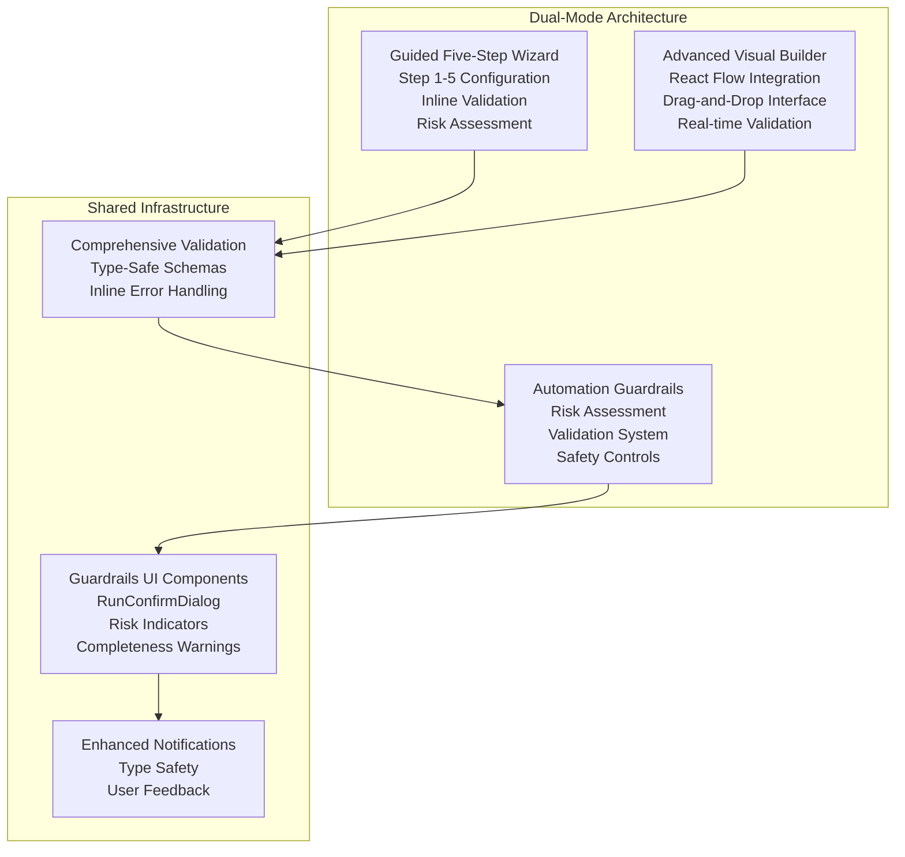
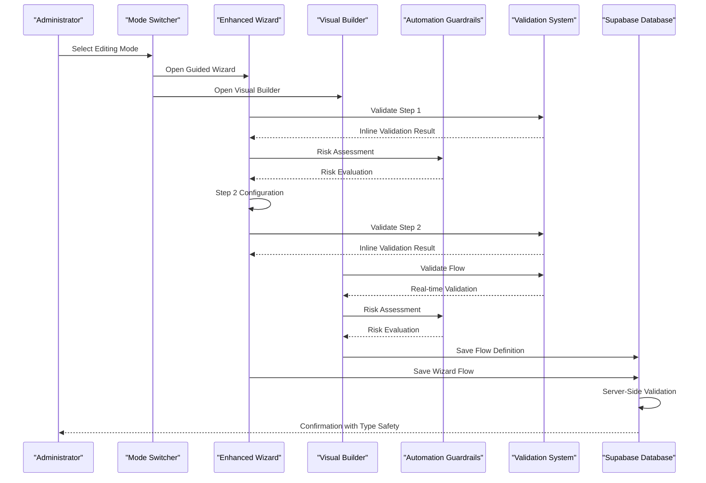
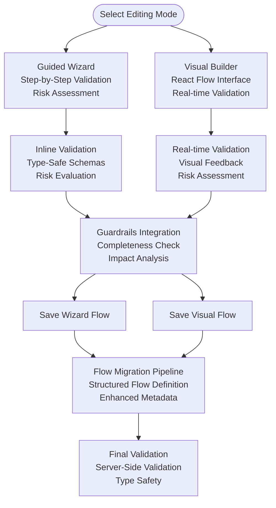
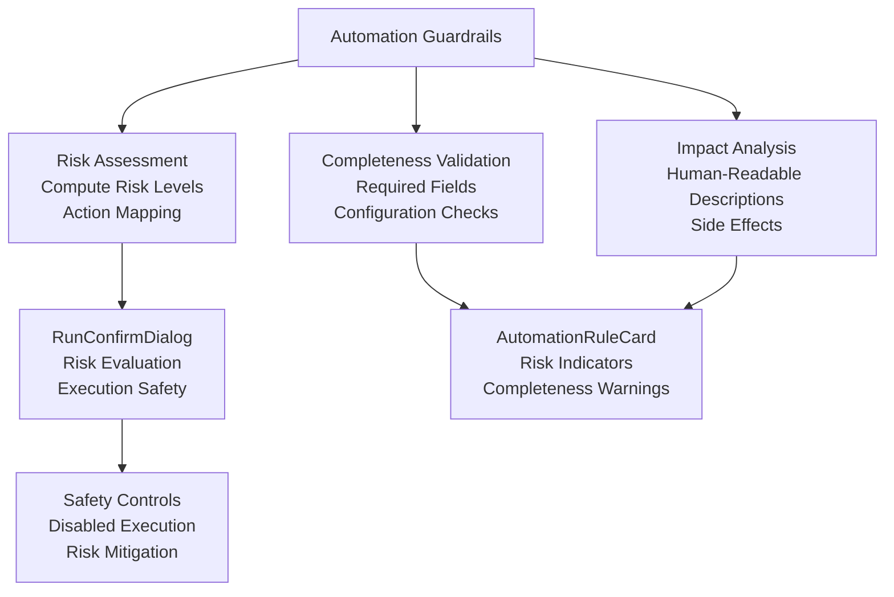
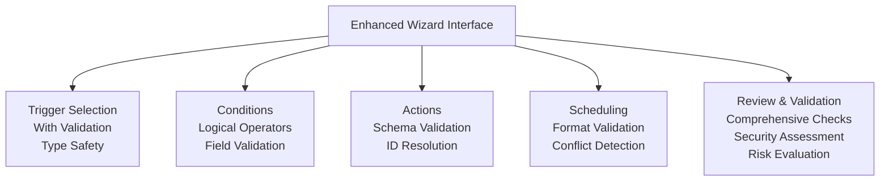
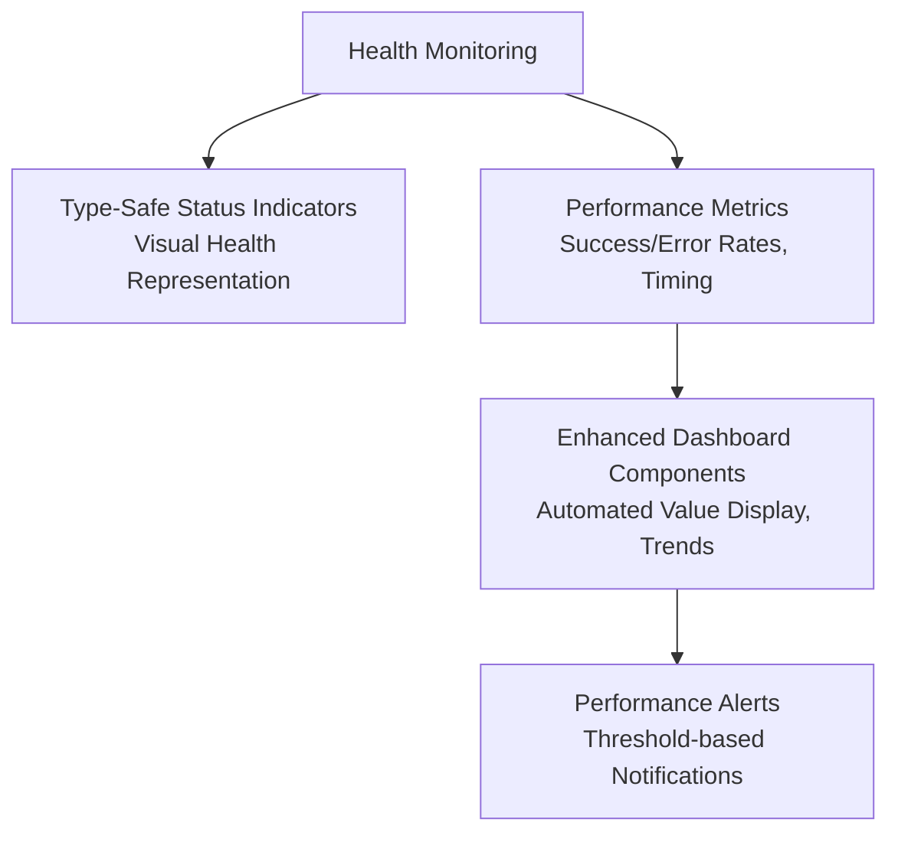
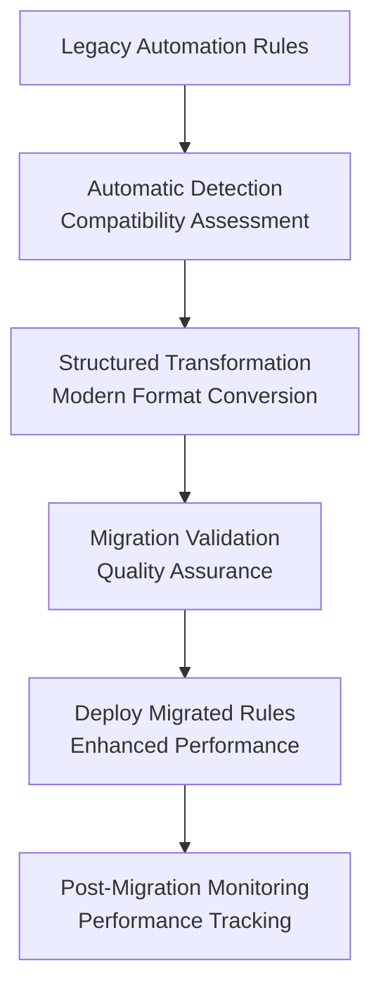
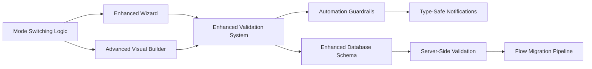

# Automation System

<cite>
**Referenced Files in This Document**
- [automation.ts](file://src/types/automation.ts)
- [index.ts](file://src/components/automations/index.ts)
- [useAutomationRules.ts](file://src/hooks/useAutomationRules.ts)
- [AutomationBuilder.tsx](file://src/components/pcready/automation/AutomationBuilder.tsx)
- [automation-runs.ts](file://src/lib/automation-runs.ts)
- [automation-runs.server.ts](file://src/lib/automation-runs.server.ts)
- [automations.ts](file://src/lib/queries/automations.ts)
- [AutomationWizard.tsx](file://src/components/automations/AutomationWizard.tsx)
- [TriggerStep.tsx](file://src/components/automations/steps/TriggerStep.tsx)
- [ConditionsStep.tsx](file://src/components/automations/steps/ConditionsStep.tsx)
- [ActionsStep.tsx](file://src/components/automations/steps/ActionsStep.tsx)
- [ScheduleStep.tsx](file://src/components/automations/steps/ScheduleStep.tsx)
- [ReviewStep.tsx](file://src/components/automations/steps/ReviewStep.tsx)
- [AutomationRuleCard.tsx](file://src/components/automations/AutomationRuleCard.tsx)
- [RunConfirmDialog.tsx](file://src/components/automations/RunConfirmDialog.tsx)
- [GlobalRunLogsPanel.tsx](file://src/components/automations/GlobalRunLogsPanel.tsx)
- [DryRunDialog.tsx](file://src/components/automations/DryRunDialog.tsx)
- [AutomationKpiCard.tsx](file://src/components/automations/AutomationKpiCard.tsx)
- [automation-guardrails.ts](file://src/lib/automations/automation-guardrails.ts)
- [flow-validation.ts](file://src/lib/automations/flow-validation.ts)
- [20260504123000_create_automation_flows.sql](file://supabase/migrations/20260504123000_create_automation_flows.sql)
- [20260507133000_automation_run_logs.sql](file://supabase/migrations/20260507133000_automation_run_logs.sql)
- [20260515160000_automation_runs_view.sql](file://supabase/migrations/20260515160000_automation_runs_view.sql)
- [20260504153000_migrate_automation_rules_to_flows.sql](file://supabase/migrations/20260504153000_migrate_automation_rules_to_flows.sql)
- [20260504163000_add_automation_flow_columns.sql](file://supabase/migrations/20260504163000_add_automation_flow_columns.sql)
- [20260504160000_validate_automation_flows.sql](file://supabase/migrations/20260504160000_validate_automation_flows.sql)
</cite>

## Update Summary

**Changes Made**

- Added comprehensive automation guardrails module with risk assessment, validation system, and enhanced UI components
- Integrated RunConfirmDialog for safe automation execution with risk evaluation
- Enhanced AutomationRuleCard with risk indicators and completeness warnings
- Improved AutomationWizard with inline validation and comprehensive error reporting
- Added server-side validation for automation flows with structured column support
- Implemented enhanced flow validation system with action requirements and trigger-action coherence checks

## Table of Contents

1. [Introduction](#introduction)
2. [Dual-Mode Design Architecture](#dual-mode-design-architecture)
3. [Project Structure](#project-structure)
4. [Core Components](#core-components)
5. [Architecture Overview](#architecture-overview)
6. [Detailed Component Analysis](#detailed-component-analysis)
7. [Enhanced Validation and Error Handling](#enhanced-validation-and-error-handling)
8. [Automation Guardrails Module](#automation-guardrails-module)
9. [Wizard-Based Rule Management](#wizard-based-rule-management)
10. [Advanced Visual Builder](#advanced-visual-builder)
11. [Enhanced Monitoring and Dashboard](#enhanced-monitoring-and-dashboard)
12. [Flow Migration Pipeline](#flow-migration-pipeline)
13. [Dependency Analysis](#dependency-analysis)
14. [Performance Considerations](#performance-considerations)
15. [Troubleshooting Guide](#troubleshooting-guide)
16. [Conclusion](#conclusion)
17. [Appendices](#appendices)

## Introduction

This document explains the comprehensive automation system that powers rule-based workflow automation with a dual-mode design approach. The system has undergone a major enhancement featuring both a guided five-step Wizard interface and an advanced visual builder powered by React Flow. The new architecture combines the accessibility of guided configuration with the flexibility of visual flow design, providing administrators with multiple pathways to create complex automation rules while maintaining type safety and comprehensive validation.

**Updated** Enhanced with comprehensive automation guardrails module featuring risk assessment, validation system, and improved UI components for safer automation execution.

## Dual-Mode Design Architecture

The enhanced automation system now operates with two complementary editing modes:

**Mode 1: Guided Five-Step Wizard**

- Intuitive step-by-step configuration process
- Built-in validation at each step with inline error handling
- Comprehensive validation system with type-safe schemas
- Real-time risk assessment and completeness checking
- Seamless integration with the visual builder

**Mode 2: Advanced Visual Builder (React Flow)**

- Drag-and-drop flow construction interface
- Real-time validation with visual indicators
- Comprehensive error handling and recovery mechanisms
- Type-safe action configurations with runtime validation
- Enhanced notification system with detailed error reporting

**Diagram sources**

- [AutomationWizard.tsx:23-60](file://src/components/automations/AutomationWizard.tsx#L23-L60)
- [AutomationBuilder.tsx:31-152](file://src/components/pcready/automation/AutomationBuilder.tsx#L31-L152)
- [useAutomationRules.ts:87](file://src/hooks/useAutomationRules.ts#L87)
- [automation-guardrails.ts:1-192](file://src/lib/automations/automation-guardrails.ts#L1-L192)

**Section sources**

- [AutomationWizard.tsx:23-60](file://src/components/automations/AutomationWizard.tsx#L23-L60)
- [AutomationBuilder.tsx:31-152](file://src/components/pcready/automation/AutomationBuilder.tsx#L31-L152)
- [useAutomationRules.ts:87](file://src/hooks/useAutomationRules.ts#L87)

## Project Structure

The automation system now features a dual-mode architecture with enhanced validation and error handling:

**Frontend Components:**

- **Dual-Mode Editor Interface:** Seamlessly switches between Wizard and Visual Builder
- **Enhanced Wizard Interface:** Five-step guided configuration with comprehensive validation
- **Advanced Visual Builder:** React Flow-powered drag-and-drop flow construction
- **Automation Guardrails Module:** Risk assessment, validation system, and safety controls
- **RunConfirmDialog:** Enhanced execution confirmation with risk evaluation
- **Enhanced AutomationRuleCard:** Risk indicators and completeness warnings
- **Type-Safe Validation:** Comprehensive schema validation with inline error handling
- **Improved Notifications:** Enhanced toast notifications with type safety
- **Flow Migration Pipeline:** Automatic conversion from legacy rules to modern format

**Backend Infrastructure:**

- **Server Functions:** Secure endpoints for manual runs, dry runs, and statistics
- **Execution Engine:** Robust flow execution with comprehensive logging
- **Database Schema:** Enhanced automation_flows with structured validation
- **Migration System:** Legacy rule conversion with preserved metadata
- **Server-Side Validation:** PostgreSQL triggers for data integrity

**Validation and Error Handling:**

- **Inline Validation:** Real-time field validation with immediate user feedback
- **Type-Safe Schemas:** Zod-based validation for all automation components
- **Error Recovery:** Graceful error handling with user-friendly messages
- **Progressive Enhancement:** Validation improves as users progress through steps
- **Risk Assessment:** Comprehensive risk evaluation for automation execution

**Section sources**

- [index.ts:1-6](file://src/components/automations/index.ts#L1-L6)
- [useAutomationRules.ts:165-186](file://src/hooks/useAutomationRules.ts#L165-L186)
- [AutomationBuilder.tsx:119-152](file://src/components/pcready/automation/AutomationBuilder.tsx#L119-L152)
- [automation.ts:4-19](file://src/types/automation.ts#L4-L19)

## Core Components

The enhanced automation system consists of several interconnected components working together:

**Dual-Mode Editor System:**

- **Mode Switching:** Seamless transition between guided Wizard and visual builder
- **Shared State Management:** Consistent data flow across both editing modes
- **Flow Migration:** Automatic conversion of legacy rules to modern format
- **Validation Integration:** Unified validation system supporting both modes

**Enhanced Validation Framework:**

- **Type-Safe Schemas:** Zod-based validation for all automation components
- **Inline Error Handling:** Real-time validation with immediate user feedback
- **Progressive Validation:** Validation intensity increases with complexity
- **Error Recovery:** Graceful handling of validation failures
- **Action Requirements:** Comprehensive validation of action configurations
- **Trigger-Action Coherence:** Validation of logical flow relationships

**Automation Guardrails System:**

- **Risk Assessment:** Comprehensive risk evaluation for automation rules
- **Completeness Checking:** Validation of required fields and configurations
- **Impact Analysis:** Human-readable descriptions of automation effects
- **Side Effect Warnings:** Notification of external system impacts
- **Execution Safety:** Controlled automation execution with risk mitigation

**Advanced Flow Construction:**

- **React Flow Integration:** Professional-grade flow visualization and interaction
- **Drag-and-Drop Interface:** Intuitive node placement and connection
- **Real-time Validation:** Continuous validation during flow construction
- **Visual Feedback:** Clear indicators for valid and invalid configurations

**Enhanced Monitoring and Notifications:**

- **Type-Safe Notifications:** Improved toast notifications with better error reporting
- **Comprehensive Logging:** Detailed execution tracking and error reporting
- **Health Monitoring:** Real-time status tracking and performance metrics
- **User Feedback:** Clear, actionable error messages and success confirmations

**Section sources**

- [useAutomationRules.ts:87](file://src/hooks/useAutomationRules.ts#L87)
- [AutomationBuilder.tsx:31-152](file://src/components/pcready/automation/AutomationBuilder.tsx#L31-L152)
- [automation.ts:47-72](file://src/types/automation.ts#L47-L72)

## Architecture Overview

The enhanced automation system follows a dual-mode architecture with comprehensive validation and error handling:

**Diagram sources**

- [useAutomationRules.ts:87](file://src/hooks/useAutomationRules.ts#L87)
- [AutomationWizard.tsx:49-60](file://src/components/automations/AutomationWizard.tsx#L49-L60)
- [AutomationBuilder.tsx:119-152](file://src/components/pcready/automation/AutomationBuilder.tsx#L119-L152)
- [automation-guardrails.ts:51-67](file://src/lib/automations/automation-guardrails.ts#L51-L67)

## Detailed Component Analysis

### Enhanced Flow Definition and Dual-Mode Interface

The dual-mode system provides comprehensive flow definition capabilities through both guided and visual approaches:

**Guided Wizard Interface:**

- **Step 1: Trigger Selection** - Comprehensive trigger types with validation
- **Step 2: Conditions** - Logical operators with type-safe validation
- **Step 3: Actions** - Multiple action types with configuration schemas
- **Step 4: Scheduling** - Cron expressions with format validation
- **Step 5: Review** - Comprehensive validation and error reporting with risk assessment

**Visual Builder Interface:**

- **React Flow Integration** - Professional-grade flow construction
- **Drag-and-Drop Nodes** - Trigger, condition, and action nodes
- **Real-time Validation** - Continuous validation during construction
- **Visual Error Indicators** - Clear feedback for invalid configurations
- **Type-Safe Configurations** - Schema validation for all node properties

**Flow Migration Pipeline:**

- **Legacy Detection** - Automatic identification of old rule formats
- **Structured Conversion** - Transformation to modern flow_definition format
- **Metadata Preservation** - Retention of important rule information
- **Validation Integration** - Post-conversion validation and cleanup

**Diagram sources**

- [AutomationWizard.tsx:49-60](file://src/components/automations/AutomationWizard.tsx#L49-L60)
- [AutomationBuilder.tsx:119-152](file://src/components/pcready/automation/AutomationBuilder.tsx#L119-L152)
- [useAutomationRules.ts:194-236](file://src/hooks/useAutomationRules.ts#L194-L236)
- [automation-guardrails.ts:72-110](file://src/lib/automations/automation-guardrails.ts#L72-L110)

**Section sources**

- [AutomationWizard.tsx:49-60](file://src/components/automations/AutomationWizard.tsx#L49-L60)
- [AutomationBuilder.tsx:119-152](file://src/components/pcready/automation/AutomationBuilder.tsx#L119-L152)
- [useAutomationRules.ts:194-236](file://src/hooks/useAutomationRules.ts#L194-L236)

### Enhanced Validation and Error Handling System

The system now features comprehensive validation and error handling across both editing modes:

**Inline Validation:**

- **Real-time Field Validation** - Immediate feedback for form inputs
- **Type-Safe Schemas** - Zod-based validation for all configuration fields
- **Progressive Validation Intensity** - More rigorous validation as complexity increases
- **User-Friendly Error Messages** - Clear, actionable feedback for validation failures

**Error Recovery Mechanisms:**

- **Graceful Degradation** - System continues functioning despite validation errors
- **Automatic Error Correction** - Intelligent suggestions for fixing common mistakes
- **Undo/Redo Integration** - Validation errors don't prevent normal application operations
- **Persistent Error States** - Clear indication of validation failures in UI

**Enhanced Notification System:**

- **Type-Safe Toast Notifications** - Improved error reporting and success messages
- **Context-Aware Messaging** - Notifications tailored to specific error scenarios
- **Actionable Feedback** - Clear next steps for resolving validation issues
- **Consistent User Experience** - Unified notification system across both modes

**Section sources**

- [AutomationWizard.tsx:49-60](file://src/components/automations/AutomationWizard.tsx#L49-L60)
- [AutomationBuilder.tsx:119-152](file://src/components/pcready/automation/AutomationBuilder.tsx#L119-L152)
- [automation.ts:4-19](file://src/types/automation.ts#L4-L19)

### Automation Guardrails Module

The new automation guardrails module provides comprehensive risk assessment and safety controls:

**Risk Assessment System:**

- **Risk Level Computation** - Evaluates automation actions to determine risk levels
- **Action Risk Mapping** - Maps action types to risk categories (low, medium, high, critical)
- **Scheduled Risk Detection** - Identifies high-risk actions in scheduled automations
- **Comprehensive Coverage** - Includes all supported action types and their risk profiles

**Completeness Validation:**

- **Required Field Checking** - Validates presence of essential configuration fields
- **Trigger Validation** - Ensures trigger configuration is complete
- **Action Validation** - Verifies all action configurations have required parameters
- **Condition Validation** - Checks conditional logic completeness
- **Schedule Validation** - Validates scheduling configurations

**Impact Analysis:**

- **Human-Readable Descriptions** - Provides clear explanations of automation effects
- **Trigger Impact** - Describes when and how automations will trigger
- **Action Impact** - Details specific actions and their parameters
- **External Side Effects** - Warns about impacts on external systems

**Guardrails UI Integration:**

- **RunConfirmDialog** - Enhanced execution confirmation with risk evaluation
- **Risk Indicators** - Visual risk badges in AutomationRuleCard
- **Completeness Warnings** - Tooltip warnings for incomplete rules
- **Safety Controls** - Disabled execution for incomplete or high-risk rules

**Section sources**

- [automation-guardrails.ts:1-192](file://src/lib/automations/automation-guardrails.ts#L1-L192)
- [RunConfirmDialog.tsx:1-171](file://src/components/automations/RunConfirmDialog.tsx#L1-L171)
- [AutomationRuleCard.tsx:192-219](file://src/components/automations/AutomationRuleCard.tsx#L192-L219)

### Advanced Visual Builder with React Flow

The visual builder provides a professional-grade interface for complex flow construction:

**React Flow Integration:**

- **Professional Flow Visualization** - High-performance flow rendering and interaction
- **Drag-and-Drop Interface** - Intuitive node placement and connection
- **Real-time Validation** - Continuous validation during flow construction
- **Visual Error Indicators** - Clear feedback for invalid configurations

**Node Types and Configurations:**

- **Trigger Nodes** - Event-based flow initiation with configuration options
- **Condition Nodes** - Logical branching with multiple comparison operators
- **Action Nodes** - Side effects with comprehensive configuration schemas
- **Delay Nodes** - Time-based processing with configurable units

**Enhanced User Experience:**

- **Visual Feedback** - Clear indicators for valid and invalid configurations
- **Intelligent Node Placement** - Strategic positioning for optimal flow readability
- **Connection Validation** - Real-time validation of node connections
- **Responsive Design** - Adapts to different screen sizes and orientations

**Section sources**

- [AutomationBuilder.tsx:31-152](file://src/components/pcready/automation/AutomationBuilder.tsx#L31-L152)
- [AutomationBuilder.tsx:196-275](file://src/components/pcready/automation/AutomationBuilder.tsx#L196-L275)
- [AutomationBuilder.tsx:421-466](file://src/components/pcready/automation/AutomationBuilder.tsx#L421-L466)

### Enhanced Action Types and Configurations

The system supports comprehensive action types with enhanced configuration options and validation:

**Email Actions:**

- **Recipient Configuration** - Dynamic recipient resolution from trigger payloads
- **Subject and Body Templates** - Support for variable substitution
- **HTML Content Support** - Rich text formatting capabilities
- **Attachment Handling** - File attachment support with validation

**Ticket Operations:**

- **Status Updates** - Automated ticket status changes with validation
- **Assignment Management** - Technician assignment with conflict detection
- **Priority Adjustments** - Priority level modifications with business rules
- **Tag Management** - Automatic tag assignment based on conditions

**Notification Systems:**

- **In-App Notifications** - Real-time user notifications with customization
- **Type-Safe Notification Types** - Enum-based notification categorization
- **Targeted Delivery** - User-specific notification routing
- **Delivery Preferences** - Respect user notification preferences

**Device Management:**

- **Status Updates** - Asset lifecycle tracking with validation
- **Maintenance Scheduling** - Preventive maintenance automation
- **Location Tracking** - Geographic asset management
- **Lifecycle Events** - Automated asset retirement and replacement

**Section sources**

- [ActionsStep.tsx:29-44](file://src/components/automations/steps/ActionsStep.tsx#L29-L44)
- [ActionsStep.tsx:112-281](file://src/components/automations/steps/ActionsStep.tsx#L112-L281)
- [AutomationBuilder.tsx:233-275](file://src/components/pcready/automation/AutomationBuilder.tsx#L233-L275)

## Enhanced Validation and Error Handling

### Comprehensive Validation Framework

The enhanced system implements a multi-layered validation approach:

**Schema-Based Validation:**

- **Zod Integration** - Type-safe validation for all automation components
- **Runtime Validation** - Real-time validation during user interaction
- **Compile-Time Safety** - TypeScript integration for development-time validation
- **Recursive Validation** - Deep validation of nested configuration objects

**Inline Error Handling:**

- **Immediate Feedback** - Real-time validation with instant user feedback
- **Contextual Help** - Helpful error messages with suggested solutions
- **Visual Indicators** - Clear visual cues for validation status
- **Progressive Disclosure** - Validation complexity matches user expertise level

**Error Recovery and Resilience:**

- **Graceful Degradation** - System continues functioning despite validation errors
- **Automatic Recovery** - Intelligent suggestions for fixing common mistakes
- **State Persistence** - User progress preserved even with validation failures
- **Undo Integration** - Validation errors don't prevent normal application operations

**Section sources**

- [automation.ts:4-19](file://src/types/automation.ts#L4-L19)
- [AutomationWizard.tsx:49-60](file://src/components/automations/AutomationWizard.tsx#L49-L60)
- [AutomationBuilder.tsx:119-152](file://src/components/pcready/automation/AutomationBuilder.tsx#L119-L152)

### Enhanced Notification System

The notification system has been significantly improved with type safety and better user experience:

**Type-Safe Notifications:**

- **Enum-Based Types** - Strongly typed notification categories
- **Schema Validation** - Runtime validation of notification parameters
- **Consistent Formatting** - Unified notification presentation across the system
- **Accessibility Support** - Screen reader compatibility and keyboard navigation

**Enhanced User Feedback:**

- **Actionable Messages** - Clear, specific guidance for error resolution
- **Contextual Information** - Relevant details for understanding validation failures
- **Progressive Disclosure** - Appropriate level of detail based on user expertise
- **Consistent Tone** - Professional, helpful communication style

**Integration with Validation:**

- **Validation Error Notifications** - Direct correlation between validation failures and user feedback
- **Success Confirmation** - Clear acknowledgment of successful validations
- **Progress Tracking** - Visual indicators for multi-step validation processes
- **Error Aggregation** - Consolidation of multiple validation errors into manageable groups

**Section sources**

- [automation.ts:47-72](file://src/types/automation.ts#L47-L72)
- [AutomationBuilder.tsx:119-152](file://src/components/pcready/automation/AutomationBuilder.tsx#L119-L152)

## Automation Guardrails Module

### Risk Assessment and Safety Controls

The automation guardrails module provides comprehensive safety controls for automation execution:

**Risk Level Computation:**

- **Action-Based Risk Scoring** - Evaluates each action type against predefined risk levels
- **Scheduled Risk Detection** - Identifies high-risk actions in scheduled automations
- **Critical Risk Flagging** - Flags automations with critical risk levels
- **Risk Level Configuration** - Customizable risk level definitions with styling

**Completeness Validation:**

- **Required Field Checking** - Validates essential configuration fields are present
- **Trigger Completeness** - Ensures trigger configuration is complete and valid
- **Action Completeness** - Verifies all action configurations have required parameters
- **Condition Completeness** - Checks conditional logic has proper values
- **Schedule Completeness** - Validates scheduling configurations

**Impact Analysis and Side Effects:**

- **Human-Readable Impact Descriptions** - Clear explanations of automation effects
- **Trigger Impact Analysis** - Describes when and how automations will trigger
- **Action Impact Analysis** - Details specific actions and their parameters
- **External Side Effects** - Warns about impacts on external systems and services

**Guardrails UI Components:**

- **RunConfirmDialog** - Enhanced execution confirmation with risk evaluation
- **Risk Indicators** - Visual risk badges in AutomationRuleCard
- **Completeness Warnings** - Tooltip warnings for incomplete rules
- **Safety Controls** - Disabled execution for incomplete or high-risk rules

**Diagram sources**

- [automation-guardrails.ts:51-67](file://src/lib/automations/automation-guardrails.ts#L51-L67)
- [automation-guardrails.ts:72-110](file://src/lib/automations/automation-guardrails.ts#L72-L110)
- [automation-guardrails.ts:115-144](file://src/lib/automations/automation-guardrails.ts#L115-L144)
- [RunConfirmDialog.tsx:40-46](file://src/components/automations/RunConfirmDialog.tsx#L40-L46)

**Section sources**

- [automation-guardrails.ts:1-192](file://src/lib/automations/automation-guardrails.ts#L1-L192)
- [RunConfirmDialog.tsx:1-171](file://src/components/automations/RunConfirmDialog.tsx#L1-L171)
- [AutomationRuleCard.tsx:192-219](file://src/components/automations/AutomationRuleCard.tsx#L192-L219)

### RunConfirmDialog Implementation

The RunConfirmDialog provides enhanced execution confirmation with comprehensive risk evaluation:

**Risk Level Display:**

- **Visual Risk Indicators** - Color-coded risk badges with descriptive labels
- **Risk Level Configuration** - Styling and messaging for each risk level
- **Critical Risk Warnings** - Special handling for critical risk automations
- **High Risk Destructive Buttons** - Destructive styling for high-risk executions

**Completeness Validation:**

- **Rule Completeness Check** - Prevents execution of incomplete rules
- **Missing Configuration Warnings** - Detailed explanations of missing requirements
- **Execution Blocking** - Disables execution until all requirements are met

**Impact Preview and Side Effects:**

- **Impact Description Display** - Human-readable descriptions of automation effects
- **Side Effect Warnings** - Notifications about external system impacts
- **Action Parameter Display** - Shows action parameters and their values

**Section sources**

- [RunConfirmDialog.tsx:40-171](file://src/components/automations/RunConfirmDialog.tsx#L40-L171)
- [automation-guardrails.ts:163-192](file://src/lib/automations/automation-guardrails.ts#L163-L192)

## Wizard-Based Rule Management

### Five-Step Process with Enhanced Validation

The wizard interface now provides comprehensive validation at each step:

**Step 1: Trigger Selection with Validation**

- **Comprehensive Trigger Types** - Ticket creation, updates, checklist completion, scheduled execution, manual triggers
- **Contextual Validation** - Trigger-specific validation rules and constraints
- **Helpful Guidance** - Contextual help and examples for each trigger type
- **Cron Expression Validation** - Real-time validation for scheduled triggers

**Step 2: Conditions Configuration with Type Safety**

- **Logical Operators** - Comprehensive comparison operators with validation
- **Field-Based Comparisons** - Dynamic field resolution with type checking
- **Priority and Tag Filtering** - Specialized validation for priority and tag operations
- **Condition Reordering** - Validation of logical flow integrity

**Step 3: Action Configuration with Schema Validation**

- **Multiple Action Types** - Email, status updates, notifications, device management
- **Dynamic Configuration** - Action-specific validation schemas
- **ID Resolution Validation** - Automatic ID resolution with validation
- **Action Chaining** - Validation of action sequence and dependencies

**Step 4: Scheduling Setup with Format Validation**

- **Cron Expression Validation** - Standard cron format validation
- **Interval-Based Scheduling** - Validation of time-based scheduling parameters
- **Time Zone Awareness** - Proper handling of time zone considerations
- **Conflict Detection** - Prevention of overlapping scheduling conflicts

**Step 5: Review and Validation with Comprehensive Checks**

- **Complete Rule Validation** - End-to-end validation of the entire automation rule
- **Change Tracking** - Version history and change impact analysis
- **Performance Impact Assessment** - Validation of rule complexity and performance implications
- **Security Validation** - Validation of rule security implications
- **Risk Assessment Integration** - Comprehensive risk evaluation and safety checks

**Diagram sources**

- [AutomationWizard.tsx:15-21](file://src/components/automations/AutomationWizard.tsx#L15-L21)
- [TriggerStep.tsx:4-45](file://src/components/automations/steps/TriggerStep.tsx#L4-L45)
- [ConditionsStep.tsx:8-18](file://src/components/automations/steps/ConditionsStep.tsx#L8-L18)
- [ActionsStep.tsx:7-27](file://src/components/automations/steps/ActionsStep.tsx#L7-L27)
- [ScheduleStep.tsx:14-23](file://src/components/automations/steps/ScheduleStep.tsx#L14-L23)

**Section sources**

- [AutomationWizard.tsx:15-21](file://src/components/automations/AutomationWizard.tsx#L15-L21)
- [TriggerStep.tsx:4-45](file://src/components/automations/steps/TriggerStep.tsx#L4-L45)
- [ConditionsStep.tsx:8-18](file://src/components/automations/steps/ConditionsStep.tsx#L8-L18)
- [ActionsStep.tsx:7-27](file://src/components/automations/steps/ActionsStep.tsx#L7-L27)
- [ScheduleStep.tsx:14-23](file://src/components/automations/steps/ScheduleStep.tsx#L14-L23)
- [ReviewStep.tsx:94-191](file://src/components/automations/steps/ReviewStep.tsx#L94-L191)

### Enhanced Inline Validation System

The wizard now features comprehensive inline validation with error grouping and user feedback:

**Inline Validation Implementation:**

- **Real-time Validation** - Validation triggered as users complete each step
- **Error Grouping** - Errors grouped by section for organized presentation
- **Section Labels** - Human-readable labels for validation sections
- **Severity Differentiation** - Clear distinction between errors and warnings

**Error Presentation:**

- **Error Display** - Red error boxes with specific error messages
- **Warning Display** - Amber warning boxes with advisory messages
- **Actionable Feedback** - Clear guidance for resolving validation issues
- **Progressive Disclosure** - Validation complexity increases with step progression

**Integration with Guardrails:**

- **Risk Assessment** - Comprehensive risk evaluation during review step
- **Completeness Checking** - Validation of required configuration fields
- **Impact Analysis** - Display of automation effects and side effects
- **Safety Controls** - Disabled execution for incomplete or risky rules

**Section sources**

- [AutomationWizard.tsx:237-275](file://src/components/automations/AutomationWizard.tsx#L237-L275)
- [flow-validation.ts:87-146](file://src/lib/automations/flow-validation.ts#L87-L146)
- [flow-validation.ts:526-561](file://src/lib/automations/flow-validation.ts#L526-L561)

### Wizard Metadata and Traceability

The wizard generates comprehensive metadata with enhanced validation:

**Wizard Snapshot Generation:**

- **Complete Configuration Capture** - Full rule configuration at creation time
- **Validation Metadata** - Recording of validation results and error states
- **Change Tracking** - Version numbers and change notes for audit trails
- **Performance Metrics** - Initial performance assessment and recommendations

**Enhanced Summary Generation:**

- **Automated Rule Summaries** - Natural language descriptions of rule intent
- **Validation Status Indicators** - Clear indication of validation success/failure
- **Complexity Assessment** - Rule complexity scoring for performance optimization
- **Security Classification** - Security risk assessment for rule operations

**Section sources**

- [AutomationWizard.tsx:83-97](file://src/components/automations/AutomationWizard.tsx#L83-L97)
- [ReviewStep.tsx:94-102](file://src/components/automations/steps/ReviewStep.tsx#L94-L102)

## Advanced Visual Builder

### React Flow Integration and Enhanced Features

The visual builder provides a professional-grade interface for complex flow construction:

**React Flow Integration:**

- **High-Performance Rendering** - Optimized flow visualization and interaction
- **Professional Node Types** - Trigger, condition, and action node implementations
- **Intelligent Layout Algorithms** - Automatic flow arrangement for optimal readability
- **Responsive Interaction** - Smooth zoom, pan, and node manipulation experiences

**Enhanced Node Configuration:**

- **Trigger Node Configuration** - Event-based flow initiation with validation
- **Condition Node Configuration** - Logical branching with operator selection
- **Action Node Configuration** - Side effect configuration with schema validation
- **Delay Node Configuration** - Time-based processing with unit selection

**Real-time Validation and Feedback:**

- **Continuous Validation** - Real-time validation during flow construction
- **Visual Error Indicators** - Clear feedback for invalid configurations
- **Connection Validation** - Validation of node connections and flow integrity
- **Performance Monitoring** - Real-time performance impact assessment

**Section sources**

- [AutomationBuilder.tsx:31-152](file://src/components/pcready/automation/AutomationBuilder.tsx#L31-L152)
- [AutomationBuilder.tsx:196-275](file://src/components/pcready/automation/AutomationBuilder.tsx#L196-L275)
- [AutomationBuilder.tsx:421-466](file://src/components/pcready/automation/AutomationBuilder.tsx#L421-L466)

### Visual Flow Construction and Management

The visual builder enables intuitive flow construction with comprehensive management features:

**Flow Construction:**

- **Drag-and-Drop Interface** - Intuitive node placement and connection
- **Smart Node Placement** - Strategic positioning for optimal flow readability
- **Connection Validation** - Real-time validation of node connections
- **Flow Validation** - End-to-end validation of constructed flows

**Flow Management:**

- **Version Control Integration** - Automatic versioning of flow changes
- **Change Tracking** - Detailed audit trail of flow modifications
- **Rollback Capability** - Ability to revert to previous flow versions
- **Export Functionality** - Flow export for backup and migration purposes

**Enhanced User Experience:**

- **Visual Feedback** - Clear indicators for valid and invalid configurations
- **Contextual Help** - Helpful guidance for complex flow construction
- **Performance Optimization** - Suggestions for improving flow performance
- **Accessibility Support** - Keyboard navigation and screen reader compatibility

**Section sources**

- [AutomationBuilder.tsx:31-152](file://src/components/pcready/automation/AutomationBuilder.tsx#L31-L152)
- [AutomationBuilder.tsx:491-520](file://src/components/pcready/automation/AutomationBuilder.tsx#L491-L520)

## Enhanced Monitoring and Dashboard

### Health Monitoring and Status Indicators

The enhanced monitoring system provides comprehensive health tracking with type safety:

**Real-Time Health Status:**

- **Automated Health Calculation** - Dynamic health status based on execution patterns
- **Visual Health Indicators** - Color-coded badges with clear status representation
- **Performance Metrics Collection** - Success rates, error rates, and execution timing
- **Trend Analysis** - Historical performance tracking for optimization insights

**Type-Safe Monitoring:**

- **Enum-Based Status Values** - Strongly typed status representations
- **Schema Validation** - Runtime validation of monitoring data
- **Consistent Metric Reporting** - Unified format for all performance metrics
- **Accessible Monitoring** - Screen reader compatibility for monitoring interfaces

**Enhanced Dashboard Components:**

- **Automated Value Display** - Clean, readable displays for key performance metrics
- **Trend Visualization** - Graphical representation of performance trends
- **Color-Coded Status Indicators** - Visual indicators for system health
- **Customizable Metrics** - Flexible configuration of monitoring metrics

**Diagram sources**

- [AutomationRuleCard.tsx:40-63](file://src/components/automations/AutomationRuleCard.tsx#L40-L63)
- [AutomationKpiCard.tsx:4-51](file://src/components/automations/AutomationKpiCard.tsx#L4-L51)

**Section sources**

- [AutomationRuleCard.tsx:40-63](file://src/components/automations/AutomationRuleCard.tsx#L40-L63)
- [AutomationKpiCard.tsx:4-51](file://src/components/automations/AutomationKpiCard.tsx#L4-L51)

### Global Monitoring and Filtering

The global logging panel provides enterprise-level monitoring with enhanced filtering:

**System-Wide Visibility:**

- **Unified Execution View** - Single interface for all automation rule executions
- **Advanced Filtering Capabilities** - Multi-dimensional filtering by rule, status, and date
- **Export Functionality** - CSV export for external analysis and reporting
- **Real-Time Updates** - Automatic refresh with latest execution results

**Enhanced Filtering Options:**

- **Rule-Based Filtering** - Filter by specific automation rules or rule categories
- **Status-Based Filtering** - Filter by execution status (success, error, dry-run, skipped)
- **Temporal Filtering** - Date range filtering for historical analysis
- **Execution Type Filtering** - Filter by manual vs automated execution types

**Detailed Execution Analysis:**

- **Trigger Payload Inspection** - Detailed examination of trigger data and context
- **Action Result Analysis** - Comprehensive analysis of executed actions and outcomes
- **Error Detail Examination** - Deep dive into error causes and resolution strategies
- **Performance Timeline Analysis** - Temporal analysis of execution performance

**Section sources**

- [GlobalRunLogsPanel.tsx:31-103](file://src/components/automations/GlobalRunLogsPanel.tsx#L31-L103)
- [GlobalRunLogsPanel.tsx:126-261](file://src/components/automations/GlobalRunLogsPanel.tsx#L126-L261)

## Flow Migration Pipeline

### Legacy Rule Conversion and Modernization

The flow migration pipeline provides seamless conversion from legacy automation rules to the modern format:

**Legacy Detection and Analysis:**

- **Automatic Legacy Rule Detection** - Identification of old-style automation rules
- **Compatibility Assessment** - Analysis of legacy rule compatibility with modern format
- **Risk Evaluation** - Assessment of migration risks and potential issues
- **Impact Analysis** - Evaluation of migration impact on system performance

**Structured Conversion Process:**

- **Legacy Data Extraction** - Extraction of relevant data from legacy rule formats
- **Modern Format Transformation** - Conversion to structured flow_definition format
- **Metadata Preservation** - Retention of important rule metadata and history
- **Validation Integration** - Post-conversion validation and cleanup

**Migration Validation and Quality Assurance:**

- **Conversion Validation** - Verification that legacy rules convert correctly
- **Functionality Preservation** - Ensuring migrated rules maintain original behavior
- **Performance Optimization** - Improving performance of migrated rules
- **Error Handling** - Comprehensive error handling during migration process

**Post-Migration Support:**

- **Legacy Rule Archiving** - Safe storage of original legacy rules for reference
- **Migration Tracking** - Detailed tracking of all migration activities
- **Rollback Capability** - Ability to revert migrations if issues arise
- **Performance Monitoring** - Ongoing monitoring of migrated rule performance

**Diagram sources**

- [20260504153000_migrate_automation_rules_to_flows.sql:8-54](file://supabase/migrations/20260504153000_migrate_automation_rules_to_flows.sql#L8-L54)
- [20260504163000_add_automation_flow_columns.sql:14-37](file://supabase/migrations/20260504163000_add_automation_flow_columns.sql#L14-L37)

**Section sources**

- [20260504153000_migrate_automation_rules_to_flows.sql:8-54](file://supabase/migrations/20260504153000_migrate_automation_rules_to_flows.sql#L8-L54)
- [20260504163000_add_automation_flow_columns.sql:14-37](file://supabase/migrations/20260504163000_add_automation_flow_columns.sql#L14-L37)
- [20260504160000_validate_automation_flows.sql:6-39](file://supabase/migrations/20260504160000_validate_automation_flows.sql#L6-L39)

## Dependency Analysis

The enhanced automation system maintains clear dependency relationships with improved validation and error handling:

**Dual-Mode Architecture Dependencies:**

- **Mode Switching Logic** - Seamless transition between wizard and visual builder
- **Shared Validation System** - Unified validation across both editing modes
- **Flow Migration Pipeline** - Automatic conversion between legacy and modern formats
- **Type-Safe Communication** - Consistent data exchange between components

**Enhanced Component Dependencies:**

- **Validation Framework** - Comprehensive validation for all automation components
- **Error Handling System** - Robust error handling with user-friendly feedback
- **Notification Infrastructure** - Enhanced toast notifications with type safety
- **Flow Construction Tools** - Professional-grade flow building capabilities
- **Guardrails Module** - Risk assessment and safety control integration

**Database and Server Dependencies:**

- **Structured Data Storage** - Enhanced automation_flows with validation support
- **Server-Side Validation** - Database-level validation for data integrity
- **Migration Infrastructure** - Support for legacy rule conversion and modernization
- **Performance Monitoring** - Comprehensive execution tracking and analysis

**Diagram sources**

- [useAutomationRules.ts:87](file://src/hooks/useAutomationRules.ts#L87)
- [AutomationWizard.tsx:23-60](file://src/components/automations/AutomationWizard.tsx#L23-L60)
- [AutomationBuilder.tsx:31-152](file://src/components/pcready/automation/AutomationBuilder.tsx#L31-L152)
- [automation.ts:4-19](file://src/types/automation.ts#L4-L19)

**Section sources**

- [useAutomationRules.ts:87](file://src/hooks/useAutomationRules.ts#L87)
- [AutomationWizard.tsx:23-60](file://src/components/automations/AutomationWizard.tsx#L23-L60)
- [AutomationBuilder.tsx:31-152](file://src/components/pcready/automation/AutomationBuilder.tsx#L31-L152)
- [automation.ts:4-19](file://src/types/automation.ts#L4-L19)

## Performance Considerations

The enhanced automation system includes several performance optimizations with validation and error handling:

**Dual-Mode Performance Optimization:**

- **Lazy Loading** - Visual builder loads only when needed
- **Efficient Validation** - Optimized validation algorithms for real-time feedback
- **Memory Management** - Efficient memory usage for both editing modes
- **Responsive Interfaces** - Fast response times for user interactions

**Enhanced Validation Performance:**

- **Debounced Validation** - Validation requests are debounced to reduce server load
- **Client-Side Validation** - Heavy validation performed locally for immediate feedback
- **Selective Validation** - Validation intensity adjusted based on user expertise
- **Caching Strategies** - Validation results cached for repeated use

**Database and Server Performance:**

- **Optimized Queries** - Efficient database queries for rule loading and execution
- **Batch Operations** - Batch processing for multiple rule operations
- **Index Optimization** - Database indexes optimized for automation queries
- **Connection Pooling** - Efficient database connection management
- **Server-Side Validation** - PostgreSQL triggers for efficient data integrity checks

**Monitoring and Analytics:**

- **Performance Metrics Collection** - Comprehensive performance tracking
- **Usage Pattern Analysis** - Analysis of user interaction patterns
- **Resource Usage Monitoring** - Real-time monitoring of system resources
- **Capacity Planning** - Predictive capacity planning based on usage patterns

**Section sources**

- [useAutomationRules.ts:165-186](file://src/hooks/useAutomationRules.ts#L165-L186)
- [AutomationBuilder.tsx:44-75](file://src/components/pcready/automation/AutomationBuilder.tsx#L44-L75)
- [automation.ts:47-72](file://src/types/automation.ts#L47-L72)

## Troubleshooting Guide

Enhanced troubleshooting capabilities address common automation issues with comprehensive validation and error handling:

**Dual-Mode Configuration Issues:**

- **Mode Switching Problems** - Issues with transitioning between wizard and visual builder
- **Validation Conflicts** - Conflicts between validation in different modes
- **Data Synchronization** - Ensuring consistent data between editing modes
- **Migration Failures** - Issues with converting legacy rules to modern format

**Enhanced Validation and Error Handling Issues:**

- **Validation Performance** - Slow validation responses or excessive validation
- **Error Message Clarity** - Unclear or unhelpful error messages
- **Error Recovery** - Difficulty recovering from validation failures
- **Type Safety Violations** - Runtime type errors in validation system

**Guardrails and Safety Issues:**

- **Risk Assessment Errors** - Incorrect risk level computation or evaluation
- **Completeness Validation Failures** - Missing required fields or configurations
- **Guardrails UI Problems** - Issues with RunConfirmDialog or risk indicators
- **Safety Control Failures** - Unexpected execution of risky automations

**Visual Builder Specific Issues:**

- **React Flow Performance** - Slow rendering or interaction in visual builder
- **Node Configuration Errors** - Issues with node configuration and validation
- **Connection Problems** - Difficulties connecting nodes or validating connections
- **Layout Issues** - Problems with flow layout and node positioning

**Database and Server Issues:**

- **Migration Failures** - Issues with legacy rule conversion process
- **Validation Database Issues** - Problems with server-side validation
- **Performance Degradation** - Slow performance with large numbers of rules
- **Data Integrity Issues** - Problems with rule data consistency

**Enhanced Debugging Techniques:**

- **Dual-Mode Debugging** - Debugging techniques for both editing modes
- **Validation Debugging** - Techniques for debugging validation failures
- **Guardrails Debugging** - Methods for debugging risk assessment and safety controls
- **Performance Profiling** - Tools for profiling system performance
- **Error Analysis** - Methods for analyzing and resolving complex errors

**Section sources**

- [useAutomationRules.ts:165-186](file://src/hooks/useAutomationRules.ts#L165-L186)
- [AutomationBuilder.tsx:119-152](file://src/components/pcready/automation/AutomationBuilder.tsx#L119-L152)
- [automation.ts:47-72](file://src/types/automation.ts#L47-L72)

## Conclusion

The enhanced automation system provides a comprehensive, enterprise-grade solution for rule-based workflow automation with a dual-mode design approach. The combination of guided five-step Wizard and advanced visual builder powered by React Flow offers administrators multiple pathways to create complex automation rules while maintaining type safety and comprehensive validation. The system's robust validation framework, enhanced error handling, and improved user experience make it suitable for both novice users and advanced automation specialists. The flow migration pipeline ensures seamless transition from legacy systems, while the enhanced monitoring capabilities provide deep visibility into system performance. The dual-mode architecture, comprehensive validation, and improved error handling represent significant advances in automation system design and implementation.

**Updated** The addition of the automation guardrails module with risk assessment, validation system, and enhanced UI components provides unprecedented safety and control for automation execution, making the system suitable for production environments with strict governance requirements.

## Appendices

### Enhanced Trigger Types with Validation

The wizard interface supports comprehensive trigger types with enhanced validation:

**Ticket-Based Triggers:**

- **Ticket Created** - Validation of ticket creation events and payload structure
- **Ticket Updated** - Validation of ticket modification events and change tracking
- **Priority-Based Triggers** - Validation of priority change events and business rules

**Event-Based Triggers:**

- **Checklist Completion** - Validation of checklist completion events and completion criteria
- **Scheduled Execution** - Comprehensive cron expression validation and format checking
- **Manual Triggers** - Validation of manual trigger initiation and security considerations

**Enhanced Configuration Validation:**

- **Cron Expression Validation** - Real-time validation of scheduled trigger expressions
- **Payload Validation** - Validation of trigger payload structure and required fields
- **Business Rule Validation** - Validation against organizational business rules and constraints

**Section sources**

- [TriggerStep.tsx:4-45](file://src/components/automations/steps/TriggerStep.tsx#L4-L45)
- [AutomationWizard.tsx:15-21](file://src/components/automations/AutomationWizard.tsx#L15-L21)

### Enhanced Action Types and Configuration with Type Safety

The wizard supports comprehensive action types with detailed configuration and type-safe validation:

**Email Actions with Validation:**

- **Recipient Validation** - Validation of email addresses and dynamic recipient resolution
- **Template Validation** - Validation of email templates and variable substitution
- **Content Validation** - Validation of email content and formatting requirements

**Ticket Operations with Business Rules:**

- **Status Update Validation** - Validation against allowed status transitions and business rules
- **Assignment Validation** - Validation of technician assignments and capacity constraints
- **Priority Adjustment Validation** - Validation of priority changes and escalation rules

**Notification Systems with Type Safety:**

- **Notification Type Validation** - Enum-based validation of notification categories
- **Target Validation** - Validation of notification recipients and delivery preferences
- **Content Validation** - Validation of notification content and formatting

**Device Management with Lifecycle Validation:**

- **Status Update Validation** - Validation of device status changes and lifecycle rules
- **Maintenance Scheduling Validation** - Validation of maintenance schedules and preventive care
- **Asset Tracking Validation** - Validation of asset location and ownership changes

**Section sources**

- [ActionsStep.tsx:29-44](file://src/components/automations/steps/ActionsStep.tsx#L29-L44)
- [ActionsStep.tsx:112-281](file://src/components/automations/steps/ActionsStep.tsx#L112-L281)

### Enhanced Configuration Options with Validation

The dual-mode system provides comprehensive configuration options with enhanced validation:

**Rule Metadata with Type Safety:**

- **Name Validation** - Validation of rule names and uniqueness constraints
- **Description Validation** - Validation of rule descriptions and character limits
- **Category Validation** - Validation of rule categories and taxonomy
- **Active Status Validation** - Validation of rule activation and deactivation

**Flow Definition with Structured Validation:**

- **Wizard Metadata Validation** - Validation of wizard-generated metadata and summaries
- **Flow Structure Validation** - Validation of flow definition structure and integrity
- **Node Configuration Validation** - Validation of individual node configurations
- **Edge Configuration Validation** - Validation of flow connections and dependencies

**Action Configurations with Schema Validation:**

- **Action Type Validation** - Validation of action types and availability
- **Parameter Validation** - Validation of action parameters and constraints
- **Dependency Validation** - Validation of action dependencies and prerequisites
- **Security Validation** - Validation of action security implications

**Scheduling Options with Format Validation:**

- **Cron Expression Validation** - Comprehensive validation of cron expressions
- **Interval Validation** - Validation of time-based scheduling parameters
- **Time Zone Validation** - Validation of time zone considerations and conversions
- **Conflict Detection** - Validation of scheduling conflicts and overlaps

**Section sources**

- [automation.ts:23-36](file://src/types/automation.ts#L23-L36)
- [automation.ts:4-19](file://src/types/automation.ts#L4-L19)
- [AutomationWizard.tsx:83-97](file://src/components/automations/AutomationWizard.tsx#L83-L97)

### Enhanced Relationships Between Modes, Flows, and Events

The enhanced system maintains clear relationships between automation components across both editing modes:

**Mode Integration Relationships:**

- **Wizard to Visual Builder** - Seamless data transfer and validation between modes
- **Shared Validation Logic** - Unified validation system across both editing modes
- **Flow Migration** - Automatic conversion between wizard and visual builder formats
- **State Synchronization** - Consistent state management across mode transitions

**Rule and Flow Relationships:**

- **Rule Storage** - Enhanced automation_flows table with structured validation
- **Flow Definition** - Modern flow_definition format with comprehensive metadata
- **Execution Tracking** - Comprehensive execution logs with detailed analysis
- **Health Monitoring** - Real-time performance tracking and system health

**Event and Trigger Relationships:**

- **Ticket Events** - Integration with ticket creation and update events
- **Device Events** - Integration with device assignment and status change events
- **Checklist Events** - Integration with checklist completion and preparation events
- **Scheduled Events** - Integration with cron-based and interval-based execution

**Enhanced Monitoring and Analytics:**

- **Global Logs** - System-wide execution tracking and analysis
- **Health Metrics** - Performance indicators and system health monitoring
- **KPI Dashboards** - Performance tracking and trend analysis
- **Audit Trails** - Comprehensive change tracking and compliance reporting

**Guardrails Integration:**

- **Risk Assessment** - Comprehensive risk evaluation for all automation rules
- **Safety Controls** - Controlled execution with risk mitigation strategies
- **Completeness Validation** - Validation of required configuration fields
- **Impact Analysis** - Human-readable descriptions of automation effects

**Section sources**

- [automations.ts:1-179](file://src/lib/queries/automations.ts#L1-L179)
- [automation-runs.server.ts:59-207](file://src/lib/automation-runs.server.ts#L59-L207)
- [GlobalRunLogsPanel.tsx:126-261](file://src/components/automations/GlobalRunLogsPanel.tsx#L126-L261)
